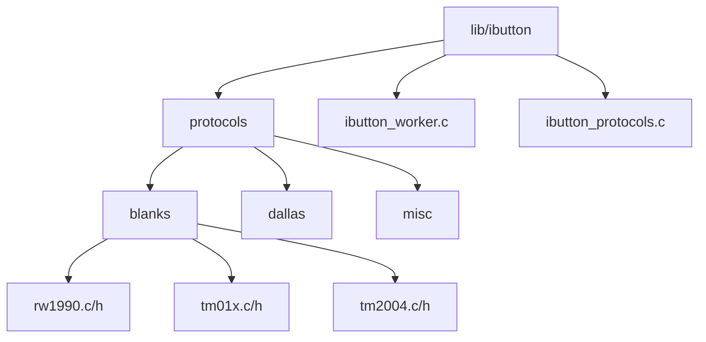
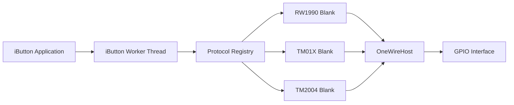
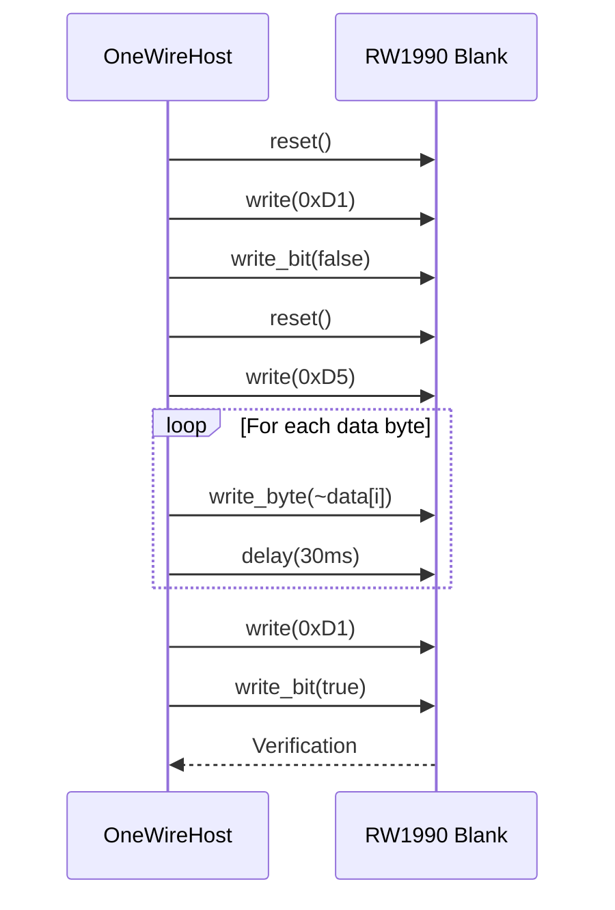
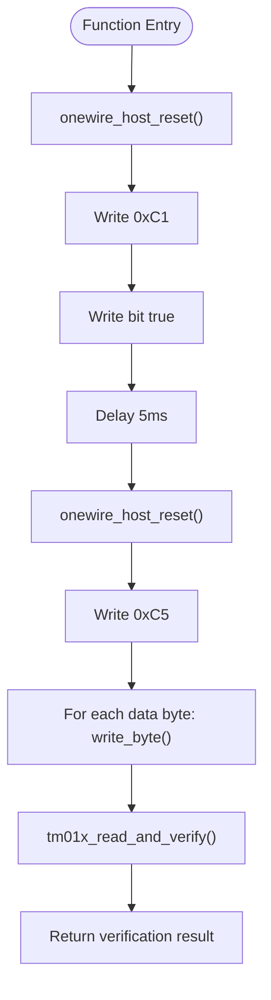
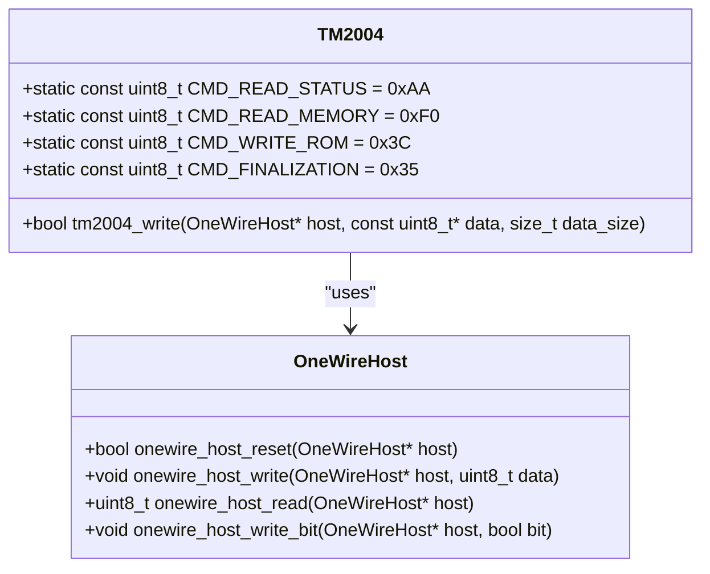
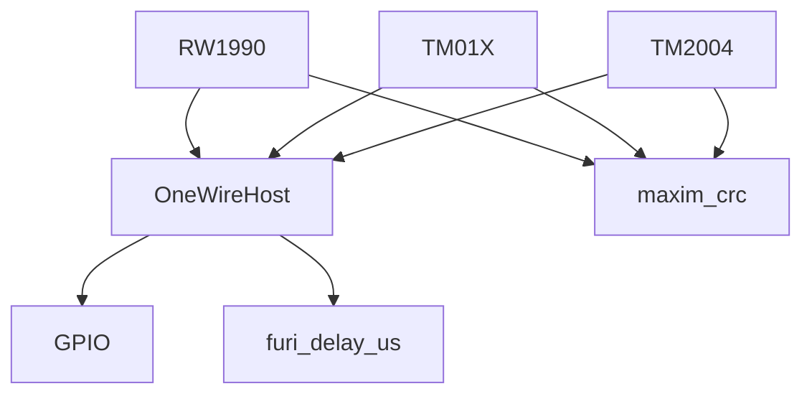

# Blanks Protocols

<cite>
**Referenced Files in This Document**   
- [rw1990.c](file://lib/ibutton/protocols/blanks/rw1990.c)
- [rw1990.h](file://lib/ibutton/protocols/blanks/rw1990.h)
- [tm01x.c](file://lib/ibutton/protocols/blanks/tm01x.c)
- [tm01x.h](file://lib/ibutton/protocols/blanks/tm01x.h)
- [tm2004.c](file://lib/ibutton/protocols/blanks/tm2004.c)
- [tm2004.h](file://lib/ibutton/protocols/blanks/tm2004.h)
- [ibutton_worker.c](file://lib/ibutton/ibutton_worker.c)
- [ibutton_protocols.c](file://lib/ibutton/ibutton_protocols.c)
</cite>

## Table of Contents
1. [Introduction](#introduction)
2. [Project Structure](#project-structure)
3. [Core Components](#core-components)
4. [Architecture Overview](#architecture-overview)
5. [Detailed Component Analysis](#detailed-component-analysis)
6. [Dependency Analysis](#dependency-analysis)
7. [Performance Considerations](#performance-considerations)
8. [Troubleshooting Guide](#troubleshooting-guide)
9. [Conclusion](#conclusion)

## Introduction
The iButton blanks protocol implementation in the Flipper Zero firmware provides a virtual emulation layer for testing and development purposes. These blank protocols simulate real iButton devices without requiring physical hardware, enabling developers to test applications, analyze protocol behavior, and debug interactions in a controlled environment. The implementation supports multiple blank device types including RW1990, TM01X, and TM2004, each emulating specific command sets and timing characteristics of their physical counterparts. This documentation details the architecture, functionality, and integration of these blank protocols within the Flipper Zero ecosystem.

## Project Structure
The blank iButton protocols are organized within the firmware's library structure under the ibutton module. The protocols are segregated into a dedicated "blanks" subdirectory, maintaining clear separation from actual hardware protocol implementations. This structure enables easy identification and management of test-only protocols while preserving the integrity of production code.

**Diagram sources**
- [lib/ibutton/protocols/blanks](file://lib/ibutton/protocols/blanks)
- [lib/ibutton/ibutton_worker.c](file://lib/ibutton/ibutton_worker.c)

**Section sources**
- [lib/ibutton/protocols/blanks](file://lib/ibutton/protocols/blanks)

## Core Components
The blank iButton protocol implementation consists of three primary components: RW1990, TM01X, and TM2004 emulators. Each component provides a complete software simulation of its respective iButton type, responding to standard 1-Wire commands with appropriate data sequences. These implementations are designed to mimic the electrical and timing characteristics of real devices, allowing for realistic testing scenarios. The components expose simple APIs that accept data buffers and 1-Wire host interfaces, enabling integration with the Flipper Zero's iButton subsystem.

**Section sources**
- [rw1990.c](file://lib/ibutton/protocols/blanks/rw1990.c#L1-L100)
- [tm01x.c](file://lib/ibutton/protocols/blanks/tm01x.c#L1-L60)
- [tm2004.c](file://lib/ibutton/protocols/blanks/tm2004.c#L1-L45)

## Architecture Overview
The blank protocol architecture integrates seamlessly with the Flipper Zero's iButton subsystem through the standard protocol registry mechanism. When activated, the blank protocol handlers intercept 1-Wire commands and generate appropriate responses without accessing physical hardware. The architecture leverages the existing 1-Wire host abstraction layer, allowing the same interface used for real devices to control virtual ones. This design ensures compatibility with existing applications and tools while providing a flexible framework for protocol testing and development.

**Diagram sources**
- [ibutton_worker.c](file://lib/ibutton/ibutton_worker.c#L1-L20)
- [ibutton_protocols.c](file://lib/ibutton/ibutton_protocols.c#L10-L30)

## Detailed Component Analysis

### RW1990 Blank Protocol Analysis
The RW1990 blank protocol implementation provides emulation for both version 1 and version 2 of the RW1990 iButton. The implementation supports write operations through specific command sequences that simulate the unlock-write-lock cycle of the physical device. Version 1 uses inverted data writing, while version 2 uses standard data representation.

**Diagram sources**
- [rw1990.c](file://lib/ibutton/protocols/blanks/rw1990.c#L15-L80)
- [one_wire_host.h](file://lib/one_wire/one_wire_host.h#L5-L20)

**Section sources**
- [rw1990.c](file://lib/ibutton/protocols/blanks/rw1990.c#L1-L100)
- [rw1990.h](file://lib/ibutton/protocols/blanks/rw1990.h#L1-L10)

### TM01X Blank Protocol Analysis
The TM01X blank protocol implementation emulates a programmable iButton device that can store Dallas-format data. The protocol uses specific timing parameters (set via onewire_host_set_timings_tm01x) to match the electrical characteristics of the physical device. The implementation supports write operations with verification through subsequent read commands.

**Diagram sources**
- [tm01x.c](file://lib/ibutton/protocols/blanks/tm01x.c#L15-L45)
- [tm01x.h](file://lib/ibutton/protocols/blanks/tm01x.h#L5-L8)

**Section sources**
- [tm01x.c](file://lib/ibutton/protocols/blanks/tm01x.c#L1-L60)
- [tm01x.h](file://lib/ibutton/protocols/blanks/tm01x.h#L1-L8)

### TM2004 Blank Protocol Analysis
The TM2004 blank protocol implementation simulates a more complex iButton device with memory addressing capabilities. The protocol supports writing data starting from address 0x0000, with each byte transmission followed by a response verification sequence. The implementation includes timing delays that match the physical device's response characteristics.

**Diagram sources**
- [tm2004.c](file://lib/ibutton/protocols/blanks/tm2004.c#L5-L20)
- [tm2004.h](file://lib/ibutton/protocols/blanks/tm2004.h#L5-L8)

**Section sources**
- [tm2004.c](file://lib/ibutton/protocols/blanks/tm2004.c#L1-L45)
- [tm2004.h](file://lib/ibutton/protocols/blanks/tm2004.h#L1-L8)

## Dependency Analysis
The blank protocol implementations depend on the core 1-Wire host abstraction layer for communication, allowing them to interface with the Flipper Zero's GPIO system through a standardized API. The implementations are independent of each other but share common dependencies on timing functions and 1-Wire protocol primitives. The integration with the iButton worker thread occurs through the protocol registry system, which dynamically loads and manages protocol handlers.

**Diagram sources**
- [rw1990.c](file://lib/ibutton/protocols/blanks/rw1990.c#L1-L10)
- [tm01x.c](file://lib/ibutton/protocols/blanks/tm01x.c#L1-L10)
- [tm2004.c](file://lib/ibutton/protocols/blanks/tm2004.c#L1-L10)

**Section sources**
- [rw1990.c](file://lib/ibutton/protocols/blanks/rw1990.c#L1-L100)
- [tm01x.c](file://lib/ibutton/protocols/blanks/tm01x.c#L1-L60)
- [tm2004.c](file://lib/ibutton/protocols/blanks/tm2004.c#L1-L45)

## Performance Considerations
The blank protocol implementations include deliberate timing delays to accurately simulate the response characteristics of physical iButton devices. These delays, ranging from 500 microseconds to 50 milliseconds, ensure that the emulated devices behave realistically in test scenarios. The performance impact is minimal since these protocols are intended for development and testing rather than production use. Memory usage is optimized by processing data byte-by-byte rather than storing complete buffers, making the implementations suitable for resource-constrained environments.

## Troubleshooting Guide
When using blank iButton protocols for testing, ensure that the correct protocol version is selected for the target application. Verify that timing parameters match the expected device behavior, as incorrect timings can cause communication failures. Check that the 1-Wire host interface is properly initialized before protocol operations. For debugging, enable verbose logging to monitor command sequences and response timings. Note that error handling in the current implementation is minimal, with TODO comments indicating areas for improvement (FL-3528, FL-3529).

**Section sources**
- [rw1990.c](file://lib/ibutton/protocols/blanks/rw1990.c#L1-L100)
- [tm2004.c](file://lib/ibutton/protocols/blanks/tm2004.c#L1-L45)

## Conclusion
The blank iButton protocol implementation in the Flipper Zero firmware provides a valuable tool for developers and testers working with iButton-based systems. By emulating various iButton types through software, the implementation enables comprehensive testing and development without requiring physical hardware. The modular design, clear separation from production protocols, and integration with the existing iButton subsystem make these blank protocols a powerful addition to the Flipper Zero's development toolkit. Future improvements should focus on enhanced error handling and expanded protocol coverage to further increase their utility.