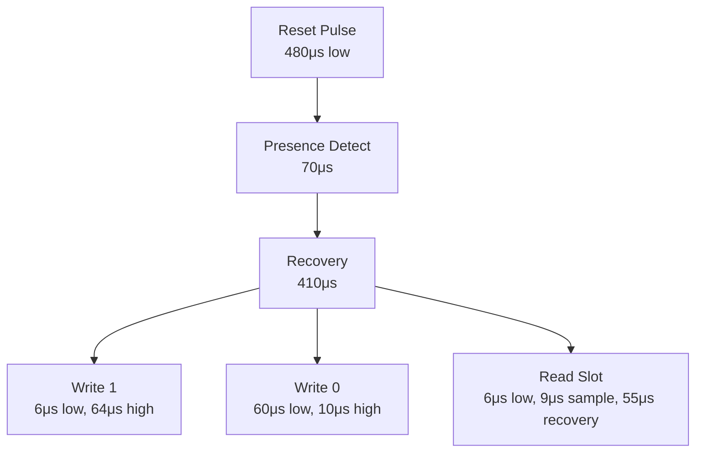
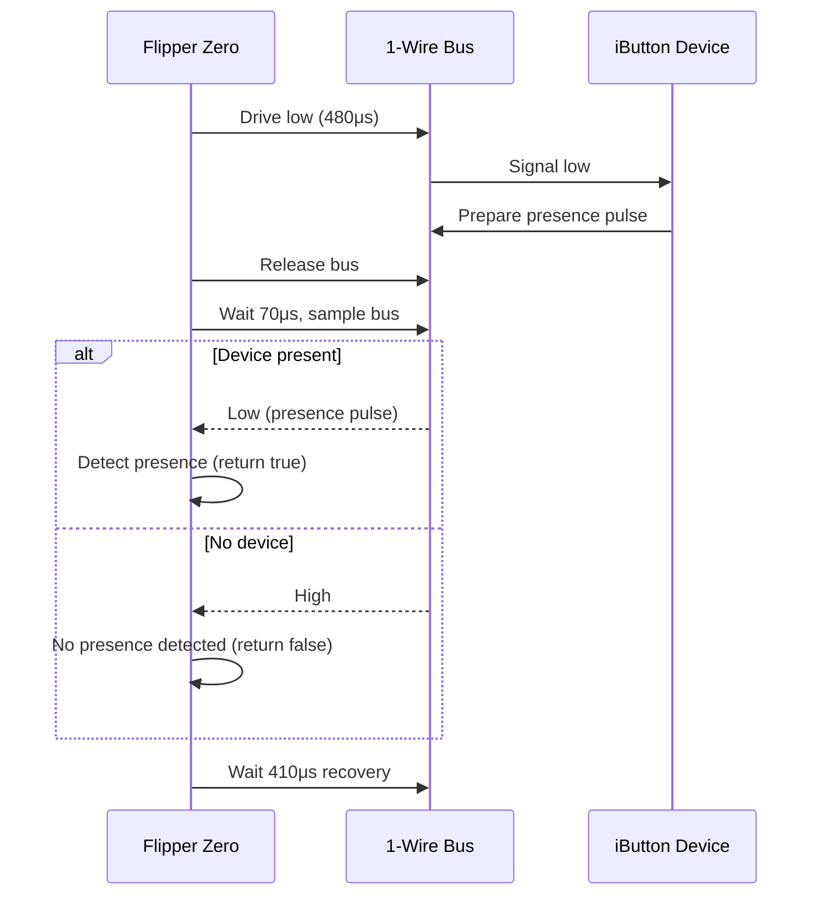
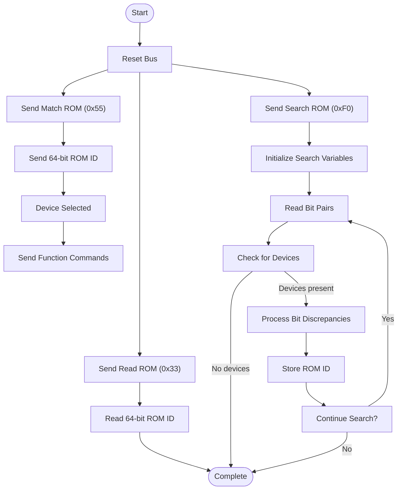
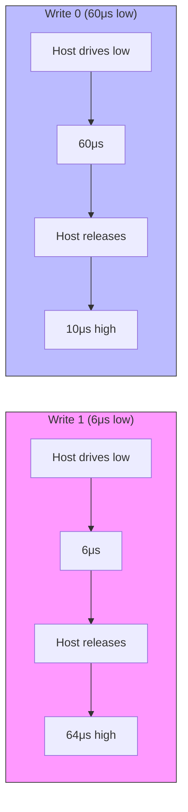
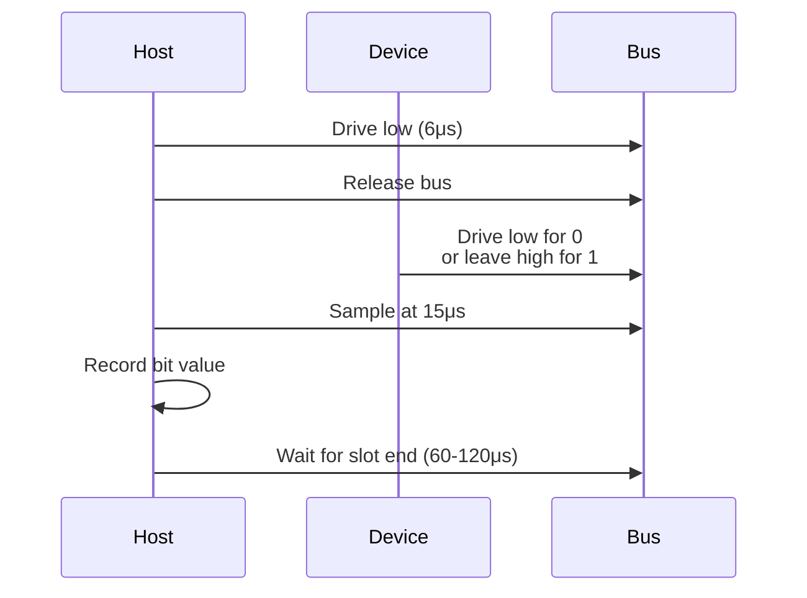
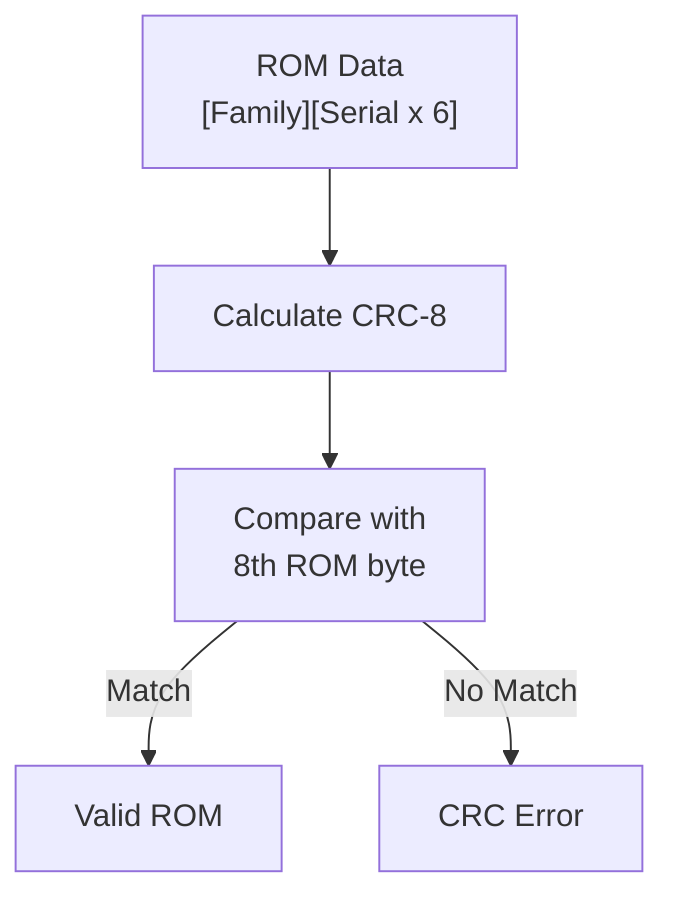
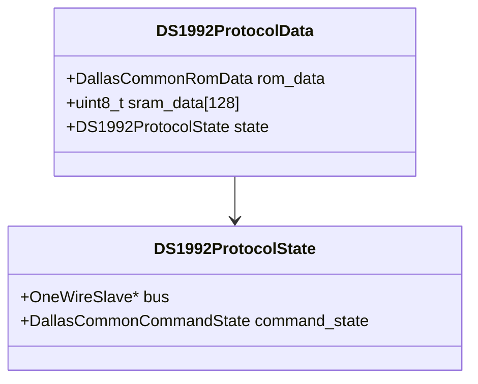
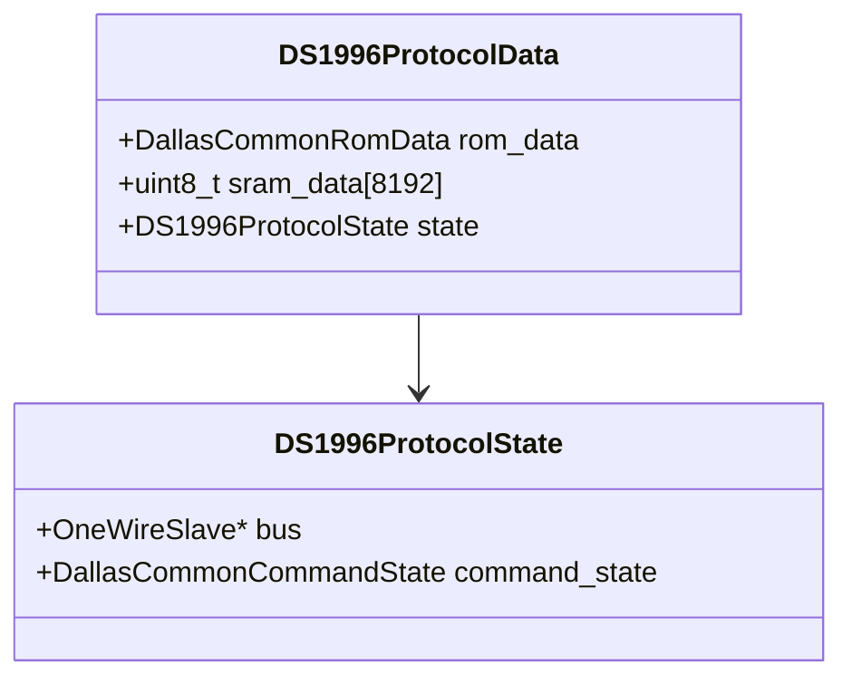

# Dallas 1-Wire Protocol

<cite>
**Referenced Files in This Document**   
- [one_wire_host.h](file://lib/one_wire/one_wire_host.h)
- [one_wire_host.c](file://lib/one_wire/one_wire_host.c)
- [maxim_crc.h](file://lib/one_wire/maxim_crc.h)
- [maxim_crc.c](file://lib/one_wire/maxim_crc.c)
- [ibutton_protocols.h](file://lib/ibutton/ibutton_protocols.h)
- [ibutton_protocols.c](file://lib/ibutton/ibutton_protocols.c)
- [protocol_ds1990.c](file://lib/ibutton/protocols/dallas/protocol_ds1990.c)
- [protocol_ds1992.c](file://lib/ibutton/protocols/dallas/protocol_ds1992.c)
- [protocol_ds1996.c](file://lib/ibutton/protocols/dallas/protocol_ds1996.c)
- [dallas_common.h](file://lib/ibutton/protocols/dallas/dallas_common.h)
- [dallas_common.c](file://lib/ibutton/protocols/dallas/dallas_common.c)
- [one_wire_slave.h](file://lib/one_wire/one_wire_slave.h)
- [one_wire_slave.c](file://lib/one_wire/one_wire_slave.c)
</cite>

## Table of Contents
1. [Introduction](#introduction)
2. [Physical Layer Specifications](#physical-layer-specifications)
3. [Communication Sequence](#communication-sequence)
4. [Data Transmission Mechanisms](#data-transmission-mechanisms)
5. [Error Detection with CRC](#error-detection-with-crc)
6. [Memory Organization of iButton Models](#memory-organization-of-ibutton-models)
7. [Code Implementation Examples](#code-implementation-examples)
8. [Security Considerations](#security-considerations)

## Introduction
The Dallas 1-Wire protocol implementation in the Flipper Zero firmware provides comprehensive support for reading, writing, and emulating various iButton devices. This document details the complete technical specification of the implementation, covering physical layer requirements, communication protocols, data structures, and device-specific implementations. The Flipper Zero's 1-Wire system is designed to interact with a wide range of Dallas Semiconductor iButton models, enabling users to clone, analyze, and emulate these devices for various applications.

**Section sources**
- [one_wire_host.h](file://lib/one_wire/one_wire_host.h#L1-L134)
- [ibutton_protocols.h](file://lib/ibutton/ibutton_protocols.h#L1-L209)

## Physical Layer Specifications

### Voltage Levels and Bus Topology
The Dallas 1-Wire protocol uses a single data line with open-drain configuration, requiring a pull-up resistor to maintain the bus in a high state when no device is actively driving it low. The Flipper Zero implements this using GPIO pins configured in open-drain mode with software-controlled timing.

The bus operates with the following voltage characteristics:
- **Idle state**: High (approximately 3.3V, matching the Flipper Zero's logic level)
- **Active low state**: Near 0V when devices or the host drive the line
- **Pull-up mechanism**: Software-controlled via GPIO configuration

The bus topology supports multiple devices connected in parallel to the same data line, with each device having a unique 64-bit ROM identifier that enables individual addressing.

### Timing Requirements
The 1-Wire protocol has strict timing requirements for reliable communication. The Flipper Zero implementation supports three timing profiles:

**Standard Speed Timings**:
- Reset pulse: 480μs low, 70μs presence detect, 410μs recovery
- Write 1: 6μs low, 64μs high
- Write 0: 60μs low, 10μs high
- Read slot: 6μs low, 9μs sample, 55μs recovery

**Overdrive Speed Timings**:
- Reset pulse: 70μs low, 9μs presence detect, 40μs recovery
- Write 1: 1μs low, 8μs high
- Write 0: 8μs low, 3μs high
- Read slot: 1μs low, 1μs sample, 7μs recovery

**TM01x Specific Timings**:
- Reset pulse: 740μs low, 140μs presence detect, 410μs recovery
- Write 1: 5μs low, 80μs high
- Write 0: 70μs low, 10μs high
- Read slot: 5μs low, 5μs sample, 70μs recovery



**Diagram sources**
- [one_wire_host.c](file://lib/one_wire/one_wire_host.c#L15-L85)

**Section sources**
- [one_wire_host.h](file://lib/one_wire/one_wire_host.h#L1-L134)
- [one_wire_host.c](file://lib/one_wire/one_wire_host.c#L1-L383)

## Communication Sequence

### Bus Initialization and Presence Detection
The 1-Wire communication begins with a reset sequence that also detects the presence of devices on the bus. The Flipper Zero host initiates this sequence by:

1. Driving the bus low for 480μs (standard speed)
2. Releasing the bus and waiting 70μs for device response
3. Sampling the bus state to detect presence pulse
4. Waiting 410μs for bus recovery



**Diagram sources**
- [one_wire_host.c](file://lib/one_wire/one_wire_host.c#L100-L140)

**Section sources**
- [one_wire_host.c](file://lib/one_wire/one_wire_host.c#L100-L140)

### ROM Commands
The 1-Wire protocol defines several ROM commands for device discovery and selection:

**Read ROM (0x33)**: Reads the 64-bit ROM identifier from a single device on the bus. This command cannot be used when multiple devices are present.

**Match ROM (0x55)**: Selects a specific device by sending its 64-bit ROM identifier. Only the matching device will respond to subsequent commands.

**Search ROM (0xF0)**: Discovers all devices on the bus through a binary tree search algorithm. The host iterates through all possible ROM identifier combinations, using the device responses to narrow down the search.



**Diagram sources**
- [one_wire_host.c](file://lib/one_wire/one_wire_host.c#L300-L382)
- [protocol_ds1990.c](file://lib/ibutton/protocols/dallas/protocol_ds1990.c#L100-L120)

**Section sources**
- [one_wire_host.c](file://lib/one_wire/one_wire_host.c#L300-L382)

## Data Transmission Mechanisms

### Bit Timing for Write Operations
The 1-Wire protocol uses time slots to transmit bits, with different timing for write-1 and write-0 operations.

**Write-1 Time Slot**:
- Host drives bus low for 1-15μs
- Host releases bus, allowing pull-up resistor to return line to high
- Total time slot duration: 60-120μs

**Write-0 Time Slot**:
- Host drives bus low for 60-120μs
- Host releases bus
- Total time slot duration: 60-120μs

The receiver samples the bus in the middle of the time slot (15μs after the start) to determine the transmitted bit value.



**Diagram sources**
- [one_wire_host.c](file://lib/one_wire/one_wire_host.c#L145-L180)

**Section sources**
- [one_wire_host.c](file://lib/one_wire/one_wire_host.c#L145-L180)

### Bit Timing for Read Operations
Read operations require the host to initiate a read time slot by briefly pulling the bus low, then releasing it to allow the device to control the line.

**Read Time Slot Sequence**:
1. Host pulls bus low for 1-15μs
2. Host releases bus
3. Device responds within 15μs by pulling bus low (for 0) or leaving it high (for 1)
4. Host samples bus state 15μs after initiating the slot
5. Slot ends after 60-120μs

The Flipper Zero implementation samples the bus 9μs after releasing it, well within the valid sampling window.



**Diagram sources**
- [one_wire_host.c](file://lib/one_wire/one_wire_host.c#L145-L180)

**Section sources**
- [one_wire_host.c](file://lib/one_wire/one_wire_host.c#L145-L180)

## Error Detection with CRC

### CRC-8 Calculation
The Dallas 1-Wire protocol uses CRC-8 for error detection in ROM data. The Flipper Zero implements the standard Dallas Semiconductor CRC-8 algorithm with polynomial x^8 + x^5 + x^4 + 1 (0x8C).

```c
uint8_t maxim_crc8(const uint8_t* data, const uint8_t data_size, const uint8_t crc_init) {
    uint8_t crc = crc_init;
    
    for(uint8_t index = 0; index < data_size; ++index) {
        uint8_t input_byte = data[index];
        for(uint8_t bit_position = 0; bit_position < 8; ++bit_position) {
            const uint8_t mix = (crc ^ input_byte) & 0x01;
            crc >>= 1;
            if(mix != 0) crc ^= 0x8C;
            input_byte >>= 1;
        }
    }
    return crc;
}
```

The CRC is calculated over the first 7 bytes of the ROM (family code and serial number), and the result should match the 8th byte (CRC byte) for valid data.



**Diagram sources**
- [maxim_crc.c](file://lib/one_wire/maxim_crc.c#L1-L20)
- [dallas_common.c](file://lib/ibutton/protocols/dallas/dallas_common.c#L1-L50)

**Section sources**
- [maxim_crc.c](file://lib/one_wire/maxim_crc.c#L1-L20)

## Memory Organization of iButton Models

### DS1990 (0x01 Family Code)
The DS1990 is a simple identification button with no additional memory. It contains only the 64-bit ROM with:
- 8-bit family code (0x01)
- 48-bit unique serial number
- 8-bit CRC

The Flipper Zero can read and write DS1990 identifiers, supporting multiple blank types including RW1990, TM01X, TM2004, and Dallas standard.

### DS1992 (0x08 Family Code)
The DS1992 includes 128 bytes of SRAM memory in addition to the standard ROM. The memory organization is:
- 64-bit ROM (same structure as DS1990)
- 128 bytes of SRAM, organized in 32 pages of 4 bytes each
- Memory can be read and written using specific function commands



**Diagram sources**
- [protocol_ds1992.c](file://lib/ibutton/protocols/dallas/protocol_ds1992.c#L1-L50)

**Section sources**
- [protocol_ds1992.c](file://lib/ibutton/protocols/dallas/protocol_ds1992.c#L1-L235)

### DS1996 (0x0C Family Code)
The DS1996 features 8KB of SRAM memory and supports overdrive mode for faster communication. Its memory organization includes:
- 64-bit ROM (same structure as DS1990)
- 8192 bytes of SRAM, organized in 256 pages of 32 bytes each
- Overdrive mode support (10x faster communication)
- Memory can be accessed in overdrive mode using specific commands

The DS1996 implementation in Flipper Zero includes overdrive support, automatically switching to overdrive mode for memory operations and then returning to standard speed.



**Diagram sources**
- [protocol_ds1996.c](file://lib/ibutton/protocols/dallas/protocol_ds1996.c#L1-L50)

**Section sources**
- [protocol_ds1996.c](file://lib/ibutton/protocols/dallas/protocol_ds1996.c#L1-L270)

### Other Supported Models
The Flipper Zero firmware supports numerous other iButton models through the same architectural framework:

**DS2401/DS2411**: Basic identification buttons similar to DS1990 with 64-bit ROM only.

**DS2432**: EEPROM-based iButton with password protection and 256 bytes of non-volatile memory.

**DS28E04**: 512-bit EEPROM with write protection and 64-bit page locking.

**DS28E17**: I2C-1Wire bridge with 32 bytes of user EEPROM.

**DS28E22**: DeepCover secure authenticator with 1K-bit user EEPROM and ECDSA authentication.

**DS28E25**: 16K-bit EEPROM with write protection and page locking.

**DS28E30**: ECDSA P256-based secure authenticator.

**DS28E80**: Single-contact secure authenticator with SHA-256 authentication.

Each model is implemented as a separate protocol module that follows the same interface pattern, allowing the core 1-Wire host to interact with them uniformly.

## Code Implementation Examples

### Reading an iButton Device
The process of reading an iButton device involves initializing the 1-Wire host, resetting the bus, and reading the ROM data:

```c
OneWireHost* host = onewire_host_alloc(&gpio_pin);
onewire_host_start(host);

if(onewire_host_reset(host)) {
    onewire_host_write(host, DALLAS_COMMON_CMD_READ_ROM);
    uint8_t rom[8];
    onewire_host_read_bytes(host, rom, 8);
    
    // Verify CRC
    if(maxim_crc8(rom, 7, MAXIM_CRC8_INIT) == rom[7]) {
        // Valid ROM read
    }
}

onewire_host_stop(host);
onewire_host_free(host);
```

### Device Search Algorithm
The Flipper Zero implements the standard 1-Wire search algorithm to discover all devices on the bus:

```c
bool onewire_host_search(OneWireHost* host, uint8_t* new_addr, OneWireHostSearchMode mode) {
    // Initialize search variables
    uint8_t id_bit_number = 1;
    uint8_t last_zero = 0;
    uint8_t rom_byte_number = 0;
    uint8_t rom_byte_mask = 1;
    
    // Reset and send search command
    if(!onewire_host_reset(host)) return false;
    onewire_host_write(host, mode == OneWireHostSearchModeNormal ? 0xF0 : 0xEC);
    
    // Search loop
    do {
        uint8_t id_bit = onewire_host_read_bit(host);
        uint8_t cmp_id_bit = onewire_host_read_bit(host);
        
        if(id_bit == 1 && cmp_id_bit == 1) {
            break; // No devices present
        } else if(id_bit != cmp_id_bit) {
            // All devices agree, use the bit value
            search_direction = id_bit;
        } else {
            // Discrepancy, resolve based on search state
            if(id_bit_number < host->last_discrepancy) {
                search_direction = (host->saved_rom[rom_byte_number] & rom_byte_mask) > 0;
            } else {
                search_direction = (id_bit_number == host->last_discrepancy);
            }
            
            if(search_direction == 0) {
                last_zero = id_bit_number;
                if(last_zero < 9) host->last_family_discrepancy = last_zero;
            }
        }
        
        // Update ROM byte and write search direction
        if(search_direction) {
            host->saved_rom[rom_byte_number] |= rom_byte_mask;
        } else {
            host->saved_rom[rom_byte_number] &= ~rom_byte_mask;
        }
        
        onewire_host_write_bit(host, search_direction);
        
        // Move to next bit
        id_bit_number++;
        rom_byte_mask <<= 1;
        if(rom_byte_mask == 0) {
            rom_byte_number++;
            rom_byte_mask = 1;
        }
    } while(rom_byte_number < 8);
    
    // Store result
    if(id_bit_number >= 65) {
        memcpy(new_addr, host->saved_rom, 8);
        host->last_discrepancy = last_zero;
        return true;
    }
    
    return false;
}
```

### iButton Emulation
The Flipper Zero can emulate iButton devices using the 1-Wire slave implementation:

```c
void dallas_ds1992_emulate(OneWireSlave* bus, iButtonProtocolData* protocol_data) {
    DS1992ProtocolData* data = protocol_data;
    data->state.bus = bus;
    
    // Set up callbacks for reset and command handling
    onewire_slave_set_reset_callback(bus, dallas_ds1992_reset_callback, protocol_data);
    onewire_slave_set_command_callback(bus, dallas_ds1992_command_callback, protocol_data);
}

static bool dallas_ds1992_command_callback(uint8_t command, void* context) {
    DS1992ProtocolData* data = context;
    OneWireSlave* bus = data->state.bus;
    
    switch(command) {
        case DALLAS_COMMON_CMD_SEARCH_ROM:
            if(data->state.command_state == DallasCommonCommandStateIdle) {
                data->state.command_state = DallasCommonCommandStateRomCmd;
                return dallas_common_emulate_search_rom(bus, &data->rom_data);
            } else if(data->state.command_state == DallasCommonCommandStateRomCmd) {
                data->state.command_state = DallasCommonCommandStateMemCmd;
                dallas_common_emulate_read_mem(bus, data->sram_data, 128);
                return false;
            }
            break;
            
        case DALLAS_COMMON_CMD_READ_ROM:
            if(data->state.command_state == DallasCommonCommandStateIdle) {
                data->state.command_state = DallasCommonCommandStateRomCmd;
                return dallas_common_emulate_read_rom(bus, &data->rom_data);
            }
            break;
            
        case DALLAS_COMMON_CMD_SKIP_ROM:
            if(data->state.command_state == DallasCommonCommandStateIdle) {
                data->state.command_state = DallasCommonCommandStateRomCmd;
                return true;
            }
            break;
    }
    
    return false;
}
```

**Section sources**
- [one_wire_host.c](file://lib/one_wire/one_wire_host.c#L1-L383)
- [protocol_ds1990.c](file://lib/ibutton/protocols/dallas/protocol_ds1990.c#L1-L164)
- [protocol_ds1992.c](file://lib/ibutton/protocols/dallas/protocol_ds1992.c#L1-L235)

## Security Considerations

### Password Protection in DS2432
The DS2432 model includes password protection for its EEPROM memory. The Flipper Zero implementation would need to handle password authentication before accessing protected memory regions. The password is stored in a dedicated register and must be presented in subsequent sessions to gain access.

### Secure Authentication in DS28E22
The DS28E22 is a DeepCover secure authenticator that uses ECDSA (Elliptic Curve Digital Signature Algorithm) for authentication. It contains a unique 64-bit ROM identifier and a factory-programmed 256-bit ECDSA public key. The device can sign challenges using its private key, allowing verification of authenticity without exposing the private key.

The Flipper Zero's implementation framework supports such secure devices through the protocol interface, though specific ECDSA operations would require additional cryptographic libraries and secure key storage mechanisms.

### General Security Implications
When using the Flipper Zero to read, write, or emulate iButton devices, users should be aware of the security implications:

- Cloning iButton devices may violate access control policies
- Emulating secure devices could potentially bypass security systems
- Storing sensitive identifiers on the device creates security risks
- The open nature of the platform means security features can be analyzed and potentially circumvented

The Flipper Zero community encourages responsible use of these capabilities for educational and security research purposes only.

**Section sources**
- [ibutton_protocols.h](file://lib/ibutton/ibutton_protocols.h#L1-L209)
- [protocol_ds1990.c](file://lib/ibutton/protocols/dallas/protocol_ds1990.c#L1-L164)
- [protocol_ds1992.c](file://lib/ibutton/protocols/dallas/protocol_ds1992.c#L1-L235)
- [protocol_ds1996.c](file://lib/ibutton/protocols/dallas/protocol_ds1996.c#L1-L270)