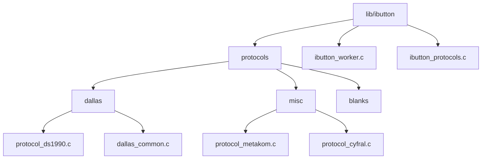
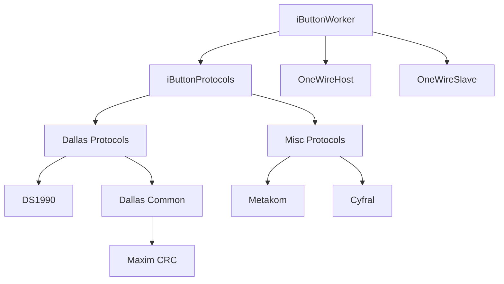
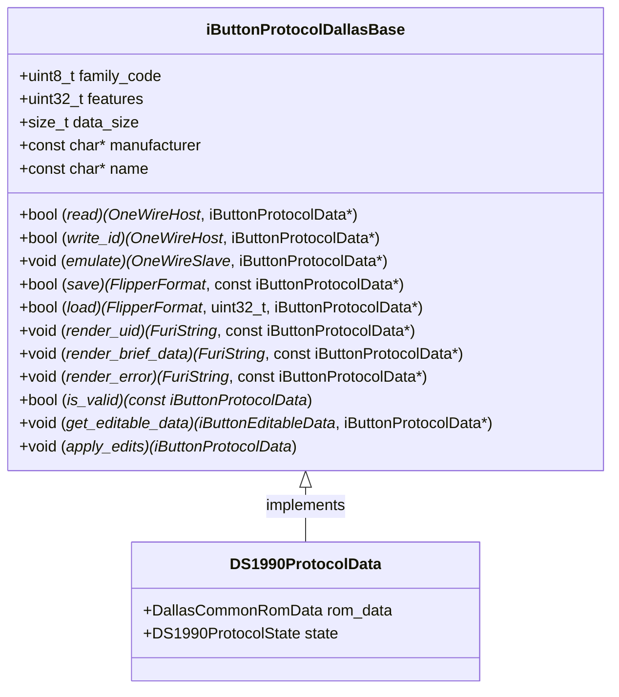
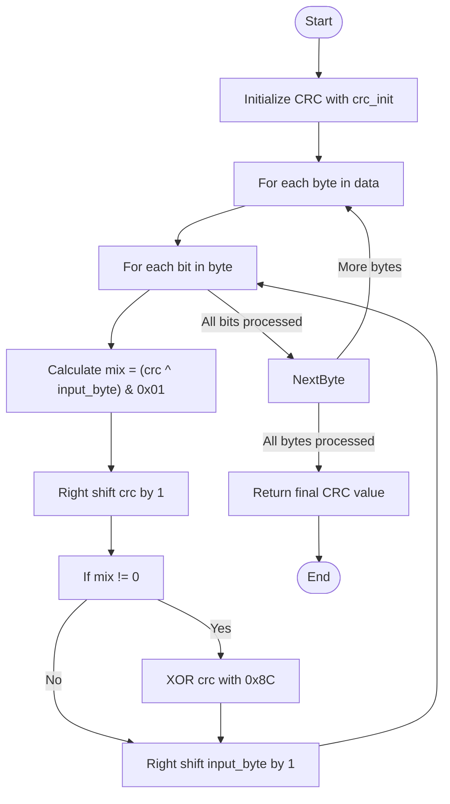
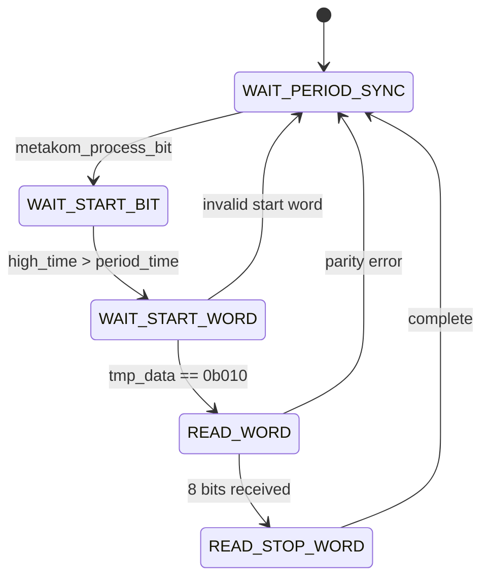
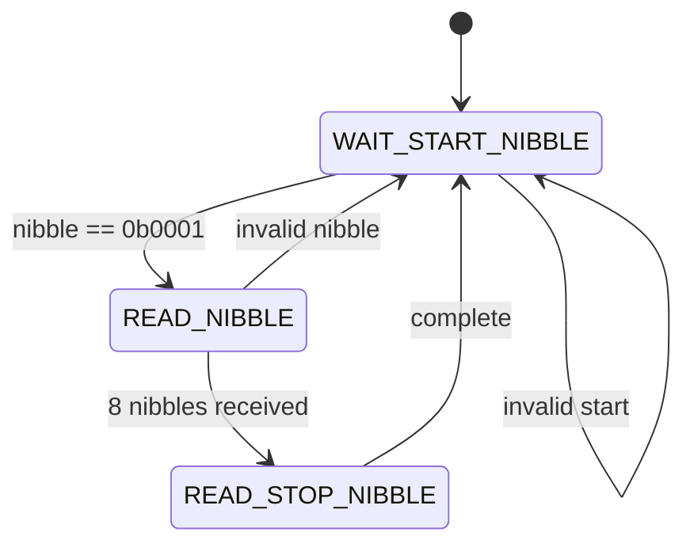
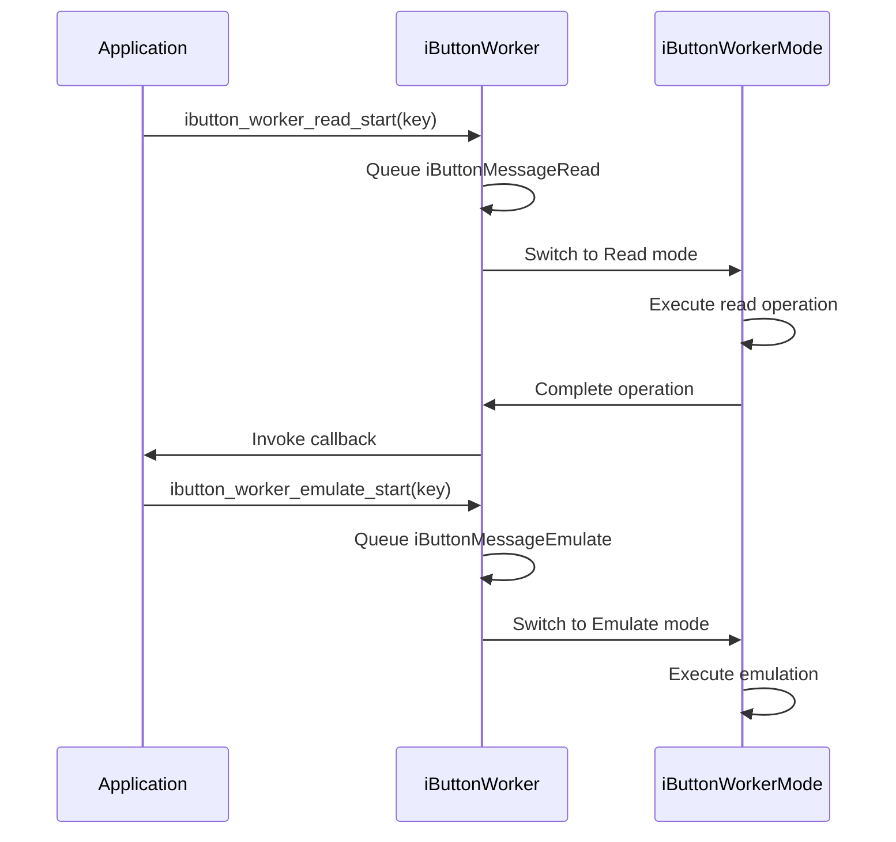
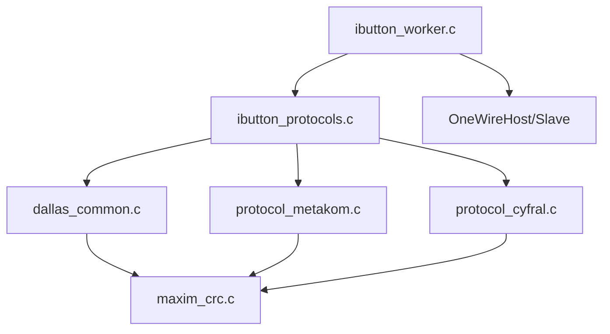

# Miscellaneous Protocols

<cite>
**Referenced Files in This Document**   
- [protocol_ds1990.c](file://lib/ibutton/protocols/dallas/protocol_ds1990.c)
- [dallas_common.c](file://lib/ibutton/protocols/dallas/dallas_common.c)
- [maxim_crc.c](file://lib/one_wire/maxim_crc.c)
- [protocol_metakom.c](file://lib/ibutton/protocols/misc/protocol_metakom.c)
- [protocol_cyfral.c](file://lib/ibutton/protocols/misc/protocol_cyfral.c)
- [ibutton_worker.c](file://lib/ibutton/ibutton_worker.c)
- [ibutton_protocols.c](file://lib/ibutton/ibutton_protocols.c)
</cite>

## Table of Contents
1. [Introduction](#introduction)
2. [Project Structure](#project-structure)
3. [Core Components](#core-components)
4. [Architecture Overview](#architecture-overview)
5. [Detailed Component Analysis](#detailed-component-analysis)
6. [Dependency Analysis](#dependency-analysis)
7. [Performance Considerations](#performance-considerations)
8. [Troubleshooting Guide](#troubleshooting-guide)
9. [Conclusion](#conclusion)

## Introduction
This document provides comprehensive documentation for the miscellaneous iButton protocols and utilities in the Flipper Zero firmware. It details the implementation of specialized protocol handlers, including the Dallas 77 protocol variant used in specific access control systems. The document also covers the CRC calculation utilities (CRC-8) used throughout the iButton system for data integrity verification, including algorithm details. It explains how these miscellaneous protocols integrate with the main iButton system, their use cases in real-world access control systems, and examples of how they are invoked during iButton reading and emulation operations.

## Project Structure
The iButton protocol implementations are organized within the `lib/ibutton/protocols` directory, which contains subdirectories for different protocol families: `dallas`, `misc`, and `blanks`. The core functionality is implemented in C files within these directories, with corresponding header files defining interfaces. The main iButton worker and protocol management components are located in the parent `ibutton` directory.

**Diagram sources**
- [protocol_ds1990.c](file://lib/ibutton/protocols/dallas/protocol_ds1990.c)
- [dallas_common.c](file://lib/ibutton/protocols/dallas/dallas_common.c)
- [protocol_metakom.c](file://lib/ibutton/protocols/misc/protocol_metakom.c)
- [protocol_cyfral.c](file://lib/ibutton/protocols/misc/protocol_cyfral.c)
- [ibutton_worker.c](file://lib/ibutton/ibutton_worker.c)
- [ibutton_protocols.c](file://lib/ibutton/ibutton_protocols.c)

**Section sources**
- [protocol_ds1990.c](file://lib/ibutton/protocols/dallas/protocol_ds1990.c)
- [dallas_common.c](file://lib/ibutton/protocols/dallas/dallas_common.c)
- [protocol_metakom.c](file://lib/ibutton/protocols/misc/protocol_metakom.c)
- [protocol_cyfral.c](file://lib/ibutton/protocols/misc/protocol_cyfral.c)
- [ibutton_worker.c](file://lib/ibutton/ibutton_worker.c)
- [ibutton_protocols.c](file://lib/ibutton/ibutton_protocols.c)

## Core Components
The core components of the iButton system include the protocol implementations for Dallas and miscellaneous iButton types, the CRC calculation utility, and the worker thread that manages protocol operations. The system is designed to support various iButton protocols through a modular architecture that allows for easy addition of new protocols.

**Section sources**
- [protocol_ds1990.c](file://lib/ibutton/protocols/dallas/protocol_ds1990.c)
- [dallas_common.c](file://lib/ibutton/protocols/dallas/dallas_common.c)
- [maxim_crc.c](file://lib/one_wire/maxim_crc.c)
- [ibutton_worker.c](file://lib/ibutton/ibutton_worker.c)
- [ibutton_protocols.c](file://lib/ibutton/ibutton_protocols.c)

## Architecture Overview
The iButton system architecture follows a modular design with clear separation between protocol implementations, data management, and hardware interaction. The system uses a worker thread model to handle asynchronous operations, with message passing between components. Protocol implementations are organized into groups, with shared functionality abstracted into common modules.

**Diagram sources**
- [ibutton_worker.c](file://lib/ibutton/ibutton_worker.c#L0-L217)
- [ibutton_protocols.c](file://lib/ibutton/ibutton_protocols.c#L0-L382)
- [protocol_ds1990.c](file://lib/ibutton/protocols/dallas/protocol_ds1990.c#L0-L164)
- [dallas_common.c](file://lib/ibutton/protocols/dallas/dallas_common.c#L0-L268)
- [protocol_metakom.c](file://lib/ibutton/protocols/misc/protocol_metakom.c#L0-L335)
- [protocol_cyfral.c](file://lib/ibutton/protocols/misc/protocol_cyfral.c#L0-L359)
- [maxim_crc.c](file://lib/one_wire/maxim_crc.c#L0-L20)

## Detailed Component Analysis

### Dallas iButton Protocol Implementation
The Dallas iButton protocol implementation provides support for various Dallas Semiconductor iButton types, including the DS1990. The implementation follows a structured approach with shared functionality in the `dallas_common` module and specific implementations for each protocol variant.

#### Protocol Structure
The Dallas protocol implementation uses a base structure that defines common operations and data handling methods. Each specific protocol inherits from this base and implements its own variations.

**Diagram sources**
- [protocol_ds1990.c](file://lib/ibutton/protocols/dallas/protocol_ds1990.c#L20-L164)
- [dallas_common.c](file://lib/ibutton/protocols/dallas/dallas_common.c#L0-L268)

**Section sources**
- [protocol_ds1990.c](file://lib/ibutton/protocols/dallas/protocol_ds1990.c#L0-L164)

### CRC Calculation Utility
The CRC calculation utility provides CRC-8 implementation based on Maxim's polynomial (x^8 + x^5 + x^4 + 1) for data integrity verification in iButton systems. The implementation uses a bit-by-bit calculation algorithm rather than a lookup table.

#### CRC-8 Algorithm
The CRC-8 calculation follows the standard algorithm for the Maxim polynomial, processing each bit of the input data and updating the CRC value based on XOR operations.

**Diagram sources**
- [maxim_crc.c](file://lib/one_wire/maxim_crc.c#L0-L20)

**Section sources**
- [maxim_crc.c](file://lib/one_wire/maxim_crc.c#L0-L20)

### Miscellaneous Protocol Implementations
The miscellaneous protocols directory contains implementations for non-Dallas iButton types used in various access control systems. These include Metakom and Cyfral protocols, which use different modulation schemes and data encoding methods.

#### Metakom Protocol
The Metakom protocol uses a Manchester-like encoding with specific timing parameters for data transmission. The implementation includes a state machine for decoding the signal.

**Diagram sources**
- [protocol_metakom.c](file://lib/ibutton/protocols/misc/protocol_metakom.c#L0-L335)

**Section sources**
- [protocol_metakom.c](file://lib/ibutton/protocols/misc/protocol_metakom.c#L0-L335)

#### Cyfral Protocol
The Cyfral protocol uses a 4-bit nibble encoding scheme with specific start and stop sequences. The implementation processes the signal in nibbles rather than individual bits.

**Diagram sources**
- [protocol_cyfral.c](file://lib/ibutton/protocols/misc/protocol_cyfral.c#L0-L359)

**Section sources**
- [protocol_cyfral.c](file://lib/ibutton/protocols/misc/protocol_cyfral.c#L0-L359)

### iButton Worker and Protocol Integration
The iButton worker thread manages the execution of protocol operations, providing a centralized interface for reading, writing, and emulation functions. The protocol system integrates with the worker through a message-passing architecture.

#### Worker Thread Operation
The worker thread processes messages from a queue, switching between different operational modes based on the message type. This allows for asynchronous execution of iButton operations.

**Diagram sources**
- [ibutton_worker.c](file://lib/ibutton/ibutton_worker.c#L0-L217)
- [ibutton_protocols.c](file://lib/ibutton/ibutton_protocols.c#L0-L382)

**Section sources**
- [ibutton_worker.c](file://lib/ibutton/ibutton_worker.c#L0-L217)
- [ibutton_protocols.c](file://lib/ibutton/ibutton_protocols.c#L0-L382)

## Dependency Analysis
The iButton system components have a clear dependency hierarchy, with higher-level components depending on lower-level utilities. The protocol implementations depend on the CRC utility for data integrity, while the worker thread depends on the protocol system for operation execution.

**Diagram sources**
- [ibutton_worker.c](file://lib/ibutton/ibutton_worker.c#L0-L217)
- [ibutton_protocols.c](file://lib/ibutton/ibutton_protocols.c#L0-L382)
- [dallas_common.c](file://lib/ibutton/protocols/dallas/dallas_common.c#L0-L268)
- [protocol_metakom.c](file://lib/ibutton/protocols/misc/protocol_metakom.c#L0-L335)
- [protocol_cyfral.c](file://lib/ibutton/protocols/misc/protocol_cyfral.c#L0-L359)
- [maxim_crc.c](file://lib/one_wire/maxim_crc.c#L0-L20)

**Section sources**
- [ibutton_worker.c](file://lib/ibutton/ibutton_worker.c#L0-L217)
- [ibutton_protocols.c](file://lib/ibutton/ibutton_protocols.c#L0-L382)
- [dallas_common.c](file://lib/ibutton/protocols/dallas/dallas_common.c#L0-L268)
- [protocol_metakom.c](file://lib/ibutton/protocols/misc/protocol_metakom.c#L0-L335)
- [protocol_cyfral.c](file://lib/ibutton/protocols/misc/protocol_cyfral.c#L0-L359)
- [maxim_crc.c](file://lib/one_wire/maxim_crc.c#L0-L20)

## Performance Considerations
The iButton protocol implementations are designed with performance in mind, using efficient algorithms for CRC calculation and signal processing. The bit-by-bit CRC implementation, while not the fastest possible, provides a good balance between code size and execution speed. The worker thread model ensures that iButton operations do not block the main application flow.

The protocol state machines are implemented with minimal memory overhead, using simple variables to track state rather than complex data structures. This is particularly important for the Metakom and Cyfral protocols, which process signals in real-time and must respond quickly to incoming data.

## Troubleshooting Guide
When working with iButton protocols, common issues include CRC validation failures, timing problems during emulation, and incorrect protocol detection. The following guidelines can help diagnose and resolve these issues:

1. **CRC Validation Failures**: Verify that the CRC calculation is using the correct initial value and that all data bytes are included in the calculation. Check that the data being validated matches the expected format for the specific iButton type.

2. **Timing Issues**: Ensure that the timing parameters for signal generation and detection are correctly configured for the target protocol. The Metakom and Cyfral protocols are particularly sensitive to timing variations.

3. **Protocol Detection**: When a key is not being recognized correctly, verify that the protocol detection logic is checking for the correct family code or signature. The system uses the first byte of the ROM data as a family code to identify Dallas iButtons.

4. **Emulation Problems**: During emulation, ensure that the OneWire slave callbacks are properly registered and that the timing between reset pulses and command responses meets the protocol specifications.

**Section sources**
- [dallas_common.c](file://lib/ibutton/protocols/dallas/dallas_common.c#L0-L268)
- [maxim_crc.c](file://lib/one_wire/maxim_crc.c#L0-L20)
- [protocol_metakom.c](file://lib/ibutton/protocols/misc/protocol_metakom.c#L0-L335)
- [protocol_cyfral.c](file://lib/ibutton/protocols/misc/protocol_cyfral.c#L0-L359)

## Conclusion
The miscellaneous iButton protocols and utilities in the Flipper Zero firmware provide a comprehensive system for working with various iButton types used in access control systems. The modular architecture allows for easy addition of new protocols while maintaining a consistent interface for applications. The CRC calculation utility ensures data integrity across all protocol implementations, and the worker thread model provides efficient, non-blocking operation. The system supports both reading and emulation of iButton keys, making it a versatile tool for access control analysis and testing.