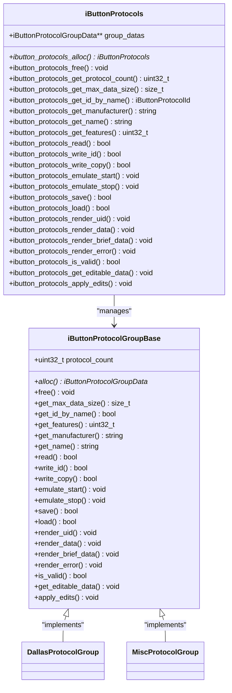
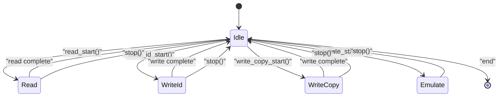
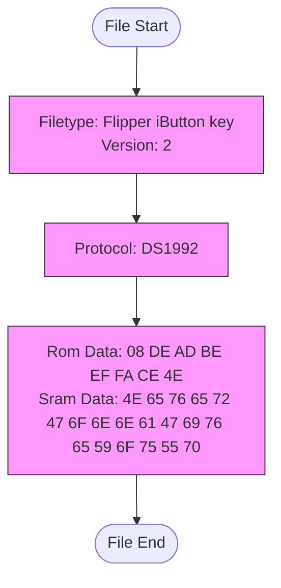

# iButton Implementation

<cite>
**Referenced Files in This Document**   
- [ibutton_key.h](file://lib/ibutton/ibutton_key.h)
- [ibutton_key.c](file://lib/ibutton/ibutton_key.c)
- [ibutton_protocols.h](file://lib/ibutton/ibutton_protocols.h)
- [ibutton_protocols.c](file://lib/ibutton/ibutton_protocols.c)
- [ibutton_worker.h](file://lib/ibutton/ibutton_worker.h)
- [ibutton_worker.c](file://lib/ibutton/ibutton_worker.c)
- [ibutton_worker_modes.c](file://lib/ibutton/ibutton_worker_modes.c)
- [protocol_common.h](file://lib/ibutton/protocols/protocol_common.h)
- [protocol_group_base.h](file://lib/ibutton/protocols/protocol_group_base.h)
- [protocol_group_defs.h](file://lib/ibutton/protocols/protocol_group_defs.h)
- [iButtonFileFormat.md](file://documentation/file_formats/iButtonFileFormat.md)
- [flipper_format.h](file://lib/flipper_format/flipper_format.h)
</cite>

## Table of Contents
1. [Introduction](#introduction)
2. [Core Data Structures](#core-data-structures)
3. [Protocol Registry System](#protocol-registry-system)
4. [Worker Thread Architecture](#worker-thread-architecture)
5. [Memory Management and Data Storage](#memory-management-and-data-storage)
6. [File Serialization Format](#file-serialization-format)
7. [API Interface Documentation](#api-interface-documentation)
8. [Application Integration Examples](#application-integration-examples)
9. [Error Handling and Diagnostics](#error-handling-and-diagnostics)

## Introduction

The iButton implementation framework in the Flipper Zero firmware provides a comprehensive system for interacting with iButton devices through read, write, and emulation operations. This documentation details the architecture, data structures, and operational mechanisms of the iButton system, focusing on the key components: IButtonKey, IButtonProtocol, and IButtonWorker. The framework supports multiple iButton protocols including Dallas, Cyfral, and Metakom, with a modular design that allows for easy extension and protocol registration.

**Section sources**
- [ibutton_key.h](file://lib/ibutton/ibutton_key.h#L1-L54)
- [ibutton_protocols.h](file://lib/ibutton/ibutton_protocols.h#L1-L209)

## Core Data Structures

The iButton framework is built around three primary data structures that form the foundation of its operation: IButtonKey, IButtonProtocol, and IButtonProtocolId.

### IButtonKey Structure

The `iButtonKey` structure serves as the central data container for iButton information, encapsulating both the protocol identifier and the associated data. This structure is designed to be protocol-agnostic, allowing it to store data for various iButton types.

```c
struct iButtonKey {
    iButtonProtocolId protocol_id;
    iButtonProtocolData* protocol_data;
    size_t protocol_data_size;
};
```

The structure contains:
- **protocol_id**: An identifier specifying which iButton protocol is used (e.g., DS1990, DS1992)
- **protocol_data**: A pointer to dynamically allocated memory storing the actual key data
- **protocol_data_size**: The size in bytes of the allocated data buffer

The IButtonKey provides several key functions for memory management and data access:

**Allocation and Deallocation**
```c
iButtonKey* ibutton_key_alloc(size_t data_size);
void ibutton_key_free(iButtonKey* key);
```

**Protocol Management**
```c
iButtonProtocolId ibutton_key_get_protocol_id(const iButtonKey* key);
void ibutton_key_set_protocol_id(iButtonKey* key, iButtonProtocolId protocol_id);
void ibutton_key_reset(iButtonKey* key);
```

**Data Access**
```c
iButtonProtocolData* ibutton_key_get_protocol_data(const iButtonKey* key);
size_t ibutton_key_get_protocol_data_size(const iButtonKey* key);
```

The allocation function initializes the structure with the specified data buffer size, while the free function ensures proper cleanup of both the data buffer and the structure itself. The reset function clears the protocol ID and zeros out the data buffer, returning the key to an uninitialized state.

**Section sources**
- [ibutton_key.h](file://lib/ibutton/ibutton_key.h#L1-L54)
- [ibutton_key.c](file://lib/ibutton/ibutton_key.c#L1-L52)

### Protocol Definitions

The iButton protocol system uses several key data types to identify and manage different protocol types:

```c
typedef int32_t iButtonProtocolId;

enum {
    iButtonProtocolIdInvalid = -1,
};

typedef enum {
    iButtonProtocolFeatureExtData = (1U << 0),
    iButtonProtocolFeatureWriteId = (1U << 1),
    iButtonProtocolFeatureWriteCopy = (1U << 2),
} iButtonProtocolFeature;
```

The `iButtonProtocolId` is a signed 32-bit integer that uniquely identifies each supported protocol. The `iButtonProtocolFeature` enum defines a bitmask of capabilities that protocols may support, such as extended data access, writing to blank keys, or copying to existing keys.

Additionally, the framework provides a mechanism for in-place editing of key data:

```c
typedef struct {
    uint8_t* ptr;
    size_t size;
} iButtonEditableData;
```

This structure allows applications to directly manipulate the raw data of a key while ensuring proper bounds checking.

**Section sources**
- [protocol_common.h](file://lib/ibutton/protocols/protocol_common.h#L1-L22)

## Protocol Registry System

The iButton framework implements a sophisticated protocol registry system that allows for dynamic registration and discovery of iButton protocols. This system is designed to be extensible, enabling the addition of new protocols without modifying the core framework.

### Protocol Group Architecture

The protocol registry is organized into groups, with each group representing a family of related protocols. The current implementation includes two primary groups:

```c
typedef enum {
    iButtonProtocolGroupDallas,
    iButtonProtocolGroupMisc,
    iButtonProtocolGroupMax
} iButtonProtocolGroup;
```

Each protocol group is represented by a base interface that defines the common operations available for all protocols within that group:



**Diagram sources**
- [protocol_group_base.h](file://lib/ibutton/protocols/protocol_group_base.h#L1-L106)
- [ibutton_protocols.h](file://lib/ibutton/ibutton_protocols.h#L1-L209)

### Registry Implementation

The `iButtonProtocols` structure serves as the central registry for all available iButton protocols:

```c
struct iButtonProtocols {
    iButtonProtocolGroupData** group_datas;
};
```

This structure maintains an array of pointers to protocol group data, with one entry for each protocol group. During initialization, the registry allocates memory for each group and calls the group's allocation function to initialize its internal state.

The allocation process follows this sequence:
1. Allocate memory for the `iButtonProtocols` structure
2. Allocate an array of group data pointers
3. For each protocol group, call its `alloc` function to initialize group-specific data

```c
iButtonProtocols* ibutton_protocols_alloc(void) {
    iButtonProtocols* protocols = malloc(sizeof(iButtonProtocols));
    protocols->group_datas = malloc(sizeof(iButtonProtocolGroupData*) * iButtonProtocolGroupMax);
    
    for(iButtonProtocolGroupId i = 0; i < iButtonProtocolGroupMax; ++i) {
        protocols->group_datas[i] = ibutton_protocol_groups[i]->alloc();
    }
    return protocols;
}
```

The registry provides a comprehensive API for protocol discovery and management:

**Discovery Functions**
```c
uint32_t ibutton_protocols_get_protocol_count(void);
size_t ibutton_protocols_get_max_data_size(iButtonProtocols* protocols);
iButtonProtocolId ibutton_protocols_get_id_by_name(iButtonProtocols* protocols, const char* name);
const char* ibutton_protocols_get_manufacturer(iButtonProtocols* protocols, iButtonProtocolId id);
const char* ibutton_protocols_get_name(iButtonProtocols* protocols, iButtonProtocolId id);
uint32_t ibutton_protocols_get_features(iButtonProtocols* protocols, iButtonProtocolId id);
```

These functions allow applications to enumerate available protocols, query their capabilities, and convert between protocol names and IDs.

**Section sources**
- [protocol_group_defs.h](file://lib/ibutton/protocols/protocol_group_defs.h#L1-L12)
- [protocol_group_base.h](file://lib/ibutton/protocols/protocol_group_base.h#L1-L106)
- [ibutton_protocols.c](file://lib/ibutton/ibutton_protocols.c#L1-L199)

## Worker Thread Architecture

The iButton worker thread provides a thread-safe interface for performing iButton operations, abstracting the underlying hardware interactions and state management.

### IButtonWorker Structure

The `iButtonWorker` structure manages the worker thread and its state:

```c
typedef struct iButtonWorker iButtonWorker;

struct iButtonWorker {
    iButtonProtocols* protocols;
    FuriMessageQueue* messages;
    iButtonWorkerMode mode_index;
    FuriThread* thread;
    iButtonWorkerReadCallback read_cb;
    iButtonWorkerWriteCallback write_cb;
    iButtonWorkerEmulateCallback emulate_cb;
    void* cb_ctx;
    iButtonKey* key;
};
```

Key components include:
- **protocols**: Reference to the protocol registry
- **messages**: Message queue for thread communication
- **mode_index**: Current operation mode
- **thread**: Worker thread handle
- **callbacks**: Function pointers for operation completion
- **cb_ctx**: Context passed to callbacks
- **key**: Currently active key

### Operation Modes

The worker thread operates in several distinct modes, each with its own state machine:



The available modes are:
- **Idle**: Default state, no operation in progress
- **Read**: Reading data from a physical iButton
- **WriteId**: Writing data to a blank iButton
- **WriteCopy**: Copying data to an existing iButton of the same type
- **Emulate**: Emulating an iButton device

### Message-Driven Design

The worker thread uses a message queue to receive commands from the main application:

```c
typedef enum {
    iButtonMessageEnd,
    iButtonMessageStop,
    iButtonMessageRead,
    iButtonMessageWriteId,
    iButtonMessageWriteCopy,
    iButtonMessageEmulate,
    iButtonMessageNotifyEmulate,
} iButtonMessageType;

typedef struct {
    iButtonMessageType type;
    union {
        iButtonKey* key;
    } data;
} iButtonMessage;
```

This design ensures thread safety and prevents race conditions by serializing all operations through the message queue.

### Mode Transitions

The worker thread processes messages in a loop, transitioning between modes as needed:

```c
static int32_t ibutton_worker_thread(void* thread_context) {
    iButtonWorker* worker = thread_context;
    bool running = true;
    iButtonMessage message;
    FuriStatus status;

    ibutton_worker_modes[worker->mode_index].start(worker);

    while(running) {
        status = furi_message_queue_get(
            worker->messages, &message, ibutton_worker_modes[worker->mode_index].quant);
        if(status == FuriStatusOk) {
            switch(message.type) {
            case iButtonMessageEnd:
                ibutton_worker_switch_mode(worker, iButtonWorkerModeIdle);
                ibutton_worker_set_key_p(worker, NULL);
                running = false;
                break;
            case iButtonMessageStop:
                ibutton_worker_switch_mode(worker, iButtonWorkerModeIdle);
                ibutton_worker_set_key_p(worker, NULL);
                break;
            case iButtonMessageRead:
                ibutton_worker_set_key_p(worker, message.data.key);
                ibutton_worker_switch_mode(worker, iButtonWorkerModeRead);
                break;
            // ... other cases
            }
        }
    }
    return 0;
}
```

Each mode has associated start, tick, and stop functions that handle the specific behavior for that operation:

```c
const iButtonWorkerModeType ibutton_worker_modes[] = {
    {
        .quant = FuriWaitForever,
        .start = ibutton_worker_mode_idle_start,
        .tick = ibutton_worker_mode_idle_tick,
        .stop = ibutton_worker_mode_idle_stop,
    },
    {
        .quant = 100,
        .start = ibutton_worker_mode_read_start,
        .tick = ibutton_worker_mode_read_tick,
        .stop = ibutton_worker_mode_read_stop,
    },
    // ... other modes
};
```

The `quant` field specifies the timeout for message retrieval, allowing different modes to have different polling frequencies.

**Section sources**
- [ibutton_worker.h](file://lib/ibutton/ibutton_worker.h#L1-L122)
- [ibutton_worker.c](file://lib/ibutton/ibutton_worker.c#L1-L199)
- [ibutton_worker_modes.c](file://lib/ibutton/ibutton_worker_modes.c#L1-L153)

## Memory Management and Data Storage

The iButton framework employs a hierarchical memory management strategy to efficiently store and access iButton data.

### Key Data Storage

The `IButtonKey` structure uses dynamic memory allocation to accommodate different protocol data sizes:

```c
iButtonKey* ibutton_key_alloc(size_t data_size) {
    iButtonKey* key = malloc(sizeof(iButtonKey));
    key->protocol_data = malloc(data_size);
    key->protocol_data_size = data_size;
    return key;
}
```

This approach allows the framework to handle protocols with varying data requirements, from simple 8-byte identifiers to complex 512-byte memory layouts.

### Protocol Data Organization

Protocol data is organized into groups, with each group managing its own memory allocation:

```c
struct iButtonProtocols {
    iButtonProtocolGroupData** group_datas;
};
```

Each protocol group is responsible for allocating and managing its own data structures, ensuring encapsulation and modularity.

### Memory Protection

The framework implements several memory protection mechanisms:

1. **Null pointer checking**: All public functions use `furi_check()` to validate input parameters
2. **Bounds checking**: Data access is validated against the allocated buffer size
3. **Proper cleanup**: All allocated memory is freed in the corresponding free functions
4. **Initialization**: Memory is zeroed during allocation to prevent information leakage

**Section sources**
- [ibutton_key.c](file://lib/ibutton/ibutton_key.c#L1-L52)
- [ibutton_protocols.c](file://lib/ibutton/ibutton_protocols.c#L1-L199)

## File Serialization Format

The iButton framework uses a standardized text-based format for storing key data in files, based on the Flipper Format specification.

### File Format Specification

The iButton key file format has the following characteristics:
- **Filename extension**: `.ibtn`
- **MIME type**: `text/plain`
- **Encoding**: ASCII with LF line endings
- **Structure**: Key-value pairs separated by ": "



**Diagram sources**
- [iButtonFileFormat.md](file://documentation/file_formats/iButtonFileFormat.md#L1-L54)

### Format Structure

The file format consists of three main sections:

1. **Header**: Contains metadata about the file
   - `Filetype`: Always "Flipper iButton key"
   - `Version`: Format version (currently 2)

2. **Protocol Specification**: Identifies the iButton protocol
   - `Protocol`: Name of the protocol (e.g., "DS1992")

3. **Data Fields**: Protocol-specific data in hexadecimal format
   - Field names and count vary by protocol

### Version History

The format has evolved through two versions:

**Version 2 (Current)**
- Added support for multiple Dallas protocols
- Fields after `Protocol` are protocol-dependent
- Uses `Protocol` field instead of `Key type`

**Version 1 (Deprecated)**
- Used `Key type` field with values: Cyfral, Dallas, Metakom
- Single `Data` field for key data
- Automatically converted to version 2 when saved

### Supported Protocols and Fields

| Protocol | Supported Fields |
|---------|-----------------|
| DS1990, DS1992, DS1996, DS1971, DS1420 | Rom Data, Sram Data (DS1992/DS1996), Eeprom Data (DS1971) |
| DSGeneric | Rom Data |
| Cyfral, Metakom | Data |

### Serialization Implementation

The framework uses the FlipperFormat library for file operations:

```c
bool ibutton_protocols_save(
    iButtonProtocols* protocols,
    const iButtonKey* key,
    const char* file_name) {
    
    FlipperFormat* ff = flipper_format_buffered_file_alloc(storage);
    
    do {
        if(!flipper_format_buffered_file_open_always(ff, file_name)) break;
        if(!flipper_format_write_header_cstr(ff, IBUTTON_FILE_TYPE, IBUTTON_CURRENT_FORMAT_VERSION)) break;
        if(!flipper_format_write_string_cstr(ff, IBUTTON_PROTOCOL_KEY_V2, protocol_name)) break;
        
        GET_PROTOCOL_GROUP(id);
        if(!GROUP_BASE->save(GROUP_DATA, data, PROTOCOL_ID, ff)) break;
        
        success = true;
    } while(false);
    
    flipper_format_free(ff);
    return success;
}
```

The deserialization process follows a similar pattern, with additional version compatibility handling:

```c
bool ibutton_protocols_load(iButtonProtocols* protocols, iButtonKey* key, const char* file_name) {
    
    FlipperFormat* ff = flipper_format_buffered_file_alloc(storage);
    FuriString* tmp = furi_string_alloc();
    
    do {
        if(!flipper_format_buffered_file_open_existing(ff, file_name)) break;
        
        uint32_t version;
        if(!flipper_format_read_header(ff, tmp, &version)) break;
        
        if(version == 1) {
            if(!flipper_format_read_string(ff, IBUTTON_PROTOCOL_KEY_V1, tmp)) break;
        } else if(version == 2) {
            if(!flipper_format_read_string(ff, IBUTTON_PROTOCOL_KEY_V2, tmp)) break;
        } else {
            break;
        }
        
        const iButtonProtocolId id = ibutton_protocols_get_id_by_name(protocols, furi_string_get_cstr(tmp));
        ibutton_key_set_protocol_id(key, id);
        
        GET_PROTOCOL_GROUP(id);
        if(!GROUP_BASE->load(GROUP_DATA, data, PROTOCOL_ID, version, ff)) break;
        
        success = true;
    } while(false);
    
    flipper_format_free(ff);
    furi_string_free(tmp);
    return success;
}
```

**Section sources**
- [iButtonFileFormat.md](file://documentation/file_formats/iButtonFileFormat.md#L1-L54)
- [ibutton_protocols.c](file://lib/ibutton/ibutton_protocols.c#L182-L381)
- [flipper_format.h](file://lib/flipper_format/flipper_format.h#L1-L199)

## API Interface Documentation

The iButton framework provides a comprehensive API for interacting with iButton devices, organized into three main components: key management, protocol operations, and worker thread control.

### Key Management API

```c
/**
 * Allocate a key object
 * @param [in] data_size maximum data size held by the key
 * @return pointer to the key object
 */
iButtonKey* ibutton_key_alloc(size_t data_size);

/**
 * Destroy the key object, free resources
 * @param [in] key pointer to the key object
 */
void ibutton_key_free(iButtonKey* key);

/**
 * Get the protocol id held by the key
 * @param [in] key pointer to the key object
 * @return protocol id held by the key
 */
iButtonProtocolId ibutton_key_get_protocol_id(const iButtonKey* key);

/**
 * Set the protocol id held by the key
 * @param [in] key pointer to the key object
 * @param [in] protocol_id new protocol id
 */
void ibutton_key_set_protocol_id(iButtonKey* key, iButtonProtocolId protocol_id);

/**
 * Reset the protocol id and data held by the key
 * @param [in] key pointer to the key object
 */
void ibutton_key_reset(iButtonKey* key);
```

### Protocol Operations API

```c
/**
 * Allocate an iButtonProtocols object
 * @return pointer to an iButtonProtocols object
 */
iButtonProtocols* ibutton_protocols_alloc(void);

/**
 * Destroy an iButtonProtocols object, free resources
 * @param [in] protocols pointer to an iButtonProtocols object
 */
void ibutton_protocols_free(iButtonProtocols* protocols);

/**
 * Read a physical device (a key or an emulator)
 * @param [in] protocols pointer to an iButtonProtocols object
 * @param [out] key pointer to the key to read into (must be allocated before)
 * @return true on success, false on failure
 */
bool ibutton_protocols_read(iButtonProtocols* protocols, iButtonKey* key);

/**
 * Write the key to a blank
 * @param [in] protocols pointer to an iButtonProtocols object
 * @param [in] key pointer to the key to be written
 * @return true on success, false on failure
 */
bool ibutton_protocols_write_id(iButtonProtocols* protocols, iButtonKey* key);

/**
 * Write the key to another one of the same type
 * @param [in] protocols pointer to an iButtonProtocols object
 * @param [in] key pointer to the key to be written
 * @return true on success, false on failure
 */
bool ibutton_protocols_write_copy(iButtonProtocols* protocols, iButtonKey* key);

/**
 * Start emulating the key
 * @param [in] protocols pointer to an iButtonProtocols object
 * @param [in] key pointer to the key to be emulated
 */
void ibutton_protocols_emulate_start(iButtonProtocols* protocols, iButtonKey* key);

/**
 * Stop emulating the key
 * @param [in] protocols pointer to an iButtonProtocols object
 * @param [in] key pointer to the key to be emulated
 */
void ibutton_protocols_emulate_stop(iButtonProtocols* protocols, iButtonKey* key);

/**
 * Save the key data to a file.
 * @param [in] protocols pointer to an iButtonProtocols object
 * @param [in] key pointer to the key to be saved
 * @param [in] file_name full absolute path to the file name
 * @return true on success, false on failure
 */
bool ibutton_protocols_save(
    iButtonProtocols* protocols,
    const iButtonKey* key,
    const char* file_name);

/**
 * Load the key from a file.
 * @param [in] protocols pointer to an iButtonProtocols object
 * @param [out] key pointer to the key to load into (must be allocated before)
 * @param [in] file_name full absolute path to the file name
 * @return true on success, false on failure
 */
bool ibutton_protocols_load(iButtonProtocols* protocols, iButtonKey* key, const char* file_name);
```

### Worker Thread API

```c
/**
 * Allocate ibutton worker
 * @return iButtonWorker* 
 */
iButtonWorker* ibutton_worker_alloc(iButtonProtocols* protocols);

/**
 * Free ibutton worker
 * @param worker 
 */
void ibutton_worker_free(iButtonWorker* worker);

/**
 * Start ibutton worker thread
 * @param worker 
 */
void ibutton_worker_start_thread(iButtonWorker* worker);

/**
 * Stop ibutton worker thread
 * @param worker 
 */
void ibutton_worker_stop_thread(iButtonWorker* worker);

/**
 * Set "read success" callback
 * @param worker 
 * @param callback 
 * @param context 
 */
void ibutton_worker_read_set_callback(
    iButtonWorker* worker,
    iButtonWorkerReadCallback callback,
    void* context);

/**
 * Start read mode
 * @param worker 
 * @param key 
 */
void ibutton_worker_read_start(iButtonWorker* worker, iButtonKey* key);

/**
 * Set "write event" callback
 * @param worker 
 * @param callback 
 * @param context 
 */
void ibutton_worker_write_set_callback(
    iButtonWorker* worker,
    iButtonWorkerWriteCallback callback,
    void* context);

/**
 * Start write blank mode
 * @param worker 
 * @param key 
 */
void ibutton_worker_write_id_start(iButtonWorker* worker, iButtonKey* key);

/**
 * Start write copy mode
 * @param worker
 * @param key
 */
void ibutton_worker_write_copy_start(iButtonWorker* worker, iButtonKey* key);

/**
 * Set "emulate success" callback
 * @param worker 
 * @param callback 
 * @param context 
 */
void ibutton_worker_emulate_set_callback(
    iButtonWorker* worker,
    iButtonWorkerEmulateCallback callback,
    void* context);

/**
 * Start emulate mode
 * @param worker 
 * @param key 
 */
void ibutton_worker_emulate_start(iButtonWorker* worker, iButtonKey* key);

/**
 * Stop all modes
 * @param worker 
 */
void ibutton_worker_stop(iButtonWorker* worker);
```

**Section sources**
- [ibutton_key.h](file://lib/ibutton/ibutton_key.h#L1-L54)
- [ibutton_protocols.h](file://lib/ibutton/ibutton_protocols.h#L1-L209)
- [ibutton_worker.h](file://lib/ibutton/ibutton_worker.h#L1-L122)

## Application Integration Examples

The following examples demonstrate how applications can integrate with the iButton framework.

### Basic Key Reading

```c
// Initialize the protocol registry
iButtonProtocols* protocols = ibutton_protocols_alloc();

// Allocate a key with sufficient size for the largest protocol
size_t max_data_size = ibutton_protocols_get_max_data_size(protocols);
iButtonKey* key = ibutton_key_alloc(max_data_size);

// Allocate and start the worker
iButtonWorker* worker = ibutton_worker_alloc(protocols);
ibutton_worker_start_thread(worker);

// Set up read callback
void read_callback(void* context) {
    iButtonKey* key = (iButtonKey*)context;
    FuriString* result = furi_string_alloc();
    
    // Display the key data
    ibutton_protocols_render_data(protocols, key, result);
    printf("Key data: %s\n", furi_string_get_cstr(result));
    
    furi_string_free(result);
}

ibutton_worker_read_set_callback(worker, read_callback, key);

// Start reading
ibutton_worker_read_start(worker, key);

// Later, when done
ibutton_worker_stop(worker);
ibutton_worker_stop_thread(worker);

// Cleanup
ibutton_worker_free(worker);
ibutton_key_free(key);
ibutton_protocols_free(protocols);
```

### Key Writing to Blank

```c
// Load a key from file
iButtonKey* key = ibutton_key_alloc(max_data_size);
if(ibutton_protocols_load(protocols, key, "/ext/key.ibtn")) {
    // Set up write callback
    void write_callback(void* context, iButtonWorkerWriteResult result) {
        switch(result) {
            case iButtonWorkerWriteOK:
                printf("Write successful\n");
                break;
            case iButtonWorkerWriteNoDetect:
                printf("No iButton detected\n");
                break;
            default:
                printf("Write failed\n");
                break;
        }
    }
    
    ibutton_worker_write_set_callback(worker, write_callback, NULL);
    
    // Start writing to blank
    ibutton_worker_write_id_start(worker, key);
}
```

### Key Emulation

```c
// Load a key to emulate
iButtonKey* key = ibutton_key_alloc(max_data_size);
if(ibutton_protocols_load(protocols, key, "/ext/emulate.ibtn")) {
    // Set up emulate callback
    void emulate_callback(void* context, bool emulated) {
        if(emulated) {
            printf("Emulation started\n");
        } else {
            printf("Emulation stopped\n");
        }
    }
    
    ibutton_worker_emulate_set_callback(worker, emulate_callback, NULL);
    
    // Start emulation
    ibutton_worker_emulate_start(worker, key);
    
    // Later, to stop emulation
    // ibutton_worker_stop(worker);
}
```

### Protocol Discovery

```c
// Enumerate all available protocols
uint32_t protocol_count = ibutton_protocols_get_protocol_count();
printf("Available protocols: %lu\n", protocol_count);

for(iButtonProtocolId id = 0; id < protocol_count; id++) {
    const char* name = ibutton_protocols_get_name(protocols, id);
    const char* manufacturer = ibutton_protocols_get_manufacturer(protocols, id);
    uint32_t features = ibutton_protocols_get_features(protocols, id);
    
    printf("Protocol: %s (%s)\n", name, manufacturer);
    printf("  Features: 0x%08lx\n", features);
}
```

**Section sources**
- [ibutton_protocols.h](file://lib/ibutton/ibutton_protocols.h#L1-L209)
- [ibutton_worker.h](file://lib/ibutton/ibutton_worker.h#L1-L122)

## Error Handling and Diagnostics

The iButton framework implements a comprehensive error handling system to ensure robust operation and provide meaningful diagnostic information.

### Error Detection

The framework uses several mechanisms for error detection:

1. **Parameter validation**: All public functions use `furi_check()` to validate input parameters
2. **Return value checking**: Functions return boolean values to indicate success or failure
3. **Hardware status checking**: Low-level operations verify hardware responses

### Diagnostic Logging

The framework provides several functions for rendering diagnostic information:

```c
void ibutton_protocols_render_uid(
    iButtonProtocols* protocols,
    const iButtonKey* key,
    FuriString* result);

void ibutton_protocols_render_data(
    iButtonProtocols* protocols,
    const iButtonKey* key,
    FuriString* result);

void ibutton_protocols_render_brief_data(
    iButtonProtocols* protocols,
    const iButtonKey* key,
    FuriString* result);

void ibutton_protocols_render_error(
    iButtonProtocols* protocols,
    const iButtonKey* key,
    FuriString* result);
```

These functions format key information in human-readable form for display or logging.

### Validation Functions

The framework includes built-in validation capabilities:

```c
/**
 * Check whether the key data is valid
 * @param [in] protocols pointer to an iButtonProtocols object
 * @param [in] key pointer to the key to be checked
 * @return true if data is valid, false otherwise
 */
bool ibutton_protocols_is_valid(iButtonProtocols* protocols, const iButtonKey* key);
```

This function performs protocol-specific validation of key data to ensure integrity.

### Common Error Scenarios

**Read Failures**
- No iButton detected in the reader
- Communication errors with the iButton
- Invalid or corrupted data

**Write Failures**
- No blank iButton detected
- Write protection on the target iButton
- Data format incompatibility

**Emulation Issues**
- Hardware configuration errors
- Power supply issues
- Timing problems

The worker thread callbacks provide specific error information through the `iButtonWorkerWriteResult` enum:

```c
typedef enum {
    iButtonWorkerWriteOK,
    iButtonWorkerWriteSameKey,
    iButtonWorkerWriteNoDetect,
    iButtonWorkerWriteCannotWrite,
} iButtonWorkerWriteResult;
```

Applications should handle these error conditions appropriately, providing user feedback and recovery options.

**Section sources**
- [ibutton_protocols.h](file://lib/ibutton/ibutton_protocols.h#L1-L209)
- [ibutton_worker.h](file://lib/ibutton/ibutton_worker.h#L1-L122)