# iButton Protocols

<cite>
**Referenced Files in This Document**   
- [ibutton_protocols.h](file://lib/ibutton/ibutton_protocols.h)
- [ibutton_protocols.c](file://lib/ibutton/ibutton_protocols.c)
- [ibutton_key.h](file://lib/ibutton/ibutton_key.h)
- [ibutton_key_i.h](file://lib/ibutton/ibutton_key_i.h)
- [protocol_common.h](file://lib/ibutton/protocols/protocol_common.h)
- [protocol_common_i.h](file://lib/ibutton/protocols/protocol_common_i.h)
- [protocol_group_defs.h](file://lib/ibutton/protocols/protocol_group_defs.h)
- [protocol_group_base.h](file://lib/ibutton/protocols/protocol_group_base.h)
- [dallas_common.h](file://lib/ibutton/protocols/dallas/dallas_common.h)
- [dallas_common.c](file://lib/ibutton/protocols/dallas/dallas_common.c)
- [one_wire_host.h](file://lib/one_wire/one_wire_host.h)
- [one_wire_host.c](file://lib/one_wire/one_wire_host.c)
- [iButtonFileFormat.md](file://documentation/file_formats/iButtonFileFormat.md)
</cite>

## Table of Contents
1. [Introduction](#introduction)
2. [Project Structure](#project-structure)
3. [Core Components](#core-components)
4. [Architecture Overview](#architecture-overview)
5. [Detailed Component Analysis](#detailed-component-analysis)
6. [Dallas 1-Wire Protocol Implementation](#dallas-1-wire-protocol-implementation)
7. [Protocol Registry System](#protocol-registry-system)
8. [Data Storage and File Format](#data-storage-and-file-format)
9. [Reading, Writing, and Emulation](#reading-writing-and-emulation)
10. [One-Wire Bus Operations](#one-wire-bus-operations)
11. [Error Detection and Validation](#error-detection-and-validation)
12. [Conclusion](#conclusion)

## Introduction

The iButton protocol implementation in the Flipper Zero firmware provides a comprehensive system for interacting with various iButton devices, primarily based on the Dallas 1-Wire protocol and its variants. This documentation details the technical specifications, architecture, and implementation of the iButton protocols supported by the Flipper Zero, including protocol handling, data storage, bus communication, and device emulation capabilities. The system supports multiple iButton types including DS1990, DS1992, DS1996, DS1971, DS1420, as well as non-Dallas protocols like Cyfral and Metakom.

## Project Structure

The iButton functionality is organized within the firmware's library structure, with dedicated components for protocol handling, data management, and hardware interaction. The core implementation resides in the `lib/ibutton` directory, which contains protocol-specific code, key data structures, and worker components.

```mermaid
graph TD
subgraph "iButton Library"
IB["lib/ibutton"]
IBProtocols["ibutton_protocols.*"]
IBKey["ibutton_key.*"]
IBWorker["ibutton_worker.*"]
subgraph "Protocols"
ProtocolsDir["protocols/"]
subgraph "Dallas"
Dallas["dallas/"]
DallasCommon["dallas_common.*"]
DS1990["protocol_ds1990.*"]
DS1992["protocol_ds1992.*"]
DS1996["protocol_ds1996.*"]
DS1971["protocol_ds1971.*"]
end
subgraph "Miscellaneous"
Misc["misc/"]
Cyfral["protocol_cyfral.*"]
Metakom["protocol_metakom.*"]
end
ProtocolCommon["protocol_common.*"]
ProtocolGroupBase["protocol_group_base.*"]
ProtocolGroupDefs["protocol_group_defs.*"]
end
end
subgraph "Dependencies"
OneWire["lib/one_wire"]
FlipperFormat["lib/flipper_format"]
Storage["services/storage"]
end
IB --> IBProtocols
IB --> IBKey
IB --> IBWorker
IB --> ProtocolsDir
ProtocolsDir --> Dallas
ProtocolsDir --> Misc
ProtocolsDir --> ProtocolCommon
ProtocolsDir --> ProtocolGroupBase
ProtocolsDir --> ProtocolGroupDefs
Dallas --> DallasCommon
Dallas --> DS1990
Dallas --> DS1992
Dallas --> DS1996
Dallas --> DS1971
Misc --> Cyfral
Misc --> Metakom
IBProtocols --> OneWire
IBProtocols --> FlipperFormat
IBProtocols --> Storage
```

**Diagram sources**
- [ibutton_protocols.h](file://lib/ibutton/ibutton_protocols.h)
- [ibutton_protocols.c](file://lib/ibutton/ibutton_protocols.c)
- [ibutton_key.h](file://lib/ibutton/ibutton_key.h)
- [protocol_group_defs.h](file://lib/ibutton/protocols/protocol_group_defs.h)
- [dallas_common.h](file://lib/ibutton/protocols/dallas/dallas_common.h)

**Section sources**
- [ibutton_protocols.h](file://lib/ibutton/ibutton_protocols.h)
- [ibutton_protocols.c](file://lib/ibutton/ibutton_protocols.c)
- [ibutton_key.h](file://lib/ibutton/ibutton_key.h)

## Core Components

The iButton system consists of several core components that work together to provide protocol support, data management, and hardware interaction. The main components include the protocol registry, key data structure, and common functionality for Dallas 1-Wire protocols.

The `iButtonProtocols` structure serves as the central registry for all supported iButton protocols, providing a unified interface for protocol operations. The `iButtonKey` structure represents an iButton key with its protocol-specific data, while the Dallas common module provides shared functionality for all Dallas 1-Wire based protocols.

**Section sources**
- [ibutton_protocols.h](file://lib/ibutton/ibutton_protocols.h)
- [ibutton_key.h](file://lib/ibutton/ibutton_key.h)
- [dallas_common.h](file://lib/ibutton/protocols/dallas/dallas_common.h)

## Architecture Overview

The iButton protocol architecture follows a modular design with a clear separation of concerns. The system is organized around a protocol registry that manages multiple protocol groups, each containing specific protocol implementations. This design allows for easy extension with new protocols while maintaining a consistent interface.

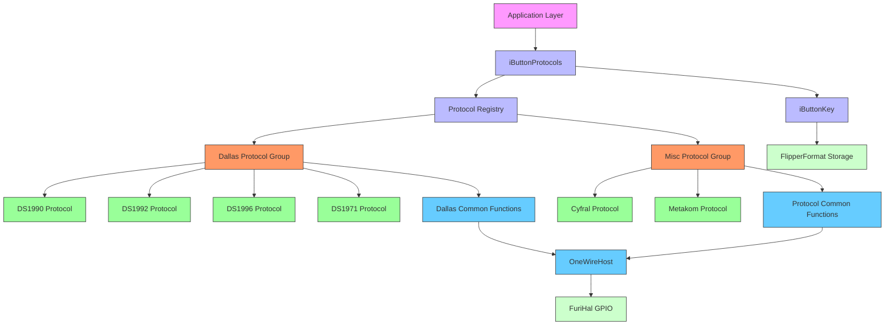

**Diagram sources**
- [ibutton_protocols.h](file://lib/ibutton/ibutton_protocols.h)
- [ibutton_protocols.c](file://lib/ibutton/ibutton_protocols.c)
- [protocol_group_defs.h](file://lib/ibutton/protocols/protocol_group_defs.h)
- [dallas_common.h](file://lib/ibutton/protocols/dallas/dallas_common.h)
- [one_wire_host.h](file://lib/one_wire/one_wire_host.h)

## Detailed Component Analysis

### iButton Protocols Registry

The iButton protocols registry provides a centralized interface for managing all supported iButton protocols. It implements a factory pattern with protocol groups, allowing for dynamic protocol discovery and operation dispatching.

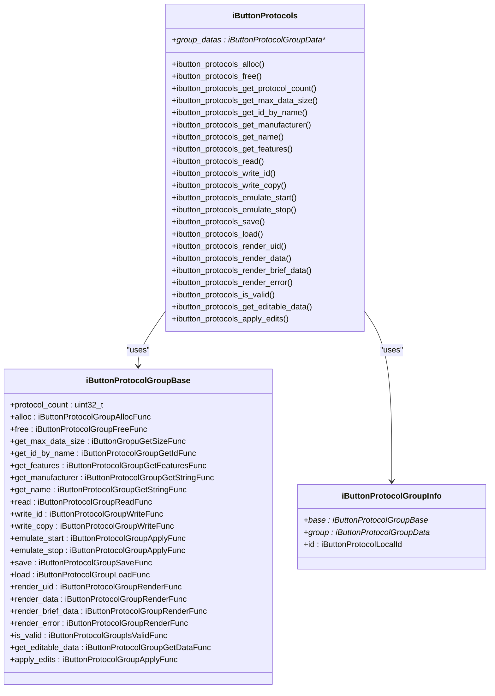

**Diagram sources**
- [ibutton_protocols.h](file://lib/ibutton/ibutton_protocols.h)
- [ibutton_protocols.c](file://lib/ibutton/ibutton_protocols.c)
- [protocol_group_base.h](file://lib/ibutton/protocols/protocol_group_base.h)

**Section sources**
- [ibutton_protocols.h](file://lib/ibutton/ibutton_protocols.h)
- [ibutton_protocols.c](file://lib/ibutton/ibutton_protocols.c)

### iButton Key Data Structure

The iButton key data structure provides a flexible container for storing iButton key information, supporting multiple protocol types with varying data requirements.

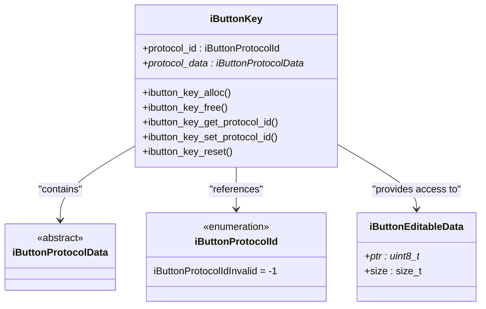

**Diagram sources**
- [ibutton_key.h](file://lib/ibutton/ibutton_key.h)
- [ibutton_key_i.h](file://lib/ibutton/ibutton_key_i.h)
- [protocol_common.h](file://lib/ibutton/protocols/protocol_common.h)

**Section sources**
- [ibutton_key.h](file://lib/ibutton/ibutton_key.h)
- [ibutton_key_i.h](file://lib/ibutton/ibutton_key_i.h)

## Dallas 1-Wire Protocol Implementation

The Dallas 1-Wire protocol implementation provides shared functionality for all Dallas-based iButton devices. This common module handles the fundamental operations required by the 1-Wire protocol, including bus commands, data transfer, and error detection.

### Dallas 1-Wire Command Structure

The Dallas 1-Wire protocol uses a standardized command structure for device communication. The common implementation provides functions for all standard commands used across Dallas iButton devices.

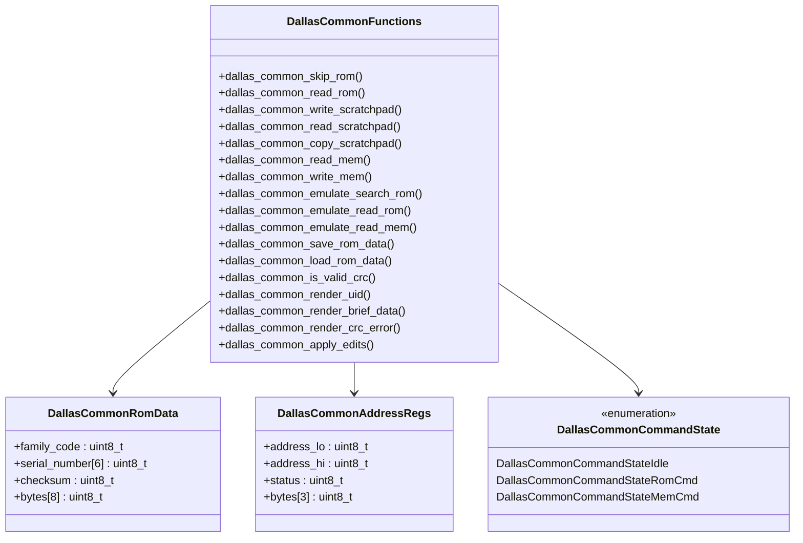

**Diagram sources**
- [dallas_common.h](file://lib/ibutton/protocols/dallas/dallas_common.h)
- [dallas_common.c](file://lib/ibutton/protocols/dallas/dallas_common.c)

**Section sources**
- [dallas_common.h](file://lib/ibutton/protocols/dallas/dallas_common.h)
- [dallas_common.c](file://lib/ibutton/protocols/dallas/dallas_common.c)

### Dallas 1-Wire Command Flow

The sequence of operations for reading from and writing to a Dallas iButton device follows a specific protocol flow that ensures reliable communication.

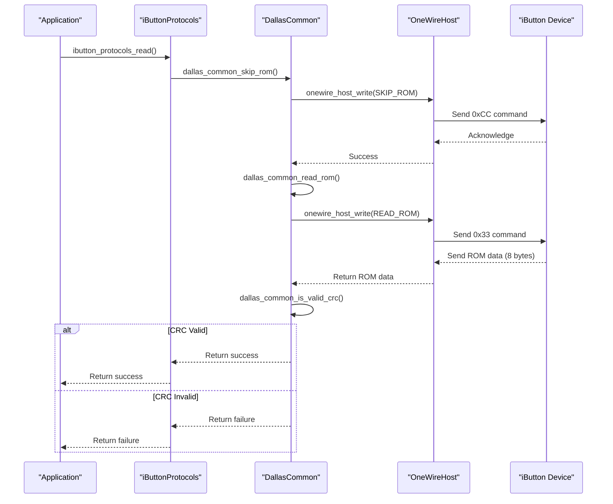

**Diagram sources**
- [dallas_common.c](file://lib/ibutton/protocols/dallas/dallas_common.c)
- [one_wire_host.c](file://lib/one_wire/one_wire_host.c)

## Protocol Registry System

The protocol registry system in the Flipper Zero iButton implementation uses a hierarchical structure with protocol groups to organize and manage different iButton protocols. This design allows for extensibility and efficient protocol lookup.

### Protocol Group Architecture

The protocol registry is organized into groups, with each group containing related protocols. The current implementation includes Dallas and miscellaneous protocol groups.

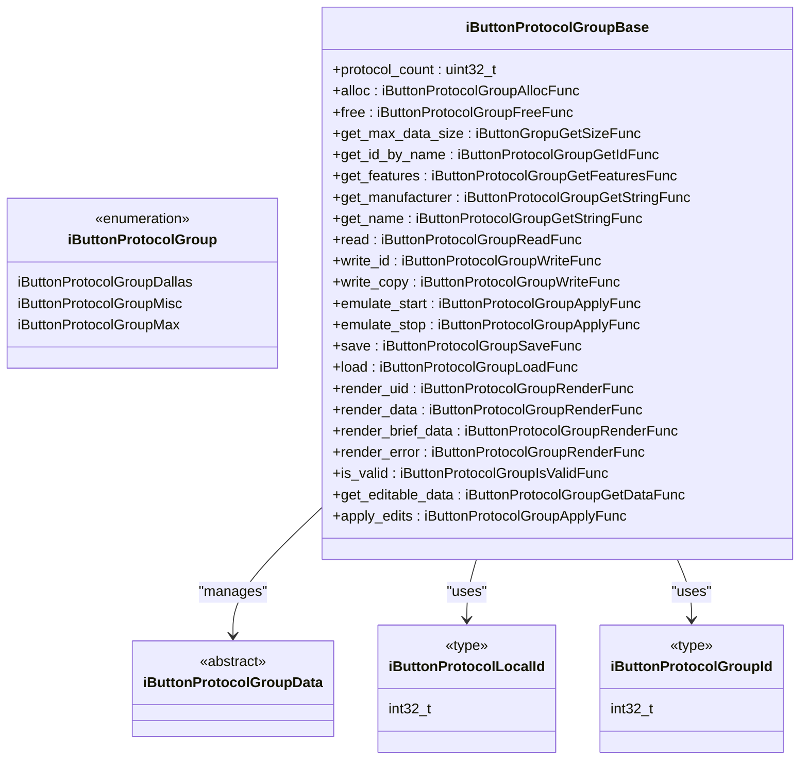

**Diagram sources**
- [protocol_group_defs.h](file://lib/ibutton/protocols/protocol_group_defs.h)
- [protocol_group_base.h](file://lib/ibutton/protocols/protocol_group_base.h)

**Section sources**
- [protocol_group_defs.h](file://lib/ibutton/protocols/protocol_group_defs.h)
- [protocol_group_base.h](file://lib/ibutton/protocols/protocol_group_base.h)

### Protocol Registration and Lookup

The protocol registry system uses a global array of protocol group pointers to manage protocol registration and lookup. This allows for efficient protocol discovery and operation dispatching.

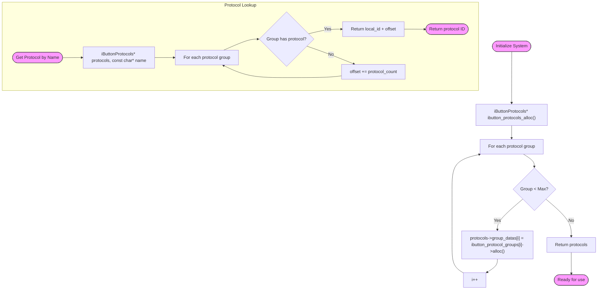

**Diagram sources**
- [ibutton_protocols.c](file://lib/ibutton/ibutton_protocols.c)

## Data Storage and File Format

The iButton system uses a standardized file format for storing iButton key data, allowing for persistence and sharing of key information.

### iButton File Format Structure

The iButton file format is a text-based format that stores key information in a human-readable form while maintaining compatibility with the Flipper Zero's file system.

```mermaid
erDiagram
IBTN_FILE {
string Filetype PK
uint32 Version
string Protocol
hex RomData
hex SramData
hex EepromData
hex Data
}
IBTN_FILE ||--o{ PROTOCOL : "references"
class PROTOCOL {
DS1990
DS1992
DS1996
DS1971
DS1420
DSGeneric
Cyfral
Metakom
}
note right of IBTN_FILE.Filetype
"Flipper iButton key"
end note
note right of IBTN_FILE.Version
1 or 2
Version 1 is deprecated
end note
note right of IBTN_FILE.Protocol
Determines which data fields are present
end note
```

**Diagram sources**
- [iButtonFileFormat.md](file://documentation/file_formats/iButtonFileFormat.md)
- [ibutton_protocols.c](file://lib/ibutton/ibutton_protocols.c)

### File Save and Load Sequence

The process of saving and loading iButton key data involves serialization and deserialization through the FlipperFormat system.

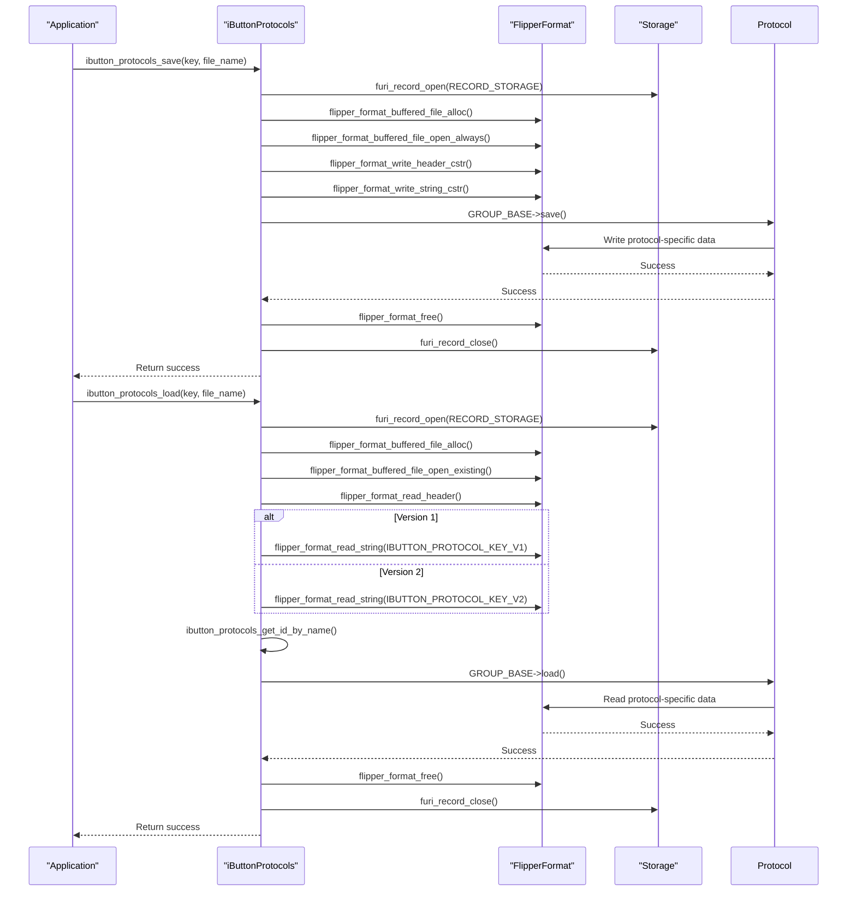

**Diagram sources**
- [ibutton_protocols.c](file://lib/ibutton/ibutton_protocols.c)

**Section sources**
- [ibutton_protocols.c](file://lib/ibutton/ibutton_protocols.c)
- [iButtonFileFormat.md](file://documentation/file_formats/iButtonFileFormat.md)

## Reading, Writing, and Emulation

The iButton system supports three primary operations: reading from physical devices, writing to blank or existing devices, and emulation of iButton devices.

### Operation Flowchart

The decision process for iButton operations depends on the protocol features and device state.

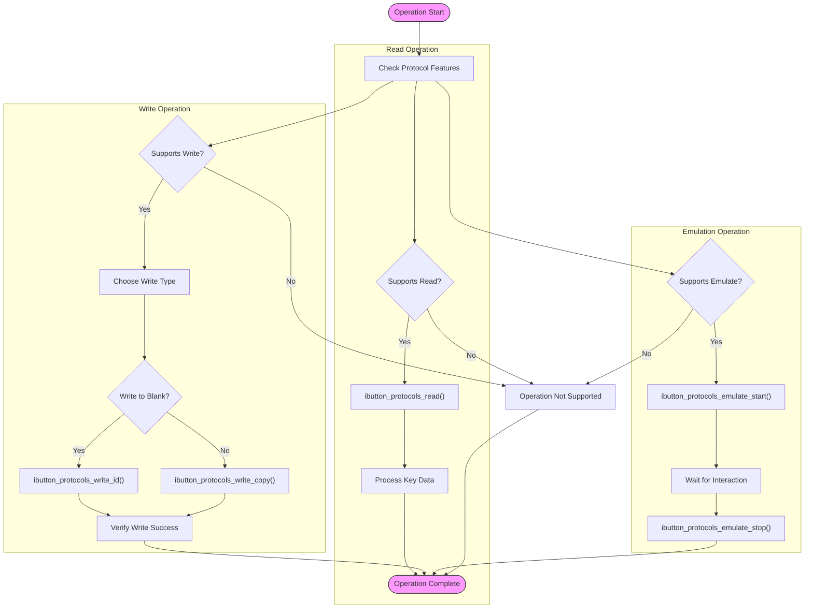

**Section sources**
- [ibutton_protocols.h](file://lib/ibutton/ibutton_protocols.h)
- [ibutton_protocols.c](file://lib/ibutton/ibutton_protocols.c)

## One-Wire Bus Operations

The One-Wire bus operations are implemented at the hardware level using bit-banging techniques to control the GPIO pin according to the 1-Wire protocol specifications.

### One-Wire Timing Parameters

The One-Wire protocol has strict timing requirements for reliable communication. The implementation supports standard and overdrive modes with different timing parameters.

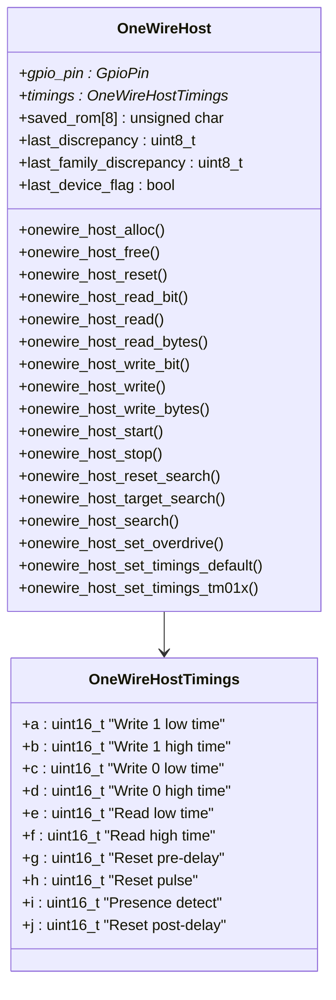

**Diagram sources**
- [one_wire_host.h](file://lib/one_wire/one_wire_host.h)
- [one_wire_host.c](file://lib/one_wire/one_wire_host.c)

### One-Wire Reset and Presence Detection

The reset and presence detection sequence is the first step in any 1-Wire communication, ensuring the bus is in a known state.

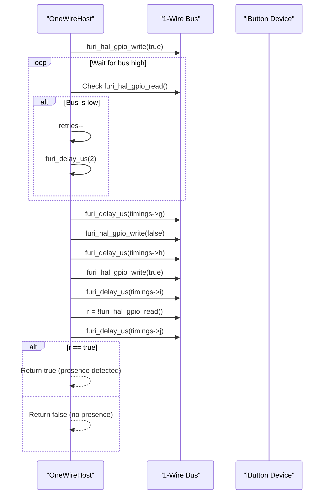

**Diagram sources**
- [one_wire_host.c](file://lib/one_wire/one_wire_host.c)

**Section sources**
- [one_wire_host.h](file://lib/one_wire/one_wire_host.h)
- [one_wire_host.c](file://lib/one_wire/one_wire_host.c)

## Error Detection and Validation

The iButton system implements multiple layers of error detection and validation to ensure data integrity and proper device operation.

### CRC Validation Process

The Dallas 1-Wire protocol uses CRC-8 for error detection in the ROM data. The implementation includes functions to validate and generate CRC values.

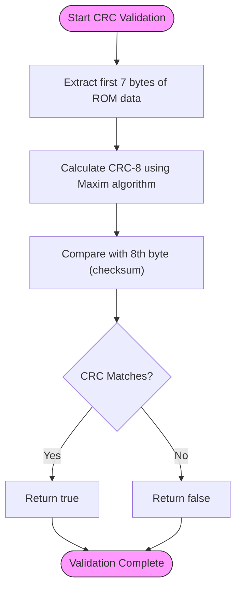

**Section sources**
- [dallas_common.c](file://lib/ibutton/protocols/dallas/dallas_common.c)
- [dallas_common.h](file://lib/ibutton/protocols/dallas/dallas_common.h)

### Error Handling in Protocol Operations

The system implements comprehensive error handling throughout the protocol operations to ensure robust operation.

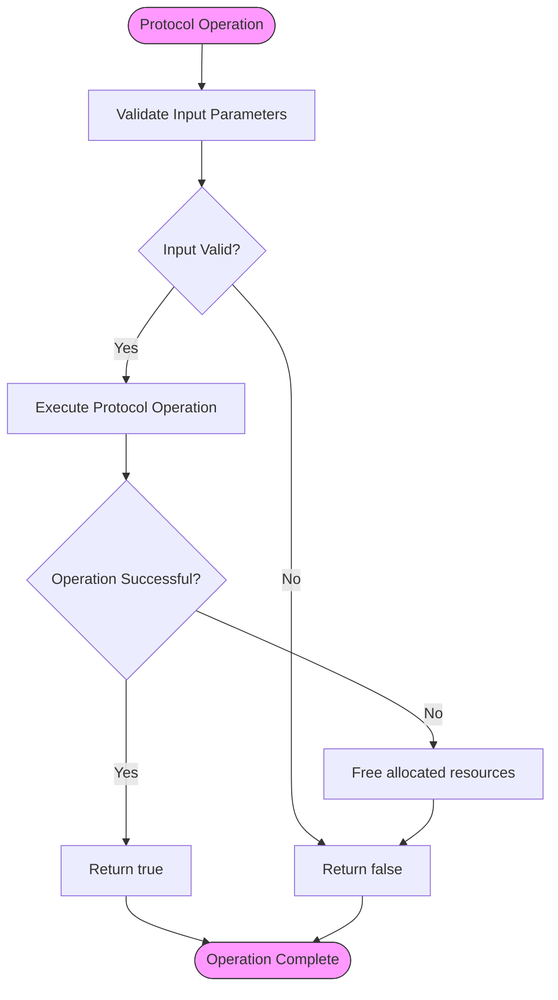

**Section sources**
- [ibutton_protocols.c](file://lib/ibutton/ibutton_protocols.c)
- [dallas_common.c](file://lib/ibutton/protocols/dallas/dallas_common.c)

## Conclusion

The iButton protocol implementation in the Flipper Zero firmware provides a comprehensive and extensible system for working with various iButton devices. The architecture is designed with modularity in mind, separating concerns between protocol management, data storage, and hardware interaction.

Key features of the implementation include:
- A flexible protocol registry system that supports multiple protocol groups
- Standardized file format for persistent storage of iButton key data
- Comprehensive support for Dallas 1-Wire protocol operations
- Robust error detection and validation mechanisms
- Support for reading, writing, and emulation of iButton devices

The system leverages the One-Wire host implementation for low-level bus communication, providing reliable bit-level operations with precise timing control. The protocol registry pattern allows for easy extension with new protocols while maintaining a consistent interface for applications.

This documentation provides a detailed understanding of the iButton protocols supported by the Flipper Zero, enabling developers to effectively use and extend the system for various applications involving iButton technology.