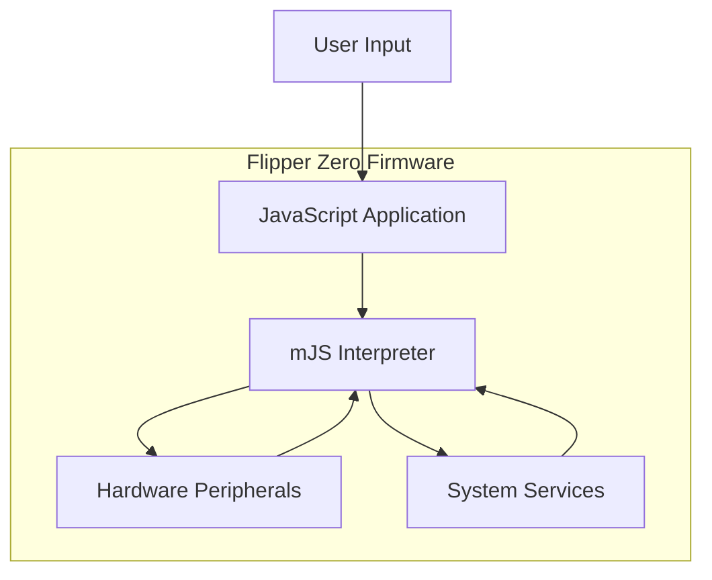
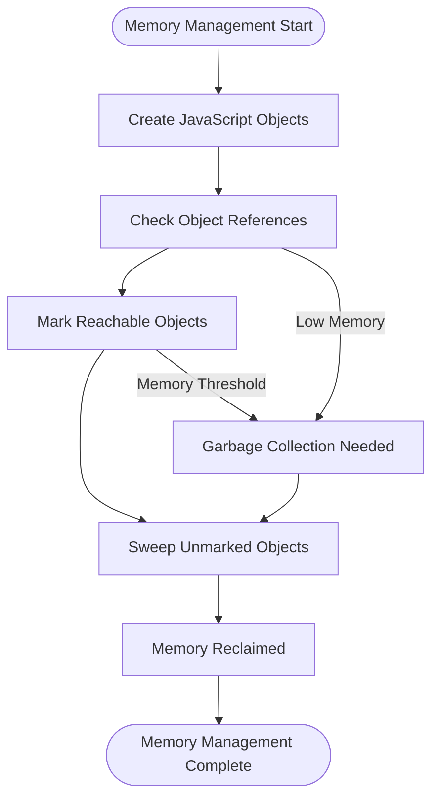
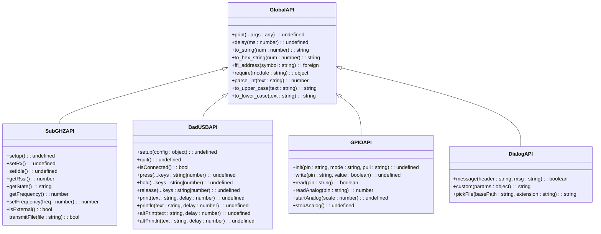
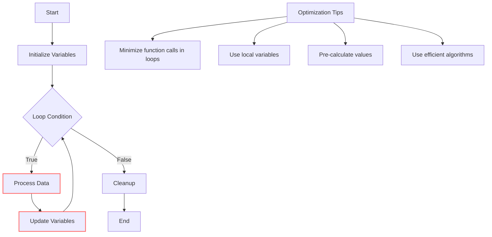

# Scripting with JavaScript

<cite>
**Referenced Files in This Document**   
- [js_app.c](file://applications/system/js_app/js_app.c)
- [js_thread.c](file://applications/system/js_app/js_thread.c)
- [js_modules.c](file://applications/system/js_app/js_modules.c)
- [mjs_core.h](file://lib/mjs/mjs_core.h)
- [mjs_gc.h](file://lib/mjs/mjs_gc.h)
- [mjs_builtin.h](file://lib/mjs/mjs_builtin.h)
- [mjs_exec.h](file://lib/mjs/mjs_exec.h)
- [mjs_mm.h](file://lib/mjs/mjs_mm.h)
- [js_gpio.c](file://applications/system/js_app/modules/js_gpio.c)
- [js_dialog.c](file://applications/system/js_app/modules/js_dialog.c)
- [JavaScript.md](file://documentation/JavaScript.md)
- [badusb_demo.js](file://applications/system/js_app/examples/apps/Scripts/badusb_demo.js)
- [gpio.js](file://applications/system/js_app/examples/apps/Scripts/gpio.js)
</cite>

## Table of Contents
1. [Introduction](#introduction)
2. [JavaScript Architecture](#javascript-architecture)
3. [Memory Management and Garbage Collection](#memory-management-and-garbage-collection)
4. [JavaScript API Overview](#javascript-api-overview)
5. [Practical Examples](#practical-examples)
6. [Common Issues and Solutions](#common-issues-and-solutions)
7. [Performance Considerations](#performance-considerations)
8. [Conclusion](#conclusion)

## Introduction

The Flipper Zero supports JavaScript scripting through the mJS interpreter embedded in its firmware. This lightweight JavaScript engine enables users to create custom scripts for automating tasks, interacting with hardware peripherals, and extending the device's functionality. The mJS interpreter is specifically designed for resource-constrained environments, making it suitable for the Flipper Zero's limited memory and processing capabilities.

JavaScript scripting on the Flipper Zero provides a flexible way to interact with the device's hardware and system services without requiring low-level C programming. Users can write scripts to automate NFC operations, create custom user interfaces, control GPIO pins, and much more. The scripting environment is accessible through the JavaScript application in the Flipper Zero's menu system or via the command-line interface.

This document provides a comprehensive overview of the JavaScript scripting capabilities of the Flipper Zero, covering the architecture of the mJS interpreter, memory management, available APIs, practical examples, and performance considerations.

## JavaScript Architecture

The JavaScript implementation on the Flipper Zero is built around the mJS interpreter, a lightweight JavaScript engine designed for embedded systems. The architecture consists of several key components that work together to provide a functional scripting environment on the resource-constrained device.

The core of the JavaScript system is the mJS interpreter, which is responsible for parsing, compiling, and executing JavaScript code. The interpreter is implemented in C and provides a minimal set of JavaScript features optimized for embedded environments. It uses a bytecode-based execution model where JavaScript source code is first compiled to bytecode, which is then executed by a virtual machine.

The JavaScript application on the Flipper Zero is implemented as a separate application that manages the execution of JavaScript scripts. When a user selects a JavaScript file to run, the application creates a dedicated thread for script execution, isolating the script from the main system to prevent crashes or hangs from affecting the overall device stability.



**Diagram sources**
- [js_app.c](file://applications/system/js_app/js_app.c)
- [js_thread.c](file://applications/system/js_app/js_thread.c)

The JavaScript execution environment is sandboxed to ensure system stability. Each script runs in its own isolated context with limited access to system resources. The interpreter enforces script execution limits to prevent infinite loops or excessive resource consumption that could impact the device's primary functions.

The architecture also includes a module system that allows scripts to access specific hardware peripherals and system services through dedicated JavaScript modules. These modules are implemented as C extensions that provide a bridge between the JavaScript environment and the underlying hardware and system APIs.

**Section sources**
- [js_app.c](file://applications/system/js_app/js_app.c#L102-L136)
- [js_thread.c](file://applications/system/js_app/js_thread.c#L314-L409)

## Memory Management and Garbage Collection

Memory management in the Flipper Zero's JavaScript environment is critical due to the device's limited RAM. The mJS interpreter implements a custom memory management system optimized for embedded environments with constrained resources.

The interpreter uses a combination of static and dynamic memory allocation strategies. The core interpreter structures are allocated statically during initialization, while JavaScript objects and variables are managed dynamically during script execution. The memory management system is designed to minimize fragmentation and maximize efficient use of available memory.

Garbage collection in mJS is implemented as a mark-and-sweep algorithm that runs periodically to reclaim memory occupied by objects that are no longer referenced. The garbage collector is optimized for low memory overhead and minimal impact on system performance. It operates in two phases: first marking all reachable objects, then sweeping through memory to reclaim unmarked objects.



**Diagram sources**
- [mjs_gc.h](file://lib/mjs/mjs_gc.h#L18-L55)
- [mjs_mm.h](file://lib/mjs/mjs_mm.h#L19-L38)

The garbage collector is designed to be conservative in its memory reclamation to avoid premature collection of objects that might still be needed. It also includes mechanisms to handle circular references, which are common in JavaScript applications. The collector uses a tri-color marking approach to efficiently identify and reclaim unreachable objects.

Memory allocation for JavaScript values is handled through a specialized arena-based allocator that groups similar types of objects together. This approach reduces memory fragmentation and improves cache locality. The system maintains separate arenas for different types of objects, including strings, arrays, and general objects.

The JavaScript environment on the Flipper Zero has strict memory limits to prevent scripts from consuming excessive resources. Scripts that exceed memory limits will be terminated to protect system stability. Developers should be mindful of memory usage when writing scripts, particularly when working with large data structures or creating many objects.

**Section sources**
- [mjs_gc.h](file://lib/mjs/mjs_gc.h#L18-L55)
- [mjs_mm.h](file://lib/mjs/mjs_mm.h#L19-L38)
- [mjs_core.h](file://lib/mjs/mjs_core.h#L88-L95)

## JavaScript API Overview

The Flipper Zero provides a comprehensive JavaScript API that allows scripts to interact with hardware peripherals and system services. The API is organized into modules that can be loaded using the `require()` function, providing access to specific functionality.

The core API includes global functions for basic operations such as printing output, delaying execution, and converting data types. These functions are available without requiring any modules and provide essential functionality for script development.



**Diagram sources**
- [JavaScript.md](file://documentation/JavaScript.md#L17-L150)
- [js_modules.c](file://applications/system/js_app/js_modules.c#L19-L21)
- [js_gpio.c](file://applications/system/js_app/modules/js_gpio.c#L381-L385)

The API includes modules for various hardware peripherals and system functions:

- **SubGHz**: Provides access to the SubGHz radio for transmitting and receiving signals
- **BadUSB**: Enables USB HID functionality for emulating keyboard and other USB devices
- **GPIO**: Allows direct control of GPIO pins for interfacing with external hardware
- **Dialog**: Creates user interface elements like message boxes and file pickers
- **Notification**: Controls the device's notification system including LEDs and vibration
- **Storage**: Provides access to the file system for reading and writing files
- **Serial**: Enables serial communication through available interfaces

Each module is implemented as a C extension that exposes specific functions to the JavaScript environment. The modules follow a consistent pattern where a module is loaded using `require()`, and then its functions can be called to interact with the corresponding hardware or system service.

The API also includes support for Foreign Function Interface (FFI) through the `ffi_address()` function, which allows scripts to directly call C functions from the firmware. This provides advanced capabilities for developers who need low-level access to system functions.

**Section sources**
- [JavaScript.md](file://documentation/JavaScript.md#L17-L150)
- [js_modules.c](file://applications/system/js_app/js_modules.c#L54-L129)
- [js_gpio.c](file://applications/system/js_app/modules/js_gpio.c#L109-L357)

## Practical Examples

The JavaScript environment on the Flipper Zero enables a wide range of practical applications, from automating hardware interactions to creating custom user experiences. The following examples demonstrate common use cases and illustrate how to use the JavaScript API effectively.

### BadUSB Automation

The BadUSB module allows scripts to emulate USB keyboard devices, enabling automation of computer interactions. This is particularly useful for security testing and automated data entry tasks.

```javascript
let badusb = require("badusb");
let notify = require("notification");
let flipper = require("flipper");

badusb.setup({
    vid: 0xAAAA,
    pid: 0xBBBB,
    mfr_name: "Flipper",
    prod_name: "Zero"
});

if (badusb.isConnected()) {
    notify.blink("green", "short");
    print("USB is connected");
    
    badusb.println("Hello, world!");
    
    badusb.press("CTRL", "a");
    badusb.press("CTRL", "c");
    badusb.press("DOWN");
    delay(1000);
    badusb.press("CTRL", "v");
    
    badusb.println("Flipper Model: " + flipper.getModel());
    badusb.println("Battery level: " + to_string(flipper.getBatteryCharge()) + "%");
    
    notify.success();
} else {
    print("USB not connected");
    notify.error();
}

badusb.quit();
```

**Section sources**
- [badusb_demo.js](file://applications/system/js_app/examples/apps/Scripts/badusb_demo.js)

### GPIO Control

The GPIO module provides direct access to the Flipper Zero's GPIO pins, enabling interaction with external electronic components. This example demonstrates how to configure and control GPIO pins for various purposes.

```javascript
let gpio = require("gpio");

// Initialize pins
gpio.init("PC3", "outputPushPull", "up");
print("PC3 is initialized as outputPushPull with pull-up");

gpio.init("PC1", "input", "down");
print("PC1 is initialized as input with pull-down");

// Blink LED on PC3
gpio.write("PC3", true);
delay(1000);
gpio.write("PC3", false);
delay(1000);

// Read from PC1 and write to PC3
while (true) {
    let value = gpio.read("PC1");
    gpio.write("PC3", value);
    value ? print("PC1 is high") : print("PC1 is low");
    delay(100);
}
```

**Section sources**
- [gpio.js](file://applications/system/js_app/examples/apps/Scripts/gpio.js)

### Interactive User Interfaces

The Dialog module enables creation of interactive user interfaces within scripts. This allows for user input and feedback during script execution, making scripts more versatile and user-friendly.

```javascript
let dialog = require("dialog");
let storage = require("storage");

// Show a message dialog
let result = dialog.message("Confirmation", "Do you want to continue?");
if (result) {
    print("User confirmed");
    
    // Show a custom dialog with multiple buttons
    let choice = dialog.custom({
        header: "Choose action",
        text: "Select what you want to do",
        button_left: "Read",
        button_center: "Write",
        button_right: "Cancel"
    });
    
    if (choice === "Read") {
        let path = dialog.pickFile("/ext", ".txt");
        if (path) {
            let content = storage.read(path);
            print("File content: " + content);
        }
    } else if (choice === "Write") {
        // Implementation for writing
    }
}
```

These examples illustrate the versatility of JavaScript scripting on the Flipper Zero. By combining different modules and API functions, users can create sophisticated scripts that automate complex tasks, interact with hardware in novel ways, and extend the device's functionality beyond its default capabilities.

## Common Issues and Solutions

JavaScript scripting on the Flipper Zero may encounter several common issues related to the device's resource constraints and the limitations of the mJS interpreter. Understanding these issues and their solutions is essential for developing reliable scripts.

### Script Timeouts

Scripts may be terminated due to execution timeouts, particularly when performing long-running operations or infinite loops. The system enforces timeouts to prevent scripts from hanging and affecting device usability.

**Solution**: Break long operations into smaller chunks using `delay()` calls, which allow the system to process other tasks and prevent timeouts. For example:

```javascript
// Instead of a long loop
for (let i = 0; i < 1000; i++) {
    // operations
}

// Use chunked execution
let counter = 0;
function processChunk() {
    for (let i = 0; i < 100; i++) {
        // operations
        counter++;
    }
    if (counter < 1000) {
        delay(10); // Allow system processing
        processChunk(); // Continue with next chunk
    }
}
processChunk();
```

### Memory Limitations

The Flipper Zero has limited RAM, which constrains the size and complexity of JavaScript scripts. Memory-intensive operations may cause scripts to fail or be terminated.

**Solutions**:
- Minimize object creation in loops
- Reuse variables instead of creating new ones
- Avoid large arrays or strings when possible
- Use `delay()` calls to allow garbage collection
- Process data in smaller chunks rather than loading everything at once

### Module Loading Issues

Custom modules may fail to load due to incorrect paths, missing files, or compatibility issues.

**Solutions**:
- Ensure module files are in the correct directory (`/ext/apps_data/js_app/plugins/`)
- Verify module file names follow the naming convention (`js_modulename.fal`)
- Check that the module is compatible with the current firmware version
- Use try-catch blocks when loading modules to handle errors gracefully

### Hardware Access Conflicts

Multiple scripts or system functions may attempt to access the same hardware resource simultaneously, causing conflicts.

**Solutions**:
- Release hardware resources when not in use (e.g., call appropriate cleanup functions)
- Check if hardware is available before attempting to use it
- Implement proper error handling for hardware access failures
- Avoid long-duration hardware operations that block other functions

### Debugging Challenges

Debugging JavaScript scripts on the Flipper Zero can be challenging due to limited output options and the embedded environment.

**Solutions**:
- Use `print()` statements strategically to trace script execution
- Implement structured error handling with try-catch blocks
- Test scripts in small increments to isolate issues
- Use the command-line interface for more detailed output
- Check system logs for error messages related to script execution

Understanding these common issues and applying the appropriate solutions will help ensure that JavaScript scripts run reliably on the Flipper Zero.

**Section sources**
- [js_thread.c](file://applications/system/js_app/js_thread.c#L93-L113)
- [js_app.c](file://applications/system/js_app/js_app.c#L48-L67)
- [mjs_core.h](file://lib/mjs/mjs_core.h#L78-L80)

## Performance Considerations

Optimizing script performance is crucial on the Flipper Zero due to its limited processing power and memory. Several strategies can be employed to improve script execution speed and minimize resource usage.

### Code Optimization Techniques

Writing efficient JavaScript code is essential for optimal performance. The following techniques can significantly improve script efficiency:

- **Minimize function calls**: Reduce the number of function calls, especially within loops, as each call incurs overhead
- **Use local variables**: Accessing local variables is faster than accessing object properties or global variables
- **Avoid unnecessary object creation**: Create objects only when needed and reuse them when possible
- **Optimize loops**: Use the most appropriate loop construct for the task and minimize work within loop bodies



**Diagram sources**
- [js_thread.c](file://applications/system/js_app/js_thread.c#L141-L159)
- [mjs_core.c](file://lib/mjs/mjs_core.c)

### Memory Usage Optimization

Efficient memory usage is critical for script stability and performance. The following practices help minimize memory consumption:

- **Release resources promptly**: Clean up objects and close file handles when they are no longer needed
- **Use appropriate data types**: Choose the most memory-efficient data type for each use case
- **Process data in chunks**: Instead of loading entire files or datasets into memory, process them in smaller segments
- **Avoid memory leaks**: Ensure that all allocated resources are properly released

### Execution Speed Optimization

Improving script execution speed enhances user experience and reduces power consumption. Consider the following approaches:

- **Use built-in functions**: Built-in functions are typically faster than custom implementations
- **Minimize I/O operations**: File and hardware I/O operations are relatively slow; batch them when possible
- **Optimize algorithms**: Use the most efficient algorithms for the task at hand
- **Leverage hardware acceleration**: When available, use hardware-accelerated functions for operations like encryption or signal processing

### Power Consumption Considerations

JavaScript scripts can impact battery life, especially when running for extended periods. To minimize power consumption:

- **Use appropriate delay intervals**: Longer delays between operations reduce CPU usage and power consumption
- **Enter low-power states when idle**: Use `delay()` to allow the system to enter low-power modes
- **Minimize screen updates**: Frequent screen updates consume significant power
- **Turn off unused peripherals**: Disable hardware components when not in use

By applying these performance optimization techniques, developers can create JavaScript scripts that run efficiently on the Flipper Zero, providing responsive functionality while conserving system resources and battery life.

**Section sources**
- [js_thread.c](file://applications/system/js_app/js_thread.c#L103-L113)
- [mjs_gc.h](file://lib/mjs/mjs_gc.h#L32-L35)
- [js_app.c](file://applications/system/js_app/js_app.c#L126-L127)

## Conclusion

The JavaScript scripting capabilities of the Flipper Zero provide a powerful and accessible way to extend the device's functionality and automate complex tasks. Through the mJS interpreter, users can write scripts that interact with hardware peripherals, create custom user interfaces, and implement sophisticated automation workflows.

The architecture of the JavaScript environment is carefully designed to balance functionality with the resource constraints of the device. The mJS interpreter provides a minimal but effective JavaScript implementation that can execute scripts efficiently within the limited memory and processing power of the Flipper Zero.

Understanding the memory management and garbage collection mechanisms is crucial for developing reliable scripts that don't impact system stability. The available JavaScript API offers comprehensive access to hardware and system services, enabling a wide range of applications from security testing to hardware interfacing.

By following best practices for performance optimization and being mindful of common issues like script timeouts and memory limitations, developers can create robust and efficient scripts that enhance the Flipper Zero's capabilities. The practical examples provided demonstrate the versatility of JavaScript scripting and serve as a foundation for more complex applications.

As the Flipper Zero ecosystem continues to evolve, the JavaScript scripting environment will likely expand with additional modules and improved performance, further enhancing its value as a tool for both beginners and advanced users.

[No sources needed since this section summarizes without analyzing specific files]