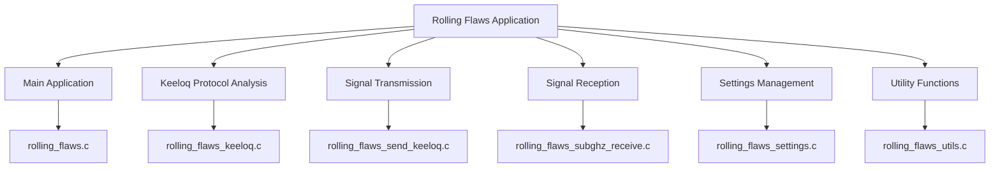
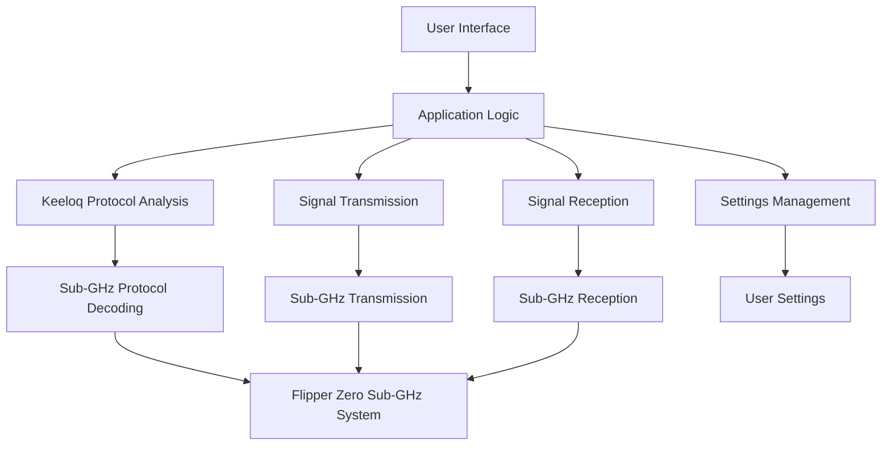
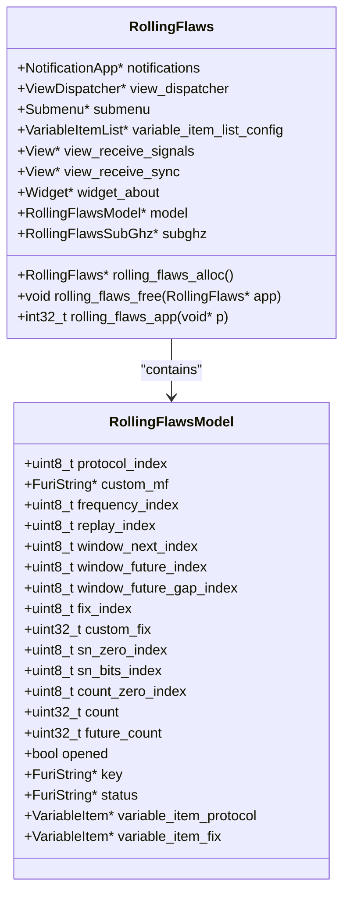
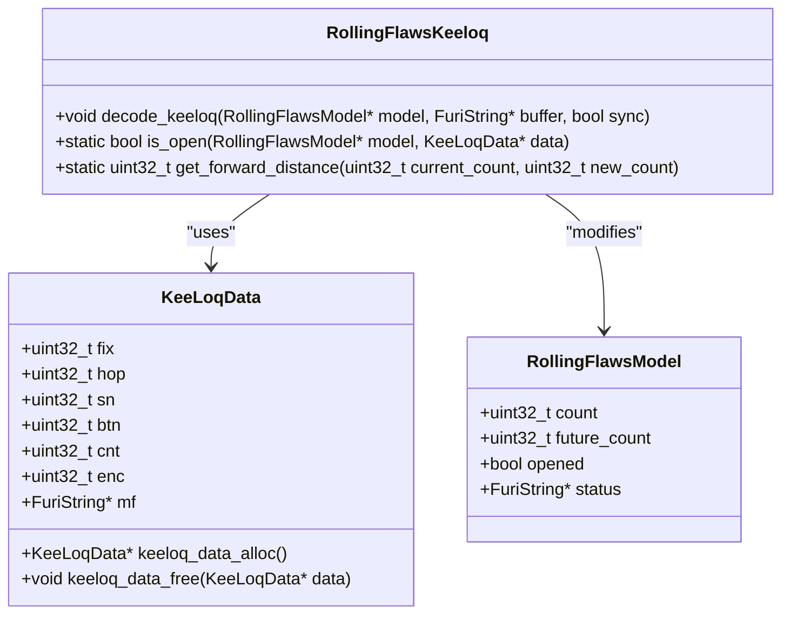
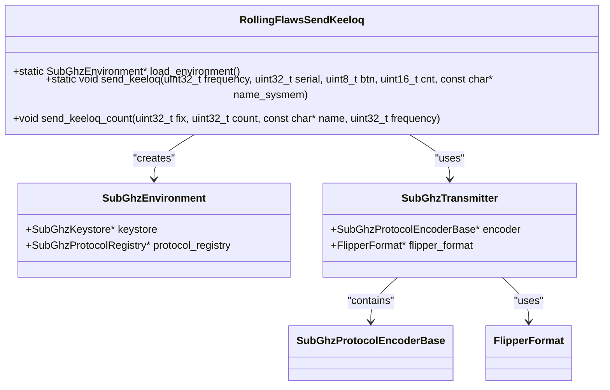
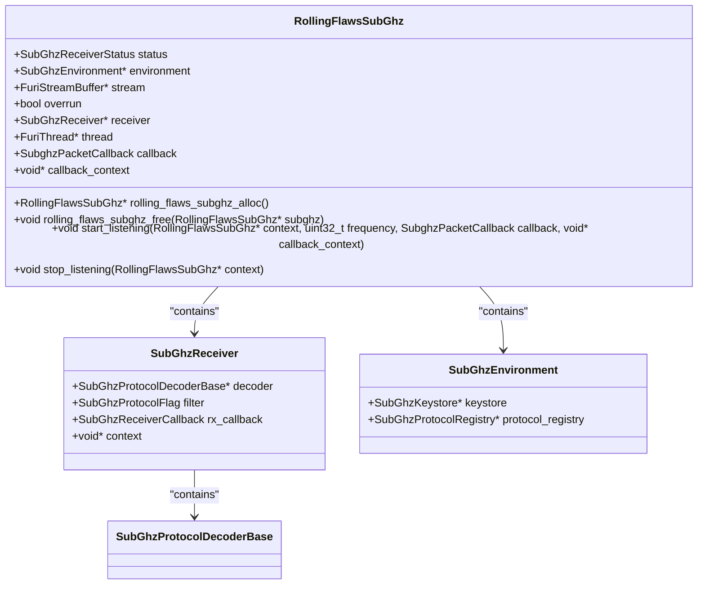
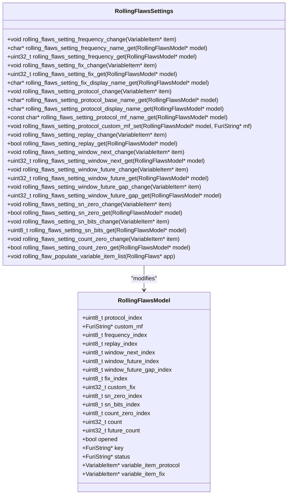

# Access Control Testing

<cite>
**Referenced Files in This Document**   
- [rolling_flaws.c](file://applications/external/rolling_flaws/rolling_flaws.c#L0-L473)
- [rolling_flaws_keeloq.c](file://applications/external/rolling_flaws/rolling_flaws_keeloq.c#L0-L227)
- [rolling_flaws_settings.c](file://applications/external/rolling_flaws/rolling_flaws_settings.c#L0-L259)
- [rolling_flaws_send_keeloq.c](file://applications/external/rolling_flaws/rolling_flaws_send_keeloq.c#L0-L124)
- [rolling_flaws_subghz_receive.c](file://applications/external/rolling_flaws/rolling_flaws_subghz_receive.c#L0-L139)
- [rolling_flaws_structs.h](file://applications/external/rolling_flaws/rolling_flaws_structs.h#L0-L54)
</cite>

## Table of Contents
1. [Introduction](#introduction)
2. [Project Structure](#project-structure)
3. [Core Components](#core-components)
4. [Architecture Overview](#architecture-overview)
5. [Detailed Component Analysis](#detailed-component-analysis)
6. [Keeloq Protocol Analysis and Exploitation](#keeloq-protocol-analysis-and-exploitation)
7. [Signal Transmission and Reception](#signal-transmission-and-reception)
8. [Configuration and Settings](#configuration-and-settings)
9. [Common Issues and Solutions](#common-issues-and-solutions)
10. [Conclusion](#conclusion)

## Introduction
The Rolling Flaws application is a specialized tool designed for evaluating the security of access control systems that use rolling code protocols, particularly focusing on the Keeloq protocol. This document provides a comprehensive analysis of the application's architecture, implementation, and functionality, with a focus on its capabilities for analyzing and exploiting vulnerabilities in rolling code implementations. The application integrates with the Flipper Zero's Sub-GHz transmission system and protocol decoding libraries to provide a complete solution for access control testing.

## Project Structure
The Rolling Flaws application is organized into a modular structure with distinct components for different aspects of its functionality. The main components include the core application logic, Keeloq protocol analysis, signal transmission, signal reception, settings management, and utility functions.



**Diagram sources**
- [rolling_flaws.c](file://applications/external/rolling_flaws/rolling_flaws.c#L0-L473)
- [rolling_flaws_keeloq.c](file://applications/external/rolling_flaws/rolling_flaws_keeloq.c#L0-L227)
- [rolling_flaws_send_keeloq.c](file://applications/external/rolling_flaws/rolling_flaws_send_keeloq.c#L0-L124)
- [rolling_flaws_subghz_receive.c](file://applications/external/rolling_flaws/rolling_flaws_subghz_receive.c#L0-L139)
- [rolling_flaws_settings.c](file://applications/external/rolling_flaws/rolling_flaws_settings.c#L0-L259)
- [rolling_flaws_utils.c](file://applications/external/rolling_flaws/rolling_flaws_utils.c#L0-L100)

**Section sources**
- [rolling_flaws.c](file://applications/external/rolling_flaws/rolling_flaws.c#L0-L473)
- [rolling_flaws_keeloq.c](file://applications/external/rolling_flaws/rolling_flaws_keeloq.c#L0-L227)
- [rolling_flaws_send_keeloq.c](file://applications/external/rolling_flaws/rolling_flaws_send_keeloq.c#L0-L124)
- [rolling_flaws_subghz_receive.c](file://applications/external/rolling_flaws/rolling_flaws_subghz_receive.c#L0-L139)
- [rolling_flaws_settings.c](file://applications/external/rolling_flaws/rolling_flaws_settings.c#L0-L259)
- [rolling_flaws_utils.c](file://applications/external/rolling_flaws/rolling_flaws_utils.c#L0-L100)

## Core Components
The Rolling Flaws application consists of several core components that work together to provide access control testing capabilities. The main application component handles the user interface and application flow, while the Keeloq protocol analysis component handles the cryptographic analysis of received signals. The signal transmission and reception components handle the practical aspects of sending and receiving Sub-GHz signals, and the settings management component provides a user interface for configuring the application's behavior.

**Section sources**
- [rolling_flaws.c](file://applications/external/rolling_flaws/rolling_flaws.c#L0-L473)
- [rolling_flaws_keeloq.c](file://applications/external/rolling_flaws/rolling_flaws_keeloq.c#L0-L227)
- [rolling_flaws_send_keeloq.c](file://applications/external/rolling_flaws/rolling_flaws_send_keeloq.c#L0-L124)
- [rolling_flaws_subghz_receive.c](file://applications/external/rolling_flaws/rolling_flaws_subghz_receive.c#L0-L139)
- [rolling_flaws_settings.c](file://applications/external/rolling_flaws/rolling_flaws_settings.c#L0-L259)

## Architecture Overview
The Rolling Flaws application follows a modular architecture that separates concerns and allows for easy extension and maintenance. The application is built on top of the Flipper Zero's Sub-GHz transmission system and protocol decoding libraries, which provide the low-level functionality for sending and receiving signals.



**Diagram sources**
- [rolling_flaws.c](file://applications/external/rolling_flaws/rolling_flaws.c#L0-L473)
- [rolling_flaws_keeloq.c](file://applications/external/rolling_flaws/rolling_flaws_keeloq.c#L0-L227)
- [rolling_flaws_send_keeloq.c](file://applications/external/rolling_flaws/rolling_flaws_send_keeloq.c#L0-L124)
- [rolling_flaws_subghz_receive.c](file://applications/external/rolling_flaws/rolling_flaws_subghz_receive.c#L0-L139)
- [rolling_flaws_settings.c](file://applications/external/rolling_flaws/rolling_flaws_settings.c#L0-L259)

## Detailed Component Analysis

### Main Application Analysis
The main application component is responsible for handling the user interface and application flow. It uses the Flipper Zero's GUI system to provide a menu-based interface for the user to interact with the application.



**Diagram sources**
- [rolling_flaws.c](file://applications/external/rolling_flaws/rolling_flaws.c#L0-L473)
- [rolling_flaws_structs.h](file://applications/external/rolling_flaws/rolling_flaws_structs.h#L0-L54)

**Section sources**
- [rolling_flaws.c](file://applications/external/rolling_flaws/rolling_flaws.c#L0-L473)
- [rolling_flaws_structs.h](file://applications/external/rolling_flaws/rolling_flaws_structs.h#L0-L54)

### Keeloq Protocol Analysis Component
The Keeloq protocol analysis component is responsible for analyzing received signals and determining whether they represent valid access control commands. It implements the Keeloq algorithm and provides functions for decoding and validating received signals.



**Diagram sources**
- [rolling_flaws_keeloq.c](file://applications/external/rolling_flaws/rolling_flaws_keeloq.c#L0-L227)
- [rolling_flaws_structs.h](file://applications/external/rolling_flaws/rolling_flaws_structs.h#L0-L54)

**Section sources**
- [rolling_flaws_keeloq.c](file://applications/external/rolling_flaws/rolling_flaws_keeloq.c#L0-L227)
- [rolling_flaws_structs.h](file://applications/external/rolling_flaws/rolling_flaws_structs.h#L0-L54)

### Signal Transmission Component
The signal transmission component is responsible for generating and sending Sub-GHz signals that can be used to test access control systems. It uses the Flipper Zero's Sub-GHz transmission system to send signals at a specified frequency.



**Diagram sources**
- [rolling_flaws_send_keeloq.c](file://applications/external/rolling_flaws/rolling_flaws_send_keeloq.c#L0-L124)
- [lib/subghz/environment.h](file://lib/subghz/environment.h#L0-L100)
- [lib/subghz/transmitter.h](file://lib/subghz/transmitter.h#L0-L100)

**Section sources**
- [rolling_flaws_send_keeloq.c](file://applications/external/rolling_flaws/rolling_flaws_send_keeloq.c#L0-L124)

### Signal Reception Component
The signal reception component is responsible for receiving and processing Sub-GHz signals. It uses the Flipper Zero's Sub-GHz reception system to capture signals and then processes them using the protocol decoding libraries.



**Diagram sources**
- [rolling_flaws_subghz_receive.c](file://applications/external/rolling_flaws/rolling_flaws_subghz_receive.c#L0-L139)
- [lib/subghz/receiver.h](file://lib/subghz/receiver.h#L0-L100)
- [lib/subghz/environment.h](file://lib/subghz/environment.h#L0-L100)

**Section sources**
- [rolling_flaws_subghz_receive.c](file://applications/external/rolling_flaws/rolling_flaws_subghz_receive.c#L0-L139)

### Settings Management Component
The settings management component provides a user interface for configuring the application's behavior. It allows the user to set various parameters that affect how the application analyzes and exploits rolling code protocols.



**Diagram sources**
- [rolling_flaws_settings.c](file://applications/external/rolling_flaws/rolling_flaws_settings.c#L0-L259)
- [rolling_flaws_structs.h](file://applications/external/rolling_flaws/rolling_flaws_structs.h#L0-L54)

**Section sources**
- [rolling_flaws_settings.c](file://applications/external/rolling_flaws/rolling_flaws_settings.c#L0-L259)
- [rolling_flaws_structs.h](file://applications/external/rolling_flaws/rolling_flaws_structs.h#L0-L54)

## Keeloq Protocol Analysis and Exploitation
The Rolling Flaws application provides specialized capabilities for analyzing and exploiting vulnerabilities in Keeloq-based rolling code implementations. The Keeloq protocol is a widely used rolling code protocol that provides security for access control systems such as garage door openers and car key fobs.

### Keeloq Algorithm Implementation
The Keeloq algorithm implementation in the Rolling Flaws application is designed to decode and validate received signals. The algorithm uses a combination of fixed and rolling components to generate unique codes for each transmission.

```c
void decode_keeloq(RollingFlawsModel* model, FuriString* buffer, bool sync) {
    FURI_LOG_T(TAG, "Decoding KeeLoq 64bit");
    uint32_t now = furi_get_tick();
    if(now - last_decode < furi_ms_to_ticks(500)) {
        FURI_LOG_D(TAG, "Ignoring decode.  Too soon.");
        last_decode = now;
        return;
    }
    last_decode = now;

    KeeLoqData* data = keeloq_data_alloc();
    __furi_string_extract_string_until(buffer, 0, "MF:", '\r', data->mf);
    __furi_string_extract_string(buffer, 0, "Key:", '\r', model->key);

    data->fix = __furi_string_extract_int(buffer, "Fix:0x", ' ', FAILED_TO_PARSE);
    data->hop = __furi_string_extract_int(buffer, "Hop:0x", ' ', FAILED_TO_PARSE);
    data->sn = __furi_string_extract_int(buffer, "Sn:0x", ' ', FAILED_TO_PARSE);
    if(data->sn == FAILED_TO_PARSE) {
        FURI_LOG_I(TAG, "Sn:0x not found.  Using Fix data.");
        data->sn = data->fix & 0x0FFFFFFF;
    }
    data->btn = __furi_string_extract_int(buffer, "Btn:", '\r', FAILED_TO_PARSE);
    data->cnt = __furi_string_extract_int(buffer, "Cnt:", '\r', FAILED_TO_PARSE);
    data->enc = __furi_string_extract_int(buffer, "Enc:", '\r', FAILED_TO_PARSE);
    FURI_LOG_I(
        TAG,
        "fix: %08lX hop: %08lX sn: %08lX btn: %08lX cnt: %08lX enc:%08lX key:%s mf:%s",
        data->fix,
        data->hop,
        data->sn,
        data->btn,
        data->cnt,
        data->enc,
        furi_string_get_cstr(model->key),
        furi_string_get_cstr(data->mf));

    if(!sync) {
        model->opened = is_open(model, data);
        if(model->opened) {
            model->count = data->cnt;
        }
        __gui_redraw();
    } else {
        model->custom_fix = data->fix;
        model->count = data->cnt;
        model->future_count = 0xFFFFFFFF;
        model->opened = false;
        rolling_flaws_setting_protocol_custom_mf_set(model, data->mf);
        furi_string_set(model->status, "SYNCED");
    }

    keeloq_data_free(data);
}
```

The `decode_keeloq` function extracts various components from the received signal, including the manufacturer ID (MF), key, fixed portion (Fix), hopping portion (Hop), serial number (Sn), button (Btn), count (Cnt), and encrypted portion (Enc). It then validates the signal based on the current configuration and updates the application state accordingly.

### Vulnerability Detection
The Rolling Flaws application implements several techniques for detecting vulnerabilities in Keeloq-based rolling code implementations. These techniques include replay attack detection, future code window analysis, and serial number validation.

```c
static bool is_open(RollingFlawsModel* model, KeeLoqData* data) {
    bool any_mf = rolling_flaws_setting_protocol_mf_name_get(model)[0] == '*';
    if(!any_mf &&
       furi_string_cmp(data->mf, rolling_flaws_setting_protocol_mf_name_get(model)) != 0) {
        FURI_LOG_I(
            TAG,
            "Wrong MF.  Expected >%s< but got >%s<",
            rolling_flaws_setting_protocol_mf_name_get(model),
            furi_string_get_cstr(data->mf));
        furi_string_set(model->status, "BAD MF");
        return false;
    }

    if(data->fix != rolling_flaws_setting_fix_get(model)) {
        FURI_LOG_I(
            TAG,
            "Wrong fix.  Expected >%08lX< but got >%08lX<",
            rolling_flaws_setting_fix_get(model),
            data->fix);
        furi_string_set(model->status, "BAD FIX");
        return false;
    }

    if((rolling_flaws_setting_fix_get(model) & 0xFFFFFFF) == 0) {
        FURI_LOG_I(TAG, "Fix is test. Not checking data.");
        furi_string_set(model->status, "TEST");
        model->future_count = 0xFFFFFFFF;
        model->count = data->cnt;
        return true;
    }

    if(data->enc != FAILED_TO_PARSE) {
        FURI_LOG_I(TAG, "Encrypted payload is %08lX", data->enc);

        if(!rolling_flaws_setting_sn_zero_get(model)) {
            FURI_LOG_I(TAG, "SN wildcard by 00 disabled.");
            if((data->fix & 0xFF) != 0) {
                FURI_LOG_I(TAG, "SN does not end in 00, validating enc %08lX.", data->enc);

                if((data->enc & 0xFF) == 0) {
                    FURI_LOG_I(TAG, "Encrypted payload SN is zero.");
                    furi_string_set(model->status, "SN 00");
                    return false;
                }
            }
        }

        uint8_t match_bits = rolling_flaws_setting_sn_bits_get(model);
        if(match_bits != 0) {
            uint32_t mask = 0xFFFFFFFF;
            mask = mask >> (32 - match_bits);
            uint32_t fix_sn = data->fix & mask;
            uint32_t enc_sn = data->enc & mask;
            if(fix_sn != enc_sn) {
                FURI_LOG_I(TAG, "SN does not match.  Fix: %08lX Enc: %08lX", fix_sn, enc_sn);
                furi_string_set(model->status, "BAD SN");
                return false;
            } else {
                FURI_LOG_I(TAG, "SN matches.  Fix: %08lX Enc: %08lX", fix_sn, enc_sn);
            }
        }
    }

    uint32_t distance = get_forward_distance(model->count, data->cnt);
    FURI_LOG_I(TAG, "Distance: %08lX", distance);
    if(distance == 0 && rolling_flaws_setting_replay_get(model)) {
        FURI_LOG_I(TAG, "Replay attack detected");
        furi_string_set(model->status, "REPLAY");
        model->future_count = 0xFFFFFFFF;
        model->count = data->cnt;
        return true;
    }

    if(rolling_flaws_setting_count_zero_get(model) && data->cnt == 0) {
        FURI_LOG_I(TAG, "Count zero allowed.");
        furi_string_set(model->status, "COUNT0");
        model->future_count = 0xFFFFFFFF;
        // We don't reset count in this case.
        return true;
    }

    if(distance == 0) {
        distance = 0x10000;
    }

    if(distance <= rolling_flaws_setting_window_next_get(model)) {
        FURI_LOG_I(TAG, "Within next window");
        furi_string_set(model->status, "NEXT");
        model->future_count = 0xFFFFFFFF;
        model->count = data->cnt;
        return true;
    }

    if(distance <= rolling_flaws_setting_window_future_get(model)) {
        FURI_LOG_I(TAG, "Within future window");

        if(model->future_count > 0xFFFF) {
            FURI_LOG_I(TAG, "Set future value to %08lX.", data->cnt);
            furi_string_set(model->status, "FUTURE");
            model->future_count = data->cnt;
            return false;
        }

        uint32_t future_gap = get_forward_distance(model->future_count, data->cnt);
        if(future_gap > 0 && future_gap <= rolling_flaws_setting_window_future_gap_get(model)) {
            FURI_LOG_I(TAG, "Future gap accepted. Gap is %08lX", future_gap);
            furi_string_set(model->status, "GAP");
            model->future_count = 0xFFFFFFFF;
            model->count = data->cnt;
            return true;
        }

        if(future_gap == 0) {
            FURI_LOG_I(TAG, "Future gap is zero.  Set future value to %08lX.", data->cnt);
            furi_string_set(model->status, "FUTURE");
            model->future_count = data->cnt;
            return false;
        }

        FURI_LOG_I(
            TAG,
            "Future gap too large.  %08lX > %08lX",
            future_gap,
            rolling_flaws_setting_window_future_gap_get(model));
        furi_string_set(model->status, "BAD GAP");
        model->future_count = data->cnt;
        return false;
    }

    FURI_LOG_I(TAG, "Signal must be from the past (non-future).");
    furi_string_set(model->status, "PAST");
    return false;
}
```

The `is_open` function implements a comprehensive validation process that checks multiple aspects of the received signal:

1. **Manufacturer ID validation**: The function checks whether the manufacturer ID in the received signal matches the expected value or if wildcard matching is enabled.

2. **Fixed portion validation**: The function verifies that the fixed portion of the signal matches the expected value, which typically includes the button and serial number.

3. **Serial number validation**: The function provides options for validating the serial number, including checking for zero values and comparing a specified number of bits between the fixed and encrypted portions.

4. **Replay attack detection**: The function can detect replay attacks by checking whether the count value in the received signal matches the current count value.

5. **Future code window analysis**: The function analyzes whether the received signal is within the acceptable window of future codes, which can indicate a potential vulnerability in the rolling code implementation.

6. **Count zero handling**: The function provides an option to allow a count value of zero to be considered a valid open command, which can be useful for testing certain types of access control systems.

**Section sources**
- [rolling_flaws_keeloq.c](file://applications/external/rolling_flaws/rolling_flaws_keeloq.c#L0-L227)

## Signal Transmission and Reception
The Rolling Flaws application provides comprehensive capabilities for both transmitting and receiving Sub-GHz signals, which are essential for testing access control systems.

### Signal Transmission Process
The signal transmission process in the Rolling Flaws application involves several steps to generate and send a Sub-GHz signal:

1. **Environment setup**: The application creates a SubGhzEnvironment object and loads the necessary keystores and protocol registry.

2. **Device initialization**: The application initializes the Sub-GHz devices and obtains a reference to the internal radio device (CC1101).

3. **Transmitter creation**: The application creates a SubGhzTransmitter object and initializes it with the Keeloq protocol.

4. **Payload creation**: The application creates a FlipperFormat object and populates it with the necessary data for the Keeloq protocol.

5. **Signal serialization**: The application serializes the payload into a format that can be transmitted by the radio device.

6. **Transmission**: The application configures the radio device with the appropriate frequency and preset, then starts the transmission process.

7. **Cleanup**: After transmission, the application stops the transmission, cleans up resources, and allows the battery to charge again.

```c
static void send_keeloq(
    uint32_t frequency,
    uint32_t serial,
    uint8_t btn,
    uint16_t cnt,
    const char* name_sysmem) {
    if(!furi_hal_region_is_frequency_allowed(frequency)) {
        FURI_LOG_E(TAG, "Frequency %lu is not allowed in this region.", frequency);
        return;
    }

    FURI_LOG_I(TAG, "Sending signal on frequency %lu", frequency);

    subghz_devices_init();

    const SubGhzDevice* device = subghz_devices_get_by_name(SUBGHZ_DEVICE_CC1101_INT_NAME);

    SubGhzEnvironment* environment = load_environment();
    subghz_environment_set_protocol_registry(environment, (void*)&subghz_protocol_registry);
    SubGhzTransmitter* transmitter =
        subghz_transmitter_alloc_init(environment, SUBGHZ_PROTOCOL_KEELOQ_NAME);

    FlipperFormat* flipper_format = flipper_format_string_alloc();

    SubGhzRadioPreset* preset = malloc(sizeof(SubGhzRadioPreset));
    preset->frequency = frequency;
    preset->name = furi_string_alloc();
    furi_string_set(preset->name, "AM650");
    preset->data = NULL;
    preset->data_size = 0;

    SubGhzProtocolEncoderBase* encoder = subghz_transmitter_get_protocol_instance(transmitter);

    subghz_protocol_keeloq_create_data(
        encoder, flipper_format, serial, btn, cnt, name_sysmem, preset);

    SubGhzProtocolStatus status = subghz_transmitter_deserialize(transmitter, flipper_format);
    furi_assert(status == SubGhzProtocolStatusOk);

    subghz_devices_begin(device);
    subghz_devices_reset(device);
    subghz_devices_load_preset(device, FuriHalSubGhzPresetOok650Async, NULL);
    frequency = subghz_devices_set_frequency(device, frequency);

    furi_hal_power_suppress_charge_enter();

    if(subghz_devices_start_async_tx(device, subghz_transmitter_yield, transmitter)) {
        int max_counter = 10;

        while(max_counter-- && !(subghz_devices_is_async_complete_tx(device))) {
            furi_delay_ms(100);
        }

        subghz_devices_stop_async_tx(device);
    }

    subghz_devices_sleep(device);
    subghz_devices_end(device);
    subghz_devices_deinit();

    furi_hal_power_suppress_charge_exit();

    flipper_format_free(flipper_format);
    subghz_transmitter_free(transmitter);
    subghz_environment_free(environment);
}
```

The `send_keeloq` function implements the complete signal transmission process, handling all aspects from environment setup to cleanup. The function is designed to be robust and handle potential errors, such as invalid frequencies or transmission failures.

### Signal Reception Process
The signal reception process in the Rolling Flaws application involves several components working together to capture and process Sub-GHz signals:

1. **Environment setup**: Similar to the transmission process, the application creates a SubGhzEnvironment object and loads the necessary resources.

2. **Device initialization**: The application initializes the Sub-GHz devices and obtains a reference to the internal radio device.

3. **Receiver creation**: The application creates a SubGhzReceiver object and configures it with the appropriate filter and callback functions.

4. **Stream buffer creation**: The application creates a stream buffer to store the received signal data.

5. **Asynchronous reception**: The application starts the asynchronous reception process, which captures signal data and stores it in the stream buffer.

6. **Signal processing**: A separate thread processes the received signal data, decoding it and passing it to the appropriate callback function.

7. **Cleanup**: When reception is stopped, the application cleans up all resources and returns to a ready state.

```c
void start_listening(
    RollingFlawsSubGhz* context,
    uint32_t frequency,
    SubghzPacketCallback callback,
    void* callback_context) {
    context->status = SUBGHZ_RECEIVER_INITIALIZING;

    context->callback = callback;
    context->callback_context = callback_context;
    subghz_devices_init();
    const SubGhzDevice* device = subghz_devices_get_by_name(SUBGHZ_DEVICE_CC1101_INT_NAME);
    if(!subghz_devices_is_frequency_valid(device, frequency)) {
        FURI_LOG_E(TAG, "Frequency not in range. %lu\r\n", frequency);
        subghz_devices_deinit();
        return;
    }

    context->receiver = subghz_receiver_alloc_init(context->environment);
    subghz_receiver_set_filter(context->receiver, SubGhzProtocolFlag_Decodable);
    subghz_receiver_set_rx_callback(context->receiver, rx_callback, context);

    subghz_devices_begin(device);
    subghz_devices_reset(device);
    subghz_devices_load_preset(device, FuriHalSubGhzPresetOok650Async, NULL);
    frequency = subghz_devices_set_frequency(device, frequency);

    furi_hal_power_suppress_charge_enter();

    subghz_devices_start_async_rx(device, rx_capture_callback, context);

    FURI_LOG_I(TAG, "Listening at frequency: %lu\r\n", frequency);

    context->thread = furi_thread_alloc_ex("RX", 1024, listen_rx, context);
    furi_thread_start(context->thread);
}
```

The `start_listening` function initiates the signal reception process, setting up all necessary components and starting the reception thread. The function is designed to be flexible, allowing different callback functions to be used for different purposes (e.g., normal reception vs. synchronization).

```c
static int32_t listen_rx(void* ctx) {
    RollingFlawsSubGhz* context = (RollingFlawsSubGhz*)ctx;
    context->status = SUBGHZ_RECEIVER_LISTENING;
    LevelDuration level_duration;
    FURI_LOG_I(TAG, "listen_rx started...");
    while(context->status == SUBGHZ_RECEIVER_LISTENING) {
        int ret = furi_stream_buffer_receive(
            context->stream, &level_duration, sizeof(LevelDuration), 10);

        if(ret == sizeof(LevelDuration)) {
            if(level_duration_is_reset(level_duration)) {
                subghz_receiver_reset(context->receiver);
            } else {
                bool level = level_duration_get_level(level_duration);
                uint32_t duration = level_duration_get_duration(level_duration);
                subghz_receiver_decode(context->receiver, level, duration);
            }
        }
    }
    FURI_LOG_I(TAG, "listen_rx exiting...");
    context->status = SUBGHZ_RECEIVER_NOTLISTENING;
    return 0;
}
```

The `listen_rx` function runs in a separate thread and processes the received signal data. It reads LevelDuration values from the stream buffer and passes them to the SubGhzReceiver for decoding. The function continues until the reception is stopped, at which point it cleans up and exits.

**Section sources**
- [rolling_flaws_send_keeloq.c](file://applications/external/rolling_flaws/rolling_flaws_send_keeloq.c#L0-L124)
- [rolling_flaws_subghz_receive.c](file://applications/external/rolling_flaws/rolling_flaws_subghz_receive.c#L0-L139)

## Configuration and Settings
The Rolling Flaws application provides a comprehensive set of configuration options that allow users to customize its behavior for different testing scenarios. These settings are managed through a user-friendly interface that allows easy access to all configuration parameters.

### Frequency Settings
The application supports multiple frequency options, allowing users to test access control systems operating on different frequencies:

- 310.00 MHz
- 315.00 MHz
- 390.00 MHz
- 433.42 MHz
- 433.92 MHz
- 868.35 MHz
- 868.80 MHz

The default frequency is set to 433.92 MHz, which is a common frequency for many access control systems.

### Protocol Settings
The application supports different Keeloq protocol variants, including:

- KeeLoq (DoorHan)
- KeeLoq (All)
- KeeLoq (Custom)

The protocol setting determines how the application interprets and validates received signals. The "All" option allows wildcard matching for the manufacturer ID, while the "Custom" option allows users to specify a custom manufacturer ID.

### Fix Settings
The fix setting determines the fixed portion of the Keeloq code, which typically includes the button and serial number. The application provides several predefined fix values and allows users to specify a custom value:

- 0x20000000
- 0x201EA8D8
- 0x284EE9D5
- Custom

The default fix value is set to 0x284EE9D5.

### Replay Attack Settings
The application provides an option to enable or disable replay attack detection. When enabled, the application will detect and report replay attacks, which occur when an attacker captures a valid signal and retransmits it later.

### Window Settings
The application provides several window settings that determine how the application handles future codes:

- **Window [next]**: Determines how many codes forward are acceptable. Options include 4, 8, 16, 256, 16384, 32768, and "All". The default is set to 16.
- **Window [future]**: Determines how many codes forward are considered future. Options include 1, 8, 16, 256, 16384, 32768, and "All". The default is set to 32768.
- **Window [gap]**: Determines how far two sequential future codes can be. Options include 1, 2, 3, and 4. The default is set to 2.

### Serial Number Settings
The application provides options for handling serial numbers in the Keeloq protocol:

- **SN00/cfw***: Allows or disallows wildcard matching for serial numbers ending in 00. The default is set to "No".
- **SN bits/cfw***: Determines the number of bits to compare between the fixed and encrypted portions of the serial number. Options include 8 and 10 (decimal). The default is set to 8.

### Count Zero Settings
The application provides an option to allow a count value of zero to be considered a valid open command. This can be useful for testing certain types of access control systems. The default is set to "No".

**Section sources**
- [rolling_flaws_settings.c](file://applications/external/rolling_flaws/rolling_flaws_settings.c#L0-L259)

## Common Issues and Solutions
The Rolling Flaws application addresses several common issues that can arise when testing access control systems with rolling code protocols.

### Synchronization with Target System
One of the most common challenges when testing rolling code systems is maintaining synchronization with the target system. The Rolling Flaws application provides a "Sync Remote" feature that allows users to synchronize with the target system by capturing a signal and updating the application's internal state.

When the "Sync Remote" option is selected, the application enters a special reception mode that captures a signal and updates the count value and fixed portion based on the received signal. This allows the application to stay in sync with the target system, even if the user has used the original remote control.

### Timing Attacks
Timing attacks can be a concern when testing rolling code systems, as the timing of signal transmissions can affect the system's behavior. The Rolling Flaws application addresses this issue by implementing a debounce mechanism in the `decode_keeloq` function:

```c
uint32_t last_decode = 0;
void decode_keeloq(RollingFlawsModel* model, FuriString* buffer, bool sync) {
    FURI_LOG_T(TAG, "Decoding KeeLoq 64bit");
    uint32_t now = furi_get_tick();
    if(now - last_decode < furi_ms_to_ticks(500)) {
        FURI_LOG_D(TAG, "Ignoring decode.  Too soon.");
        last_decode = now;
        return;
    }
    last_decode = now;
    // ... rest of function
}
```

This mechanism prevents the application from processing signals that are received too close together, which can help prevent timing-related issues.

### Countermeasures Employed by Secure Systems
Secure access control systems often employ various countermeasures to prevent unauthorized access. The Rolling Flaws application provides several features to help users understand and potentially bypass these countermeasures:

1. **Replay attack detection**: The application can detect and report replay attacks, which are a common countermeasure used by secure systems.

2. **Future code window analysis**: The application can analyze the future code window used by the target system, which can help identify potential vulnerabilities.

3. **Serial number validation**: The application provides options for validating serial numbers, which can help identify systems that use weak serial number validation.

4. **Count zero handling**: The application provides an option to allow count zero values, which can help identify systems that have weak handling of edge cases.

### Practical Transmission Issues
When transmitting signals, users may encounter various practical issues, such as signal interference or range limitations. The Rolling Flaws application addresses these issues by:

1. **Frequency validation**: The application checks whether the selected frequency is allowed in the current region before transmitting.

2. **Battery charge management**: The application suppresses battery charging during transmission to prevent interference with the signal.

3. **Error handling**: The application includes comprehensive error handling to detect and report transmission failures.

4. **Vibration feedback**: The application uses vibration feedback to indicate successful transmission or reception, which can be helpful in noisy environments.

**Section sources**
- [rolling_flaws.c](file://applications/external/rolling_flaws/rolling_flaws.c#L0-L473)
- [rolling_flaws_keeloq.c](file://applications/external/rolling_flaws/rolling_flaws_keeloq.c#L0-L227)
- [rolling_flaws_send_keeloq.c](file://applications/external/rolling_flaws/rolling_flaws_send_keeloq.c#L0-L124)
- [rolling_flaws_subghz_receive.c](file://applications/external/rolling_flaws/rolling_flaws_subghz_receive.c#L0-L139)

## Conclusion
The Rolling Flaws application provides a comprehensive solution for testing the security of access control systems that use rolling code protocols, with a particular focus on the Keeloq protocol. The application's modular architecture, comprehensive feature set, and user-friendly interface make it a powerful tool for security researchers and penetration testers.

The application's implementation of the Keeloq algorithm and its capabilities for detecting and exploiting vulnerabilities in rolling code implementations demonstrate a deep understanding of the underlying cryptographic principles and practical security considerations. The integration with the Flipper Zero's Sub-GHz transmission system and protocol decoding libraries provides a complete solution for both analyzing and testing access control systems.

By providing detailed configuration options and addressing common issues such as synchronization and timing attacks, the Rolling Flaws application offers a robust and flexible platform for access control testing. Its comprehensive approach to vulnerability detection and exploitation makes it a valuable tool for anyone interested in the security of rolling code-based access control systems.