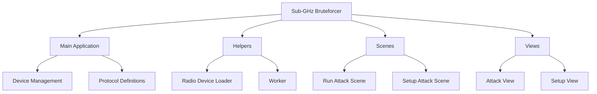
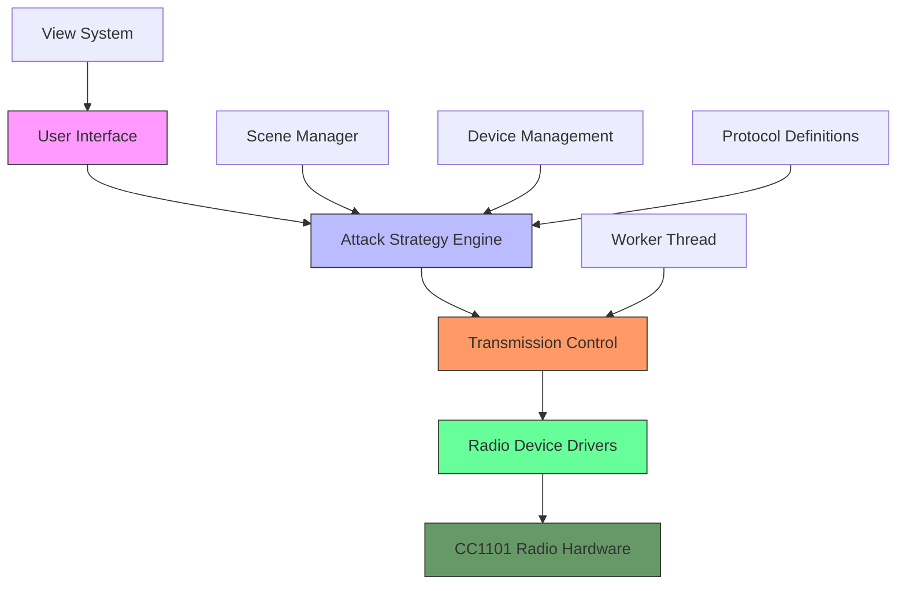
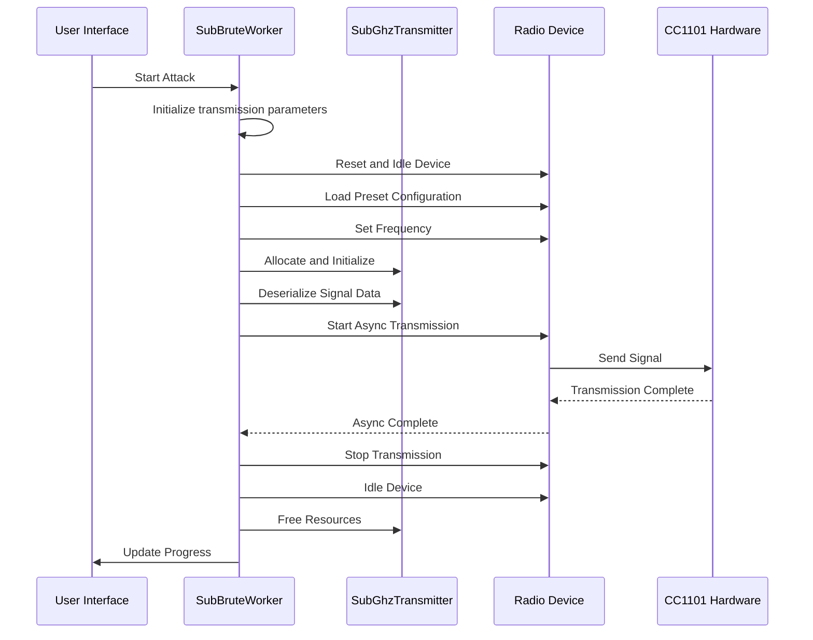
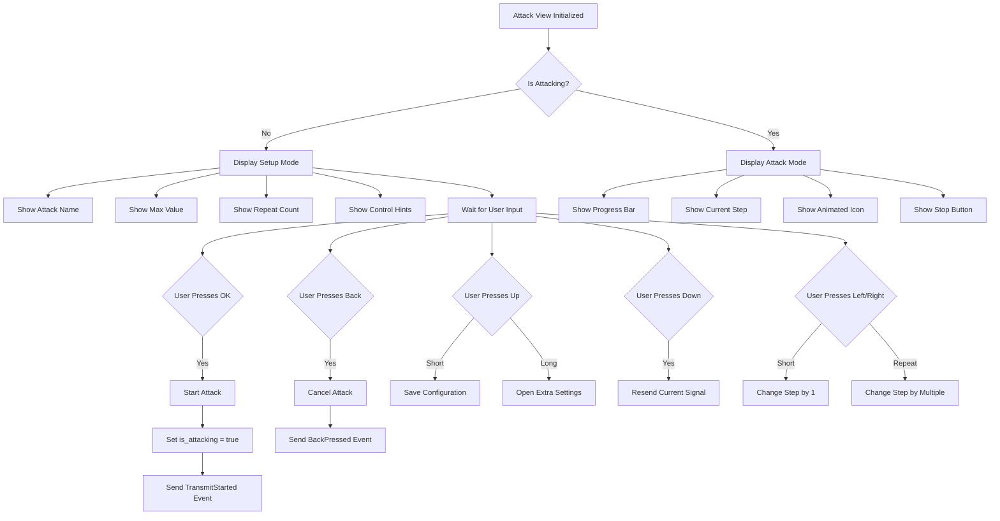
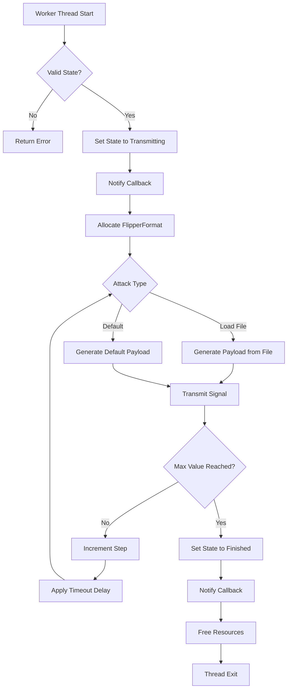

# Brute Force Tools

<cite>
**Referenced Files in This Document**   
- [subbrute_device.h](file://applications/external/subghz_bruteforcer/subbrute_device.h)
- [subbrute_protocols.h](file://applications/external/subghz_bruteforcer/subbrute_protocols.h)
- [subbrute_protocols.c](file://applications/external/subghz_bruteforcer/subbrute_protocols.c)
- [subbrute_worker.c](file://applications/external/subghz_bruteforcer/helpers/subbrute_worker.c)
- [subbrute_scene_run_attack.c](file://applications/external/subghz_bruteforcer/scenes/subbrute_scene_run_attack.c)
- [subbrute_attack_view.c](file://applications/external/subghz_bruteforcer/views/subbrute_attack_view.c)
- [subbrute_radio_device_loader.c](file://applications/external/subghz_bruteforcer/helpers/subbrute_radio_device_loader.c)
- [subbrute_radio_device_loader.h](file://applications/external/subghz_bruteforcer/helpers/subbrute_radio_device_loader.h)
</cite>

## Table of Contents
1. [Introduction](#introduction)
2. [Project Structure](#project-structure)
3. [Core Components](#core-components)
4. [Architecture Overview](#architecture-overview)
5. [Detailed Component Analysis](#detailed-component-analysis)
6. [Attack Strategy Engine](#attack-strategy-engine)
7. [Transmission Control and Radio Interface](#transmission-control-and-radio-interface)
8. [User Interface and Attack Configuration](#user-interface-and-attack-configuration)
9. [Worker Thread and Transmission Sequence](#worker-thread-and-transmission-sequence)
10. [Performance and Reliability Considerations](#performance-and-reliability-considerations)
11. [Troubleshooting Guide](#troubleshooting-guide)
12. [Conclusion](#conclusion)

## Introduction
The Sub-GHz Bruteforcer application is a specialized tool designed for systematic attack methods against wireless security systems operating in the sub-gigahertz frequency range. This document provides a comprehensive analysis of the application's architecture, focusing on the attack strategy engine, transmission control mechanisms, feedback processing, and the integration between the bruteforce application, Sub-GHz transmitter, and radio device drivers. The analysis covers implementation details of various attack patterns including rolling code, fixed code, and hybrid approaches, as well as the worker thread management of transmission sequences. Special attention is given to the relationship between the user interface for configuring attacks and the underlying transmission logic, addressing common issues such as attack duration optimization, signal reliability, and detection avoidance.

## Project Structure
The Sub-GHz Bruteforcer is organized within the external applications directory of the Flipper Zero firmware repository. The application follows a modular structure with distinct components for device management, protocol definitions, worker operations, scene management, and user interface elements. The core functionality is distributed across several key directories: the main application files, helpers for radio device management and worker operations, scenes for state management, and views for user interface rendering.

**Diagram sources**
- [subbrute_device.h](file://applications/external/subghz_bruteforcer/subbrute_device.h)
- [subbrute_protocols.h](file://applications/external/subghz_bruteforcer/subbrute_protocols.h)
- [subbrute_worker.c](file://applications/external/subghz_bruteforcer/helpers/subbrute_worker.c)
- [subbrute_scene_run_attack.c](file://applications/external/subghz_bruteforcer/scenes/subbrute_scene_run_attack.c)
- [subbrute_attack_view.c](file://applications/external/subghz_bruteforcer/views/subbrute_attack_view.c)

**Section sources**
- [subbrute_device.h](file://applications/external/subghz_bruteforcer/subbrute_device.h)
- [subbrute_protocols.h](file://applications/external/subghz_bruteforcer/subbrute_protocols.h)

## Core Components
The Sub-GHz Bruteforcer application consists of several core components that work together to implement systematic attack methods against wireless security systems. The primary components include the device management system, protocol definitions, worker thread for transmission control, scene manager for state transitions, and view system for user interface rendering. The device management system, implemented in `subbrute_device.h`, defines the `SubBruteDevice` structure that encapsulates all state information required for a brute force attack, including protocol information, current step, receiver, decoder result, environment, radio device, attack state, maximum value, and extra repeats.

The protocol definitions, contained in `subbrute_protocols.h` and `subbrute_protocols.c`, provide a comprehensive set of supported protocols for various manufacturers and frequency bands. These protocols are defined as constant structures with specific parameters such as frequency, bit length, transmission time, repeat count, preset type, and file protocol. The worker thread, implemented in `subbrute_worker.c`, manages the transmission sequence and handles the actual sending of signals. The scene manager, represented by files like `subbrute_scene_run_attack.c`, controls the application's state transitions and user flow. Finally, the view system, implemented in `subbrute_attack_view.c`, provides the user interface for configuring and monitoring attacks.

**Section sources**
- [subbrute_device.h](file://applications/external/subghz_bruteforcer/subbrute_device.h)
- [subbrute_protocols.h](file://applications/external/subghz_bruteforcer/subbrute_protocols.h)
- [subbrute_protocols.c](file://applications/external/subghz_bruteforcer/subbrute_protocols.c)
- [subbrute_worker.c](file://applications/external/subghz_bruteforcer/helpers/subbrute_worker.c)
- [subbrute_scene_run_attack.c](file://applications/external/subghz_bruteforcer/scenes/subbrute_scene_run_attack.c)
- [subbrute_attack_view.c](file://applications/external/subghz_bruteforcer/views/subbrute_attack_view.c)

## Architecture Overview
The Sub-GHz Bruteforcer application follows a layered architecture with clear separation of concerns between the user interface, attack logic, transmission control, and hardware interface layers. The application is built on the Flipper Zero firmware framework, leveraging its sub-GHz radio capabilities and event-driven architecture. The overall architecture can be visualized as a stack with the user interface at the top, followed by the attack strategy engine, transmission control layer, and radio device drivers at the bottom.

**Diagram sources**
- [subbrute_device.h](file://applications/external/subghz_bruteforcer/subbrute_device.h)
- [subbrute_protocols.h](file://applications/external/subghz_bruteforcer/subbrute_protocols.h)
- [subbrute_worker.c](file://applications/external/subghz_bruteforcer/helpers/subbrute_worker.c)
- [subbrute_scene_run_attack.c](file://applications/external/subghz_bruteforcer/scenes/subbrute_scene_run_attack.c)
- [subbrute_attack_view.c](file://applications/external/subghz_bruteforcer/views/subbrute_attack_view.c)

## Detailed Component Analysis

### Attack Strategy Engine
The attack strategy engine is the core component responsible for defining and managing different attack patterns against wireless security systems. Implemented primarily through the protocol definitions in `subbrute_protocols.h` and `subbrute_protocols.c`, the engine supports a wide range of attack types categorized by manufacturer, frequency, and bit length. The engine uses an enumeration `SubBruteAttacks` to define all supported attack types, each representing a specific combination of protocol, frequency, and bit configuration.

The attack patterns are implemented as constant structures of type `SubBruteProtocol`, which contain essential parameters for each attack type:
- **Frequency**: Operating frequency in Hz (e.g., 303875000 for CAME 12bit 303MHz)
- **Bits**: Number of bits in the code (e.g., 12 for CAME, 9 for Chamberlain)
- **Transmission Time (te)**: Timing parameter for signal transmission
- **Repeat Count**: Number of times to repeat the transmission
- **Preset**: Radio configuration preset (e.g., FuriHalSubGhzPresetOok650Async)
- **File Protocol**: Associated file protocol for loading/saving

The engine supports three primary attack patterns:
1. **Fixed Code Attacks**: For systems with static codes, where the entire code space is systematically tested
2. **Rolling Code Attacks**: For systems with incrementing codes, where the attack follows a predictable sequence
3. **Hybrid Attacks**: For systems with complex patterns, combining elements of both fixed and rolling code approaches

```mermaid
classDiagram
class SubBruteProtocol {
+uint32_t frequency
+uint8_t bits
+uint32_t te
+uint8_t repeat
+uint8_t opencode
+FuriHalSubGhzPreset preset
+SubBruteFileProtocol file
}
class SubBruteAttacks {
+SubBruteAttackCAME12bit303
+SubBruteAttackCAME12bit307
+SubBruteAttackCAME12bit315
+SubBruteAttackCAME12bit330
+SubBruteAttackCAME12bit433
+SubBruteAttackCAME12bit868
+SubBruteAttackNICE12bit433
+SubBruteAttackNICE12bit868
+SubBruteAttackAnsonic12bit433075
+SubBruteAttackAnsonic12bit433
+SubBruteAttackAnsonic12bit434
+SubBruteAttackHoltek12bitFM433
+SubBruteAttackHoltek12bitAM433
+SubBruteAttackHoltek12bitAM315
+SubBruteAttackHoltek12bitAM868
+SubBruteAttackHoltek12bitAM915
+SubBruteAttackChamberlain9bit300
+SubBruteAttackChamberlain9bit315
+SubBruteAttackChamberlain9bit318
+SubBruteAttackChamberlain9bit390
+SubBruteAttackChamberlain9bit433
+SubBruteAttackChamberlain8bit300
+SubBruteAttackChamberlain8bit315
+SubBruteAttackChamberlain8bit390
+SubBruteAttackChamberlain7bit300
+SubBruteAttackChamberlain7bit315
+SubBruteAttackChamberlain7bit390
+SubBruteAttackLinear10bit300
+SubBruteAttackLinear10bit310
+SubBruteAttackLinearDelta8bit310
+SubBruteAttackUNILARM24bit330
+SubBruteAttackUNILARM24bit433
+SubBruteAttackSMC532624bit330
+SubBruteAttackSMC532624bit433
+SubBruteAttackPT226024bit315
+SubBruteAttackPT226024bit330
+SubBruteAttackPT226024bit390
+SubBruteAttackPT226024bit433
+SubBruteAttackLoadFile
+SubBruteAttackTotalCount
}
class SubBruteFileProtocol {
+CAMEFileProtocol
+NICEFileProtocol
+ChamberlainFileProtocol
+LinearFileProtocol
+LinearDeltaFileProtocol
+PrincetonFileProtocol
+RAWFileProtocol
+BETTFileProtocol
+ClemsaFileProtocol
+DoitrandFileProtocol
+GateTXFileProtocol
+MagellanFileProtocol
+IntertechnoV3FileProtocol
+AnsonicFileProtocol
+SMC5326FileProtocol
+UNILARMFileProtocol
+PT2260FileProtocol
+PT2262FileProtocol
+HoneywellFileProtocol
+HoltekFileProtocol
+LegrandFileProtocol
+HollarmileProtocol
+GangQiFileProtocol
+Marantec24FileProtocol
+FeronFileProtocol
+UnknownFileProtocol
+TotalFileProtocol
}
SubBruteAttacks --> SubBruteProtocol : "defines"
SubBruteProtocol --> SubBruteFileProtocol : "uses"
```

**Diagram sources**
- [subbrute_protocols.h](file://applications/external/subghz_bruteforcer/subbrute_protocols.h)
- [subbrute_protocols.c](file://applications/external/subghz_bruteforcer/subbrute_protocols.c)

**Section sources**
- [subbrute_protocols.h](file://applications/external/subghz_bruteforcer/subbrute_protocols.h)
- [subbrute_protocols.c](file://applications/external/subghz_bruteforcer/subbrute_protocols.c)

### Transmission Control and Radio Interface
The transmission control system manages the interface between the bruteforce application and the Sub-GHz transmitter, handling all aspects of signal generation and transmission. This system is implemented in the `subbrute_worker.c` file and relies on the Flipper Zero's sub-GHz radio device drivers. The core component is the `SubBruteWorker` structure, which maintains the state of the transmission process, including the current step, frequency, bit length, transmission time, repeat count, maximum value, and file key.

The radio interface is managed through the `subbrute_radio_device_loader` module, which provides functions for initializing and managing the radio hardware. The `subbrute_radio_device_loader_set` function selects the appropriate radio device (internal or external CC1101) and initializes it for use. The loader handles power management for the radio device, ensuring that the OTG (On-The-Go) power is enabled when an external device is used.

The transmission process follows a specific sequence:
1. Reset and idle the radio device
2. Load the appropriate preset configuration
3. Set the transmission frequency
4. Prepare the transmitter with the encoded signal data
5. Start asynchronous transmission
6. Wait for transmission completion
7. Stop transmission and return device to idle state

**Diagram sources**
- [subbrute_worker.c](file://applications/external/subghz_bruteforcer/helpers/subbrute_worker.c)
- [subbrute_radio_device_loader.c](file://applications/external/subghz_bruteforcer/helpers/subbrute_radio_device_loader.c)
- [subbrute_radio_device_loader.h](file://applications/external/subghz_bruteforcer/helpers/subbrute_radio_device_loader.h)

**Section sources**
- [subbrute_worker.c](file://applications/external/subghz_bruteforcer/helpers/subbrute_worker.c)
- [subbrute_radio_device_loader.c](file://applications/external/subghz_bruteforcer/helpers/subbrute_radio_device_loader.c)
- [subbrute_radio_device_loader.h](file://applications/external/subghz_bruteforcer/helpers/subbrute_radio_device_loader.h)

### User Interface and Attack Configuration
The user interface for the Sub-GHz Bruteforcer is implemented using the Flipper Zero's GUI framework, with a focus on providing intuitive controls for configuring and monitoring attacks. The interface is divided into two main components: the attack view for displaying current attack status and controls, and the scene manager for handling state transitions.

The attack view, implemented in `subbrute_attack_view.c`, provides a visual representation of the current attack progress, including:
- Attack name and type
- Current step and maximum value
- Progress bar showing completion percentage
- Repeat count
- Animated icon indicating transmission status

Users can interact with the interface using the device's physical buttons:
- **OK Button**: Start or stop the attack
- **Back Button**: Cancel the current attack
- **Up Button**: Save the current configuration to a file
- **Down Button**: Resend the current signal
- **Left/Right Buttons**: Adjust the current step (single or multiple steps)

The scene manager, implemented in `subbrute_scene_run_attack.c`, handles the application's state transitions and event processing. When entering the attack scene, the system initializes the worker thread and starts the transmission process. The scene listens for custom events from the worker thread, such as transmission completion or errors, and updates the user interface accordingly.

**Diagram sources**
- [subbrute_attack_view.c](file://applications/external/subghz_bruteforcer/views/subbrute_attack_view.c)
- [subbrute_scene_run_attack.c](file://applications/external/subghz_bruteforcer/scenes/subbrute_scene_run_attack.c)

**Section sources**
- [subbrute_attack_view.c](file://applications/external/subghz_bruteforcer/views/subbrute_attack_view.c)
- [subbrute_scene_run_attack.c](file://applications/external/subghz_bruteforcer/scenes/subbrute_scene_run_attack.c)

### Worker Thread and Transmission Sequence
The worker thread is the engine that drives the brute force attack, managing the transmission sequence and coordinating between the user interface and the radio hardware. Implemented in `subbrute_worker.c`, the worker thread runs in a separate execution context to ensure that the user interface remains responsive during long-running attacks.

The worker thread follows a structured execution pattern:
1. Validate that the worker is properly initialized and not already running
2. Set the worker state to transmitting and notify the callback
3. Allocate a FlipperFormat structure for signal data
4. Enter a loop that continues while the worker is running
5. Generate the payload for the current step
6. Transmit the signal
7. Increment the step counter
8. Apply transmission timeout delay
9. Check if the maximum value has been reached
10. Clean up resources and notify completion

The transmission sequence is carefully orchestrated to ensure signal reliability and avoid hardware issues. Before each transmission, the system checks that sufficient time has elapsed since the last transmission (controlled by `SUBBRUTE_MANUAL_TRANSMIT_INTERVAL`). The actual transmission process involves several critical steps:

The `subbrute_worker_subghz_transmit` function handles the low-level transmission process:
1. Wait for any previous transmission to complete
2. Free any existing transmitter instance
3. Allocate and initialize a new transmitter with the appropriate protocol
4. Deserialize the signal data into the transmitter
5. Reset and idle the radio device
6. Load the preset configuration
7. Set the transmission frequency
8. Start asynchronous transmission
9. Wait for transmission completion
10. Stop transmission and return device to idle state
11. Clean up transmitter resources

This careful sequencing ensures that each transmission is properly isolated and that the radio hardware is in the correct state for each operation.

**Diagram sources**
- [subbrute_worker.c](file://applications/external/subghz_bruteforcer/helpers/subbrute_worker.c)

**Section sources**
- [subbrute_worker.c](file://applications/external/subghz_bruteforcer/helpers/subbrute_worker.c)

## Performance and Reliability Considerations
The Sub-GHz Bruteforcer application incorporates several features to optimize attack duration, ensure signal reliability, and minimize the risk of detection. These considerations are critical for effective operation in real-world scenarios where transmission quality and timing precision are paramount.

### Attack Duration Optimization
The application provides several mechanisms for optimizing attack duration:
- **Configurable Repeat Count**: Users can adjust the number of times each signal is transmitted, balancing reliability against speed
- **Transmission Timeout Control**: The `tx_timeout_ms` parameter allows fine-tuning of the delay between transmissions
- **Step Increment Options**: Users can increment the current step by one or multiple values, enabling rapid navigation through the code space
- **Pre-configured Protocols**: The extensive library of pre-defined protocols eliminates the need for manual configuration, reducing setup time

### Signal Reliability
Signal reliability is ensured through several design choices:
- **Hardware Reset**: The radio device is reset before each transmission sequence to ensure consistent starting conditions
- **Preset Configuration**: Standardized preset configurations (e.g., FuriHalSubGhzPresetOok650Async) provide optimized radio settings for different modulation types
- **Frequency Validation**: The system checks that the selected frequency is valid for the current radio device
- **Transmission Completion Monitoring**: The system waits for explicit confirmation that each transmission has completed before proceeding

### Detection Avoidance
While the application does not explicitly implement detection avoidance features, certain design aspects contribute to lower detectability:
- **Controlled Transmission Rate**: The configurable timeout between transmissions prevents excessively rapid signaling that might trigger detection systems
- **Precise Timing**: The use of the CC1101 radio chip with precise timing control ensures clean signal generation
- **Frequency Hopping**: The ability to target different frequencies allows users to avoid crowded or monitored bands

### Timing Precision and Frequency Hopping
The application leverages the CC1101 radio chip's capabilities for high timing precision and frequency control. The CC1101 provides:
- **Accurate Frequency Synthesis**: The chip's frequency synthesizer ensures precise frequency generation with minimal drift
- **Fast Frequency Switching**: Enables rapid switching between frequencies when implementing frequency hopping techniques
- **Stable Clock Source**: The chip's internal timing circuits provide consistent signal timing
- **Programmable Data Rate**: Allows optimization of transmission speed for different protocols

The software implements additional timing controls:
- **Tick-based Delay**: Uses the system tick counter (`furi_get_tick()`) for precise timing measurements
- **Transmission Interval Enforcement**: Ensures minimum intervals between transmissions to prevent hardware stress
- **Synchronized Operations**: Coordinates radio operations to minimize timing jitter

**Section sources**
- [subbrute_worker.c](file://applications/external/subghz_bruteforcer/helpers/subbrute_worker.c)
- [subbrute_radio_device_loader.c](file://applications/external/subghz_bruteforcer/helpers/subbrute_radio_device_loader.c)

## Troubleshooting Guide
This section addresses common issues encountered when using the Sub-GHz Bruteforcer application and provides solutions for each.

### Radio Device Connection Issues
**Problem**: External CC1101 device not detected
**Solution**: 
1. Ensure the external device is properly connected
2. Verify that OTG power is available and functioning
3. Check the USB voltage (should be above 4.5V)
4. Restart the application and try again

**Problem**: Radio device fails to initialize
**Solution**:
1. Check for error messages in the system log
2. Verify that the selected frequency is supported by the radio device
3. Ensure the correct preset configuration is selected
4. Try using the internal radio device instead of external

### Transmission Failures
**Problem**: Signals not being transmitted
**Solution**:
1. Verify that the worker thread is running
2. Check that the transmission frequency is valid
3. Ensure sufficient power is available
4. Confirm that the signal payload is properly formatted

**Problem**: Inconsistent transmission results
**Solution**:
1. Increase the transmission repeat count
2. Adjust the transmission timeout value
3. Verify the antenna connection
4. Check for interference from other devices

### User Interface Issues
**Problem**: Attack view not updating
**Solution**:
1. Ensure the callback functions are properly registered
2. Verify that the worker thread is sending state updates
3. Check for memory allocation issues
4. Restart the application

**Problem**: Controls not responding
**Solution**:
1. Verify that input callbacks are properly registered
2. Check for thread blocking issues
3. Ensure the application is not in an error state
4. Restart the application

### Performance Issues
**Problem**: Slow transmission rate
**Solution**:
1. Reduce the transmission timeout value
2. Decrease the repeat count
3. Ensure the system is not performing other intensive operations
4. Use a more efficient protocol if available

**Problem**: High power consumption
**Solution**:
1. Minimize the use of external radio devices when not needed
2. Reduce the transmission repeat count
3. Increase the transmission timeout to allow for power saving
4. Use the internal radio device when possible

**Section sources**
- [subbrute_worker.c](file://applications/external/subghz_bruteforcer/helpers/subbrute_worker.c)
- [subbrute_radio_device_loader.c](file://applications/external/subghz_bruteforcer/helpers/subbrute_radio_device_loader.c)
- [subbrute_attack_view.c](file://applications/external/subghz_bruteforcer/views/subbrute_attack_view.c)
- [subbrute_scene_run_attack.c](file://applications/external/subghz_bruteforcer/scenes/subbrute_scene_run_attack.c)

## Conclusion
The Sub-GHz Bruteforcer application represents a sophisticated implementation of systematic attack methods against wireless security systems. Its architecture demonstrates a well-structured approach to brute force attacks, with clear separation of concerns between the user interface, attack strategy engine, transmission control, and hardware interface layers.

The application's strength lies in its comprehensive protocol library, supporting a wide range of manufacturers and frequency bands, and its flexible attack patterns that accommodate both fixed and rolling code systems. The worker thread implementation ensures reliable transmission sequencing while maintaining a responsive user interface.

Key technical features include precise timing control, frequency validation, and robust error handling, all of which contribute to the application's effectiveness and reliability. The integration with the Flipper Zero's sub-GHz radio capabilities provides a powerful platform for wireless security testing.

For developers, the codebase offers valuable insights into embedded systems programming, real-time operation, and hardware interfacing. The modular design and clear API boundaries make it accessible for customization and extension. For users, the intuitive interface and comprehensive feature set make it a powerful tool for security research and testing.

Future enhancements could include more sophisticated detection avoidance features, adaptive transmission rate control, and expanded protocol support for emerging wireless technologies.