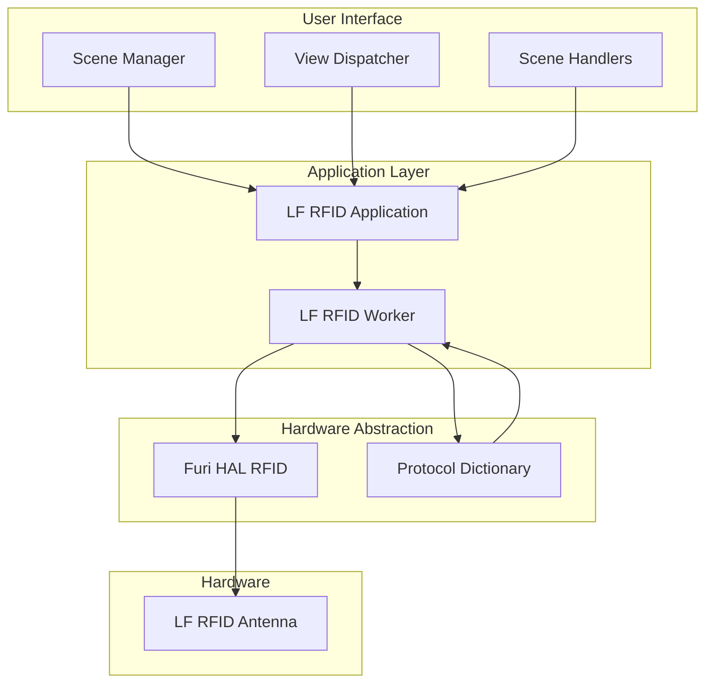
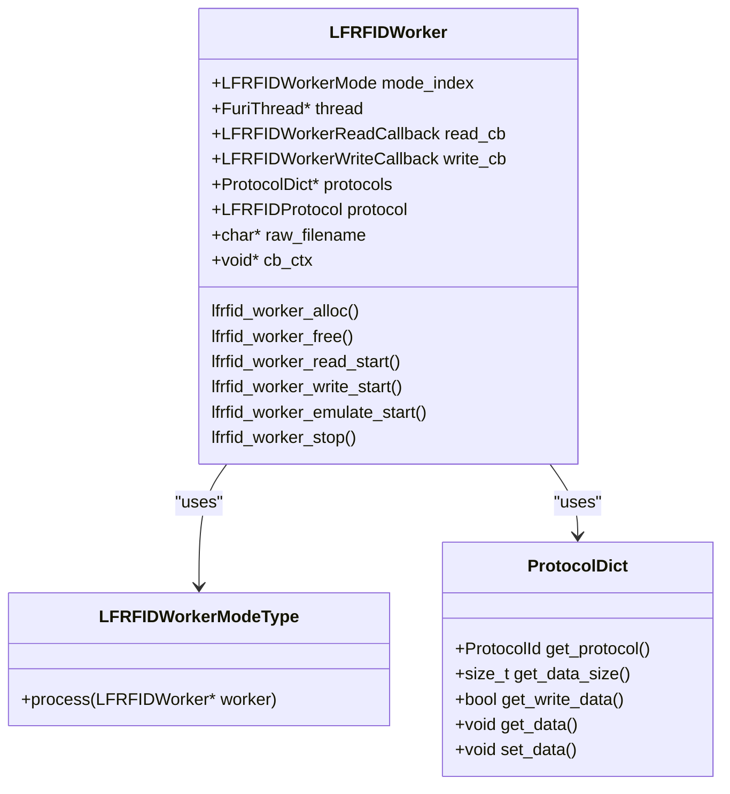
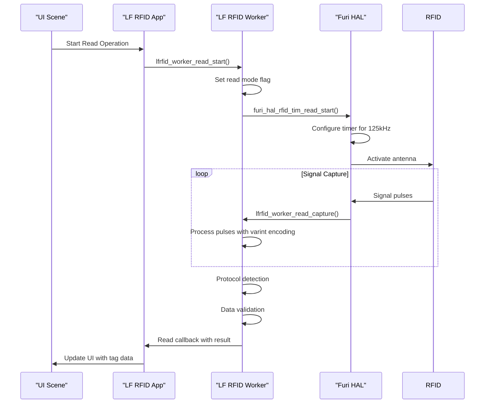
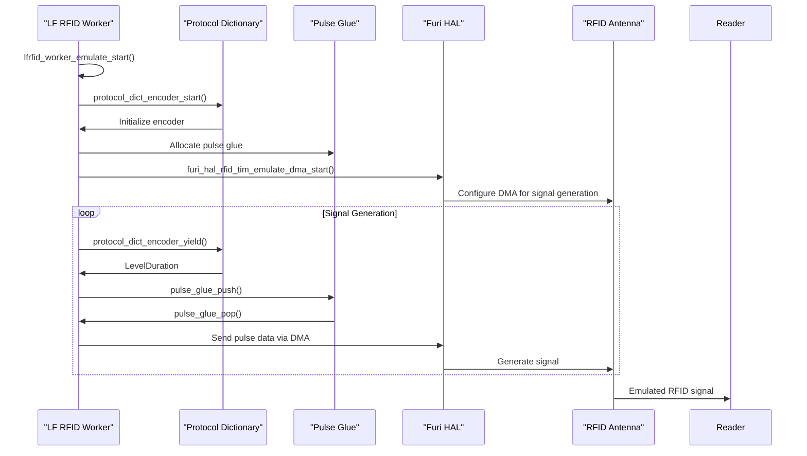
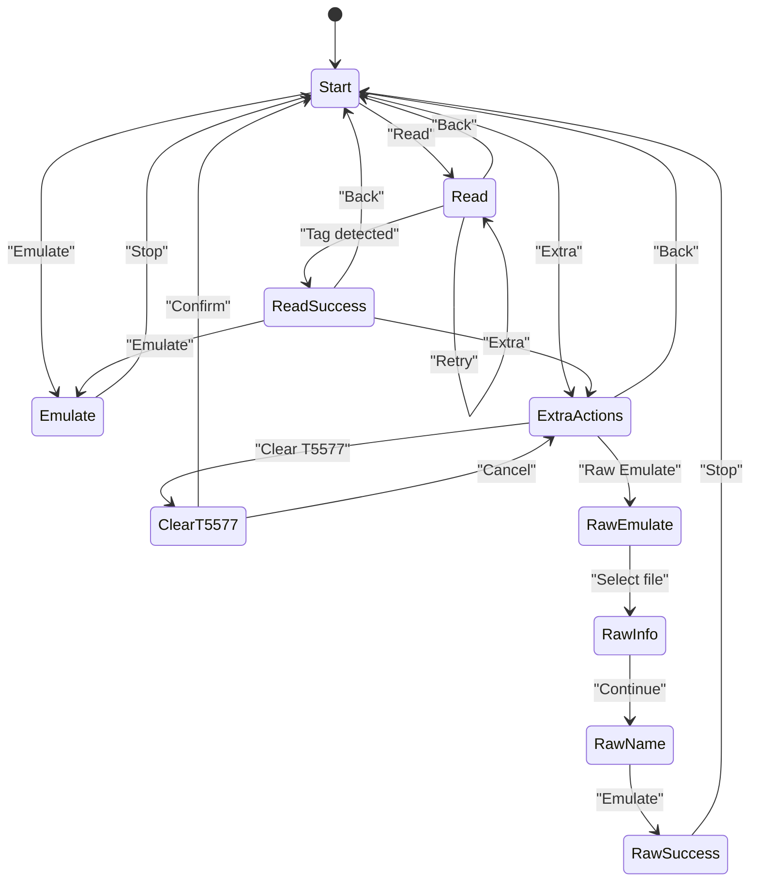

# RFID Cloning

<cite>
**Referenced Files in This Document**   
- [lfrfid_worker.h](file://lib/lfrfid/lfrfid_worker.h)
- [lfrfid_worker.c](file://lib/lfrfid/lfrfid_worker.c)
- [lfrfid_worker_modes.c](file://lib/lfrfid/lfrfid_worker_modes.c)
- [lfrfid_worker_i.h](file://lib/lfrfid/lfrfid_worker_i.h)
- [lfrfid.c](file://applications/main/lfrfid/lfrfid.c)
- [lfrfid_scene_read.c](file://applications/main/lfrfid/scenes/lfrfid_scene_read.c)
- [lfrfid_scene_emulate.c](file://applications/main/lfrfid/scenes/lfrfid_scene_emulate.c)
- [lfrfid_view_read.h](file://applications/main/lfrfid/views/lfrfid_view_read.h)
- [lfrfid_raw_worker.h](file://lib/lfrfid/lfrfid_raw_worker.h)
- [lfrfid_hitag_worker.h](file://lib/lfrfid/lfrfid_hitag_worker.h)
</cite>

## Table of Contents
1. [Introduction](#introduction)
2. [Architecture Overview](#architecture-overview)
3. [LF RFID Worker Implementation](#lf-rfid-worker-implementation)
4. [Read Operation Workflow](#read-operation-workflow)
5. [Write Operation Workflow](#write-operation-workflow)
6. [Emulation Mode](#emulation-mode)
7. [UI Integration and Scene Management](#ui-integration-and-scene-management)
8. [Common Issues and Solutions](#common-issues-and-solutions)
9. [Protocol Processing and Data Encoding](#protocol-processing-and-data-encoding)
10. [Conclusion](#conclusion)

## Introduction
The RFID Cloning feature in the Flipper Zero firmware enables users to read, analyze, and replicate low-frequency (LF) RFID tags. This document provides a comprehensive technical analysis of the implementation, focusing on the cloning capabilities for LF RFID tags. The system is designed to support various LF RFID protocols including EM4100, HID, Indala, and T5577, allowing users to clone access cards, key fobs, and other RFID-based security tokens.

The implementation follows a modular architecture with clear separation between the user interface, application logic, and hardware abstraction layers. The core functionality is provided by the LF RFID worker component, which handles all low-level RFID operations including reading, writing, and emulation. This document will explore the technical details of how the system captures RFID data, processes it, and writes it to blank tags, with particular focus on the interaction between the various components and the underlying hardware.

## Architecture Overview



**Diagram sources**
- [lfrfid.c](file://applications/main/lfrfid/lfrfid.c)
- [lfrfid_worker.h](file://lib/lfrfid/lfrfid_worker.h)
- [lfrfid_worker.c](file://lib/lfrfid/lfrfid_worker.c)

**Section sources**
- [lfrfid.c](file://applications/main/lfrfid/lfrfid.c#L1-L386)
- [lfrfid_worker.h](file://lib/lfrfid/lfrfid_worker.h#L1-L166)

The architecture of the LF RFID cloning system follows a layered approach with clear separation of concerns. At the highest level, the user interface is managed by the scene manager and view dispatcher, which handle user interactions and screen navigation. The application layer contains the LF RFID application logic and the worker component that performs the actual RFID operations. The hardware abstraction layer provides access to the physical RFID hardware and protocol processing capabilities.

The LF RFID worker operates as a separate thread, communicating with the main application through callback functions. This design allows for non-blocking operations, ensuring that the user interface remains responsive during potentially lengthy RFID operations. The worker interacts with the Furi Hardware Abstraction Layer (HAL) to control the RFID antenna and read/write signals, while using the protocol dictionary to decode and encode various RFID formats.

## LF RFID Worker Implementation



**Diagram sources**
- [lfrfid_worker.h](file://lib/lfrfid/lfrfid_worker.h#L1-L166)
- [lfrfid_worker.c](file://lib/lfrfid/lfrfid_worker.c#L1-L196)
- [lfrfid_worker_i.h](file://lib/lfrfid/lfrfid_worker_i.h#L1-L67)

**Section sources**
- [lfrfid_worker.h](file://lib/lfrfid/lfrfid_worker.h#L1-L166)
- [lfrfid_worker.c](file://lib/lfrfid/lfrfid_worker.c#L1-L196)
- [lfrfid_worker_i.h](file://lib/lfrfid/lfrfid_worker_i.h#L1-L67)

The LF RFID worker is the core component responsible for all low-level RFID operations. It is implemented as a state machine with different modes for reading, writing, and emulation. The worker runs in a separate thread to ensure that RFID operations do not block the main application thread, maintaining a responsive user interface.

The worker is initialized with a protocol dictionary that contains information about supported RFID protocols, including their modulation schemes, data formats, and encoding methods. This allows the worker to automatically detect and handle various RFID formats. The worker exposes a simple API with functions to start different operations (read, write, emulate) and register callback functions that are invoked when operations complete or when intermediate events occur.

Key features of the worker implementation include:
- Thread-safe operation using Furi thread flags for inter-thread communication
- Support for multiple RFID protocols through the protocol dictionary
- Error handling and timeout mechanisms for robust operation
- Callback-based design for asynchronous operation
- Support for both standard and raw RFID operations

## Read Operation Workflow



**Diagram sources**
- [lfrfid_worker.c](file://lib/lfrfid/lfrfid_worker.c#L1-L196)
- [lfrfid_worker_modes.c](file://lib/lfrfid/lfrfid_worker_modes.c#L1-L862)
- [lfrfid_scene_read.c](file://applications/main/lfrfid/scenes/lfrfid_scene_read.c)

**Section sources**
- [lfrfid_worker_modes.c](file://lib/lfrfid/lfrfid_worker_modes.c#L1-L862)
- [lfrfid_scene_read.c](file://applications/main/lfrfid/scenes/lfrfid_scene_read.c)

The read operation workflow begins when the user initiates a read operation through the user interface. The application calls the `lfrfid_worker_read_start()` function, passing a callback function that will be invoked when the operation completes. The worker then sets a thread flag to indicate that a read operation should begin.

The worker supports three read modes: ASK (Amplitude Shift Keying), PSK (Phase Shift Keying), and RTF (Reader Talks First). In auto mode, the worker cycles through these modes until a valid tag is detected. For each mode, the worker configures the hardware timer to the appropriate frequency (125kHz for ASK, 62.5kHz for PSK) and starts capturing signal pulses.

Signal pulses are captured through a callback function that receives the signal level (high/low) and duration. These pulses are processed using varint encoding to efficiently store the pulse data in a buffer stream. The buffered data is then fed into the protocol dictionary's decoder, which attempts to identify the RFID protocol and extract the data.

To ensure reliable detection, the system requires multiple consecutive reads of the same data before considering a tag successfully read. This validation process helps prevent false positives from noisy signals. Once a valid tag is detected, the worker invokes the callback function with the protocol ID and data, allowing the application to update the user interface.

## Write Operation Workflow

```mermaid
flowchart TD
A[Start Write Operation] --> B{Protocol Writable?}
B --> |No| C[Return CannotBeWritten]
B --> |Yes| D[Prepare Write Request]
D --> E{Write Type}
E --> |T5577| F[t5577_write()]
E --> |EM4305| G[em4305_write()]
F --> H[Verify Write]
G --> H
H --> I{Read Back Data}
I --> |Match| J[Return OK]
I --> |No Match| K[Retry or Return FobCannotBeWritten]
I --> |Timeout| L[Return TooLongToWrite]
```

**Diagram sources**
- [lfrfid_worker_modes.c](file://lib/lfrfid/lfrfid_worker_modes.c#L600-L799)
- [lfrfid.c](file://applications/main/lfrfid/lfrfid.c#L1-L386)

**Section sources**
- [lfrfid_worker_modes.c](file://lib/lfrfid/lfrfid_worker_modes.c#L600-L799)

The write operation workflow begins when the user selects a tag to write to a blank card. The application calls `lfrfid_worker_write_start()` with the target protocol and a callback function. The worker first checks if the selected protocol can be written by querying the protocol dictionary.

If the protocol is writable, the worker prepares a write request structure containing the data to be written. The system supports different write types for various blank tag formats, with T5577 and EM4305 being the most common. The appropriate write function is called based on the tag type.

After writing the data, the system verifies the write operation by reading the tag and comparing the data with the original. This verification process is repeated up to five times if the initial read fails. If the data matches, the operation is considered successful. If multiple verification attempts fail, the system returns a "FobCannotBeWritten" error.

The write operation includes several safeguards:
- Timeout protection to prevent infinite loops
- Maximum retry limits to avoid endless write attempts
- Verification of written data to ensure accuracy
- Error handling for incompatible tag types

For T5577 tags with password protection, the system supports writing with a password using the `lfrfid_worker_write_and_set_pass_start()` function. This allows cloning of password-protected tags by writing both the tag data and the password to block 7 of the T5577 chip.

## Emulation Mode



**Diagram sources**
- [lfrfid_worker_modes.c](file://lib/lfrfid/lfrfid_worker_modes.c#L400-L599)
- [lfrfid_worker.c](file://lib/lfrfid/lfrfid_worker.c#L1-L196)

**Section sources**
- [lfrfid_worker_modes.c](file://lib/lfrfid/lfrfid_worker_modes.c#L400-L599)

Emulation mode allows the Flipper Zero to mimic an RFID tag by generating the appropriate signal pattern. When emulation is started, the worker configures the hardware to generate signals at 125kHz for TTF (Tag Talks First) protocols or to respond to reader signals for RTF (Reader Talks First) protocols.

For TTF protocols, the system uses a double-buffered DMA (Direct Memory Access) approach to generate the signal continuously without CPU intervention. The protocol dictionary provides the signal pattern as a sequence of level and duration values, which are converted to pulse and duration values by the pulse glue component. These values are loaded into two buffers that are alternately sent to the hardware timer via DMA, ensuring seamless signal generation.

The emulation process involves:
1. Initializing the protocol encoder with the target protocol data
2. Setting up the DMA transfer with initial pulse data
3. Continuously refilling the DMA buffers while the signal is being generated
4. Responding to reader commands for RTF protocols like HID

The system can emulate various protocols including EM4100, HID, and Indala, making it compatible with a wide range of RFID readers. The emulation continues until explicitly stopped by the user or until a timeout occurs.

## UI Integration and Scene Management



**Diagram sources**
- [lfrfid.c](file://applications/main/lfrfid/lfrfid.c#L1-L386)
- [lfrfid_scene.c](file://applications/main/lfrfid/scenes/lfrfid_scene.c)
- [lfrfid_scene_read.c](file://applications/main/lfrfid/scenes/lfrfid_scene_read.c)
- [lfrfid_scene_emulate.c](file://applications/main/lfrfid/scenes/lfrfid_scene_emulate.c)

**Section sources**
- [lfrfid.c](file://applications/main/lfrfid/lfrfid.c#L1-L386)
- [lfrfid_scene.c](file://applications/main/lfrfid/scenes/lfrfid_scene.c)

The user interface for the LF RFID application is implemented using the Flipper Zero's scene management system, which provides a state machine for navigating between different screens. The main scenes include:
- **Start Scene**: Main menu with options to read, emulate, or access extra actions
- **Read Scene**: Active reading mode with real-time feedback
- **Read Success Scene**: Display of successfully read tag information
- **Emulate Scene**: Active emulation mode
- **Extra Actions Scene**: Additional functionality like clearing T5577 tags

The scene manager handles transitions between these states based on user input and events from the LF RFID worker. For example, when a tag is successfully read, the worker sends a custom event that triggers a transition from the Read scene to the Read Success scene.

The UI components are tightly integrated with the worker through callback functions. When the worker detects a tag, it invokes the read callback, which updates the UI with the tag information. Similarly, write operations trigger callbacks that update the UI with success or error messages.

Key UI components include:
- **lfrfid_view_read**: Custom view for displaying real-time read status
- **dialog_ex**: For confirmation dialogs and error messages
- **popup**: For temporary status messages
- **submenu**: For navigation between main options

The application also supports RPC (Remote Procedure Call) integration, allowing external applications to control the RFID functionality programmatically.

## Common Issues and Solutions

### Signal Strength Problems
**Issue**: Weak or inconsistent signal detection during read operations.
**Solution**: Ensure proper coil alignment between the Flipper Zero and the target tag. The optimal distance is typically 1-2 cm. For weak signals, try rotating the device to find the optimal orientation, as the antenna has directional sensitivity.

### Incompatible Tag Types
**Issue**: "Protocol cannot be written" error when attempting to clone a tag.
**Solution**: This occurs when trying to write a protocol to a tag that doesn't support it. For example, some data formats require specific chip types. Verify that your blank tag supports the target protocol. T5577 tags are the most versatile and support most common formats.

### Write Failures
**Issue**: "Fob cannot be written" error after multiple attempts.
**Solution**: This typically indicates a problem with the blank tag or the writing process. Try these steps:
1. Use a different blank tag
2. Ensure the tag is properly positioned on the Flipper Zero
3. Clean the tag and device contacts
4. Check if the tag requires a specific initialization sequence

### False Readings
**Issue**: The device reads a tag format that doesn't match the expected type.
**Solution**: This can occur with noisy signals or damaged tags. The system requires multiple consistent reads to validate a tag, but in rare cases, noise can be misinterpreted. Try reading the tag multiple times or in a different environment with less electromagnetic interference.

### Emulation Failures
**Issue**: Reader does not respond to emulated signal.
**Solution**: Ensure the emulation protocol matches what the reader expects. Some readers have specific timing requirements. Try different emulation modes or check if the reader requires a specific startup sequence.

## Protocol Processing and Data Encoding

The LF RFID system supports various modulation techniques and data encoding schemes used by different RFID protocols:

### Modulation Techniques
- **ASK (Amplitude Shift Keying)**: Used by EM4100 and similar protocols. Data is encoded by varying the amplitude of the 125kHz carrier wave.
- **PSK (Phase Shift Keying)**: Used by HID and Indala protocols. Data is encoded by shifting the phase of the carrier wave.
- **RTF (Reader Talks First)**: Used by Hitag and similar protocols. The reader sends a command, and the tag responds with its data.

### Data Encoding
- **Manchester Encoding**: Used by many protocols to ensure clock synchronization. Each bit period is divided into two halves, with a transition in the middle. A high-to-low transition represents a 0, while a low-to-high transition represents a 1.
- **Biphase Space Coding**: Similar to Manchester but with different transition rules.
- **PWM (Pulse Width Modulation)**: Used by some protocols where data is encoded in the width of pulses.

The protocol dictionary system allows for flexible support of different formats by defining:
- **Feature flags**: Indicating supported modulation types
- **Data size**: The number of bytes in the tag data
- **Validation count**: Number of consistent reads required for validation
- **Write capabilities**: Whether the protocol can be written to blank tags

When reading a tag, the system simultaneously processes the signal through multiple decoders corresponding to different protocols. The first decoder that produces a valid, consistent result determines the detected protocol. This parallel processing approach enables automatic protocol detection without requiring the user to specify the tag type.

## Conclusion
The RFID Cloning implementation in the Flipper Zero firmware provides a comprehensive solution for reading, writing, and emulating low-frequency RFID tags. The system's modular architecture, with clear separation between the user interface, application logic, and hardware abstraction layers, enables reliable operation while maintaining a responsive user experience.

Key strengths of the implementation include:
- Support for multiple RFID protocols through a flexible protocol dictionary system
- Robust error handling and validation to ensure data integrity
- Efficient signal processing using DMA and buffering techniques
- Comprehensive user interface with clear feedback and error reporting
- Support for both standard and raw RFID operations

The system effectively balances technical complexity with user accessibility, making advanced RFID functionality available to users of all skill levels. For developers, the well-structured codebase and clear API make it easy to extend the system with support for additional protocols or features.

Future improvements could include enhanced signal processing algorithms for better noise rejection, support for additional RFID protocols, and improved power management for extended emulation sessions.