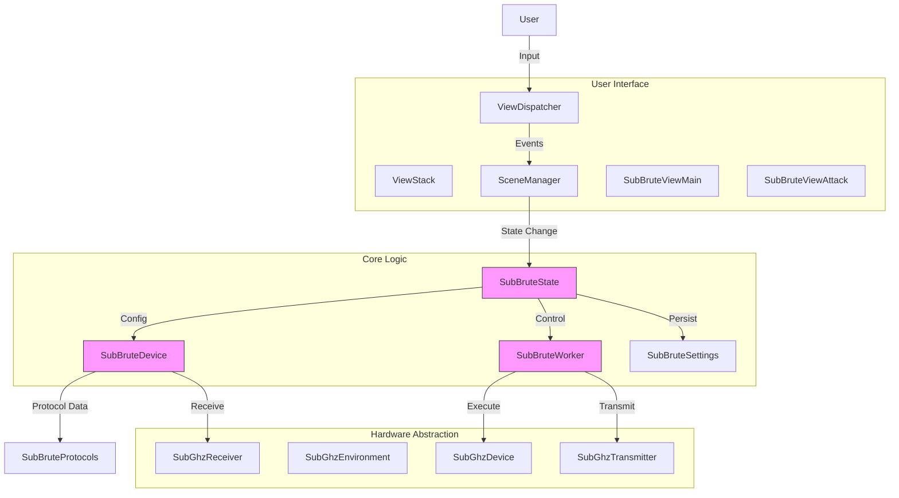
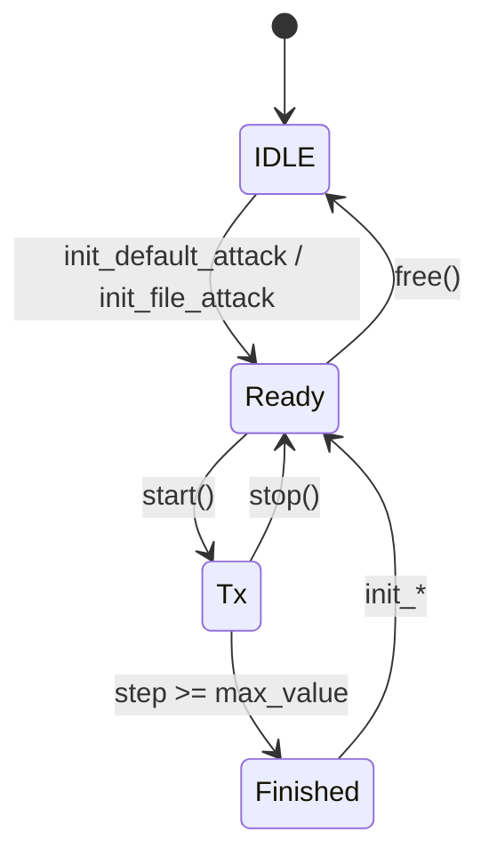
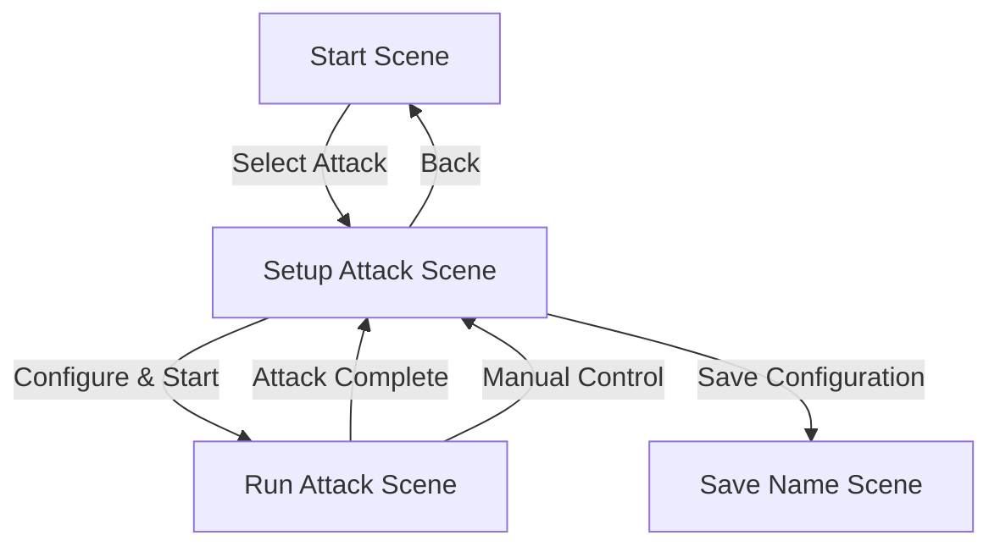
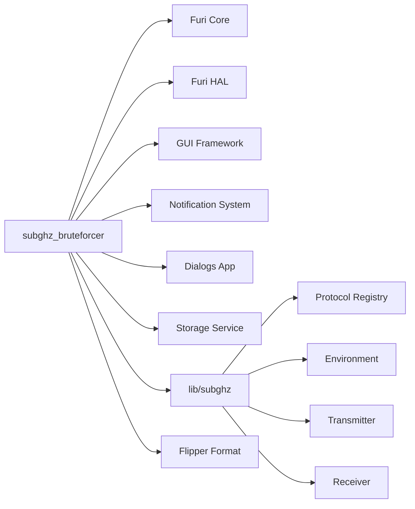

# Security Tools

<cite>
**Referenced Files in This Document**   
- [subbrute.h](file://applications/external/subghz_bruteforcer/subbrute.h)
- [subbrute_i.h](file://applications/external/subghz_bruteforcer/subbrute_i.h)
- [subbrute_worker.c](file://applications/external/subghz_bruteforcer/helpers/subbrute_worker.c)
- [subbrute_worker.h](file://applications/external/subghz_bruteforcer/helpers/subbrute_worker.h)
- [subbrute_device.c](file://applications/external/subghz_bruteforcer/subbrute_device.c)
- [subbrute_device.h](file://applications/external/subghz_bruteforcer/subbrute_device.h)
- [subbrute_protocols.c](file://applications/external/subghz_bruteforcer/subbrute_protocols.c)
- [subbrute_protocols.h](file://applications/external/subghz_bruteforcer/subbrute_protocols.h)
- [subbrute_scene_start.c](file://applications/external/subghz_bruteforcer/scenes/subbrute_scene_start.c)
- [subbrute_scene_setup_attack.c](file://applications/external/subghz_bruteforcer/scenes/subbrute_scene_setup_attack.c)
- [subbrute_scene_run_attack.c](file://applications/external/subghz_bruteforcer/scenes/subbrute_scene_run_attack.c)
</cite>

## Table of Contents
1. [Introduction](#introduction)
2. [Project Structure](#project-structure)
3. [Core Components](#core-components)
4. [Architecture Overview](#architecture-overview)
5. [Detailed Component Analysis](#detailed-component-analysis)
6. [Dependency Analysis](#dependency-analysis)
7. [Performance Considerations](#performance-considerations)
8. [Troubleshooting Guide](#troubleshooting-guide)
9. [Conclusion](#conclusion)

## Introduction
The Flipper Zero is a versatile multi-tool platform capable of advanced security testing and penetration testing operations. This document focuses on the **Security Tools** section, specifically analyzing the **subghz_bruteforcer** plugin, which enables systematic brute force attacks on Sub-GHz wireless protocols. The analysis covers the design, implementation, and ethical usage of RFID cloning, wireless signal analysis, brute force methods, and access control testing features. The subghz_bruteforcer tool exemplifies the integration of protocol libraries, signal capture, and replay attack capabilities within the Flipper Zero ecosystem.

## Project Structure
The subghz_bruteforcer plugin is organized as an external application within the Flipper Zero firmware repository. Its structure follows a modular design pattern, separating concerns into distinct components for device management, worker execution, protocol definitions, and user interface scenes.

```mermaid
graph TD
subghz_bruteforcer["subghz_bruteforcer/"]
subghz_bruteforcer --> helpers["helpers/"]
subghz_bruteforcer --> scenes["scenes/"]
subghz_bruteforcer --> views["views/"]
subghz_bruteforcer --> subbrute.h
subghz_bruteforcer --> subbrute_i.h
subghz_bruteforcer --> subbrute_device.c
subghz_bruteforcer --> subbrute_device.h
subghz_bruteforcer --> subbrute_worker.c
subghz_bruteforcer --> subbrute_worker.h
subghz_bruteforcer --> subbrute_protocols.c
subghz_bruteforcer --> subbrute_protocols.h
helpers --> subbrute_worker_private.h
helpers --> subbrute_radio_device_loader.h
helpers --> subbrute_worker.c
scenes --> subbrute_scene_start.c
scenes --> subbrute_scene_setup_attack.c
scenes --> subbrute_scene_run_attack.c
scenes --> subbrute_scene_load_file.c
scenes --> subbrute_scene_save_name.c
scenes --> subbrute_scene_setup_extra.c
views --> subbrute_main_view.h
views --> subbrute_main_view.c
views --> subbrute_attack_view.h
views --> subbrute_attack_view.c
```



**Diagram sources**
- [subghz_bruteforcer/](file://applications/external/subghz_bruteforcer/)
- [subbrute_worker.c](file://applications/external/subghz_bruteforcer/helpers/subbrute_worker.c)
- [subbrute_device.c](file://applications/external/subghz_bruteforcer/subbrute_device.c)
- [subbrute_protocols.c](file://applications/external/subghz_bruteforcer/subbrute_protocols.c)

**Section sources**
- [subbrute.h](file://applications/external/subghz_bruteforcer/subbrute.h)
- [subbrute_i.h](file://applications/external/subghz_bruteforcer/subbrute_i.h)

## Core Components
The subghz_bruteforcer application is built around three core components: the **SubBruteState** (application state), the **SubBruteWorker** (background execution), and the **SubBruteDevice** (device and protocol management). These components work in concert to manage the brute force attack lifecycle, from user input to signal transmission.

**Section sources**
- [subbrute_i.h](file://applications/external/subghz_bruteforcer/subbrute_i.h#L129-L250)
- [subbrute_worker.h](file://applications/external/subghz_bruteforcer/helpers/subbrute_worker.h#L1-L286)
- [subbrute_device.h](file://applications/external/subghz_bruteforcer/subbrute_device.h#L1-L190)

## Architecture Overview
The architecture of the subghz_bruteforcer follows a Model-View-Controller (MVC) pattern, enhanced with a state machine for scene management. The **SubBruteState** acts as the central controller, managing the GUI, scene transitions, and coordinating between the device and worker components. The **SceneManager** handles navigation between different UI states (e.g., Start, Setup Attack, Run Attack).



**Diagram sources**
- [subbrute_i.h](file://applications/external/subghz_bruteforcer/subbrute_i.h#L129-L250)
- [subbrute_worker.c](file://applications/external/subghz_bruteforcer/helpers/subbrute_worker.c#L1-L543)
- [subbrute_device.c](file://applications/external/subghz_bruteforcer/subbrute_device.c#L1-L457)

## Detailed Component Analysis

### SubBruteWorker Analysis
The **SubBruteWorker** is responsible for the background execution of brute force attacks. It runs in a separate thread to prevent UI blocking and manages the transmission of signals based on the current attack step.

#### Worker State Machine
The worker operates on a simple state machine that governs its lifecycle.



**Diagram sources**
- [subbrute_worker.h](file://applications/external/subghz_bruteforcer/helpers/subbrute_worker.h#L10-L25)

#### Worker Initialization and Execution
The `subbrute_worker_init_default_attack` function configures the worker for a specific attack type, setting the frequency, modulation preset, bit length, and initial step. The `subbrute_worker_start` function begins the attack, where the worker thread (`subbrute_worker_thread`) iteratively transmits signals, incrementing the step value until the maximum value is reached.

```c
bool subbrute_worker_init_default_attack(
    SubBruteWorker* instance,
    SubBruteAttacks attack_type,
    uint64_t step,
    const SubBruteProtocol* protocol,
    uint8_t repeats) {
    // ... configuration ...
    instance->attack = attack_type;
    instance->frequency = protocol->frequency;
    instance->preset = protocol->preset;
    instance->bits = protocol->bits;
    instance->step = step;
    instance->repeat = repeats;
    instance->max_value = subbrute_protocol_calc_max_value(attack_type, protocol->bits, false);
    instance->initiated = true;
    instance->state = SubBruteWorkerStateReady;
    return true;
}
```

**Section sources**
- [subbrute_worker.c](file://applications/external/subghz_bruteforcer/helpers/subbrute_worker.c#L150-L250)
- [subbrute_worker.h](file://applications/external/subghz_bruteforcer/helpers/subbrute_worker.h#L100-L130)

### SubBruteDevice Analysis
The **SubBruteDevice** component manages the device-specific state and protocol information. It acts as an intermediary between the worker and the underlying Sub-GHz hardware and protocol libraries.

#### Device State and Protocol Handling
The `SubBruteDevice` structure holds the current attack state, including the current step, maximum value, and protocol-specific data. The `subbrute_device_attack_set` function configures the device for a new attack, loading the appropriate protocol decoder and calculating the maximum step value.

```c
SubBruteFileResult subbrute_device_attack_set(
    SubBruteDevice* instance,
    SubBruteAttacks type,
    uint8_t extra_repeats) {
    // ... set default values ...
    if(type != SubBruteAttackLoadFile) {
        instance->protocol_info = subbrute_protocol(type);
        instance->decoder_result = subghz_receiver_search_decoder_base_by_name(
            instance->receiver, subbrute_protocol_file(instance->protocol_info->file));
        instance->max_value = subbrute_protocol_calc_max_value(
            type, instance->protocol_info->bits, false);
    }
    // ... error handling ...
    return SubBruteFileResultOk;
}
```

**Section sources**
- [subbrute_device.c](file://applications/external/subghz_bruteforcer/subbrute_device.c#L200-L300)
- [subbrute_device.h](file://applications/external/subghz_bruteforcer/subbrute_device.h#L50-L100)

### SubBruteProtocols Analysis
The **SubBruteProtocols** module defines a comprehensive library of supported wireless protocols for brute force attacks. Each protocol is defined by its frequency, bit length, modulation scheme (preset), and file format identifier.

#### Supported Protocol Library
The `subbrute_protocols.c` file contains a static list of `SubBruteProtocol` structures, each representing a specific device type and frequency band (e.g., CAME 12bit 433MHz, PT2262 24bit 433MHz). This library allows the tool to target a wide range of common access control systems.

```c
const SubBruteProtocol subbrute_protocol_came_12bit_433 = {
    .frequency = 433920000,
    .bits = 12,
    .te = 0,
    .repeat = 3,
    .preset = FuriHalSubGhzPresetOok650Async,
    .file = CAMEFileProtocol
};
```

The `subbrute_protocol_calc_max_value` function calculates the theoretical maximum value for a given bit length, which determines the total number of combinations in the brute force attack (e.g., 2^12 = 4096 for a 12-bit protocol).

**Section sources**
- [subbrute_protocols.c](file://applications/external/subghz_bruteforcer/subbrute_protocols.c#L1-L1022)
- [subbrute_protocols.h](file://applications/external/subghz_bruteforcer/subbrute_protocols.h#L1-L379)

### Scene Management Analysis
The user interface is managed through a series of scenes, each representing a different phase of the attack process. The `SceneManager` orchestrates transitions between these scenes based on user input and system events.

#### Scene Transition Flow


The `subbrute_scene_start_on_event` function in `subbrute_scene_start.c` handles the initial selection of an attack type and transitions to the setup scene. The `subbrute_scene_setup_attack_on_event` function in `subbrute_scene_setup_attack.c` manages user interactions for adjusting the attack step and initiating the transmission.

**Section sources**
- [subbrute_scene_start.c](file://applications/external/subghz_bruteforcer/scenes/subbrute_scene_start.c#L1-L96)
- [subbrute_scene_setup_attack.c](file://applications/external/subghz_bruteforcer/scenes/subbrute_scene_setup_attack.c#L1-L141)

## Dependency Analysis
The subghz_bruteforcer plugin has a well-defined dependency graph, relying on core Flipper Zero services and libraries.



**Diagram sources**
- [subbrute_worker.c](file://applications/external/subghz_bruteforcer/helpers/subbrute_worker.c#L1-L10)
- [subbrute_device.c](file://applications/external/subghz_bruteforcer/subbrute_device.c#L1-L10)
- [subbrute_protocols.h](file://applications/external/subghz_bruteforcer/subbrute_protocols.h#L1-L10)

## Performance Considerations
The brute force attack's performance is primarily determined by the number of bits in the target protocol and the transmission interval. A 12-bit protocol requires up to 4,096 transmissions, while a 24-bit protocol requires over 16 million. The `tx_timeout_ms` parameter (default 6ms) sets the minimum interval between transmissions, directly impacting the total attack duration. For legitimate security testing, this duration should be carefully considered to avoid unnecessary interference.

## Troubleshooting Guide
Common issues and their solutions:

*   **"Protocol not found" Error**: This occurs when the selected protocol's decoder is not available in the Flipper Zero's protocol registry. Ensure the firmware has the required protocol support compiled in.
*   **Transmission Failure**: Verify the Flipper Zero's antenna is properly connected and the target device is within range. Check the frequency and modulation settings against the target device's specifications.
*   **Application Crashes**: If the application crashes during attack setup, it may be due to invalid protocol configuration. The code includes a `furi_crash("Invalid attack set!")` call to halt execution on critical errors.

**Section sources**
- [subbrute_scene_start.c](file://applications/external/subghz_bruteforcer/scenes/subbrute_scene_start.c#L85-L90)
- [subbrute_device.c](file://applications/external/subghz_bruteforcer/subbrute_device.c#L250-L300)

## Conclusion
The subghz_bruteforcer plugin demonstrates a sophisticated implementation of a penetration testing tool within the Flipper Zero platform. Its modular architecture, clear separation of concerns, and integration with the core Sub-GHz libraries make it a powerful tool for security assessment. The detailed analysis of its components—worker, device, protocols, and scenes—reveals a robust system designed for systematic brute force attacks on wireless access control systems. This documentation provides a foundation for understanding its operation, configuration, and ethical application in legitimate security testing scenarios.