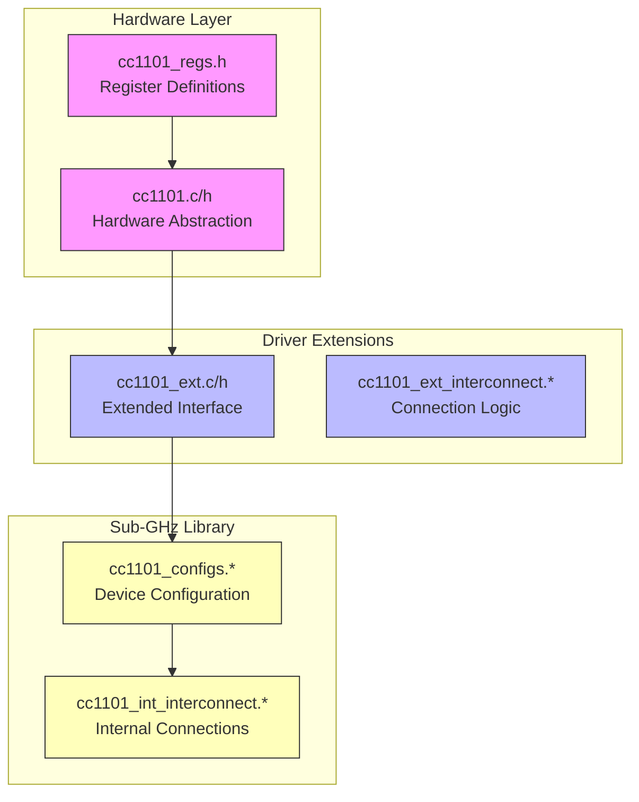
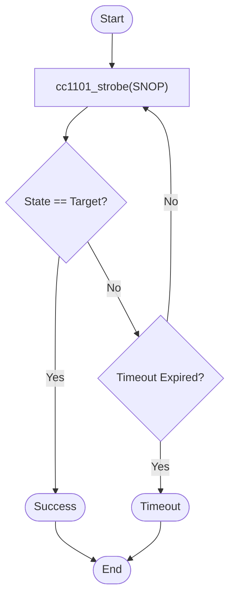
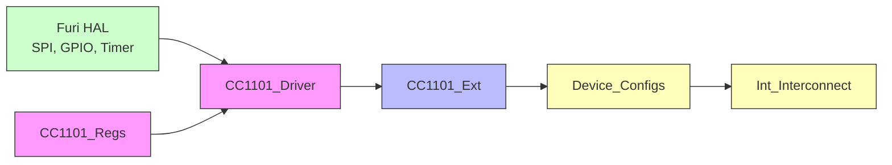

# Wireless Signal Analysis

<cite>
**Referenced Files in This Document**   
- [cc1101.c](file://lib/drivers/cc1101.c)
- [cc1101.h](file://lib/drivers/cc1101.h)
- [cc1101_regs.h](file://lib/drivers/cc1101_regs.h)
- [cc1101_ext.c](file://applications/drivers/subghz/cc1101_ext/cc1101_ext.c)
- [cc1101_ext.h](file://applications/drivers/subghz/cc1101_ext/cc1101_ext.h)
- [cc1101_ext_interconnect.c](file://applications/drivers/subghz/cc1101_ext/cc1101_ext_interconnect.c)
- [cc1101_ext_interconnect.h](file://applications/drivers/subghz/cc1101_ext/cc1101_ext_interconnect.h)
- [cc1101_configs.c](file://lib/subghz/devices/cc1101_configs.c)
- [cc1101_configs.h](file://lib/subghz/devices/cc1101_configs.h)
- [cc1101_int_interconnect.c](file://lib/subghz/devices/cc1101_int/cc1101_int_interconnect.c)
- [cc1101_int_interconnect.h](file://lib/subghz/devices/cc1101_int/cc1101_int_interconnect.h)
</cite>

## Table of Contents
1. [Introduction](#introduction)
2. [Project Structure](#project-structure)
3. [Core Components](#core-components)
4. [Architecture Overview](#architecture-overview)
5. [Detailed Component Analysis](#detailed-component-analysis)
6. [Dependency Analysis](#dependency-analysis)
7. [Performance Considerations](#performance-considerations)
8. [Troubleshooting Guide](#troubleshooting-guide)
9. [Conclusion](#conclusion)

## Introduction
This document provides a comprehensive analysis of the Sub-GHz wireless signal analysis functionality in the Flipper Zero firmware. The system enables users to capture, analyze, and decode radio signals in the Sub-GHz frequency range, which is commonly used for remote controls, sensors, and other wireless devices. The implementation involves a layered architecture with hardware drivers, signal processing components, and application-level interfaces. This documentation explains the technical details of signal capture, modulation analysis, and protocol decoding, while also addressing common issues such as signal interference and weak reception. The content is designed to be accessible to beginners while providing sufficient depth for experienced developers interested in the digital signal processing techniques employed.

## Project Structure
The Sub-GHz signal analysis functionality is distributed across multiple directories in the repository, with a clear separation between hardware drivers, protocol implementations, and application interfaces. The core radio hardware interface is implemented in the `lib/drivers` directory, while higher-level Sub-GHz functionality is organized in the `lib/subghz` directory. External applications that utilize Sub-GHz capabilities are located in the `applications/external` directory, and specialized driver extensions are found in `applications/drivers/subghz`. This modular structure allows for flexible configuration and extension of Sub-GHz capabilities while maintaining a clean separation of concerns between hardware abstraction and application logic.



**Diagram sources**
- [cc1101.c](file://lib/drivers/cc1101.c#L1-L188)
- [cc1101.h](file://lib/drivers/cc1101.h#L1-L195)
- [cc1101_regs.h](file://lib/drivers/cc1101_regs.h#L1-L213)
- [cc1101_ext.c](file://applications/drivers/subghz/cc1101_ext/cc1101_ext.c)
- [cc1101_configs.c](file://lib/subghz/devices/cc1101_configs.c)

**Section sources**
- [cc1101.c](file://lib/drivers/cc1101.c#L1-L188)
- [cc1101.h](file://lib/drivers/cc1101.h#L1-L195)
- [cc1101_regs.h](file://lib/drivers/cc1101_regs.h#L1-L213)

## Core Components
The Sub-GHz signal analysis system is built around the CC1101 radio transceiver chip, which provides the hardware foundation for capturing and transmitting wireless signals in the Sub-GHz frequency range. The core components include the low-level driver that interfaces directly with the hardware via SPI, configuration modules that set up the radio parameters, and interconnect components that manage the communication between different parts of the system. The implementation follows a layered architecture where higher-level functions are built upon reliable low-level primitives. Key functionality includes frequency tuning, signal reception, data extraction from the FIFO buffer, and power management operations. The system is designed to be responsive to changing signal conditions while maintaining power efficiency during extended monitoring periods.

**Section sources**
- [cc1101.c](file://lib/drivers/cc1101.c#L1-L188)
- [cc1101.h](file://lib/drivers/cc1101.h#L1-L195)
- [cc1101_regs.h](file://lib/drivers/cc1101_regs.h#L1-L213)

## Architecture Overview
The Sub-GHz signal analysis architecture follows a clear hierarchy from hardware interaction to application-level processing. At the lowest level, the CC1101 driver provides direct access to the radio transceiver through SPI communication, implementing essential operations like register reading/writing and state management. Above this, device-specific configuration modules set up the radio parameters for different operational modes and frequency bands. The interconnect components manage the integration between the external driver interface and internal system components, ensuring proper signal flow and state coordination. Application-level components then utilize this foundation to implement specific use cases like signal monitoring, packet analysis, and protocol decoding. This layered approach enables reliable hardware control while supporting flexible application development.

```mermaid
graph TD
A["Application Layer<br/>Signal Analysis, Protocol Decoding"] --> B["Configuration Layer<br/>cc1101_configs.*"]
B --> C["Driver Extension Layer<br/>cc1101_ext.*"]
C --> D["Core Driver Layer<br/>cc1101.c/h"]
D --> E["Hardware Interface<br/>SPI Bus, CC1101 Chip"]
F["Interconnect Components<br/>cc1101_int_interconnect.*"] < --> C
F < --> B
style A fill:#cfc,stroke:#333
style B fill:#ffb,stroke:#333
style C fill:#bbf,stroke:#333
style D fill:#f9f,stroke:#333
style E fill:#fdd,stroke:#333
style F fill:#ff9,stroke:#333
classDef layer fill:#eee,stroke:#999;
class A,B,C,D,E layer;
```

**Diagram sources**
- [cc1101.c](file://lib/drivers/cc1101.c#L1-L188)
- [cc1101.h](file://lib/drivers/cc1101.h#L1-L195)
- [cc1101_configs.c](file://lib/subghz/devices/cc1101_configs.c)
- [cc1101_ext.c](file://applications/drivers/subghz/cc1101_ext/cc1101_ext.c)
- [cc1101_int_interconnect.c](file://lib/subghz/devices/cc1101_int/cc1101_int_interconnect.c)

## Detailed Component Analysis

### CC1101 Driver Implementation
The CC1101 driver provides the fundamental interface between the software system and the radio hardware. It implements both low-level SPI communication functions and higher-level operational commands that control the radio's behavior. The driver is designed with reliability in mind, incorporating timeout mechanisms and status verification to ensure robust operation even under challenging signal conditions.

#### Low-Level Communication
The driver uses a custom SPI transaction function (`cc1101_spi_trx`) that includes timeout protection to prevent the system from hanging if the radio chip becomes unresponsive. This function waits for the CHIP_RDYn signal before initiating communication, ensuring that the radio is ready to accept commands. The timeout is implemented using the Furi HAL cortex timer, providing a hardware-based timing mechanism that is reliable and efficient.

```mermaid
sequenceDiagram
participant CPU as "CPU"
participant Driver as "CC1101 Driver"
participant Radio as "CC1101 Chip"
CPU->>Driver : cc1101_write_reg()
Driver->>Driver : Start timeout timer
loop Poll CHIP_RDYn
Driver->>Radio : Read MISO pin
Radio-->>Driver : High (busy)
alt Timeout expired
Driver-->>CPU : Return error
break
end
end
Driver->>Radio : SPI transaction
Radio-->>Driver : Response with CHIP_RDYn=0
Driver->>Driver : Verify status
Driver-->>CPU : Return success
```

**Diagram sources**
- [cc1101.c](file://lib/drivers/cc1101.c#L7-L25)

#### Register Access Functions
The driver implements a comprehensive set of functions for reading from and writing to the CC1101's registers. These functions follow a consistent pattern where a command byte is sent followed by data, and the response includes the chip's status. The `cc1101_write_reg` function sends the register address with the write bit cleared, followed by the data byte. The `cc1101_read_reg` function sends the register address with the read bit set and receives both the status and requested data.

```c
CC1101Status cc1101_write_reg(FuriHalSpiBusHandle* handle, uint8_t reg, uint8_t data) {
    uint8_t tx[2] = {reg, data};
    CC1101Status rx[2] = {0};
    rx[0].CHIP_RDYn = 1;
    rx[1].CHIP_RDYn = 1;

    cc1101_spi_trx(handle, tx, (uint8_t*)rx, 2);

    assert((rx[0].CHIP_RDYn | rx[1].CHIP_RDYn) == 0);
    return rx[1];
}
```

**Section sources**
- [cc1101.c](file://lib/drivers/cc1101.c#L44-L56)

#### State Management
The CC1101 chip operates in different states (IDLE, RX, TX, etc.), and the driver provides functions to manage these state transitions. The `cc1101_wait_status_state` function polls the chip's status until it reaches the desired state or times out, which is crucial for ensuring that operations like switching to receive mode complete successfully before proceeding.



**Diagram sources**
- [cc1101.c](file://lib/drivers/cc1101.c#L109-L125)

### Frequency and Signal Control
The driver provides precise control over the radio's frequency tuning and signal processing parameters. The `cc1101_set_frequency` function calculates the appropriate register values to achieve the desired frequency based on the crystal oscillator frequency and frequency divider settings. This function includes sanity checking to ensure that the calculated values fit within the available register bits.

```c
uint32_t cc1101_set_frequency(FuriHalSpiBusHandle* handle, uint32_t value) {
    uint64_t real_value = (uint64_t)value * CC1101_FDIV / CC1101_QUARTZ;

    // Sanity check
    assert((real_value & CC1101_FMASK) == real_value);

    cc1101_write_reg(handle, CC1101_FREQ2, (real_value >> 16) & 0xFF);
    cc1101_write_reg(handle, CC1101_FREQ1, (real_value >> 8) & 0xFF);
    cc1101_write_reg(handle, CC1101_FREQ0, (real_value >> 0) & 0xFF);

    uint64_t real_frequency = real_value * CC1101_QUARTZ / CC1101_FDIV;

    return (uint32_t)real_frequency;
}
```

The driver also implements functions for controlling the power amplifier table, which determines the transmission power levels, and for managing the FIFO buffers used for data transmission and reception.

**Section sources**
- [cc1101.c](file://lib/drivers/cc1101.c#L162-L188)

## Dependency Analysis
The Sub-GHz signal analysis components have a clear dependency hierarchy, with lower-level components providing services to higher-level ones. The core CC1101 driver depends only on the Furi HAL SPI interface and basic system functions, making it a stable foundation. Higher-level components like the configuration modules and interconnect layers depend on the core driver, creating a unidirectional dependency flow that prevents circular dependencies and promotes maintainability.



**Diagram sources**
- [cc1101.c](file://lib/drivers/cc1101.c#L1-L188)
- [cc1101_ext.c](file://applications/drivers/subghz/cc1101_ext/cc1101_ext.c)
- [cc1101_configs.c](file://lib/subghz/devices/cc1101_configs.c)
- [cc1101_int_interconnect.c](file://lib/subghz/devices/cc1101_int/cc1101_int_interconnect.c)

**Section sources**
- [cc1101.c](file://lib/drivers/cc1101.c#L1-L188)
- [cc1101_ext.c](file://applications/drivers/subghz/cc1101_ext/cc1101_ext.c)
- [cc1101_configs.c](file://lib/subghz/devices/cc1101_configs.c)

## Performance Considerations
The Sub-GHz signal analysis implementation is designed with performance and reliability as key priorities. The driver uses direct hardware access through the SPI bus, minimizing latency in signal capture and transmission operations. The timeout values are carefully chosen to balance responsiveness with power efficiency, preventing the system from waiting indefinitely for radio responses while still allowing sufficient time for normal operations. The use of burst mode for FIFO operations enables efficient transfer of larger data blocks, reducing the overhead of individual SPI transactions. The state polling mechanism in `cc1101_wait_status_state` uses a busy-wait loop with a hardware timer, providing precise control over operation timing without relying on less predictable software delays.

## Troubleshooting Guide
When working with Sub-GHz signal analysis, several common issues may arise. Understanding the underlying hardware and software interactions can help diagnose and resolve these problems effectively.

### Signal Reception Issues
If signals are not being received properly, check the following:
- **Frequency mismatch**: Ensure the radio is tuned to the correct frequency. The CC1101 has limited frequency resolution, so the actual synthesized frequency may differ slightly from the requested value.
- **Sensitivity settings**: Verify that the receiver gain and demodulation settings are appropriate for the signal strength and modulation type.
- **Antenna connection**: Check that the antenna is properly connected and not damaged.

### Hardware Communication Problems
If the radio chip is not responding:
- **SPI connection**: Verify that the SPI bus connections (MOSI, MISO, SCLK, CS) are intact and not shorted.
- **Power supply**: Ensure the CC1101 is receiving adequate power, as voltage fluctuations can cause communication failures.
- **Reset state**: Use the `cc1101_reset` function to bring the chip to a known state if communication is lost.

### Data Corruption
If received data appears corrupted:
- **FIFO overflow**: Check that the receive FIFO is being read frequently enough to prevent overflow, especially with high data rate signals.
- **Clock synchronization**: Verify that the crystal oscillator is functioning correctly, as timing errors can lead to bit errors.
- **Signal interference**: Look for sources of RF interference that might be affecting signal quality.

The driver's assertion statements can help identify many of these issues during development, as they will trigger if the chip's status indicates an error condition.

**Section sources**
- [cc1101.c](file://lib/drivers/cc1101.c#L1-L188)
- [cc1101.h](file://lib/drivers/cc1101.h#L1-L195)

## Conclusion
The Sub-GHz signal analysis implementation in the Flipper Zero firmware provides a robust foundation for capturing and analyzing wireless signals in the Sub-GHz frequency range. The architecture follows a clean layered approach, with well-defined interfaces between hardware abstraction, configuration management, and application logic. The CC1101 driver implementation demonstrates careful attention to reliability, with timeout protection and status verification built into critical operations. While the available code suggests a solid foundation for signal capture and hardware control, additional components for protocol analysis and user interface would be needed to complete the full signal analysis workflow. The modular design allows for extension and customization, making it suitable for a wide range of wireless analysis applications.