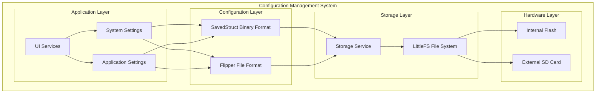
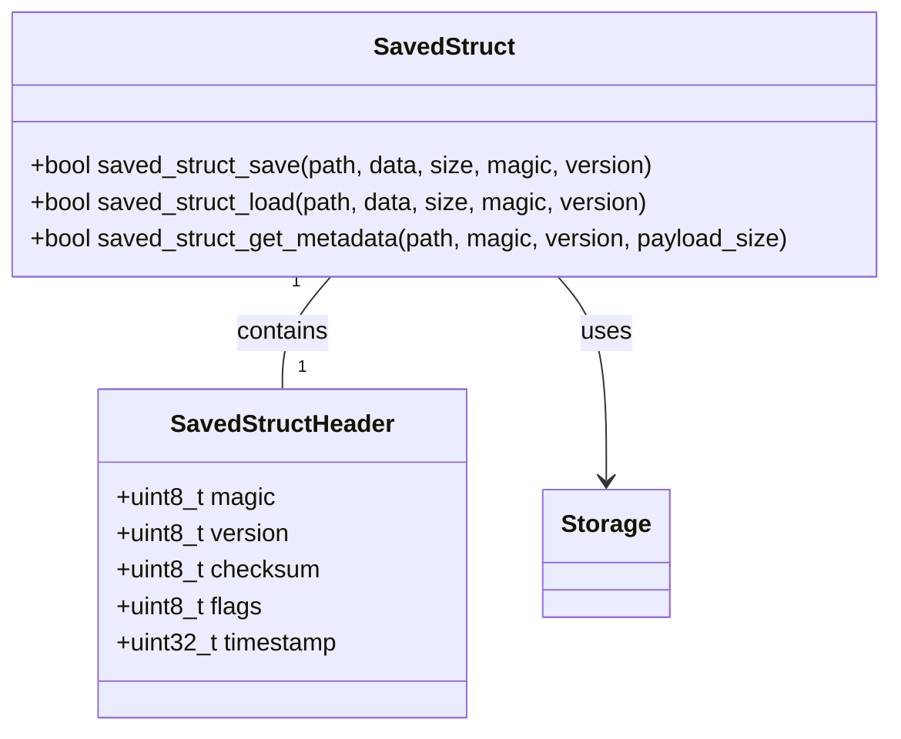
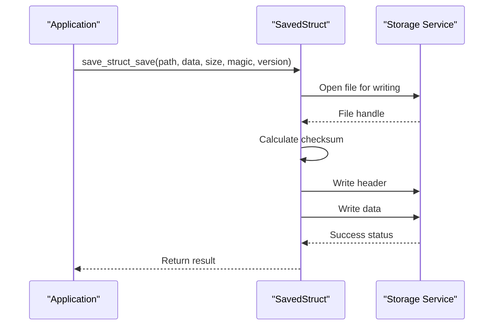
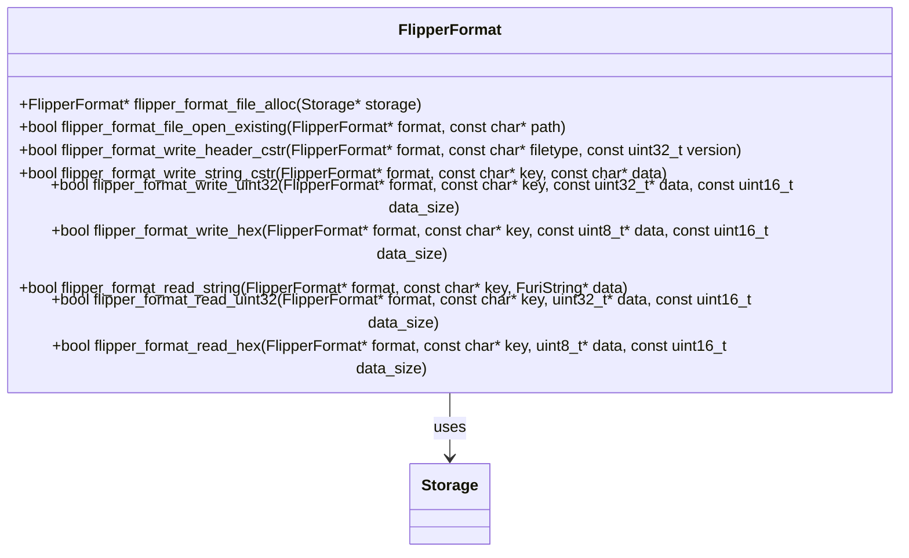
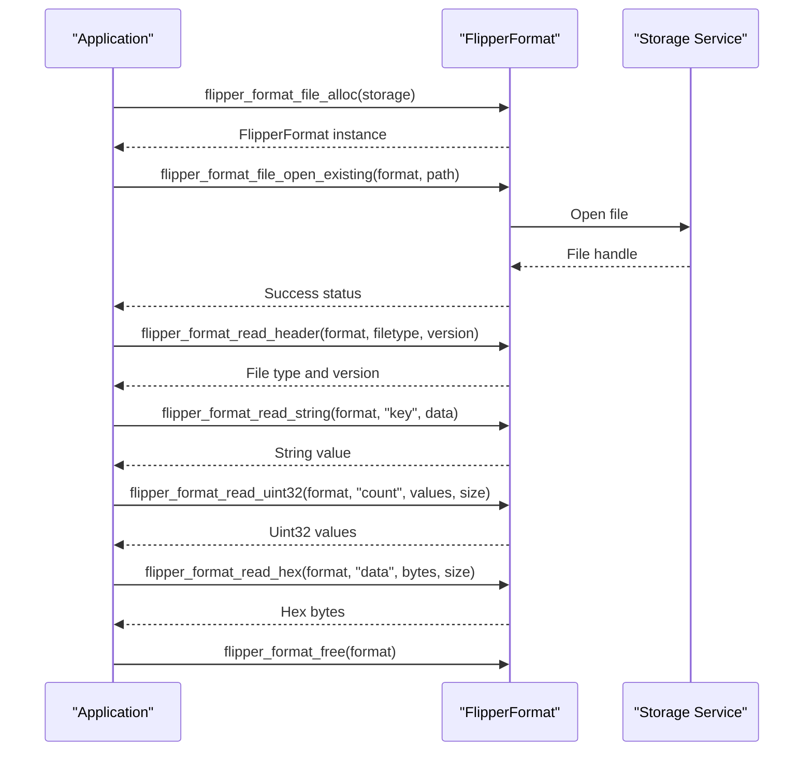
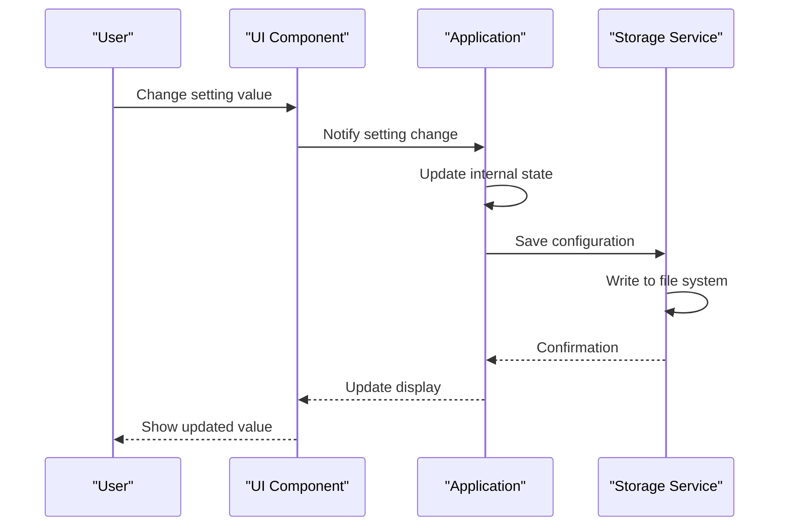
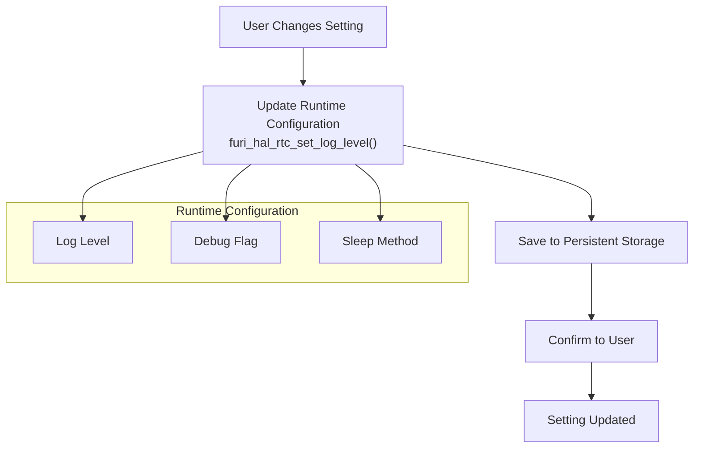
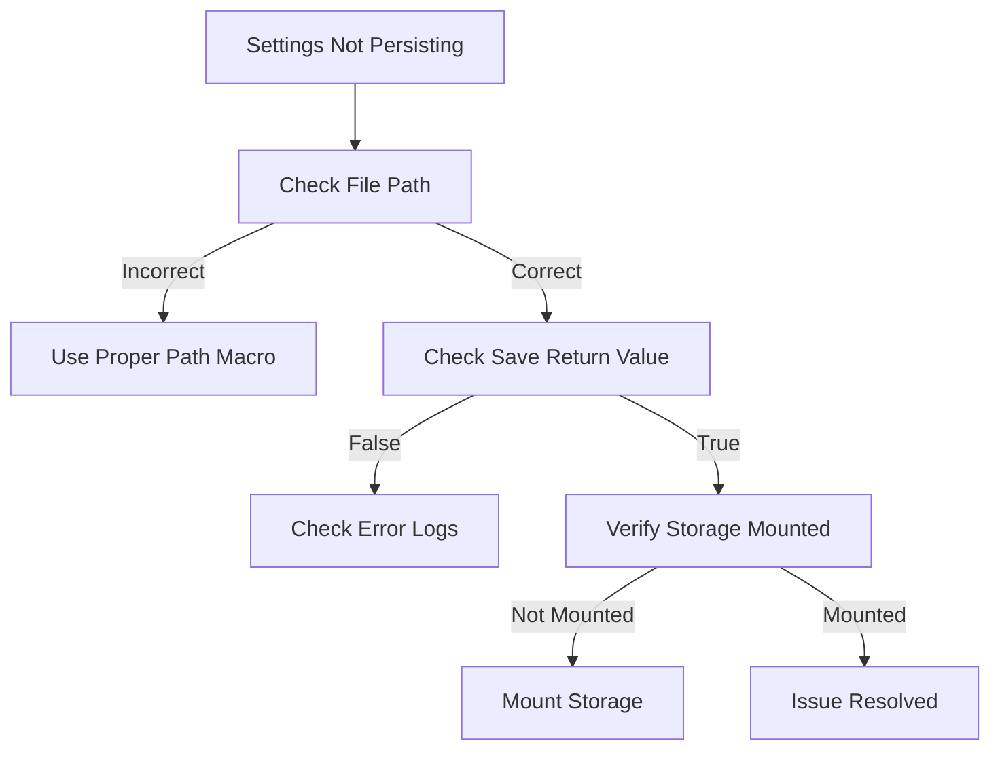
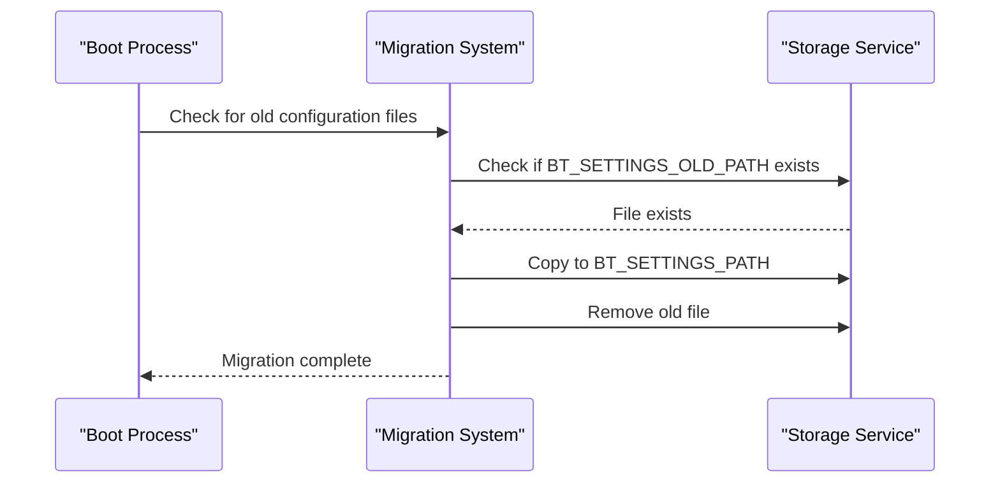
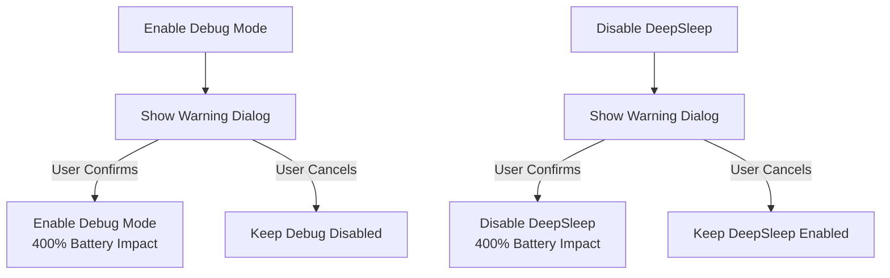

# Configuration Management

<cite>
**Referenced Files in This Document**   
- [saved_struct.h](file://lib/toolbox/saved_struct.h)
- [saved_struct.c](file://lib/toolbox/saved_struct.c)
- [flipper_format.h](file://lib/flipper_format/flipper_format.h)
- [flipper_format.c](file://lib/flipper_format/flipper_format.c)
- [power_settings.c](file://applications/services/power/power_settings.c)
- [power_settings.h](file://applications/services/power/power_settings.h)
- [bt_settings.c](file://applications/services/bt/bt_settings.c)
- [notification_app.c](file://applications/services/notification/notification_app.c)
- [storage_settings.c](file://applications/settings/storage_settings/storage_settings.c)
- [system_settings.c](file://applications/settings/system/system_settings.c)
- [example_apps_data.c](file://applications/examples/example_apps_data/example_apps_data.c)
- [storage.c](file://applications/services/storage/storage.c)
- [storage_processing.c](file://applications/services/storage/storage_processing.c)
- [update_task_worker_flasher.c](file://applications/system/updater/util/update_task_worker_flasher.c)
- [update_task.c](file://applications/system/updater/util/update_task.c)
- [update_manifest.c](file://lib/update_util/update_manifest.c)
- [README.md](file://applications/examples/example_apps_assets/README.md)
</cite>

## Table of Contents
1. [Introduction](#introduction)
2. [System Architecture](#system-architecture)
3. [Core Configuration Patterns](#core-configuration-patterns)
4. [Application-Specific Configuration](#application-specific-configuration)
5. [Flipper File Format](#flipper-file-format)
6. [User Interface Integration](#user-interface-integration)
7. [Practical Implementation Examples](#practical-implementation-examples)
8. [Troubleshooting Guide](#troubleshooting-guide)
9. [Performance Considerations](#performance-considerations)
10. [Conclusion](#conclusion)

## Introduction

The Flipper Zero firmware implements a comprehensive configuration management system that enables persistent storage of settings across reboots while providing flexible mechanisms for both system-wide and application-specific configuration. This documentation details the architecture, implementation patterns, and best practices for working with the configuration system.

The configuration system is designed with several key principles in mind: reliability, backward compatibility, and ease of use. Settings are persisted using multiple approaches depending on the complexity and requirements of the data, ranging from simple binary structures to human-readable text files in the Flipper File Format.

**Section sources**
- [saved_struct.h](file://lib/toolbox/saved_struct.h#L1-L65)
- [flipper_format.h](file://lib/flipper_format/flipper_format.h#L1-L786)

## System Architecture

The configuration management system in Flipper Zero firmware consists of multiple layers that work together to provide a robust and flexible solution for persistent storage. At its core, the system leverages the storage service which abstracts the underlying file system and provides a consistent API for reading and writing data.



**Diagram sources **
- [storage.c](file://applications/services/storage/storage.c#L37-L123)
- [saved_struct.h](file://lib/toolbox/saved_struct.h#L1-L65)
- [flipper_format.h](file://lib/flipper_format/flipper_format.h#L1-L786)

The architecture follows a layered approach where higher-level configuration mechanisms build upon the foundational storage service. The system supports both internal flash storage and external SD cards, with automatic migration between storage locations when necessary.

**Section sources**
- [storage.c](file://applications/services/storage/storage.c#L37-L123)
- [saved_struct.h](file://lib/toolbox/saved_struct.h#L1-L65)
- [flipper_format.h](file://lib/flipper_format/flipper_format.h#L1-L786)

## Core Configuration Patterns

The Flipper Zero firmware employs two primary patterns for configuration storage: the SavedStruct binary format for simple, performance-critical settings, and the Flipper File Format for complex, human-readable configurations.

### SavedStruct Binary Format

The SavedStruct pattern is used for storing simple data structures in a binary format with built-in versioning and integrity checking. This approach is ideal for settings that need to be loaded quickly at startup and don't require human readability.



**Diagram sources **
- [saved_struct.h](file://lib/toolbox/saved_struct.h#L8-L14)
- [saved_struct.c](file://lib/toolbox/saved_struct.c#L8-L14)

The SavedStruct format includes a header with metadata such as magic number, version, checksum, and timestamp. This provides several benefits:

- **Version compatibility**: The version field allows for graceful handling of configuration changes between firmware versions
- **Data integrity**: The checksum ensures that corrupted configuration files can be detected and handled appropriately
- **Magic number validation**: The magic number prevents accidental loading of incompatible file types

The power settings implementation demonstrates this pattern:



**Diagram sources **
- [power_settings.c](file://applications/services/power/power_settings.c#L3-L11)
- [saved_struct.c](file://lib/toolbox/saved_struct.c#L17-L67)

**Section sources**
- [saved_struct.h](file://lib/toolbox/saved_struct.h#L1-L65)
- [saved_struct.c](file://lib/toolbox/saved_struct.c#L1-L183)
- [power_settings.c](file://applications/services/power/power_settings.c#L1-L12)
- [power_settings.h](file://applications/services/power/power_settings.h#L1-L20)

### Flipper File Format

For more complex configurations that benefit from human readability and extensibility, the firmware uses the Flipper File Format. This text-based format supports comments, multiple data types, and is designed to be both machine and human-friendly.



**Diagram sources **
- [flipper_format.h](file://lib/flipper_format/flipper_format.h#L95-L786)
- [flipper_format.c](file://lib/flipper_format/flipper_format.c#L38-L75)

The Flipper File Format supports the following data types:
- **String**: Text values
- **Int32/Uint32**: 32-bit integer values
- **Float**: Floating-point values  
- **Hex**: Hexadecimal byte arrays

This format is particularly useful for configurations that may need to be edited manually or inspected for debugging purposes.

**Section sources**
- [flipper_format.h](file://lib/flipper_format/flipper_format.h#L1-L786)
- [flipper_format.c](file://lib/flipper_format/flipper_format.c#L1-L75)

## Application-Specific Configuration

Applications on the Flipper Zero can store their configuration data using the same patterns as system services, with additional considerations for application data isolation and management.

### Application Data Storage

Each application has its own isolated data directory, accessible through the `APP_DATA_PATH` macro. This ensures that applications cannot interfere with each other's data while providing a consistent location for configuration files.

```mermaid
flowchart TD
Start([Application Start]) --> OpenStorage["Open Storage Service"]
OpenStorage --> AllocateFile["Allocate File Handle"]
AllocateFile --> CreatePath["Create App Data Path<br/>APP_DATA_PATH(\"config.txt\")"]
CreatePath --> CheckExists["Check if File Exists"]
CheckExists --> |Yes| OpenExisting["Open Existing File"]
CheckExists --> |No| CreateNew["Create New File"]
OpenExisting --> ReadConfig["Read Configuration"]
CreateNew --> WriteDefault["Write Default Configuration"]
ReadConfig --> ParseData["Parse Configuration Data"]
WriteDefault --> ParseData
ParseData --> UseConfig["Use Configuration in App"]
UseConfig --> End([Application Running])
```

**Diagram sources **
- [example_apps_data.c](file://applications/examples/example_apps_data/example_apps_data.c#L1-L44)
- [storage_processing.c](file://applications/services/storage/storage_processing.c#L542-L561)

The application data system automatically creates the necessary directory structure when an application first requests its data path, ensuring that applications don't need to handle directory creation logic.

### Application Assets vs. Application Data

It's important to distinguish between application assets and application data:

- **Application Assets**: Data provided with the application (read-only)
- **Application Data**: Data generated by the application (read-write)

Application assets are typically used for static content like game levels, while application data is used for user-generated content like game progress.

**Section sources**
- [example_apps_data.c](file://applications/examples/example_apps_data/example_apps_data.c#L1-L45)
- [README.md](file://applications/examples/example_apps_assets/README.md#L24-L57)
- [storage_processing.c](file://applications/services/storage/storage_processing.c#L542-L561)

## Flipper File Format

The Flipper File Format is a key component of the configuration system, providing a flexible and human-readable way to store structured data. This section details the format specification and usage patterns.

### Format Specification

The Flipper File Format follows a simple structure:

```
# Commentary
Field name: field value
```

Key characteristics:
- Lines starting with `#` are treated as comments
- The separator between field name and value is `: `
- End of line is LF (with CR support for reading)
- Supports multiple data types: String, Int32, Uint32, Float, and Hex

### Usage Patterns

When implementing configuration storage using the Flipper File Format, applications typically follow this pattern:



**Diagram sources **
- [flipper_format.h](file://lib/flipper_format/flipper_format.h#L1-L786)
- [update_manifest.c](file://lib/update_util/update_manifest.c#L55-L71)

The format is particularly well-suited for complex configurations with nested data structures, as it allows for clear organization and documentation of settings through comments.

**Section sources**
- [flipper_format.h](file://lib/flipper_format/flipper_format.h#L1-L786)
- [update_manifest.c](file://lib/update_util/update_manifest.c#L55-L71)

## User Interface Integration

The configuration system is tightly integrated with the user interface, allowing settings changes to be immediately reflected in the application behavior.

### Settings Propagation

When a user changes a setting through the UI, the change is propagated through the system using a combination of direct updates and event notifications:



**Diagram sources **
- [system_settings.c](file://applications/settings/system/system_settings.c#L42-L309)
- [storage.c](file://applications/services/storage/storage.c#L37-L123)

### Real-time Updates

For settings that affect system behavior, changes are often applied immediately without requiring a restart. This is achieved through direct updates to runtime configuration:



**Diagram sources **
- [system_settings.c](file://applications/settings/system/system_settings.c#L42-L309)

This approach ensures that users receive immediate feedback when changing settings while still maintaining persistence across reboots.

**Section sources**
- [system_settings.c](file://applications/settings/system/system_settings.c#L1-L447)

## Practical Implementation Examples

This section provides concrete examples of how to implement configuration storage for new applications, covering both simple and complex scenarios.

### Simple Key-Value Storage

For applications with simple configuration needs, the SavedStruct pattern provides an efficient solution:

```c
// Define configuration structure
typedef struct {
    uint32_t version;
    bool enabled;
    uint8_t sensitivity;
} MyAppConfig;

// Define constants
#define MYAPP_CONFIG_VERSION (1)
#define MYAPP_CONFIG_PATH CFG_PATH("myapp.config")
#define MYAPP_CONFIG_MAGIC (0x42)

// Load configuration
bool myapp_config_load(MyAppConfig* config) {
    // Set default values
    config->version = MYAPP_CONFIG_VERSION;
    config->enabled = true;
    config->sensitivity = 5;
    
    // Load from persistent storage
    return saved_struct_load(
        MYAPP_CONFIG_PATH,
        config,
        sizeof(MyAppConfig),
        MYAPP_CONFIG_MAGIC,
        MYAPP_CONFIG_VERSION);
}

// Save configuration
bool myapp_config_save(const MyAppConfig* config) {
    return saved_struct_save(
        MYAPP_CONFIG_PATH,
        config,
        sizeof(MyAppConfig),
        MYAPP_CONFIG_MAGIC,
        MYAPP_CONFIG_VERSION);
}
```

**Section sources**
- [power_settings.c](file://applications/services/power/power_settings.c#L3-L11)
- [saved_struct.h](file://lib/toolbox/saved_struct.h#L26-L37)

### Complex Nested Configurations

For applications with more complex configuration needs, the Flipper File Format provides greater flexibility:

```c
// Save complex configuration
bool myapp_save_complex_config(const char* path, const MyAppComplexConfig* config) {
    FlipperFormat* file = flipper_format_file_alloc(storage);
    bool result = false;
    
    do {
        // Open file for writing
        if(!flipper_format_file_open_always(file, path)) break;
        
        // Write header
        if(!flipper_format_write_header_cstr(file, "MyApp Configuration", 1)) break;
        
        // Write basic settings
        if(!flipper_format_write_bool(file, "enabled", &config->enabled, 1)) break;
        if(!flipper_format_write_uint32(file, "sensitivity", &config->sensitivity, 1)) break;
        
        // Write string settings
        if(!flipper_format_write_string_cstr(file, "name", config->name)) break;
        
        // Write array data
        if(!flipper_format_write_uint32(file, "thresholds", config->thresholds, 5)) break;
        
        // Write binary data
        if(!flipper_format_write_hex(file, "calibration", config->calibration, 16)) break;
        
        result = true;
    } while(0);
    
    flipper_format_free(file);
    return result;
}
```

**Section sources**
- [flipper_format.h](file://lib/flipper_format/flipper_format.h#L283-L300)
- [update_manifest.c](file://lib/update_util/update_manifest.c#L55-L71)

## Troubleshooting Guide

This section addresses common configuration issues and provides guidance for diagnosis and resolution.

### Settings Not Persisting

When settings fail to persist across reboots, consider the following troubleshooting steps:

1. **Verify file paths**: Ensure the configuration file path is correct and uses the appropriate prefix (INT_PATH, CFG_PATH, EXT_PATH)
2. **Check return values**: Always check the return values of save operations to confirm success
3. **Verify storage availability**: Ensure the storage service is available and the file system is mounted
4. **Check permissions**: Verify the application has write permissions to the target location



**Section sources**
- [saved_struct.c](file://lib/toolbox/saved_struct.c#L30-L38)
- [flipper_format.c](file://lib/flipper_format/flipper_format.c#L52-L55)

### Corrupted Configuration Files

Corrupted configuration files can occur due to improper shutdowns or storage errors. The system includes built-in protection mechanisms:

- **Checksum validation**: The SavedStruct format includes a checksum to detect corruption
- **Version checking**: Version numbers prevent loading incompatible configurations
- **Magic number validation**: Ensures the correct file type is being loaded

When corruption is detected, applications should:
1. Log the error for diagnostic purposes
2. Fall back to default settings
3. Create a new configuration file with default values

### Migration Between Firmware Versions

When firmware versions change, configuration formats may need to be updated. The system supports migration through:

- **Version numbers**: Increment version numbers when changing configuration structure
- **Backward compatibility**: Maintain support for older versions when possible
- **Migration scripts**: Implement code to convert old configurations to new formats

The storage migration system demonstrates this pattern:



**Diagram sources **
- [storage_move_to_sd.c](file://applications/system/storage_move_to_sd/storage_move_to_sd.c#L24-L44)

**Section sources**
- [storage_move_to_sd.c](file://applications/system/storage_move_to_sd/storage_move_to_sd.c#L24-L44)

## Performance Considerations

Configuration operations have implications for both performance and battery life that should be considered when designing applications.

### Frequent Configuration Updates

Frequent writes to persistent storage can impact both performance and storage lifespan. Best practices include:

- **Batch updates**: Collect multiple changes and write them together
- **Debounce writes**: Delay writes to avoid rapid successive updates
- **Use runtime storage**: For frequently changing values, consider keeping them in memory and only persisting on significant changes or shutdown

### Battery Life Implications

Storage operations consume power, particularly when writing to flash storage. To minimize battery impact:

- **Minimize write frequency**: Only write when configuration changes are significant
- **Use efficient formats**: Binary formats like SavedStruct are more efficient than text-based formats
- **Avoid unnecessary sync**: Don't force immediate synchronization unless required

The system settings application demonstrates consideration for battery life:



**Diagram sources **
- [system_settings.c](file://applications/settings/system/system_settings.c#L246-L305)

These warnings are implemented to prevent accidental battery drain from power-intensive settings.

**Section sources**
- [system_settings.c](file://applications/settings/system/system_settings.c#L246-L305)

## Conclusion

The Flipper Zero firmware provides a robust and flexible configuration management system that balances performance, reliability, and usability. By understanding the available patterns and best practices, developers can effectively implement persistent storage for their applications.

Key takeaways:
- Use SavedStruct for simple, performance-critical settings
- Use Flipper File Format for complex, human-readable configurations
- Leverage application-specific data directories for isolation
- Implement proper error handling and fallback mechanisms
- Consider performance and battery implications of configuration operations
- Plan for version compatibility and migration between firmware updates

By following these guidelines, developers can create applications that provide a seamless user experience with reliable configuration persistence.