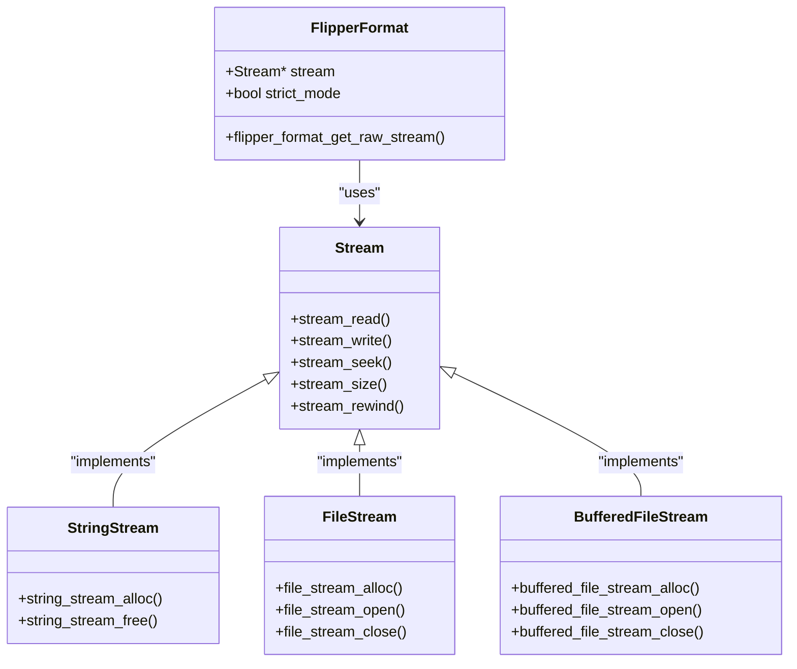
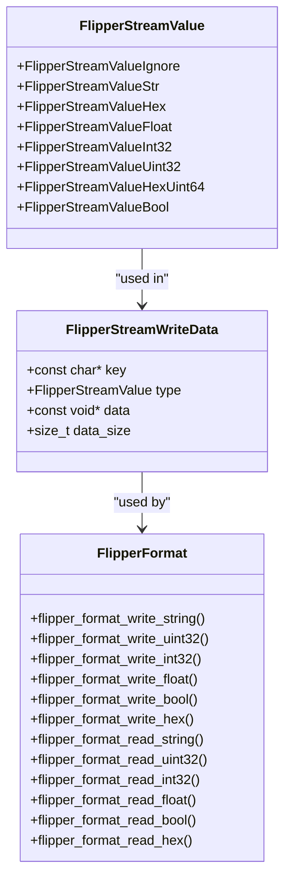
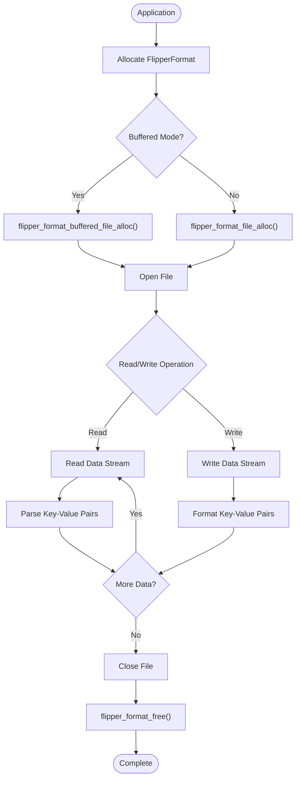
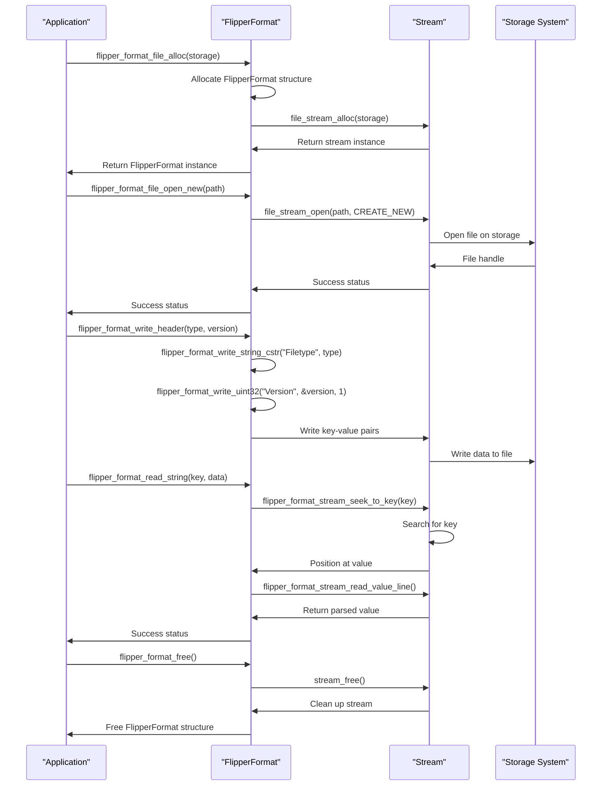
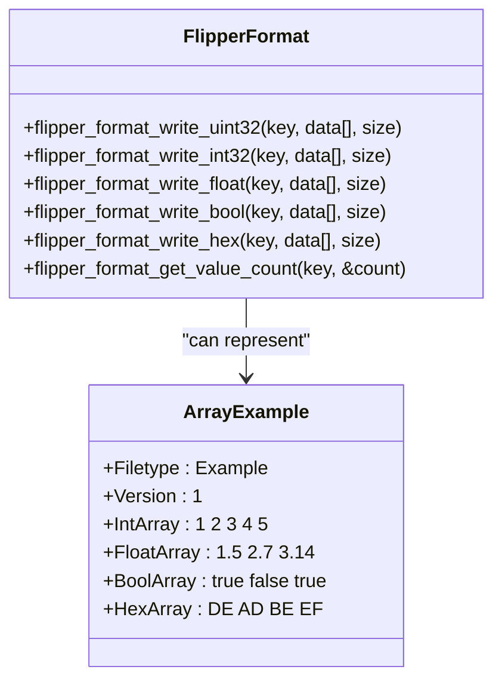
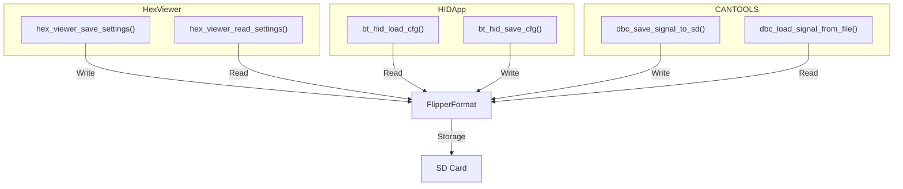

# Data Serialization

<cite>
**Referenced Files in This Document**   
- [flipper_format.h](file://lib/flipper_format/flipper_format.h)
- [flipper_format.c](file://lib/flipper_format/flipper_format.c)
- [flipper_format_stream.h](file://lib/flipper_format/flipper_format_stream.h)
- [flipper_format_stream.c](file://lib/flipper_format/flipper_format_stream.c)
- [flipper_format_i.h](file://lib/flipper_format/flipper_format_i.h)
- [flipper_format_stream_i.h](file://lib/flipper_format/flipper_format_stream_i.h)
- [flipper_format_test.c](file://applications/debug/unit_tests/tests/flipper_format/flipper_format_test.c)
- [flipper_format_string_test.c](file://applications/debug/unit_tests/tests/flipper_format_string/flipper_format_string_test.c)
- [hex_viewer_storage.c](file://applications/external/hex_viewer/helpers/hex_viewer_storage.c)
- [hid.c](file://applications/external/hid_app/hid.c)
- [cantools_app.c](file://applications/external/can_tools/cantools_app.c)
</cite>

## Table of Contents
1. [Introduction](#introduction)
2. [Core Architecture](#core-architecture)
3. [Key-Value Structure and Type System](#key-value-structure-and-type-system)
4. [Streaming Capabilities and Memory Management](#streaming-capabilities-and-memory-management)
5. [Reading and Writing Interfaces](#reading-and-writing-interfaces)
6. [Composite Types and Data Structures](#composite-types-and-data-structures)
7. [Practical Implementation Examples](#practical-implementation-examples)
8. [File System Integration](#file-system-integration)
9. [Error Handling and Data Integrity](#error-handling-and-data-integrity)
10. [Schema Design and Backward Compatibility](#schema-design-and-backward-compatibility)
11. [Best Practices](#best-practices)

## Introduction
The Flipper File Format (FFF) is a lightweight, human-readable serialization system designed for storing structured data on embedded devices. This document provides a comprehensive analysis of the FFF implementation, focusing on its key-value architecture, type system, streaming capabilities, and integration with the underlying file system. The format is optimized for resource-constrained environments while maintaining readability and extensibility.

The system provides a unified interface for both string-based and file-based operations, enabling applications to store configuration data, application state, and user preferences in a consistent manner. The design emphasizes simplicity, backward compatibility, and robust error handling to ensure data integrity across different versions and platforms.

**Section sources**
- [flipper_format.h](file://lib/flipper_format/flipper_format.h#L1-L86)
- [flipper_format.c](file://lib/flipper_format/flipper_format.c#L1-L15)

## Core Architecture
The Flipper File Format system is built on a layered architecture that separates the high-level interface from the underlying stream operations. At its core, the system uses a `FlipperFormat` structure that encapsulates a `Stream` object, providing a consistent interface regardless of whether the data is being stored in memory or on disk.

**Diagram sources **
- [flipper_format.h](file://lib/flipper_format/flipper_format.h#L95-L106)
- [flipper_format.c](file://lib/flipper_format/flipper_format.c#L17-L20)
- [flipper_format.c](file://lib/flipper_format/flipper_format.c#L31-L50)

**Section sources**
- [flipper_format.h](file://lib/flipper_format/flipper_format.h#L95-L123)
- [flipper_format.c](file://lib/flipper_format/flipper_format.c#L17-L50)

## Key-Value Structure and Type System
The Flipper File Format employs a simple key-value structure where each line represents a field with the format "key: value". The system supports several data types including strings, integers, floating-point numbers, boolean values, and hexadecimal data. Each type is handled through specific read and write functions that ensure proper parsing and formatting.

The type system is implemented through the `FlipperStreamValue` enum, which defines the supported data types and their handling mechanisms. The format uses a colon followed by a space (": ") as the delimiter between keys and values, with comments indicated by the '#' character at the beginning of a line.

**Diagram sources **
- [flipper_format_stream.h](file://lib/flipper_format/flipper_format_stream.h#L10-L19)
- [flipper_format_stream.h](file://lib/flipper_format/flipper_format_stream.h#L21-L26)
- [flipper_format.h](file://lib/flipper_format/flipper_format.h#L322-L526)

**Section sources**
- [flipper_format.h](file://lib/flipper_format/flipper_format.h#L16-L24)
- [flipper_format_stream.h](file://lib/flipper_format/flipper_format_stream.h#L10-L19)

## Streaming Capabilities and Memory Management
The Flipper File Format system is designed with streaming capabilities that allow for efficient memory usage when processing large files. The implementation uses a stream-based approach where data is processed incrementally rather than loading the entire file into memory. This is particularly important for embedded systems with limited RAM.

The system provides both buffered and unbuffered file operations, allowing applications to choose the appropriate mode based on their performance and memory requirements. The `buffered_file_stream` implementation improves I/O performance by reducing the number of direct file system calls, while the standard `file_stream` provides more direct control over file operations.

**Diagram sources **
- [flipper_format.h](file://lib/flipper_format/flipper_format.h#L115-L123)
- [flipper_format.c](file://lib/flipper_format/flipper_format.c#L38-L50)
- [flipper_format.c](file://lib/flipper_format/flipper_format.c#L52-L118)

**Section sources**
- [flipper_format.h](file://lib/flipper_format/flipper_format.h#L115-L123)
- [flipper_format.c](file://lib/flipper_format/flipper_format.c#L38-L118)

## Reading and Writing Interfaces
The Flipper File Format provides a comprehensive set of interfaces for reading and writing structured data. These interfaces are designed to be intuitive and consistent across different data types. The system supports both high-level operations for complete files and low-level operations for incremental processing.

Key operations include opening and closing files, reading and writing headers, handling comments, and managing key-value pairs. The interface also provides functions for updating existing values, inserting new key-value pairs, and deleting keys. The `insert_or_update` family of functions combines insertion and update operations, simplifying common use cases.

**Diagram sources **
- [flipper_format.h](file://lib/flipper_format/flipper_format.h#L132-L207)
- [flipper_format.h](file://lib/flipper_format/flipper_format.h#L270-L346)
- [flipper_format.h](file://lib/flipper_format/flipper_format.h#L322-L526)

**Section sources**
- [flipper_format.h](file://lib/flipper_format/flipper_format.h#L132-L207)
- [flipper_format.h](file://lib/flipper_format/flipper_format.h#L270-L346)

## Composite Types and Data Structures
The Flipper File Format supports composite data structures through arrays of primitive types. Each write operation can handle multiple values of the same type, allowing for the storage of arrays of integers, floating-point numbers, boolean values, and hexadecimal data. This capability enables the representation of complex data structures while maintaining the simplicity of the key-value format.

The system uses a space-separated format for array values, with each element formatted according to its type (decimal for integers, hexadecimal for bytes, etc.). The `data_size` parameter in write operations specifies the number of elements in the array, while read operations can determine the array size using the `flipper_format_get_value_count` function.

**Diagram sources **
- [flipper_format.h](file://lib/flipper_format/flipper_format.h#L386-L526)
- [flipper_format.h](file://lib/flipper_format/flipper_format.h#L309-L313)

**Section sources**
- [flipper_format.h](file://lib/flipper_format/flipper_format.h#L386-L526)
- [flipper_format.h](file://lib/flipper_format/flipper_format.h#L309-L313)

## Practical Implementation Examples
The Flipper File Format is used throughout the firmware for storing configuration data and application state. Several applications demonstrate practical implementations of the serialization system, showcasing different use cases and best practices.

The Hex Viewer application uses FFF to store user preferences such as haptic feedback settings, speaker volume, and LED behavior. The HID application stores Bluetooth configuration data including device names and pairing information. The CAN Tools application uses FFF to save and load DBC (Database Container) signal definitions for automotive CAN bus analysis.

**Diagram sources **
- [hex_viewer_storage.c](file://applications/external/hex_viewer/helpers/hex_viewer_storage.c#L17-L70)
- [hid.c](file://applications/external/hid_app/hid.c#L42-L94)
- [cantools_app.c](file://applications/external/can_tools/cantools_app.c#L570-L709)

**Section sources**
- [hex_viewer_storage.c](file://applications/external/hex_viewer/helpers/hex_viewer_storage.c#L17-L70)
- [hid.c](file://applications/external/hid_app/hid.c#L42-L94)
- [cantools_app.c](file://applications/external/can_tools/cantools_app.c#L570-L709)

## File System Integration
The Flipper File Format is tightly integrated with the underlying file system through the Storage API. The system uses the `Storage` service to handle file operations, providing a consistent interface across different storage mediums (internal flash, SD card, etc.). This abstraction allows applications to work with files without needing to know the specific storage implementation.

File operations are performed using standard file modes: creating new files, opening existing files, appending to files, and overwriting files. The system handles path resolution and file existence checks, ensuring that operations are performed safely and consistently. The integration also supports directory creation and file migration, enabling applications to organize their data appropriately.

**Section sources**
- [flipper_format.h](file://lib/flipper_format/flipper_format.h#L111-L112)
- [hex_viewer_storage.c](file://applications/external/hex_viewer/helpers/hex_viewer_storage.c#L3-L9)
- [hid.c](file://applications/external/hid_app/hid.c#L43-L44)

## Error Handling and Data Integrity
The Flipper File Format system implements robust error handling to ensure data integrity and prevent corruption. Operations return boolean status values indicating success or failure, allowing applications to handle errors appropriately. The system includes validation for file headers, ensuring that only compatible files are processed.

The strict mode feature allows applications to control how invalid fields are handled during reading operations. When strict mode is enabled, the presence of unrecognized fields will cause read operations to fail, ensuring data integrity. When disabled, the system will skip unrecognized fields and continue processing.

Common issues such as data corruption, version incompatibility, and memory allocation failures are addressed through comprehensive error checking and recovery mechanisms. The system validates file headers and version numbers, allowing applications to handle backward compatibility gracefully.

**Section sources**
- [flipper_format.h](file://lib/flipper_format/flipper_format.h#L215-L216)
- [flipper_format.h](file://lib/flipper_format/flipper_format.h#L270-L282)
- [hid.c](file://applications/external/hid_app/hid.c#L54-L56)

## Schema Design and Backward Compatibility
The Flipper File Format is designed with backward compatibility in mind. The version field in the file header allows applications to handle different versions of the same file type, enabling graceful evolution of data schemas over time. Applications can check the version number and adapt their behavior accordingly, either by supporting older formats or by rejecting incompatible files.

Best practices for schema design include using descriptive key names, maintaining consistent data types, and avoiding breaking changes to existing fields. When changes are necessary, applications should support both old and new formats during a transition period, allowing users to upgrade at their convenience.

The system supports optional fields, allowing new versions to add functionality without breaking compatibility with older applications. Applications should check for the existence of keys using `flipper_format_key_exist` before attempting to read them, providing a safe way to handle optional data.

**Section sources**
- [flipper_format.h](file://lib/flipper_format/flipper_format.h#L270-L282)
- [flipper_format.h](file://lib/flipper_format/flipper_format.h#L260-L261)
- [hid.c](file://applications/external/hid_app/hid.c#L54-L56)

## Best Practices
When using the Flipper File Format system, several best practices should be followed to ensure reliable and maintainable code:

1. Always check the return values of FFF operations and handle errors appropriately
2. Use descriptive key names that clearly indicate the purpose of the data
3. Include version information in file headers to support backward compatibility
4. Use the `insert_or_update` functions for settings that may need to be modified
5. Close files and free resources when operations are complete
6. Validate data after reading to ensure integrity
7. Use comments to document the purpose of configuration files
8. Organize related data in logical groupings within the file structure

Applications should also consider performance implications when choosing between buffered and unbuffered file operations, selecting the appropriate mode based on their specific use case and performance requirements.

**Section sources**
- [flipper_format.h](file://lib/flipper_format/flipper_format.h#L192-L207)
- [flipper_format.h](file://lib/flipper_format/flipper_format.h#L553-L561)
- [hex_viewer_storage.c](file://applications/external/hex_viewer/helpers/hex_viewer_storage.c#L11-L15)