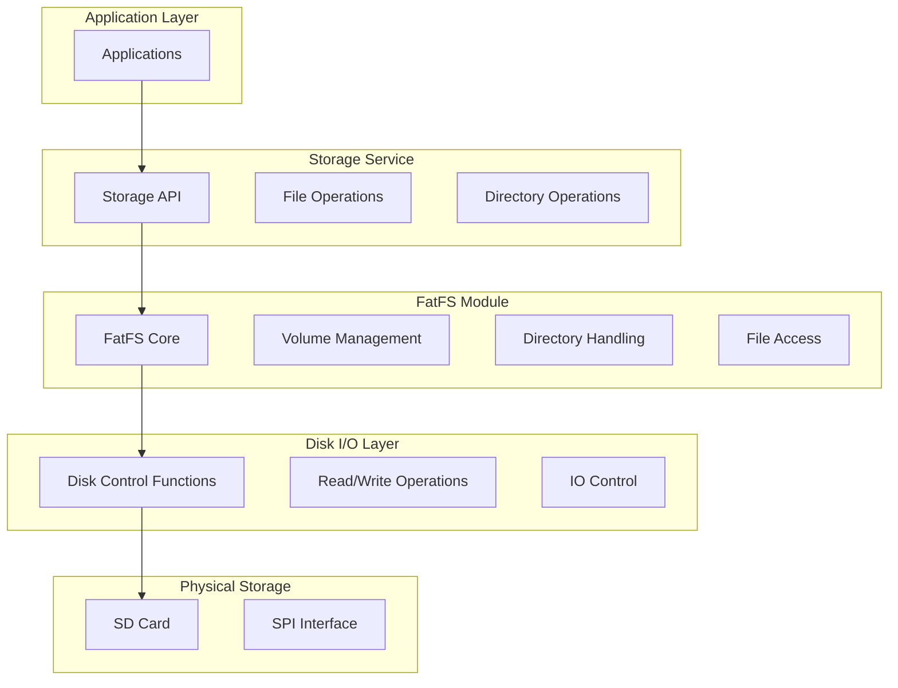
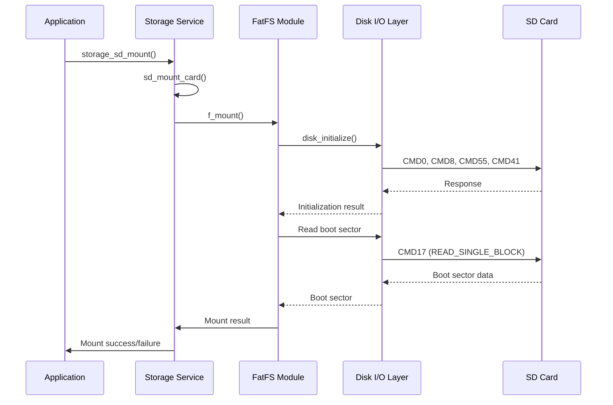
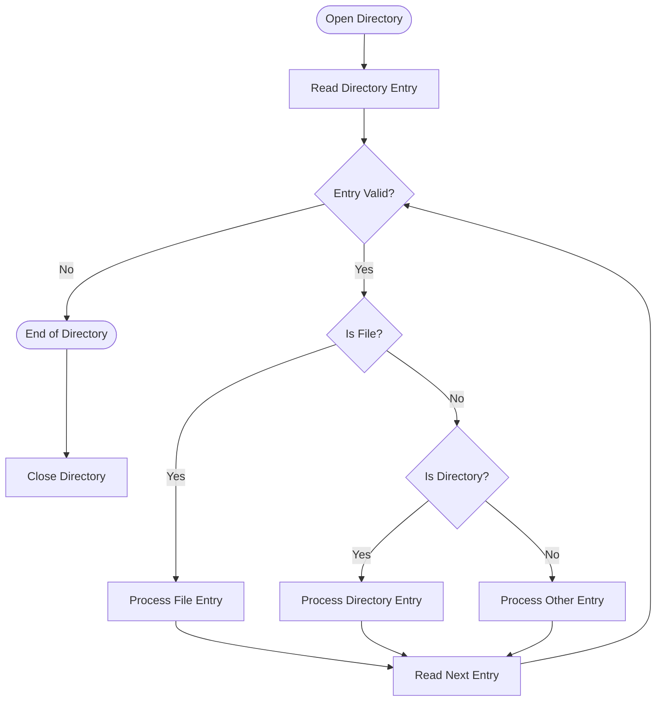
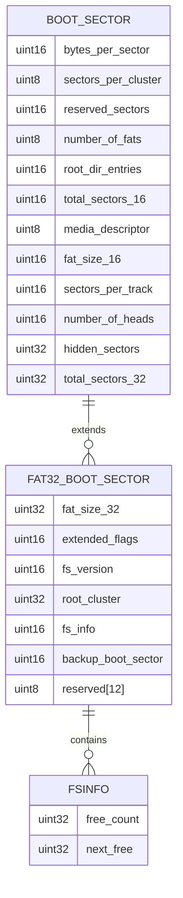
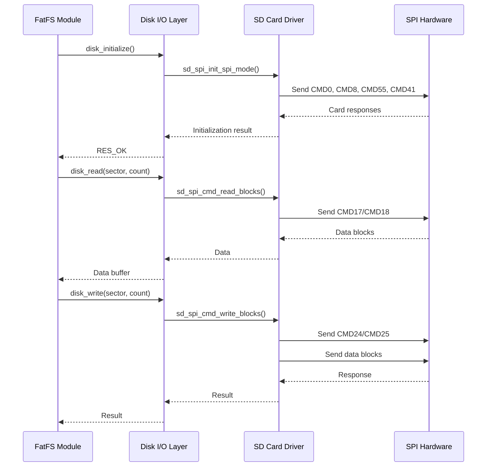
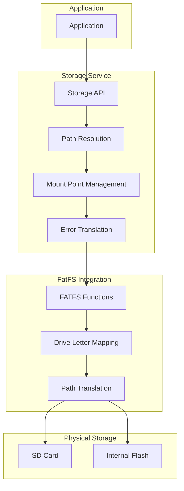
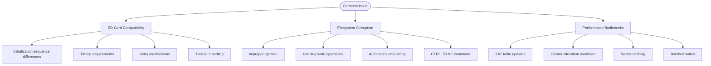
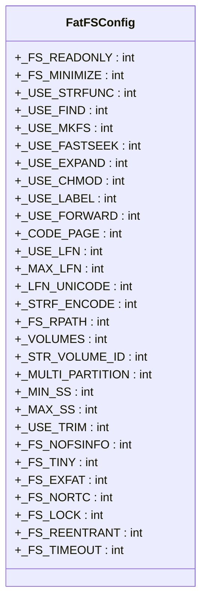

# FatFS Implementation

<cite>
**Referenced Files in This Document**   
- [ff.h](file://lib/fatfs/ff.h)
- [diskio.h](file://lib/fatfs/diskio.h)
- [ffconf_template.h](file://lib/fatfs/ffconf_template.h)
- [storage.h](file://applications/services/storage/storage.h)
- [storage.c](file://applications/services/storage/storage.c)
- [storage_ext.c](file://applications/services/storage/storages/storage_ext.c)
- [furi_hal_sd.c](file://targets/f7/furi_hal/furi_hal_sd.c)
- [storage_glue.h](file://applications/services/storage/storage_glue.h)
- [filesystem_api_internal.h](file://applications/services/storage/filesystem_api_internal.h)
</cite>

## Table of Contents
1. [Introduction](#introduction)
2. [FatFS Architecture](#fatfs-architecture)
3. [Volume Management and Mounting](#volume-management-and-mounting)
4. [Directory and File Access Mechanisms](#directory-and-file-access-mechanisms)
5. [FAT Variants Support](#fat-variants-support)
6. [Integration with SD Card Driver](#integration-with-sd-card-driver)
7. [Storage Service Relationship](#storage-service-relationship)
8. [Common Issues and Troubleshooting](#common-issues-and-troubleshooting)
9. [Configuration Options](#configuration-options)
10. [Conclusion](#conclusion)

## Introduction
FatFS is a widely-used FAT file system module specifically designed for small embedded systems like the Flipper Zero. This implementation provides a lightweight, reliable file system layer that supports FAT12, FAT16, FAT32, and exFAT variants. The FatFS module in the Flipper Zero firmware serves as the foundation for all file operations, enabling applications to read, write, and manage files on both internal and external storage.

The FatFS implementation follows a modular architecture with a clear separation between the file system logic and the underlying storage hardware. This design allows for efficient integration with the Flipper Zero's storage subsystem while maintaining compatibility with standard FAT file system specifications. The system handles critical operations such as volume management, directory traversal, file access, and cluster allocation with optimized performance for resource-constrained environments.

**Section sources**
- [ff.h](file://lib/fatfs/ff.h#L1-L362)
- [storage.h](file://applications/services/storage/storage.h#L1-L681)

## FatFS Architecture
The FatFS architecture in the Flipper Zero firmware follows a layered design pattern that separates the file system logic from the physical storage interface. At its core, FatFS implements the FAT file system specification with support for multiple FAT variants and provides a comprehensive API for file and directory operations.

The architecture consists of three main components: the FatFS core module, the disk I/O layer, and the storage service integration. The FatFS core (implemented in ff.c and ff.h) handles all file system operations including directory management, file access, and cluster allocation. This core module interacts with the disk I/O layer through standardized interfaces defined in diskio.h, which abstracts the physical storage details.

The disk I/O layer acts as a bridge between the FatFS core and the physical storage device. It implements the low-level disk control functions such as disk_initialize, disk_read, disk_write, and disk_ioctl, which are required by the FatFS module. This layer is responsible for translating FatFS requests into physical storage operations, handling sector addressing, and managing the communication protocol with the storage device.

**Diagram sources **
- [ff.h](file://lib/fatfs/ff.h#L83-L126)
- [diskio.h](file://lib/fatfs/diskio.h#L35-L39)
- [storage.h](file://applications/services/storage/storage.h#L81-L279)

**Section sources**
- [ff.h](file://lib/fatfs/ff.h#L83-L126)
- [diskio.h](file://lib/fatfs/diskio.h#L35-L39)
- [storage.h](file://applications/services/storage/storage.h#L81-L279)

## Volume Management and Mounting
Volume management in the FatFS implementation is handled through the FATFS structure and the f_mount function. The FATFS structure contains critical information about the mounted volume including file system type, cluster size, FAT table parameters, and various status flags. When a volume is mounted, FatFS reads the boot sector to initialize this structure with the appropriate values for the specific FAT variant.

The mounting process begins with the detection of an SD card presence through the furi_hal_sd_is_present() function. When a card is detected, the system initializes the SPI interface and sends initialization commands to the SD card to determine its type (SDSC, SDHC, or SDXC) and capacity. This process involves sending CMD0 (GO_IDLE_STATE) followed by CMD8 (SEND_IF_COND) to check the card's capabilities.

Once the card is initialized, FatFS attempts to mount the file system by reading the boot sector and validating the file system signature. The boot sector contains essential information such as bytes per sector, sectors per cluster, number of FATs, and root directory entries. For FAT32 volumes, additional information is read from the FSINFO sector to determine free space and last allocated cluster.

**Diagram sources **
- [ff.h](file://lib/fatfs/ff.h#L83-L126)
- [furi_hal_sd.c](file://targets/f7/furi_hal/furi_hal_sd.c#L513-L558)
- [storage_ext.c](file://applications/services/storage/storages/storage_ext.c#L109-L110)

**Section sources**
- [ff.h](file://lib/fatfs/ff.h#L83-L126)
- [furi_hal_sd.c](file://targets/f7/furi_hal/furi_hal_sd.c#L513-L558)
- [storage_ext.c](file://applications/services/storage/storages/storage_ext.c#L109-L110)

## Directory and File Access Mechanisms
The directory and file access mechanisms in FatFS are implemented through a combination of data structures and API functions that provide efficient navigation and manipulation of the file system hierarchy. The DIR structure represents an open directory and contains information about the current position in the directory, while the FIL structure represents an open file with its current read/write pointer and cluster information.

Directory operations are handled through functions like f_opendir, f_readdir, and f_closedir. When a directory is opened, FatFS reads the directory entries from the appropriate cluster chain and maintains a pointer to the current position. The f_readdir function reads the next directory entry, parsing the 32-byte directory entry format that includes filename, attributes, creation time, and starting cluster.

File access is managed through the FIL structure, which contains the file's current cluster, sector, and byte position within the cluster. The f_read and f_write functions handle data transfer between the application buffer and the file, automatically managing cluster chaining and FAT table updates. For sequential access, FatFS caches the current cluster information to minimize FAT table lookups.

**Diagram sources **
- [ff.h](file://lib/fatfs/ff.h#L178-L191)
- [ff.h](file://lib/fatfs/ff.h#L155-L172)
- [storage_ext.c](file://applications/services/storage/storages/storage_ext.c#L491-L551)

**Section sources**
- [ff.h](file://lib/fatfs/ff.h#L178-L191)
- [ff.h](file://lib/fatfs/ff.h#L155-L172)
- [storage_ext.c](file://applications/services/storage/storages/storage_ext.c#L491-L551)

## FAT Variants Support
The FatFS implementation in the Flipper Zero firmware supports multiple FAT variants including FAT12, FAT16, FAT32, and exFAT. The file system type is determined during the mounting process by examining the boot sector parameters, particularly the number of clusters. FAT12 is identified by fewer than 4,085 clusters, FAT16 by 4,085 to 65,525 clusters, and FAT32 by more than 65,525 clusters.

For FAT32 volumes, FatFS reads additional information from the FSINFO sector, which contains the number of free clusters and the last allocated cluster. This optimization reduces the need for full FAT scans when determining free space. The exFAT support is conditional on the _FS_EXFAT configuration option and requires long filename (LFN) support to be enabled.

The implementation handles the differences between FAT variants transparently through the FATFS structure, which contains variant-specific parameters. For example, the n_rootdir field is only used in FAT12 and FAT16, while FAT32 uses a cluster-based root directory. The cluster size (csize) and number of FAT entries (n_fatent) are calculated differently for each variant based on the boot sector parameters.

**Diagram sources **
- [ff.h](file://lib/fatfs/ff.h#L86-L125)
- [ff.h](file://lib/fatfs/ff.h#L343-L347)
- [furi_hal_sd.c](file://targets/f7/furi_hal/furi_hal_sd.c#L561-L643)

**Section sources**
- [ff.h](file://lib/fatfs/ff.h#L86-L125)
- [ff.h](file://lib/fatfs/ff.h#L343-L347)
- [furi_hal_sd.c](file://targets/f7/furi_hal/furi_hal_sd.c#L561-L643)

## Integration with SD Card Driver
The integration between FatFS and the SD card driver is achieved through the disk I/O layer, which implements the standard disk control functions required by FatFS. The SD card driver in furi_hal_sd.c provides low-level SPI communication with the SD card, handling initialization, read/write operations, and status monitoring.

The disk_initialize function initializes the SD card by sending a sequence of commands (CMD0, CMD8, CMD55, CMD41) to detect the card type and set it to SPI mode. The disk_read and disk_write functions handle data transfer in 512-byte sectors, with support for both single block and multiple block operations. The disk_ioctl function implements control operations such as cache synchronization and media information retrieval.

A critical aspect of this integration is the sector addressing scheme, which differs between SDSC (Standard Capacity) and SDHC/SDXC (High Capacity) cards. For SDSC cards, the address parameter in read/write commands represents byte addresses, while for SDHC/SDXC cards, it represents sector addresses. This difference is handled by the sd_high_capacity flag, which is set during initialization based on the response to CMD8.

**Diagram sources **
- [diskio.h](file://lib/fatfs/diskio.h#L35-L39)
- [furi_hal_sd.c](file://targets/f7/furi_hal/furi_hal_sd.c#L430-L558)
- [furi_hal_sd.c](file://targets/f7/furi_hal/furi_hal_sd.c#L688-L802)

**Section sources**
- [diskio.h](file://lib/fatfs/diskio.h#L35-L39)
- [furi_hal_sd.c](file://targets/f7/furi_hal/furi_hal_sd.c#L430-L558)
- [furi_hal_sd.c](file://targets/f7/furi_hal/furi_hal_sd.c#L688-L802)

## Storage Service Relationship
The relationship between FatFS and the storage service in the Flipper Zero firmware is mediated through the storage abstraction layer, which provides a unified API for file operations across different storage types. The storage service acts as an intermediary between applications and the underlying file system, handling mount points, path resolution, and error translation.

The storage service defines several path prefixes that map to different storage locations: /int for internal storage, /ext for external SD card, and /mnt for mounted virtual drives. When an application requests a file operation, the storage service translates the path to the appropriate drive letter (e.g., "0:" for SD card) before passing it to the FatFS functions.

The storage service also manages the lifecycle of the SD card, monitoring its presence through a dedicated GPIO pin and automatically mounting or unmounting the file system when the card is inserted or removed. This is implemented in the storage_ext_tick function, which checks the card presence and calls sd_mount_card or sd_unmount_card as needed.

**Diagram sources **
- [storage.h](file://applications/services/storage/storage.h#L15-L29)
- [storage_ext.c](file://applications/services/storage/storages/storage_ext.c#L683-L699)
- [storage_ext.c](file://applications/services/storage/storages/storage_ext.c#L248-L280)

**Section sources**
- [storage.h](file://applications/services/storage/storage.h#L15-L29)
- [storage_ext.c](file://applications/services/storage/storages/storage_ext.c#L683-L699)
- [storage_ext.c](file://applications/services/storage/storages/storage_ext.c#L248-L280)

## Common Issues and Troubleshooting
Several common issues can occur with the FatFS implementation in the Flipper Zero firmware, particularly related to SD card compatibility, filesystem corruption, and performance bottlenecks. Understanding these issues and their solutions is crucial for reliable operation.

SD card compatibility problems often stem from differences in card initialization sequences or timing requirements. Some cards may require longer initialization timeouts or specific command sequences. The implementation includes retry mechanisms and timeout handling to accommodate various card types, but certain low-quality or counterfeit cards may still fail to initialize properly.

Filesystem corruption after improper ejection is a significant concern. When the SD card is removed without proper unmounting, pending write operations may not be completed, leading to FAT table inconsistencies. The implementation mitigates this risk by automatically unmounting the card when removal is detected and by using the CTRL_SYNC command to ensure all data is written before critical operations.

Performance bottlenecks in high-frequency write scenarios can occur due to the overhead of FAT table updates and cluster allocation. Each write operation may require multiple sector reads and writes to update the FAT chain. The implementation uses a sector cache to reduce redundant reads, but applications should batch write operations when possible to minimize this overhead.

**Diagram sources **
- [furi_hal_sd.c](file://targets/f7/furi_hal/furi_hal_sd.c#L430-L558)
- [storage_ext.c](file://applications/services/storage/storages/storage_ext.c#L248-L280)
- [furi_hal_sd.c](file://targets/f7/furi_hal/furi_hal_sd.c#L840-L863)

**Section sources**
- [furi_hal_sd.c](file://targets/f7/furi_hal/furi_hal_sd.c#L430-L558)
- [storage_ext.c](file://applications/services/storage/storages/storage_ext.c#L248-L280)
- [furi_hal_sd.c](file://targets/f7/furi_hal/furi_hal_sd.c#L840-L863)

## Configuration Options
The FatFS implementation in the Flipper Zero firmware is highly configurable through the ffconf_template.h file, which defines various options that affect memory usage, feature set, and performance characteristics. These configuration options allow the file system to be optimized for the specific requirements of the embedded environment.

Key configuration options include _FS_READONLY, which removes all write-related functions to reduce code size when only read access is needed; _USE_LFN, which enables long filename support with different memory allocation strategies (static, stack, or heap); and _FS_LOCK, which controls file locking to prevent concurrent access to the same file.

The _VOLUMES option determines the number of logical drives that can be mounted simultaneously, while _MAX_SS and _MIN_SS define the supported sector sizes. The _FS_REENTRANT option enables thread-safe operation by requiring synchronization primitives, which is important in the multi-threaded environment of the Flipper Zero firmware.

**Diagram sources **
- [ffconf_template.h](file://lib/fatfs/ffconf_template.h#L32-L303)
- [ff.h](file://lib/fatfs/ff.h#L31-L33)
- [ffconf_template.h](file://lib/fatfs/ffconf_template.h#L264-L286)

**Section sources**
- [ffconf_template.h](file://lib/fatfs/ffconf_template.h#L32-L303)

## Conclusion
The FatFS implementation in the Flipper Zero firmware provides a robust and efficient file system solution for embedded applications. By leveraging the well-established FatFS module and integrating it with a custom storage service, the firmware achieves reliable file operations on both internal and external storage media.

The architecture effectively separates concerns between the file system logic, disk I/O operations, and application interface, allowing for maintainable and extensible code. The support for multiple FAT variants, long filenames, and thread-safe operation makes it suitable for a wide range of use cases, from simple data logging to complex application storage.

Understanding the configuration options and common issues is essential for developers working with the file system. Proper handling of SD card insertion/removal, careful management of write operations, and appropriate configuration choices can significantly improve the reliability and performance of applications that use the file system.

The integration with the storage service provides a clean abstraction layer that simplifies application development while maintaining the efficiency and reliability of the underlying FatFS implementation. This combination of a proven file system module with a well-designed integration layer makes the Flipper Zero's storage system both powerful and accessible to developers of all skill levels.