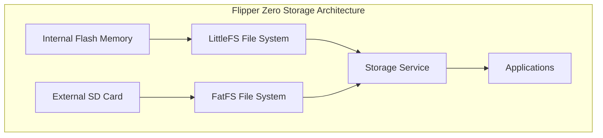
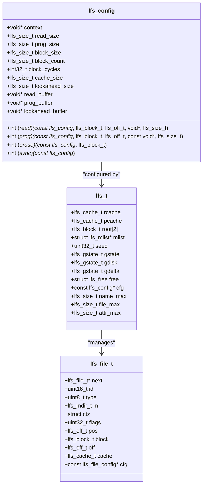
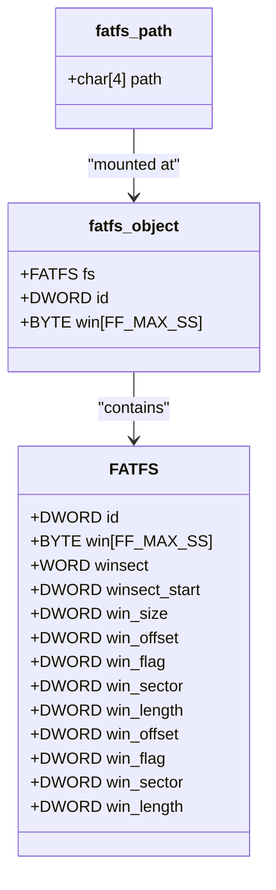
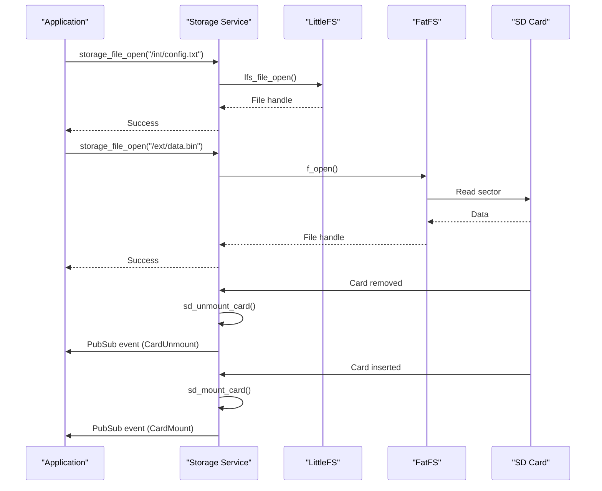
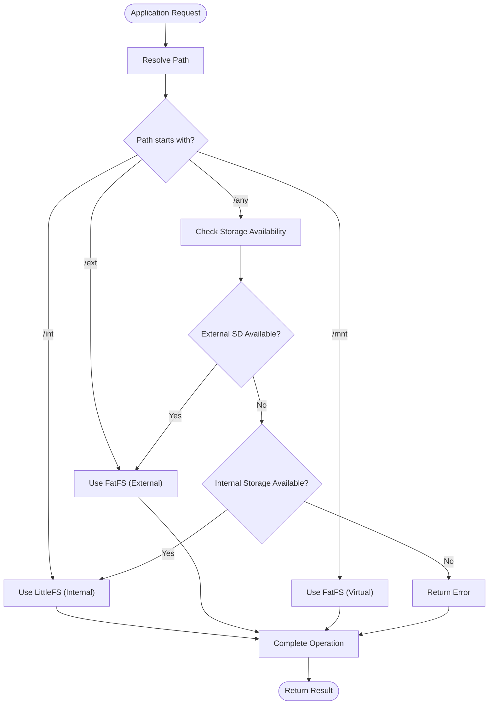

# File Systems

<cite>
**Referenced Files in This Document**   
- [storage.h](file://applications/services/storage/storage.h)
- [storage.c](file://applications/services/storage/storage.c)
- [storage_glue.h](file://applications/services/storage/storage_glue.h)
- [storage_processing.c](file://applications/services/storage/storage_processing.c)
- [lfs.h](file://lib/littlefs/lfs.h)
- [lfs.c](file://lib/littlefs/lfs.c)
- [fatfs.h](file://targets/f7/fatfs/fatfs.h)
- [filesystem_api_defines.h](file://applications/services/storage/filesystem_api_defines.h)
- [filesystem_api.c](file://applications/services/storage/filesystem_api.c)
</cite>

## Table of Contents
1. [Introduction](#introduction)
2. [Dual File System Architecture](#dual-file-system-architecture)
3. [LittleFS Implementation](#littlefs-implementation)
4. [FatFS Implementation](#fatfs-implementation)
5. [Storage Service Integration](#storage-service-integration)
6. [File Operations](#file-operations)
7. [Mount Points and Access Patterns](#mount-points-and-access-patterns)
8. [Performance Considerations](#performance-considerations)
9. [Troubleshooting Guide](#troubleshooting-guide)

## Introduction
The Flipper Zero employs a dual file system architecture that combines LittleFS for internal flash storage and FatFS for external SD card storage. This design provides optimal performance, reliability, and power failure resilience for the device's various storage needs. The internal storage uses LittleFS, a lightweight file system specifically designed for microcontrollers with limited resources, while the external SD card utilizes FatFS, a widely adopted file system compatible with standard SD card formats. This documentation provides a comprehensive analysis of both file systems, their implementation details, integration with the storage service, and practical usage patterns.

## Dual File System Architecture
The Flipper Zero's storage architecture is designed to leverage the strengths of two different file systems optimized for their respective storage media. The system implements LittleFS for the internal flash memory and FatFS for external SD cards, creating a unified storage interface through the storage service.



**Diagram sources**
- [storage.h](file://applications/services/storage/storage.h#L15-L18)
- [lfs.h](file://lib/littlefs/lfs.h#L18)
- [fatfs.h](file://targets/f7/fatfs/fatfs.h#L14)

**Section sources**
- [storage.h](file://applications/services/storage/storage.h#L15-L18)
- [storage.c](file://applications/services/storage/storage.c#L48-L50)

## LittleFS Implementation
LittleFS is implemented as the file system for the Flipper Zero's internal flash memory, providing excellent wear leveling, power failure resilience, and efficient storage utilization. The implementation is based on the littlefs library (version 0x00020007) with specific configuration parameters optimized for the STM32WB55 microcontroller.

The LittleFS implementation in Flipper Zero features:
- Block size of 4096 bytes, aligned with the flash page size
- Cache size of 512 bytes for read and program operations
- Lookahead buffer of 32 bytes (256 bits) for block allocation tracking
- Wear leveling with a block cycle count of 1000 erase cycles
- Maximum file name length of 255 characters
- Maximum file size of 2,147,483,647 bytes

LittleFS employs a log-structured approach with metadata pairs that provide atomic updates and power failure resilience. The file system uses a combination of CTZ skip lists for file data and a tree of directory blocks for directory structures. This design ensures that file operations are atomic and that the file system can recover from power failures without corruption.



**Diagram sources**
- [lfs.h](file://lib/littlefs/lfs.h#L158-L273)
- [lfs.h](file://lib/littlefs/lfs.h#L410-L443)

**Section sources**
- [lfs.h](file://lib/littlefs/lfs.h#L24-L33)
- [lfs.h](file://lib/littlefs/lfs.h#L158-L273)

## FatFS Implementation
FatFS is implemented for the external SD card storage in the Flipper Zero, providing compatibility with standard SD card formats and widespread tool support. The FatFS implementation is based on the FatFs R0.13c module with specific adaptations for the STM32WB55 microcontroller and the Flipper Zero's storage requirements.

The FatFS implementation in Flipper Zero features:
- Logical drive path mounted at "/ext"
- Support for FAT16 and FAT32 file systems
- Standard SD card initialization and detection
- Compatibility with standard SD card formatting tools
- Case-insensitive file name handling

FatFS provides a traditional file system interface with directory entries, file allocation tables, and boot sectors. This implementation allows users to easily transfer files between the Flipper Zero and other devices using standard file managers. The file system is initialized through the `fatfs_init()` function and mounted on the SD card when detected.



**Diagram sources**
- [fatfs.h](file://targets/f7/fatfs/fatfs.h#L12-L14)
- [fatfs.h](file://targets/f7/fatfs/fatfs.h#L3)

**Section sources**
- [fatfs.h](file://targets/f7/fatfs/fatfs.h#L12-L14)
- [storage.c](file://applications/services/storage/storage.c#L50)

## Storage Service Integration
The storage service in Flipper Zero provides a unified API for accessing both LittleFS and FatFS file systems, abstracting the differences between the two implementations. The service manages multiple storage types (internal, external, and virtual) and provides a consistent interface for file operations.

The storage service architecture includes:
- StorageData structures for each storage type (ST_INT, ST_EXT, ST_MNT)
- StorageApi function pointers for tick operations
- StorageFile structures for file handles
- PubSub system for storage events (card mount/unmount)
- Path resolution and alias handling

The service initializes the internal LittleFS storage at "/int" and the external FatFS storage at "/ext" during startup. It also supports a virtual mount point at "/mnt" for disk image files. The storage service handles automatic mounting and unmounting of the SD card and provides event notifications through the PubSub system.



**Diagram sources**
- [storage.h](file://applications/services/storage/storage.h#L31)
- [storage.c](file://applications/services/storage/storage.c#L48-L50)
- [storage_glue.h](file://applications/services/storage/storage_glue.h#L11-L17)

**Section sources**
- [storage.h](file://applications/services/storage/storage.h#L31-L32)
- [storage.c](file://applications/services/storage/storage.c#L37-L64)

## File Operations
The Flipper Zero provides a comprehensive API for file operations on both LittleFS and FatFS file systems. The storage service abstracts the underlying file system differences, providing a consistent interface for applications.

### Common File Operations
The following file operations are available through the storage service API:

| Operation | Function | Description |
|---------|---------|-------------|
| File Open | storage_file_open() | Opens an existing file or creates a new one |
| File Close | storage_file_close() | Closes an open file |
| File Read | storage_file_read() | Reads data from a file |
| File Write | storage_file_write() | Writes data to a file |
| File Seek | storage_file_seek() | Changes the file access position |
| File Size | storage_file_size() | Gets the size of a file |
| File Sync | storage_file_sync() | Synchronizes file cache with storage |

### Directory Operations
The following directory operations are available:

| Operation | Function | Description |
|---------|---------|-------------|
| Directory Open | storage_dir_open() | Opens a directory for reading |
| Directory Read | storage_dir_read() | Reads the next item in a directory |
| Directory Close | storage_dir_close() | Closes an open directory |
| Directory Rewind | storage_dir_rewind() | Resets directory position to beginning |

### Practical Examples
```c
// Example: Creating and writing to a file
File* file = storage_file_alloc(storage);
if (storage_file_open(file, "/int/hello.txt", FSAM_WRITE, FSOM_CREATE_ALWAYS)) {
    const char* text = "Hello, Flipper Zero!";
    storage_file_write(file, text, strlen(text));
    storage_file_sync(file);
    storage_file_close(file);
}
storage_file_free(file);

// Example: Reading a file
File* file = storage_file_alloc(storage);
if (storage_file_open(file, "/ext/data.bin", FSAM_READ, FSOM_OPEN_EXISTING)) {
    uint8_t buffer[256];
    size_t bytes_read = storage_file_read(file, buffer, sizeof(buffer));
    storage_file_close(file);
    // Process data
}
storage_file_free(file);

// Example: Directory traversal
File* dir = storage_file_alloc(storage);
if (storage_dir_open(dir, "/ext/apps")) {
    FileInfo fileinfo;
    char name[256];
    while (storage_dir_read(dir, &fileinfo, name, sizeof(name))) {
        if (file_info_is_dir(&fileinfo)) {
            printf("Directory: %s\n", name);
        } else {
            printf("File: %s (%llu bytes)\n", name, fileinfo.size);
        }
    }
    storage_dir_close(dir);
}
storage_file_free(dir);
```

**Section sources**
- [storage.h](file://applications/services/storage/storage.h#L92-L223)
- [storage.h](file://applications/services/storage/storage.h#L238-L268)
- [filesystem_api_defines.h](file://applications/services/storage/filesystem_api_defines.h#L10-L23)

## Mount Points and Access Patterns
The Flipper Zero implements a hierarchical mount point system that provides clear separation between different storage types and use cases. The mount points are defined as follows:

| Mount Point | Path | File System | Purpose |
|------------|------|-------------|---------|
| Internal Storage | /int | LittleFS | System files, application data, configuration |
| External Storage | /ext | FatFS | User data, applications, media files |
| Virtual Mount | /mnt | FatFS | Disk image files, firmware updates |
| Any Storage | /any | Union | Automatic selection between internal and external |

The access patterns for each mount point are optimized for their respective use cases:

- **/int (Internal Storage)**: Used for system-critical files that require high reliability and wear leveling. This includes application manifests, configuration files, and system databases. The LittleFS implementation ensures data integrity even in the event of power failures.

- **/ext (External Storage)**: Used for user-accessible files that benefit from standard SD card compatibility. This includes application files, media files, and user data. The FatFS implementation allows users to easily transfer files using standard file managers.

- **/mnt (Virtual Mount)**: Used for temporary mounting of disk image files. This allows applications to access the contents of disk images as if they were mounted drives.

- **/any (Any Storage)**: Provides a union view of internal and external storage, automatically selecting the appropriate storage based on availability and space.

The storage service handles path resolution and ensures that operations on the /any mount point are directed to the appropriate underlying storage. This abstraction allows applications to work with files without needing to know the specific storage medium.



**Diagram sources**
- [storage.h](file://applications/services/storage/storage.h#L15-L18)
- [storage_processing.c](file://applications/services/storage/storage_processing.c#L43-L63)

**Section sources**
- [storage.h](file://applications/services/storage/storage.h#L15-L18)
- [storage_processing.c](file://applications/services/storage/storage_processing.c#L43-L82)

## Performance Considerations
The dual file system architecture of the Flipper Zero is designed with careful consideration of performance characteristics for both flash memory wear leveling and efficient directory traversal.

### Flash Memory Wear Leveling
LittleFS provides excellent wear leveling for the internal flash memory through its log-structured design and metadata pair updates. The file system spreads write operations across the entire storage medium, preventing premature wear of specific blocks. The block_cycles parameter is set to 1000, meaning that metadata is moved to a new block after 1000 erase cycles, ensuring even wear distribution.

FatFS on the SD card relies on the SD card's internal wear leveling algorithms, which are typically more sophisticated than those implemented in software. However, frequent small writes to the same location can still lead to uneven wear. Applications should batch small writes when possible to minimize the impact on SD card lifespan.

### Directory Traversal Efficiency
LittleFS uses a linked list structure for directory entries, which provides O(n) traversal time where n is the number of files in the directory. For directories with many files, this can become a performance bottleneck. The file system does not support directory indexing, so applications should avoid creating directories with excessive numbers of files.

FatFS uses a traditional directory structure with directory entries stored in clusters. Directory traversal performance depends on the directory size and fragmentation. The file system supports long file names (LFN) which can impact performance due to the additional directory entries required.

### Performance Recommendations
- For frequently updated files, use the internal LittleFS storage as it is optimized for small, frequent writes
- For large files or infrequently updated data, use the external SD card storage
- Avoid creating directories with more than 100 files to maintain efficient traversal
- Batch small write operations to reduce flash wear and improve performance
- Use the /any mount point for user data to automatically utilize available storage
- Close files promptly to free up resources and ensure data is written to storage

```mermaid
graph TD
A[Performance Considerations] --> B[Flash Wear Leveling]
A --> C[Directory Traversal]
A --> D[Write Operations]
B --> B1[LittleFS: Log-structured, metadata pairs]
B --> B2[FatFS: SD card internal algorithms]
B --> B3[Recommendation: Batch small writes]
C --> C1[LittleFS: Linked list, O(n) traversal]
C --> C2[FatFS: Cluster-based, fragmentation impact]
C --> C3[Recommendation: Limit directory size]
D --> D1[Frequent small writes: Use /int]
D --> D2[Large infrequent writes: Use /ext]
D --> D3[Close files promptly]
```

**Diagram sources**
- [lfs.h](file://lib/littlefs/lfs.h#L217-L218)
- [storage.h](file://applications/services/storage/storage.h#L15-L16)

**Section sources**
- [lfs.h](file://lib/littlefs/lfs.h#L217-L218)
- [storage.h](file://applications/services/storage/storage.h#L15-L16)

## Troubleshooting Guide
This section addresses common issues related to the Flipper Zero's file systems, including file system corruption, storage full errors, and permission problems.

### File System Corruption
File system corruption can occur due to improper shutdown, power failures, or hardware issues. Symptoms include:
- Inability to mount the file system
- File read/write errors
- Directory listing failures
- Unexpected application crashes

**LittleFS Corruption Recovery:**
1. The LittleFS implementation includes built-in power failure resilience through its log-structured design
2. If corruption occurs, the file system can often be recovered by reformatting the internal storage
3. Use the storage_int_backup() function to create a backup before attempting recovery

**FatFS Corruption Recovery:**
1. Remove the SD card and check it on a computer using standard disk checking tools
2. Use the storage_sd_format() function to reformat the SD card
3. Ensure proper shutdown procedures are followed to minimize corruption risk

### Storage Full Errors
Storage full errors occur when there is insufficient space for file operations. Solutions include:

| Error | Solution |
|------|----------|
| Internal storage full | Move files to SD card, delete unnecessary files, or expand storage |
| External storage full | Delete files, format SD card, or use larger capacity card |
| Virtual mount full | Increase image file size or use different image |

Use the storage_common_fs_info() function to check available space before performing large write operations.

### Permission Problems
Permission issues typically arise from incorrect file access modes or attempting to modify read-only files. Common solutions:

- Ensure correct access mode (FSAM_READ, FSAM_WRITE, or FSAM_READ_WRITE) is specified
- Check that files are not opened by multiple processes simultaneously
- Verify that directory permissions allow the desired operations
- Use appropriate open mode flags (FSOM_OPEN_EXISTING, FSOM_CREATE_NEW, etc.)

### Error Handling
The storage service provides comprehensive error reporting through the FS_Error enumeration. Applications should check return values and handle errors appropriately:

```c
FS_Error error = storage_common_fs_info(storage, "/ext", &total_space, &free_space);
if (error != FSE_OK) {
    const char* error_desc = storage_error_get_desc(error);
    printf("FS Info error: %s\n", error_desc);
    // Handle error appropriately
}
```

Common error codes and their meanings:
- FSE_OK: No error
- FSE_NOT_READY: File system not ready (not initialized)
- FSE_NOT_EXIST: File or directory does not exist
- FSE_EXIST: File or directory already exists
- FSE_DENIED: Access denied (permission issue)
- FSE_NOT_IMPLEMENTED: Function not implemented
- FSE_ALREADY_OPEN: File or directory already opened

**Section sources**
- [storage.h](file://applications/services/storage/storage.h#L27-L37)
- [filesystem_api_defines.h](file://applications/services/storage/filesystem_api_defines.h#L26-L37)
- [filesystem_api.c](file://applications/services/storage/filesystem_api.c#L4-L38)