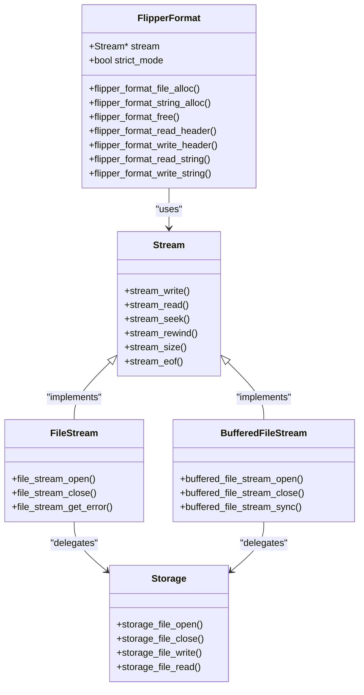
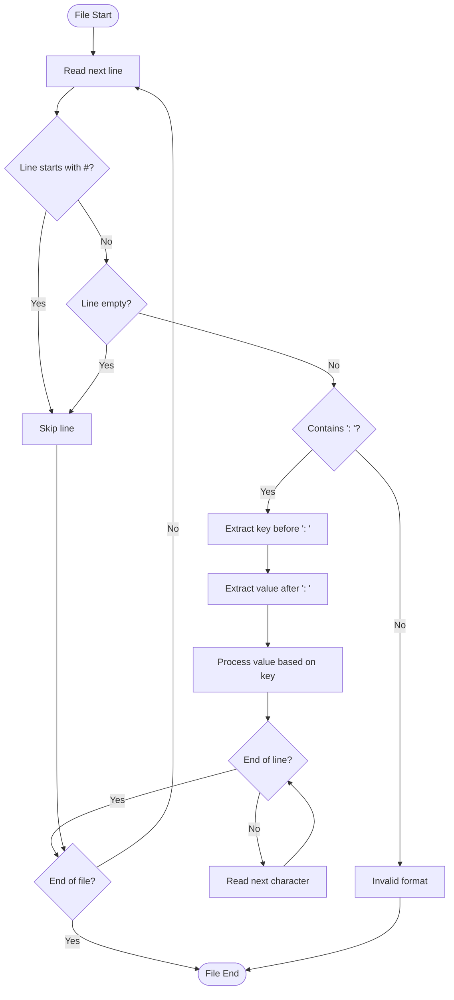
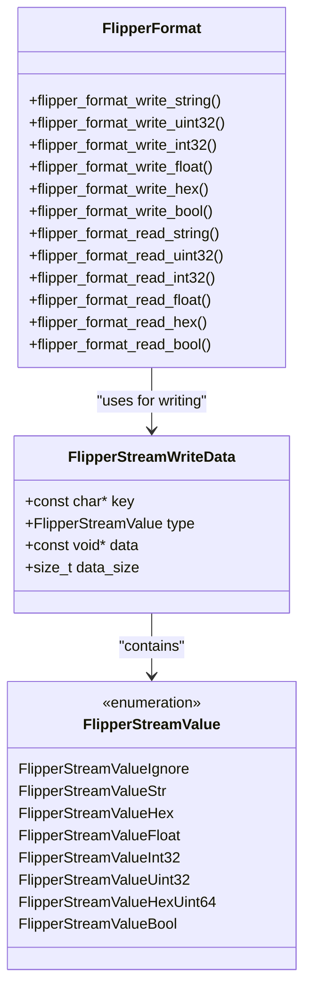
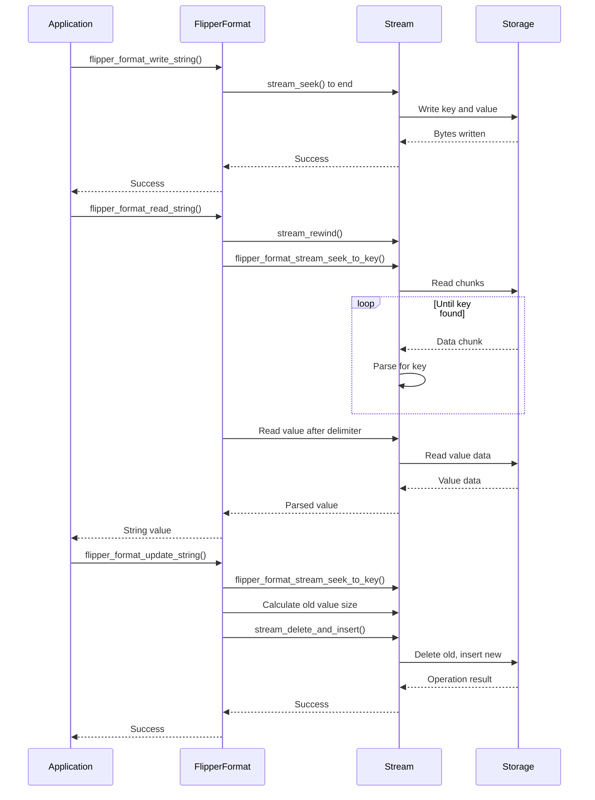
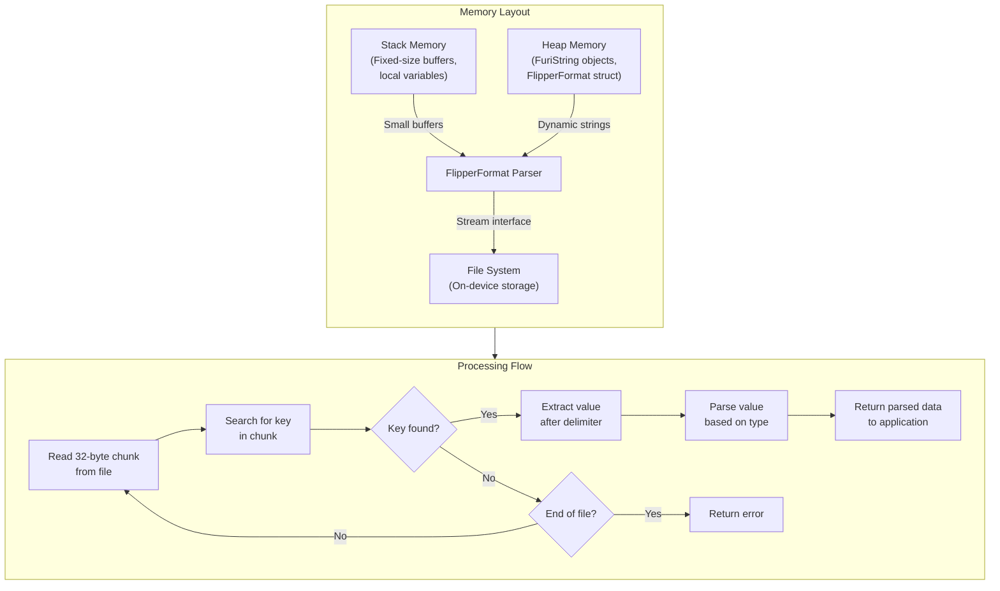
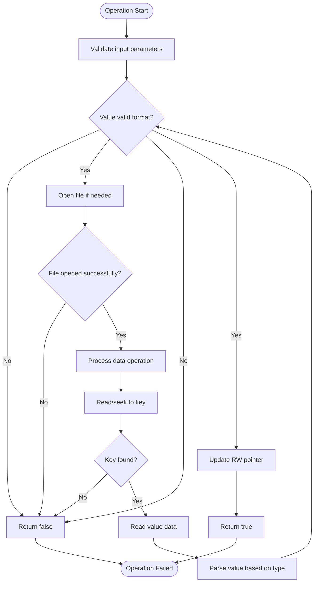
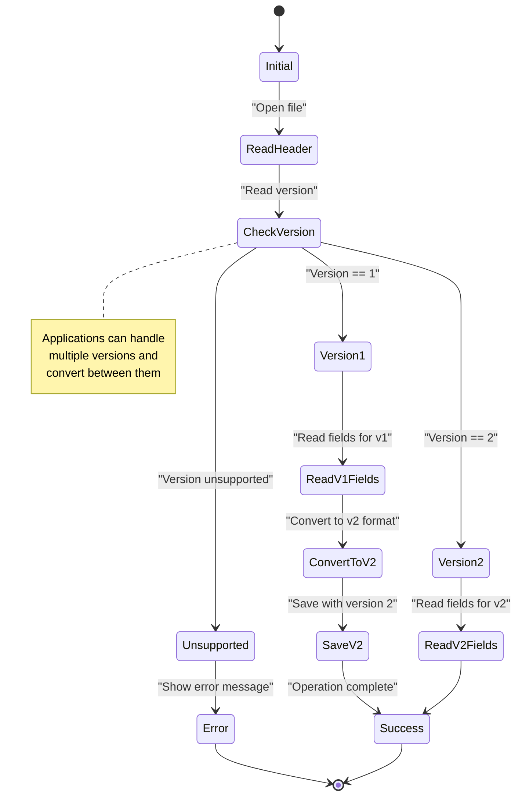
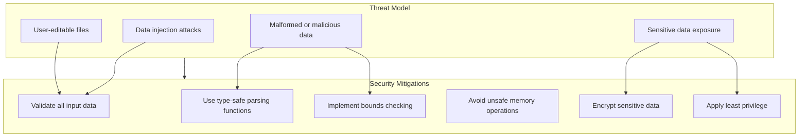
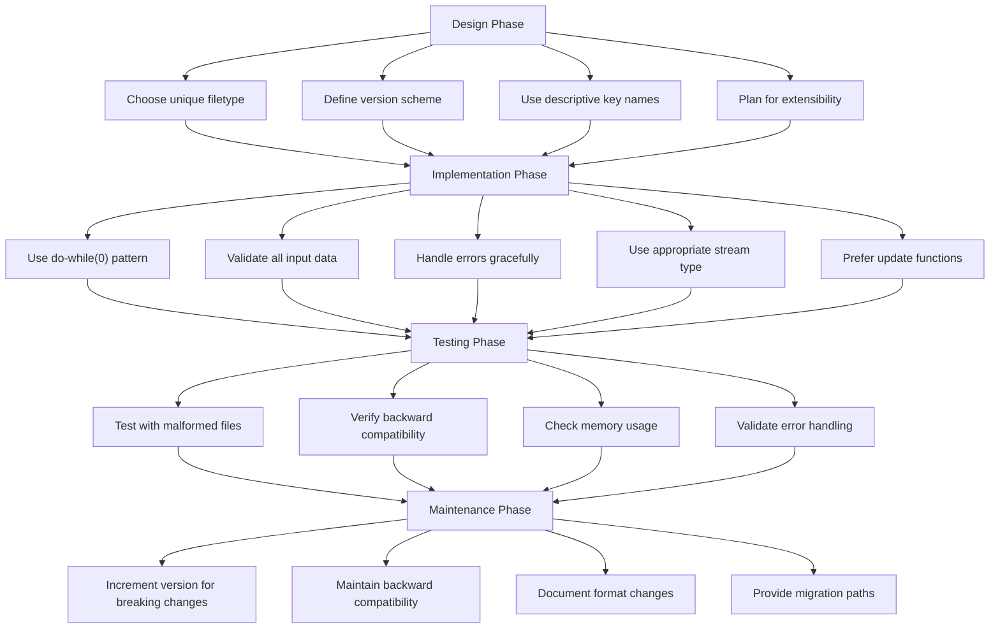

# Flipper Format Stream

<cite>
**Referenced Files in This Document**   
- [flipper_format.h](file://lib/flipper_format/flipper_format.h)
- [flipper_format.c](file://lib/flipper_format/flipper_format.c)
- [flipper_format_stream.h](file://lib/flipper_format/flipper_format_stream.h)
- [flipper_format_stream.c](file://lib/flipper_format/flipper_format_stream.c)
- [stream.h](file://lib/toolbox/stream/stream.h)
- [file_stream.h](file://lib/toolbox/stream/file_stream.h)
- [buffered_file_stream.h](file://lib/toolbox/stream/buffered_file_stream.h)
- [flipper_format_test.c](file://applications/debug/unit_tests/tests/flipper_format/flipper_format_test.c)
- [subghz_test.c](file://applications/debug/unit_tests/tests/subghz/subghz_test.c)
- [cantools_app.c](file://applications/external/can_tools/cantools_app.c)
</cite>

## Table of Contents
1. [Introduction](#introduction)
2. [Core Architecture](#core-architecture)
3. [File Structure and Syntax](#file-structure-and-syntax)
4. [Data Types and Value Handling](#data-types-and-value-handling)
5. [Stream-Based Processing Model](#stream-based-processing-model)
6. [Memory Management and Performance](#memory-management-and-performance)
7. [Error Handling and Validation](#error-handling-and-validation)
8. [Versioning and Backward Compatibility](#versioning-and-backward-compatibility)
9. [Security Considerations](#security-considerations)
10. [Application Integration Patterns](#application-integration-patterns)
11. [Best Practices](#best-practices)
12. [Conclusion](#conclusion)

## Introduction

The Flipper Format Stream system provides a structured data serialization framework built on top of the Flipper Zero's file system infrastructure. Designed as an application-specific file format, Flipper Format enables persistent storage of configuration data, application state, and protocol information in a human-readable yet machine-parsable format. This document explores the architecture, implementation, and usage patterns of the Flipper Format system, focusing on its streaming parser design, memory efficiency, and integration with the underlying storage subsystem.

The system serves as a critical component in the Flipper Zero ecosystem, enabling applications to store and retrieve configuration data across reboots while maintaining readability for users and developers. Its design balances simplicity with robustness, providing a key-value structure with type safety and versioning capabilities. The streaming nature of the parser allows for efficient processing of files without requiring complete in-memory representation, making it suitable for resource-constrained embedded environments.

**Section sources**
- [flipper_format.h](file://lib/flipper_format/flipper_format.h#L1-L85)
- [flipper_format.c](file://lib/flipper_format/flipper_format.c#L1-L20)

## Core Architecture

The Flipper Format system is built on a layered architecture that abstracts the underlying file system operations while providing a high-level interface for structured data storage. At its core, the system uses a streaming model that processes data incrementally, avoiding the need to load entire files into memory. This design is particularly important for the Flipper Zero platform, which operates with limited RAM resources.

The architecture consists of three primary layers: the FlipperFormat abstraction layer, the stream interface layer, and the underlying file system layer. The FlipperFormat layer provides application-facing functions for reading and writing structured data, handling the key-value semantics and type conversion. This layer operates on top of the stream interface, which abstracts the actual data transport mechanism. The stream layer supports multiple backends, including direct file streams and buffered file streams, allowing applications to choose the appropriate trade-off between performance and memory usage.

The system's object-oriented design in C is evident in the FlipperFormat structure, which encapsulates a Stream pointer and configuration state. This design enables polymorphic behavior where the same interface can work with different stream implementations. The strict_mode flag allows applications to control error handling behavior, with strict mode enforcing complete adherence to expected field sequences and lenient mode providing more forgiving parsing for backward compatibility.



**Diagram sources **
- [flipper_format.h](file://lib/flipper_format/flipper_format.h#L95-L785)
- [flipper_format.c](file://lib/flipper_format/flipper_format.c#L17-L20)
- [stream.h](file://lib/toolbox/stream/stream.h#L11-L22)
- [file_stream.h](file://lib/toolbox/stream/file_stream.h#L14-L36)
- [buffered_file_stream.h](file://lib/toolbox/stream/buffered_file_stream.h#L14-L53)

**Section sources**
- [flipper_format.h](file://lib/flipper_format/flipper_format.h#L95-L785)
- [flipper_format.c](file://lib/flipper_format/flipper_format.c#L17-L20)
- [stream.h](file://lib/toolbox/stream/stream.h#L11-L22)

## File Structure and Syntax

The Flipper Format file structure follows a simple key-value syntax that prioritizes human readability while maintaining machine parseability. Each file consists of lines containing key-value pairs separated by a colon and space (": "), with optional comments prefixed by the '#' character. The format specification explicitly defines line endings as LF (Line Feed, '\n') for writing, while supporting both LF and CR (Carriage Return, '\r') during reading to accommodate different text editing environments.

The file structure begins with a mandatory header consisting of two special keys: "Filetype" and "Version". These fields identify the application or data type and its version, enabling proper handling and version compatibility checks. Following the header, the file can contain any number of key-value pairs, comments, and empty lines. Comments and empty lines are ignored during key searches, which improves parsing efficiency by avoiding unnecessary memory allocation for comment content.

The syntax design reflects a careful balance between simplicity and functionality. The use of space after the colon delimiter ensures consistent formatting and prevents ambiguity in value parsing. The streaming parser processes the file incrementally, seeking directly to key positions without loading the entire file into memory. This approach enables efficient random access to specific fields, even in large files, by treating the file as a sequence of records rather than a monolithic data structure.



**Diagram sources **
- [flipper_format.h](file://lib/flipper_format/flipper_format.h#L7-L41)
- [flipper_format_stream.c](file://lib/flipper_format/flipper_format_stream.c#L8-L97)
- [flipper_format_stream_i.h](file://lib/flipper_format/flipper_format_stream_i.h#L4-L7)

**Section sources**
- [flipper_format.h](file://lib/flipper_format/flipper_format.h#L7-L41)
- [flipper_format_stream.c](file://lib/flipper_format/flipper_format_stream.c#L8-L97)

## Data Types and Value Handling

The Flipper Format system supports a comprehensive set of data types designed to accommodate common configuration and application data storage needs. These types include strings, 32-bit signed and unsigned integers, floating-point numbers, boolean values, and hexadecimal byte arrays. Each type is handled through specialized read and write functions that manage the conversion between in-memory data structures and their textual representation in the file.

String values are stored as plain text, with no escaping mechanism, making them directly editable by users. Integer values (both signed and unsigned) are represented in decimal format, while floating-point numbers use standard decimal notation. Boolean values are stored as the strings "true" or "false", providing clear human-readable representation. Hexadecimal data is stored as space-separated pairs of hexadecimal digits (e.g., "A4 B3 C2 D1"), which is both compact and easily readable.

The system handles arrays of values by storing them as space-separated sequences on a single line. This approach maintains the one-key-per-line structure while allowing multiple values to be associated with a single key. The API requires callers to specify the expected number of values when reading, which provides a simple form of data validation and prevents buffer overflow issues. For string values, the system uses FuriString objects, which provide dynamic string management with automatic memory allocation and deallocation.



**Diagram sources **
- [flipper_format_stream.h](file://lib/flipper_format/flipper_format_stream.h#L10-L19)
- [flipper_format.h](file://lib/flipper_format/flipper_format.h#L314-L525)
- [flipper_format_stream.c](file://lib/flipper_format/flipper_format_stream.c#L269-L341)

**Section sources**
- [flipper_format.h](file://lib/flipper_format/flipper_format.h#L19-L24)
- [flipper_format_stream.h](file://lib/flipper_format/flipper_format_stream.h#L10-L19)
- [flipper_format_stream.c](file://lib/flipper_format/flipper_format_stream.c#L343-L448)

## Stream-Based Processing Model

The Flipper Format system employs a streaming processing model that enables efficient file operations with minimal memory overhead. This approach is fundamental to the system's design, allowing it to handle files larger than available RAM by processing data incrementally rather than loading entire files into memory. The streaming model is implemented through the Stream abstraction, which provides a consistent interface for reading and writing data regardless of the underlying storage mechanism.

The core of the streaming model is the RW (Read-Write) pointer, which tracks the current position within the file. Operations such as reading, writing, and seeking manipulate this pointer to navigate through the file content. The system provides functions to rewind to the beginning, seek to arbitrary positions, and move to the end of the file. This random access capability enables efficient implementation of operations like key lookup and value updating without requiring sequential scanning from the beginning of the file.

A key feature of the streaming model is the delete-and-insert operation, which allows for in-place modification of file content. When updating a value, the system first locates the existing key-value pair, calculates its size, and then uses the stream_delete_and_insert function to remove the old content and write the new content in its place. This operation maintains file integrity and avoids the need for temporary files or complete file rewriting, which is particularly important for preserving storage space and write endurance on flash-based storage.



**Diagram sources **
- [flipper_format.c](file://lib/flipper_format/flipper_format.c#L130-L149)
- [flipper_format_stream.c](file://lib/flipper_format/flipper_format_stream.c#L500-L527)
- [stream.h](file://lib/toolbox/stream/stream.h#L54-L71)
- [stream.h](file://lib/toolbox/stream/stream.h#L107-L111)

**Section sources**
- [flipper_format.c](file://lib/flipper_format/flipper_format.c#L130-L149)
- [flipper_format_stream.c](file://lib/flipper_format/flipper_format_stream.c#L500-L527)
- [stream.h](file://lib/toolbox/stream/stream.h#L54-L71)

## Memory Management and Performance

The Flipper Format system is designed with careful attention to memory management and performance, reflecting the constraints of the embedded environment in which it operates. The streaming architecture minimizes memory usage by processing data incrementally rather than loading entire files into RAM. This approach allows the system to handle files much larger than available memory, which is essential for a device with limited resources like the Flipper Zero.

Memory allocation is carefully controlled, with most operations using stack-allocated buffers for temporary data. The system employs fixed-size buffers (typically 32 bytes) for reading file content in chunks, avoiding dynamic memory allocation during parsing. For string operations, the system uses FuriString objects, which provide efficient string management with automatic memory handling. The FlipperFormat structure itself is small, containing only a stream pointer and a boolean flag, minimizing the overhead of creating format instances.

Performance is optimized through several mechanisms. The key lookup algorithm uses a streaming approach that reads the file in chunks, searching for keys without loading the entire file. Once a key is found, the RW pointer is positioned at the start of the corresponding value, enabling immediate reading. The system also provides buffered file stream options that can improve performance for applications that perform multiple small read/write operations by reducing the number of direct storage system calls.



**Diagram sources **
- [flipper_format_stream.c](file://lib/flipper_format/flipper_format_stream.c#L36-L37)
- [flipper_format_stream.c](file://lib/flipper_format/flipper_format_stream.c#L198-L200)
- [flipper_format.c](file://lib/flipper_format/flipper_format.c#L17-L20)
- [flipper_format_stream.c](file://lib/flipper_format/flipper_format_stream.c#L343-L448)

**Section sources**
- [flipper_format_stream.c](file://lib/flipper_format/flipper_format_stream.c#L36-L37)
- [flipper_format_stream.c](file://lib/flipper_format/flipper_format_stream.c#L198-L200)
- [flipper_format.c](file://lib/flipper_format/flipper_format.c#L17-L20)

## Error Handling and Validation

The Flipper Format system implements comprehensive error handling and validation mechanisms to ensure data integrity and robust operation in the face of malformed files or storage errors. The API follows a consistent pattern where functions return boolean values indicating success or failure, allowing applications to handle errors appropriately. This approach provides clear feedback about operation outcomes without relying on exceptions or complex error codes.

The system employs both lenient and strict parsing modes to accommodate different use cases. In lenient mode (the default), the parser skips unrecognized fields and continues processing, which provides backward compatibility when new fields are added to file formats. In strict mode, enabled via flipper_format_set_strict_mode(), the parser treats unrecognized fields as errors, ensuring that applications receive exactly the data they expect. This dual-mode approach allows developers to choose the appropriate level of validation for their specific use case.

Validation occurs at multiple levels. The header validation ensures that files have the correct filetype and version before further processing. Key existence checks allow applications to verify required fields are present. Value counting functions like flipper_format_get_value_count() enable applications to validate that the expected number of values are available before attempting to read them, preventing buffer overflow issues. The system also validates data during parsing, ensuring that string, numeric, and hexadecimal values conform to expected formats.



**Diagram sources **
- [flipper_format.h](file://lib/flipper_format/flipper_format.h#L252-L259)
- [flipper_format_stream.c](file://lib/flipper_format/flipper_format_stream.c#L101-L123)
- [flipper_format_stream.c](file://lib/flipper_format/flipper_format_stream.c#L343-L448)
- [flipper_format.c](file://lib/flipper_format/flipper_format.c#L126-L128)

**Section sources**
- [flipper_format.h](file://lib/flipper_format/flipper_format.h#L252-L259)
- [flipper_format_stream.c](file://lib/flipper_format/flipper_format_stream.c#L101-L123)
- [flipper_format.c](file://lib/flipper_format/flipper_format.c#L126-L128)

## Versioning and Backward Compatibility

The Flipper Format system incorporates a robust versioning mechanism that enables backward compatibility and graceful evolution of file formats over time. The version field in the file header serves as a contract between the data producer and consumer, allowing applications to handle different versions of their data format appropriately. This approach supports both forward and backward compatibility, enabling new application versions to read files created by older versions while providing a mechanism for handling breaking changes.

The system's design facilitates backward compatibility through several mechanisms. The lenient parsing mode allows applications to ignore unrecognized fields, which means that adding new fields to a file format does not break older applications that don't understand them. The key-value structure enables selective reading of fields, so applications can read only the fields they understand and ignore the rest. This approach follows the robustness principle: "be conservative in what you send, be liberal in what you accept."

For handling breaking changes, the version number provides a clear indicator that a file format has changed in an incompatible way. Applications can check the version number and either refuse to process incompatible files or apply appropriate conversion logic. The system also supports migration patterns where applications can read older format versions, convert the data to the current format, and save it with the updated version number. This approach ensures that files are gradually upgraded to the latest format while maintaining compatibility during the transition period.



**Diagram sources **
- [flipper_format.h](file://lib/flipper_format/flipper_format.h#L270-L273)
- [flipper_format.h](file://lib/flipper_format/flipper_format.h#L34-L41)
- [flipper_format.c](file://lib/flipper_format/flipper_format.c#L160-L167)

**Section sources**
- [flipper_format.h](file://lib/flipper_format/flipper_format.h#L270-L273)
- [flipper_format.c](file://lib/flipper_format/flipper_format.c#L160-L167)

## Security Considerations

The Flipper Format system addresses several security considerations relevant to its role in storing configuration and application data. While the format itself is not designed as a security mechanism, its implementation includes safeguards against common vulnerabilities and provides patterns for secure usage. The human-readable nature of the format enables user inspection and editing, but also necessitates careful validation of input data to prevent injection attacks and other security issues.

One key security consideration is input validation. Since users can directly edit Flipper Format files, applications must validate all data read from these files before using it. The system's type-safe reading functions help prevent some classes of vulnerabilities by ensuring that data is properly parsed according to its expected type. However, applications should still validate that values fall within expected ranges and conform to application-specific constraints.

The system avoids using dynamic memory allocation for parsing operations, which reduces the attack surface for memory corruption vulnerabilities. The use of fixed-size buffers and careful bounds checking in the parsing code helps prevent buffer overflow issues. For string operations, the system uses FuriString objects that manage memory safely and prevent common string handling vulnerabilities.

When handling sensitive data, applications should consider encrypting the data before storing it in Flipper Format files, as the format itself provides no encryption or access control mechanisms. The system's integration with the underlying file system means that file permissions and access controls are handled at the storage level, but applications should still follow the principle of least privilege when creating and accessing configuration files.



**Diagram sources **
- [flipper_format_stream.c](file://lib/flipper_format/flipper_format_stream.c#L343-L448)
- [flipper_format_stream.c](file://lib/flipper_format/flipper_format_stream.c#L198-L200)
- [flipper_format.h](file://lib/flipper_format/flipper_format.h#L314-L525)

**Section sources**
- [flipper_format_stream.c](file://lib/flipper_format/flipper_format_stream.c#L343-L448)
- [flipper_format.h](file://lib/flipper_format/flipper_format.h#L314-L525)

## Application Integration Patterns

The Flipper Format system is integrated into various applications within the Flipper Zero ecosystem, demonstrating several common patterns for configuration storage and data persistence. These integration examples illustrate how different applications leverage the system's capabilities for storing settings, protocol data, and user preferences while maintaining compatibility and reliability.

One common pattern is the use of Flipper Format for application settings storage, as seen in the CAN Tools application. This application uses the format to store DBC (Database Container) signal definitions, with each signal saved as a separate file containing fields like signal name, CAN ID, bit length, and other properties. The application implements functions to save and load these signals, using the structured key-value format to maintain data integrity while allowing users to inspect and modify the files if needed.

Another pattern is the use of Flipper Format for protocol data storage, exemplified by the SubGhz application. This application stores radio protocol configurations in Flipper Format files, including preset information, protocol types, and encoded data. The integration allows for easy sharing of configuration files between devices and users, while the human-readable format enables debugging and manual editing when necessary.

Unit tests within the system demonstrate a third pattern: using Flipper Format for test data storage and verification. The test suite creates sample files with known content, then verifies that the reading functions correctly parse the data. This approach ensures the reliability of the format implementation and provides a reference for correct usage patterns.

```mermaid
erDiagram
APP_SETTINGS ||--o{ SIGNAL : "contains"
APP_SETTINGS ||--o{ CONFIG : "contains"
APP_SETTINGS ||--o{ PROTOCOL : "contains"
class APP_SETTINGS {
string name
string version
}
class SIGNAL {
string SignalName
string CanID
string StartBit
string BitLength
string Endianness
string Signedness
string Offset
string Scalar
string Unit
string Min
string Max
}
class CONFIG {
string SettingName
string Value
}
class PROTOCOL {
string Preset
string Protocol
string Data
}
note as UsagePatterns
Common usage patterns:
- Application settings storage
- Protocol configuration
- Test data verification
- User preferences
- Device configuration
end note
```

**Diagram sources **
- [cantools_app.c](file://applications/external/can_tools/cantools_app.c#L574-L708)
- [subghz_test.c](file://applications/debug/unit_tests/tests/subghz/subghz_test.c#L158-L175)
- [flipper_format_test.c](file://applications/debug/unit_tests/tests/flipper_format/flipper_format_test.c#L123-L168)

**Section sources**
- [cantools_app.c](file://applications/external/can_tools/cantools_app.c#L574-L708)
- [subghz_test.c](file://applications/debug/unit_tests/tests/subghz/subghz_test.c#L158-L175)
- [flipper_format_test.c](file://applications/debug/unit_tests/tests/flipper_format/flipper_format_test.c#L123-L168)

## Best Practices

Effective use of the Flipper Format system requires adherence to several best practices that ensure reliability, maintainability, and compatibility. These practices cover the full lifecycle of format usage, from initial design to long-term maintenance and evolution. Following these guidelines helps developers create robust applications that leverage the strengths of the format while avoiding common pitfalls.

When designing a new file format, start with a clear filetype identifier that uniquely identifies your application or data type. Use a consistent versioning scheme, starting with version 1 and incrementing for any changes that affect compatibility. Structure your data with meaningful key names that clearly describe the purpose of each field, following a consistent naming convention throughout your application.

Always validate data after reading from a file, even when using the type-safe reading functions. Check that values fall within expected ranges and meet application-specific constraints. Use the do-while(0) pattern for error handling, as demonstrated in the official examples, to ensure proper cleanup and error propagation. This pattern allows for clean exit from nested error conditions while ensuring that resources are properly released.

For performance-critical applications, consider the trade-offs between direct file streams and buffered file streams. Buffered streams can improve performance for applications that perform multiple small read/write operations, while direct streams minimize memory usage. When updating existing files, use the update functions (flipper_format_update_string, etc.) rather than manually deleting and rewriting keys, as these functions handle the complexity of in-place modification correctly.



**Diagram sources **
- [flipper_format.h](file://lib/flipper_format/flipper_format.h#L46-L63)
- [flipper_format_test.c](file://applications/debug/unit_tests/tests/flipper_format/flipper_format_test.c#L123-L168)
- [cantools_app.c](file://applications/external/can_tools/cantools_app.c#L574-L708)

**Section sources**
- [flipper_format.h](file://lib/flipper_format/flipper_format.h#L46-L63)
- [flipper_format_test.c](file://applications/debug/unit_tests/tests/flipper_format/flipper_format_test.c#L123-L168)

## Conclusion

The Flipper Format Stream system provides a robust, efficient, and user-friendly solution for structured data storage on the Flipper Zero platform. By combining a simple key-value syntax with a streaming processing model, the system achieves an optimal balance between human readability and machine efficiency. Its design reflects careful consideration of the constraints and requirements of embedded systems, with particular attention to memory usage, performance, and reliability.

The system's layered architecture separates concerns effectively, with the FlipperFormat abstraction layer providing a high-level interface while the stream layer handles the underlying data transport. This separation enables flexibility in storage backends and facilitates testing and maintenance. The comprehensive set of data types supports a wide range of use cases, from simple configuration settings to complex protocol data, while the versioning system ensures long-term compatibility and graceful evolution of file formats.

For developers, the system offers a reliable foundation for persistent data storage with clear patterns for integration and best practices for usage. The extensive error handling and validation mechanisms ensure data integrity, while the security considerations address potential vulnerabilities in user-editable files. As the Flipper Zero ecosystem continues to evolve, the Flipper Format system will remain a critical component, enabling applications to store and share data in a consistent, reliable, and accessible format.

**Section sources**
- [flipper_format.h](file://lib/flipper_format/flipper_format.h#L1-L85)
- [flipper_format.c](file://lib/flipper_format/flipper_format.c#L1-L20)