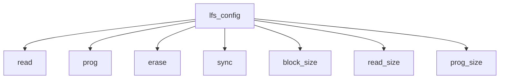
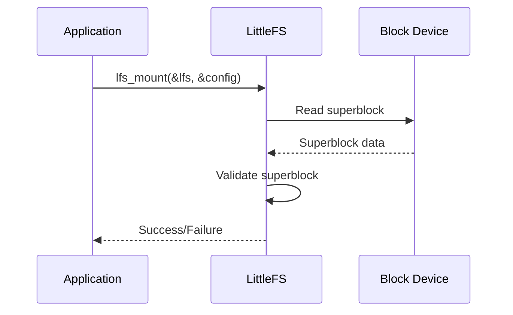

# LittleFS Implementation

<cite>
**Referenced Files in This Document**   
- [lfs.h](file://lib/littlefs/lfs.h)
- [lfs.c](file://lib/littlefs/lfs.c)
- [storage.h](file://applications/services/storage/storage.h)
- [storage_i.h](file://applications/services/storage/storage_i.h)
- [filesystem_api_internal.h](file://applications/services/storage/filesystem_api_internal.h)
- [storage_glue.h](file://applications/services/storage/storage_glue.h)
- [SPEC.md](file://lib/littlefs/SPEC.md)
- [DESIGN.md](file://lib/littlefs/DESIGN.md)
- [lfs_filebd.h](file://lib/littlefs/bd/lfs_filebd.h)
- [lfs_rambd.h](file://lib/littlefs/bd/lfs_rambd.h)
- [lfs_emubd.h](file://lib/littlefs/bd/lfs_emubd.h)
</cite>

## Table of Contents
1. [Introduction](#introduction)
2. [Design Principles of LittleFS](#design-principles-of-littlefs)
3. [Block Device Interface](#block-device-interface)
4. [Cache Management](#cache-management)
5. [Garbage Collection Mechanisms](#garbage-collection-mechanisms)
6. [Initialization and Mounting](#initialization-and-mounting)
7. [Atomic File Operations](#atomic-file-operations)
8. [Relationship with Storage Service](#relationship-with-storage-service)
9. [Error Handling Strategies](#error-handling-strategies)
10. [Filesystem Corruption Recovery](#filesystem-corruption-recovery)
11. [Optimal Block Size Configuration](#optimal-block-size-configuration)
12. [Performance Tuning](#performance-tuning)
13. [Conclusion](#conclusion)

## Introduction
The LittleFS implementation in the Flipper Zero firmware is a wear-leveling, power-resilient file system optimized for microcontrollers. This document provides a comprehensive overview of its design principles, block device interface, cache management, and garbage collection mechanisms. It also includes concrete examples from the codebase showing how to initialize LittleFS, mount file systems, and perform atomic file operations. The relationship between LittleFS and the storage service is explained, along with error handling strategies for flash wear and power failure scenarios. Common issues such as filesystem corruption recovery, optimal block size configuration, and performance tuning for read/write operations are addressed. The content is designed to be accessible to beginners while providing sufficient technical depth for experienced developers regarding the on-disk format and wear-leveling algorithms.

**Section sources**
- [lfs.h](file://lib/littlefs/lfs.h#L1-L743)
- [lfs.c](file://lib/littlefs/lfs.c#L1-L6238)

## Design Principles of LittleFS
LittleFS is designed to be resilient to power loss and flash wear, making it ideal for embedded systems like the Flipper Zero. It achieves this through a combination of wear-leveling and power-resilient mechanisms. The file system is built around the concept of metadata pairs, which are small, two-block logs that allow atomic updates anywhere in the filesystem. These metadata pairs provide redundancy and error detection, ensuring that the file system can recover from power loss during any write operation.

The design of LittleFS is based on the principles of copy-on-write (COW) and logging. At the sub-block level, LittleFS uses small, two-block logs to provide atomic updates to metadata. At the super-block level, it uses a COW tree of blocks that can be evicted on demand. This hybrid approach allows LittleFS to combine the benefits of both logging and COW data structures, providing efficient atomic updates while managing wear across the storage.

**Section sources**
- [DESIGN.md](file://lib/littlefs/DESIGN.md#L1-L2174)
- [SPEC.md](file://lib/littlefs/SPEC.md#L1-L867)

## Block Device Interface
The block device interface in LittleFS is defined by the `lfs_config` structure, which contains function pointers for read, program, erase, and sync operations. These functions are responsible for interacting with the underlying block device, such as flash memory. The `lfs_config` structure also includes parameters for the block size, read size, and program size, which are used to configure the file system for the specific characteristics of the block device.

**Diagram sources**
- [lfs.h](file://lib/littlefs/lfs.h#L158-L265)

## Cache Management
LittleFS uses a cache management system to improve performance by reducing the number of direct block device operations. The cache is implemented using two cache buffers: a read cache and a program cache. The read cache is used to store data read from the block device, while the program cache is used to buffer data that will be written to the block device. The size of these caches is configurable and is specified in the `lfs_config` structure.

The cache management system in LittleFS is designed to be efficient and minimize memory usage. The read cache is used to store data that has been read from the block device, reducing the need to read the same data multiple times. The program cache is used to buffer data that will be written to the block device, allowing multiple small writes to be combined into a single larger write operation.

**Section sources**
- [lfs.h](file://lib/littlefs/lfs.h#L219-L243)
- [lfs.c](file://lib/littlefs/lfs.c#L31-L43)

## Garbage Collection Mechanisms
Garbage collection in LittleFS is performed to reclaim space occupied by outdated or deleted data. The process involves compacting metadata pairs and splitting them when necessary. When a metadata pair becomes full, it is compacted by removing outdated entries and writing the remaining entries to a new block. This process is performed atomically, ensuring that the file system remains consistent even if a power loss occurs during the operation.

If a metadata pair cannot be compacted due to a lack of free space, it is split into two metadata pairs, each containing half of the entries. This splitting process is also performed atomically, ensuring that the file system remains consistent. The split metadata pairs are connected by a tail pointer, forming a linked list of small bounded logs.

**Section sources**
- [DESIGN.md](file://lib/littlefs/DESIGN.md#L405-L457)
- [SPEC.md](file://lib/littlefs/SPEC.md#L135-L186)

## Initialization and Mounting
To initialize and mount a LittleFS file system, the `lfs_mount` function is used. This function takes a pointer to an `lfs_t` structure and a pointer to an `lfs_config` structure. The `lfs_t` structure is used to store the state of the file system, while the `lfs_config` structure contains the configuration parameters for the block device.

**Diagram sources**
- [lfs.h](file://lib/littlefs/lfs.h#L467-L473)
- [lfs.c](file://lib/littlefs/lfs.c#L595-L599)

## Atomic File Operations
LittleFS provides atomic file operations through the use of metadata pairs and the COW mechanism. When a file is written to, a new copy of the file is created with the updated data, and the old copy is marked for deletion. This ensures that the file system remains consistent even if a power loss occurs during the write operation.

Atomic file operations in LittleFS are performed using the `lfs_file_write` and `lfs_file_sync` functions. The `lfs_file_write` function writes data to a file, while the `lfs_file_sync` function ensures that the data is written to the block device and the file system is consistent.

**Section sources**
- [lfs.h](file://lib/littlefs/lfs.h#L596-L605)
- [lfs.c](file://lib/littlefs/lfs.c#L551-L557)

## Relationship with Storage Service
The LittleFS implementation in the Flipper Zero firmware is integrated with the storage service, which provides a higher-level API for working with files and directories. The storage service abstracts the details of the underlying file system, allowing applications to interact with files and directories using a simple and consistent interface.

The storage service in the Flipper Zero firmware is implemented in the `storage.h` and `storage.c` files. It provides functions for opening, reading, writing, and closing files, as well as for creating and removing directories. The storage service also handles error reporting and provides a mechanism for monitoring the status of the file system.

**Section sources**
- [storage.h](file://applications/services/storage/storage.h#L1-L681)
- [storage.c](file://applications/services/storage/storage.c#L1-L867)

## Error Handling Strategies
LittleFS includes several error handling strategies to ensure the reliability and robustness of the file system. These strategies include error detection, error recovery, and error reporting. Error detection is performed using checksums and other mechanisms to detect corruption or other issues with the file system. Error recovery is performed by rolling back to a previous consistent state, ensuring that the file system remains usable even if an error occurs. Error reporting is provided through the storage service, which returns error codes and messages to the application.

In the event of a power loss, LittleFS uses the metadata pairs and the COW mechanism to ensure that the file system remains consistent. The metadata pairs provide redundancy and error detection, while the COW mechanism ensures that updates are atomic and can be rolled back if necessary.

**Section sources**
- [lfs.h](file://lib/littlefs/lfs.h#L69-L87)
- [storage.h](file://applications/services/storage/storage.h#L439-L477)

## Filesystem Corruption Recovery
Filesystem corruption recovery in LittleFS is performed by checking the integrity of the metadata pairs and the superblock. If corruption is detected, the file system can be recovered by rolling back to a previous consistent state. This is achieved by using the metadata pairs and the COW mechanism to ensure that updates are atomic and can be rolled back if necessary.

The recovery process involves reading the superblock and validating its contents. If the superblock is valid, the file system can be mounted and used. If the superblock is invalid, the file system can be reformatted or restored from a backup.

**Section sources**
- [lfs.h](file://lib/littlefs/lfs.h#L448-L456)
- [lfs.c](file://lib/littlefs/lfs.c#L456-L457)

## Optimal Block Size Configuration
The optimal block size configuration for LittleFS depends on the characteristics of the underlying block device and the specific use case. The block size should be chosen to balance the trade-offs between performance, storage efficiency, and wear leveling. A larger block size can improve performance by reducing the number of block device operations, but it can also reduce storage efficiency and increase wear on the block device.

The block size is specified in the `lfs_config` structure and should be a multiple of the read and program sizes. The block size should also be a factor of the total storage size to ensure that the file system can use the entire storage capacity.

**Section sources**
- [lfs.h](file://lib/littlefs/lfs.h#L202-L217)
- [DESIGN.md](file://lib/littlefs/DESIGN.md#L26-L30)

## Performance Tuning
Performance tuning for LittleFS involves optimizing the configuration parameters to achieve the best performance for the specific use case. The key parameters to tune are the block size, read size, program size, and cache size. The block size should be chosen to balance performance and storage efficiency, while the read and program sizes should be chosen to match the characteristics of the block device.

The cache size should be chosen to minimize the number of direct block device operations. A larger cache can improve performance by reducing the number of reads and writes to the block device, but it also increases memory usage. The cache size should be a multiple of the read and program sizes and a factor of the block size.

**Section sources**
- [lfs.h](file://lib/littlefs/lfs.h#L194-L243)
- [DESIGN.md](file://lib/littlefs/DESIGN.md#L26-L30)

## Conclusion
The LittleFS implementation in the Flipper Zero firmware is a robust and efficient file system designed for embedded systems. Its design principles of wear-leveling and power-resilience make it ideal for use in microcontrollers with limited resources. The block device interface, cache management, and garbage collection mechanisms are carefully designed to provide high performance and reliability. The integration with the storage service provides a simple and consistent API for applications to interact with files and directories. Error handling strategies and filesystem corruption recovery mechanisms ensure that the file system remains reliable and robust. By tuning the configuration parameters, developers can optimize the performance of LittleFS for their specific use case.

**Section sources**
- [lfs.h](file://lib/littlefs/lfs.h#L1-L743)
- [lfs.c](file://lib/littlefs/lfs.c#L1-L6238)
- [storage.h](file://applications/services/storage/storage.h#L1-L681)
- [DESIGN.md](file://lib/littlefs/DESIGN.md#L1-L2174)
- [SPEC.md](file://lib/littlefs/SPEC.md#L1-L867)