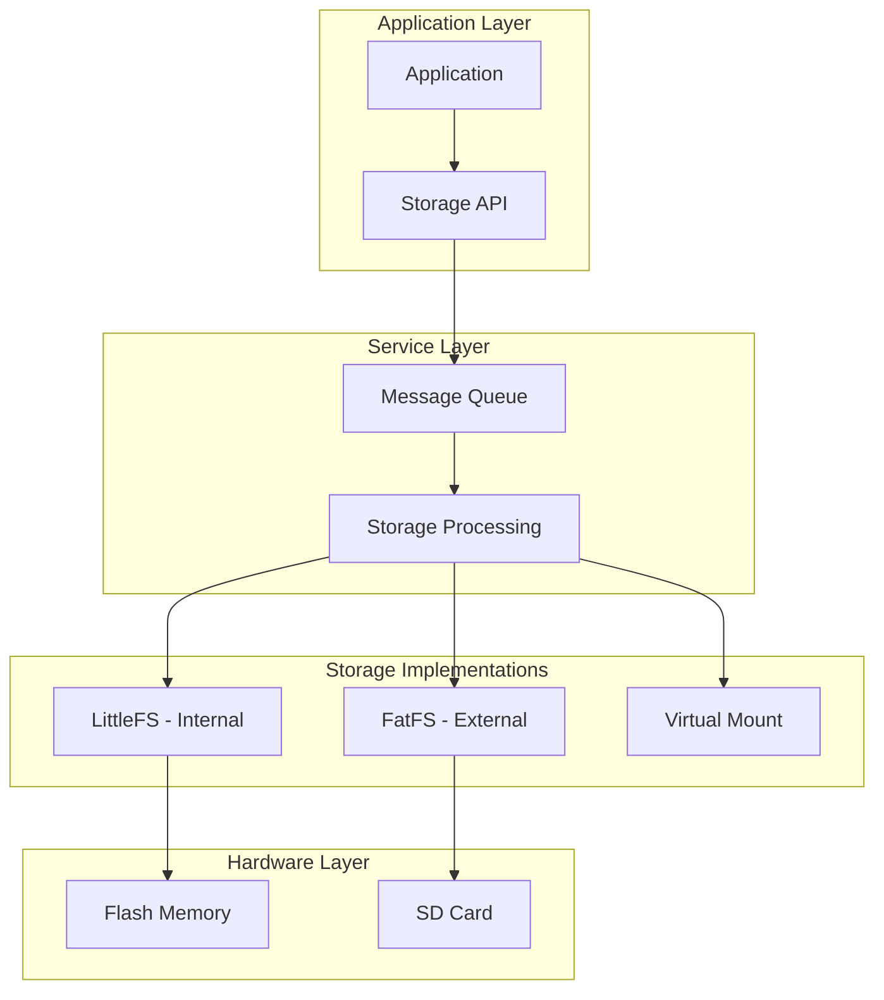
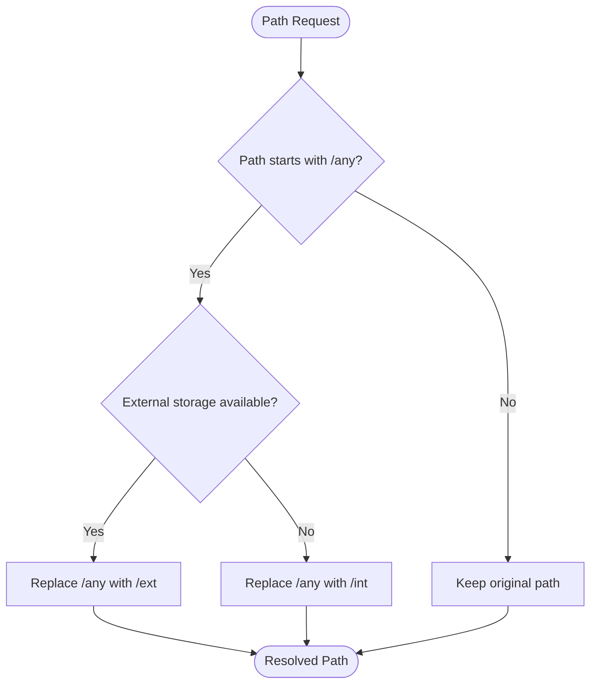
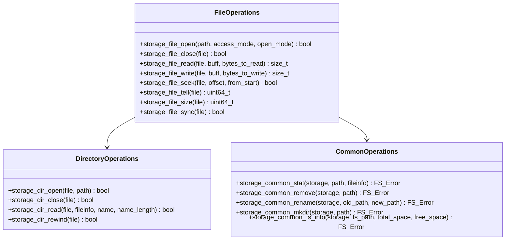
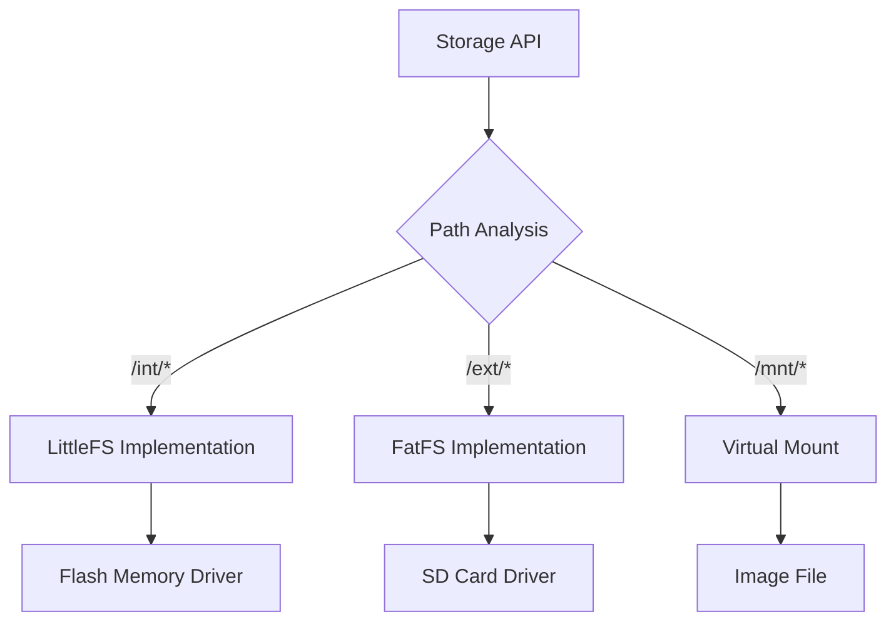
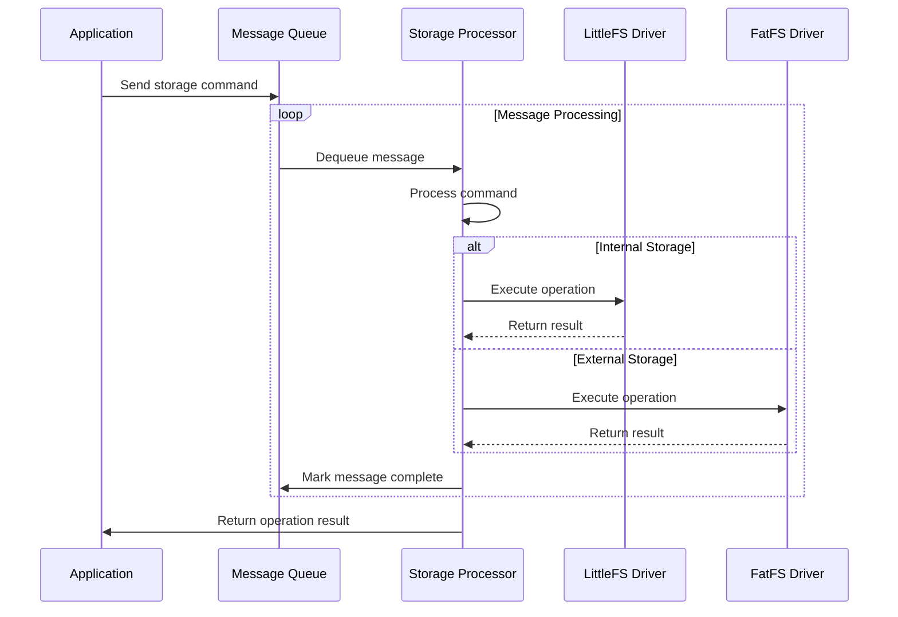
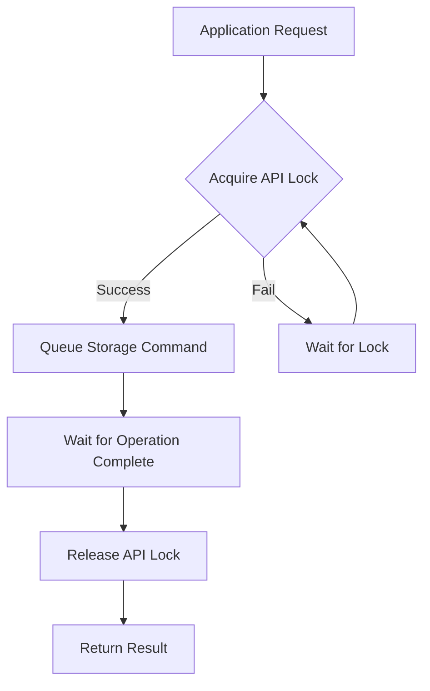
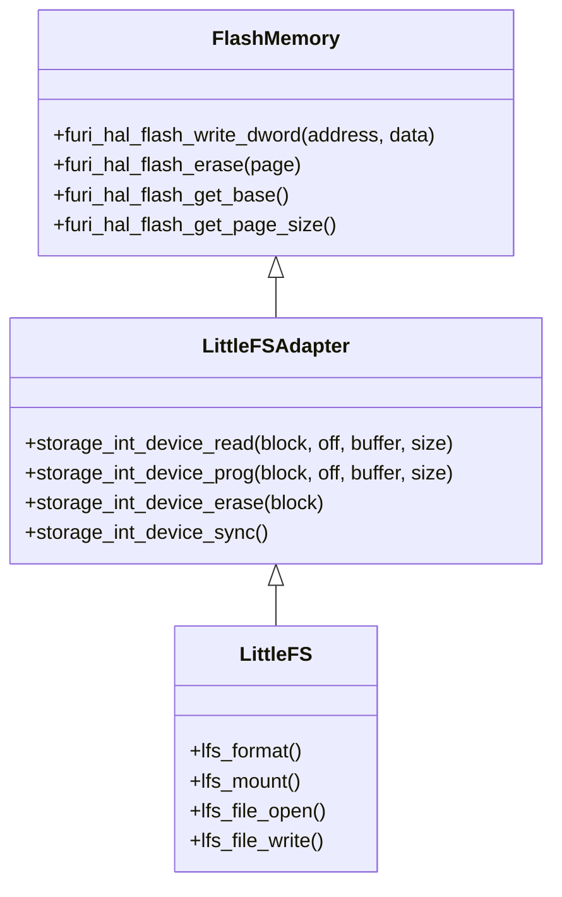
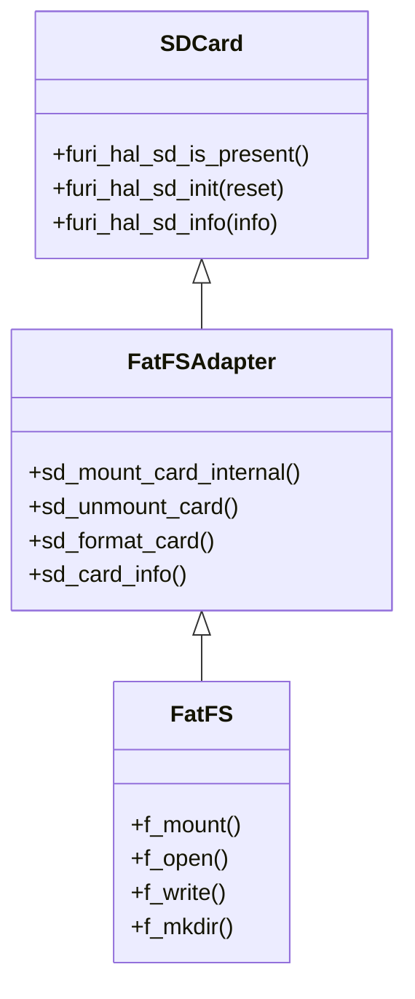

# Storage Service Integration

<cite>
**Referenced Files in This Document**   
- [storage.h](file://applications/services/storage/storage.h)
- [storage_processing.c](file://applications/services/storage/storage_processing.c)
- [filesystem_api_defines.h](file://applications/services/storage/filesystem_api_defines.h)
- [storage_int.c](file://applications/services/storage/storages/storage_int.c)
- [storage_ext.c](file://applications/services/storage/storages/storage_ext.c)
- [storage_message.h](file://applications/services/storage/storage_message.h)
- [storage.c](file://applications/services/storage/storage.c)
- [js_storage.c](file://applications/system/js_app/modules/js_storage.c)
</cite>

## Table of Contents
1. [Introduction](#introduction)
2. [Storage Architecture Overview](#storage-architecture-overview)
3. [Mount Points and Path Translation](#mount-points-and-path-translation)
4. [File System Abstraction Layer](#file-system-abstraction-layer)
5. [Message Queue Architecture](#message-queue-architecture)
6. [Thread Safety and Concurrency](#thread-safety-and-concurrency)
7. [Hardware Integration](#hardware-integration)
8. [Error Handling and Data Integrity](#error-handling-and-data-integrity)
9. [Practical Usage Examples](#practical-usage-examples)
10. [Common Issues and Solutions](#common-issues-and-solutions)

## Introduction

The Storage Service in Flipper Zero firmware provides a unified interface for accessing different file systems, primarily LittleFS for internal storage and FatFS for external SD cards. This service abstracts the underlying file system differences, allowing applications to interact with storage through a consistent API regardless of the physical storage medium. The service handles path translation, access control, and provides mechanisms for ensuring data integrity during operations.

The storage service is designed to be thread-safe and handles concurrent access from multiple applications through a message queue architecture. It also provides integration with hardware drivers for flash memory and SD card interfaces, managing the low-level details of storage access while presenting a clean, high-level API to applications.

**Section sources**
- [storage.h](file://applications/services/storage/storage.h#L1-L681)
- [storage.c](file://applications/services/storage/storage.c#L1-L123)

## Storage Architecture Overview

The Storage Service follows a layered architecture with clear separation between the API layer, processing layer, and storage implementations. At the core is a message queue that handles all storage operations, ensuring thread safety and proper sequencing of operations.



**Diagram sources**
- [storage.h](file://applications/services/storage/storage.h#L1-L681)
- [storage.c](file://applications/services/storage/storage.c#L1-L123)
- [storage_processing.c](file://applications/services/storage/storage_processing.c#L1-L795)

**Section sources**
- [storage.h](file://applications/services/storage/storage.h#L1-L681)
- [storage.c](file://applications/services/storage/storage.c#L1-L123)

## Mount Points and Path Translation

The Storage Service uses specific mount points to distinguish between different storage types:
- `/int` - Internal storage using LittleFS
- `/ext` - External SD card using FatFS
- `/mnt` - Virtual mount point for disk images
- `/any` - Alias that resolves to available storage

The path translation system automatically handles the conversion between these mount points and the actual file system paths. When a path with the `/any` prefix is used, the system resolves it to either `/int` or `/ext` based on availability, with external storage taking precedence when present.



**Diagram sources**
- [storage_processing.c](file://applications/services/storage/storage_processing.c#L1-L795)
- [storage.h](file://applications/services/storage/storage.h#L15-L18)

**Section sources**
- [storage_processing.c](file://applications/services/storage/storage_processing.c#L1-L795)
- [storage.h](file://applications/services/storage/storage.h#L15-L18)

## File System Abstraction Layer

The Storage Service provides a comprehensive abstraction layer that unifies access to both LittleFS and FatFS file systems. This layer presents a consistent API for file operations regardless of the underlying file system implementation.

### Core File Operations

The abstraction layer supports standard file operations through the `filesystem_api_defines.h` interface:



**Diagram sources**
- [storage.h](file://applications/services/storage/storage.h#L82-L280)
- [filesystem_api_defines.h](file://applications/services/storage/filesystem_api_defines.h#L1-L68)

**Section sources**
- [storage.h](file://applications/services/storage/storage.h#L82-L280)
- [filesystem_api_defines.h](file://applications/services/storage/filesystem_api_defines.h#L1-L68)

### File System Specific Implementations

Each file system has its own implementation that adapts to the specific characteristics of the underlying storage:

**LittleFS (Internal Storage)**
- Case-sensitive file system
- Limited write cycles on flash memory
- Reserved space for system operations
- Fingerprint-based integrity checking

**FatFS (External SD Card)**
- Case-insensitive file system
- Standard SD card formatting and management
- Hot-plug detection and automatic mounting
- Comprehensive SD card information retrieval



**Diagram sources**
- [storage_int.c](file://applications/services/storage/storages/storage_int.c#L1-L754)
- [storage_ext.c](file://applications/services/storage/storages/storage_ext.c#L1-L892)

**Section sources**
- [storage_int.c](file://applications/services/storage/storages/storage_int.c#L1-L754)
- [storage_ext.c](file://applications/services/storage/storages/storage_ext.c#L1-L892)

## Message Queue Architecture

The Storage Service employs a message queue architecture to handle all storage operations, ensuring thread safety and proper sequencing of operations. This design prevents race conditions and ensures that storage operations are processed in a controlled manner.



The message queue operates with a fixed size of 8 messages and uses a 1000ms timeout for message retrieval. If no messages are available within this timeout, the service performs periodic maintenance tasks such as checking SD card presence and updating status indicators.

**Diagram sources**
- [storage.c](file://applications/services/storage/storage.c#L37-L123)
- [storage_message.h](file://applications/services/storage/storage_message.h#L1-L192)

**Section sources**
- [storage.c](file://applications/services/storage/storage.c#L37-L123)
- [storage_message.h](file://applications/services/storage/storage_message.h#L1-L192)

## Thread Safety and Concurrency

The Storage Service implements robust thread safety mechanisms to handle concurrent access from multiple applications. The primary mechanism is the message queue architecture, which serializes all storage operations, ensuring that only one operation is processed at a time.

### API Lock Mechanism

The service uses an API lock system to prevent race conditions during operation execution:



Each storage message contains an API lock that must be acquired before the operation can proceed. This ensures that operations are completed atomically and prevents partial updates that could lead to data corruption.

### Concurrent Access Management

The service tracks open files and directories to prevent conflicts:

- Each open file is associated with its storage context
- The system maintains a list of currently open files for each storage type
- Operations on closed files return appropriate error codes
- Directory operations are synchronized to prevent race conditions during enumeration

**Diagram sources**
- [storage_processing.c](file://applications/services/storage/storage_processing.c#L588-L795)
- [storage_message.h](file://applications/services/storage/storage_message.h#L182-L192)

**Section sources**
- [storage_processing.c](file://applications/services/storage/storage_processing.c#L588-L795)
- [storage_message.h](file://applications/services/storage/storage_message.h#L182-L192)

## Hardware Integration

The Storage Service integrates closely with hardware drivers for both internal flash memory and external SD cards, abstracting the low-level details while providing reliable access to storage media.

### Internal Storage (LittleFS)

The internal storage implementation interfaces directly with the flash memory hardware:



The LittleFS adapter translates logical block operations into physical flash memory operations, handling wear leveling and block management transparently.

### External Storage (FatFS)

The external storage implementation interfaces with the SD card hardware through the Furi HAL:



The FatFS adapter handles SD card detection, mounting, and error recovery, providing a stable interface to the FatFS library.

**Diagram sources**
- [storage_int.c](file://applications/services/storage/storages/storage_int.c#L70-L136)
- [storage_ext.c](file://applications/services/storage/storages/storage_ext.c#L28-L134)

**Section sources**
- [storage_int.c](file://applications/services/storage/storages/storage_int.c#L70-L136)
- [storage_ext.c](file://applications/services/storage/storages/storage_ext.c#L28-L134)

## Error Handling and Data Integrity

The Storage Service implements comprehensive error handling and data integrity mechanisms to ensure reliable operation under various conditions.

### Error Classification

The service defines a comprehensive error system with the following categories:

```mermaid
erDiagram
ERROR_TYPES {
int code PK
string description
string category
bool recoverable
}
ERROR_TYPES ||--o{ FSE_OK : "Success"
ERROR_TYPES ||--o{ FSE_NOT_READY : "Not Ready"
ERROR_TYPES ||--o{ FSE_EXIST : "Already Exists"
ERROR_TYPES ||--o{ FSE_NOT_EXIST : "Does Not Exist"
ERROR_TYPES ||--o{ FSE_INVALID_PARAMETER : "Invalid Parameter"
ERROR_TYPES ||--o{ FSE_DENIED : "Access Denied"
ERROR_TYPES ||--o{ FSE_INVALID_NAME : "Invalid Name/Path"
ERROR_TYPES ||--o{ FSE_INTERNAL : "Internal Error"
ERROR_TYPES ||--o{ FSE_NOT_IMPLEMENTED : "Not Implemented"
ERROR_TYPES ||--o{ FSE_ALREADY_OPEN : "Already Open"
}
```

Each error code has a descriptive text that can be retrieved using `storage_error_get_desc()` for debugging and user feedback.

### Data Integrity Mechanisms

The service employs several mechanisms to ensure data integrity:

**LittleFS Integrity**
- RTC-based fingerprint checking to detect file system corruption
- Automatic reformatting when fingerprint mismatch is detected
- Reserved space to prevent write operations when storage is nearly full
- Timestamp tracking for storage modifications

**FatFS Integrity**
- Multiple mount attempt with power cycling on failure
- Comprehensive SD card information retrieval for diagnostics
- Automatic unmount on card removal
- Error recovery procedures for common SD card issues

**Power Cycle Protection**
- Synchronous operations ensure data is written before operation completion
- File synchronization operations flush buffers to persistent storage
- Atomic operations prevent partial updates
- Status tracking ensures proper recovery after unexpected power loss

**Section sources**
- [storage.h](file://applications/services/storage/storage.h#L438-L477)
- [storage_int.c](file://applications/services/storage/storages/storage_int.c#L167-L238)
- [storage_ext.c](file://applications/services/storage/storages/storage_ext.c#L28-L134)

## Practical Usage Examples

The Storage Service provides a consistent API that can be used across different programming contexts, from C applications to JavaScript modules.

### C Application Usage

Applications access the storage service through the Furi record system:

```c
// Open the storage service
Storage* storage = furi_record_open(RECORD_STORAGE);

// Allocate a file handle
File* file = storage_file_alloc(storage);

// Open a file for reading
if(storage_file_open(file, "/int/config.txt", FSAM_READ, FSOM_OPEN_EXISTING)) {
    // Read file contents
    char buffer[256];
    size_t bytes_read = storage_file_read(file, buffer, sizeof(buffer));
    
    // Process data
    // ...
    
    // Close the file
    storage_file_close(file);
}

// Free the file handle
storage_file_free(file);

// Close the storage service
furi_record_close(RECORD_STORAGE);
```

### JavaScript Module Usage

The storage service is also accessible through JavaScript via the JS app:

```javascript
// Create storage instance
const storage = Storage();

// Read a file
const data = storage.read("/int/settings.json");

// Write a file
storage.write("/ext/logs.txt", "Log entry");

// Check if file exists
if (storage.exists("/int/config.txt")) {
    // File operations
}

// Create directory
storage.mkdir("/ext/backups");

// Copy file
storage.copy("/int/data.txt", "/ext/backup.txt");

// Clean up
storage.destroy();
```

### Virtual Mount Usage

The service supports virtual mounting of disk images:

```c
// Open image file
File* image = storage_file_alloc(storage);
storage_file_open(image, "/ext/disk.img", FSAM_READ | FSAM_WRITE, FSOM_OPEN_EXISTING);

// Initialize virtual mount
storage_virtual_init(storage, image);

// Format virtual image
storage_virtual_format(storage);

// Mount to /mnt
storage_virtual_mount(storage);

// Use virtual file system
// Operations on /mnt/* now access the virtual file system

// Unmount and cleanup
storage_virtual_unmount(storage);
storage_virtual_quit(storage);
storage_file_free(image);
```

**Section sources**
- [js_storage.c](file://applications/system/js_app/modules/js_storage.c#L1-L344)
- [storage.h](file://applications/services/storage/storage.h#L41-L49)
- [storage_processing.c](file://applications/services/storage/storage_processing.c#L766-L782)

## Common Issues and Solutions

The Storage Service addresses several common issues related to storage management in embedded systems.

### Full Storage Conditions

When storage is nearly full, the service implements protective measures:

- LittleFS reserves space for critical operations
- Write operations are denied when free space falls below threshold
- Applications receive appropriate error codes (FSE_DENIED)
- Monitoring tools can check available space using `storage_common_fs_info()`

### Concurrent Access Management

The service handles multiple applications accessing storage simultaneously:

- Message queue serializes operations
- File locking prevents conflicts
- Proper error reporting for denied operations
- Applications should handle FSE_ALREADY_OPEN errors gracefully

### Power Cycle Protection

To ensure data integrity during unexpected power loss:

- Use `storage_file_sync()` to force write operations
- Implement proper error checking on all operations
- Use atomic operations when possible
- Regularly backup critical data

### SD Card Reliability

For reliable SD card operation:

- Handle hot-plug events through the PubSub system
- Check card status before operations
- Implement retry logic for transient errors
- Format cards using the standard procedure to ensure compatibility

**Section sources**
- [storage_int.c](file://applications/services/storage/storages/storage_int.c#L283-L295)
- [storage_ext.c](file://applications/services/storage/storages/storage_ext.c#L28-L134)
- [storage.h](file://applications/services/storage/storage.h#L54-L60)
- [storage_processing.c](file://applications/services/storage/storage_processing.c#L464-L485)