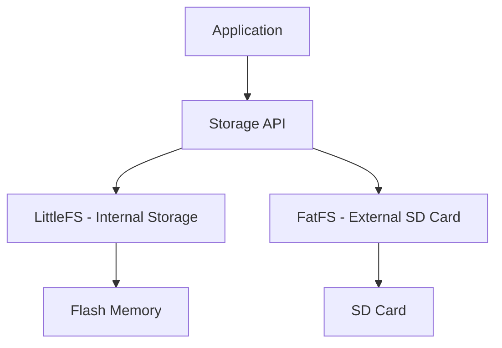
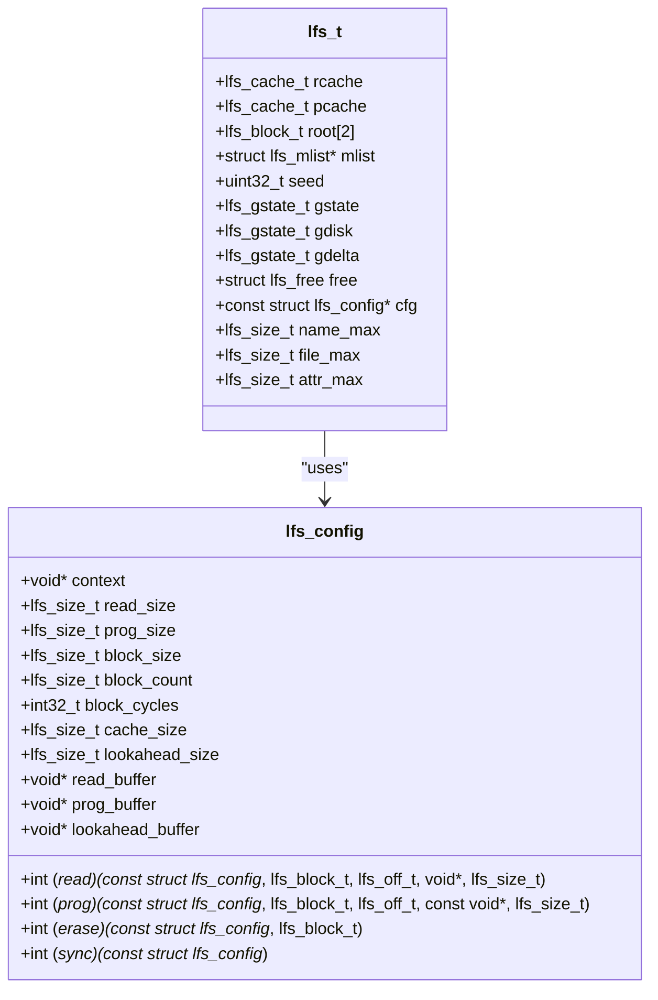
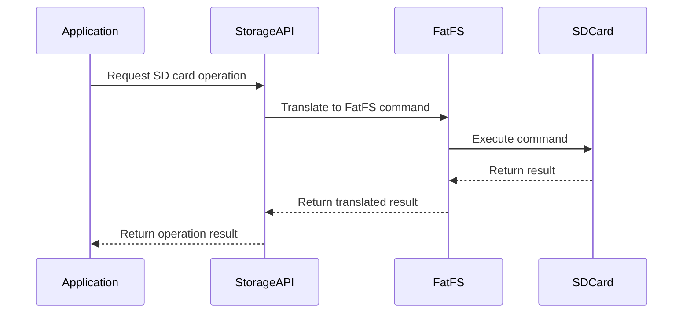
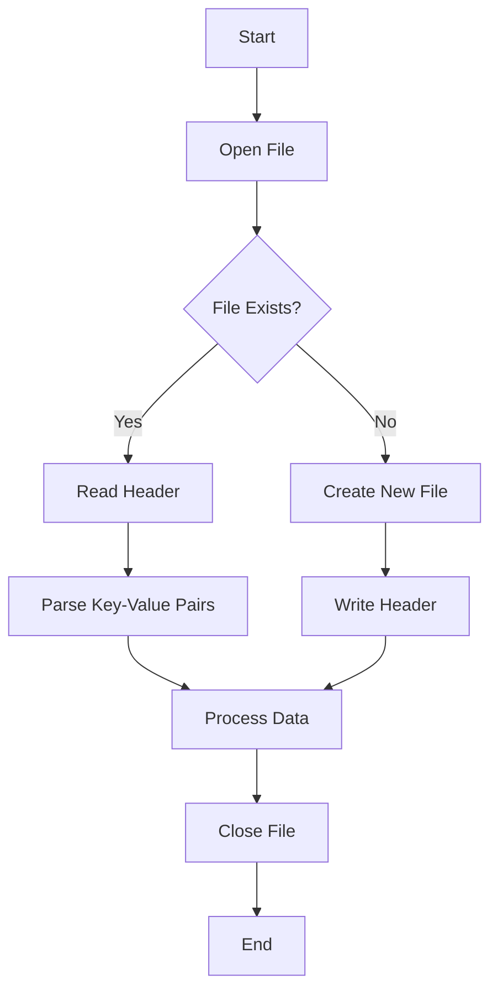
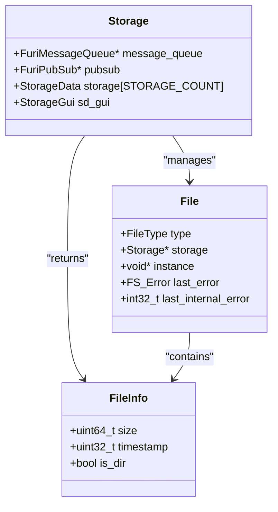
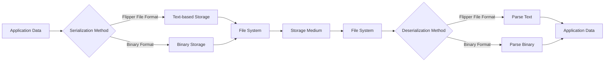
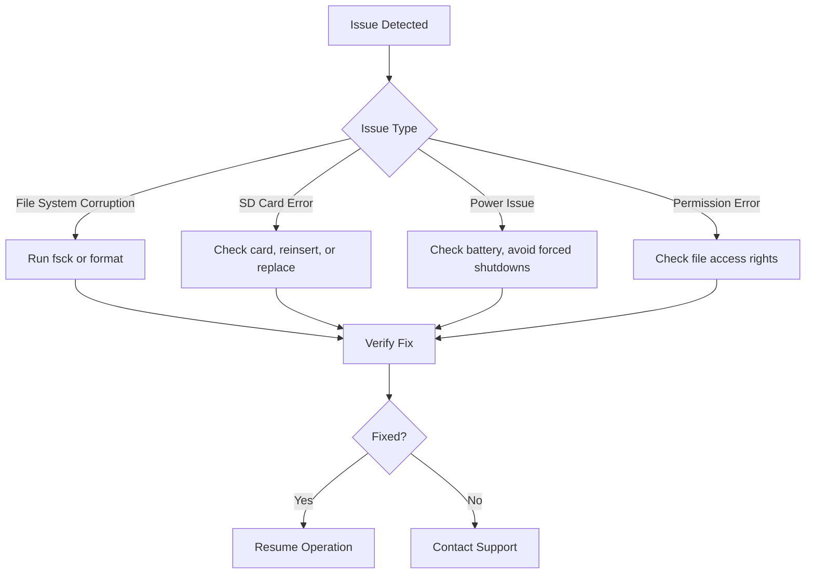
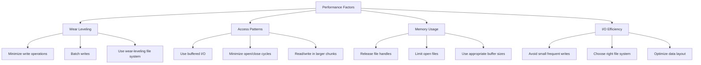
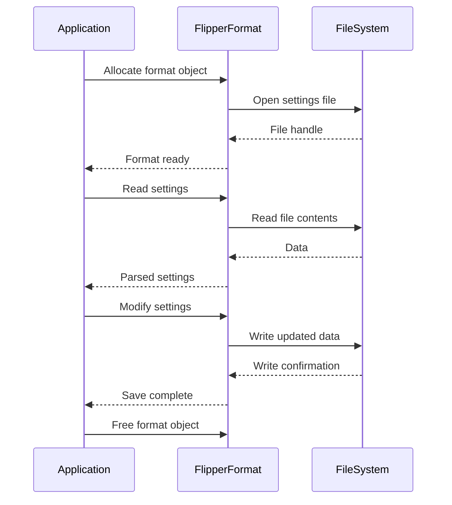
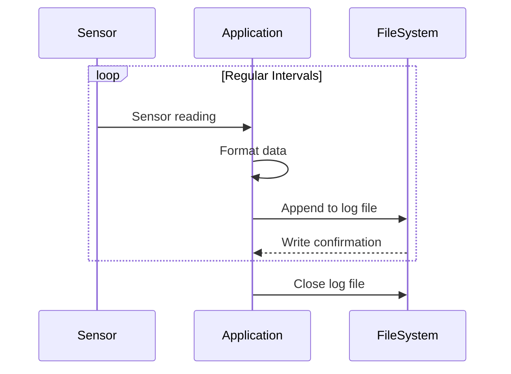

# Storage and Data Management

<cite>
**Referenced Files in This Document**   
- [lfs.h](file://lib/littlefs/lfs.h)
- [fatfs.h](file://targets/f7/fatfs/fatfs.h)
- [flipper_format.h](file://lib/flipper_format/flipper_format.h)
- [flipper_format.c](file://lib/flipper_format/flipper_format.c)
- [storage.h](file://applications/services/storage/storage.h)
- [storage.c](file://applications/services/storage/storage.c)
- [DESIGN.md](file://lib/littlefs/DESIGN.md)
- [SPEC.md](file://lib/littlefs/SPEC.md)
- [example_apps_data.c](file://applications/examples/example_apps_data/example_apps_data.c)
- [can_commander.c](file://applications/external/can_commander_bp/can_commander.c)
- [exporter_csv.c](file://applications/external/canbus/lib/log_exporter/exporter_csv.c)
- [snifferoption.c](file://applications/external/canbus/scenes/snifferoption.c)
</cite>

## Table of Contents
1. [Introduction](#introduction)
2. [Dual File System Architecture](#dual-file-system-architecture)
3. [LittleFS Implementation](#littlefs-implementation)
4. [FatFS Implementation](#fatfs-implementation)
5. [Flipper File Format](#flipper-file-format)
6. [File Operations and Directory Management](#file-operations-and-directory-management)
7. [Data Serialization Methods](#data-serialization-methods)
8. [Common Issues and Solutions](#common-issues-and-solutions)
9. [Performance Considerations](#performance-considerations)
10. [Practical Examples](#practical-examples)
11. [Conclusion](#conclusion)

## Introduction
The Flipper Zero device implements a sophisticated storage and data management system designed to handle various storage needs efficiently and reliably. This document provides a comprehensive overview of the storage architecture, focusing on the dual file system implementation using both LittleFS and FatFS, the Flipper File Format for structured data storage, and practical aspects of file operations, data serialization, and performance optimization.

**Section sources**
- [lfs.h](file://lib/littlefs/lfs.h#L1-L743)
- [fatfs.h](file://targets/f7/fatfs/fatfs.h#L1-L22)
- [flipper_format.h](file://lib/flipper_format/flipper_format.h#L1-L786)

## Dual File System Architecture
The Flipper Zero employs a dual file system architecture, utilizing both LittleFS and FatFS to address different storage requirements. This hybrid approach leverages the strengths of each file system while mitigating their respective weaknesses.

LittleFS is primarily used for the internal flash storage, providing power-loss resilience and wear leveling capabilities essential for embedded systems with limited write cycles. FatFS, on the other hand, is employed for external SD card storage, offering compatibility with standard file systems and supporting larger storage capacities.

The architecture is designed to abstract these differences through a unified storage API, allowing applications to interact with both file systems seamlessly. The storage system automatically routes operations to the appropriate file system based on the path prefix, with "/int" designating internal storage (LittleFS) and "/ext" designating external storage (FatFS).

**Diagram sources**
- [storage.h](file://applications/services/storage/storage.h#L15-L18)
- [lfs.h](file://lib/littlefs/lfs.h#L1-L743)
- [fatfs.h](file://targets/f7/fatfs/fatfs.h#L1-L22)

**Section sources**
- [storage.h](file://applications/services/storage/storage.h#L15-L18)
- [lfs.h](file://lib/littlefs/lfs.h#L1-L743)
- [fatfs.h](file://targets/f7/fatfs/fatfs.h#L1-L22)

## LittleFS Implementation
LittleFS is a lightweight, power-loss resilient file system specifically designed for microcontrollers and embedded systems. In the Flipper Zero implementation, LittleFS manages the internal flash storage, providing reliable data persistence even in the event of unexpected power loss.

The LittleFS implementation in Flipper Zero is configured with specific parameters optimized for the device's flash memory characteristics. The file system uses a block-based approach with dynamic wear leveling to distribute write operations evenly across the flash memory, extending the lifespan of the storage medium.

Key features of the LittleFS implementation include:
- Power-loss resilience through atomic operations
- Dynamic wear leveling to extend flash memory lifespan
- Support for small file sizes and efficient storage utilization
- Robust error detection and recovery mechanisms

The LittleFS configuration in Flipper Zero includes parameters such as block size, cache size, and lookahead buffer size, which are tuned to balance performance, memory usage, and wear leveling effectiveness.

**Diagram sources**
- [lfs.h](file://lib/littlefs/lfs.h#L158-L265)
- [lfs.h](file://lib/littlefs/lfs.h#L410-L443)

**Section sources**
- [lfs.h](file://lib/littlefs/lfs.h#L1-L743)
- [DESIGN.md](file://lib/littlefs/DESIGN.md#L75-L1200)
- [SPEC.md](file://lib/littlefs/SPEC.md#L1-L200)

## FatFS Implementation
FatFS is implemented in the Flipper Zero to manage external SD card storage, providing compatibility with standard file systems used in computers and other devices. This implementation allows users to easily transfer files between the Flipper Zero and other systems using common file management tools.

The FatFS implementation in Flipper Zero is integrated through a virtual file system layer that abstracts the differences between FatFS and LittleFS, providing a consistent API for applications. The system automatically detects and mounts SD cards when inserted, making the storage available to applications.

Key features of the FatFS implementation include:
- Compatibility with standard FAT16/FAT32 file systems
- Support for large file sizes and high-capacity SD cards
- Standard file operations (create, read, write, delete)
- Directory management and file attribute support

The FatFS implementation is initialized during system startup and provides functions for mounting, unmounting, and formatting SD cards. It also includes error handling and recovery mechanisms to deal with potential issues such as corrupted file systems or improperly removed SD cards.

**Diagram sources**
- [fatfs.h](file://targets/f7/fatfs/fatfs.h#L1-L22)
- [storage.h](file://applications/services/storage/storage.h#L478-L599)

**Section sources**
- [fatfs.h](file://targets/f7/fatfs/fatfs.h#L1-L22)
- [storage.h](file://applications/services/storage/storage.h#L478-L599)

## Flipper File Format
The Flipper File Format is a structured data storage format used throughout the Flipper Zero ecosystem for configuration files, application data, and other structured information. This format provides a simple, human-readable way to store key-value pairs with support for various data types.

The format is designed to be both machine-readable and human-editable, making it suitable for configuration files that may need to be modified by users or developers. It supports several data types including strings, integers, floating-point numbers, and hexadecimal values.

Key features of the Flipper File Format include:
- Simple key-value structure with colon separation
- Support for comments (lines starting with #)
- Multiple data types (string, int32, uint32, float, hex)
- Case-sensitive field names
- Flexible value representation

The format is implemented in the `flipper_format` library, which provides functions for reading, writing, and manipulating files in this format. The library handles parsing, serialization, and error checking, making it easy for applications to work with structured data.

**Diagram sources**
- [flipper_format.h](file://lib/flipper_format/flipper_format.h#L1-L85)
- [flipper_format.c](file://lib/flipper_format/flipper_format.c#L1-L195)

**Section sources**
- [flipper_format.h](file://lib/flipper_format/flipper_format.h#L1-L85)
- [flipper_format.c](file://lib/flipper_format/flipper_format.c#L1-L195)

## File Operations and Directory Management
The Flipper Zero provides a comprehensive set of file operations and directory management functions through its storage API. These functions allow applications to create, read, write, and delete files, as well as manage directories and their contents.

File operations are performed using a file handle-based approach, where applications first allocate a file object, open a file, perform operations, and then close and free the file object. This approach ensures proper resource management and error handling.

Key file operations include:
- Opening and closing files with various access modes
- Reading and writing data to files
- Seeking to specific positions within files
- Truncating files to specific sizes
- Checking file existence and properties

Directory management functions allow applications to:
- Create and remove directories
- Open and close directory handles
- Read directory contents (files and subdirectories)
- Check directory existence
- Navigate the directory hierarchy

The storage API also provides simplified functions for common operations, such as recursively removing directories or creating directories with all necessary parent directories.

**Diagram sources**
- [storage.h](file://applications/services/storage/storage.h#L33-L224)
- [storage.h](file://applications/services/storage/storage.h#L225-L246)
- [storage.h](file://applications/services/storage/storage.h#L270-L269)

**Section sources**
- [storage.h](file://applications/services/storage/storage.h#L33-L681)
- [storage.c](file://applications/services/storage/storage.c#L1-L123)

## Data Serialization Methods
The Flipper Zero employs several data serialization methods to store and retrieve structured data efficiently. The primary method is the Flipper File Format, which provides a human-readable, text-based format for configuration and data storage.

For more complex data structures, the system uses binary serialization methods when appropriate, balancing readability with storage efficiency. The choice of serialization method depends on the specific use case, with text-based formats preferred for configuration files and binary formats used for performance-critical data storage.

The Flipper File Format supports several data types that can be serialized:
- Strings: Text values enclosed in quotes or without spaces
- Integers: 32-bit signed integers
- Unsigned integers: 32-bit unsigned integers
- Floating-point numbers: Single-precision floats
- Hexadecimal values: Byte arrays represented as hex pairs

The serialization process involves converting data from its in-memory representation to the appropriate format for storage, while deserialization performs the reverse operation. The flipper_format library handles these conversions automatically, providing a simple API for applications to work with structured data.

**Diagram sources**
- [flipper_format.h](file://lib/flipper_format/flipper_format.h#L1-L85)
- [flipper_format.c](file://lib/flipper_format/flipper_format.c#L195-L394)

**Section sources**
- [flipper_format.h](file://lib/flipper_format/flipper_format.h#L1-L85)
- [flipper_format.c](file://lib/flipper_format/flipper_format.c#L195-L394)

## Common Issues and Solutions
Several common issues can occur with the Flipper Zero's storage system, particularly related to file system corruption, SD card compatibility, and power management. Understanding these issues and their solutions is crucial for maintaining data integrity and device reliability.

File system corruption can occur due to improper shutdowns, power loss during write operations, or hardware issues. The LittleFS implementation includes built-in mechanisms to detect and recover from corruption, but severe cases may require reformatting the storage.

SD card compatibility issues may arise from using cards with incompatible file systems, insufficient power, or physical damage. The system supports standard FAT16/FAT32 formatted SD cards, and users should ensure proper formatting and handling of SD cards.

Power management issues can lead to data loss if the device is powered off during critical operations. The power system includes safeguards to prevent abrupt shutdowns, but users should avoid removing batteries or forcing shutdowns during file operations.

Solutions to common issues include:
- Regularly backing up important data
- Properly ejecting SD cards before removal
- Using high-quality SD cards from reputable manufacturers
- Keeping the device firmware up to date
- Formatting storage when corruption is detected

**Diagram sources**
- [storage.h](file://applications/services/storage/storage.h#L438-L466)
- [lfs.h](file://lib/littlefs/lfs.h#L69-L87)

**Section sources**
- [storage.h](file://applications/services/storage/storage.h#L438-L466)
- [lfs.h](file://lib/littlefs/lfs.h#L69-L87)
- [DESIGN.md](file://lib/littlefs/DESIGN.md#L952-L1236)

## Performance Considerations
Several performance considerations are important when working with the Flipper Zero's storage system, particularly regarding wear leveling on flash storage and efficient data access patterns.

Wear leveling is critical for extending the lifespan of the internal flash storage. The LittleFS implementation uses dynamic wear leveling to distribute write operations across different blocks, preventing premature wear of specific memory cells. Developers should minimize unnecessary write operations and batch writes when possible to reduce wear.

Efficient data access patterns include:
- Using buffered I/O for sequential reads and writes
- Minimizing file opening and closing operations
- Reading or writing data in larger chunks when possible
- Avoiding frequent small writes to the same file
- Using appropriate file system for the use case (LittleFS for internal, FatFS for external)

Memory usage should also be considered, as the file system caches and buffers consume RAM. Applications should release file handles promptly and avoid keeping large numbers of files open simultaneously.

**Diagram sources**
- [lfs.h](file://lib/littlefs/lfs.h#L211-L217)
- [DESIGN.md](file://lib/littlefs/DESIGN.md#L952-L1236)
- [storage.h](file://applications/services/storage/storage.h#L191-L192)

**Section sources**
- [lfs.h](file://lib/littlefs/lfs.h#L211-L217)
- [DESIGN.md](file://lib/littlefs/DESIGN.md#L952-L1236)
- [storage.h](file://applications/services/storage/storage.h#L191-L192)

## Practical Examples
Several practical examples demonstrate common use cases for the Flipper Zero's storage and data management capabilities, including saving application settings and logging sensor data.

For saving application settings, the Flipper File Format is typically used to store configuration data in a human-readable format. Applications can read settings at startup and save modified settings when they change.

For logging sensor data, applications typically use binary or text-based formats depending on the data volume and requirements. High-frequency data logging may use binary formats for efficiency, while lower-frequency logging might use text formats for readability.

These examples illustrate how applications can effectively use the storage system for common tasks while following best practices for data management and performance optimization.

**Diagram sources**
- [example_apps_data.c](file://applications/examples/example_apps_data/example_apps_data.c#L1-L44)
- [snifferoption.c](file://applications/external/canbus/scenes/snifferoption.c#L1-L112)
- [exporter_csv.c](file://applications/external/canbus/lib/log_exporter/exporter_csv.c#L1-L42)

**Section sources**
- [example_apps_data.c](file://applications/examples/example_apps_data/example_apps_data.c#L1-L44)
- [can_commander.c](file://applications/external/can_commander_bp/can_commander.c#L1-L42)
- [exporter_csv.c](file://applications/external/canbus/lib/log_exporter/exporter_csv.c#L1-L42)
- [snifferoption.c](file://applications/external/canbus/scenes/snifferoption.c#L1-L112)

## Conclusion
The Flipper Zero's storage and data management system combines the strengths of LittleFS and FatFS to provide a robust, flexible solution for embedded storage needs. The dual file system architecture allows the device to leverage the power-loss resilience and wear leveling of LittleFS for internal storage while maintaining compatibility with standard file systems through FatFS for external SD cards.

The Flipper File Format provides a simple, human-readable way to store structured data and configuration, making it easy for both applications and users to work with stored information. Comprehensive file operations and directory management functions enable applications to efficiently manage data, while performance considerations such as wear leveling and efficient data access patterns help maintain system reliability and longevity.

By understanding the architecture and capabilities of the storage system, developers can create applications that effectively utilize the available storage resources while ensuring data integrity and optimal performance.