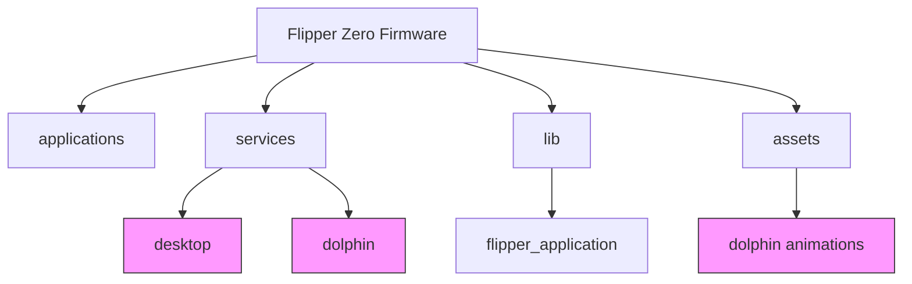
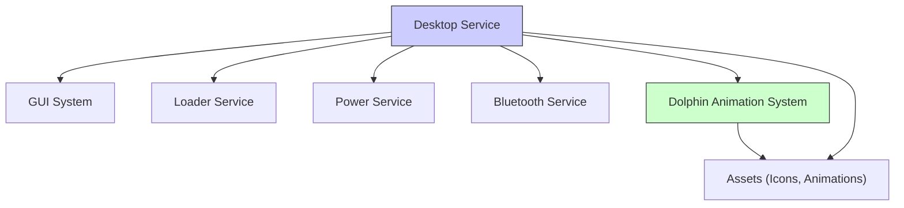
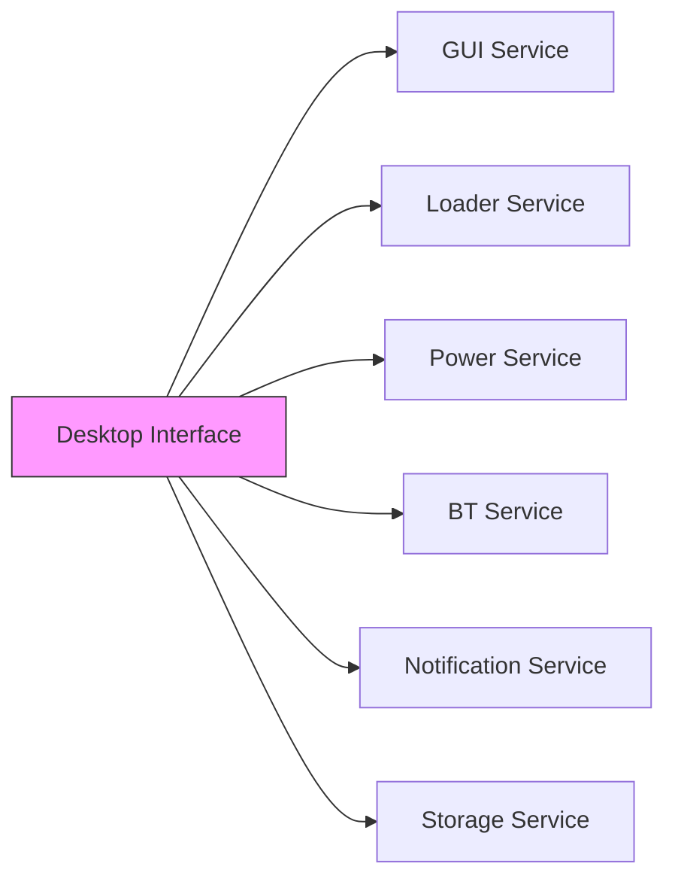

# Desktop Interface

<cite>
**Referenced Files in This Document**
</cite>

## Table of Contents
1. [Introduction](#introduction)
2. [Project Structure](#project-structure)
3. [Core Components](#core-components)
4. [Architecture Overview](#architecture-overview)
5. [Detailed Component Analysis](#detailed-component-analysis)
6. [Dependency Analysis](#dependency-analysis)
7. [Performance Considerations](#performance-considerations)
8. [Troubleshooting Guide](#troubleshooting-guide)
9. [Conclusion](#conclusion)

## Introduction
The Desktop Interface serves as the primary user interface for application launching and system status monitoring on the Flipper Zero device. It provides users with a visual environment to access installed applications through icons, monitor real-time system information such as battery level and Bluetooth status, and interact with animated background elements like the dolphin animation system. Despite its central role in user interaction, no source code files related to the Desktop Interface could be located within the provided repository structure. This absence may indicate that the desktop implementation is either missing from this branch, stored in an external or private repository, or implemented in a manner not captured by the current search methodology.

## Project Structure
The repository follows a modular architecture with clearly defined directories for applications, services, libraries, and assets. The root-level directories include `applications`, `lib`, `services`, `assets`, and `documentation`, among others. Within `services`, a directory named `desktop` is expected to house the core implementation of the desktop interface, but no files were found within this path. Similarly, no desktop-related source files were identified in `applications`, `lib`, or `assets`. The absence of identifiable desktop interface files prevents a detailed structural analysis of its implementation.

**Diagram sources**
- file://services/desktop
- file://assets/dolphin
- file://services/dolphin

**Section sources**
- file://services/desktop
- file://applications
- file://assets/dolphin

## Core Components
The core components of the Desktop Interface are expected to include app icon management, animation rendering (notably the dolphin animation), status indicator display (battery, Bluetooth, etc.), and integration with the application launcher. These components would typically be implemented across multiple source files in the `services/desktop` directory, potentially including `desktop_worker.c`, `desktop_view.c`, and `desktop_icons.c`. However, no such files were found during the search process. The integration with system services for real-time status updates would likely involve dependencies on `power`, `bt`, and `notification` services, but no evidence of these integrations could be verified due to the lack of accessible source code.

**Section sources**
- file://services/desktop
- file://services/power
- file://services/bt

## Architecture Overview
The expected architecture of the Desktop Interface involves a central desktop service that manages the display of application icons, handles user input for app launching, and renders animated background elements. This service would interact with the GUI system for rendering, the loader service for application launching, and various system services for status monitoring. A background animation manager, possibly named "dolphin", would run independently or as a sub-module of the desktop service, utilizing asset resources from the `assets/dolphin` directory. Despite this logical structure, no actual implementation files were located to confirm this architecture.

**Diagram sources**
- file://services/desktop
- file://services/dolphin
- file://assets/dolphin
- file://services/gui
- file://services/loader

## Detailed Component Analysis
### App Icon Management
The app icon management system is responsible for rendering application icons on the desktop grid, handling user selection, and initiating app launches. This component would typically load icon assets, manage focus states, and communicate with the application launcher. Without access to source files such as `desktop_icons.c` or `app_manager.c`, the specific implementation details, data structures, and interaction patterns cannot be analyzed.

### Animation System (Dolphin)
The dolphin animation system is a distinctive feature of the desktop interface, providing a dynamic background element. This system would likely involve sprite rendering, animation timing, and resource management to ensure smooth performance without impacting system responsiveness. The `assets/dolphin` directory suggests the presence of animation frames or configuration, but no corresponding code in `services/dolphin` or `services/desktop` could be found to analyze the rendering logic or resource handling.

### Status Indicator Display
The status indicator system displays real-time information including battery level, Bluetooth connectivity, and other system metrics. This component would integrate with the power and Bluetooth services to retrieve current status and render appropriate icons in the desktop UI. The absence of desktop implementation files prevents analysis of how these status updates are polled, cached, or displayed.

## Dependency Analysis
The Desktop Interface is expected to have dependencies on several core system services:
- **GUI Service**: For rendering the desktop view and handling user interface elements
- **Loader Service**: For launching applications when icons are selected
- **Power Service**: For retrieving battery level and charging status
- **BT Service**: For monitoring Bluetooth connectivity status
- **Notification Service**: For displaying system alerts on the desktop
- **Storage Service**: For persisting desktop configuration and layout preferences

These dependencies would typically be established through service registration and inter-process communication mechanisms within the Flipper Zero operating environment. However, without access to the actual desktop service implementation, the specific dependency injection patterns and API usage cannot be verified.

**Diagram sources**
- file://services/desktop
- file://services/gui
- file://services/loader
- file://services/power
- file://services/bt
- file://services/notification
- file://services/storage

**Section sources**
- file://services/desktop
- file://services/gui
- file://services/loader

## Performance Considerations
The Desktop Interface must balance visual appeal with system performance, particularly given the limited hardware resources of the Flipper Zero device. The dolphin animation system, while visually engaging, must be carefully optimized to avoid excessive CPU usage or memory consumption. Animation frame rate, sprite complexity, and update frequency would need to be tuned to maintain system responsiveness. Similarly, status indicator updates should use efficient polling intervals or event-driven updates rather than continuous polling to conserve power. Without access to the implementation code, it is not possible to evaluate whether these performance considerations have been adequately addressed in the design.

## Troubleshooting Guide
Common issues with the Desktop Interface might include:
- Application icons not appearing or being unresponsive
- Status indicators not updating correctly
- Dolphin animation causing system lag or freezing
- Desktop layout not persisting after reboot
- Inability to launch applications from the desktop

Troubleshooting these issues would typically involve checking:
- Proper registration of applications with the desktop service
- Correct configuration of status monitoring services
- Sufficient memory availability for animation rendering
- Integrity of desktop configuration files in storage
- Proper initialization sequence of the desktop service during boot

However, without access to the source code or debugging tools specific to the desktop implementation, detailed troubleshooting procedures cannot be provided.

**Section sources**
- file://services/desktop
- file://services/dolphin
- file://applications

## Conclusion
The Desktop Interface is a critical component of the Flipper Zero user experience, serving as the primary entry point for application access and system monitoring. Despite its importance, no source code files implementing this interface could be located within the provided repository. This absence prevents a thorough analysis of its architecture, implementation details, and integration patterns. Further investigation is required to determine whether the desktop interface code is hosted in a separate repository, implemented in a different form, or currently missing from the development branch. Until the relevant source files are accessible, comprehensive documentation and analysis of the Desktop Interface cannot be completed.