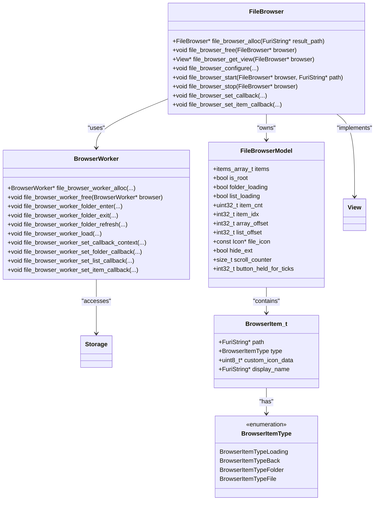
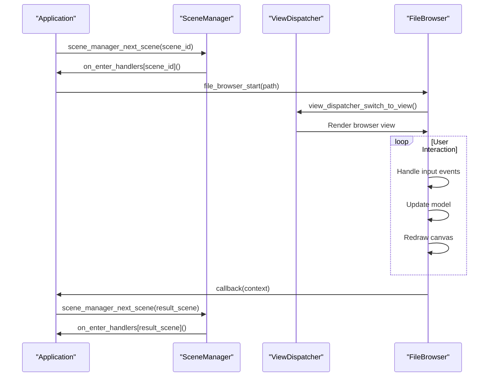
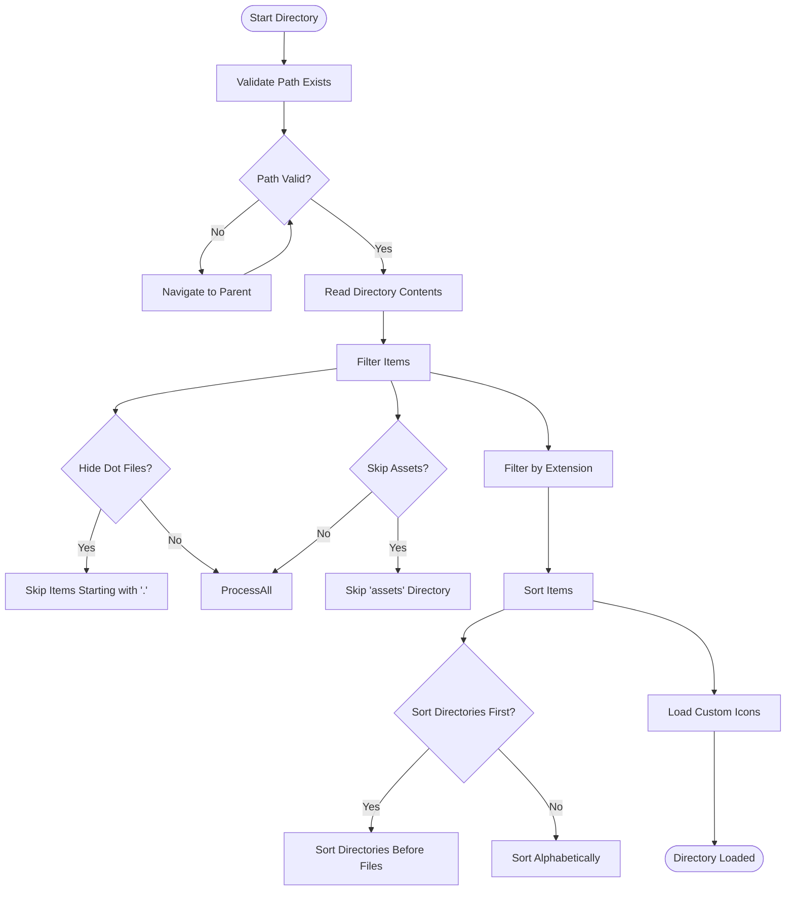
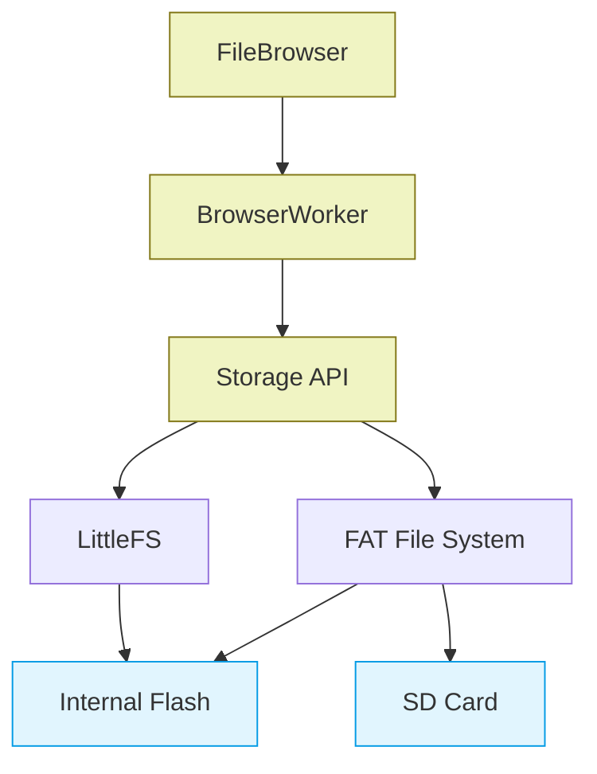
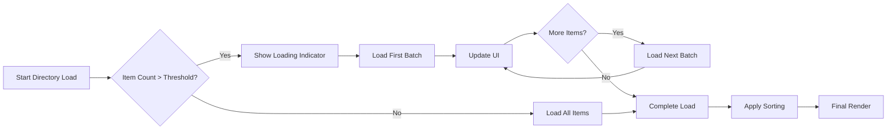

# File Browser

<cite>
**Referenced Files in This Document**   
- [file_browser.h](file://applications/services/gui/modules/file_browser.h#L0-L53)
- [file_browser.c](file://applications/services/gui/modules/file_browser.c#L0-L822)
- [file_browser_worker.h](file://applications/services/gui/modules/file_browser_worker.h#L0-L81)
- [file_browser_worker.c](file://applications/services/gui/modules/file_browser_worker.c#L0-L646)
- [file_browser_app.c](file://applications/debug/file_browser_test/file_browser_app.c#L0-L100)
- [scene_file_browser.c](file://applications/external/subghz_pl_creator/scenes/scene_file_browser.c#L0-L62)
- [dialogs_module_file_browser.c](file://applications/services/dialogs/dialogs_module_file_browser.c#L0-L66)
- [scene_manager.c](file://applications/services/gui/scene_manager.c#L0-L246)
- [scene_browser.c](file://applications/debug/file_browser_test/scenes/file_browser_scene_browser.c#L0-L40)
</cite>

## Table of Contents
1. [Introduction](#introduction)
2. [Core Architecture](#core-architecture)
3. [Scene-Based UI Management](#scene-based-ui-management)
4. [File Browsing Logic and Directory Traversal](#file-browsing-logic-and-directory-traversal)
5. [File Operations and Search Functionality](#file-operations-and-search-functionality)
6. [Integration with Storage Subsystem](#integration-with-storage-subsystem)
7. [Performance Considerations](#performance-considerations)
8. [Extensibility and Customization](#extensibility-and-customization)
9. [Conclusion](#conclusion)

## Introduction

The File Browser is the primary interface for file system navigation within the Flipper Zero firmware ecosystem. It provides a consistent, reusable UI component for browsing files and directories across various applications. The implementation follows a modular design pattern, separating concerns between UI presentation, file system operations, and application integration. This document provides a comprehensive analysis of the file browser's architecture, functionality, and integration patterns, focusing on its role as a central component for file system interaction.

**Section sources**
- [file_browser.h](file://applications/services/gui/modules/file_browser.h#L0-L53)
- [file_browser.c](file://applications/services/gui/modules/file_browser.c#L0-L822)

## Core Architecture

The file browser implements a layered architecture with clear separation between UI components and background file operations. The core structure consists of two main components: the `FileBrowser` module responsible for UI rendering and user interaction, and the `BrowserWorker` handling asynchronous file system operations.



**Diagram sources**
- [file_browser.h](file://applications/services/gui/modules/file_browser.h#L0-L53)
- [file_browser.c](file://applications/services/gui/modules/file_browser.c#L0-L822)
- [file_browser_worker.h](file://applications/services/gui/modules/file_browser_worker.h#L0-L81)

**Section sources**
- [file_browser.h](file://applications/services/gui/modules/file_browser.h#L0-L53)
- [file_browser.c](file://applications/services/gui/modules/file_browser.c#L0-L822)
- [file_browser_worker.h](file://applications/services/gui/modules/file_browser_worker.h#L0-L81)
- [file_browser_worker.c](file://applications/services/gui/modules/file_browser_worker.c#L0-L646)

## Scene-Based UI Management

The file browser integrates with the Flipper Zero's scene-based UI architecture through the SceneManager and ViewDispatcher systems. Applications use scenes to manage navigation between different views, with the file browser serving as one of these views. The scene manager maintains a stack of active scenes, enabling back navigation and state preservation.



The file browser test application demonstrates this integration pattern, where the file browser is added as a view to the view dispatcher and managed through scene transitions. The `file_browser_app_alloc` function initializes the scene manager, view dispatcher, and file browser components, establishing the complete UI framework.

**Diagram sources**
- [scene_manager.c](file://applications/services/gui/scene_manager.c#L0-L246)
- [file_browser_app.c](file://applications/debug/file_browser_test/file_browser_app.c#L0-L100)

**Section sources**
- [scene_manager.c](file://applications/services/gui/scene_manager.c#L0-L246)
- [file_browser_app.c](file://applications/debug/file_browser_test/file_browser_app.c#L0-L100)
- [scene_file_browser.c](file://applications/external/subghz_pl_creator/scenes/scene_file_browser.c#L0-L62)

## File Browsing Logic and Directory Traversal

The file browser implements sophisticated directory traversal logic with support for filtering, sorting, and asynchronous loading. The `BrowserWorker` component handles file system operations in a background thread, preventing UI blocking during directory enumeration. Directory traversal follows a hierarchical pattern, maintaining the current path and enabling navigation through parent directories.



The `browser_folder_check_and_switch` function implements path validation, automatically navigating to parent directories when the requested path no longer exists. This ensures robust navigation even when files are deleted during browsing. The worker thread processes directory contents in chunks, reporting progress through callback mechanisms to enable incremental UI updates.

**Diagram sources**
- [file_browser_worker.c](file://applications/services/gui/modules/file_browser_worker.c#L0-L646)
- [file_browser.c](file://applications/services/gui/modules/file_browser.c#L0-L822)

**Section sources**
- [file_browser_worker.c](file://applications/services/gui/modules/file_browser_worker.c#L0-L646)
- [file_browser.c](file://applications/services/gui/modules/file_browser.c#L0-L822)

## File Operations and Search Functionality

The file browser supports essential file operations including viewing, selecting, and navigating files. While direct operations like delete and rename are not implemented in the core module, the architecture provides extension points for these capabilities. The search functionality is implemented through extension filtering and name-based filtering.

The `file_browser_configure` function allows applications to specify various parameters that control browsing behavior:
- **Extension filtering**: Restrict displayed files to specific extensions
- **Base path**: Set the root directory for browsing
- **Skip assets**: Option to hide asset directories
- **Hide dot files**: Option to hide hidden files (starting with '.')
- **Custom file icon**: Specify icon for file items
- **Hide extension**: Option to hide file extensions in display names

```c
file_browser_configure(
    app->file_browser, 
    "*.txt",           // Show only .txt files
    "/data/documents", // Base path
    false,             // Don't skip assets
    true,              // Hide dot files
    &I_document_10px,  // Custom file icon
    false              // Show extensions
);
```

The file browser in the dialogs module demonstrates how search functionality can be integrated into modal contexts, allowing applications to request file selection with specific criteria. The `dialogs_app_process_module_file_browser` function creates a temporary file browser instance, configures it with search parameters, and returns the selected file path.

**Section sources**
- [file_browser.h](file://applications/services/gui/modules/file_browser.h#L0-L53)
- [file_browser.c](file://applications/services/gui/modules/file_browser.c#L0-L822)
- [dialogs_module_file_browser.c](file://applications/services/dialogs/dialogs_module_file_browser.c#L0-L66)

## Integration with Storage Subsystem

The file browser integrates with the Flipper Zero's storage subsystem through the FuriRecord system, accessing the STORAGE service for file operations. This abstraction allows the file browser to work with both internal storage and SD card locations transparently. The `furi_record_open(RECORD_STORAGE)` pattern is used to obtain a storage interface pointer, which is then used for all file system operations.



The worker thread performs all storage operations, including directory opening, file enumeration, and file information retrieval. This asynchronous design prevents UI freezing during potentially slow operations, especially when accessing SD cards. The `storage_dir_open` and `storage_dir_read` functions are used to enumerate directory contents, while `storage_common_stat` provides file metadata for determining file types and sizes.

**Diagram sources**
- [file_browser_worker.c](file://applications/services/gui/modules/file_browser_worker.c#L0-L646)
- [file_browser.c](file://applications/services/gui/modules/file_browser.c#L0-L822)

**Section sources**
- [file_browser_worker.c](file://applications/services/gui/modules/file_browser_worker.c#L0-L646)
- [file_browser.c](file://applications/services/gui/modules/file_browser.c#L0-L822)

## Performance Considerations

The file browser implementation includes several performance optimizations for operation in memory-constrained environments:

1. **Asynchronous operations**: File system operations run in a separate thread to prevent UI blocking
2. **Incremental loading**: Directory contents are loaded in chunks to minimize memory usage
3. **Lazy icon loading**: Custom icons are loaded only when needed for visible items
4. **String optimization**: FuriString objects are used for efficient string handling
5. **Memory pooling**: The m-array library provides efficient dynamic array management

The `SCROLL_INTERVAL` (333ms) and `SCROLL_DELAY` (2) constants control the scroll animation timing, balancing visual feedback with CPU usage. The `BROWSER_SORT_THRESHOLD` (220) determines when to apply sorting optimizations for large directories.

For large directories, the worker thread processes items in batches, reporting progress through the `BrowserWorkerListLoadCallback`. This allows the UI to display partial results quickly while continuing to load additional items. The `LONG_LOAD_THRESHOLD` (100) triggers a long load callback for operations that may take significant time, allowing the UI to display appropriate feedback.



**Diagram sources**
- [file_browser.c](file://applications/services/gui/modules/file_browser.c#L0-L822)
- [file_browser_worker.c](file://applications/services/gui/modules/file_browser_worker.c#L0-L646)

**Section sources**
- [file_browser.c](file://applications/services/gui/modules/file_browser.c#L0-L822)
- [file_browser_worker.c](file://applications/services/gui/modules/file_browser_worker.c#L0-L646)

## Extensibility and Customization

The file browser is designed to be highly extensible, with multiple callback mechanisms allowing applications to customize behavior:

- **FileBrowserCallback**: Called when a file is selected
- **FileBrowserLoadItemCallback**: Allows custom icon and display name loading
- **Various worker callbacks**: For monitoring worker thread progress

Applications can extend the file browser by implementing custom item callbacks that provide specialized icons or modify display names based on file content. The `file_icon` parameter in `file_browser_configure` allows setting a default icon for all files, while the item callback can override this on a per-item basis.

The subghz_pl_creator application demonstrates how to integrate the file browser with custom selection logic:

```c
void scene_file_browser_select(
    SubGhzPlaylistCreator* app,
    const char* start_dir,
    const char* extension,
    SceneFileBrowserSelectCallback on_select) {
    app->file_browser_select_cb = on_select;
    furi_string_set(app->file_browser_result, start_dir);
    file_browser_configure(
        app->file_browser,
        extension,
        start_dir,
        false, // skip_assets
        true, // hide_dot_files
        NULL, // file_icon
        false // hide_ext
    );
    file_browser_set_callback(app->file_browser, file_browser_scene_callback, app);
    file_browser_start(app->file_browser, app->file_browser_result);
}
```

This pattern allows applications to wrap the file browser with custom navigation logic and callback handling, making it adaptable to various use cases while maintaining a consistent user experience.

**Section sources**
- [scene_file_browser.c](file://applications/external/subghz_pl_creator/scenes/scene_file_browser.c#L0-L62)
- [file_browser.h](file://applications/services/gui/modules/file_browser.h#L0-L53)
- [file_browser.c](file://applications/services/gui/modules/file_browser.c#L0-L822)

## Conclusion

The File Browser component provides a robust, reusable solution for file system navigation within the Flipper Zero ecosystem. Its modular architecture separates UI concerns from file system operations, enabling efficient, non-blocking interaction with storage. The integration with the scene-based UI framework allows consistent navigation patterns across applications, while the callback-based design supports extensive customization. Performance optimizations ensure responsive operation even with large directories or slow storage media. The file browser serves as a critical infrastructure component, enabling various applications to provide file selection and navigation capabilities with minimal implementation effort.