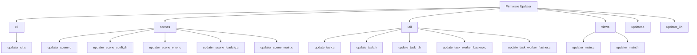
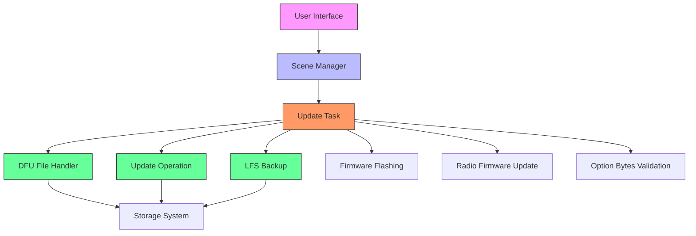
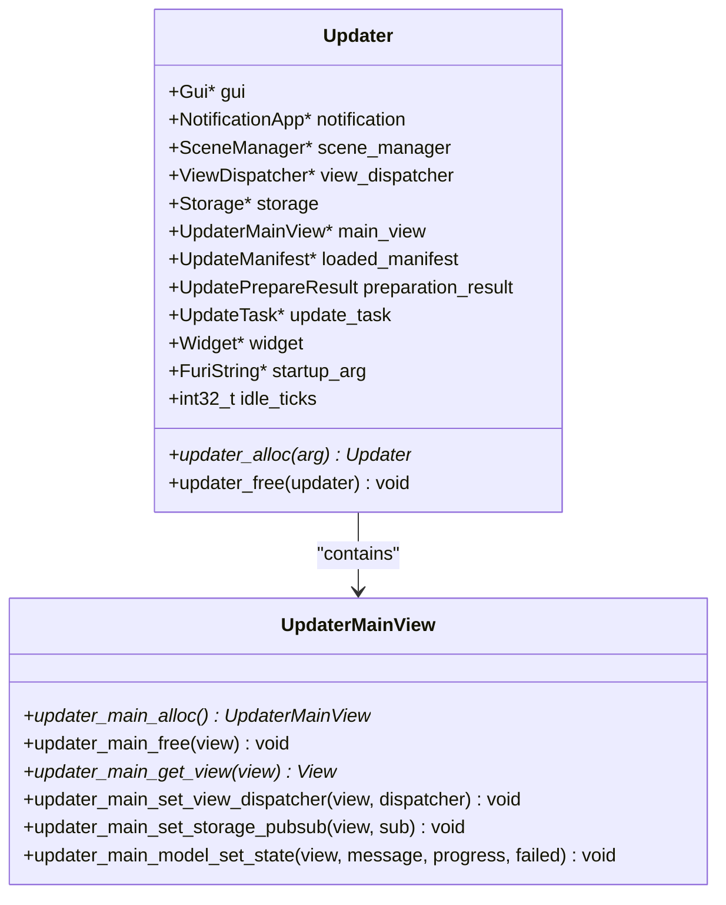
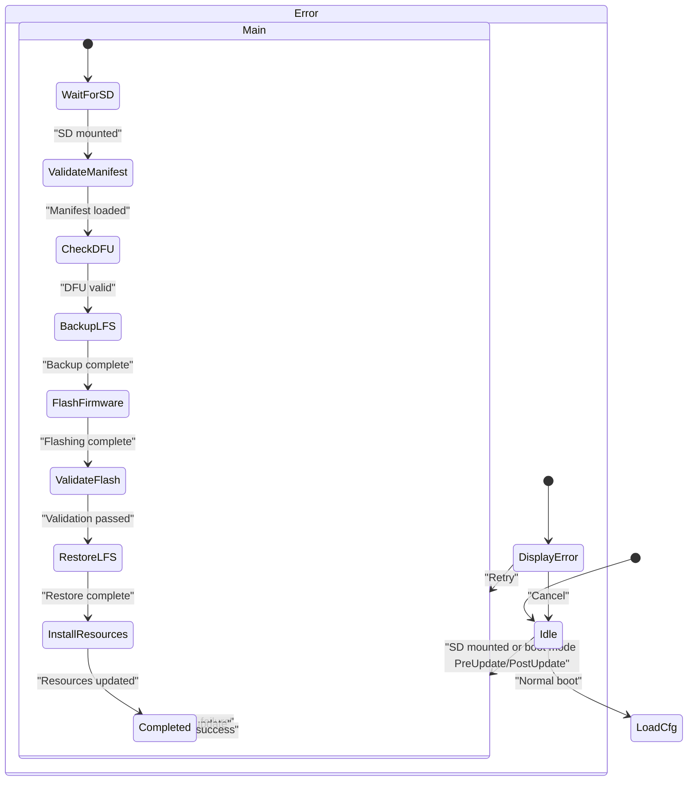

# Firmware Updater

<cite>
**Referenced Files in This Document**   
- [updater.c](file://applications/system/updater/updater.c)
- [updater_i.h](file://applications/system/updater/updater_i.h)
- [updater_scene.c](file://applications/system/updater/scenes/updater_scene.c)
- [updater_scene_config.h](file://applications/system/updater/scenes/updater_scene_config.h)
- [updater_scene_main.c](file://applications/system/updater/scenes/updater_scene_main.c)
- [update_task.c](file://applications/system/updater/util/update_task.c)
- [update_task.h](file://applications/system/updater/util/update_task.h)
- [dfu_file.c](file://lib/update_util/dfu_file.c)
- [dfu_file.h](file://lib/update_util/dfu_file.h)
- [update_operation.c](file://lib/update_util/update_operation.c)
- [update_operation.h](file://lib/update_util/update_operation.h)
- [lfs_backup.c](file://lib/update_util/lfs_backup.c)
- [lfs_backup.h](file://lib/update_util/lfs_backup.h)
</cite>

## Table of Contents
1. [Introduction](#introduction)
2. [Project Structure](#project-structure)
3. [Core Components](#core-components)
4. [Architecture Overview](#architecture-overview)
5. [Detailed Component Analysis](#detailed-component-analysis)
6. [Update Process Flow](#update-process-flow)
7. [Recovery Mode and Rollback Mechanisms](#recovery-mode-and-rollback-mechanisms)
8. [Security Considerations](#security-considerations)
9. [Error Handling and Troubleshooting](#error-handling-and-troubleshooting)
10. [Integration with Bootloader and Partition Management](#integration-with-bootloader-and-partition-management)

## Introduction

The Firmware Updater application is a critical system component responsible for managing device firmware updates and recovery operations. This document provides a comprehensive analysis of the updater's architecture, functionality, and implementation details. The updater enables users to safely update their device firmware while implementing robust safeguards against bricking and data loss. It handles the complete update lifecycle from DFU file validation through flashing procedures to post-update verification.

The system is designed with safety as a primary concern, incorporating multiple validation steps, backup mechanisms, and rollback capabilities. The updater integrates closely with the bootloader and partition management system to ensure reliable firmware updates even in the event of power failures or other interruptions.

**Section sources**
- [updater.c](file://applications/system/updater/updater.c#L0-L128)
- [updater_i.h](file://applications/system/updater/updater_i.h#L0-L61)

## Project Structure

The Firmware Updater is organized within the system applications directory with a clear separation of concerns. The component is located at `applications/system/updater/` and follows a modular architecture with distinct directories for different functional aspects.



**Diagram sources**
- [updater.c](file://applications/system/updater/updater.c#L0-L128)
- [updater_scene_config.h](file://applications/system/updater/scenes/updater_scene_config.h#L0-L5)

**Section sources**
- [updater.c](file://applications/system/updater/updater.c#L0-L128)
- [updater_scene_config.h](file://applications/system/updater/scenes/updater_scene_config.h#L0-L5)

## Core Components

The Firmware Updater consists of several core components that work together to manage the update process. The main components include the updater application controller, scene manager, update task processor, and various utility functions for DFU file handling and system operations.

The `Updater` structure defined in `updater_i.h` serves as the central data structure, containing references to GUI components, storage, notification services, and the update task. This structure maintains the application state throughout the update process.

```c
typedef struct {
    // GUI
    Gui* gui;
    NotificationApp* notification;
    SceneManager* scene_manager;
    ViewDispatcher* view_dispatcher;
    Storage* storage;

    UpdaterMainView* main_view;

    UpdateManifest* loaded_manifest;
    UpdatePrepareResult preparation_result;

    UpdateTask* update_task;
    Widget* widget;
    FuriString* startup_arg;
    int32_t idle_ticks;
} Updater;
```

The update process is managed through a state machine implemented with the scene manager, which handles transitions between different phases of the update process. The system uses custom events to coordinate between components and respond to external triggers such as SD card mounting.

**Section sources**
- [updater_i.h](file://applications/system/updater/updater_i.h#L0-L61)
- [updater.c](file://applications/system/updater/updater.c#L0-L128)

## Architecture Overview

The Firmware Updater follows a layered architecture with clear separation between presentation, control, and data processing layers. The system uses a scene-based navigation model to manage the user interface flow during the update process.



The architecture implements a robust error handling system with multiple safeguards to prevent bricking the device during failed updates. The update process is divided into discrete stages, each with its own validation and progress tracking.

**Diagram sources**
- [updater.c](file://applications/system/updater/updater.c#L0-L128)
- [update_task.c](file://applications/system/updater/util/update_task.c#L0-L199)
- [dfu_file.c](file://lib/update_util/dfu_file.c#L0-L155)

## Detailed Component Analysis

### Updater Application Controller

The updater application controller, implemented in `updater.c`, is responsible for initializing the update system and managing the overall application lifecycle. The `updater_alloc` function creates and configures the updater instance, setting up event callbacks for custom events, navigation, and tick events.



**Diagram sources**
- [updater.c](file://applications/system/updater/updater.c#L0-L128)
- [updater_i.h](file://applications/system/updater/updater_i.h#L0-L61)

**Section sources**
- [updater.c](file://applications/system/updater/updater.c#L0-L128)
- [updater_i.h](file://applications/system/updater/updater_i.h#L0-L61)

### Scene Management System

The scene management system implements a state machine that controls the flow of the update process. The system uses three primary scenes: main, loadcfg, and error (the latter two are excluded in RAM execution mode).



The scene transitions are defined in `updater_scene_config.h` and implemented through the scene manager pattern. Each scene has on_enter, on_event, and on_exit handlers that manage the specific behavior for that state.

**Diagram sources**
- [updater_scene.c](file://applications/system/updater/scenes/updater_scene.c#L0-L30)
- [updater_scene_config.h](file://applications/system/updater/scenes/updater_scene_config.h#L0-L5)
- [updater_scene_main.c](file://applications/system/updater/scenes/updater_scene_main.c#L0-L101)

**Section sources**
- [updater_scene.c](file://applications/system/updater/scenes/updater_scene.c#L0-L30)
- [updater_scene_config.h](file://applications/system/updater/scenes/updater_scene_config.h#L0-L5)
- [updater_scene_main.c](file://applications/system/updater/scenes/updater_scene_main.c#L0-L101)

## Update Process Flow

The update process follows a well-defined sequence of stages, each with specific validation and progress tracking. The process is managed by the `UpdateTask` component, which coordinates the various operations required for a successful firmware update.

```mermaid
flowchart TD
A[Start Update] --> B[Read Manifest]
B --> C[Validate DFU Image]
C --> D[Backup LFS]
D --> E[Flash Firmware]
E --> F[Validate Flash]
F --> G[Update Radio Firmware]
G --> H[Validate Option Bytes]
H --> I[Restore LFS]
I --> J[Update Resources]
J --> K[Install Splashscreen]
K --> L[Complete Update]
style A fill:#f9f,stroke:#333
style L fill:#9f9,stroke:#333
B --> M[Error] : "Invalid manifest"
C --> M : "DFU validation failed"
D --> M : "Backup failed"
E --> M : "Flashing failed"
F --> M : "Validation failed"
G --> M : "Radio update failed"
H --> M : "Option bytes invalid"
I --> M : "Restore failed"
J --> M : "Resource update failed"
M --> N[Display Error]
N --> O[Retry or Cancel]
```

The `update_task_stage_descr` array in `update_task.c` defines the human-readable descriptions for each stage of the update process, providing clear feedback to the user about the current operation.

**Diagram sources**
- [update_task.c](file://applications/system/updater/util/update_task.c#L0-L199)
- [update_task.h](file://applications/system/updater/util/update_task.h#L0-L88)

**Section sources**
- [update_task.c](file://applications/system/updater/util/update_task.c#L0-L199)
- [update_task.h](file://applications/system/updater/util/update_task.h#L0-L88)

## Recovery Mode and Rollback Mechanisms

The Firmware Updater implements robust recovery mechanisms to handle failed updates and prevent the device from becoming unusable. The system uses the RTC boot mode to track the update state and can automatically enter recovery mode when necessary.

The recovery process begins with the validation of the update manifest, which includes checks for hardware target compatibility, package version, and required files. If any validation fails, the update is aborted and the user is notified of the specific error.

```c
UpdatePrepareResult update_operation_prepare(const char* manifest_file_path) {
    // Check available space
    // Validate manifest file exists
    // Parse and validate manifest contents
    // Verify staged loader integrity
    // Persist manifest path for recovery
    // Return result code
}
```

The system implements a rollback mechanism through the use of backup files and the ability to disarm pending updates. The `update_operation_disarm()` function can cancel a pending update operation, allowing the device to boot with the previous firmware.

**Section sources**
- [update_operation.c](file://lib/update_util/update_operation.c#L0-L199)
- [update_operation.h](file://lib/update_util/update_operation.h#L0-L68)

## Security Considerations

The Firmware Updater incorporates several security measures to ensure the integrity and authenticity of firmware updates. The system validates DFU files using CRC checks and verifies that the firmware is compatible with the device's hardware target.

DFU file validation includes:
- Checking the DFU signature ("DfuSe")
- Validating the file version and size
- Verifying the vendor, product, and device IDs
- Confirming the embedded CRC matches the expected value

```c
bool dfu_file_validate_crc(File* dfuf, const DfuPageTaskProgressCb progress_cb, void* context) {
    uint32_t file_crc = crc32_calc_file(dfuf, progress_cb, context);
    return file_crc == VALID_WHOLE_FILE_CRC;
}
```

The system also validates the update manifest to ensure it comes from a trusted source and matches the expected format. The manifest validation includes checking the manifest version, target hardware, and integrity of the staged loader.

**Section sources**
- [dfu_file.c](file://lib/update_util/dfu_file.c#L0-L155)
- [dfu_file.h](file://lib/update_util/dfu_file.h#L0-L40)
- [update_operation.c](file://lib/update_util/update_operation.c#L0-L199)

## Error Handling and Troubleshooting

The Firmware Updater implements comprehensive error handling with detailed error codes and user-friendly messages. The system categorizes errors by stage and provides specific error details to aid in troubleshooting.

The `update_task_error_detail` structure maps specific error conditions to human-readable descriptions, allowing users to understand the nature of the failure:

```c
static const struct {
    UpdateTaskStage stage;
    uint8_t percent_min, percent_max;
    const char* descr;
} update_task_error_detail[] = {
    {
        .stage = UpdateTaskStageReadManifest,
        .percent_min = 0,
        .percent_max = 13,
        .descr = "Wrong Updater HW",
    },
    // Additional error mappings
};
```

Common update issues and their solutions include:
- **SD card not detected**: Ensure the SD card is properly inserted and formatted
- **Manifest load error**: Verify the update package is complete and not corrupted
- **DFU file CRC mismatch**: Redownload the firmware image
- **Flash write error**: The device may have a hardware issue; contact support
- **LFS I/O error**: File system may be corrupted; try formatting the internal storage

The system also implements a timeout mechanism to detect stalled operations and automatically cancel them to prevent the device from hanging indefinitely.

**Section sources**
- [update_task.c](file://applications/system/updater/util/update_task.c#L0-L199)
- [update_operation.c](file://lib/update_util/update_operation.c#L0-L199)

## Integration with Bootloader and Partition Management

The Firmware Updater integrates closely with the bootloader and partition management system to ensure reliable firmware updates. The system uses the RTC registers to communicate with the bootloader and coordinate the update process.

The update operation prepares the system for flashing by:
1. Validating the update manifest and staged loader
2. Setting RTC registers to indicate an update is pending
3. Rebooting into the staged loader for firmware flashing

```c
bool update_operation_prepare(const char* manifest_file_path) {
    // ... validation steps ...
    
    // Persist manifest path for recovery
    if(!update_operation_persist_manifest_path(storage, manifest_file_path)) {
        result = UpdatePrepareResultManifestPointerCreateError;
        break;
    }
    
    // Additional preparation
}
```

The partition management system handles the backup and restoration of the LittleFS file system during updates. The `lfs_backup_create` and `lfs_backup_unpack` functions manage the creation and extraction of file system backups to prevent data loss during the update process.

```c
bool lfs_backup_create(Storage* storage, const char* destination) {
    const char* final_destination =
        destination && strlen(destination) ? destination : LFS_BACKUP_DEFAULT_LOCATION;
    return storage_int_backup(storage, final_destination) == FSE_OK;
}
```

This integration ensures that the device can recover from failed updates and maintain data integrity throughout the update process.

**Section sources**
- [update_operation.c](file://lib/update_util/update_operation.c#L0-L199)
- [lfs_backup.c](file://lib/update_util/lfs_backup.c#L0-L41)
- [updater.c](file://applications/system/updater/updater.c#L0-L128)