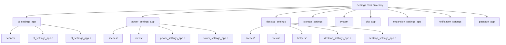
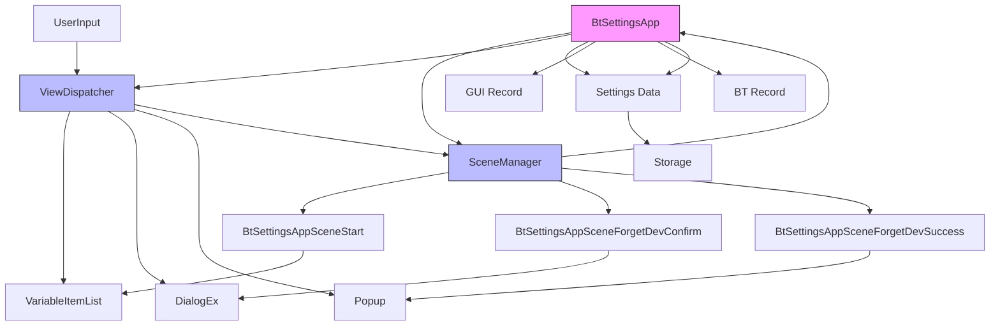
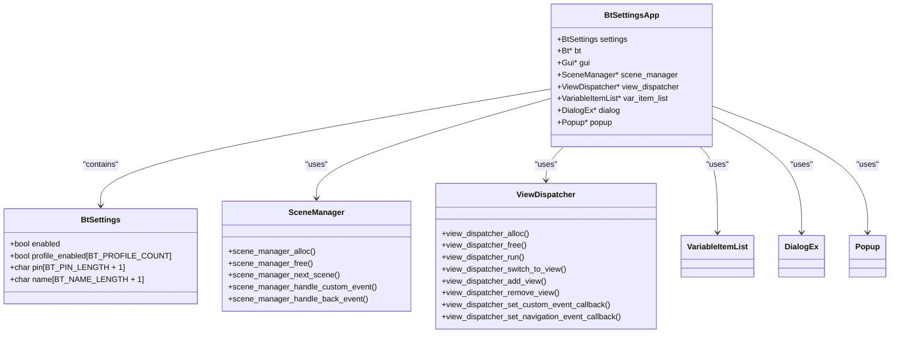
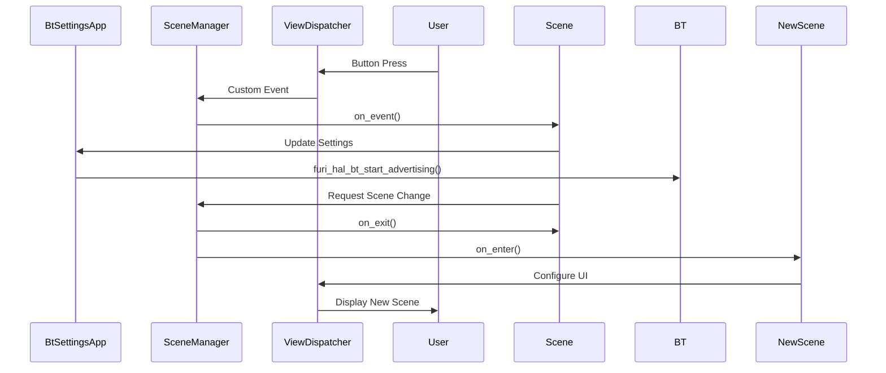
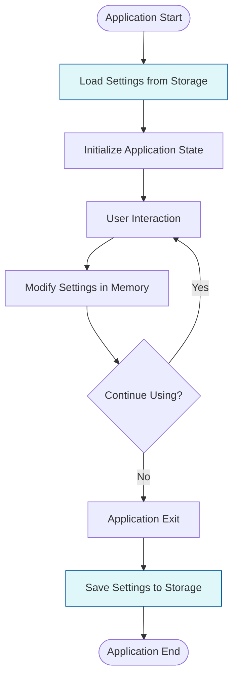
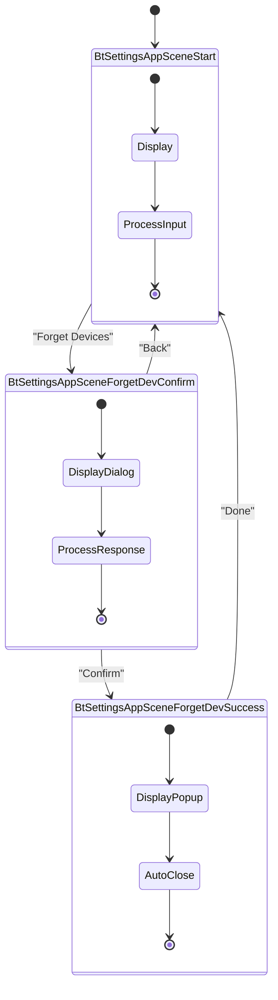
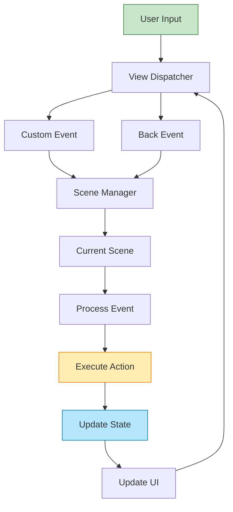

# Settings Management

<cite>
**Referenced Files in This Document**   
- [bt_settings_app.c](file://applications/settings/bt_settings_app/bt_settings_app.c)
- [bt_settings_app.h](file://applications/settings/bt_settings_app/bt_settings_app.h)
- [bt_settings_scene.h](file://applications/settings/bt_settings_app/scenes/bt_settings_scene.h)
- [bt_settings_scene_config.h](file://applications/settings/bt_settings_app/scenes/bt_settings_scene_config.h)
- [bt_settings_scene_start.c](file://applications/settings/bt_settings_app/scenes/bt_settings_scene_start.c)
- [bt_settings_scene_forget_dev_confirm.c](file://applications/settings/bt_settings_app/scenes/bt_settings_scene_forget_dev_confirm.c)
- [power_settings_app.c](file://applications/settings/power_settings_app/power_settings_app.c)
- [desktop_settings_app.c](file://applications/settings/desktop_settings/desktop_settings_app.c)
- [system_settings.c](file://applications/settings/system/system_settings.c)
- [storage_settings.c](file://applications/settings/storage_settings/storage_settings.c)
</cite>

## Table of Contents
1. [Introduction](#introduction)
2. [Project Structure](#project-structure)
3. [Core Components](#core-components)
4. [Architecture Overview](#architecture-overview)
5. [Detailed Component Analysis](#detailed-component-analysis)
6. [Configuration Storage and Persistence](#configuration-storage-and-persistence)
7. [Scene-Based Navigation Structure](#scene-based-navigation-structure)
8. [Input Handling Mechanisms](#input-handling-mechanisms)
9. [Integration with System Services](#integration-with-system-services)
10. [Extensibility of the Settings System](#extensibility-of-the-settings-system)
11. [User Experience Design Principles](#user-experience-design-principles)
12. [Conclusion](#conclusion)

## Introduction
The Settings Management system serves as the centralized configuration interface for the Flipper Zero device, providing users with a unified and intuitive way to manage device settings across various functional domains. This document provides a comprehensive analysis of the architecture, implementation, and design principles of the settings system, focusing on its role as the primary configuration hub for Bluetooth, Power, Desktop, Storage, System, and other device functionalities. The analysis covers the common design patterns used across individual settings applications, the configuration storage mechanism, persistence strategies, validation processes, scene-based navigation structure, input handling, and integration with underlying system services.

**Section sources**
- [bt_settings_app.c](file://applications/settings/bt_settings_app/bt_settings_app.c#L1-L86)
- [power_settings_app.c](file://applications/settings/power_settings_app/power_settings_app.c#L1-L120)
- [desktop_settings_app.c](file://applications/settings/desktop_settings/desktop_settings_app.c#L1-L150)

## Project Structure
The Settings Management system is organized within the `applications/settings` directory, which contains individual subdirectories for each settings category. Each settings application follows a consistent structure with dedicated directories for scenes, views, and helper modules. The main settings applications include Bluetooth settings, Power settings, Desktop settings, Storage settings, System settings, and specialized applications like CFW (Custom Firmware) settings and Passport settings. Each application maintains its own set of source files, header files, and scene-specific implementations, following a modular design that enables independent development and maintenance.

The directory structure reveals a clear separation of concerns, with each settings application encapsulated in its own directory. The common pattern across all settings applications includes a main application file (e.g., `bt_settings_app.c`), a header file defining the application interface, a scenes directory containing scene-specific implementations, and sometimes additional directories for views and helpers. This organization facilitates code reuse, simplifies navigation, and supports the extensibility of the settings system by making it straightforward to add new settings categories.

**Diagram sources**
- [applications/settings](file://applications/settings)
- [bt_settings_app](file://applications/settings/bt_settings_app)
- [power_settings_app](file://applications/settings/power_settings_app)
- [desktop_settings](file://applications/settings/desktop_settings)

**Section sources**
- [applications/settings](file://applications/settings)
- [bt_settings_app](file://applications/settings/bt_settings_app)
- [power_settings_app](file://applications/settings/power_settings_app)

## Core Components
The Settings Management system consists of several core components that work together to provide a cohesive configuration experience. Each settings application is built around a central application structure that manages the state, UI components, and interaction with system services. The `BtSettingsApp` structure, for example, contains essential elements such as settings data, references to system records (GUI, BT), scene manager, view dispatcher, and various UI modules like variable item lists, dialog boxes, and popups.

The initialization process for each settings application follows a consistent pattern: allocating memory for the application structure, loading settings from persistent storage, opening necessary system records, setting up the view dispatcher and scene manager, configuring event callbacks, and attaching views to the GUI. This standardized initialization ensures that all settings applications have a uniform behavior and resource management approach. The application lifecycle is managed through allocation and deallocation functions that handle resource cleanup and persistence of settings changes.

**Section sources**
- [bt_settings_app.c](file://applications/settings/bt_settings_app/bt_settings_app.c#L1-L86)
- [bt_settings_app.h](file://applications/settings/bt_settings_app/bt_settings_app.h#L1-L43)

## Architecture Overview
The Settings Management system employs a scene-based architecture that leverages the Flipper Zero's GUI framework to create a structured navigation experience. At the core of this architecture are the Scene Manager and View Dispatcher components, which work together to manage the application's state and user interface. The Scene Manager handles navigation between different logical states of the application, while the View Dispatcher manages the presentation of different UI elements.

Each settings application follows a Model-View-Controller (MVC) inspired pattern where the application structure represents the model, the various GUI modules (VariableItemList, DialogEx, Popup) serve as views, and the scene handlers act as controllers that process user input and update the model accordingly. This separation of concerns enables clean code organization and facilitates the implementation of complex user interactions while maintaining a responsive interface.

**Diagram sources**
- [bt_settings_app.c](file://applications/settings/bt_settings_app/bt_settings_app.c#L1-L86)
- [bt_settings_app.h](file://applications/settings/bt_settings_app/bt_settings_app.h#L1-L43)

## Detailed Component Analysis

### Bluetooth Settings Application Analysis
The Bluetooth Settings application provides configuration options for the device's Bluetooth functionality, including enabling/disabling Bluetooth and managing paired devices. The application follows the standard settings application pattern with a clear separation between the main application logic and scene-specific implementations.

#### Application Structure and Initialization
The `BtSettingsApp` structure defines the core components of the application, including settings data, references to system services, and UI management objects. The initialization process in `bt_settings_app_alloc()` follows a systematic approach: loading settings from persistent storage, opening required system records (GUI and BT), allocating and configuring the view dispatcher and scene manager, setting up event callbacks, and attaching UI views to the dispatcher.

**Diagram sources**
- [bt_settings_app.h](file://applications/settings/bt_settings_app/bt_settings_app.h#L1-L43)
- [bt_settings_app.c](file://applications/settings/bt_settings_app/bt_settings_app.c#L1-L86)

**Section sources**
- [bt_settings_app.c](file://applications/settings/bt_settings_app/bt_settings_app.c#L1-L86)
- [bt_settings_app.h](file://applications/settings/bt_settings_app/bt_settings_app.h#L1-L43)

#### Scene Management Implementation
The scene management system uses a macro-based approach to define and manage scenes, providing a clean and maintainable way to organize the application's navigation structure. The `bt_settings_scene_config.h` file contains ADD_SCENE macros that define each scene, which are then used in the `bt_settings_scene.h` header to generate enum values, scene handler declarations, and the scene manager handlers structure.

The scene lifecycle is managed through three callback functions for each scene: on_enter, on_event, and on_exit. The on_enter function sets up the UI for the scene, the on_event function processes user input and system events, and the on_exit function cleans up resources. This pattern ensures that each scene has a well-defined behavior and resource management strategy.

**Diagram sources**
- [bt_settings_scene_start.c](file://applications/settings/bt_settings_app/scenes/bt_settings_scene_start.c#L1-L92)
- [bt_settings_app.c](file://applications/settings/bt_settings_app/bt_settings_app.c#L1-L86)

### Power Settings Application Analysis
The Power Settings application manages device power-related configurations, including battery information, shutdown options, and reboot functionality. This application demonstrates the use of additional UI components like the BatteryInfo view, which provides detailed battery status information.

The Power Settings application follows the same architectural pattern as other settings applications but includes specialized views for displaying battery information. The application structure includes references to the BatteryInfo view module, which is added to the view dispatcher alongside the standard VariableItemList, DialogEx, and Popup components. This demonstrates the flexibility of the settings framework in accommodating specialized UI requirements while maintaining consistency with the overall design.

**Section sources**
- [power_settings_app.c](file://applications/settings/power_settings_app/power_settings_app.c#L1-L120)
- [power_settings_app.h](file://applications/settings/power_settings_app/power_settings_app.h#L1-L35)

### Desktop Settings Application Analysis
The Desktop Settings application manages user interface and security settings related to the device's desktop environment, including PIN authentication setup and management. This application is more complex than others due to the multi-step process involved in PIN setup and the need for instructional views.

The Desktop Settings application includes a helpers directory with PIN management utilities and multiple instructional views that guide users through the PIN setup process. The scene structure is more elaborate, with scenes for PIN setup, PIN authentication, PIN error handling, and PIN menu navigation. This complexity reflects the security-critical nature of PIN management and the need for a user-friendly setup process.

**Section sources**
- [desktop_settings_app.c](file://applications/settings/desktop_settings/desktop_settings_app.c#L1-L150)
- [desktop_settings_app.h](file://applications/settings/desktop_settings/desktop_settings_app.h#L1-L40)

## Configuration Storage and Persistence
The Settings Management system implements a robust configuration storage mechanism that ensures settings are preserved across device reboots and power cycles. Settings are loaded from persistent storage during application initialization and saved back to storage when the application exits. This approach guarantees that user preferences are maintained and provides a reliable configuration management system.

The persistence strategy follows a simple but effective pattern: settings are loaded once at startup, modified in memory during the application session, and written back to storage upon application exit. This minimizes the number of write operations to persistent storage, which is important for preserving the lifespan of flash memory. The bt_settings_load() and bt_settings_save() functions handle the serialization and deserialization of settings data, abstracting the underlying storage mechanism from the application logic.

The configuration data structure (BtSettings) contains all the necessary fields for Bluetooth configuration, including enable/disable state, profile enable states, PIN code, and device name. This structured approach to configuration data makes it easy to extend with new settings options and ensures type safety and data integrity. The use of fixed-size arrays for strings (pin, name) prevents buffer overflow issues and simplifies serialization.

**Diagram sources**
- [bt_settings_app.c](file://applications/settings/bt_settings_app/bt_settings_app.c#L1-L86)
- [bt_settings_app.h](file://applications/settings/bt_settings_app/bt_settings_app.h#L1-L43)

**Section sources**
- [bt_settings_app.c](file://applications/settings/bt_settings_app/bt_settings_app.c#L1-L86)
- [bt_settings_app.h](file://applications/settings/bt_settings_app/bt_settings_app.h#L1-L43)

## Scene-Based Navigation Structure
The Settings Management system employs a scene-based navigation structure that provides a clear and intuitive user experience. Each logical state of the application is represented as a scene, and navigation between scenes is managed by the Scene Manager. This approach enables complex workflows to be broken down into manageable steps, each with its own dedicated UI and behavior.

The scene system uses a macro-based configuration approach that generates enum values, function declarations, and the scene handlers structure from a common configuration file (bt_settings_scene_config.h). This eliminates the need for manual enumeration and function declaration, reducing the potential for errors and making it easy to add or remove scenes. The ADD_SCENE macro defines each scene with a prefix, name, and ID, which are used to generate the necessary code elements.

Each scene implements three lifecycle functions: on_enter, on_event, and on_exit. The on_enter function is called when the scene becomes active and is responsible for setting up the UI and initializing any necessary state. The on_event function processes events such as user input, custom events, and back navigation events. The on_exit function is called when leaving the scene and is responsible for cleaning up resources and saving any transient state.

This scene-based approach provides several benefits: it enforces a consistent structure across all settings applications, simplifies navigation logic, enables easy addition of new scenes, and ensures proper resource management through the on_exit lifecycle function. The use of custom events (BtSettingsCustomEvent) allows for flexible communication between scenes and the main application, enabling complex workflows like confirmation dialogs and multi-step processes.

**Diagram sources**
- [bt_settings_scene_config.h](file://applications/settings/bt_settings_app/scenes/bt_settings_scene_config.h#L1-L4)
- [bt_settings_scene.h](file://applications/settings/bt_settings_app/scenes/bt_settings_scene.h#L1-L30)
- [bt_settings_scene_start.c](file://applications/settings/bt_settings_app/scenes/bt_settings_scene_start.c#L1-L92)

**Section sources**
- [bt_settings_scene_config.h](file://applications/settings/bt_settings_app/scenes/bt_settings_scene_config.h#L1-L4)
- [bt_settings_scene.h](file://applications/settings/bt_settings_app/scenes/bt_settings_scene.h#L1-L30)

## Input Handling Mechanisms
The Settings Management system implements a sophisticated input handling mechanism that processes user interactions and translates them into application state changes. Input handling is centralized through the View Dispatcher, which receives input events from the GUI system and routes them to the appropriate handlers.

The system uses two main types of event callbacks: custom event callbacks and back event callbacks. The custom event callback (bt_settings_custom_event_callback) handles application-specific events generated by UI elements like variable item lists, while the back event callback (bt_settings_back_event_callback) handles navigation back events. These callbacks delegate event processing to the Scene Manager, which routes events to the appropriate scene handler.

In the Bluetooth Settings application, user input is processed through the variable item list's change callback (bt_settings_scene_start_var_list_change_callback) and enter callback (bt_settings_scene_start_var_list_enter_callback). The change callback updates the UI to reflect the selected value and sends a custom event to trigger the state change, while the enter callback handles selection of menu items that require additional actions, such as navigating to a confirmation scene.

The event processing in the scene's on_event function (bt_settings_scene_start_on_event) demonstrates a clean and maintainable approach to handling different types of events. The function uses a switch-like structure to process custom events, including Bluetooth enable/disable commands and navigation requests. This approach ensures that input handling is centralized, easy to understand, and simple to extend with new event types.

**Diagram sources**
- [bt_settings_app.c](file://applications/settings/bt_settings_app/bt_settings_app.c#L1-L86)
- [bt_settings_scene_start.c](file://applications/settings/bt_settings_app/scenes/bt_settings_scene_start.c#L1-L92)

**Section sources**
- [bt_settings_app.c](file://applications/settings/bt_settings_app/bt_settings_app.c#L1-L86)
- [bt_settings_scene_start.c](file://applications/settings/bt_settings_app/scenes/bt_settings_scene_start.c#L1-L92)

## Integration with System Services
The Settings Management system integrates closely with various underlying system services to provide functionality and access device capabilities. The Bluetooth Settings application, for example, interacts with the BT service to control Bluetooth advertising and retrieve Bluetooth status information. This integration is achieved through the use of system records, which provide a standardized way to access shared services.

The application opens the necessary system records during initialization using furi_record_open() and closes them during cleanup with furi_record_close(). The GUI record provides access to the graphical user interface system, while the BT record provides access to Bluetooth functionality. This record-based approach ensures that services are properly managed and that resources are released when no longer needed.

The integration with system services follows a clear pattern: declare the service pointer in the application structure, open the record during initialization, use the service API to perform operations, and close the record during cleanup. This pattern is consistent across all settings applications and ensures proper resource management and error handling. The use of furi_assert() statements helps catch programming errors and ensures that service pointers are valid before use.

The settings applications also interact with hardware abstraction layers through furi_hal_* functions. For example, the Bluetooth Settings application uses furi_hal_bt_start_advertising() and furi_hal_bt_stop_advertising() to control Bluetooth functionality at the hardware level. This separation between high-level application logic and low-level hardware control promotes code reuse and makes it easier to adapt the software to different hardware configurations.

**Section sources**
- [bt_settings_app.c](file://applications/settings/bt_settings_app/bt_settings_app.c#L1-L86)
- [bt_settings_scene_start.c](file://applications/settings/bt_settings_app/scenes/bt_settings_scene_start.c#L1-L92)

## Extensibility of the Settings System
The Settings Management system is designed with extensibility in mind, making it straightforward to add new configuration options or create custom settings applications. The modular architecture, consistent design patterns, and macro-based scene management system all contribute to the system's extensibility.

Adding a new settings application follows a well-defined process: create a new directory under applications/settings, implement the main application file with initialization and cleanup functions, define the application structure and settings data, create scene configuration and implementation files, and register the application with the system. The use of standardized patterns and components (scene manager, view dispatcher, variable item list) means that developers can leverage existing knowledge and code examples when creating new settings applications.

Extending existing settings applications with new configuration options is also straightforward. New settings can be added to the settings data structure, new scenes can be defined in the scene configuration file, and new UI elements can be implemented using the available GUI modules. The event-driven architecture makes it easy to connect new UI elements to application logic through custom events and scene handlers.

The system's extensibility is further enhanced by the use of header files that define clear interfaces and the separation of concerns between different components. This allows for independent development and testing of new features without affecting existing functionality. The consistent error handling and resource management patterns also reduce the risk of introducing bugs when extending the system.

**Section sources**
- [bt_settings_app.c](file://applications/settings/bt_settings_app/bt_settings_app.c#L1-L86)
- [bt_settings_app.h](file://applications/settings/bt_settings_app/bt_settings_app.h#L1-L43)
- [bt_settings_scene_config.h](file://applications/settings/bt_settings_app/scenes/bt_settings_scene_config.h#L1-L4)

## User Experience Design Principles
The Settings Management system embodies several key user experience design principles that contribute to a consistent and intuitive interface across all settings categories. These principles include consistency, simplicity, feedback, and progressive disclosure.

Consistency is achieved through the use of standardized UI components and navigation patterns across all settings applications. Users encounter the same types of interfaces (variable item lists, dialog boxes, popups) regardless of which settings category they are using, reducing the learning curve and improving usability. The consistent placement of navigation controls and the uniform behavior of interactive elements create a predictable user experience.

Simplicity is reflected in the focused design of each settings screen, which presents only the most relevant options and avoids overwhelming the user with too many choices at once. The use of clear labels, appropriate default values, and sensible grouping of related settings helps users understand and configure their device efficiently.

Feedback is provided through immediate visual updates when settings are changed, confirmation dialogs for potentially destructive actions, and success indicators for completed operations. For example, when disabling Bluetooth, the UI immediately reflects the new state, and when unpairing all devices, a confirmation dialog ensures the user intends to perform this action.

Progressive disclosure is implemented through the scene-based navigation structure, which reveals additional options and complexity only when needed. Simple settings are presented directly, while more complex operations (like PIN setup) are broken down into multiple steps with instructional guidance. This approach prevents information overload and helps users complete tasks successfully.

**Section sources**
- [bt_settings_app.c](file://applications/settings/bt_settings_app/bt_settings_app.c#L1-L86)
- [bt_settings_scene_start.c](file://applications/settings/bt_settings_app/scenes/bt_settings_scene_start.c#L1-L92)
- [desktop_settings_app.c](file://applications/settings/desktop_settings/desktop_settings_app.c#L1-L150)

## Conclusion
The Settings Management system in the Flipper Zero firmware provides a robust, extensible, and user-friendly interface for configuring device settings. Its architecture, based on scene management and view dispatching, enables the creation of consistent and intuitive settings applications across various functional domains. The system's design emphasizes modularity, with each settings application encapsulated in its own directory and following standardized patterns for initialization, event handling, and resource management.

Key strengths of the system include its consistent architecture across all settings applications, effective use of the scene-based navigation model, robust configuration persistence mechanism, and seamless integration with underlying system services. The extensibility of the system makes it easy to add new settings categories or extend existing ones, while the adherence to user experience design principles ensures a cohesive and intuitive interface.

The analysis of specific settings applications, particularly the Bluetooth Settings application, reveals a well-structured implementation that balances complexity with maintainability. The use of macro-based scene configuration, clear separation of concerns, and standardized event handling patterns contribute to a codebase that is both powerful and accessible to developers. As the Flipper Zero platform continues to evolve, this settings framework provides a solid foundation for adding new features and enhancing user configuration options.