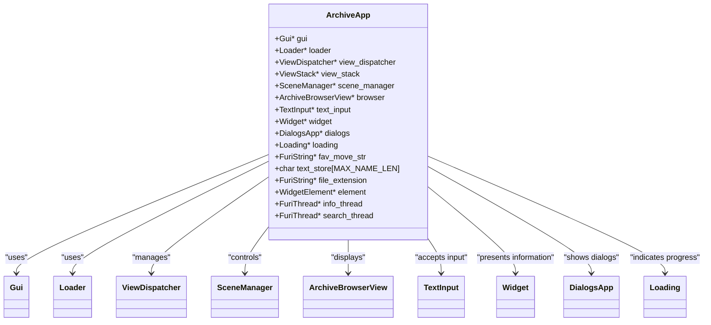
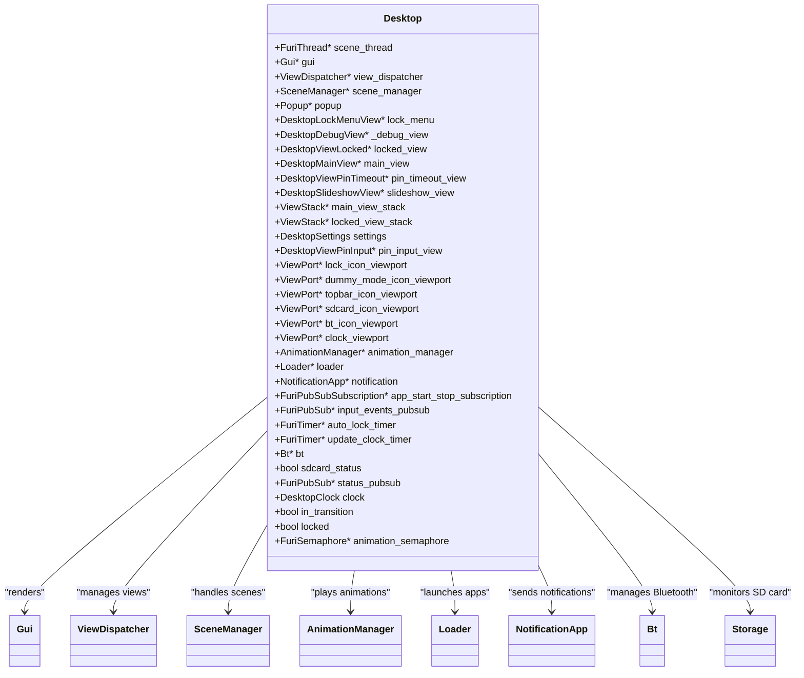
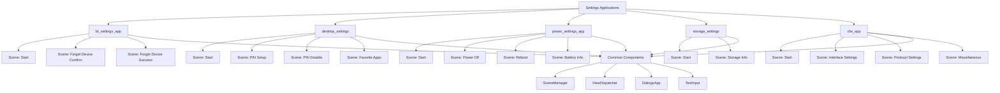
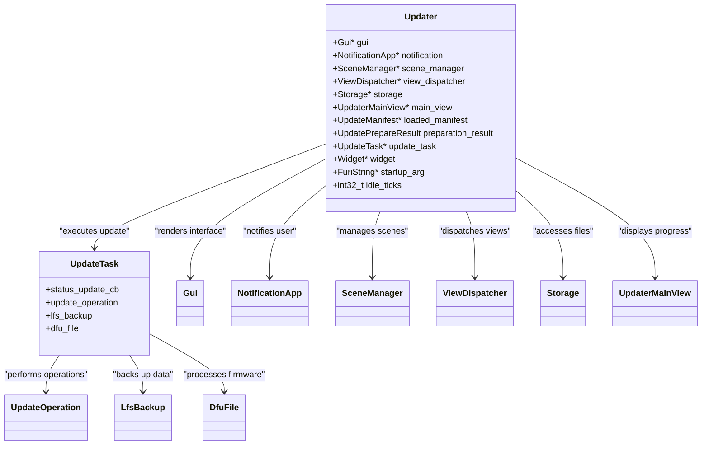
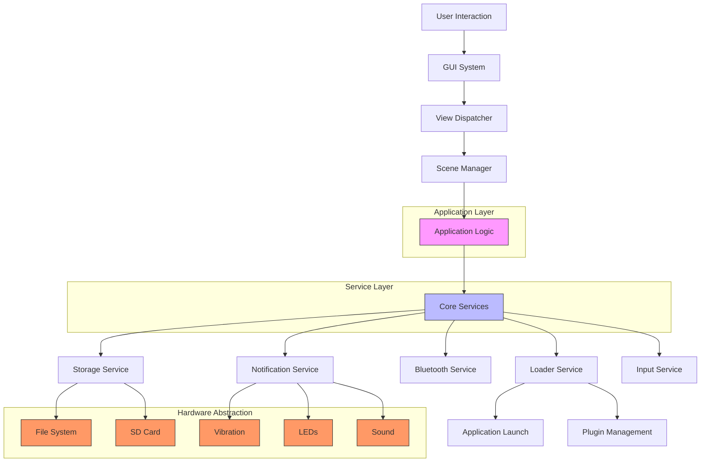
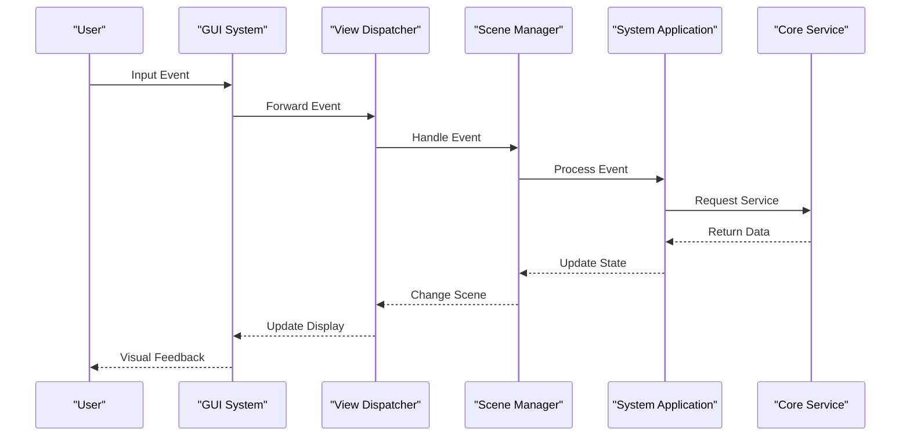

# System Applications

<cite>
**Referenced Files in This Document**   
- [archive.c](file://applications/main/archive/archive.c)
- [archive.h](file://applications/main/archive/archive.h)
- [archive_i.h](file://applications/main/archive/archive_i.h)
- [desktop.c](file://applications/services/desktop/desktop.c)
- [desktop.h](file://applications/services/desktop/desktop.h)
- [desktop_i.h](file://applications/services/desktop/desktop_i.h)
- [updater.c](file://applications/system/updater/updater.c)
- [updater_i.h](file://applications/system/updater/updater_i.h)
- [storage.c](file://applications/services/storage/storage.c)
- [storage.h](file://applications/services/storage/storage.h)
</cite>

## Table of Contents
1. [Introduction](#introduction)
2. [File Browser Application](#file-browser-application)
3. [Desktop Interface](#desktop-interface)
4. [Settings Management System](#settings-management-system)
5. [Firmware Updater](#firmware-updater)
6. [System Architecture Overview](#system-architecture-overview)
7. [Component Integration](#component-integration)
8. [Performance Considerations](#performance-considerations)

## Introduction
This document provides a comprehensive analysis of the core system applications within the Flipper Zero firmware, focusing on the file browser, desktop interface, settings management, and firmware updater components. These applications form the foundation of the user experience and system management capabilities of the device. The analysis covers architectural patterns, implementation details, and integration with core system services, providing both technical depth and accessibility for users with varying levels of technical expertise.

## File Browser Application

The file browser application, implemented in the Archive module, provides users with a hierarchical interface for navigating and managing files on the device's storage system. This application follows a structured MVC (Model-View-Controller) pattern, leveraging the Flipper Zero's scene management system for state transitions and user interface navigation.

The ArchiveApp structure maintains references to essential system components including the GUI, loader, view dispatcher, scene manager, and various UI elements such as text input, widget, and browser views. The application lifecycle begins with `archive_alloc()`, which initializes these components and sets up event callbacks for custom events, back navigation, and periodic tick events.

**Diagram sources**
- [archive_i.h](file://applications/main/archive/archive_i.h#L20-L51)

**Section sources**
- [archive.c](file://applications/main/archive/archive.c#L0-L150)
- [archive_i.h](file://applications/main/archive/archive_i.h#L0-L51)

## Desktop Interface

The desktop interface serves as the primary user environment for the Flipper Zero device, managing application launching, system status display, and security features. Implemented in the Desktop service, this component provides a persistent background environment that coordinates between various system services and user applications.

The Desktop structure maintains a comprehensive set of viewports for displaying system status indicators such as Bluetooth connectivity, SD card status, battery level, and time. It integrates with multiple system services including animation management, notification, Bluetooth, and storage to provide a cohesive user experience. The interface supports multiple display modes including locked, unlocked, pin input, and slideshow states.

**Diagram sources**
- [desktop_i.h](file://applications/services/desktop/desktop_i.h#L20-L115)

**Section sources**
- [desktop.c](file://applications/services/desktop/desktop.c#L0-L199)
- [desktop_i.h](file://applications/services/desktop/desktop_i.h#L0-L115)

## Settings Management System

The settings management system in the Flipper Zero firmware is distributed across multiple specialized applications, each responsible for a specific domain of configuration. This modular approach allows for focused management of different system aspects while maintaining a consistent user interface pattern.

Key settings applications include:
- **bt_settings_app**: Manages Bluetooth configuration and paired devices
- **desktop_settings**: Handles desktop appearance, PIN authentication, and favorite applications
- **power_settings_app**: Controls power management, shutdown, and reboot functions
- **storage_settings**: Manages storage configuration and file system operations
- **cfw_app**: Configures custom firmware settings and interface options

Each settings application follows a similar architectural pattern, utilizing the scene manager for navigation between configuration screens and the view dispatcher for UI rendering. The system employs a hierarchical scene structure that guides users through configuration workflows, with specialized scenes for confirmation dialogs, input forms, and success/error states.

**Diagram sources**
- [bt_settings_app.c](file://applications/settings/bt_settings_app/bt_settings_app.c)
- [desktop_settings_app.c](file://applications/settings/desktop_settings/desktop_settings_app.c)
- [power_settings_app.c](file://applications/settings/power_settings_app/power_settings_app.c)
- [storage_settings.c](file://applications/settings/storage_settings/storage_settings.c)
- [cfw_app.c](file://applications/settings/cfw_app/cfw_app.c)

## Firmware Updater

The firmware updater application provides a robust mechanism for updating the Flipper Zero's system software, handling both preparation and execution phases of the update process. The updater follows a state machine pattern, progressing through various scenes based on the update workflow and system conditions.

The Updater structure maintains references to critical system components including storage, notification, GUI, scene manager, and view dispatcher. It also manages the update task, which encapsulates the actual update operations, and a widget for displaying update status. The application supports both automatic startup (triggered by boot mode) and manual invocation, with appropriate startup argument handling.

**Diagram sources**
- [updater_i.h](file://applications/system/updater/updater_i.h#L20-L61)
- [updater.c](file://applications/system/updater/updater.c#L0-L128)

**Section sources**
- [updater.c](file://applications/system/updater/updater.c#L0-L128)
- [updater_i.h](file://applications/system/updater/updater_i.h#L0-L61)

## System Architecture Overview

The system applications in the Flipper Zero firmware follow a consistent architectural pattern that emphasizes modularity, separation of concerns, and integration with core system services. This architecture enables maintainable code, consistent user experiences, and efficient resource utilization.

**Diagram sources**
- [archive.c](file://applications/main/archive/archive.c)
- [desktop.c](file://applications/services/desktop/desktop.c)
- [updater.c](file://applications/system/updater/updater.c)
- [storage.c](file://applications/services/storage/storage.c)

## Component Integration

The system applications integrate with core framework components through a well-defined set of interfaces and patterns. This integration enables consistent behavior across applications while allowing for specialized functionality where needed.

The primary integration points include:
- **View Dispatcher**: Manages the display of different views and handles input events
- **Scene Manager**: Controls application state transitions and scene navigation
- **Furi Records**: Provides access to system services through a registry pattern
- **Event Callbacks**: Enables applications to respond to user input and system events

**Diagram sources**
- [archive.c](file://applications/main/archive/archive.c#L20-L50)
- [desktop.c](file://applications/services/desktop/desktop.c#L50-L100)
- [updater.c](file://applications/system/updater/updater.c#L20-L50)

## Performance Considerations

The system applications are designed with performance and resource constraints in mind, given the embedded nature of the Flipper Zero device. Several optimization strategies are employed to ensure responsive user interfaces and efficient resource utilization.

Memory management is handled through explicit allocation and deallocation patterns, with careful attention to preventing memory leaks. The applications use FuriString for dynamic string operations and employ stack-based allocation for temporary data where possible. Thread management is conservative, with background operations limited to essential tasks to minimize CPU and power consumption.

UI rendering is optimized through selective viewport updates and efficient drawing operations. The system uses view stacking to manage multiple UI layers and employs loading indicators for operations that may take noticeable time to complete. The tick event callback is used judiciously, with the file browser setting a 100ms interval for periodic updates.

Storage operations are designed to minimize SD card wear through efficient file system access patterns and caching where appropriate. The firmware updater implements a backup strategy before major operations to prevent data loss during updates.

**Section sources**
- [archive.c](file://applications/main/archive/archive.c)
- [desktop.c](file://applications/services/desktop/desktop.c)
- [updater.c](file://applications/system/updater/updater.c)
- [storage.c](file://applications/services/storage/storage.c)