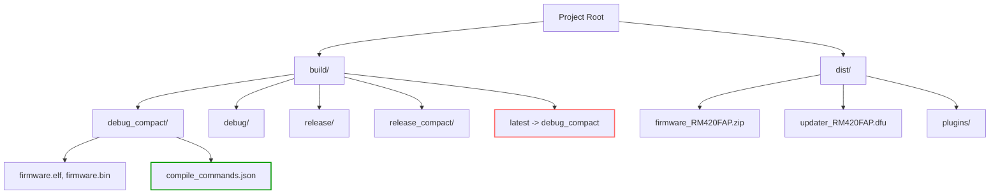
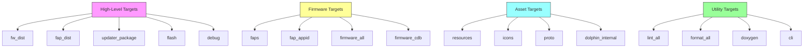
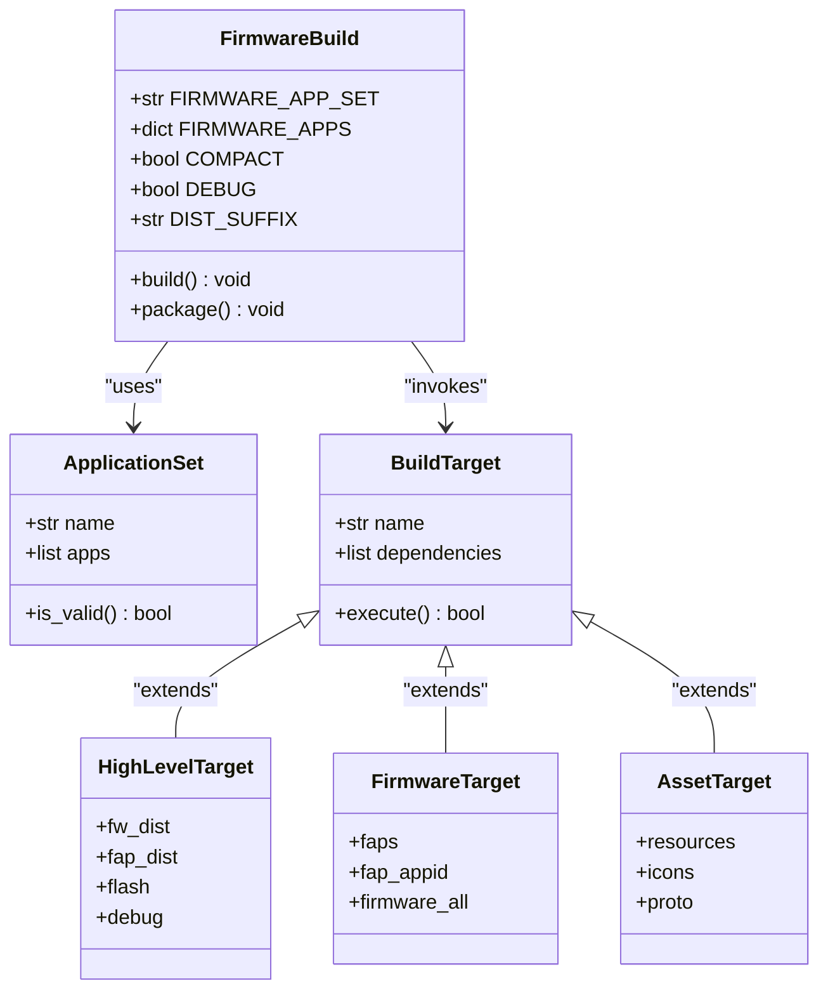

# Build System (fbt)

<cite>
**Referenced Files in This Document**   
- [fbt.md](file://documentation/fbt.md)
- [fbt_options.py](file://fbt_options.py)
- [fbt.cmd](file://fbt.cmd)
- [site_scons/site_init.py](file://site_scons/site_init.py)
- [scripts/toolchain/fbtenv.cmd](file://scripts/toolchain/fbtenv.cmd)
- [scripts/toolchain/fbtenv.sh](file://scripts/toolchain/fbtenv.sh)
</cite>

## Table of Contents
1. [Introduction](#introduction)
2. [Environment Setup](#environment-setup)
3. [Build Directories and Output Structure](#build-directories-and-output-structure)
4. [Invoking fbt](#invoking-fbt)
5. [Build Targets](#build-targets)
6. [Command-Line Parameters](#command-line-parameters)
7. [Configuration Options](#configuration-options)
8. [VSCode Integration](#vscode-integration)
9. [Firmware Application Management](#firmware-application-management)
10. [Troubleshooting Guide](#troubleshooting-guide)

## Introduction

The Flipper Build Tool (fbt) is the primary build system for the Flipper Zero firmware, serving as a wrapper around the SCons build automation tool. It streamlines the process of compiling, flashing, debugging, and packaging firmware for the Flipper Zero device. The fbt system handles toolchain management, dependency resolution, and environment configuration automatically, enabling developers to focus on development rather than build infrastructure.

fbt supports a wide range of operations including firmware compilation, plugin building, debugging with GDB, flashing via various interfaces (SWD, USB, J-Link), code formatting, static analysis, and documentation generation. It is designed to work across Windows, Linux, and macOS platforms with minimal system requirements.

This document provides comprehensive guidance on using fbt for firmware development, covering environment setup, build workflows, configuration options, and integration with development tools.

**Section sources**
- [fbt.md](file://documentation/fbt.md#L1-L20)

## Environment Setup

fbt requires only Git to be installed on the system. Upon first execution, fbt automatically downloads and configures a pre-built cross-compilation toolchain, isolating it from the system environment to prevent path contamination. The toolchain is stored in the `toolchain` directory at the project root by default, though this location can be customized using the `FBT_TOOLCHAIN_PATH` environment variable.

For systems unsupported by the pre-built toolchain or when custom toolchain versions are required, users can set `FBT_NOENV=1` to bypass automatic toolchain setup and rely on system-installed tools (not available on Windows).

To access toolchain utilities outside of fbt commands, developers can launch an fbt shell:
- On Windows: Run `scripts/toolchain/fbtenv.cmd`
- On Linux/macOS: Execute `source scripts/toolchain/fbtenv.sh`
- Alternatively: Use `. ./fbt -s env` in any shell

Verbose output for debugging fbt and toolchain operations can be enabled by setting `FBT_VERBOSE=1`. By default, fbt runs `git submodule update --init` at startup to ensure all dependencies are synchronized. This behavior can be disabled by setting `FBT_NO_SYNC=1`.

**Section sources**
- [fbt.md](file://documentation/fbt.md#L22-L55)
- [scripts/toolchain/fbtenv.cmd](file://scripts/toolchain/fbtenv.cmd)
- [scripts/toolchain/fbtenv.sh](file://scripts/toolchain/fbtenv.sh)

## Build Directories and Output Structure

fbt organizes build outputs in the `build` directory, with subdirectories named according to optimization settings (`COMPACT` and `DEBUG` flags). This allows multiple build configurations to coexist. For convenience, the most recently built firmware variant is symlinked as `build/latest`, facilitating IDE integration.

A `compile_commands.json` file is generated in the `build/latest` directory, providing compilation database information for IDEs and language servers to enable features like code completion, navigation, and refactoring. This file is only updated when building firmware targets, not during auxiliary tasks like flashing or packaging.

The `dist` directory contains final distributable artifacts such as firmware images, update packages, and plugin bundles, named with the suffix specified in `DIST_SUFFIX` (or overridden by the `DIST_SUFFIX` environment variable).



**Diagram sources**
- [fbt.md](file://documentation/fbt.md#L57-L68)

## Invoking fbt

fbt is invoked from the project root directory using `./fbt` on Unix-like systems or `fbt.cmd` on Windows. Commands consist of configuration variables and build targets separated by spaces.

Example command:
```bash
./fbt COMPACT=1 DEBUG=0 VERBOSE=1 updater_package copro_dist
```

This builds an optimized release version of the updater package and coprocessor distribution. Configuration variables set before targets take precedence over those in configuration files. To clean build artifacts, use the `-c` flag:
```bash
./fbt -c fw_dist
```

The `--help` or `-h` option displays all available configuration options and targets. fbt automatically resolves dependencies between targets, so specifying high-level targets (e.g., `fw_dist`) ensures all required components are built or rebuilt as needed.

**Section sources**
- [fbt.md](file://documentation/fbt.md#L70-L75)
- [fbt.cmd](file://fbt.cmd)

## Build Targets

fbt provides a comprehensive set of build targets organized by functionality.

### High-Level Targets
- `fw_dist`: Build and package firmware to the `dist` folder (default target)
- `fap_dist`: Compile external plugins and publish to `dist`
- `updater_package`: Create full self-update package (DFU + radio stack + SD resources)
- `updater_minpackage`: Generate minimal update package (DFU only)
- `copro_dist`: Bundle Core2 FUS and stack binaries for qFlipper
- `flash`: Flash device via SWD with automatic probe detection
- `flash_usb`: Build and install update package over USB
- `debug`: Build, flash, and start GDB debugging session
- `lint_all`, `format_all`: Run all code linters and formatters
- `doxygen`: Generate API documentation
- `cli`: Start USB CLI session

### Firmware-Specific Targets
- `faps`: Build all external applications as `.fap` files
- `fap_<appid>`: Build individual plugin by application ID
- `firmware_all`: Build core firmware components
- `firmware_list`: Generate source and assembly listings
- `firmware_cdb`: Create compilation database without building

### Asset Processing Targets
- `resources`: Compile binary resources and manifests
- `icons`: Convert PNG assets to C header/source files
- `proto`: Generate Protocol Buffer code from `.proto` files
- `dolphin_internal`: Process internal dolphin animation assets



**Diagram sources**
- [fbt.md](file://documentation/fbt.md#L77-L131)

## Command-Line Parameters

fbt supports several command-line parameters to customize build behavior:

- `--options optionfile.py`: Specify alternative configuration file (default: `fbt_options.py`)
- `--extra-int-apps=app1,app2`: Force apps to be built as internal (included in firmware)
- `--extra-ext-apps=app1,app2`: Force apps to be built as external (as `.fap` plugins)
- `--extra-define=A --extra-define=B=C`: Add global C/C++ preprocessor definitions
- `--proxy-env=VAR1,VAR2`: Expose additional environment variables to build processes

These parameters allow dynamic modification of build configuration without altering persistent settings. The `--extra-define` option is particularly useful for conditional compilation and feature toggles.

**Section sources**
- [fbt.md](file://documentation/fbt.md#L133-L142)

## Configuration Options

Build configuration is primarily controlled through `fbt_options.py`, which defines default values for all build parameters. Command-line options take precedence over configuration file values. Users can create `fbt_options_local.py` to override defaults persistently without modifying the main configuration file.

Key configuration variables include:
- `FIRMWARE_ORIGIN`: Firmware origin identifier (e.g., "RM" for RougeMaster)
- `TARGET_HW`: Hardware target version (7 for Flipper Zero)
- `COMPACT`: Optimization for size (1=enabled, 0=disabled)
- `DEBUG`: Optimization for debugging (0=release, 1=debug)
- `DIST_SUFFIX`: Suffix for distribution files
- `COPRO_STACK_TYPE`: Radio stack type ("ble_light" or "ble_full")
- `FIRMWARE_APP_SET`: Application preset to use in build

The `FIRMWARE_APPS` dictionary defines application presets that can be selected via `FIRMWARE_APP_SET`. For example, setting `FIRMWARE_APP_SET=unit_tests` includes test applications in the build.

```python
FIRMWARE_APPS = {
    "default": [
        "basic_services",
        "main_apps",
        "system_apps",
        "settings_apps",
    ],
    "unit_tests": [
        "basic_services",
        "main_apps",
        "system_apps",
        "settings_apps",
        "unit_tests",
    ],
}
```

**Section sources**
- [fbt_options.py](file://fbt_options.py#L1-L98)
- [fbt.md](file://documentation/fbt.md#L144-L158)

## VSCode Integration

fbt includes built-in support for Visual Studio Code through the `vscode_dist` target. Running `./fbt vscode_dist` configures the `.vscode` directory with recommended settings, tasks, and launch configurations.

Key features:
- Automatic deployment of workspace settings
- Support for `cpptools` (default) and `clangd` language servers via `LANG_SERVER` parameter
- Pre-configured build tasks accessible via Ctrl+Shift+B
- Debugging configurations for GDB with supported probes
- Recommended extensions listed in `.vscode/extensions.json`

Supported debugging probes include:
- Wi-Fi Devboard with Blackmagic firmware
- ST-Link and compatible adapters
- J-Link (requires manual installation of J-Link tools)

Without hardware probes, firmware can still be installed via USB. The integration automatically generates `compile_commands.json` for optimal code intelligence.

**Section sources**
- [fbt.md](file://documentation/fbt.md#L80-L98)

## Firmware Application Management

fbt provides flexible application management through the `FIRMWARE_APPS` configuration. Developers can create custom firmware variants by defining application presets that group apps into logical sets. The build system distinguishes between internal apps (bundled in firmware) and external apps (distributed as `.fap` plugins).

Applications are categorized as:
- **Services**: Core system services (`basic_services`)
- **Main Apps**: Primary user applications (`main_apps`)
- **System Apps**: System utilities (`system_apps`)
- **Settings**: Configuration applications (`settings_apps`)

The `--extra-int-apps` and `--extra-ext-apps` parameters allow temporary reclassification of apps for specific builds. This enables testing of applications in different contexts without permanent configuration changes.



**Diagram sources**
- [fbt_options.py](file://fbt_options.py#L60-L75)
- [fbt.md](file://documentation/fbt.md#L144-L158)

## Troubleshooting Guide

Common build issues and solutions:

**Toolchain Download Failures**
- Ensure internet connectivity
- Verify no firewall restrictions
- Manually set `FBT_TOOLCHAIN_PATH` to an accessible directory
- Use `FBT_NOENV=1` with system-installed toolchain

**Build Directory Conflicts**
- Clean build with `./fbt -c` before switching configurations
- Delete `build/` directory manually if symlinks are corrupted
- Ensure `build/latest` points to the correct configuration

**Missing Dependencies**
- Run `git submodule update --init` manually if `FBT_NO_SYNC=1`
- Verify all submodules are properly initialized
- Check network access for GitHub repositories

**Flashing Issues**
- For ST-Link: Ensure latest ST-Link drivers installed
- For Blackmagic: Verify probe detected with `get_blackmagic`
- For J-Link: Confirm J-Flash in system PATH
- Use `SWD_TRANSPORT_SERIAL` to specify probe when multiple are connected

**IDE Integration Problems**
- Regenerate `compile_commands.json` with `firmware_cdb`
- Restart VSCode after running `vscode_dist`
- Verify language server compatibility
- Check file permissions in build directory

**Application Build Failures**
- Validate app manifest syntax
- Check for missing dependencies in `applications/`
- Ensure proper directory structure for external apps
- Verify app ID uniqueness

**Section sources**
- [fbt.md](file://documentation/fbt.md#L22-L131)
- [fbt_options.py](file://fbt_options.py#L1-L98)