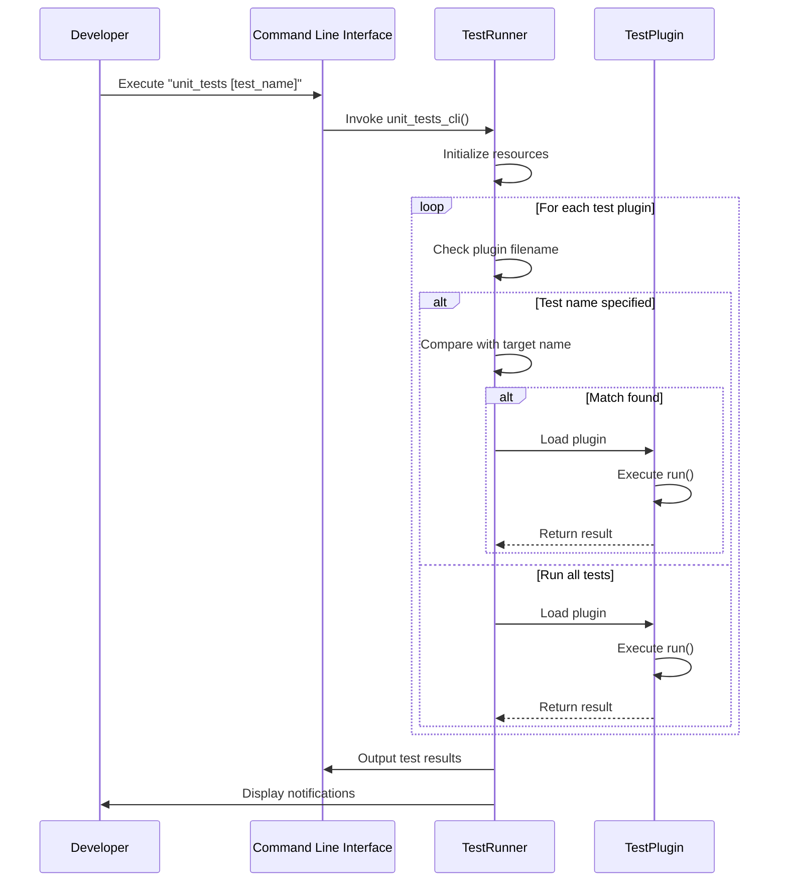

# Debugging and Testing

<cite>
**Referenced Files in This Document**   
- [Debugging via the Devboard.md](file://documentation/devboard/Debugging via the Devboard.md)
- [Reading logs via the Dev Board.md](file://documentation/devboard/Reading logs via the Dev Board.md)
- [UnitTests.md](file://documentation/UnitTests.md)
- [test_runner.c](file://applications/debug/unit_tests/test_runner.c)
- [test_runner.h](file://applications/debug/unit_tests/test_runner.h)
- [test.h](file://applications/debug/unit_tests/tests/test.h)
- [minunit.h](file://applications/debug/unit_tests/tests/minunit.h)
- [test_api.h](file://applications/debug/unit_tests/tests/test_api.h)
- [unit_tests.c](file://applications/debug/unit_tests/unit_tests.c)
- [furi/core/log.h](file://furi/core/log.h)
</cite>

## Table of Contents
1. [Introduction](#introduction)
2. [Debugging Infrastructure](#debugging-infrastructure)
3. [Logging System](#logging-system)
4. [Unit Testing Framework](#unit-testing-framework)
5. [Test Runner Architecture](#test-runner-architecture)
6. [Test Implementation and Execution](#test-implementation-and-execution)
7. [Dev Board Debugging Procedures](#dev-board-debugging-procedures)
8. [Common Debugging Scenarios](#common-debugging-scenarios)
9. [Performance Profiling](#performance-profiling)
10. [Troubleshooting Guide](#troubleshooting-guide)

## Introduction

This document provides a comprehensive overview of the debugging and testing infrastructure for the Flipper Zero firmware. It covers the development and quality assurance processes, including debugging tools, logging systems, hardware debugging interfaces, and the unit testing framework. The documentation is designed to be accessible to developers with varying levels of technical expertise, providing detailed procedures for using the Dev Board, reading logs, and implementing test cases. The Flipper Zero firmware employs a robust testing and debugging ecosystem that enables developers to ensure code quality, identify issues early in the development cycle, and maintain the reliability of the firmware across different hardware configurations.

## Debugging Infrastructure

The Flipper Zero firmware debugging infrastructure is centered around the Developer Board, which acts as a debug probe between the integrated development environment (IDE) and the target microcontroller. The Developer Board provides a bridge for debugging via Wi-Fi or USB connections, enabling developers to control the debugging process from their host computer. The data exchange between the Developer Board and the Flipper Zero occurs through the Serial Wire Debug (SWD) interface, utilizing specific GPIO pins: Pin 10 for Serial Wire Clock (SWCLK) and Pin 12 for Serial Wire Debug Data I/O (SWDIO). This infrastructure allows for real-time debugging, enabling developers to set breakpoints, inspect variables, and step through code execution. The recommended development environment is Visual Studio Code (VS Code) with the Flipper Build Tool (FBT), which provides pre-configured debugging settings for seamless integration. The debugging process can be initiated by running the `./fbt flash` command to upload the built firmware to the Flipper Zero, followed by starting a debugging session in VS Code using the appropriate debugger configuration.

**Section sources**
- [Debugging via the Devboard.md](file://documentation/devboard/Debugging via the Devboard.md#L1-L88)

## Logging System

The logging system in the Flipper Zero firmware provides a mechanism for monitoring application behavior and diagnosing issues during development and runtime. Logs can be accessed through the Developer Board via UART, allowing developers to collect device logs independently of the operating system. This capability is particularly useful for debugging issues that occur during device boot, firmware updates, or system crashes. The log level can be configured through the device's user interface by navigating to **Main Menu → Settings → Log Level**, allowing developers to adjust the verbosity of the logging output based on their debugging needs. When connected via USB, logs can be viewed using terminal applications such as minicom on macOS and Linux, or PuTTY on Windows. The logging infrastructure operates at a baud rate of 230400, ensuring efficient data transfer between the device and the host computer. It's important to note that log viewing via the Developer Board is currently limited to USB connections, with Wi-Fi log viewing planned for future updates.

```mermaid
flowchart TD
A[Flipper Zero Device] --> |SWD Interface| B(Developer Board)
B --> |USB Connection| C[Host Computer]
C --> D[minicom (macOS/Linux)]
C --> E[PuTTY (Windows)]
F[Log Level Setting] --> |User Interface| A
G[Log Output] --> H[Terminal Window]
```

**Diagram sources**
- [Reading logs via the Dev Board.md](file://documentation/devboard/Reading logs via the Dev Board.md#L1-L160)

**Section sources**
- [Reading logs via the Dev Board.md](file://documentation/devboard/Reading logs via the Dev Board.md#L1-L160)
- [furi/core/log.h](file://furi/core/log.h)

## Unit Testing Framework

The Flipper Zero firmware includes a comprehensive unit testing framework designed to ensure code quality and prevent regressions. Unit tests are implemented as a separate application called `unit_tests` that runs directly on Flipper devices, leveraging their hardware features to eliminate platform-related differences. This approach ensures that tests are executed in the actual target environment, providing more reliable results than simulated or emulated testing environments. The unit testing framework is based on the minunit library, a lightweight C unit testing framework that provides a simple API for writing and executing tests. Test-specific code is packaged as PLUGIN applications within the `unit_tests` mother application, allowing for modular test organization and execution. When contributing code to the firmware, developers are encouraged to include unit tests to verify the correctness of their implementations and ensure that new code does not introduce regressions in existing functionality.

```mermaid
classDiagram
class TestRunner {
+Storage* storage
+Loader* loader
+NotificationApp* notification
+Cli* cli
+FuriString* args
+CompositeApiResolver* composite_resolver
+int minunit_run
+int minunit_assert
+int minunit_fail
+int minunit_status
+size_t total_failed
+test_runner_alloc(Cli* cli, FuriString* args) TestRunner*
+test_runner_free(TestRunner* instance) void
+test_runner_run(TestRunner* instance) void
}
class TestApi {
+int (*run)(void)
+int (*get_minunit_run)(void)
+int (*get_minunit_assert)(void)
+int (*get_minunit_status)(void)
}
TestRunner --> TestApi : "executes"
TestRunner --> "FlipperApplication" : "loads plugins"
TestRunner --> "Storage" : "accesses test data"
TestRunner --> "NotificationApp" : "reports results"
```

**Diagram sources**
- [test_runner.c](file://applications/debug/unit_tests/test_runner.c#L1-L277)
- [test_api.h](file://applications/debug/unit_tests/tests/test_api.h#L1-L29)

**Section sources**
- [UnitTests.md](file://documentation/UnitTests.md#L1-L64)
- [test_runner.c](file://applications/debug/unit_tests/test_runner.c#L1-L277)
- [test_api.h](file://applications/debug/unit_tests/tests/test_api.h#L1-L29)

## Test Runner Architecture

The test runner architecture in the Flipper Zero firmware is designed to dynamically load and execute unit test plugins, providing a flexible and extensible testing framework. The `TestRunner` structure serves as the central component, managing resources such as storage, loader, and notification services. It maintains state information for tracking test execution metrics, including the number of tests run, assertions made, failures encountered, and overall status. The test runner allocates a composite API resolver that combines the firmware API interface with the unit tests API interface, enabling test plugins to access both system-level and test-specific functionality. When executing tests, the runner iterates through plugin files in the `/ext/apps_data/unit_tests/plugins` directory, loading each plugin as a Flipper application and invoking its entry point. The architecture includes error handling mechanisms to report test failures through both console output and visual notifications on the device, ensuring that test results are clearly communicated to the developer.

**Section sources**
- [test_runner.c](file://applications/debug/unit_tests/test_runner.c#L1-L277)
- [test_runner.h](file://applications/debug/unit_tests/test_runner.h#L1-L12)

## Test Implementation and Execution

Implementing and executing unit tests in the Flipper Zero firmware follows a structured approach that promotes code modularity and reusability. Tests are implemented as PLUGIN applications within the `unit_tests` mother application, with each test module residing in a subdirectory of the `tests` directory. The common entry point for all tests is the `unit_tests` application, which coordinates the execution of individual test plugins. Test assets, such as external data files required for testing, are stored in the `resources/unit_tests` directory and can include various file types like plain text, FlipperFormat (FFF), or binary data. To run unit tests, developers compile the firmware with tests enabled using the command `./fbt FIRMWARE_APP_SET=unit_tests updater_package`, flash the firmware to the device, and execute the `unit_tests` command through the CLI. Specific tests can be targeted by providing the test name as a command argument, allowing for focused testing during development. The test framework provides a comprehensive set of assertion macros through the minunit library, enabling developers to verify various conditions such as integer equality, string comparison, memory content, and pointer values.



**Diagram sources**
- [unit_tests.c](file://applications/debug/unit_tests/unit_tests.c#L1-L45)
- [test_runner.c](file://applications/debug/unit_tests/test_runner.c#L1-L277)
- [minunit.h](file://applications/debug/unit_tests/tests/minunit.h#L1-L661)

**Section sources**
- [UnitTests.md](file://documentation/UnitTests.md#L1-L64)
- [unit_tests.c](file://applications/debug/unit_tests/unit_tests.c#L1-L45)
- [test_runner.c](file://applications/debug/unit_tests/test_runner.c#L1-L277)
- [minunit.h](file://applications/debug/unit_tests/tests/minunit.h#L1-L661)

## Dev Board Debugging Procedures

The Dev Board debugging procedures for the Flipper Zero firmware involve a series of steps to establish a debugging session using Visual Studio Code and the Flipper Build Tool. Before initiating debugging, developers must ensure that Git is installed and clone the firmware repository using the command `git clone --recursive https://github.com/flipperdevices/flipperzero-firmware.git`. After cloning the repository, the firmware is built using the Flipper Build Tool with the command `./fbt`. To start debugging, developers open the firmware directory in VS Code, install the recommended extensions, and generate the necessary configuration files by running `./fbt vscode_dist`. In the VS Code interface, developers select the appropriate debugger configuration from the Run and Debug tab: "Attach FW (blackmagic)" for Wi-Fi or USB debugging, or "Attach FW (DAP)" for USB-only debugging. It's crucial to ensure that the debug mode on the Developer Board matches the selected debugger configuration, which can be verified and modified through the Dev Board's web interface. Once the debugging session is started, the firmware execution is halted, requiring the developer to manually continue execution using the Continue button in the VS Code toolbar.

**Section sources**
- [Debugging via the Devboard.md](file://documentation/devboard/Debugging via the Devboard.md#L1-L88)

## Common Debugging Scenarios

Common debugging scenarios for the Flipper Zero firmware include troubleshooting hardware interactions, diagnosing memory issues, and resolving communication protocol problems. When debugging hardware interactions, developers often use the various test applications available in the `applications/debug` directory, such as `battery_test_app`, `display_test`, `infrared_test`, and `subghz_test`, to verify the functionality of specific hardware components. For memory-related issues, the test runner provides memory leak detection by comparing heap usage before and after test execution, reporting any memory that was allocated but not properly freed. Communication protocol debugging frequently involves analyzing raw signal data, which can be captured using the CLI command `ir rx raw` for infrared signals or similar commands for other protocols. Developers can also use the logging system to trace the execution flow of specific functions and identify where issues occur. When encountering crashes or unexpected behavior, the crash_test application can be used to intentionally trigger a crash and analyze the resulting behavior, helping to validate the firmware's error handling mechanisms.

**Section sources**
- [crash_test.c](file://applications/debug/crash_test/crash_test.c)
- [infrared_test.c](file://applications/debug/infrared_test/infrared_test.c)
- [subghz_test_app.c](file://applications/debug/subghz_test/subghz_test_app.c)

## Performance Profiling

Performance profiling in the Flipper Zero firmware development process involves measuring the execution time and resource usage of various functions and modules to identify potential bottlenecks and optimize code efficiency. The test runner automatically generates performance reports that include the total execution time of test suites and the amount of memory leaked during test execution. These metrics are displayed both in the console output and through visual notifications on the device, providing immediate feedback to developers. The execution time is measured in milliseconds, calculated by comparing the system tick count before and after test execution. Memory usage is monitored by recording the free heap size before and after running tests, with the difference indicating any memory leaks. For more detailed performance analysis, developers can use the Developer Board's debugging capabilities to set breakpoints, inspect variable values, and step through code execution to identify performance-critical sections. The profiling data helps ensure that new code contributions do not negatively impact the overall performance of the firmware and that resource usage remains within acceptable limits.

**Section sources**
- [test_runner.c](file://applications/debug/unit_tests/test_runner.c#L1-L277)

## Troubleshooting Guide

The troubleshooting guide for Flipper Zero firmware development addresses common issues encountered during debugging and testing. When logs are not appearing in the terminal application, developers should verify that the correct serial port is being used and try alternative port names, as the Developer Board may appear with different device names on different systems. If debugging sessions fail to connect, ensure that the debug mode on the Developer Board matches the selected debugger configuration in VS Code, and verify that the Developer Board is properly connected to both the host computer and the Flipper Zero. For unit test execution issues, confirm that the firmware was compiled with the `FIRMWARE_APP_SET=unit_tests` parameter and that the SD card resources are properly installed. When encountering memory leaks reported by the test runner, review the code for proper memory deallocation and ensure that all allocated resources are freed before the function returns. If specific hardware tests are failing, check the physical connections and verify that the test applications are correctly configured for the target hardware. The comprehensive documentation available in the `documentation` directory provides additional guidance for resolving various development challenges.

**Section sources**
- [Reading logs via the Dev Board.md](file://documentation/devboard/Reading logs via the Dev Board.md#L1-L160)
- [Debugging via the Devboard.md](file://documentation/devboard/Debugging via the Devboard.md#L1-L88)
- [UnitTests.md](file://documentation/UnitTests.md#L1-L64)