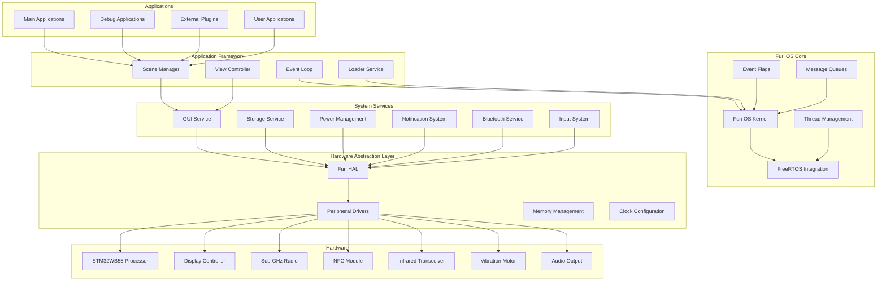
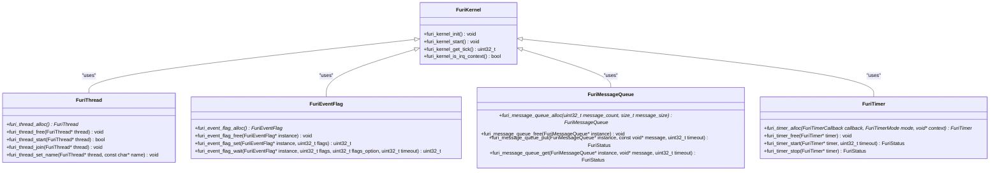
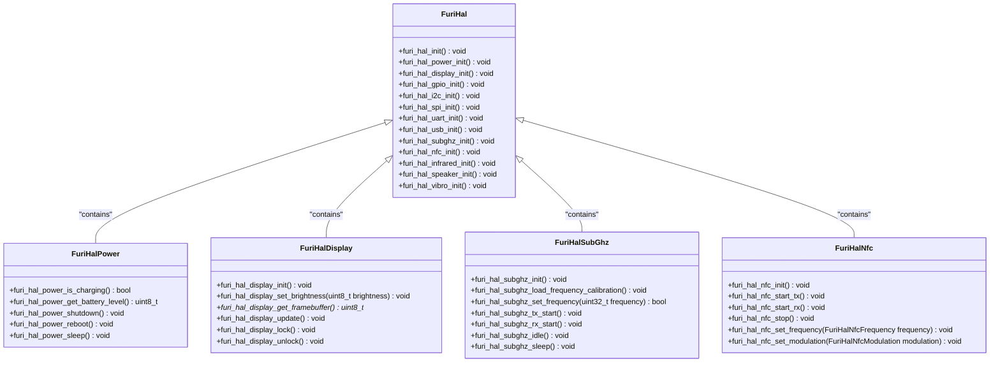
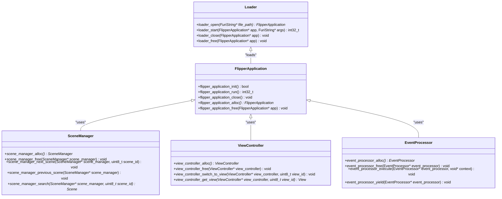
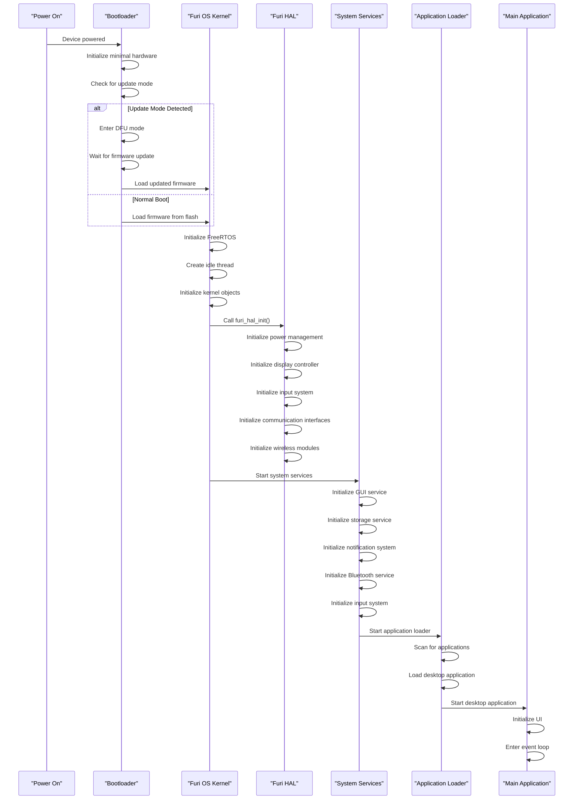
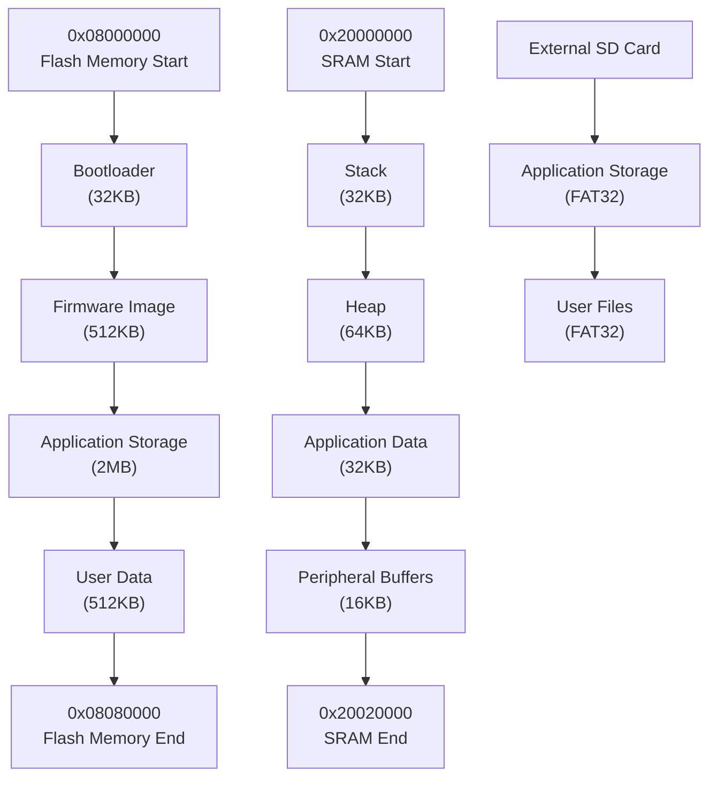
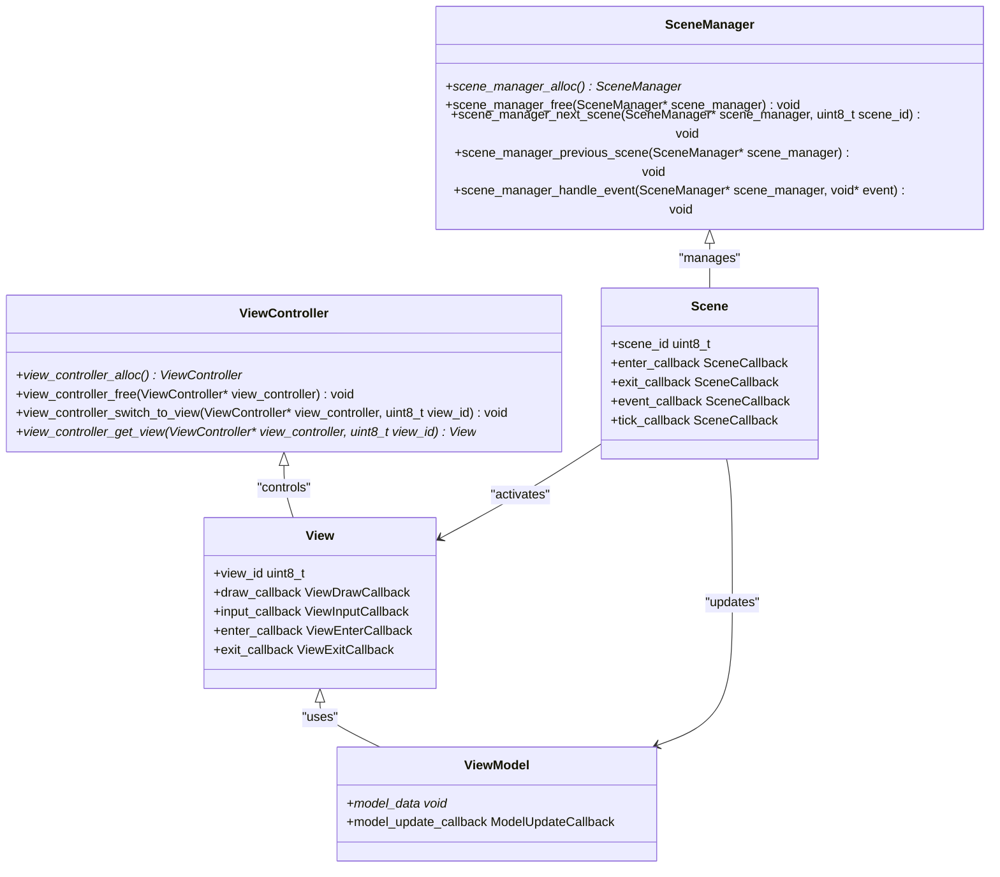
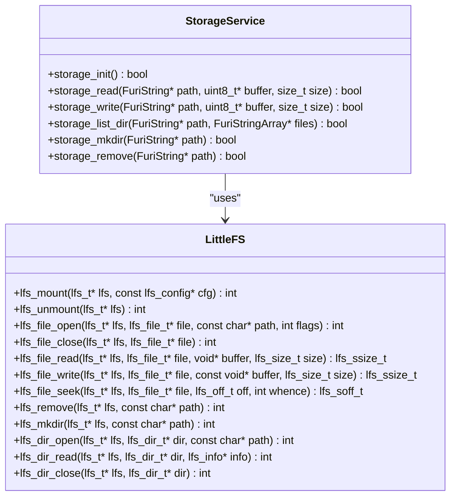

# Firmware Overview

<cite>
**Referenced Files in This Document**   
- [furi/furi.c](file://furi/furi.c)
- [furi/furi.h](file://furi/furi.h)
- [furi/core/kernel.c](file://furi/core/kernel.c)
- [furi/core/thread.c](file://furi/core/thread.c)
- [furi/core/event_loop.c](file://furi/core/event_loop.c)
- [lib/littlefs/lfs.c](file://lib/littlefs/lfs.c)
- [lib/littlefs/lfs.h](file://lib/littlefs/lfs.h)
- [lib/FreeRTOS-glue/task_control_block.h](file://lib/FreeRTOS-glue/task_control_block.h)
- [applications/main/subghz/subghz_test_app.c](file://applications/main/subghz/subghz_test_app.c)
- [applications/services/gui/gui.c](file://applications/services/gui/gui.c)
- [applications/services/loader/loader.c](file://applications/services/loader.c)
- [targets/f7/furi_hal/furi_hal.c](file://targets/f7/furi_hal/furi_hal.c)
- [targets/furi_hal_include/furi_hal.h](file://targets/furi_hal_include/furi_hal.h)
- [lib/app-scened-template/scene_controller.hpp](file://lib/app-scened-template/scene_controller.hpp)
- [lib/app-scened-template/view_controller.hpp](file://lib/app-scened-template/view_controller.hpp)
- [applications/system/updater/updater.c](file://applications/system/updater/updater.c)
- [lib/flipper_application/flipper_application.c](file://lib/flipper_application/flipper_application.c)
</cite>

## Table of Contents
1. [Introduction](#introduction)
2. [System Architecture](#system-architecture)
3. [Furi OS Core](#furi-os-core)
4. [Hardware Abstraction Layer](#hardware-abstraction-layer)
5. [Application Framework](#application-framework)
6. [Boot Process and System Initialization](#boot-process-and-system-initialization)
7. [Memory Layout](#memory-layout)
8. [Scene-Based UI Management](#scene-based-ui-management)
9. [Core Services](#core-services)
10. [Application Interaction Examples](#application-interaction-examples)

## Introduction
The Flipper Zero firmware is a sophisticated embedded system designed to provide a flexible platform for hardware interaction, security research, and custom application development. Built on a modular architecture, the firmware integrates real-time operating system capabilities with a rich set of hardware drivers and application services. This document provides a comprehensive overview of the firmware's foundational architecture, focusing on the Furi OS core, hardware abstraction layer (HAL), application framework, boot process, memory layout, and system initialization. The analysis includes architectural diagrams, technical details for developers, and accessible explanations for beginners, covering key components such as FreeRTOS, LittleFS, and the scene-based UI management system.

## System Architecture

The Flipper Zero firmware follows a layered architecture that separates concerns between the operating system core, hardware abstraction, system services, and applications. This design enables modularity, maintainability, and extensibility.



**Diagram sources**
- [furi/furi.c](file://furi/furi.c)
- [applications/services/gui/gui.c](file://applications/services/gui/gui.c)
- [targets/furi_hal_include/furi_hal.h](file://targets/furi_hal_include/furi_hal.h)
- [lib/FreeRTOS-glue/task_control_block.h](file://lib/FreeRTOS-glue/task_control_block.h)

**Section sources**
- [furi/furi.c](file://furi/furi.c)
- [targets/furi_hal_include/furi_hal.h](file://targets/furi_hal_include/furi_hal.h)

## Furi OS Core

The Furi OS core is the foundation of the Flipper Zero firmware, providing essential operating system services and abstractions. Built on top of FreeRTOS, Furi OS extends the real-time kernel with additional features tailored to the Flipper Zero's requirements.

### Core Components

The Furi OS core consists of several key components:

- **Kernel**: Manages system initialization, thread scheduling, and interrupt handling
- **Thread Management**: Provides APIs for creating, managing, and synchronizing threads
- **Event System**: Implements event flags and message queues for inter-thread communication
- **Memory Management**: Handles dynamic memory allocation and heap management
- **Timer System**: Provides both one-shot and periodic timer functionality



**Diagram sources**
- [furi/furi.h](file://furi/furi.h)
- [furi/core/kernel.c](file://furi/core/kernel.c)
- [furi/core/thread.c](file://furi/core/thread.c)
- [furi/core/event_flag.h](file://furi/core/event_flag.h)
- [furi/core/message_queue.h](file://furi/core/message_queue.h)
- [furi/core/timer.h](file://furi/core/timer.h)

**Section sources**
- [furi/furi.c](file://furi/furi.c)
- [furi/core/kernel.c](file://furi/core/kernel.c)
- [furi/core/thread.c](file://furi/core/thread.c)

### FreeRTOS Integration

Furi OS integrates with FreeRTOS through a glue layer that provides a consistent API while leveraging FreeRTOS's real-time capabilities. The integration is designed to be lightweight and efficient, minimizing overhead while providing the necessary abstractions.

The FreeRTOS glue layer is implemented in the `lib/FreeRTOS-glue` directory and provides a thin wrapper around FreeRTOS primitives. This allows the Furi OS core to maintain compatibility with FreeRTOS while offering a more convenient API for application developers.

Key integration points include:
- Thread creation and management mapped to FreeRTOS tasks
- Event flags implemented using FreeRTOS event groups
- Message queues based on FreeRTOS queues
- Mutexes and semaphores using FreeRTOS primitives
- Timer management leveraging FreeRTOS software timers

## Hardware Abstraction Layer

The Hardware Abstraction Layer (HAL), known as Furi HAL, provides a uniform interface to the Flipper Zero's hardware peripherals. This layer isolates the upper software layers from hardware-specific details, enabling portability and simplifying driver development.

### Furi HAL Architecture

Furi HAL is organized into modules, each responsible for a specific hardware subsystem:

- **Power Management**: Battery monitoring, charging control, and power mode management
- **Display**: OLED display control and graphics operations
- **Input**: Button matrix and user input handling
- **Communication**: UART, SPI, I2C, and USB interfaces
- **Wireless**: Sub-GHz radio, NFC, and infrared transceivers
- **Audio**: Speaker and microphone control
- **Sensors**: Temperature, light, and motion sensors
- **Storage**: Internal flash and external SD card management



**Diagram sources**
- [targets/furi_hal_include/furi_hal.h](file://targets/furi_hal_include/furi_hal.h)
- [targets/f7/furi_hal/furi_hal.c](file://targets/f7/furi_hal/furi_hal.c)
- [targets/furi_hal_include/furi_hal_power.h](file://targets/furi_hal_include/furi_hal_power.h)
- [targets/furi_hal_include/furi_hal_display.h](file://targets/furi_hal_include/furi_hal_display.h)
- [targets/furi_hal_include/furi_hal_subghz.h](file://targets/furi_hal_include/furi_hal_subghz.h)
- [targets/furi_hal_include/furi_hal_nfc.h](file://targets/furi_hal_include/furi_hal_nfc.h)

**Section sources**
- [targets/f7/furi_hal/furi_hal.c](file://targets/f7/furi_hal/furi_hal.c)
- [targets/furi_hal_include/furi_hal.h](file://targets/furi_hal_include/furi_hal.h)

### Driver Implementation

Hardware drivers in Furi HAL are implemented as modular components that interface directly with the STM32WB55 microcontroller's peripherals. Each driver provides a high-level API that abstracts the underlying hardware complexity.

Key driver characteristics:
- **Register-level access**: Direct manipulation of microcontroller registers for performance
- **Interrupt-driven operation**: Efficient event handling through interrupt service routines
- **Power-aware design**: Optimized for low power consumption in battery-operated scenarios
- **Error handling**: Comprehensive error checking and recovery mechanisms
- **Thread safety**: Proper synchronization when accessed from multiple threads

The driver implementation leverages the STM32WB HAL (Hardware Abstraction Layer) provided by STMicroelectronics, which offers a standardized interface to the microcontroller's peripherals. This two-layer approach (Furi HAL → STM32WB HAL → Hardware) provides both hardware abstraction and portability.

## Application Framework

The application framework in Flipper Zero firmware provides the infrastructure for developing and running applications. It includes the application loader, scene management system, view controller, and event processing mechanisms.

### Application Structure

Applications in Flipper Zero follow a consistent structure that promotes code organization and reusability. Each application typically includes:

- **Application entry point**: Initializes the application and registers it with the system
- **Scene manager**: Handles navigation between different application states
- **View controller**: Manages the user interface components
- **Event handlers**: Processes user input and system events
- **Worker threads**: Performs background operations
- **Resource files**: Icons, strings, and other assets



**Diagram sources**
- [lib/flipper_application/flipper_application.c](file://lib/flipper_application/flipper_application.c)
- [lib/app-scened-template/scene_controller.hpp](file://lib/app-scened-template/scene_controller.hpp)
- [lib/app-scened-template/view_controller.hpp](file://lib/app-scened-template/view_controller.hpp)
- [applications/services/loader/loader.c](file://applications/services/loader/loader.c)

**Section sources**
- [lib/flipper_application/flipper_application.c](file://lib/flipper_application/flipper_application.c)
- [applications/services/loader/loader.c](file://applications/services/loader/loader.c)

### Application Lifecycle

The application lifecycle in Flipper Zero firmware follows a well-defined sequence:

1. **Discovery**: The system scans for available applications in internal storage and SD card
2. **Loading**: The application binary is loaded into memory and validated
3. **Initialization**: The application's entry point is called to initialize its state
4. **Execution**: The application runs its main event loop, processing user input and system events
5. **Backgrounding**: When another application is launched, the current application is suspended
6. **Termination**: The application is closed and its resources are released
7. **Unloading**: The application binary is unloaded from memory

This lifecycle is managed by the Loader service, which coordinates application loading, execution, and unloading. Applications can be written in C or C++ and compiled as shared libraries (.fap files) that are dynamically loaded at runtime.

## Boot Process and System Initialization

The boot process of the Flipper Zero firmware is a carefully orchestrated sequence that brings the system from power-on to a fully operational state. This process ensures that all hardware components are properly initialized and that the operating system is ready to run applications.

### Boot Sequence



**Diagram sources**
- [furi/furi.c](file://furi/furi.c)
- [targets/f7/furi_hal/furi_hal.c](file://targets/f7/furi_hal/furi_hal.c)
- [applications/services/loader/loader.c](file://applications/services/loader/loader.c)
- [applications/system/updater/updater.c](file://applications/system/updater/updater.c)

**Section sources**
- [furi/furi.c](file://furi/furi.c)
- [targets/f7/furi_hal/furi_hal.c](file://targets/f7/furi_hal/furi_hal.c)
- [applications/system/updater/updater.c](file://applications/system/updater/updater.c)

### Initialization Details

The system initialization process begins with the bootloader, which is responsible for loading the main firmware image from flash memory. The bootloader also handles firmware updates through the Device Firmware Upgrade (DFU) protocol, allowing users to update the firmware without specialized hardware.

Once the firmware is loaded, control is transferred to the Furi OS kernel, which performs the following initialization steps:

1. **FreeRTOS Initialization**: The kernel initializes the FreeRTOS scheduler, creates the idle task, and sets up the kernel objects (queues, semaphores, etc.).

2. **Hardware Abstraction Layer Initialization**: The `furi_hal_init()` function is called to initialize all hardware components. This includes setting up the clock system, initializing peripheral controllers, and configuring power management.

3. **System Services Startup**: Core system services are started, including the GUI service, storage service, notification system, and input system. These services run as background threads and provide APIs for applications to use.

4. **Application Loader Activation**: The application loader service is started, which scans the file system for available applications and loads the desktop application as the initial user interface.

5. **Desktop Application Launch**: The desktop application is loaded and started, providing the user with the main interface for launching other applications.

Throughout this process, the system maintains a boot log that can be accessed for debugging purposes. The initialization sequence is designed to be robust and fault-tolerant, with appropriate error handling at each stage.

## Memory Layout

The memory layout of the Flipper Zero firmware is optimized for the constraints of the embedded environment while providing sufficient space for applications and data storage.

### Memory Map



**Diagram sources**
- [furi/core/memmgr.c](file://furi/core/memmgr.c)
- [lib/littlefs/lfs.c](file://lib/littlefs/lfs.c)
- [lib/fatfs/ff.c](file://lib/fatfs/ff.c)

**Section sources**
- [furi/core/memmgr.c](file://furi/core/memmgr.c)
- [lib/littlefs/lfs.c](file://lib/littlefs/lfs.c)

### Memory Management

The firmware uses a combination of static and dynamic memory allocation strategies:

- **Static Allocation**: Critical system components and drivers use static allocation to ensure reliability and predictable performance.

- **Dynamic Allocation**: Applications and runtime data use dynamic allocation through the Furi OS memory manager, which is built on top of FreeRTOS's heap management.

- **Memory Pools**: Frequently allocated objects (such as GUI elements) use memory pools to reduce fragmentation and improve allocation speed.

- **Garbage Collection**: The system includes mechanisms to detect and handle memory leaks, particularly in long-running applications.

The memory layout is designed to balance the needs of the operating system, applications, and user data. The internal flash memory is divided into sections for the bootloader, firmware, application storage, and user data. External SD card storage is available for additional application and file storage, formatted with FAT32 for compatibility.

## Scene-Based UI Management

The scene-based UI management system is a key architectural feature of the Flipper Zero firmware, providing a structured approach to application state management and user interface navigation.

### Scene Architecture



**Diagram sources**
- [lib/app-scened-template/scene_controller.hpp](file://lib/app-scened-template/scene_controller.hpp)
- [lib/app-scened-template/view_controller.hpp](file://lib/app-scened-template/view_controller.hpp)
- [applications/main/subghz/subghz_test_app.c](file://applications/main/subghz/subghz_test_app.c)

**Section sources**
- [lib/app-scened-template/scene_controller.hpp](file://lib/app-scened-template/scene_controller.hpp)
- [lib/app-scened-template/view_controller.hpp](file://lib/app-scened-template/view_controller.hpp)

### Scene Lifecycle

The scene-based UI system follows a well-defined lifecycle for each scene:

1. **Enter**: When a scene is activated, its enter callback is called to initialize the scene state and set up the user interface.

2. **Event Processing**: The scene processes user input and system events through its event callback.

3. **Tick**: Periodically, the tick callback is called to update the scene state (e.g., animations, timers).

4. **Exit**: When navigating away from a scene, the exit callback is called to clean up resources and save state.

This pattern ensures that each scene is self-contained and properly manages its resources. The scene manager handles navigation between scenes, maintaining a history stack that allows for back navigation.

Applications typically organize their functionality into multiple scenes, such as:
- Main menu scene
- Settings scene
- Data entry scene
- Results display scene
- Confirmation dialog scene

This approach promotes code organization and makes it easier to manage complex user interfaces.

## Core Services

The Flipper Zero firmware provides several core services that are essential for application functionality and system operation.

### File System (LittleFS)

The firmware uses LittleFS as its primary file system for internal storage. LittleFS is a lightweight, wear-leveling file system designed for microcontrollers with limited resources.



**Diagram sources**
- [lib/littlefs/lfs.c](file://lib/littlefs/lfs.c)
- [lib/littlefs/lfs.h](file://lib/littlefs/lfs.h)
- [applications/services/storage/storage.c](file://applications/services/storage/storage.c)

**Section sources**
- [lib/littlefs/lfs.c](file://lib/littlefs/lfs.c)
- [applications/services/storage/storage.c](file://applications/services/storage/storage.c)

LittleFS provides several advantages for the Flipper Zero:
- **Wear leveling**: Extends the life of flash memory by distributing writes evenly
- **Power loss resilience**: Designed to recover from unexpected power loss
- **Small memory footprint**: Minimal RAM usage for file system operations
- **POSIX-like API**: Familiar interface for developers

### GUI Service

The GUI service manages the display and user interface elements, providing a consistent look and feel across applications.

Key features:
- **Framebuffer management**: Direct access to the display memory
- **Widget library**: Pre-built UI components (buttons, text fields, lists)
- **Event distribution**: Routes user input to the appropriate application
- **Theme support**: Customizable appearance through themes
- **Animation system**: Smooth transitions between UI states

### Other Core Services

Additional core services include:
- **Notification System**: Visual, audio, and haptic feedback
- **Power Management**: Battery monitoring and power optimization
- **Input System**: Button press detection and processing
- **Bluetooth Service**: Wireless connectivity and data transfer
- **RPC Service**: Remote procedure calls for external control

## Application Interaction Examples

This section provides concrete examples of how applications interact with the core system services.

### Example 1: Sub-GHz Application

The Sub-GHz application demonstrates interaction with the wireless hardware and scene-based UI:

```c
// Application initialization
static void subghz_scene_start_init(void* context) {
    SubGhz* subghz = context;
    // Initialize Sub-GHz hardware
    furi_hal_subghz_init();
    furi_hal_subghz_load_frequency_calibration();
    // Set default frequency
    subghz->frequency = 433920000;
    // Update display
    subghz_update_display(subghz);
}

// Scene event handler
static bool subghz_scene_start_event_callback(void* context, uint32_t event) {
    SubGhz* subghz = context;
    switch(event) {
        case SubGhzCustomEventViewReceiverOK:
            // Navigate to next scene
            scene_manager_next_scene(subghz->scene_manager, SubGhzSceneReadRAW);
            break;
        case SubGhzCustomEventViewReceiverBack:
            // Exit application
            view_dispatcher_stop(subghz->view_dispatcher);
            break;
        default:
            break;
    }
    return true;
}

// Main application entry point
int32_t subghz_app(void* p) {
    SubGhz* subghz = subghz_alloc();
    // Set up scene manager
    subghz->scene_manager = scene_manager_alloc(&subghz_scene_handlers, subghz);
    // Set up view dispatcher
    subghz->view_dispatcher = view_dispatcher_alloc();
    view_dispatcher_enable_queue(subghz->view_dispatcher);
    view_dispatcher_attach_to_gui(subghz->view_dispatcher, subghz->gui, ViewDispatcherTypeFullscreen);
    // Load first scene
    scene_manager_next_scene(subghz->scene_manager, SubGhzSceneStart);
    // Start event loop
    view_dispatcher_run(subghz->view_dispatcher);
    // Cleanup
    subghz_free(subghz);
    return 0;
}
```

**Section sources**
- [applications/main/subghz/subghz_test_app.c](file://applications/main/subghz/subghz_test_app.c)

### Example 2: File Operations

Applications interact with the file system through the storage service:

```c
// Reading a configuration file
bool load_config(FuriString* path, Config* config) {
    Storage* storage = furi_record_open("storage");
    File* file = storage_file_alloc(storage);
    
    if(storage_file_open(file, path, FSAM_READ, FSOM_OPEN_EXISTING)) {
        uint8_t buffer[256];
        uint16_t bytes_read = storage_file_read(file, buffer, sizeof(buffer));
        // Parse configuration from buffer
        parse_config(buffer, bytes_read, config);
        storage_file_close(file);
        storage_file_free(file);
        furi_record_close("storage");
        return true;
    } else {
        storage_file_free(file);
        furi_record_close("storage");
        return false;
    }
}

// Writing application data
bool save_data(FuriString* path, uint8_t* data, size_t size) {
    Storage* storage = furi_record_open("storage");
    File* file = storage_file_alloc(storage);
    
    if(storage_file_open(file, path, FSAM_WRITE, FSOM_CREATE_ALWAYS)) {
        storage_file_write(file, data, size);
        storage_file_close(file);
        storage_file_free(file);
        furi_record_close("storage");
        return true;
    } else {
        storage_file_free(file);
        furi_record_close("storage");
        return false;
    }
}
```

**Section sources**
- [applications/services/storage/storage.c](file://applications/services/storage/storage.c)

These examples illustrate how applications leverage the firmware's architecture to provide functionality while maintaining consistency with the overall system design.