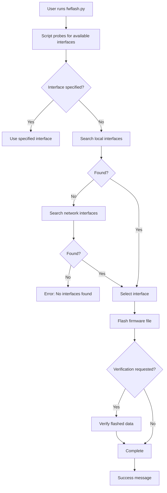
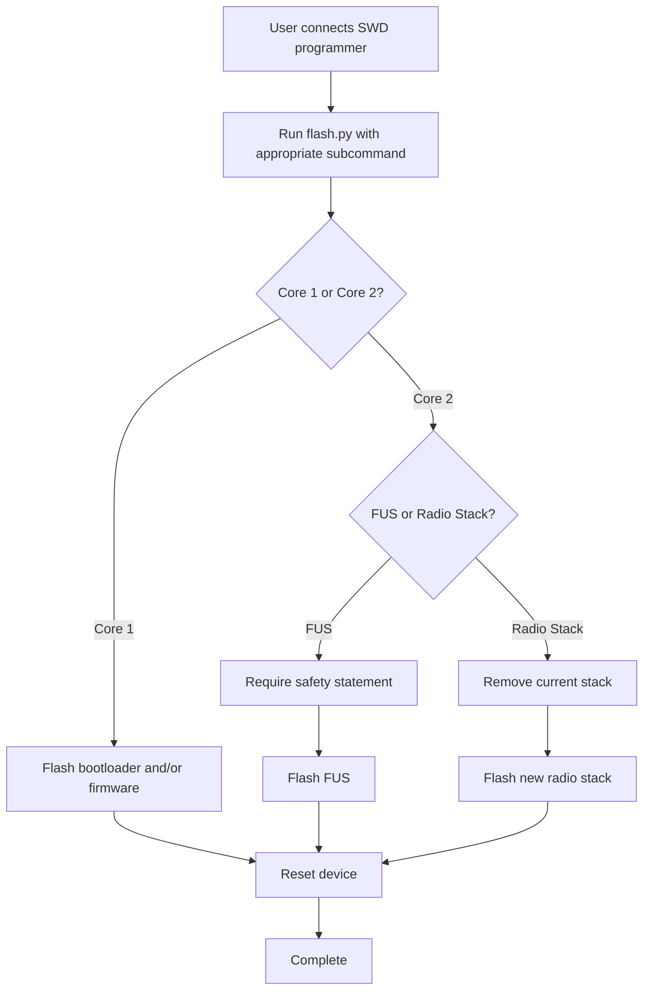
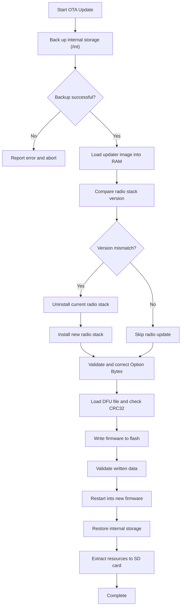
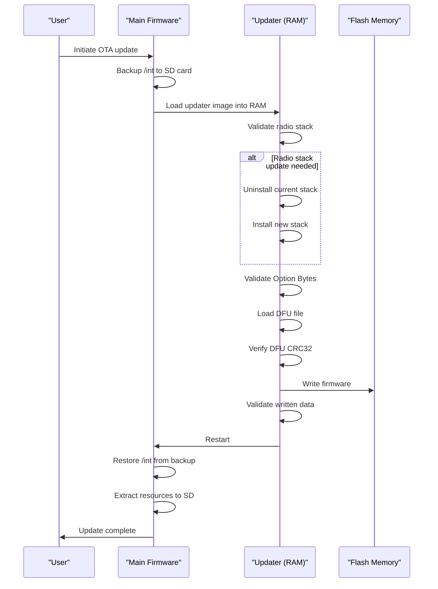

# Flashing and Deployment

<cite>
**Referenced Files in This Document**   
- [update.py](file://scripts/update.py)
- [flash.py](file://scripts/flash.py)
- [fwflash.py](file://scripts/fwflash.py)
- [update_manifest.c](file://lib/update_util/update_manifest.c)
- [update_operation.c](file://lib/update_util/update_operation.c)
- [dfu_file.c](file://lib/update_util/dfu_file.c)
- [OTA.md](file://documentation/OTA.md)
</cite>

## Table of Contents
1. [Introduction](#introduction)
2. [Flashing Methods](#flashing-methods)
3. [Firmware Image Structure](#firmware-image-structure)
4. [Update Manifest Format](#update-manifest-format)
5. [Over-the-Air Updates](#over-the-air-updates)
6. [Step-by-Step Deployment Guides](#step-by-step-deployment-guides)
7. [Recovery Procedures](#recovery-procedures)
8. [Troubleshooting Common Issues](#troubleshooting-common-issues)
9. [Developer Workflows](#developer-workflows)

## Introduction
The Flipper Zero firmware update system provides multiple methods for flashing and deploying firmware updates. This document covers the complete ecosystem of flashing methods, including USB flashing, recovery mode operations, and over-the-air (OTA) updates. The system is designed to be both user-friendly for end users and flexible for developers, with robust verification procedures and recovery mechanisms to prevent bricking devices during the update process.

The firmware update architecture separates the update process into distinct components: the update manifest that describes the update package, the DFU (Device Firmware Upgrade) file containing the actual firmware, and various utility scripts that facilitate the flashing process. The system also includes comprehensive error handling and rollback capabilities to ensure device safety during updates.

**Section sources**
- [OTA.md](file://documentation/OTA.md#ota_updates)

## Flashing Methods

### USB Flashing
USB flashing is the primary method for updating Flipper Zero firmware. This method uses the `fwflash.py` script located in the scripts directory, which supports multiple programmer interfaces including CMSIS-DAP, ST-Link, and Black Magic Probe (both USB and network variants).

The `fwflash.py` script implements a flexible interface system that automatically detects available programmers when no specific interface is specified. It supports verification of flashed data and provides detailed progress feedback during the flashing process. The script can work with both binary (.bin) and ELF format files, though it requires the ELF file to be present when flashing binary files with the Black Magic Probe due to GDB limitations.



**Diagram sources**
- [fwflash.py](file://scripts/fwflash.py)

**Section sources**
- [fwflash.py](file://scripts/fwflash.py)

### Recovery Mode Flashing
Recovery mode flashing is designed for situations where the main firmware is corrupted or otherwise non-functional. This method uses the `flash.py` script, which provides low-level access to the Flipper Zero's dual-core architecture.

The recovery mode supports flashing both Core 1 (main application processor) and Core 2 (wireless coprocessor) components separately or together. For Core 1, users can flash both the bootloader and main firmware. For Core 2, the script allows flashing the Firmware Update Service (FUS) and radio stack, with appropriate safety warnings to prevent accidental erasure of the crypto enclave.

The recovery process requires physical access to the SWD (Serial Wire Debug) pins on the device and a compatible programmer. The script implements safety checks, including requiring a specific statement to be passed when flashing the FUS to prevent accidental execution of this dangerous operation.



**Diagram sources**
- [flash.py](file://scripts/flash.py)

**Section sources**
- [flash.py](file://scripts/flash.py)

### Over-the-Air Updates
Over-the-air (OTA) updates allow users to update their Flipper Zero firmware without connecting it to a computer. This process is designed to be safe and reliable, with multiple verification steps to prevent bricking the device.

The OTA update process executes in three distinct stages: backing up internal storage, performing the device update, and restoring internal storage while updating resources. The update runs from RAM, which gives it full access to the device's flash memory while protecting the currently running firmware.

The system uses a fail-safe design that validates all components before making any changes to the device's flash memory. If an error occurs during the update process, the system reports a detailed error code that indicates both the stage of failure and specific progress within that stage.



**Diagram sources**
- [OTA.md](file://documentation/OTA.md#how_does_flipper_ota_work)

**Section sources**
- [OTA.md](file://documentation/OTA.md#how_does_flipper_ota_work)

## Firmware Image Structure

### DFU File Format
The DFU (Device Firmware Upgrade) file format is used to package the firmware for flashing to the Flipper Zero. The format consists of headers followed by the actual firmware image data and ends with a suffix containing metadata and a CRC32 checksum.

The DFU file validation process checks several components to ensure integrity:
- Signature verification ("DfuSe")
- Version compatibility (0x011A)
- Vendor, product, and device ID matching
- CRC32 validation of the entire file

The CRC32 validation uses a specific method where the CRC of the entire file (including the embedded CRC) should equal 0xFFFFFFFF, indicating that the embedded CRC is the inverse of the CRC of the preceding data.

```c
bool dfu_file_validate_crc(File* dfuf, const DfuPageTaskProgressCb progress_cb, void* context) {
    uint32_t file_crc = crc32_calc_file(dfuf, progress_cb, context);
    return file_crc == VALID_WHOLE_FILE_CRC; // 0xFFFFFFFF
}
```

The DFU file may contain multiple targets, each with one or more image elements. Each image element specifies a memory address and size for the data that follows. The flashing process handles each page of flash memory individually, ensuring proper alignment and using the appropriate flash programming functions for each memory region.

**Section sources**
- [dfu_file.c](file://lib/update_util/dfu_file.c)

### Memory Layout
The Flipper Zero firmware follows a specific memory layout that reserves different regions for various components:

- **Bootloader**: 0x08000000 - 0x08007FFF (32KB)
- **Main Firmware**: 0x08008000 - 0x080E0000 (896KB)
- **Radio Stack**: 0x080E0000 - 0x080FFFFF (128KB)
- **LFS (LittleFS)**: Remaining space after firmware and radio stack

The layout is designed to allow firmware updates of different sizes while preserving the radio stack and internal storage. The update process calculates the available space for the LFS partition based on the size of the new firmware and radio stack, ensuring that at least six LFS pages (24KB) are available for internal storage.


**Diagram sources**
- [update.py](file://scripts/update.py#layout_check)
- [OTA.md](file://documentation/OTA.md#how_does_flipper_ota_work)

**Section sources**
- [update.py](file://scripts/update.py#layout_check)

## Update Manifest Format

### Manifest Structure
The update manifest is a text file in the Flipper File Format that describes the contents of an update package. It contains key-value pairs that specify the components of the update and their properties.

The manifest must contain several mandatory fields in a specific order:
- **Filetype**: A constant string "Flipper firmware upgrade configuration"
- **Version**: The manifest version (currently 2)
- **Info**: A descriptive string about the package contents
- **Target**: The hardware revision the package is built for
- **Loader**: The filename of the stage 2 loader
- **Loader CRC**: The CRC32 of the loader file (in little-endian hex)

Optional fields include:
- **Firmware**: The DFU file name
- **Radio**: The radio stack image filename
- **Radio address**: Installation address for the radio stack
- **Radio version**: Version information for the radio stack
- **Radio CRC**: CRC32 of the radio image
- **Resources**: TAR archive with resources for the SD card
- **OB reference**, **OB mask**, **OB write mask**: Option byte configuration

```c
#define MANIFEST_KEY_INFO          "Info"
#define MANIFEST_KEY_TARGET        "Target"
#define MANIFEST_KEY_LOADER_FILE   "Loader"
#define MANIFEST_KEY_LOADER_CRC    "Loader CRC"
#define MANIFEST_KEY_DFU_FILE      "Firmware"
#define MANIFEST_KEY_RADIO_FILE    "Radio"
#define MANIFEST_KEY_RADIO_ADDRESS "Radio address"
#define MANIFEST_KEY_RADIO_VERSION "Radio version"
#define MANIFEST_KEY_RADIO_CRC     "Radio CRC"
#define MANIFEST_KEY_ASSETS_FILE   "Resources"
#define MANIFEST_KEY_OB_REFERENCE  "OB reference"
#define MANIFEST_KEY_OB_MASK       "OB mask"
#define MANIFEST_KEY_OB_WRITE_MASK "OB write mask"
#define MANIFEST_KEY_SPLASH_FILE   "Splashscreen"
```

**Section sources**
- [update_manifest.c](file://lib/update_util/update_manifest.c)
- [OTA.md](file://documentation/OTA.md#update_manifest)

### Manifest Validation
The update manifest is validated through several steps to ensure its integrity and compatibility with the target device. The validation process checks:

1. Header information and manifest version
2. Hardware target compatibility
3. Presence and integrity of the stage 2 loader
4. At least one update component (firmware, radio, or resources)

The validation code also performs sanity checks on the Option Byte data to ensure that mask values are consistent and that reference values don't have unmasked bits, which could lead to unintended changes to the device's configuration.

```c
bool update_manifest_init(UpdateManifest* update_manifest, const char* manifest_filename) {
    Storage* storage = furi_record_open(RECORD_STORAGE);
    FlipperFormat* flipper_file = flipper_format_file_alloc(storage);
    if(flipper_format_file_open_existing(flipper_file, manifest_filename)) {
        update_manifest_init_from_ff(update_manifest, flipper_file);
    }
    
    flipper_format_free(flipper_file);
    furi_record_close(RECORD_STORAGE);
    
    return update_manifest->valid;
}
```

The manifest validation also checks that there is sufficient free space in internal storage (at least 8KB, equivalent to 4 LFS pages) before proceeding with the update to ensure that the backup process can complete successfully.

**Section sources**
- [update_manifest.c](file://lib/update_util/update_manifest.c)
- [update_operation.c](file://lib/update_util/update_operation.c)

## Over-the-Air Updates

### OTA Update Process
The over-the-air update process is designed to be fail-safe and resilient to interruptions. It executes in three distinct stages, each with its own verification and error handling mechanisms.

**Stage 1: Backing up internal storage**
Before any changes are made to the firmware, the current configuration stored in the internal flash partition (/int) is backed up to a tar archive on the SD card. This ensures that user settings and data are preserved even if the update process is interrupted.

**Stage 2: Performing device update**
The main firmware loads a specialized updater image into RAM and transfers control to it. This updater has full access to the device's flash memory and performs the following operations:
- Radio stack update (if version differs)
- Option byte validation and correction
- Firmware flashing with CRC32 verification
- Flash memory validation

**Stage 3: Restoration and resource update**
After the device restarts with the new firmware, it restores the previously backed-up internal storage contents. If the update package includes additional resources, they are extracted to the SD card.



**Diagram sources**
- [OTA.md](file://documentation/OTA.md#how_does_flipper_ota_work)

**Section sources**
- [OTA.md](file://documentation/OTA.md#how_does_flipper_ota_work)

### Error Handling and Recovery
The OTA update process includes comprehensive error handling with detailed error codes that help diagnose issues. Error codes follow the format [XX-YY], where XX represents the failed operation and YY provides additional context about the progress when the error occurred.

The system is designed to be as fail-safe as possible, with all risky operations preceded by validation of the relevant data. This prevents the device from being left in a partially updated or bricked state. Even if an error occurs, the updater allows retrying failed operations and provides clear feedback about the current state.

Common error codes include:
- **1-13**: Hardware version mismatch
- **2-0-100**: File system read/write error during LFS backup
- **9-0-100**: DFU file validation errors
- **10-0-100**: Flash memory write errors
- **12-0-100**: LFS restoration errors

The error handling system ensures that if an update fails, the device can typically be recovered by retrying the update process or using alternative flashing methods.

**Section sources**
- [OTA.md](file://documentation/OTA.md#ota_update_error_codes)

## Step-by-Step Deployment Guides

### Standard Firmware Update
To perform a standard firmware update via USB:

1. Connect your Flipper Zero to your computer via USB
2. Navigate to the firmware repository directory
3. Run the flashing command:
```bash
python3 scripts/fwflash.py path/to/firmware.bin
```
4. The script will automatically detect available programmers and flash the firmware
5. Wait for the completion message before disconnecting the device

For more control, you can specify the interface and serial number:
```bash
python3 scripts/fwflash.py --interface cmsis-dap --serial ABC123DE firmware.bin
```

### OTA Update Package Creation
To create a full OTA update package:

```bash
./fbt COMPACT=1 DEBUG=0 updater_package
```

This generates a package containing:
- Firmware DFU file
- Radio stack
- Resources for the SD card
- Update manifest

For a minimal package with only the firmware:
```bash
./fbt COMPACT=1 DEBUG=0 updater_minpackage
```

To customize the radio stack in the update package:
```bash
./fbt updater_package COMPACT=1 DEBUG=0 COPRO_OB_DATA=scripts/ob_custradio.data COPRO_STACK_BIN=stm32wb5x_BLE_Stack_full_fw.bin COPRO_STACK_TYPE=ble_full
```

### Partial Update Package Creation
For specialized update scenarios, you can create partial update packages using the update.py script directly. For example, to create a package that only updates the BLE FULL stack:

```bash
scripts/update.py generate \
  -t f7 -d r13.3_full -v "BLE FULL 13.3" \
  --stage dist/f7/flipper-z-f7-updater-*.bin \
  --radio lib/stm32wb_copro/firmware/stm32wb5x_BLE_Stack_full_fw.bin \
  --radiotype ble_full
```

This approach allows for fine-grained control over the update package contents, enabling targeted updates for specific components.

**Section sources**
- [update.py](file://scripts/update.py)
- [OTA.md](file://documentation/OTA.md#building_update_packages)

## Recovery Procedures

### Recovery Mode Access
When the main firmware is non-functional, recovery mode can be accessed through physical connection to the SWD pins. This requires:

1. A compatible SWD programmer (ST-Link, Black Magic Probe, etc.)
2. Physical access to the SWD pins on the Flipper Zero
3. The appropriate flashing script and firmware files

To enter recovery mode, connect the programmer to the SWD pins and ensure the device is powered. The device does not need to be in any special state, as the programmer can directly access the debug interface.

### Core 1 Recovery
To recover the main processor (Core 1):

```bash
python3 scripts/flash.py core1 bootloader.bin firmware.bin
```

This command flashes both the bootloader and main firmware. Alternatively, you can flash them separately:

```bash
# Flash bootloader only
python3 scripts/flash.py core1bootloader bootloader.bin

# Flash firmware only  
python3 scripts/flash.py core1firmware firmware.bin
```

### Core 2 Recovery
To recover the wireless coprocessor (Core 2):

```bash
python3 scripts/flash.py core2radio radio_stack.bin --addr 0x080E0000
```

This command removes the current radio stack and installs the new one at the specified address. The address should match the value specified in the radio stack's release notes.

**Warning**: Flashing the Firmware Update Service (FUS) should only be done in factory conditions, as it erases the crypto enclave. If absolutely necessary:

```bash
python3 scripts/flash.py core2fus --statement "AGREE_TO_LOSE_FLIPPER_FEATURES_THAT_USE_CRYPTO_ENCLAVE" 0x080E0000 fus.bin
```

**Section sources**
- [flash.py](file://scripts/flash.py)

## Troubleshooting Common Issues

### Flashing Failures
Common causes of flashing failures and their solutions:

**"No available interfaces" error**
- Ensure your programmer is connected and powered
- Check that the programmer drivers are installed
- Try specifying the interface and serial number explicitly
- Verify that System > Debug is enabled on the Flipper Zero

**CRC validation errors**
- Redownload the firmware file, as it may be corrupted
- Try a different USB cable
- Ensure the file path doesn't contain special characters

**Insufficient space errors**
- Free up space on the internal storage
- Remove unnecessary files from the SD card
- Use a minimal update package

### OTA Update Problems
**Update fails at radio stack installation**
- Ensure the radio stack address matches the release notes
- Verify that the radio stack file is compatible with your hardware revision
- Check that there is sufficient free space in internal storage

**Device fails to boot after update**
- Try recovery mode flashing with the previous firmware version
- Ensure the bootloader is compatible with the main firmware
- Check that the flash memory layout is correct

**Internal storage not restored**
- Verify that the backup was created successfully
- Check that the SD card has sufficient free space
- Ensure the file system is not corrupted

### Recovery Mode Issues
**Cannot connect to SWD interface**
- Check that the SWD connections are correct and secure
- Verify that the programmer is functioning with other devices
- Ensure the Flipper Zero has power
- Try resetting the device while maintaining the SWD connection

**"SW-DP scan failed" error**
- Clean the SWD pin contacts
- Try different connection cables
- Ensure no other processes are using the programmer
- Try a different programmer if available

**Section sources**
- [fwflash.py](file://scripts/fwflash.py)
- [flash.py](file://scripts/flash.py)
- [OTA.md](file://documentation/OTA.md#ota_update_error_codes)

## Developer Workflows

### Automated Update Scripts
The repository includes several Python scripts to automate the update process:

**update.py** - Generates update packages with custom configurations:
- Creates the update manifest with proper CRC values
- Packages resources into compressed tar archives
- Validates memory layout to prevent conflicts
- Generates splash screens for the update process

**flash.py** - Provides low-level flashing capabilities:
- Supports multiple programmer types
- Implements safety checks for dangerous operations
- Allows flashing of individual components
- Provides detailed logging and error reporting

**fwflash.py** - User-friendly flashing interface:
- Automatically detects available programmers
- Supports verification of flashed data
- Provides progress feedback
- Handles both binary and ELF files

These scripts can be integrated into continuous integration systems to automate firmware deployment and testing.

### Version Management
The update system includes several mechanisms for version management:

**Manifest versioning**: The update manifest has its own version number (currently 2) that allows for backward compatibility while supporting new features in future versions.

**Hardware targeting**: Update packages specify the target hardware revision, preventing incompatible firmware from being installed.

**Radio stack versioning**: The radio stack version is encoded in six hex bytes containing major, minor, sub, branch, release, and stack type information, allowing precise version matching.

**Rollback prevention**: Once a device is updated to a newer firmware version, it cannot be downgraded to prevent security vulnerabilities from being reintroduced.

Developers should follow semantic versioning principles and update the manifest version when introducing changes that affect the update process itself.

```python
@staticmethod
def copro_version_as_int(coprometa, stacktype):
    major = coprometa.img_sig.version_major
    minor = coprometa.img_sig.version_minor
    sub = coprometa.img_sig.version_sub
    branch = coprometa.img_sig.version_branch
    release = coprometa.img_sig.version_build
    stype = get_stack_type(stacktype)
    return (
        major
        | (minor << 8)
        | (sub << 16)
        | (branch << 24)
        | (release << 32)
        | (stype << 40)
    )
```

**Section sources**
- [update.py](file://scripts/update.py)
- [update_manifest.c](file://lib/update_util/update_manifest.c)