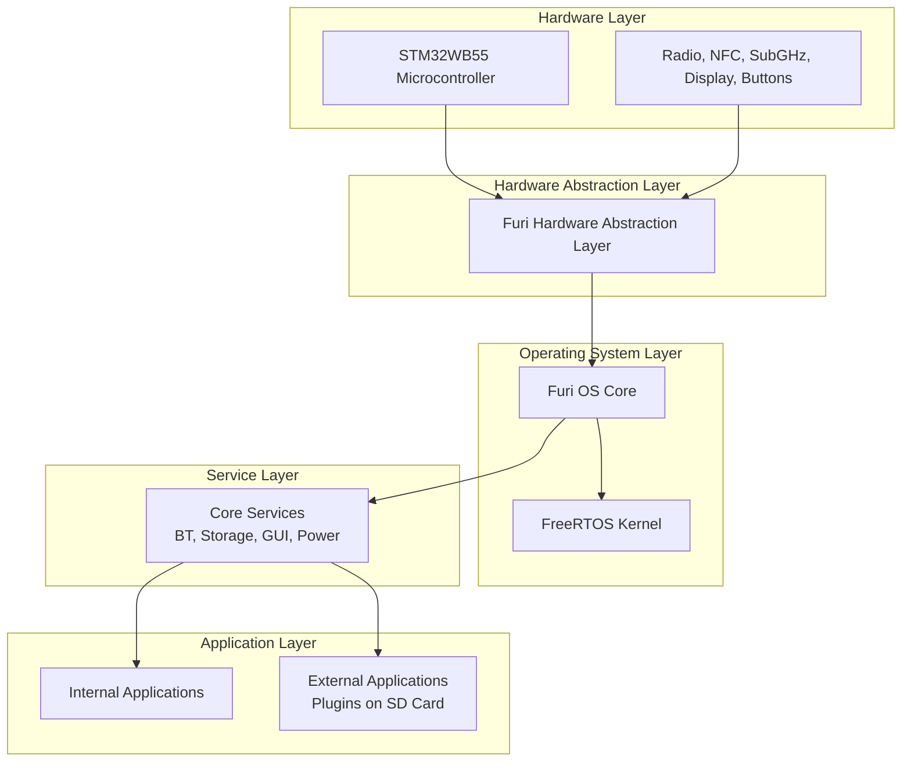
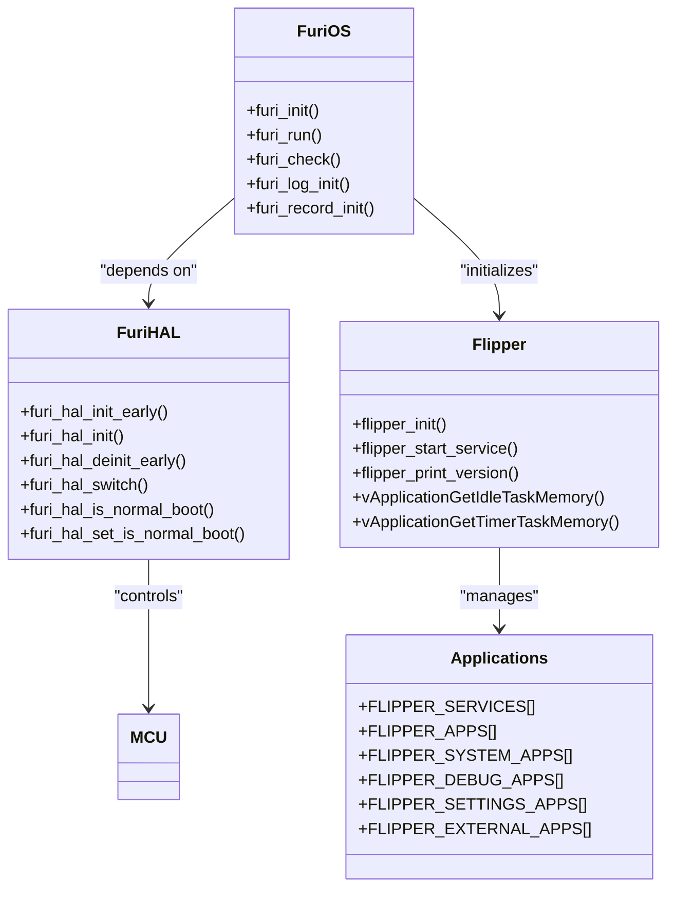
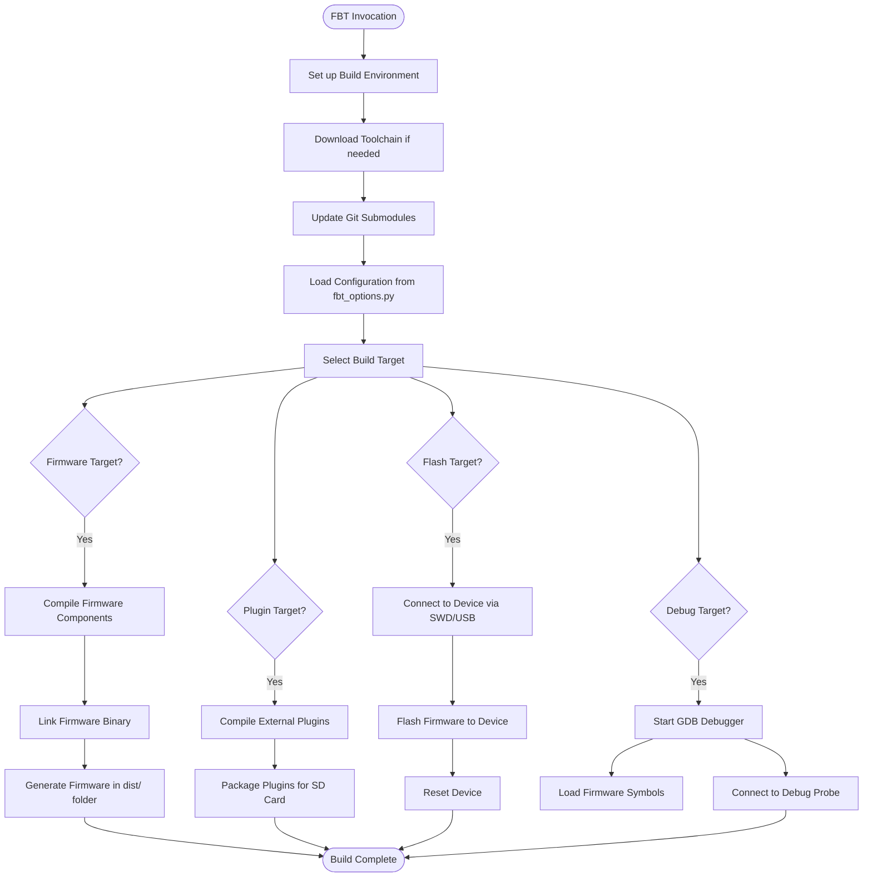
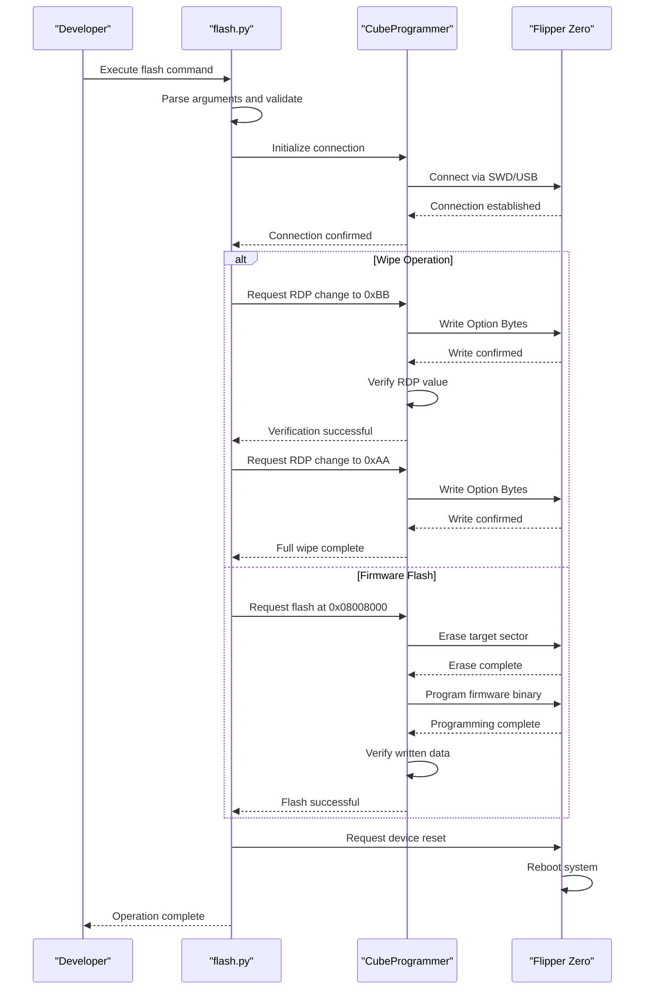
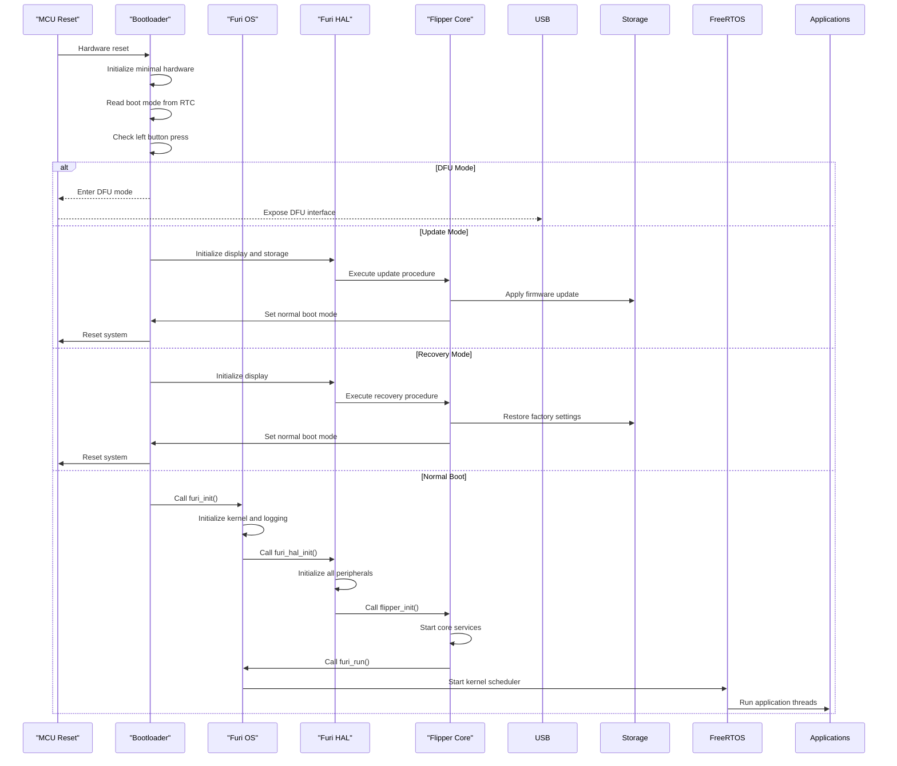

# System Architecture

<cite>
**Referenced Files in This Document**   
- [furi.c](file://furi/furi.c#L1-L21)
- [flipper.c](file://furi/flipper.c#L1-L88)
- [main.c](file://targets/f7/src/main.c#L1-L81)
- [applications.h](file://applications/services/applications.h#L1-L80)
- [furi_hal.h](file://targets/furi_hal_include/furi_hal.h#L1-L79)
- [target.json](file://targets/f7/target.json#L1-L60)
- [fbt.md](file://documentation/fbt.md#L1-L132)
- [flash.py](file://scripts/flash.py#L1-L176)
</cite>

## Table of Contents
1. [Introduction](#introduction)
2. [Firmware Architecture Overview](#firmware-architecture-overview)
3. [Core Components](#core-components)
4. [Build System (FBT)](#build-system-fbt)
5. [Flashing and Deployment](#flashing-and-deployment)
6. [Debugging and Testing](#debugging-and-testing)
7. [Memory Layout and Boot Process](#memory-layout-and-boot-process)
8. [Recovery Modes](#recovery-modes)

## Introduction
The Flipper Zero firmware architecture is a sophisticated embedded system designed for a multi-functional hardware platform. This document provides a comprehensive analysis of the firmware's foundational components, including its operating system core, hardware abstraction layer, application framework, build system, and deployment methodologies. The architecture follows a layered approach with clear separation between hardware abstraction, operating system services, and application logic. The system is built on FreeRTOS with a custom Furi OS layer providing additional abstractions and services. The firmware supports both internal applications compiled into the main firmware image and external applications loaded from the SD card, enabling extensibility and modularity.

## Firmware Architecture Overview

**Diagram sources**
- [furi_hal.h](file://targets/furi_hal_include/furi_hal.h#L1-L79)
- [furi.c](file://furi/furi.c#L1-L21)
- [flipper.c](file://furi/flipper.c#L1-L88)

**Section sources**
- [furi.c](file://furi/furi.c#L1-L21)
- [flipper.c](file://furi/flipper.c#L1-L88)
- [furi_hal.h](file://targets/furi_hal_include/furi_hal.h#L1-L79)

## Core Components

The Flipper Zero firmware architecture consists of several key components that work together to provide a robust and extensible platform. At the foundation is the Furi OS, a custom operating system layer built on top of FreeRTOS that provides additional abstractions and services specific to the Flipper Zero hardware. The Furi Hardware Abstraction Layer (Furi HAL) provides a consistent interface to the underlying STM32WB55 microcontroller and its peripherals, allowing the higher layers to interact with hardware in a platform-agnostic manner. The application framework supports both internal applications compiled into the firmware image and external applications (plugins) that can be loaded from the SD card, enabling extensibility without requiring firmware recompilation.

The system follows a microkernel-like architecture where core services are implemented as separate components that communicate through well-defined interfaces. These services include Bluetooth, storage management, graphical user interface, power management, and various radio protocols. The loader component is responsible for managing application lifecycle, including loading, starting, and terminating applications based on user interaction or system events.

**Diagram sources**
- [furi.c](file://furi/furi.c#L1-L21)
- [flipper.c](file://furi/flipper.c#L1-L88)
- [applications.h](file://applications/services/applications.h#L1-L80)
- [furi_hal.h](file://targets/furi_hal_include/furi_hal.h#L1-L79)

**Section sources**
- [furi.c](file://furi/furi.c#L1-L21)
- [flipper.c](file://furi/flipper.c#L1-L88)
- [applications.h](file://applications/services/applications.h#L1-L80)

## Build System (FBT)

The Flipper Build Tool (FBT) is a SCons-based build system that serves as the primary interface for compiling, building, and managing the Flipper Zero firmware. FBT acts as a wrapper around the SCons build system, providing a simplified command-line interface for common development tasks. The build system is designed to be self-contained, automatically downloading and configuring the necessary toolchain components without contaminating the host system's environment.

FBT supports a wide range of targets for different development and deployment scenarios. High-level targets include `fw_dist` for building the complete firmware, `fap_dist` for building external plugins, and `updater_package` for creating self-update packages. The build system also includes targets for flashing firmware to devices (`flash`, `flash_usb`), debugging (`debug`, `blackmagic`), and code quality checks (`lint`, `format`, `doxygen`).

**Diagram sources**
- [fbt.md](file://documentation/fbt.md#L1-L132)
- [target.json](file://targets/f7/target.json#L1-L60)

**Section sources**
- [fbt.md](file://documentation/fbt.md#L1-L132)

## Flashing and Deployment

The firmware flashing and deployment process for Flipper Zero involves multiple methods and tools to accommodate different development and user scenarios. The primary deployment method for end users is USB-based updating through the qFlipper application or web updater, which allows for safe firmware updates without requiring specialized hardware. For development and advanced users, SWD (Serial Wire Debug) flashing provides a more direct method of programming the device.

The `flash.py` script provides a comprehensive command-line interface for flashing different components of the Flipper Zero system. This includes the ability to flash the Core 1 bootloader and firmware, the Core 2 Firmware Update Service (FUS), and the radio stack. The script uses STMicroelectronics' CubeProgrammer protocol to communicate with the device, supporting both SWD and USB connections. Special precautions are implemented to prevent accidental erasure of the crypto enclave, requiring explicit confirmation for potentially destructive operations.

**Diagram sources**
- [flash.py](file://scripts/flash.py#L1-L176)

**Section sources**
- [flash.py](file://scripts/flash.py#L1-L176)
- [main.c](file://targets/f7/src/main.c#L1-L81)

## Debugging and Testing

The Flipper Zero firmware development environment includes comprehensive debugging and testing capabilities to support both hardware and software development. The primary debugging interface is provided through the Dev Board, which enables debugging via Wi-Fi or USB connections. This allows developers to connect GDB (GNU Debugger) to the running firmware, set breakpoints, inspect variables, and analyze system state without requiring physical access to the device.

The build system includes several debugging targets that streamline the development workflow. The `debug` target compiles the firmware, flashes it to the connected device, and automatically attaches GDB with the firmware symbols loaded. The `blackmagic` target specifically supports debugging with the Blackmagic probe, which is integrated into the Wi-Fi Dev Board. For developers without specialized hardware, the `cli` target provides a command-line interface over USB for basic system interaction and debugging.

Unit testing is supported through the `unit_tests` application, which can be built and executed to verify the functionality of individual components. The testing framework allows for both automated and interactive testing, with results output to the console or log files. Additional debugging tools include the ability to generate Doxygen documentation (`doxygen` target), run static analysis with PVS Studio (`firmware_pvs`), and format code according to project standards (`lint`, `format`).

**Section sources**
- [fbt.md](file://documentation/fbt.md#L1-L132)
- [documentation/devboard/Debugging via the Devboard.md](file://documentation/devboard/Debugging via the Devboard.md)
- [applications/debug/unit_tests](file://applications/debug/unit_tests)

## Memory Layout and Boot Process

The memory layout and boot process of the Flipper Zero firmware follows a structured sequence designed for reliability and flexibility. The system uses the STM32WB55 microcontroller with separate memory spaces for the main application (Core 1) and the wireless coprocessor (Core 2). The main firmware is stored in flash memory starting at address 0x08008000, while the bootloader occupies the space from 0x08000000 to 0x08008000.

The boot process begins with the initialization of the Furi OS core, which sets up the FreeRTOS kernel and essential system services. The `main()` function in `main.c` performs early hardware initialization through `furi_hal_init_early()`, which configures critical peripherals before the operating system starts. The system then checks the boot mode by reading the RTC (Real-Time Clock) boot mode register, which determines whether to proceed with a normal boot, enter DFU (Device Firmware Upgrade) mode, perform a firmware update, or enter recovery mode.

**Diagram sources**
- [main.c](file://targets/f7/src/main.c#L1-L81)
- [furi.c](file://furi/furi.c#L1-L21)
- [flipper.c](file://furi/flipper.c#L1-L88)

**Section sources**
- [main.c](file://targets/f7/src/main.c#L1-L81)
- [furi.c](file://furi/furi.c#L1-L21)
- [flipper.c](file://furi/flipper.c#L1-L88)

## Recovery Modes

The Flipper Zero firmware implements several recovery modes to handle various system states and user requirements. These modes are triggered by specific button combinations during boot or by setting the boot mode in the RTC (Real-Time Clock) memory. The recovery modes provide mechanisms for firmware updates, factory resets, and diagnostic operations when the normal system operation is not possible.

The primary recovery modes include:
- **DFU Mode**: Triggered by pressing the left button during boot or setting the boot mode to DFU. This mode exposes a USB DFU interface that allows firmware updates through standard USB protocols without requiring specialized flashing tools.
- **Update Mode**: Activated when the system needs to apply a firmware update. This mode loads the update package from the SD card, verifies its integrity, and applies the update before rebooting into normal mode.
- **Recovery Mode**: Entered by pressing the up button during boot. This mode performs a factory reset, clearing user data and settings while preserving the firmware. It's useful for troubleshooting configuration issues or preparing the device for resale.
- **Special Boot Modes**: Additional modes for debugging and development, including post-update and pre-update states that allow for verification of update operations.

These recovery modes are implemented in the `main()` function of `main.c`, which checks the boot mode and button states before proceeding with the normal initialization sequence. The use of the RTC memory to store the boot mode allows for persistent state across power cycles, ensuring that update and recovery operations can complete even if interrupted by power loss.

**Section sources**
- [main.c](file://targets/f7/src/main.c#L1-L81)
- [furi_hal_rtc.h](file://targets/furi_hal_include/furi_hal_rtc.h)