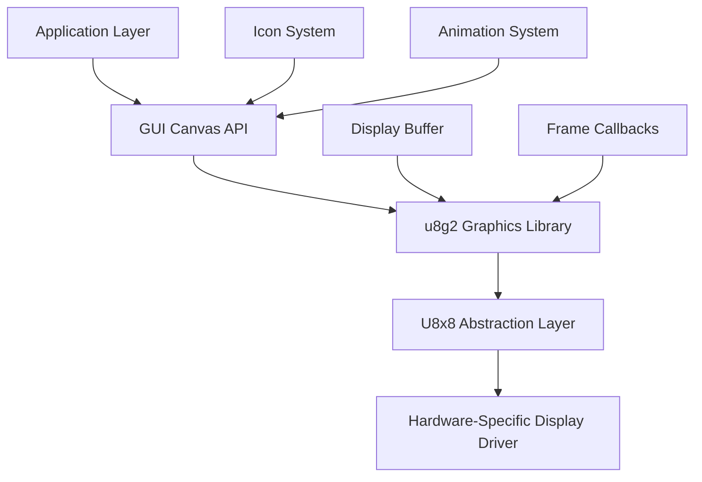
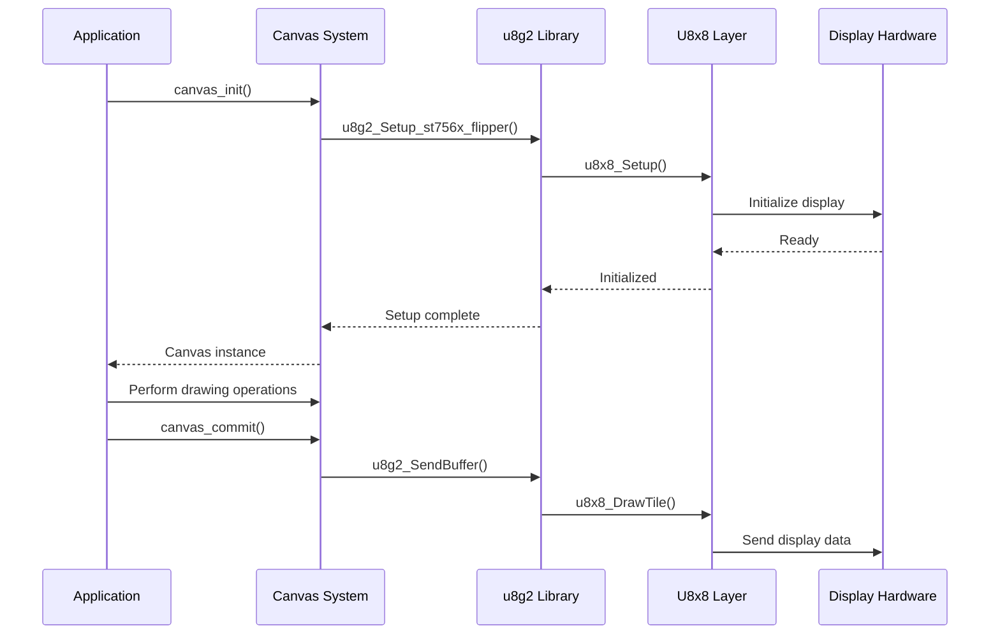
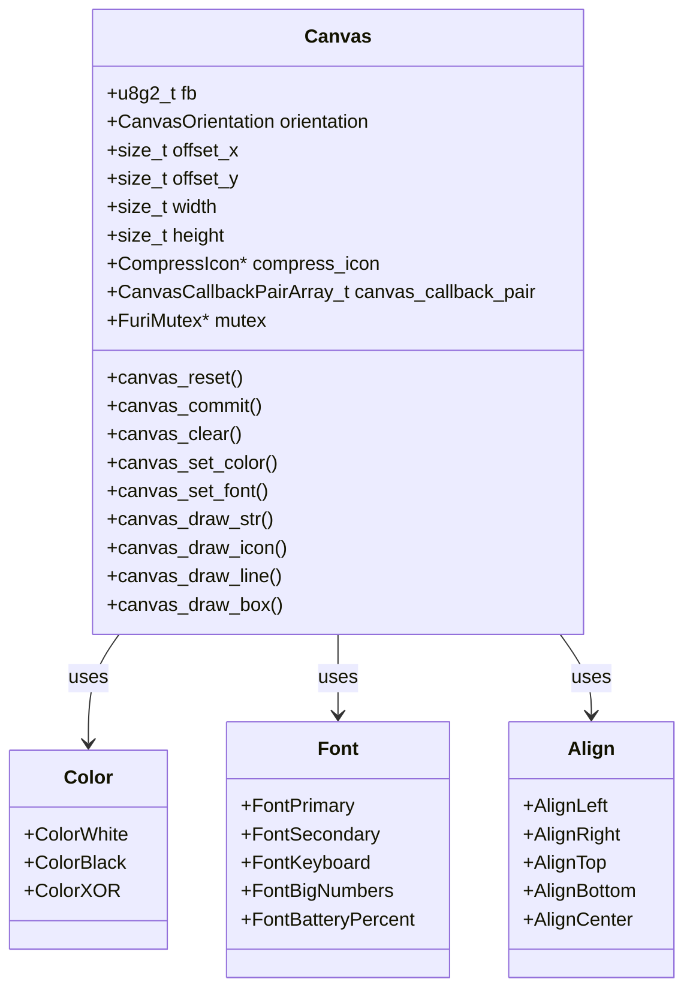
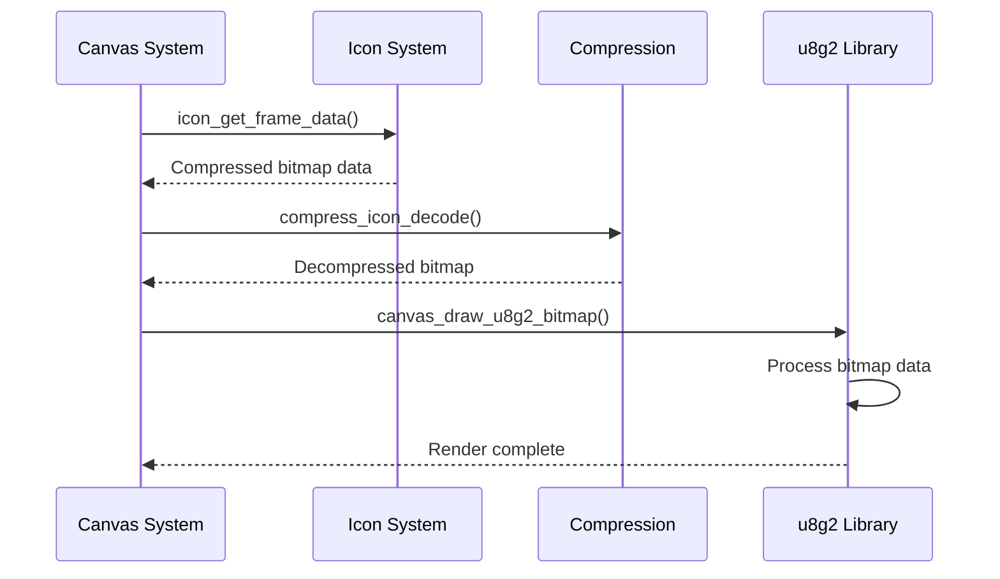
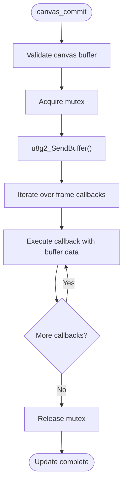
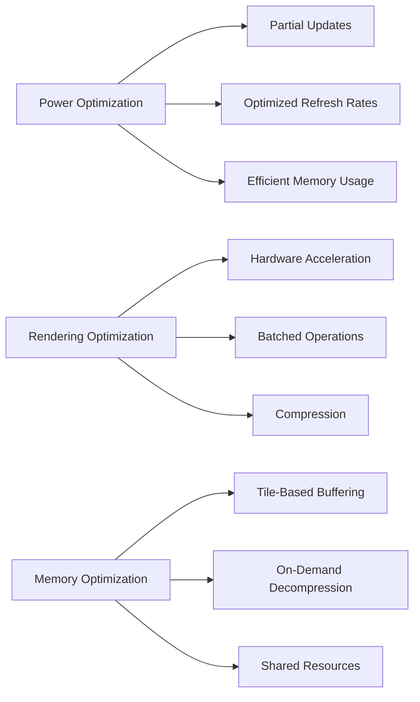

# Display Rendering

<cite>
**Referenced Files in This Document**   
- [canvas.h](file://applications/services/gui/canvas.h)
- [canvas.c](file://applications/services/gui/canvas.c)
- [u8g2.h](file://lib/u8g2/u8g2.h)
- [u8g2_buffer.c](file://lib/u8g2/u8g2_buffer.c)
- [u8g2_setup.c](file://lib/u8g2/u8g2_setup.c)
- [icon.h](file://applications/services/gui/icon.h)
- [icon_animation.h](file://applications/services/gui/icon_animation.h)
- [display_test.c](file://applications/debug/display_test/display_test.c)
</cite>

## Table of Contents
1. [Introduction](#introduction)
2. [Architecture Overview](#architecture-overview)
3. [u8g2 Graphics Library Integration](#u8g2-graphics-library-integration)
4. [Canvas Operations](#canvas-operations)
5. [Icon and Animation Rendering](#icon-and-animation-rendering)
6. [Screen Update Mechanisms](#screen-update-mechanisms)
7. [Performance Optimization](#performance-optimization)
8. [Common Issues and Solutions](#common-issues-and-solutions)

## Introduction
The Flipper Zero's display rendering system is built around the u8g2 graphics library, which provides comprehensive support for monochrome display management. This document details the architecture and integration of the u8g2 library within the Flipper Zero firmware, focusing on initialization, buffer management, screen refresh mechanisms, and practical implementation details for canvas operations, icon rendering, and animation handling. The system is designed to efficiently manage the 128x64 pixel monochrome display while addressing common issues such as flickering, ghosting, and memory constraints.

## Architecture Overview

**Diagram sources**
- [canvas.h](file://applications/services/gui/canvas.h#L1-L456)
- [u8g2.h](file://lib/u8g2/u8g2.h#L1-L6022)

The display rendering architecture follows a layered approach, with the application layer interacting with the GUI Canvas API, which in turn interfaces with the u8g2 graphics library. The u8g2 library provides a hardware-agnostic interface that abstracts the underlying display controller through the U8x8 abstraction layer. This architecture enables efficient rendering operations while maintaining compatibility with various display hardware.

## u8g2 Graphics Library Integration

The u8g2 library is integrated into the Flipper Zero firmware as the primary graphics management system for the monochrome display. The integration follows a structured initialization process that configures the display controller and sets up the rendering environment.

**Diagram sources**
- [canvas.c](file://applications/services/gui/canvas.c#L18-L40)
- [u8g2_setup.c](file://lib/u8g2/u8g2_setup.c#L72-L119)

The u8g2 library initialization begins with the `canvas_init()` function, which allocates memory for the canvas structure and initializes the u8g2 context using the `u8g2_Setup_st756x_flipper()` function. This setup function configures the u8g2 instance for the specific ST756x display controller used in the Flipper Zero, specifying the rotation mode (U8G2_R0), the hardware interface (u8x8_hw_spi_stm32), and the GPIO/delay callback (u8g2_gpio_and_delay_stm32).

After initialization, the display is powered on with `u8g2_SetPowerSave(&canvas->fb, 0)` and the buffer is cleared and sent to the display with `canvas_clear()` and `canvas_commit()`. The u8g2 library operates in full buffer mode, maintaining an in-memory representation of the entire display content that is periodically refreshed to the physical display.

## Canvas Operations

The canvas system provides a high-level API for drawing operations, abstracting the underlying u8g2 library functions. The canvas structure maintains state information including drawing color, font selection, orientation, and coordinate transformations.

**Diagram sources**
- [canvas.h](file://applications/services/gui/canvas.h#L1-L456)
- [canvas.c](file://applications/services/gui/canvas.c#L1-L671)

The canvas API provides functions for various drawing operations:

- **Text rendering**: The `canvas_draw_str()` and `canvas_draw_str_aligned()` functions render text using the currently selected font. The system supports multiple built-in fonts including primary, secondary, keyboard, big numbers, and battery percentage fonts.
- **Primitive shapes**: Functions like `canvas_draw_line()`, `canvas_draw_box()`, `canvas_draw_circle()`, and `canvas_draw_triangle()` enable drawing of basic geometric shapes.
- **Bitmap operations**: The `canvas_draw_bitmap()` and `canvas_draw_xbm()` functions render bitmap images, with support for compressed bitmap data.
- **Coordinate system**: The canvas maintains an offset system that allows drawing operations to be relative to a specific region of the display, enabling modular UI components.

The canvas system also manages font parameters through the `canvas_font_params` array, which defines characteristics like line spacing, height, and descender values for each font type. This ensures consistent text rendering across the user interface.

## Icon and Animation Rendering

The Flipper Zero firmware implements a specialized system for icon and animation rendering that integrates with the u8g2 graphics library. Icons are stored as compressed XBM data and decompressed on-demand during rendering.

**Diagram sources**
- [canvas.c](file://applications/services/gui/canvas.c#L273-L442)
- [icon.h](file://applications/services/gui/icon.h#L1-L61)

Icons are defined as `Icon` structures that contain metadata such as width, height, frame count, and pointers to compressed bitmap data. The system supports both static icons and animated icons through the `IconAnimation` class. When rendering an icon, the canvas system first retrieves the compressed bitmap data using `icon_get_frame_data()`, then decompresses it using the `compress_icon_decode()` function before passing it to the u8g2 rendering functions.

For animated icons, the `IconAnimation` system manages the animation state, including frame timing and callback notifications. The animation system can be started and stopped with `icon_animation_start()` and `icon_animation_stop()`, and provides a callback mechanism to notify the application when a frame update is needed.

The rendering process handles icon rotation through the `canvas_draw_u8g2_bitmap_int()` function, which supports four rotation modes (0°, 90°, 180°, 270°). This allows icons to be displayed in different orientations without requiring multiple copies of the bitmap data.

## Screen Update Mechanisms

The screen update system in the Flipper Zero firmware is designed to balance display responsiveness with power efficiency. The primary mechanism for updating the display is the `canvas_commit()` function, which sends the current buffer contents to the physical display.

**Diagram sources**
- [canvas.c](file://applications/services/gui/canvas.c#L71-L86)
- [u8g2_buffer.c](file://lib/u8g2/u8g2_buffer.c#L97-L100)

The screen update process follows these steps:
1. The `canvas_commit()` function validates the canvas instance and acquires a mutex to ensure thread safety
2. It calls `u8g2_SendBuffer()` to transmit the display data through the u8g2 library
3. After sending the buffer, it iterates through any registered frame callbacks, providing them with access to the buffer data, size, and orientation
4. Finally, it releases the mutex to allow other operations

The u8g2 library implements the buffer transmission through the `u8g2_send_buffer()` function, which sends tile rows to the display using the `u8x8_DrawTile()` function. Each tile is 8 pixels high, and the entire display buffer is divided into these horizontal strips for efficient transmission.

For partial updates, the u8g2 library provides the `u8g2_UpdateDisplayArea()` function, which can update a specific rectangular region of the display. However, this function has limitations:
- It only works in full buffer mode
- Coordinates are specified in tile units (8 pixels)
- Display rotation is ignored
- It may not work correctly with e-paper displays

## Performance Optimization

The display rendering system incorporates several performance optimizations to minimize power consumption and maximize responsiveness. These optimizations are critical for a battery-powered device like the Flipper Zero.

**Diagram sources**
- [u8g2_buffer.c](file://lib/u8g2/u8g2_buffer.c#L148-L168)
- [canvas.c](file://applications/services/gui/canvas.c#L20-L21)

Key performance optimization strategies include:

**Partial Updates**: The system supports updating only specific regions of the display rather than refreshing the entire screen. This reduces both power consumption and processing time. The `u8g2_UpdateDisplayArea()` function allows updating rectangular regions specified in tile coordinates.

**Refresh Rate Optimization**: The display refresh rate is carefully managed to balance visual smoothness with power efficiency. Unnecessary refreshes are avoided, and the system can enter low-power modes when the display content is static.

**Memory Efficiency**: The canvas system uses a tile-based buffering approach where the display is divided into 8-pixel high rows. This aligns with the u8g2 library's internal representation and enables efficient memory operations. The system also uses compression for icon data, reducing storage requirements and memory bandwidth.

**Hardware Integration**: The u8g2 library is optimized to work efficiently with the STM32 microcontroller's hardware peripherals, including SPI for display communication. The library leverages hardware features like DMA where available to minimize CPU utilization during display updates.

**Batched Operations**: Drawing operations are designed to be batched together before committing to the display. This reduces the overhead of multiple small updates and allows the system to optimize the rendering process.

## Common Issues and Solutions

The Flipper Zero's display system addresses several common issues encountered in monochrome display rendering, particularly for embedded devices with limited resources.

**Flickering**: Display flickering can occur when updates are not synchronized properly. The solution implemented in the firmware is to use double-buffering techniques and ensure that display updates occur during vertical blanking periods when possible. The mutex protection in the canvas system also prevents race conditions that could cause flickering.

**Ghosting**: Ghosting or image retention is a common issue with monochrome LCD displays. The firmware addresses this through periodic full-screen refreshes and by implementing a screen clearing routine that alternates between clearing and filling the display to prevent charge buildup.

**Memory Constraints**: With limited RAM available, the system employs several strategies to manage memory efficiently:
- Using tile-based rendering to minimize buffer size
- Compressing icon data to reduce storage requirements
- Implementing on-demand decompression rather than storing decompressed data
- Sharing resources between different UI components

**Power Consumption**: To minimize power usage, the system implements:
- Partial screen updates to reduce data transmission
- Variable refresh rates based on content changes
- Automatic display shutdown after periods of inactivity
- Optimized contrast settings to balance visibility and power usage

The display_test application provides a diagnostic interface for adjusting display parameters such as contrast, bias, and regulation ratio, allowing users to optimize the display settings for their specific environment and usage patterns.

**Section sources**
- [display_test.c](file://applications/debug/display_test/display_test.c#L1-L230)
- [u8g2_buffer.c](file://lib/u8g2/u8g2_buffer.c#L39-L54)
- [canvas.c](file://applications/services/gui/canvas.c#L143-L149)