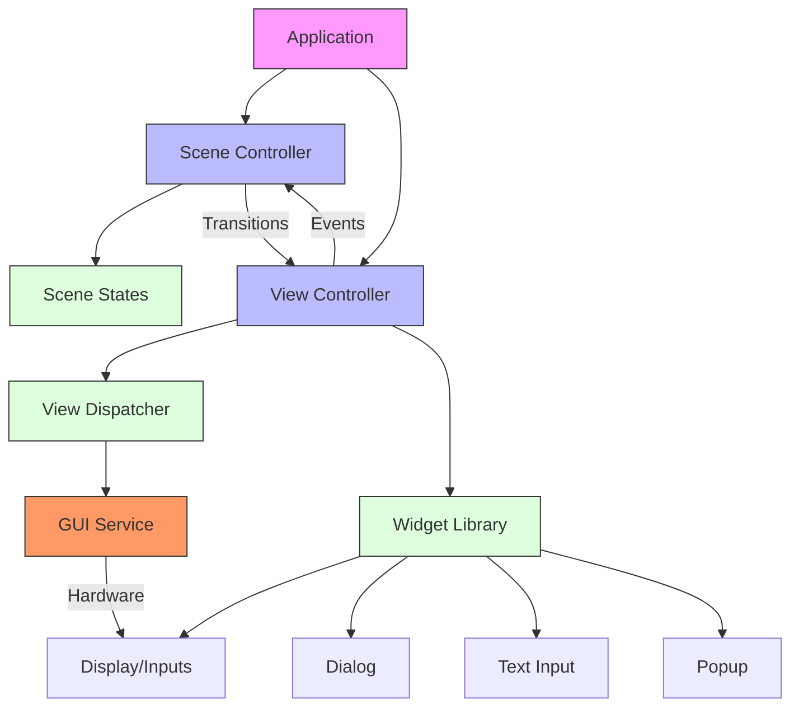
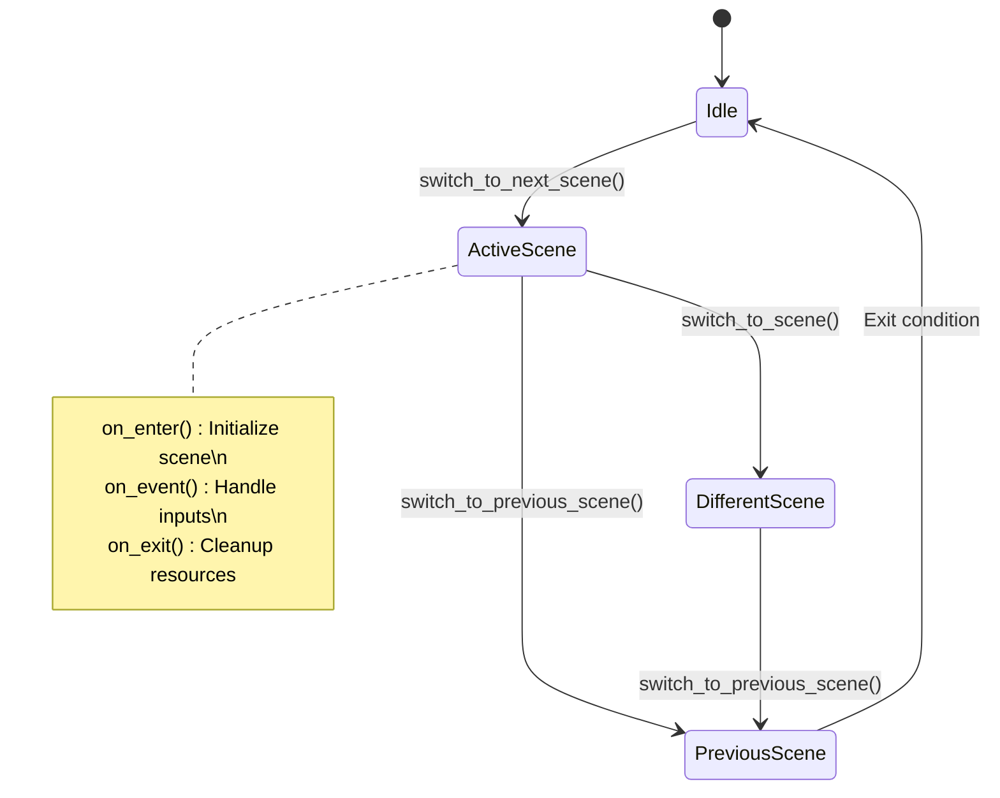
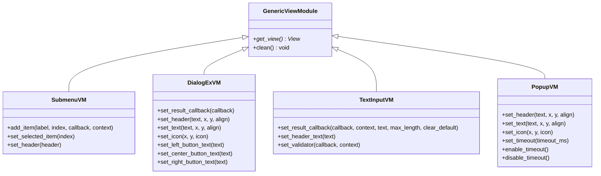
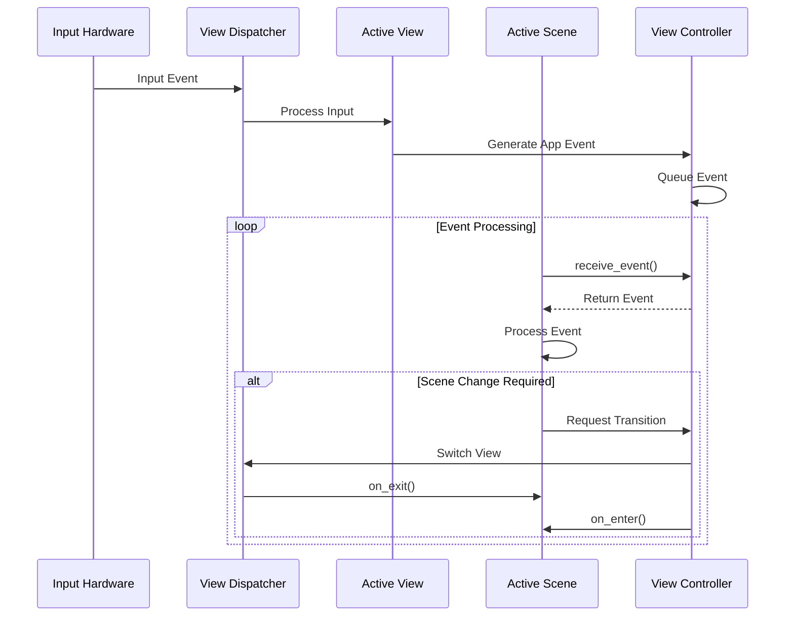

# GUI Framework Components

<cite>
**Referenced Files in This Document**   
- [generic_scene.hpp](file://lib/app-scened-template/generic_scene.hpp)
- [scene_controller.hpp](file://lib/app-scened-template/scene_controller.hpp)
- [view_controller.hpp](file://lib/app-scened-template/view_controller.hpp)
- [generic_view_module.h](file://lib/app-scened-template/view_modules/generic_view_module.h)
- [submenu_vm.h](file://lib/app-scened-template/view_modules/submenu_vm.h)
- [dialog_ex_vm.h](file://lib/app-scened-template/view_modules/dialog_ex_vm.h)
- [text_input_vm.h](file://lib/app-scened-template/view_modules/text_input_vm.h)
- [popup_vm.h](file://lib/app-scened-template/view_modules/popup_vm.h)
- [gui.h](file://applications/services/gui/gui.h)
- [view_dispatcher.h](file://applications/services/gui/view_dispatcher.h)
</cite>

## Table of Contents
1. [Introduction](#introduction)
2. [Architecture Overview](#architecture-overview)
3. [Scene Management System](#scene-management-system)
4. [View System and Widget Library](#view-system-and-widget-library)
5. [Component Interaction Patterns](#component-interaction-patterns)
6. [Implementation Examples](#implementation-examples)
7. [Common Issues and Solutions](#common-issues-and-solutions)
8. [Performance Considerations](#performance-considerations)

## Introduction
The Flipper Zero GUI framework provides a structured approach to building user interfaces for applications on the device. The system is built around three core components: the scene manager, view system, and widget library. These components work together to create a consistent user experience while providing developers with the tools needed to implement complex UI interactions. This document explains the architecture, implementation details, and best practices for working with these core GUI components.

## Architecture Overview

**Diagram sources**
- [scene_controller.hpp](file://lib/app-scened-template/scene_controller.hpp)
- [view_controller.hpp](file://lib/app-scened-template/view_controller.hpp)
- [gui.h](file://applications/services/gui/gui.h)

**Section sources**
- [scene_controller.hpp](file://lib/app-scened-template/scene_controller.hpp)
- [view_controller.hpp](file://lib/app-scened-template/view_controller.hpp)

## Scene Management System

The scene management system in Flipper Zero provides a state-based navigation model for applications. Each application state is represented as a scene, and transitions between scenes are managed by the SceneController template class. This system implements a stack-based navigation pattern where scenes can be pushed onto and popped from the navigation stack.

The SceneController class manages scene transitions through several key methods: `switch_to_next_scene()` for adding a scene to the navigation stack, `switch_to_scene()` for replacing the current scene without preserving the previous state, and `switch_to_previous_scene()` for navigating back through the stack. The controller maintains a forward_list of previous scene indices, enabling efficient back navigation while minimizing memory overhead.

Scene lifecycle management follows a consistent pattern with three virtual methods defined in the GenericScene template: `on_enter()` called when entering a scene, `on_event()` for handling input events, and `on_exit()` for cleanup when leaving a scene. This lifecycle ensures proper resource management and state preservation during navigation.

**Diagram sources**
- [generic_scene.hpp](file://lib/app-scened-template/generic_scene.hpp)
- [scene_controller.hpp](file://lib/app-scened-template/scene_controller.hpp)

**Section sources**
- [generic_scene.hpp](file://lib/app-scened-template/generic_scene.hpp)
- [scene_controller.hpp](file://lib/app-scened-template/scene_controller.hpp)

## View System and Widget Library

The view system in Flipper Zero is built around the ViewDispatcher component, which manages the display of different UI elements and routes input events to the appropriate handlers. The ViewController template class provides a type-safe interface for managing views, using compile-time type indexing to associate view modules with their corresponding UI components.

The widget library provides a collection of pre-built UI components that can be incorporated into applications. Key components include:
- SubmenuVM: For hierarchical menu navigation
- DialogExVM: For modal dialogs with customizable buttons and content
- TextInputVM: For text input with validation capabilities
- PopupVM: For temporary notifications and status messages

Each view module follows the same interface pattern, inheriting from GenericViewModule and implementing the `get_view()` and `clean()` methods. This consistent interface allows the ViewController to manage different view types uniformly while providing specialized functionality through each module's public methods.

**Diagram sources**
- [generic_view_module.h](file://lib/app-scened-template/view_modules/generic_view_module.h)
- [submenu_vm.h](file://lib/app-scened-template/view_modules/submenu_vm.h)
- [dialog_ex_vm.h](file://lib/app-scened-template/view_modules/dialog_ex_vm.h)
- [text_input_vm.h](file://lib/app-scened-template/view_modules/text_input_vm.h)
- [popup_vm.h](file://lib/app-scened-template/view_modules/popup_vm.h)

**Section sources**
- [view_controller.hpp](file://lib/app-scened-template/view_controller.hpp)
- [generic_view_module.h](file://lib/app-scened-template/view_modules/generic_view_module.h)

## Component Interaction Patterns

The interaction between the scene manager, view system, and widget library follows a well-defined pattern that ensures consistent behavior across applications. When a scene transition occurs, the following sequence takes place:

1. The current scene's `on_exit()` method is called to perform cleanup
2. The ViewDispatcher switches to the new view associated with the target scene
3. The new scene's `on_enter()` method is called to initialize its state
4. Input events are routed through the ViewDispatcher to the current scene's `on_event()` method

Event handling follows a two-tiered approach where low-level input events (button presses, etc.) are translated into application-specific events by the view components. These higher-level events are then processed by the active scene. The ViewController facilitates this process by maintaining an event queue that decouples event generation from processing.

**Diagram sources**
- [view_controller.hpp](file://lib/app-scened-template/view_controller.hpp)
- [scene_controller.hpp](file://lib/app-scened-template/scene_controller.hpp)
- [view_dispatcher.h](file://applications/services/gui/view_dispatcher.h)

**Section sources**
- [view_controller.hpp](file://lib/app-scened-template/view_controller.hpp)
- [scene_controller.hpp](file://lib/app-scened-template/scene_controller.hpp)

## Implementation Examples

Creating custom scenes with various UI elements follows a consistent pattern using the provided templates and components. For a menu-based interface, developers would typically use the SubmenuVM component, adding items with specific callbacks that trigger scene transitions. Dialogs can be implemented using DialogExVM to create modal interfaces with multiple button options, while text input fields use TextInputVM with appropriate validation callbacks.

A typical implementation pattern involves:
1. Defining scene enum values for all application states
2. Creating scene classes that inherit from GenericScene
3. Implementing the three lifecycle methods (on_enter, on_event, on_exit)
4. Using the ViewController to access and configure view modules
5. Connecting input events to scene transitions

For complex UIs, multiple view modules can be combined within a single scene, with the ViewController managing which view is currently displayed. This allows for rich interfaces that combine menus, text input, and other elements as needed.

**Section sources**
- [generic_scene.hpp](file://lib/app-scened-template/generic_scene.hpp)
- [scene_controller.hpp](file://lib/app-scened-template/scene_controller.hpp)
- [view_controller.hpp](file://lib/app-scened-template/view_controller.hpp)

## Common Issues and Solutions

Several common issues arise when working with the Flipper Zero GUI framework, particularly around memory management and state preservation. Memory leaks during scene transitions can occur if resources allocated in `on_enter()` are not properly released in `on_exit()`. The framework helps prevent this by automatically cleaning up view modules, but developers must ensure any additional allocations are properly managed.

Widget state management presents another challenge, as view modules maintain their own internal state that may persist across scene transitions. To address this, developers should explicitly reset widget states in `on_enter()` when needed, rather than relying on default initialization. For example, clearing text input fields or resetting menu selections ensures consistent behavior each time a scene is entered.

Event handling issues can occur when events are not properly consumed, leading to unintended scene transitions. The framework's event queue system helps mitigate this by ensuring events are processed in order, but developers should ensure their `on_event()` implementations return the appropriate consumption status to prevent event leakage.

**Section sources**
- [scene_controller.hpp](file://lib/app-scened-template/scene_controller.hpp)
- [view_controller.hpp](file://lib/app-scened-template/view_controller.hpp)
- [generic_scene.hpp](file://lib/app-scened-template/generic_scene.hpp)

## Performance Considerations

Efficient memory usage is critical in the Flipper Zero environment due to limited resources. The GUI framework employs several strategies to optimize memory usage, including the use of forward_list for storing previous scene indices (minimizing memory overhead for navigation history) and compile-time type indexing for view management (eliminating runtime type checking overhead).

For smooth transitions between UI states, the framework minimizes rendering overhead by only updating the display when necessary. The ViewDispatcher efficiently manages view switching by maintaining references to initialized views, avoiding the need to recreate UI components on each transition. Developers can further optimize performance by:
- Limiting the navigation stack depth to prevent excessive memory usage
- Reusing view modules across scenes when appropriate
- Minimizing allocations in scene lifecycle methods
- Using the need_restore parameter in scene transitions to avoid unnecessary initialization

The event processing system is designed for responsiveness, with a dedicated message queue ensuring input events are handled promptly even during intensive operations. This design maintains UI responsiveness while allowing background tasks to proceed without interference.

**Section sources**
- [scene_controller.hpp](file://lib/app-scened-template/scene_controller.hpp)
- [view_controller.hpp](file://lib/app-scened-template/view_controller.hpp)
- [generic_scene.hpp](file://lib/app-scened-template/generic_scene.hpp)