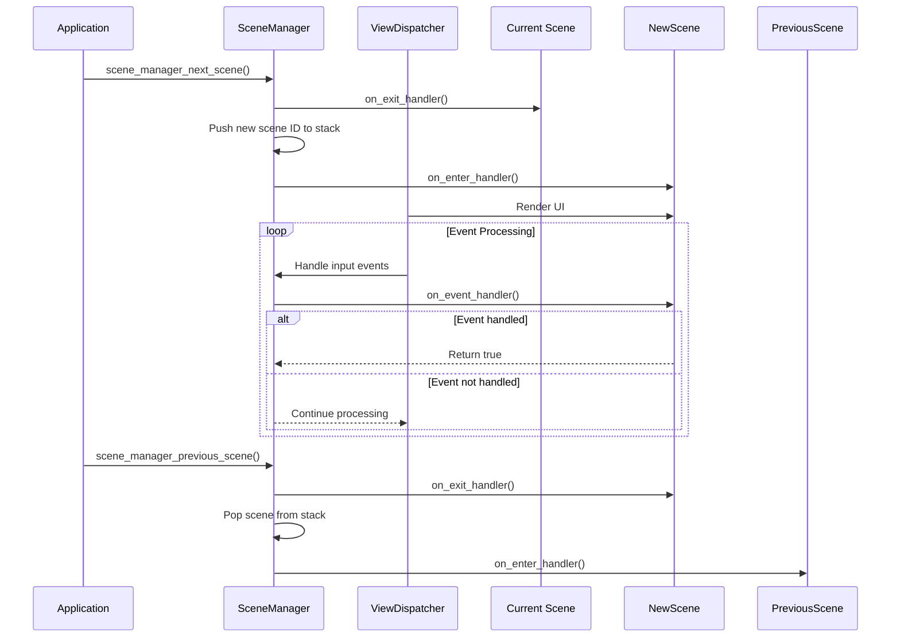
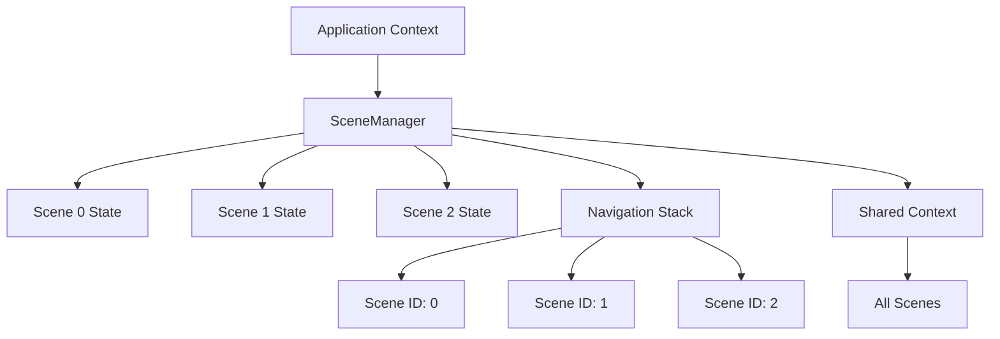
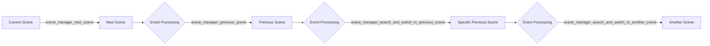
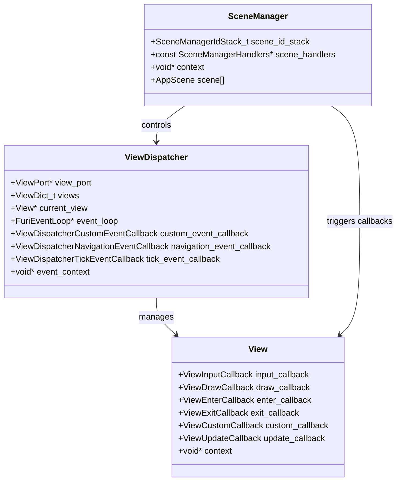
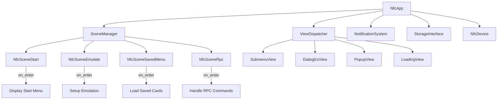
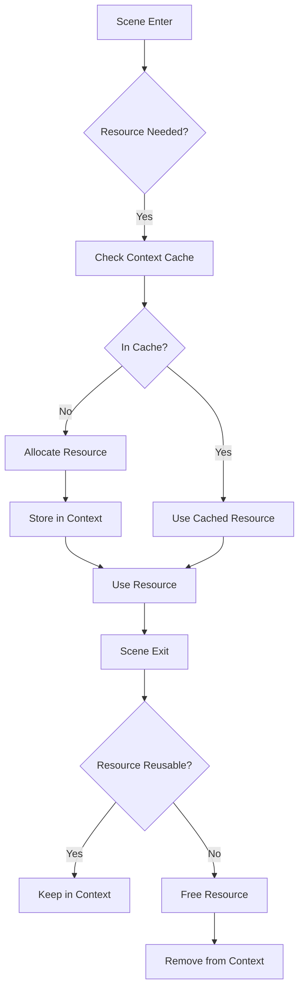

# Scene Management

<cite>
**Referenced Files in This Document**   
- [scene_manager.h](file://applications/services/gui/scene_manager.h)
- [scene_manager.c](file://applications/services/gui/scene_manager.c)
- [scene_manager_i.h](file://applications/services/gui/scene_manager_i.h)
- [view_dispatcher.h](file://applications/services/gui/view_dispatcher.h)
- [view_dispatcher.c](file://applications/services/gui/view_dispatcher.c)
- [nfc_app.c](file://applications/main/nfc/nfc_app.c)
- [lfrfid_debug_scene.c](file://applications/debug/lfrfid_debug/scenes/lfrfid_debug_scene.c)
- [file_browser_scene_start.c](file://applications/debug/file_browser_test/scenes/file_browser_scene_start.c)
- [generic_scene.hpp](file://lib/app-scened-template/generic_scene.hpp)
</cite>

## Table of Contents
1. [Introduction](#introduction)
2. [Scene Manager Architecture](#scene-manager-architecture)
3. [Scene Lifecycle Management](#scene-lifecycle-management)
4. [Scene State and Context Management](#scene-state-and-context-management)
5. [Scene Transition Mechanisms](#scene-transition-mechanisms)
6. [Integration with View Dispatcher](#integration-with-view-dispatcher)
7. [Application Implementation Examples](#application-implementation-examples)
8. [Best Practices and Performance Optimization](#best-practices-and-performance-optimization)
9. [Common Issues and Troubleshooting](#common-issues-and-troubleshooting)
10. [Conclusion](#conclusion)

## Introduction

The Flipper Zero GUI framework employs a scene management system to organize application flow and user interface navigation. This system provides a structured approach to managing application states, enabling developers to create complex user interfaces with well-defined navigation patterns. The scene manager works in conjunction with the view dispatcher to coordinate UI rendering and input handling, forming the backbone of the Flipper Zero's application architecture.

The scene management system is designed to handle the complete lifecycle of application states, from initialization to cleanup, while maintaining context data across transitions. This documentation provides a comprehensive analysis of the scene manager's implementation, including its core components, lifecycle management, state handling, and integration with the view dispatcher. The analysis also covers practical implementation examples from various Flipper Zero applications and provides guidance on best practices for developing efficient and maintainable applications.

**Section sources**
- [scene_manager.h](file://applications/services/gui/scene_manager.h#L1-L189)
- [scene_manager.c](file://applications/services/gui/scene_manager.c#L1-L246)

## Scene Manager Architecture

The scene manager in the Flipper Zero GUI framework is implemented as a state machine that manages navigation between different application scenes. The architecture consists of several key components that work together to provide a robust scene management system.

The core data structure, `SceneManager`, contains a stack of scene IDs, a reference to scene handlers, a context pointer, and an array of scene states. This structure is defined in the internal header file and uses a dynamically allocated array to store scene-specific state information. The scene ID stack is implemented using the M-ARRAY library, providing efficient push and pop operations for navigation history management.

```mermaid
classDiagram
class SceneManager {
+SceneManagerIdStack_t scene_id_stack
+const SceneManagerHandlers* scene_handlers
+void* context
+AppScene scene[]
}
class SceneManagerHandlers {
+const AppSceneOnEnterCallback* on_enter_handlers
+const AppSceneOnEventCallback* on_event_handlers
+const AppSceneOnExitCallback* on_exit_handlers
+const uint32_t scene_num
}
class SceneManagerEvent {
+SceneManagerEventType type
+uint32_t event
}
enum SceneManagerEventType {
SceneManagerEventTypeCustom
SceneManagerEventTypeBack
SceneManagerEventTypeTick
}
SceneManager "1" -- "1" SceneManagerHandlers : contains
SceneManager --> SceneManagerEvent : handles
```

**Diagram sources**
- [scene_manager_i.h](file://applications/services/gui/scene_manager_i.h#L13-L22)
- [scene_manager.h](file://applications/services/gui/scene_manager.h#L16-L47)

The scene manager exposes a set of handler function types that define the interface for scene behavior:
- `AppSceneOnEnterCallback`: Called when entering a scene
- `AppSceneOnEventCallback`: Called when events occur within a scene
- `AppSceneOnExitCallback`: Called when exiting a scene

These handlers are organized in the `SceneManagerHandlers` structure, which contains arrays of function pointers for each handler type, along with the total number of scenes. This design allows applications to define their scene flow by providing these handler arrays during initialization.

**Section sources**
- [scene_manager.h](file://applications/services/gui/scene_manager.h#L30-L47)
- [scene_manager_i.h](file://applications/services/gui/scene_manager_i.h#L17-L22)

## Scene Lifecycle Management

The scene manager implements a comprehensive lifecycle management system that controls the flow between different application states. Each scene transitions through a well-defined sequence of events: enter, event processing, and exit.

When transitioning to a new scene using `scene_manager_next_scene`, the system first calls the `on_exit` handler of the current scene (if one exists), then pushes the new scene ID onto the navigation stack, and finally calls the `on_enter` handler of the new scene. This ensures proper cleanup of the previous scene before initializing the new one. The `on_enter` callback is responsible for setting up the scene's UI elements and initializing any required resources.



**Diagram sources**
- [scene_manager.c](file://applications/services/gui/scene_manager.c#L95-L107)
- [scene_manager.c](file://applications/services/gui/scene_manager.c#L109-L127)

The scene manager supports three types of events through the `SceneManagerEvent` structure:
- `SceneManagerEventTypeCustom`: User-defined events triggered by application logic
- `SceneManagerEventTypeBack`: Navigation back events, typically from the back button
- `SceneManagerEventTypeTick`: Periodic timer events for animations or updates

The `on_event` handler returns a boolean value indicating whether the event was consumed. If an event is not consumed, the scene manager may take default actions, such as navigating back when a back event is not handled.

The `on_exit` handler is called when leaving a scene and is responsible for cleaning up resources, saving state, and releasing any allocated memory. This ensures that scenes do not leave behind memory leaks or other resources when they are no longer active.

**Section sources**
- [scene_manager.h](file://applications/services/gui/scene_manager.h#L16-L28)
- [scene_manager.c](file://applications/services/gui/scene_manager.c#L95-L127)

## Scene State and Context Management

The scene manager provides robust state and context management capabilities that allow applications to maintain data across scene transitions. The system uses a combination of scene-specific state storage and a shared context pointer to manage application data.

Each scene can maintain its own state through the `scene_manager_set_scene_state` and `scene_manager_get_scene_state` functions. These functions allow storing a 32-bit state value for any scene, which persists even when the scene is not active. This is particularly useful for preserving UI state, selection indices, or other transient data that should be restored when returning to a scene.



**Diagram sources**
- [scene_manager_i.h](file://applications/services/gui/scene_manager_i.h#L13-L22)
- [scene_manager.c](file://applications/services/gui/scene_manager.c#L27-L39)

The context pointer, stored in the `SceneManager` structure, points to application-specific data that is shared across all scenes. This allows different scenes to access and modify the same data structures, facilitating data sharing and coordination between scenes. In the NFC application example, this context contains references to the view dispatcher, notification system, storage interface, and various UI components.

The scene manager allocates memory for the `SceneManager` structure using `malloc`, with additional space for the variable-length array of scene states. The size of this allocation is determined by the number of scenes specified in the `SceneManagerHandlers` structure. This design allows the scene manager to efficiently store state for all scenes without requiring dynamic allocation for each scene individually.

**Section sources**
- [scene_manager.c](file://applications/services/gui/scene_manager.c#L4-L15)
- [scene_manager.c](file://applications/services/gui/scene_manager.c#L27-L39)

## Scene Transition Mechanisms

The scene manager provides several mechanisms for navigating between scenes, each designed for different use cases and navigation patterns. These transition mechanisms form the core of the application flow control system.

The primary transition function is `scene_manager_next_scene`, which pushes a new scene onto the navigation stack and triggers the appropriate lifecycle callbacks. This function is used for forward navigation through the application flow. When called, it first invokes the `on_exit` handler of the current scene, then adds the new scene ID to the stack, and finally calls the `on_enter` handler of the new scene.



**Diagram sources**
- [scene_manager.c](file://applications/services/gui/scene_manager.c#L95-L107)
- [scene_manager.c](file://applications/services/gui/scene_manager.c#L109-L127)

For backward navigation, the scene manager provides `scene_manager_previous_scene`, which pops the current scene from the stack and returns to the previous one. If no previous scene exists, the application typically exits. This function handles the lifecycle callbacks in reverse order, calling `on_exit` for the current scene and `on_enter` for the previous scene.

The scene manager also includes more sophisticated navigation functions:
- `scene_manager_search_and_switch_to_previous_scene`: Searches the navigation stack for a specific scene and jumps back to it, removing all intermediate scenes
- `scene_manager_search_and_switch_to_previous_scene_one_of`: Similar to the above, but searches for any scene from a specified list
- `scene_manager_search_and_switch_to_another_scene`: Clears the entire navigation stack and switches to a specified scene

These advanced navigation functions enable complex flow patterns, such as returning to a main menu from any point in the application or implementing wizard-style interfaces with non-linear navigation.

**Section sources**
- [scene_manager.c](file://applications/services/gui/scene_manager.c#L95-L230)
- [scene_manager.h](file://applications/services/gui/scene_manager.h#L131-L171)

## Integration with View Dispatcher

The scene manager works closely with the view dispatcher to coordinate UI rendering and input handling. This integration is critical for the proper functioning of the Flipper Zero's graphical interface.

The view dispatcher is responsible for managing the display of different UI components (views) and handling input events from the hardware. It maintains a collection of views, each identified by a unique ID, and can switch between them based on application logic. The scene manager uses the view dispatcher to change the visible UI when transitioning between scenes.



**Diagram sources**
- [view_dispatcher.h](file://applications/services/gui/view_dispatcher.h#L25-L184)
- [scene_manager.h](file://applications/services/gui/scene_manager.h#L49-L189)

The integration between these components is established through callback functions. The application sets up the view dispatcher with custom event and navigation event callbacks that delegate to the scene manager. For example, in the NFC application, the `nfc_custom_event_callback` and `nfc_back_event_callback` functions simply call the corresponding scene manager functions with the application context.

When a scene transition occurs, the scene manager's `on_enter` handler typically calls `view_dispatcher_switch_to_view` to display the appropriate UI component. This separation of concerns allows the scene manager to focus on application flow logic while the view dispatcher handles the low-level details of UI rendering and input processing.

The view dispatcher also provides tick event support through `view_dispatcher_set_tick_event_callback`, which is linked to the scene manager's tick event handling. This enables periodic updates for animations, status indicators, or other time-based UI elements.

**Section sources**
- [view_dispatcher.h](file://applications/services/gui/view_dispatcher.h#L28-L34)
- [nfc_app.c](file://applications/main/nfc/nfc_app.c#L10-L20)

## Application Implementation Examples

The scene management system is used consistently across various Flipper Zero applications, with specific implementations demonstrating different patterns and use cases. Analyzing these examples provides insight into practical application of the scene manager.

In the NFC application, the scene manager is initialized with a set of scene handlers and the application context. The application allocates the scene manager using `scene_manager_alloc` and passes a pointer to the `NfcApp` structure as the context. This context contains references to all necessary components, including the view dispatcher, notification system, and storage interface.



**Diagram sources**
- [nfc_app.c](file://applications/main/nfc/nfc_app.c#L43-L228)
- [nfc_app.c](file://applications/main/nfc/nfc_app.c#L497-L533)

The LFRFID Debug application demonstrates a common pattern for defining scene handlers using preprocessor macros. The `lfrfid_debug_scene.c` file uses `#define ADD_SCENE` and `#include` directives to generate arrays of function pointers for the scene handlers. This approach reduces boilerplate code and ensures consistency across scene definitions.

The File Browser Test application shows a simple scene flow with a start scene that transitions to a browser scene when the user presses OK. The `file_browser_scene_start_on_event` function handles the custom event triggered by the button callback and uses `scene_manager_next_scene` to navigate to the browser scene.

These examples illustrate how different applications use the scene manager to implement their specific workflows while adhering to the same underlying architecture. The consistent use of the scene manager across applications ensures a uniform user experience and simplifies development by providing a standardized navigation framework.

**Section sources**
- [nfc_app.c](file://applications/main/nfc/nfc_app.c#L43-L228)
- [lfrfid_debug_scene.c](file://applications/debug/lfrfid_debug/scenes/lfrfid_debug_scene.c#L1-L31)
- [file_browser_scene_start.c](file://applications/debug/file_browser_test/scenes/file_browser_scene_start.c#L1-L47)

## Best Practices and Performance Optimization

Effective use of the scene manager requires adherence to certain best practices and consideration of performance implications. These guidelines help ensure efficient memory usage, responsive user interfaces, and maintainable code.

One key best practice is proper resource management in scene lifecycle callbacks. The `on_enter` handler should allocate only essential resources, while the `on_exit` handler must release all allocated resources to prevent memory leaks. For frequently accessed scenes, consider caching expensive resources in the application context rather than reallocating them on each entry.



**Diagram sources**
- [scene_manager.c](file://applications/services/gui/scene_manager.c#L104-L107)
- [scene_manager.c](file://applications/services/gui/scene_manager.c#L116-L123)

To optimize performance, minimize the work done in `on_enter` and `on_exit` handlers, as these functions are called on every scene transition. Expensive operations like file loading or complex calculations should be performed asynchronously or cached when possible. The use of scene state to preserve UI state can also improve perceived performance by avoiding unnecessary reinitialization.

Another important consideration is the navigation stack depth. While the scene manager does not impose a strict limit on stack depth, excessively deep stacks can consume significant memory and make navigation confusing for users. Applications should use the advanced navigation functions like `scene_manager_search_and_switch_to_another_scene` to reset the stack when appropriate, such as when returning to a main menu.

Proper error handling is crucial when working with the scene manager. Always check the return values of scene transition functions, especially when using the search-based navigation functions, as they may fail to find the requested scene in the stack.

**Section sources**
- [scene_manager.c](file://applications/services/gui/scene_manager.c#L95-L127)
- [scene_manager.h](file://applications/services/gui/scene_manager.h#L131-L171)

## Common Issues and Troubleshooting

Several common issues can arise when working with the scene manager, particularly related to memory management, event handling, and navigation flow. Understanding these issues and their solutions is essential for developing robust applications.

Memory leaks during rapid scene transitions are a frequent problem, typically caused by improper resource cleanup in `on_exit` handlers. When scenes are entered and exited quickly, any resources allocated in `on_enter` but not properly freed in `on_exit` will accumulate, eventually exhausting available memory. To prevent this, ensure that all dynamically allocated memory, file handles, and other resources are properly released.

Improper context cleanup can lead to dangling pointers and undefined behavior. Since the scene manager stores a context pointer that is passed to all scene handlers, it's critical that this context remains valid for the lifetime of the scene manager. When the application is closing, the scene manager should be freed before any components referenced in the context.

Event handling issues often occur when events are not properly consumed. If a scene's `on_event` handler fails to consume a back event, the scene manager will automatically navigate to the previous scene, which may not be the desired behavior. Similarly, unhandled custom events may be passed to the custom event callback, potentially causing unexpected application behavior.

Navigation flow problems can arise from incorrect use of the navigation functions. For example, calling `scene_manager_next_scene` without first checking if the target scene is already active can lead to unnecessarily deep navigation stacks. Using the search-based navigation functions can help maintain a clean navigation history.

Debugging these issues typically involves adding logging to the scene lifecycle callbacks to trace the sequence of scene transitions and ensure that enter and exit handlers are properly paired. The use of static analysis tools and careful code review can also help identify potential resource management issues before they manifest in runtime errors.

**Section sources**
- [scene_manager.c](file://applications/services/gui/scene_manager.c#L102-L103)
- [scene_manager.c](file://applications/services/gui/scene_manager.c#L117-L119)
- [scene_manager.c](file://applications/services/gui/scene_manager.c#L71-L73)

## Conclusion

The scene management system in the Flipper Zero GUI framework provides a robust and flexible foundation for organizing application flow and user interface navigation. By implementing a state machine architecture with well-defined lifecycle callbacks, the system enables developers to create complex applications with predictable behavior and clean separation of concerns.

The integration between the scene manager and view dispatcher creates a powerful combination for managing both application logic and UI presentation. This separation allows scenes to focus on workflow and data management while delegating UI rendering and input handling to specialized components.

Key strengths of the system include its support for multiple navigation patterns, efficient state management, and consistent error handling. The use of function pointer arrays for scene handlers provides flexibility while maintaining performance, and the context-based data sharing enables seamless coordination between scenes.

When implementing applications using this system, developers should follow best practices for resource management, performance optimization, and error handling. Proper use of the various navigation functions can create intuitive user experiences, while careful attention to lifecycle management ensures stable and reliable operation.

The scene manager's design reflects a deep understanding of embedded application development challenges, providing solutions for memory constraints, real-time requirements, and user interface complexity. As the foundation of the Flipper Zero's application ecosystem, it enables the creation of powerful and user-friendly tools that leverage the device's unique capabilities.