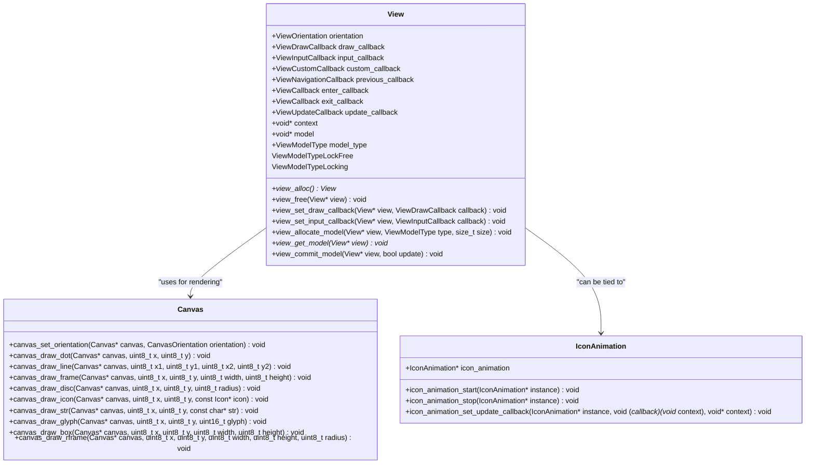
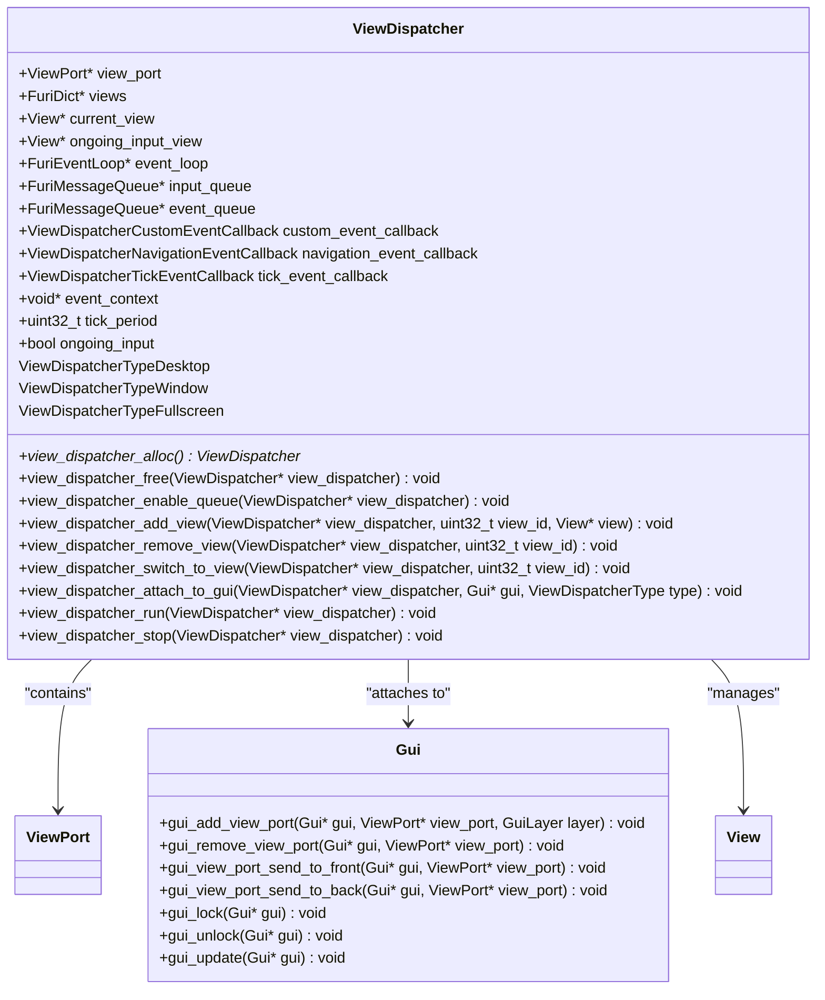
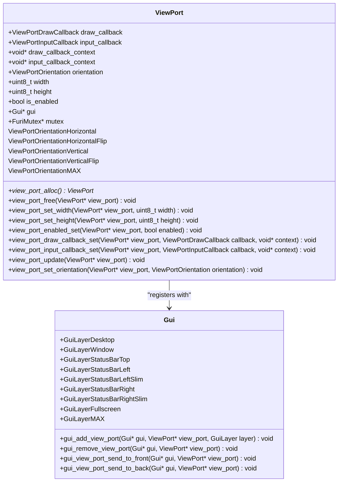
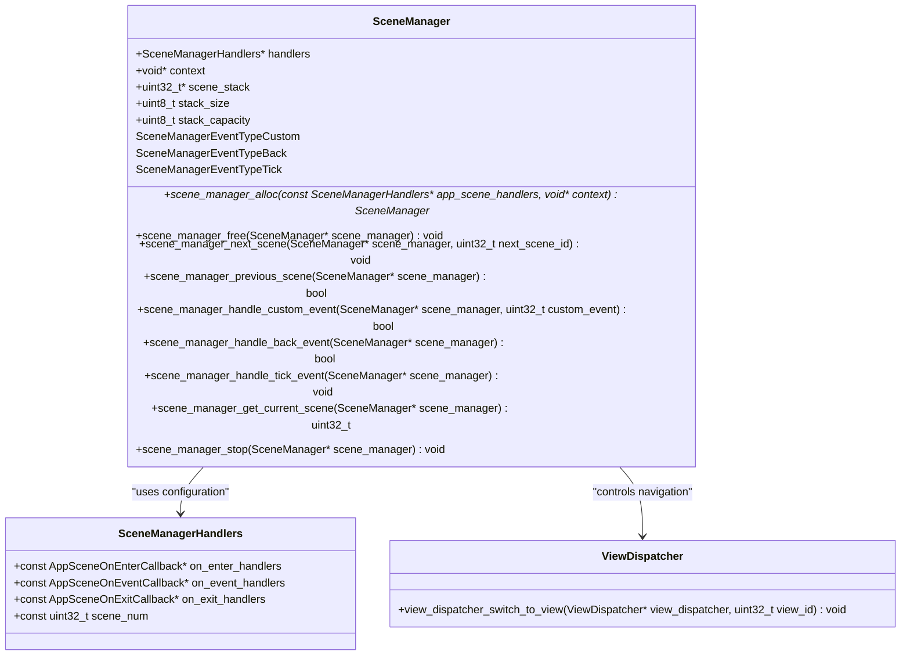
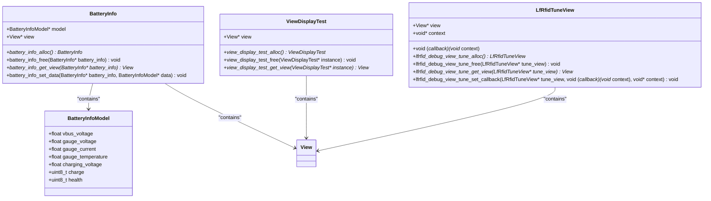
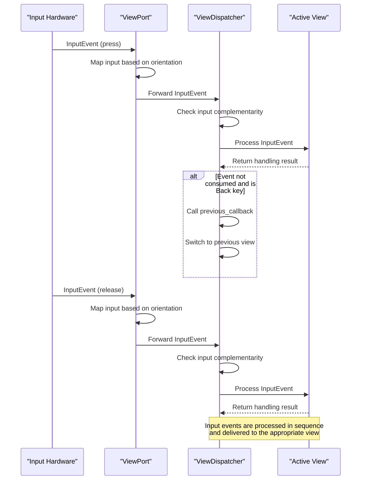
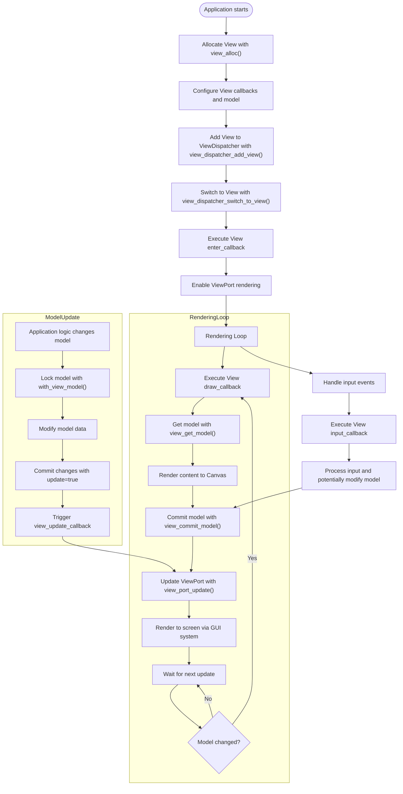

# View System

<cite>
**Referenced Files in This Document**   
- [view.h](file://applications/services/gui/view.h)
- [view.c](file://applications/services/gui/view.c)
- [view_dispatcher.h](file://applications/services/gui/view_dispatcher.h)
- [view_dispatcher.c](file://applications/services/gui/view_dispatcher.c)
- [view_port.h](file://applications/services/gui/view_port.h)
- [view_port.c](file://applications/services/gui/view_port.c)
- [gui.h](file://applications/services/gui/gui.h)
- [scene_manager.h](file://applications/services/gui/scene_manager.h)
- [battery_info.h](file://applications/debug/battery_test_app/views/battery_info.h)
- [view_display_test.h](file://applications/debug/display_test/view_display_test.h)
- [lfrfid_debug_view_tune.h](file://applications/debug/lfrfid_debug/views/lfrfid_debug_view_tune.h)
</cite>

## Table of Contents
1. [Introduction](#introduction)
2. [Core Components](#core-components)
3. [View Architecture](#view-architecture)
4. [View Dispatcher](#view-dispatcher)
5. [View Ports](#view-ports)
6. [Scene Management](#scene-management)
7. [View Implementation Patterns](#view-implementation-patterns)
8. [Input Event Handling](#input-event-handling)
9. [View Rendering and Performance](#view-rendering-and-performance)
10. [Best Practices](#best-practices)
11. [Conclusion](#conclusion)

## Introduction

The Flipper Zero GUI framework implements a sophisticated view system that manages rendering and input processing for applications. This system is built around three core components: views, view ports, and the view dispatcher, which work together to provide a flexible and efficient interface for application development. The framework also integrates with scene management to handle application state transitions and navigation. This document provides a comprehensive analysis of the view system, explaining its architecture, implementation details, and best practices for creating custom views.

**Section sources**
- [view.h](file://applications/services/gui/view.h#L1-L238)
- [view_dispatcher.h](file://applications/services/gui/view_dispatcher.h#L1-L184)
- [view_port.h](file://applications/services/gui/view_port.h#L1-L111)

## Core Components

The Flipper Zero GUI framework's view system consists of several interconnected components that work together to manage the user interface. The primary components are views, which represent individual screens or UI elements; view ports, which serve as containers for views and handle rendering; and the view dispatcher, which manages the lifecycle and navigation between views. These components are supported by the scene manager, which handles application state transitions and complex navigation patterns. The system is designed to be modular and extensible, allowing developers to create custom views for specific application needs while maintaining consistency across the platform.

**Section sources**
- [view.h](file://applications/services/gui/view.h#L1-L238)
- [view_dispatcher.h](file://applications/services/gui/view_dispatcher.h#L1-L184)
- [view_port.h](file://applications/services/gui/view_port.h#L1-L111)
- [gui.h](file://applications/services/gui/gui.h#L1-L152)

## View Architecture

The view architecture in the Flipper Zero GUI framework is centered around the View structure, which encapsulates the logic and rendering for a specific UI component. Each view contains callback functions for drawing, input processing, and lifecycle management. The view system supports different model types, including lock-free models for atomic data and locking models that use mutexes for thread-safe access to shared data. Views are designed to be reusable components that can be added to a view dispatcher and switched between as needed. The architecture promotes separation of concerns by keeping rendering logic separate from application state management.

**Diagram sources**
- [view.h](file://applications/services/gui/view.h#L1-L238)
- [canvas.h](file://applications/services/gui/canvas.h)
- [icon_animation.h](file://applications/services/gui/icon_animation.h)

**Section sources**
- [view.h](file://applications/services/gui/view.h#L1-L238)
- [view.c](file://applications/services/gui/view.c#L1-L184)

## View Dispatcher

The view dispatcher is responsible for managing the lifecycle of views and handling navigation between them. It acts as an intermediary between the GUI system and individual views, ensuring that only one view is active at a time and that transitions between views are handled smoothly. The dispatcher maintains a collection of registered views and provides methods to switch between them. It also handles input events, forwarding them to the currently active view, and manages rendering by updating the associated view port when the active view changes. The view dispatcher can be configured with different event callbacks for custom events, navigation events, and periodic tick events, allowing applications to respond to various system events.

**Diagram sources**
- [view_dispatcher.h](file://applications/services/gui/view_dispatcher.h#L1-L184)
- [view_dispatcher.c](file://applications/services/gui/view_dispatcher.c#L1-L407)
- [gui.h](file://applications/services/gui/gui.h#L1-L152)

**Section sources**
- [view_dispatcher.h](file://applications/services/gui/view_dispatcher.h#L1-L184)
- [view_dispatcher.c](file://applications/services/gui/view_dispatcher.c#L1-L407)

## View Ports

View ports serve as the bridge between the GUI system and individual views, acting as containers that manage the rendering area and input events for a view. Each view port is associated with a specific layer in the GUI hierarchy, such as desktop, window, or fullscreen, which determines its stacking order and visibility. View ports can be enabled or disabled, allowing applications to control when a view is rendered. They also handle orientation changes, automatically remapping input events based on the current orientation. The view port system supports multiple view ports simultaneously, enabling complex UI layouts with overlapping elements. View ports are responsible for forwarding input events to their associated views and triggering rendering updates when needed.

**Diagram sources**
- [view_port.h](file://applications/services/gui/view_port.h#L1-L111)
- [view_port.c](file://applications/services/gui/view_port.c#L1-L258)
- [gui.h](file://applications/services/gui/gui.h#L1-L152)

**Section sources**
- [view_port.h](file://applications/services/gui/view_port.h#L1-L111)
- [view_port.c](file://applications/services/gui/view_port.c#L1-L258)

## Scene Management

The scene manager provides a higher-level abstraction for managing application states and navigation, building on top of the view system. It maintains a stack of scenes, allowing applications to implement complex navigation patterns with back navigation and state preservation. Each scene corresponds to a specific application state and is associated with a view that represents its UI. The scene manager handles transitions between scenes, calling appropriate lifecycle methods when entering or exiting a scene. It supports custom events, back events, and periodic tick events, allowing scenes to respond to user actions and system events. The scene manager also provides methods to search for previous scenes and switch to them, enabling non-linear navigation patterns.

**Diagram sources**
- [scene_manager.h](file://applications/services/gui/scene_manager.h#L1-L190)
- [view_dispatcher.h](file://applications/services/gui/view_dispatcher.h#L1-L184)

**Section sources**
- [scene_manager.h](file://applications/services/gui/scene_manager.h#L1-L190)

## View Implementation Patterns

The Flipper Zero GUI framework demonstrates several common patterns for implementing custom views across different applications. These patterns include dedicated view structures that encapsulate view-specific data and functionality, factory methods for allocating and initializing views, and accessor methods for retrieving the underlying View object. Views typically follow a consistent lifecycle with allocation, configuration, and deallocation methods. The framework encourages the use of model-view separation, where application data is stored separately from the view implementation and accessed through well-defined interfaces. This approach promotes code reuse and makes views easier to test and maintain.

**Diagram sources**
- [battery_info.h](file://applications/debug/battery_test_app/views/battery_info.h#L1-L24)
- [view_display_test.h](file://applications/debug/display_test/view_display_test.h#L1-L13)
- [lfrfid_debug_view_tune.h](file://applications/debug/lfrfid_debug/views/lfrfid_debug_view_tune.h#L1-L24)

**Section sources**
- [battery_info.h](file://applications/debug/battery_test_app/views/battery_info.h#L1-L24)
- [view_display_test.h](file://applications/debug/display_test/view_display_test.h#L1-L13)
- [lfrfid_debug_view_tune.h](file://applications/debug/lfrfid_debug/views/lfrfid_debug_view_tune.h#L1-L24)

## Input Event Handling

The view system implements a sophisticated input event handling mechanism that ensures proper delivery of user input to the active view. Input events are processed by the view dispatcher, which forwards them to the currently active view through the associated view port. The system handles input complementarity, ensuring that press and release events are properly paired and that events are not delivered out of sequence. When a view change occurs during an input sequence, the system ensures that any remaining release events are delivered to the original view to prevent state inconsistencies. The view port also handles orientation-based remapping of input keys, automatically adjusting for different screen orientations and user preferences. Custom event callbacks allow applications to handle application-specific input events that are not consumed by the active view.

**Diagram sources**
- [view_dispatcher.c](file://applications/services/gui/view_dispatcher.c#L243-L308)
- [view_port.c](file://applications/services/gui/view_port.c#L226-L237)

**Section sources**
- [view_dispatcher.c](file://applications/services/gui/view_dispatcher.c#L243-L308)
- [view_port.c](file://applications/services/gui/view_port.c#L226-L237)

## View Rendering and Performance

The view rendering system is designed for efficiency and responsiveness, minimizing unnecessary redraws and optimizing the rendering pipeline. Views are only rendered when they are active and their view port is enabled, reducing CPU and power consumption. The system uses a lazy update mechanism, where view updates are queued and processed during the next rendering cycle rather than immediately. This approach prevents redundant rendering when multiple model changes occur in quick succession. The canvas system provides a set of optimized drawing primitives that are implemented in hardware where possible, ensuring smooth rendering performance. The framework also supports direct draw mode for applications that require maximum rendering performance, allowing them to bypass the normal view system and draw directly to the framebuffer.

**Diagram sources**
- [view.h](file://applications/services/gui/view.h#L1-L238)
- [view_dispatcher.c](file://applications/services/gui/view_dispatcher.c#L236-L241)
- [view_port.c](file://applications/services/gui/view_port.c#L206-L224)

**Section sources**
- [view.h](file://applications/services/gui/view.h#L1-L238)
- [view_dispatcher.c](file://applications/services/gui/view_dispatcher.c#L236-L241)
- [view_port.c](file://applications/services/gui/view_port.c#L206-L224)

## Best Practices

When implementing views in the Flipper Zero GUI framework, several best practices should be followed to ensure optimal performance and user experience. First, views should minimize their model size and complexity, as larger models require more memory and processing time to lock and unlock. For frequently updated data, consider using the ViewModelTypeLockFree model type to avoid the overhead of mutex operations. Views should also be designed to handle partial updates efficiently, only redrawing the portions of the screen that have changed. When implementing input handling, views should consume only the events they can handle and allow others to propagate to higher-level handlers. For complex UIs, consider using the scene manager to organize related views and manage navigation state. Finally, views should properly clean up resources in their exit callbacks to prevent memory leaks and ensure smooth transitions.

**Section sources**
- [view.h](file://applications/services/gui/view.h#L1-L238)
- [view_dispatcher.h](file://applications/services/gui/view_dispatcher.h#L1-L184)
- [scene_manager.h](file://applications/services/gui/scene_manager.h#L1-L190)

## Conclusion

The Flipper Zero GUI framework's view system provides a robust and flexible foundation for building user interfaces on embedded devices. By separating concerns between views, view ports, and the view dispatcher, the system enables efficient rendering and input processing while maintaining a clean architectural separation. The integration with scene management allows for complex navigation patterns and state management, making it suitable for a wide range of applications. The framework's design emphasizes performance and resource efficiency, which is critical for battery-powered devices with limited processing power. By following the established patterns and best practices, developers can create responsive and intuitive user interfaces that provide a consistent experience across different applications on the platform.