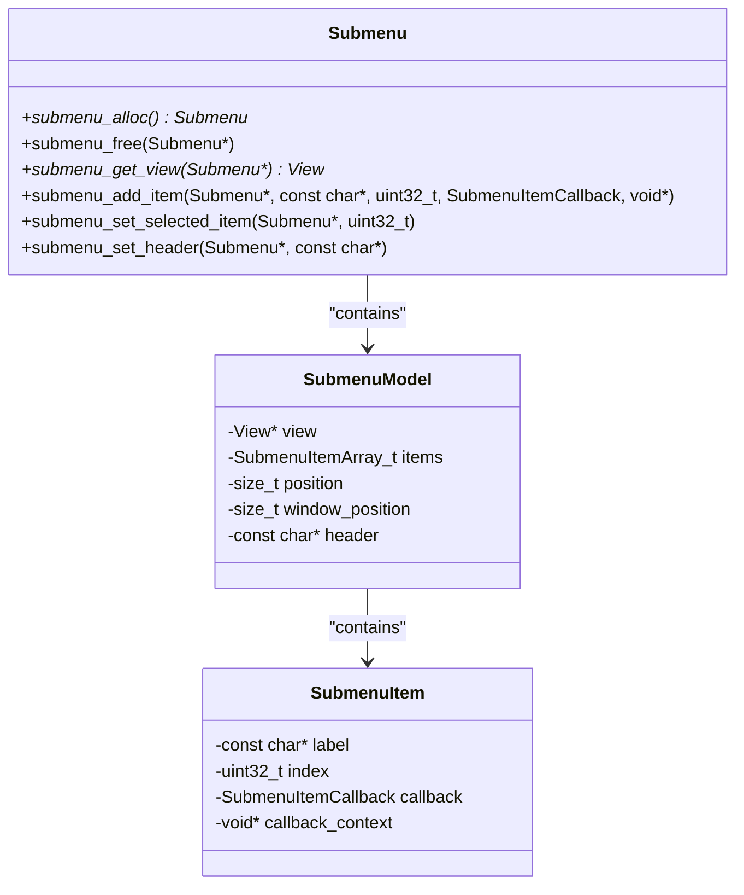
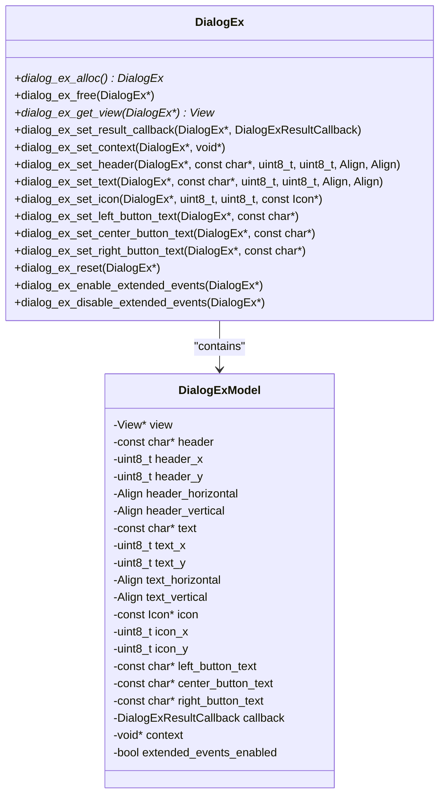
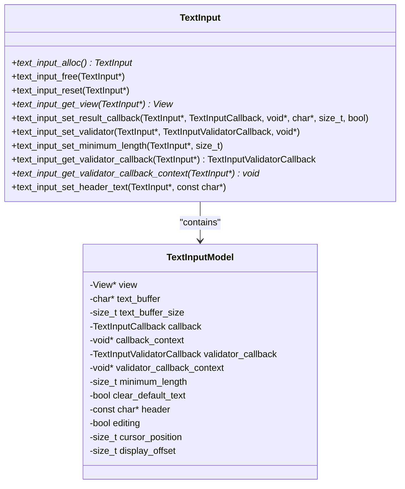
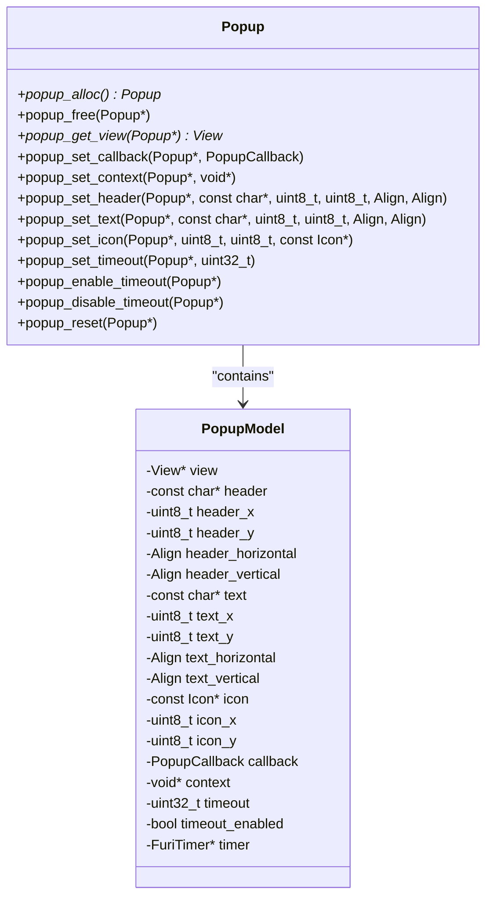
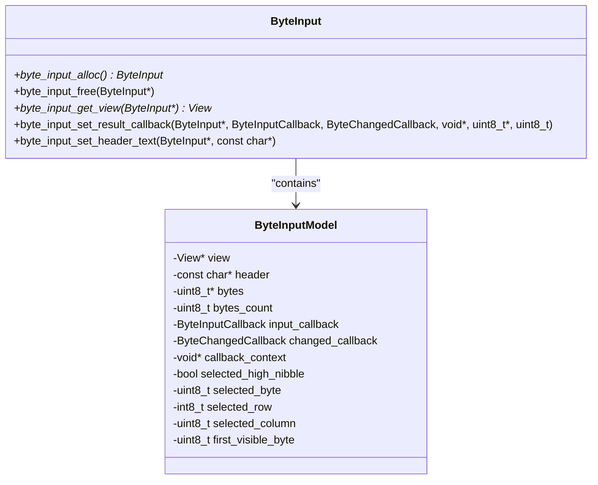
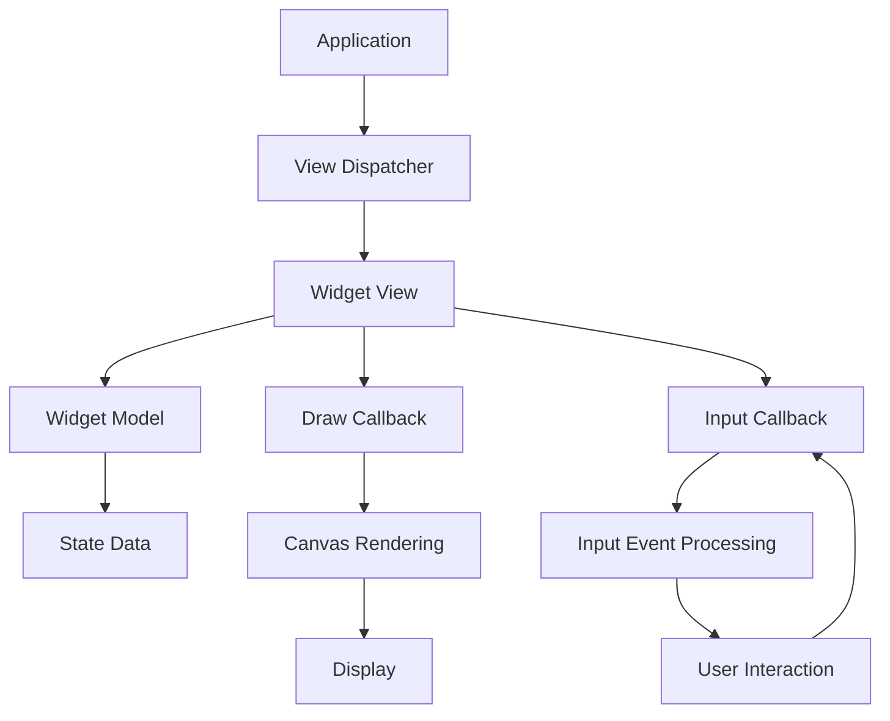

# Widget Library

<cite>
**Referenced Files in This Document**   
- [submenu.h](file://applications/services/gui/modules/submenu.h)
- [submenu.c](file://applications/services/gui/modules/submenu.c)
- [dialog_ex.h](file://applications/services/gui/modules/dialog_ex.h)
- [text_input.h](file://applications/services/gui/modules/text_input.h)
- [popup.h](file://applications/services/gui/modules/popup.h)
- [byte_input.h](file://applications/services/gui/modules/byte_input.h)
- [byte_input.c](file://applications/services/gui/modules/byte_input.c)
- [widget.h](file://applications/services/gui/modules/widget.h)
</cite>

## Table of Contents
1. [Introduction](#introduction)
2. [Core Widget Components](#core-widget-components)
3. [Submenu Widget](#submenu-widget)
4. [Dialog Widget](#dialog-widget)
5. [Text Input Widget](#text-input-widget)
6. [Popup Widget](#popup-widget)
7. [Byte Input Widget](#byte-input-widget)
8. [Widget System Architecture](#widget-system-architecture)
9. [Memory Management and Resource Cleanup](#memory-management-and-resource-cleanup)
10. [Best Practices for Widget Usage](#best-practices-for-widget-usage)
11. [Performance Optimization](#performance-optimization)

## Introduction
The Flipper Zero GUI framework provides a comprehensive widget library that enables developers to create intuitive user interfaces for applications on the device. This documentation details the implementation and usage of core widgets including submenu, dialog, text input, popup, and byte input components. The widget system is designed to be modular, efficient, and easy to use, allowing developers to quickly implement common UI patterns while maintaining consistency across applications. Each widget follows a consistent API pattern for allocation, configuration, and cleanup, ensuring predictable behavior and proper resource management.

## Core Widget Components
The Flipper Zero widget library consists of several core components that provide essential UI functionality for applications. These widgets are implemented as view modules within the GUI framework, each providing a specific interaction pattern. The primary widgets include submenu for navigation, dialog for user confirmation, text input for string entry, popup for temporary notifications, and byte input for hexadecimal data entry. All widgets follow a consistent design pattern with allocation functions, configuration methods, callback mechanisms, and cleanup routines. They are designed to work within the Flipper Zero's constrained hardware environment, optimizing for both memory usage and rendering performance.

**Section sources**
- [submenu.h](file://applications/services/gui/modules/submenu.h)
- [dialog_ex.h](file://applications/services/gui/modules/dialog_ex.h)
- [text_input.h](file://applications/services/gui/modules/text_input.h)
- [popup.h](file://applications/services/gui/modules/popup.h)
- [byte_input.h](file://applications/services/gui/modules/byte_input.h)

## Submenu Widget

The submenu widget provides a navigation interface that allows users to select from a list of options. It is commonly used as a primary navigation mechanism in applications, presenting a vertical list of selectable items. Each item in the submenu can have a label, an index value, a callback function, and a context pointer. When a user selects an item, the associated callback is invoked with the context and index parameters, enabling the application to respond appropriately to the selection.

To create a submenu, developers first allocate the widget using `submenu_alloc()`, then add items using `submenu_add_item()` which specifies the label, index, callback function, and context. The submenu can be customized with a header text and the selected item can be programmatically set using `submenu_set_selected_item()`. After configuration, the submenu's view can be obtained with `submenu_get_view()` and added to a view dispatcher for display.

**Diagram sources**
- [submenu.h](file://applications/services/gui/modules/submenu.h)
- [submenu.c](file://applications/services/gui/modules/submenu.c)

**Section sources**
- [submenu.h](file://applications/services/gui/modules/submenu.h)
- [submenu.c](file://applications/services/gui/modules/submenu.c)

## Dialog Widget

The dialog widget is used to present users with choices or confirmations, typically requiring a response before continuing. It supports up to three buttons (left, center, and right) with customizable text and handles various interaction events including button press, release, and click. The dialog can display a header, main text, and an icon to provide context for the user.

Dialogs are created using `dialog_ex_alloc()` and configured with various setter methods such as `dialog_ex_set_header()`, `dialog_ex_set_text()`, and `dialog_ex_set_icon()` to define the content. Button text is set with `dialog_ex_set_left_button_text()`, `dialog_ex_set_center_button_text()`, and `dialog_ex_set_right_button_text()`. A result callback is registered with `dialog_ex_set_result_callback()` to handle user interactions, receiving a `DialogExResult` enum value indicating which button was pressed and the type of interaction.

**Diagram sources**
- [dialog_ex.h](file://applications/services/gui/modules/dialog_ex.h)

**Section sources**
- [dialog_ex.h](file://applications/services/gui/modules/dialog_ex.h)

## Text Input Widget

The text input widget provides a virtual keyboard interface for users to enter text strings. It supports text validation through optional validator callbacks that can reject input based on custom criteria. The widget displays the current input text and provides an on-screen keyboard for character entry.

To use the text input widget, developers allocate it with `text_input_alloc()` and configure it with `text_input_set_result_callback()` which specifies the buffer for entered text, the callback to invoke when input is complete, and the context to pass to the callback. An optional validator can be set with `text_input_set_validator()` to validate the input before accepting it. The widget can also be configured with a header text using `text_input_set_header_text()`.

The text input widget handles various input events including character entry, backspace, and submission. When the user completes input (typically by pressing OK), the result callback is invoked with the context pointer. If a validator is set, it is called before the result callback, allowing the application to validate the input and potentially reject it by returning false.

**Diagram sources**
- [text_input.h](file://applications/services/gui/modules/text_input.h)

**Section sources**
- [text_input.h](file://applications/services/gui/modules/text_input.h)

## Popup Widget

The popup widget is designed for temporary notifications or simple user interactions that require minimal input. It can display text, icons, and has a configurable timeout after which it automatically dismisses. Popups are often used for status messages, warnings, or brief instructions.

Popups are created with `popup_alloc()` and can be configured with header and text content using `popup_set_header()` and `popup_set_text()`. An icon can be displayed with `popup_set_icon()`. The popup can be set to automatically dismiss after a specified timeout using `popup_set_timeout()` and `popup_enable_timeout()`. A callback can be registered with `popup_set_callback()` to handle dismissal events.

The popup widget is particularly useful for non-blocking notifications that don't require user interaction. When the timeout expires or the user dismisses the popup (typically by pressing Back), the callback is invoked with the context pointer, allowing the application to perform any necessary cleanup or follow-up actions.

**Diagram sources**
- [popup.h](file://applications/services/gui/modules/popup.h)

**Section sources**
- [popup.h](file://applications/services/gui/modules/popup.h)

## Byte Input Widget

The byte input widget provides a specialized interface for entering hexadecimal byte values. It displays the current byte values in a grid format and provides an on-screen keyboard with hexadecimal digits (0-9, A-F) for input. This widget is particularly useful for applications that require binary data entry, such as RFID or NFC tools.

The byte input widget is created with `byte_input_alloc()` and configured with `byte_input_set_result_callback()` which specifies the byte array to modify, the array length, callbacks for input completion and changes, and a context pointer. A header text can be set with `byte_input_set_header_text()` to provide instructions to the user.

The widget supports two interaction modes: direct byte selection and keyboard input. Users can navigate between bytes using the directional buttons and select individual nibbles (high or low 4 bits) for editing. When a nibble is selected, the on-screen keyboard appears, allowing the user to enter a hexadecimal digit. The widget provides visual feedback by highlighting the currently selected byte and nibble.

**Diagram sources**
- [byte_input.h](file://applications/services/gui/modules/byte_input.h)
- [byte_input.c](file://applications/services/gui/modules/byte_input.c)

**Section sources**
- [byte_input.h](file://applications/services/gui/modules/byte_input.h)
- [byte_input.c](file://applications/services/gui/modules/byte_input.c)

## Widget System Architecture

The Flipper Zero widget system is built on a modular architecture that leverages the underlying GUI framework's view system. Each widget is implemented as a view module, encapsulating its own drawing logic, input handling, and state management. The architecture follows a consistent pattern across all widgets, promoting code reuse and ease of understanding.

At the core of the widget system is the View abstraction, which provides a standard interface for rendering content and handling user input. Each widget allocates a View instance and associates it with a model structure that contains the widget's state. The view's draw callback is set to a widget-specific drawing function that renders the current state, while the input callback handles user interactions.

Widgets are designed to be composable and can be embedded within other views or combined to create more complex interfaces. The widget system uses a model-view pattern where the model contains the data and state, while the view handles presentation and user interaction. This separation of concerns allows for clean, maintainable code and facilitates testing.

**Diagram sources**
- [widget.h](file://applications/services/gui/modules/widget.h)
- [submenu.c](file://applications/services/gui/modules/submenu.c)
- [byte_input.c](file://applications/services/gui/modules/byte_input.c)

**Section sources**
- [widget.h](file://applications/services/gui/modules/widget.h)

## Memory Management and Resource Cleanup

Proper memory management is critical in the resource-constrained environment of the Flipper Zero. The widget library follows a consistent pattern for resource allocation and cleanup to prevent memory leaks and ensure reliable operation.

Each widget follows the allocate-use-free pattern. Widgets are created with an alloc function (e.g., `submenu_alloc()`, `popup_alloc()`) which returns a pointer to the widget instance. After use, the widget must be freed with the corresponding free function (e.g., `submenu_free()`, `popup_free()`). These functions handle the allocation and deallocation of both the widget structure and its associated view and model.

The widget system uses the FURI (Flipper Utility Runtime Infrastructure) memory management functions, which provide bounds checking and error detection. When freeing a widget, the cleanup process releases the view, frees the model data, and deallocates the widget structure itself. Developers must ensure that widgets are properly freed when no longer needed, typically in scene unload handlers or when transitioning between application states.

Special attention should be paid to callback contexts, as these often contain pointers to application data. Developers must ensure that the context data remains valid for the lifetime of the widget, or explicitly manage its lifecycle to prevent dangling pointers.

**Section sources**
- [submenu.h](file://applications/services/gui/modules/submenu.h)
- [popup.h](file://applications/services/gui/modules/popup.h)
- [byte_input.h](file://applications/services/gui/modules/byte_input.h)

## Best Practices for Widget Usage

When developing applications with the Flipper Zero widget library, several best practices should be followed to ensure a consistent and reliable user experience:

1. **Always clean up resources**: Ensure that every allocated widget is properly freed to prevent memory leaks. This is typically done in scene unload handlers or when transitioning between application states.

2. **Use appropriate widgets for the task**: Select the widget that best matches the intended user interaction. Use submenu for navigation, dialog for confirmations, text input for string entry, popup for notifications, and byte input for hexadecimal data.

3. **Provide clear user feedback**: Use header texts, icons, and appropriate button labels to make the purpose of each widget clear to the user. Avoid ambiguous labels or instructions.

4. **Handle edge cases**: Validate input where appropriate, especially with text and byte input widgets. Use validator callbacks to prevent invalid data entry.

5. **Consider user flow**: Design the sequence of widget interactions to be intuitive and minimize user effort. Avoid requiring users to navigate through multiple screens unnecessarily.

6. **Use consistent styling**: Follow the Flipper Zero design guidelines for text alignment, font usage, and spacing to maintain a consistent look and feel across applications.

7. **Test thoroughly**: Verify that all callback paths are handled correctly and that widgets behave as expected under various conditions, including rapid input and edge cases.

**Section sources**
- [submenu.h](file://applications/services/gui/modules/submenu.h)
- [dialog_ex.h](file://applications/services/gui/modules/dialog_ex.h)
- [text_input.h](file://applications/services/gui/modules/text_input.h)

## Performance Optimization

The Flipper Zero's limited hardware resources require careful consideration of performance when using widgets. Several optimization strategies can be employed to ensure responsive user interfaces:

1. **Minimize widget creation**: Reuse widgets where possible rather than creating and destroying them frequently. Allocate widgets once and reset their state as needed.

2. **Optimize drawing operations**: The widget system is designed to minimize unnecessary redraws. Ensure that only changed portions of the screen are updated when possible.

3. **Use appropriate update frequencies**: For widgets that display dynamic content, avoid updating more frequently than necessary. Use timers judiciously and clean them up when no longer needed.

4. **Limit memory allocation**: The widget system uses pre-allocated buffers where possible to avoid heap fragmentation. Avoid allocating large data structures in widget callbacks.

5. **Optimize input handling**: The input callback system is designed to be efficient, but complex processing should be minimized in the GUI thread to maintain responsiveness.

6. **Consider screen updates**: The Flipper Zero's e-paper display has specific characteristics that affect perceived performance. Batch screen updates when possible and avoid rapid, small changes that can cause visible flicker.

By following these optimization practices, developers can create applications that provide a smooth, responsive user experience even within the hardware constraints of the Flipper Zero.

**Section sources**
- [submenu.c](file://applications/services/gui/modules/submenu.c)
- [byte_input.c](file://applications/services/gui/modules/byte_input.c)
- [widget.h](file://applications/services/gui/modules/widget.h)