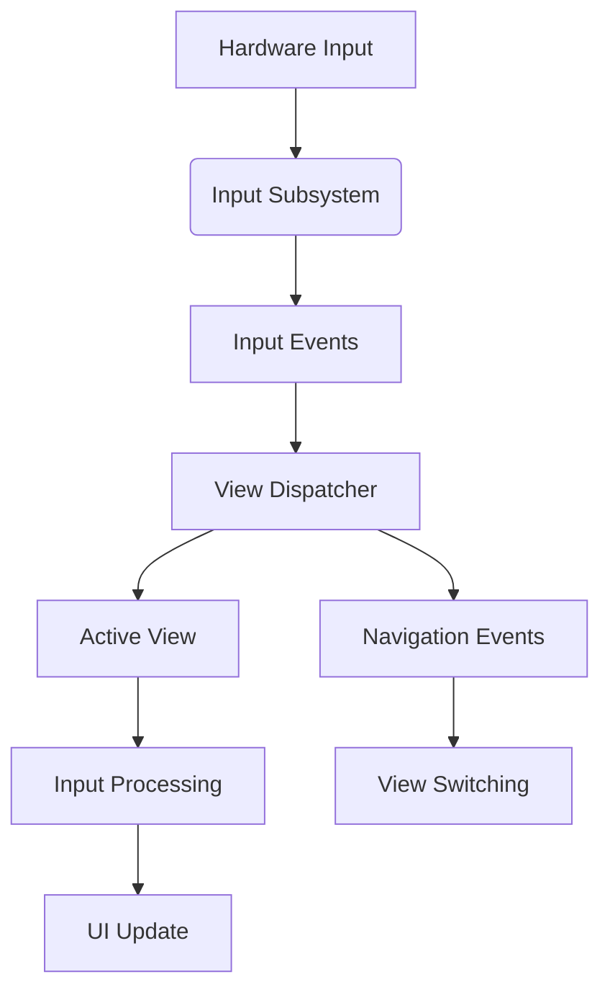
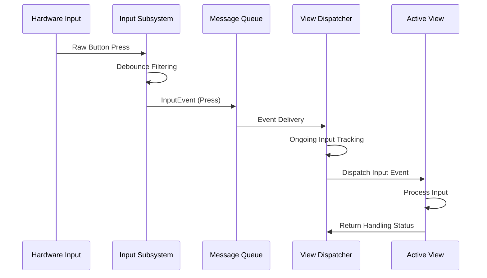
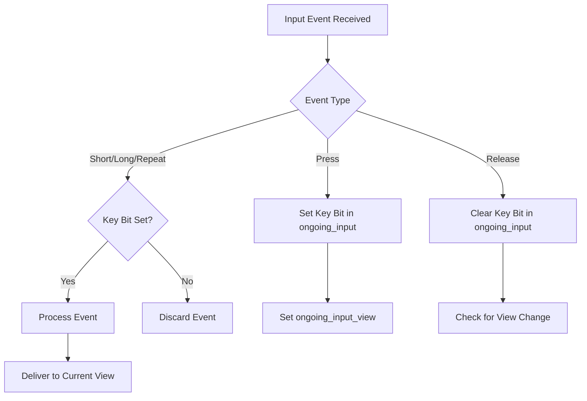
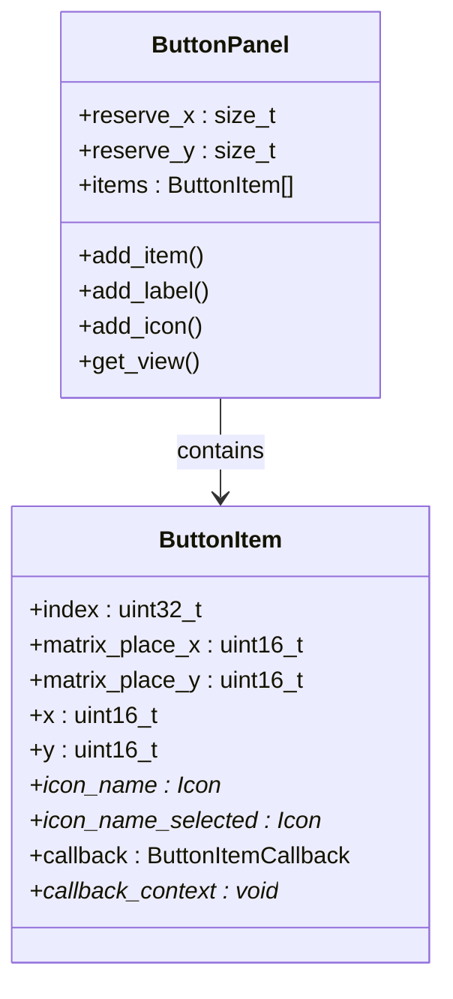
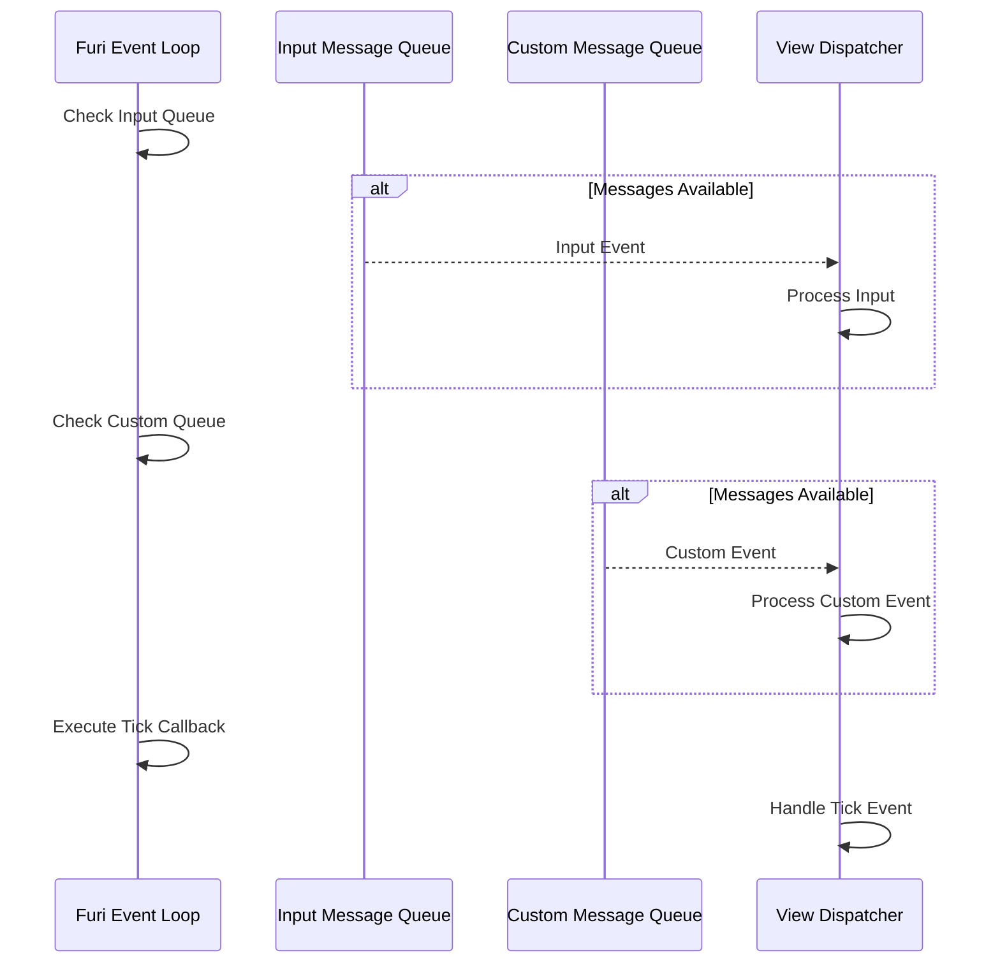

# Input Handling

<cite>
**Referenced Files in This Document**   
- [input.h](file://applications/services/input/input.h)
- [gui.h](file://applications/services/gui/gui.h)
- [view.h](file://applications/services/gui/view.h)
- [view_port.h](file://applications/services/gui/view_port.h)
- [view_dispatcher.c](file://applications/services/gui/view_dispatcher.c)
- [view_dispatcher.h](file://applications/services/gui/view_dispatcher.h)
- [view_holder.c](file://applications/services/gui/view_holder.c)
- [button_panel.h](file://applications/services/gui/modules/button_panel.h)
- [text_input.h](file://applications/services/gui/modules/text_input.h)
- [number_input.h](file://applications/services/gui/modules/number_input.h)
</cite>

## Table of Contents
1. [Introduction](#introduction)
2. [View Dispatcher Architecture](#view-dispatcher-architecture)
3. [Input Event Processing](#input-event-processing)
4. [Input Propagation and Focus Management](#input-propagation-and-focus-management)
5. [Input Components](#input-components)
6. [Event Loop Integration](#event-loop-integration)
7. [Common Input Issues and Solutions](#common-input-issues-and-solutions)
8. [Best Practices for Input Handling](#best-practices-for-input-handling)

## Introduction

The Flipper Zero's GUI system implements a sophisticated input handling mechanism that manages hardware button presses, touch interactions, and gesture recognition. At the core of this system is the view dispatcher, which orchestrates input event propagation, focus management, and navigation between different UI components. This document provides a comprehensive analysis of the input handling architecture, focusing on the implementation details of the view dispatcher and its interaction with various input components.

The input system is designed to be both responsive and reliable, handling the complexities of embedded device input where timing, debouncing, and event ordering are critical. It supports multiple input types including press, release, short, long, and repeat events, enabling rich user interactions while maintaining system stability.

**Section sources**
- [input.h](file://applications/services/input/input.h#L1-L58)
- [gui.h](file://applications/services/gui/gui.h#L1-L152)

## View Dispatcher Architecture

The view dispatcher serves as the central coordinator for input events in the Flipper Zero GUI system. It acts as an intermediary between the hardware input layer and the application's UI components, managing the flow of input events and ensuring proper delivery to the active view.

The architecture follows a hierarchical pattern where the view dispatcher maintains a collection of views identified by unique IDs. When an input event occurs, it is routed through the dispatcher to the currently active view. The dispatcher also manages view transitions, handling navigation events and maintaining the correct view state.

**Diagram sources**
- [view_dispatcher.h](file://applications/services/gui/view_dispatcher.h#L1-L50)
- [view_dispatcher.c](file://applications/services/gui/view_dispatcher.c#L1-L407)

**Section sources**
- [view_dispatcher.h](file://applications/services/gui/view_dispatcher.h#L1-L50)
- [view_dispatcher.c](file://applications/services/gui/view_dispatcher.c#L1-L407)

## Input Event Processing

The input event processing pipeline in the Flipper Zero firmware is designed to handle various input types with precise timing and debouncing. The system defines several input event types that represent different user interactions:

- **InputTypePress**: Triggered when a button is initially pressed, after debounce filtering
- **InputTypeRelease**: Generated when a button is released
- **InputTypeShort**: Emitted for brief button presses within a defined threshold
- **InputTypeLong**: Triggered for extended button presses after a timeout period
- **InputTypeRepeat**: Generated periodically during sustained button presses

The input subsystem uses a message queue to decouple event generation from processing, ensuring that input events are handled in a timely manner without blocking other system operations. When input events are enabled in the view dispatcher, they are placed in a dedicated message queue and processed asynchronously by the event loop.

**Diagram sources**
- [input.h](file://applications/services/input/input.h#L21-L28)
- [view_dispatcher.c](file://applications/services/gui/view_dispatcher.c#L254-L280)

**Section sources**
- [input.h](file://applications/services/input/input.h#L21-L28)
- [view_dispatcher.c](file://applications/services/gui/view_dispatcher.c#L254-L280)

## Input Propagation and Focus Management

The view dispatcher implements a sophisticated focus management system that ensures input events are delivered to the correct UI component. When a button press event occurs, the dispatcher establishes an "ongoing input" context that tracks which view should receive subsequent events in the sequence.

The focus management system uses a bit mask to track which keys are currently pressed, allowing it to validate the complementarity of input events. This prevents issues that could arise from missed events or out-of-order delivery. When a press event is received, the corresponding bit is set in the ongoing_input mask. When a release event occurs, the bit is cleared. For intermediate events like short, long, or repeat, the system verifies that the corresponding press event was previously recorded.

The system also handles the scenario where the active view changes during an input sequence. If a view switch occurs while a button is still pressed, the release event is delivered to the original view that received the press event, ensuring proper event pairing and preventing state inconsistencies.

**Diagram sources**
- [view_dispatcher.c](file://applications/services/gui/view_dispatcher.c#L254-L308)
- [view_holder.c](file://applications/services/gui/view_holder.c#L129-L159)

**Section sources**
- [view_dispatcher.c](file://applications/services/gui/view_dispatcher.c#L254-L308)
- [view_holder.c](file://applications/services/gui/view_holder.c#L129-L159)

## Input Components

The Flipper Zero GUI system provides several specialized input components that abstract common UI patterns and simplify application development. These components are built on the core view system and provide pre-built functionality for common input scenarios.

### Button Panel

The button panel component allows developers to create grids of interactive buttons with icons and labels. It handles navigation between buttons using directional inputs and manages the selection state. The component supports custom callbacks for each button, enabling specific actions to be triggered when a button is selected.

**Diagram sources**
- [button_panel.h](file://applications/services/gui/modules/button_panel.h#L1-L119)

### Text Input

The text input component provides a virtual keyboard interface for text entry. It supports custom validation functions, minimum length requirements, and header text display. The component manages the text buffer and provides callbacks when input is completed.

**Section sources**
- [button_panel.h](file://applications/services/gui/modules/button_panel.h#L1-L119)
- [text_input.h](file://applications/services/gui/modules/text_input.h#L1-L89)
- [number_input.h](file://applications/services/gui/modules/number_input.h#L1-L70)

## Event Loop Integration

The view dispatcher integrates with the Furi event loop system to provide non-blocking input processing. When input queueing is enabled, the dispatcher creates message queues for input events and custom events, subscribing to them through the event loop.

The event loop integration allows the system to handle input events asynchronously while continuing to process other system events. This prevents input processing from blocking time-critical operations and ensures a responsive user interface. The dispatcher sets up callbacks for both input events and custom events, which are triggered when messages are available in their respective queues.

The system also supports a tick event callback that can be configured with a specific period. This allows views to receive periodic updates, which is useful for animations, status updates, or time-based operations.

**Diagram sources**
- [view_dispatcher.c](file://applications/services/gui/view_dispatcher.c#L49-L70)
- [view_dispatcher.c](file://applications/services/gui/view_dispatcher.c#L114-L118)

**Section sources**
- [view_dispatcher.c](file://applications/services/gui/view_dispatcher.c#L49-L70)
- [view_dispatcher.c](file://applications/services/gui/view_dispatcher.c#L114-L118)

## Common Input Issues and Solutions

### Input Lag

Input lag can occur when the event processing queue becomes overloaded or when views perform time-consuming operations in their input handlers. The primary solution is to ensure that input callbacks execute quickly and defer any lengthy operations to background tasks or timers.

### Missed Events

Missed events can happen due to queue overflow or system interruptions. The ongoing_input tracking system helps mitigate this by validating event complementarity. Developers should also ensure that their message queues have sufficient capacity for peak input rates.

### Conflicting Input Handlers

Conflicting input handlers can occur when multiple views attempt to process the same input events. The view dispatcher's focus management system prevents this by ensuring that only the active view receives input events. Developers should avoid registering global input handlers that could interfere with the dispatcher's operation.

**Section sources**
- [view_dispatcher.c](file://applications/services/gui/view_dispatcher.c#L262-L268)
- [view_holder.c](file://applications/services/gui/view_holder.c#L138-L144)

## Best Practices for Input Handling

1. **Keep Input Handlers Fast**: Input callbacks should execute quickly to maintain responsiveness. Defer complex operations to separate threads or timers.

2. **Use Proper Event Types**: Choose the appropriate input event type (short, long, repeat) for the desired user interaction to provide intuitive controls.

3. **Handle All Event Types**: Ensure that input handlers properly handle press, release, and intermediate events to maintain consistent state.

4. **Validate Input Complementarity**: Always check that release events correspond to previously recorded press events to prevent state corruption.

5. **Manage Focus Correctly**: Be aware of how view switching affects input sequences and ensure that ongoing input is properly handled during transitions.

**Section sources**
- [view_dispatcher.c](file://applications/services/gui/view_dispatcher.c#L254-L308)
- [view_holder.c](file://applications/services/gui/view_holder.c#L129-L159)