# User Interface

<cite>
**Referenced Files in This Document**   
- [u8g2.h](file://lib/u8g2/u8g2.h)
- [u8g2_glue.c](file://lib/u8g2/u8g2_glue.c)
- [scene_manager.h](file://applications/services/gui/scene_manager.h)
- [scene_manager.c](file://applications/services/gui/scene_manager.c)
- [view_dispatcher.h](file://applications/services/gui/view_dispatcher.h)
- [view_dispatcher.c](file://applications/services/gui/view_dispatcher.c)
- [gui.h](file://applications/services/gui/gui.h)
- [gui.c](file://applications/services/gui/gui.c)
- [view.h](file://applications/services/gui/view.h)
- [view_port.h](file://applications/services/gui/view_port.h)
- [canvas.h](file://applications/services/gui/canvas.h)
- [menu.c](file://applications/services/gui/modules/menu.c)
- [dialog_ex.c](file://applications/services/gui/modules/dialog_ex.c)
- [text_input.c](file://applications/services/gui/modules/text_input.c)
- [power.c](file://applications/services/power/power_service/power.c)
- [input.h](file://applications/services/input/input.h)
- [input_cli.c](file://applications/services/input/input_cli.c)
</cite>

## Table of Contents
1. [Introduction](#introduction)
2. [Architecture Overview](#architecture-overview)
3. [Display Driver Integration](#display-driver-integration)
4. [View Management System](#view-management-system)
5. [Scene Handling Mechanism](#scene-handling-mechanism)
6. [UI Component Framework](#ui-component-framework)
7. [User Input Processing](#user-input-processing)
8. [Screen Update Management](#screen-update-management)
9. [Common UI Patterns](#common-ui-patterns)
10. [Custom UI Element Creation](#custom-ui-element-creation)
11. [Performance Optimization](#performance-optimization)
12. [Troubleshooting Common Issues](#troubleshooting-common-issues)

## Introduction
The Flipper Zero user interface framework is a layered architecture designed for efficient graphics rendering and responsive user interaction on resource-constrained embedded hardware. This documentation provides a comprehensive analysis of the GUI system, covering its architecture, implementation details, and practical usage patterns. The framework integrates the u8g2 graphics library for low-level display operations while providing a sophisticated view management system that handles screen transitions, input processing, and scene navigation. The design emphasizes power efficiency, responsiveness, and developer usability, enabling the creation of rich user interfaces for various applications on the Flipper Zero platform.

## Architecture Overview

The Flipper Zero GUI system follows a layered architectural pattern that separates concerns between display drivers, view management, and application logic. This multi-layered approach enables efficient rendering, responsive user interaction, and modular application development.

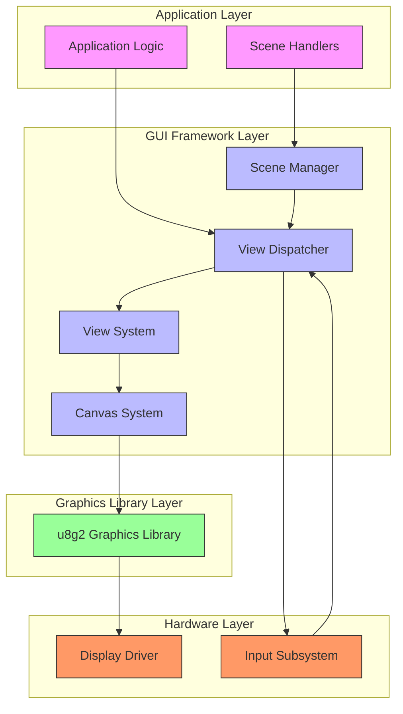

**Diagram sources**
- [scene_manager.h](file://applications/services/gui/scene_manager.h)
- [view_dispatcher.h](file://applications/services/gui/view_dispatcher.h)
- [gui.h](file://applications/services/gui/gui.h)
- [canvas.h](file://applications/services/gui/canvas.h)

The architecture consists of four main layers:
1. **Application Layer**: Contains application-specific logic and scene handlers
2. **GUI Framework Layer**: Manages views, scenes, and user input
3. **Graphics Library Layer**: Provides low-level graphics primitives via u8g2
4. **Hardware Layer**: Interfaces with physical display and input devices

This layered design enables separation of concerns, where each layer has well-defined responsibilities and interfaces with adjacent layers through well-defined APIs.

**Section sources**
- [scene_manager.h](file://applications/services/gui/scene_manager.h)
- [view_dispatcher.h](file://applications/services/gui/view_dispatcher.h)
- [gui.h](file://applications/services/gui/gui.h)

## Display Driver Integration

The Flipper Zero GUI system integrates the u8g2 graphics library to provide low-level display operations and hardware abstraction. This integration enables the framework to support various display types while maintaining a consistent API for higher-level components.

### u8g2 Graphics Library Integration

The u8g2 library serves as the foundation for all graphics operations in the Flipper Zero firmware. It provides a comprehensive set of functions for drawing primitives, text rendering, and bitmap operations. The integration is implemented through the Canvas system, which acts as a wrapper around u8g2 functionality.

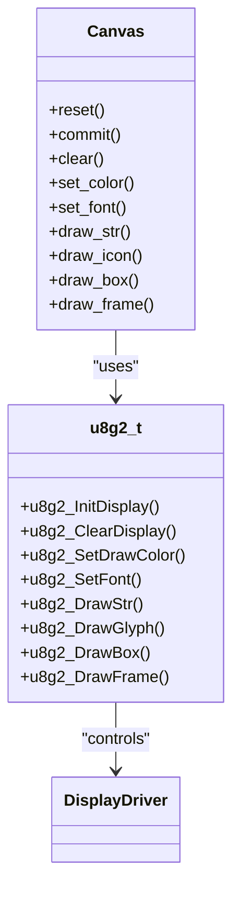

**Diagram sources**
- [u8g2.h](file://lib/u8g2/u8g2.h)
- [canvas.h](file://applications/services/gui/canvas.h)

The Canvas system provides a higher-level abstraction over u8g2, offering additional features such as:
- Font management with multiple font types (FontPrimary, FontSecondary, FontBatteryPercent)
- Color management with support for white, black, and XOR modes
- Alignment utilities for text and graphical elements
- Frame buffer management for efficient screen updates

The integration between Canvas and u8g2 is handled through the `u8g2_glue.c` module, which bridges the two systems and ensures proper initialization and configuration of the display hardware.

### Display Configuration and Initialization

Display initialization follows a structured process that ensures proper configuration of the display hardware and graphics library. The process begins with hardware-specific initialization, followed by u8g2 setup, and finally Canvas system initialization.

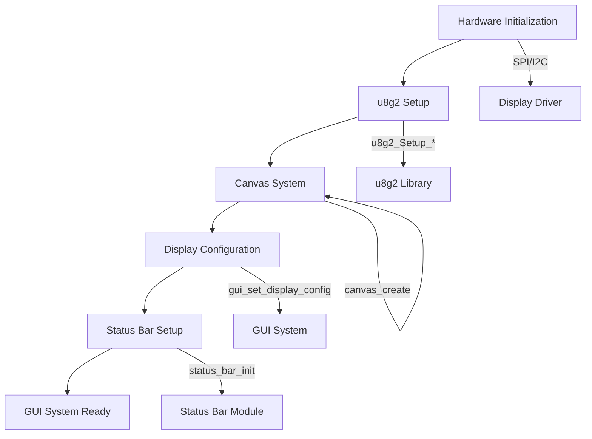

**Diagram sources**
- [u8g2.h](file://lib/u8g2/u8g2.h)
- [gui.c](file://applications/services/gui/gui.c)
- [canvas.h](file://applications/services/gui/canvas.h)

The display configuration process includes setting the display orientation, contrast, and power management parameters. The system supports multiple display orientations (horizontal, vertical, and flipped variants) to accommodate different use cases and user preferences.

**Section sources**
- [u8g2.h](file://lib/u8g2/u8g2.h)
- [u8g2_glue.c](file://lib/u8g2/u8g2_glue.c)
- [canvas.h](file://applications/services/gui/canvas.h)

## View Management System

The View Management System is a core component of the Flipper Zero GUI framework, responsible for organizing and rendering UI elements on the screen. It provides a flexible architecture for managing multiple views and their transitions.

### View Dispatcher Architecture

The View Dispatcher is the central component of the view management system, responsible for coordinating which view is currently displayed and handling transitions between views. It acts as a container for multiple views and manages their lifecycle.

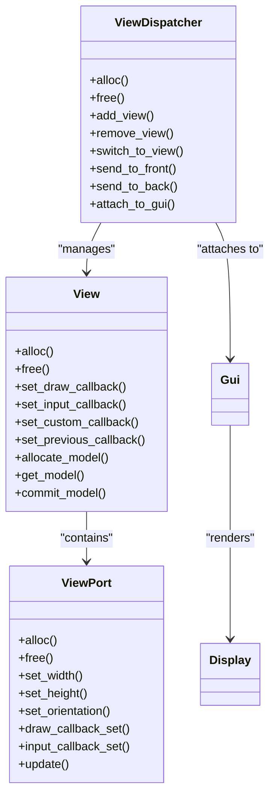

**Diagram sources**
- [view_dispatcher.h](file://applications/services/gui/view_dispatcher.h)
- [view.h](file://applications/services/gui/view.h)
- [view_port.h](file://applications/services/gui/view_port.h)

The View Dispatcher supports three main view types:
- **Desktop**: Fullscreen with status bar
- **Window**: With status bar
- **Fullscreen**: Without status bar

This allows applications to choose the appropriate display mode based on their requirements.

### View Lifecycle Management

The view lifecycle is managed through a well-defined sequence of operations that ensure proper initialization, rendering, and cleanup of views. Each view goes through several states during its lifetime:

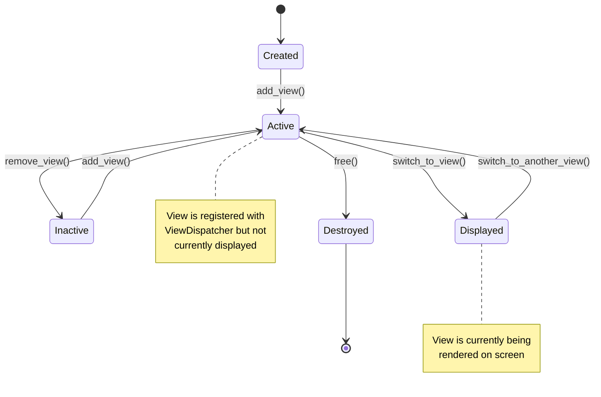

**Diagram sources**
- [view_dispatcher.c](file://applications/services/gui/view_dispatcher.c)
- [view.h](file://applications/services/gui/view.h)

The lifecycle management ensures that views are properly initialized before display and cleaned up after removal, preventing memory leaks and display artifacts.

### ViewPort System

The ViewPort system provides a flexible mechanism for rendering views to the display. Each ViewPort represents a rectangular area on the screen and contains the necessary information for rendering a view.

```mermaid
classDiagram
class ViewPort {
-width
-height
-orientation
-enabled
-draw_callback
-input_callback
-context
}
class Canvas {
-frame_buffer
-orientation
-color
-font
}
ViewPort --> Canvas : "uses for rendering"
ViewPort --> InputEvent : "receives input"
note right of ViewPort
Manages a rectangular area\non the display with specific\nrendering and input properties
end note
```

**Diagram sources**
- [view_port.h](file://applications/services/gui/view_port.h)
- [canvas.h](file://applications/services/gui/canvas.h)

The ViewPort system supports multiple layers, allowing for complex UI compositions with overlapping elements. The layers are organized as follows:
1. Desktop layer (fullscreen with status bar)
2. Window layer (with status bar)
3. Status bar layers (top, left, right)
4. Fullscreen layer (without status bar)

This layering system enables the creation of rich user interfaces with status indicators, notifications, and other overlay elements.

**Section sources**
- [view_dispatcher.h](file://applications/services/gui/view_dispatcher.h)
- [view_dispatcher.c](file://applications/services/gui/view_dispatcher.c)
- [view.h](file://applications/services/gui/view.h)
- [view_port.h](file://applications/services/gui/view_port.h)

## Scene Handling Mechanism

The Scene Handling Mechanism is a crucial component of the Flipper Zero GUI framework, providing a structured approach to managing application states and transitions between them.

### Scene Manager Architecture

The Scene Manager implements a stack-based navigation system that allows applications to manage complex user flows with multiple screens and states. It maintains a stack of scene identifiers and coordinates transitions between scenes.

```mermaid
classDiagram
class SceneManager {
-scene_id_stack
-scene_handlers
-context
-scene[]
}
class SceneManagerHandlers {
-on_enter_handlers
-on_event_handlers
-on_exit_handlers
-scene_num
}
class SceneManagerEvent {
-type
-event
}
SceneManager --> SceneManagerHandlers : "uses"
SceneManager --> SceneManagerEvent : "processes"
note right of SceneManager
Maintains a stack of scene\nIDs and coordinates transitions\nbetween scenes using handlers
end note
```

**Diagram sources**
- [scene_manager.h](file://applications/services/gui/scene_manager.h)
- [scene_manager.c](file://applications/services/gui/scene_manager.c)

The Scene Manager supports three types of events:
- **Custom events**: Application-specific events
- **Back events**: Navigation back to previous scene
- **Tick events**: Periodic updates

### Scene Transition Patterns

The Scene Manager implements several transition patterns to support different navigation requirements:

```mermaid
flowchart TD
A[Current Scene] --> B{Transition Type}
B --> C[Simple Switch]
B --> D[Stack Push]
B --> E[Stack Pop]
B --> F[Search and Switch]
C --> G[scene_manager_next_scene()]
D --> H[scene_manager_next_scene()]
E --> I[scene_manager_previous_scene()]
F --> J[scene_manager_search_and_switch_to_previous_scene()]
style C fill:#f96,stroke:#333
style D fill:#f96,stroke:#333
style E fill:#f96,stroke:#333
style F fill:#f96,stroke:#333
```

**Diagram sources**
- [scene_manager.c](file://applications/services/gui/scene_manager.c)

The transition patterns include:
- **Simple Switch**: Direct transition to a specified scene
- **Stack Push**: Add a new scene to the navigation stack
- **Stack Pop**: Return to the previous scene by removing the current scene from the stack
- **Search and Switch**: Search for a specific scene in the navigation stack and switch to it

### Scene Lifecycle Management

Each scene goes through a well-defined lifecycle with specific entry and exit points:

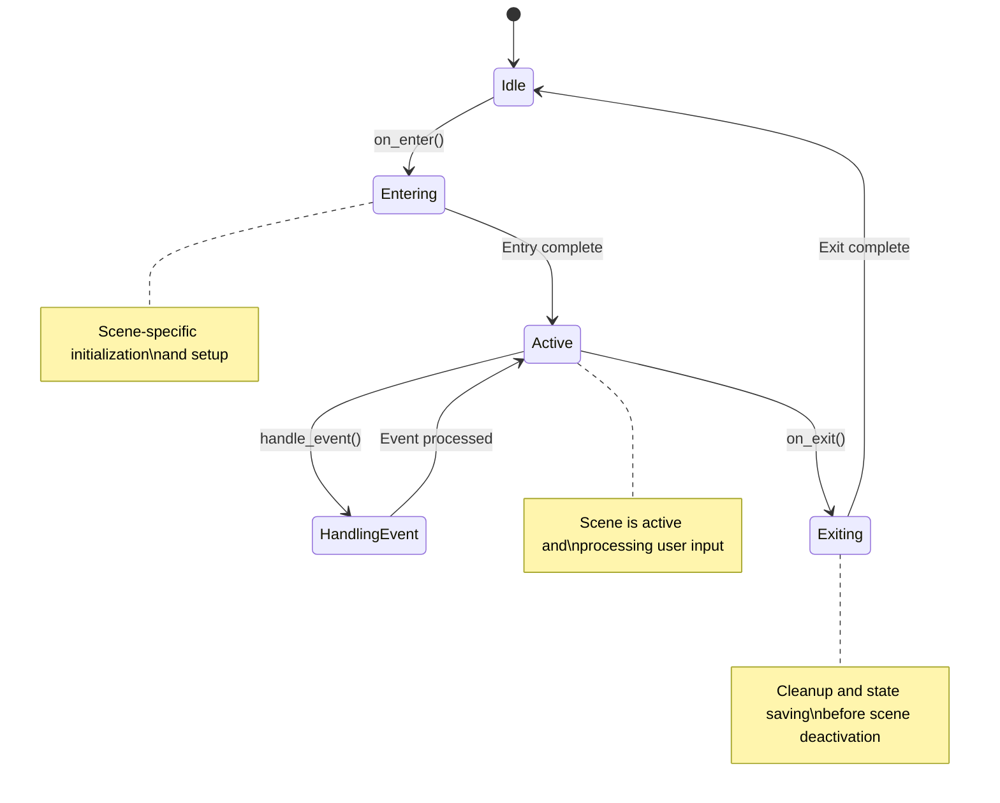

**Diagram sources**
- [scene_manager.h](file://applications/services/gui/scene_manager.h)

The lifecycle management ensures that scenes are properly initialized when entered and cleaned up when exited, maintaining application state consistency and preventing resource leaks.

**Section sources**
- [scene_manager.h](file://applications/services/gui/scene_manager.h)
- [scene_manager.c](file://applications/services/gui/scene_manager.c)

## UI Component Framework

The Flipper Zero UI framework provides a rich set of pre-built components that simplify the creation of common user interface elements. These components are designed to be reusable, configurable, and easy to integrate into applications.

### Menu Component

The Menu component provides a flexible system for creating navigable lists of items with icons and labels. It supports multiple visual styles and interaction patterns.

```mermaid
classDiagram
class Menu {
+alloc()
+free()
+get_view()
+add_item()
+reset()
+set_selected_item()
}
class MenuItem {
-label
-icon
-index
-callback
-callback_context
}
class MenuModel {
-items
-position
-scroll_counter
-vertical_offset
-my_menu_style
-gamemode
}
Menu --> MenuItem : "contains"
Menu --> MenuModel : "uses"
Menu --> View : "implements"
note right of Menu
Supports multiple styles : \nList, Wii, Compact\nWith scrolling and selection
end note
```

**Diagram sources**
- [menu.c](file://applications/services/gui/modules/menu.c)
- [menu.h](file://applications/services/gui/modules/menu.h)

The Menu component supports three main styles:
- **List Style**: Vertical list with scrolling
- **Wii Style**: Grid layout with visual emphasis on selected item
- **Compact Style**: Dense grid layout for space-constrained interfaces

### Dialog Component

The Dialog component provides a system for creating modal dialogs that prompt users for input or confirmation. It supports customizable layouts with headers, text, icons, and action buttons.

```mermaid
classDiagram
class DialogEx {
+alloc()
+free()
+get_view()
+set_result_callback()
+set_context()
+set_header()
+set_text()
+set_icon()
+set_left_button_text()
+set_center_button_text()
+set_right_button_text()
+reset()
+enable_extended_events()
+disable_extended_events()
}
class DialogExModel {
-header
-text
-icon
-left_text
-center_text
-right_text
}
class TextElement {
-text
-x
-y
-horizontal
-vertical
}
class IconElement {
-x
-y
-icon
}
DialogEx --> DialogExModel : "uses"
DialogExModel --> TextElement : "contains"
DialogExModel --> IconElement : "contains"
DialogEx --> View : "implements"
note right of DialogEx
Supports header, text, icon,\nand up to three action buttons\nwith customizable callbacks
end note
```

**Diagram sources**
- [dialog_ex.c](file://applications/services/gui/modules/dialog_ex.c)
- [dialog_ex.h](file://applications/services/gui/modules/dialog_ex.h)

The Dialog component supports extended events, allowing applications to receive notifications for button press, release, and repeat events, enabling more sophisticated interaction patterns.

### Text Input Component

The Text Input component provides a system for collecting text input from users. It supports various input methods and validation patterns.

```mermaid
classDiagram
class TextInput {
+alloc()
+free()
+get_view()
+set_result_callback()
+set_context()
+set_header_text()
+set_text()
+set_validator_callback()
+set_validator_context()
+set_max_length()
+set_accept_empty()
+reset()
}
class TextInputModel {
-text
-cursor_pos
-validator_callback
-validator_context
-max_length
-accept_empty
-result_callback
-result_context
}
TextInput --> TextInputModel : "uses"
TextInput --> View : "implements"
note right of TextInput
Supports text entry with\ncursor navigation, validation,\nand customizable callbacks
end note
```

**Diagram sources**
- [text_input.c](file://applications/services/gui/modules/text_input.c)

The Text Input component handles various input events, including cursor movement, character entry, and backspace operations, providing a complete solution for text input in Flipper Zero applications.

**Section sources**
- [menu.c](file://applications/services/gui/modules/menu.c)
- [dialog_ex.c](file://applications/services/gui/modules/dialog_ex.c)
- [text_input.c](file://applications/services/gui/modules/text_input.c)

## User Input Processing

The user input processing system in the Flipper Zero firmware is designed to handle various input events from physical buttons and provide a consistent interface for applications.

### Input Event System

The input system processes physical button presses and generates logical input events that applications can respond to. It handles debouncing, repeat events, and event sequencing to provide a reliable input interface.

```mermaid
classDiagram
class InputEvent {
-sequence
-key
-type
}
class InputType {
-InputTypePress
-InputTypeRelease
-InputTypeShort
-InputTypeLong
-InputTypeRepeat
}
class InputKey {
-InputKeyUp
-InputKeyDown
-InputKeyLeft
-InputKeyRight
-InputKeyOk
-InputKeyBack
}
InputEvent --> InputType : "has"
InputEvent --> InputKey : "has"
note right of InputEvent
Represents a single input\nevent with type, key, and\nsequence information
end note
```

**Diagram sources**
- [input.h](file://applications/services/input/input.h)

The input system generates five types of events:
- **Press**: Button press detected after debounce
- **Release**: Button release detected after debounce
- **Short**: Short press event (press and release within threshold)
- **Long**: Long press event (held beyond threshold)
- **Repeat**: Repeat event (generated periodically during long press)

### Input Event Handling

The View Dispatcher processes input events and routes them to the appropriate view based on the current state and event complementarity.

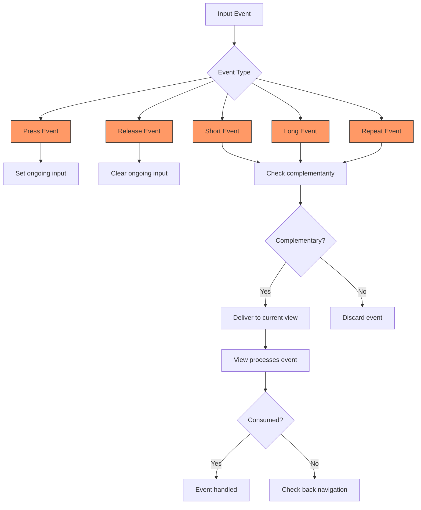

**Diagram sources**
- [view_dispatcher.c](file://applications/services/gui/view_dispatcher.c)
- [input.h](file://applications/services/input/input.h)

The input system ensures event complementarity by tracking ongoing input sequences and discarding non-complementary events, preventing inconsistent state and improving user experience.

### Input Event Propagation

Input events are propagated through the system using a publish-subscribe pattern, allowing multiple components to respond to input events.

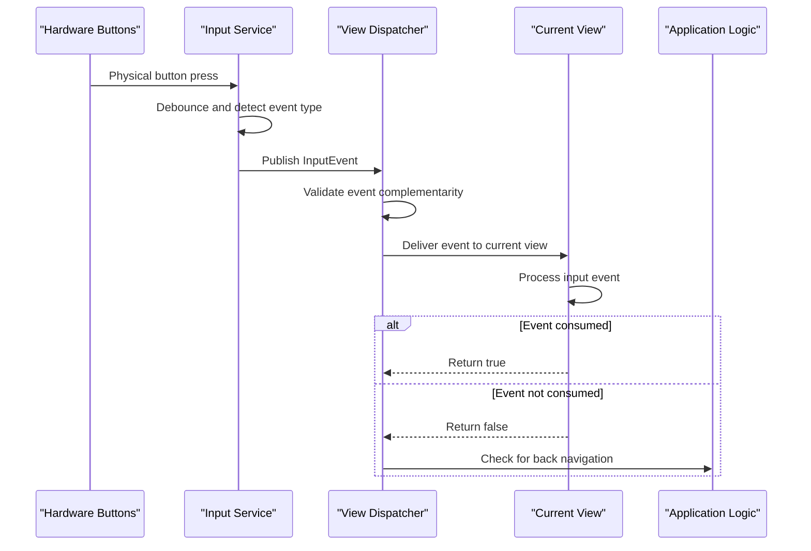

**Diagram sources**
- [view_dispatcher.c](file://applications/services/gui/view_dispatcher.c)
- [input.h](file://applications/services/input/input.h)

This event propagation system ensures that input events are handled efficiently and consistently across the entire application.

**Section sources**
- [input.h](file://applications/services/input/input.h)
- [input_cli.c](file://applications/services/input/input_cli.c)
- [view_dispatcher.c](file://applications/services/gui/view_dispatcher.c)

## Screen Update Management

The screen update management system in the Flipper Zero firmware is designed to optimize power consumption and ensure smooth user interface updates.

### Canvas System

The Canvas system provides a drawing surface for rendering graphics and text to the display. It manages the frame buffer and coordinates with the display driver for efficient screen updates.

```mermaid
classDiagram
class Canvas {
-frame_buffer
-orientation
-color
-font
-clipping_region
}
class DrawingOperations {
+draw_pixel()
+draw_line()
+draw_box()
+draw_circle()
+draw_text()
+draw_icon()
}
class FrameBuffer {
-memory
-size
-format
}
Canvas --> DrawingOperations : "implements"
Canvas --> FrameBuffer : "contains"
Canvas --> DisplayDriver : "commits to"
note right of Canvas
Provides drawing primitives\nand manages frame buffer\nfor efficient rendering
end note
```

**Diagram sources**
- [canvas.h](file://applications/services/gui/canvas.h)

The Canvas system supports various drawing operations, including:
- Point and line drawing
- Rectangle and circle drawing
- Text rendering with multiple fonts
- Icon and bitmap rendering
- Clipping and region-based drawing

### Screen Refresh Optimization

The screen refresh system is optimized to minimize power consumption by reducing unnecessary screen updates and using efficient refresh patterns.

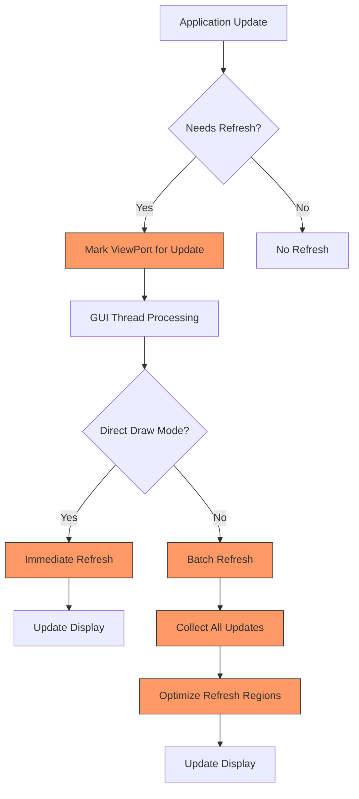

**Diagram sources**
- [gui.c](file://applications/services/gui/gui.c)
- [canvas.h](file://applications/services/gui/canvas.h)

The system uses several optimization techniques:
- **Batching**: Multiple updates are collected and processed together
- **Region optimization**: Only changed regions are refreshed
- **Direct draw mode**: For time-critical operations, immediate refresh is allowed
- **Tick-based updates**: Regular updates for animations and dynamic content

### Power-Saving Display Techniques

The display system implements several power-saving techniques to extend battery life:

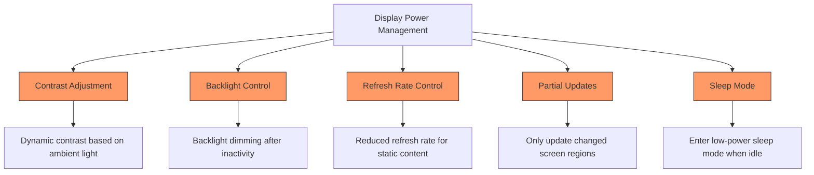

**Diagram sources**
- [power.c](file://applications/services/power/power_service/power.c)
- [gui.c](file://applications/services/gui/gui.c)

These techniques work together to minimize power consumption while maintaining a responsive user interface.

**Section sources**
- [canvas.h](file://applications/services/gui/canvas.h)
- [gui.c](file://applications/services/gui/gui.c)
- [power.c](file://applications/services/power/power_service/power.c)

## Common UI Patterns

The Flipper Zero UI framework supports several common UI patterns that are frequently used in applications. These patterns provide consistent user experiences and simplify development.

### Menu Navigation Pattern

The menu navigation pattern provides a hierarchical structure for organizing application functionality:

```mermaid
flowchart TD
A[Main Menu] --> B[Submenu 1]
A --> C[Submenu 2]
A --> D[Submenu 3]
B --> E[Item 1]
B --> F[Item 2]
C --> G[Item 3]
C --> H[Item 4]
D --> I[Item 5]
D --> J[Item 6]
style A fill:#bbf,stroke:#333
style B fill:#bbf,stroke:#333
style C fill:#bbf,stroke:#333
style D fill:#bbf,stroke:#333
note right of A
Root menu with main\napplication categories
end note
note right of B
Submenu with related\nfunctionality items
end note
```

**Diagram sources**
- [menu.c](file://applications/services/gui/modules/menu.c)

This pattern uses the Scene Manager to handle navigation between menu levels, with each menu level represented as a separate scene.

### Dialog Confirmation Pattern

The dialog confirmation pattern is used for critical operations that require user verification:

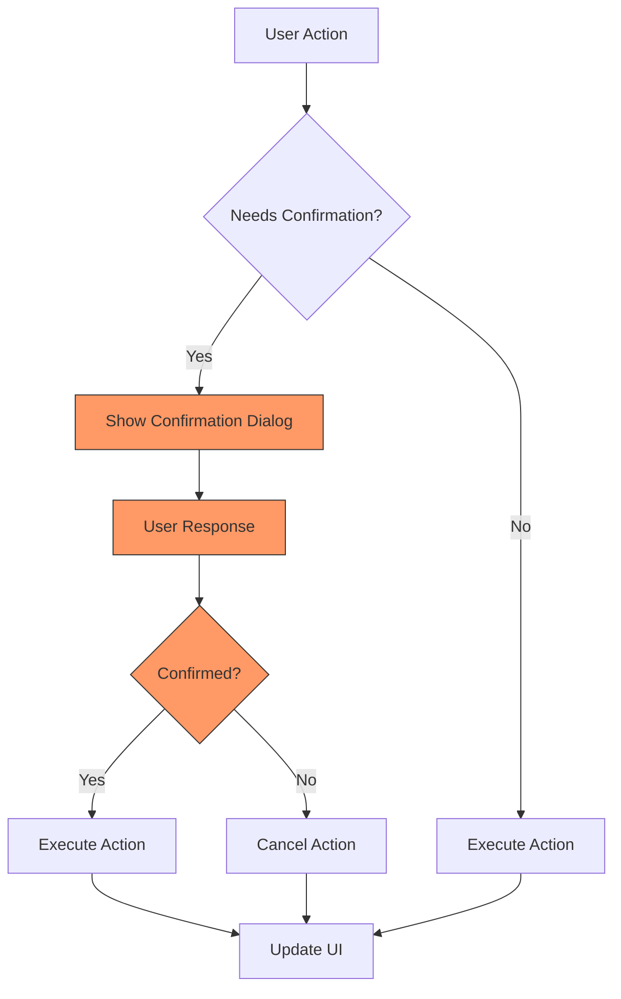

**Diagram sources**
- [dialog_ex.c](file://applications/services/gui/modules/dialog_ex.c)

This pattern uses the Dialog component to present a modal dialog with confirmation options, ensuring that users are aware of the consequences of their actions.

### Status Display Pattern

The status display pattern provides real-time information about system state and operation:

```mermaid
flowchart TD
A[Status Source] --> B[Status Data]
B --> C[Status ViewPort]
C --> D[Status Bar]
D --> E[Display]
A --> |Battery Level| B
A --> |Time| B
A --> |Signal Strength| B
A --> |System State| B
C --> |Battery Icon| D
C --> |Clock| D
C --> |WiFi Icon| D
C --> |Bluetooth Icon| D
style C fill:#f96,stroke:#333
style D fill:#f96,stroke:#333
```

**Diagram sources**
- [power.c](file://applications/services/power/power_service/power.c)
- [gui.c](file://applications/services/gui/gui.c)

This pattern uses dedicated ViewPorts in the status bar layers to display system information, with regular updates to reflect changing conditions.

**Section sources**
- [menu.c](file://applications/services/gui/modules/menu.c)
- [dialog_ex.c](file://applications/services/gui/modules/dialog_ex.c)
- [power.c](file://applications/services/power/power_service/power.c)

## Custom UI Element Creation

Creating custom UI elements in the Flipper Zero framework involves implementing the View interface and integrating with the existing UI system.

### Custom View Implementation

To create a custom UI element, developers implement a View with custom draw and input callbacks:

```mermaid
classDiagram
class CustomView {
-model
-draw_callback()
-input_callback()
-custom_callback()
-previous_callback()
}
class ViewModel {
-state_data
-configuration
-dynamic_content
}
CustomView --> ViewModel : "owns"
CustomView --> Canvas : "draws on"
CustomView --> InputEvent : "handles"
note right of CustomView
Implements View interface\nwith custom drawing and\ninput handling logic
end note
```

**Diagram sources**
- [view.h](file://applications/services/gui/view.h)

The implementation process involves:
1. Allocating a View instance
2. Setting up the model data
3. Implementing the draw callback for rendering
4. Implementing the input callback for user interaction
5. Registering the view with a View Dispatcher

### Model-View Pattern

The framework uses a model-view pattern to separate data from presentation:

```mermaid
flowchart TD
A[Model] --> B[View]
B --> C[Canvas]
C --> D[Display]
A --> |Data Changes| B
B --> |Request Update| C
C --> |Render| D
style A fill:#f96,stroke:#333
style B fill:#f96,stroke:#333
style C fill:#f96,stroke:#333
note right of A
Contains application data\nand state
end note
note right of B
Renders data from model\nand handles user input
end note
note right of C
Provides drawing surface\nand primitives
end note
```

**Diagram sources**
- [view.h](file://applications/services/gui/view.h)

This pattern ensures that the UI remains consistent with the underlying data and enables efficient updates when data changes.

### Integration with View Dispatcher

Custom views are integrated into the application through the View Dispatcher:

```mermaid
flowchart TD
A[Custom View] --> B[View Dispatcher]
B --> C[GUI System]
C --> D[Display]
A --> |add_view| B
B --> |switch_to_view| C
C --> |render| D
style A fill:#f96,stroke:#333
style B fill:#f96,stroke:#333
style C fill:#f96,stroke:#333
```

**Diagram sources**
- [view_dispatcher.h](file://applications/services/gui/view_dispatcher.h)

The integration process ensures that custom views participate in the normal view lifecycle and can be navigated to and from using the standard scene management system.

**Section sources**
- [view.h](file://applications/services/gui/view.h)
- [view_dispatcher.h](file://applications/services/gui/view_dispatcher.h)

## Performance Optimization

The Flipper Zero UI framework includes several performance optimization techniques to ensure responsive operation and efficient power usage.

### Efficient Screen Refreshes

The system optimizes screen refreshes to minimize power consumption and maximize battery life:

```mermaid
flowchart TD
A[Update Request] --> B{Update Type}
B --> C[Full Refresh]
B --> D[Partial Refresh]
B --> E[No Refresh]
C --> F[Refresh entire screen]
D --> G[Refresh only changed regions]
E --> H[Skip refresh]
F --> I[High power usage]
G --> J[Medium power usage]
H --> K[Low power usage]
style C fill:#f96,stroke:#333
style D fill:#f96,stroke:#333
style E fill:#f96,stroke:#333
```

**Diagram sources**
- [gui.c](file://applications/services/gui/gui.c)
- [canvas.h](file://applications/services/gui/canvas.h)

The optimization strategies include:
- Using partial updates when only small portions of the screen change
- Batching multiple updates to reduce display driver overhead
- Avoiding unnecessary refreshes for unchanged content

### Memory Management

The framework employs efficient memory management techniques to operate within the constraints of embedded hardware:

```mermaid
flowchart TD
A[Memory Allocation] --> B{Allocation Type}
B --> C[Static Allocation]
B --> D[Dynamic Allocation]
C --> E[Compile-time allocation]
D --> F[Runtime allocation]
E --> G[Low fragmentation]
F --> H[Flexible but requires management]
G --> I[Preferred for UI elements]
H --> J[Used for dynamic content]
style C fill:#f96,stroke:#333
style D fill:#f96,stroke:#333
```

**Diagram sources**
- [view.h](file://applications/services/gui/view.h)
- [scene_manager.h](file://applications/services/gui/scene_manager.h)

The memory management system prioritizes static allocation for UI elements to reduce fragmentation and improve performance, while using dynamic allocation only for content that cannot be determined at compile time.

### CPU Usage Optimization

The system minimizes CPU usage through efficient event processing and idle management:

```mermaid
flowchart TD
A[CPU Usage] --> B{System State}
B --> C[Active]
B --> D[Idle]
C --> E[Process events]
C --> F[Update display]
C --> G[Run application logic]
D --> H[Enter low-power mode]
D --> I[Wake on interrupt]
E --> J[High CPU usage]
F --> J
G --> J
H --> K[Low CPU usage]
I --> K
style C fill:#f96,stroke:#333
style D fill:#f96,stroke:#333
```

**Diagram sources**
- [gui.c](file://applications/services/gui/gui.c)
- [power.c](file://applications/services/power/power_service/power.c)

The optimization techniques include:
- Using interrupt-driven input processing
- Entering low-power modes during idle periods
- Minimizing background processing

**Section sources**
- [gui.c](file://applications/services/gui/gui.c)
- [power.c](file://applications/services/power/power_service/power.c)

## Troubleshooting Common Issues

This section addresses common issues encountered when developing UIs for the Flipper Zero and provides solutions for resolving them.

### Display Artifacts

Display artifacts can occur due to improper screen update management or timing issues:

```mermaid
flowchart TD
A[Display Artifacts] --> B{Possible Causes}
B --> C[Incomplete Screen Updates]
B --> D[Timing Issues]
B --> E[Memory Corruption]
C --> F[Ensure complete canvas commit]
D --> G[Check event timing and sequencing]
E --> H[Validate memory access patterns]
F --> I[Call canvas_commit() after drawing]
G --> J[Use proper synchronization]
H --> K[Check buffer boundaries]
style C fill:#f96,stroke:#333
style D fill:#f96,stroke:#333
style E fill:#f96,stroke:#333
```

**Diagram sources**
- [canvas.h](file://applications/services/gui/canvas.h)
- [gui.c](file://applications/services/gui/gui.c)

Solutions for display artifacts include:
- Always calling `canvas_commit()` after completing drawing operations
- Ensuring proper synchronization between drawing and display update operations
- Validating that all memory accesses are within bounds

### Input Lag

Input lag can occur due to event processing bottlenecks or high CPU usage:

```mermaid
flowchart TD
A[Input Lag] --> B{Possible Causes}
B --> C[Event Queue Backlog]
B --> D[High CPU Usage]
B --> E[Long-Running Operations]
C --> F[Process events promptly]
D --> G[Optimize CPU usage]
E --> H[Break long operations into chunks]
F --> I[Ensure GUI thread priority]
G --> J[Reduce background processing]
H --> K[Use incremental processing]
style C fill:#f96,stroke:#333
style D fill:#f96,stroke:#333
style E fill:#f96,stroke:#333
```

**Diagram sources**
- [view_dispatcher.c](file://applications/services/gui/view_dispatcher.c)
- [input.h](file://applications/services/input/input.h)

Solutions for input lag include:
- Ensuring the GUI thread has appropriate priority
- Breaking long-running operations into smaller chunks
- Minimizing background processing during user interaction

### Memory Leaks

Memory leaks can occur due to improper resource management:

```mermaid
flowchart TD
A[Memory Leaks] --> B{Common Causes}
B --> C[Unfreed Views]
B --> D[Unfreed Models]
B --> E[Unfreed ViewPorts]
C --> F[Free views in on_exit]
D --> G[Free models in on_exit]
E --> H[Free ViewPorts when done]
F --> I[Call view_free()]
G --> J[Call view_free_model()]
H --> K[Call view_port_free()]
style C fill:#f96,stroke:#333
style D fill:#f96,stroke:#333
style E fill:#f96,stroke:#333
```

**Diagram sources**
- [view.h](file://applications/services/gui/view.h)
- [view_port.h](file://applications/services/gui/view_port.h)

Solutions for memory leaks include:
- Always freeing views, models, and ViewPorts in the appropriate cleanup functions
- Using the `on_exit` callback to release allocated resources
- Checking for proper deallocation in scene transitions

**Section sources**
- [canvas.h](file://applications/services/gui/canvas.h)
- [view_dispatcher.c](file://applications/services/gui/view_dispatcher.c)
- [view.h](file://applications/services/gui/view.h)