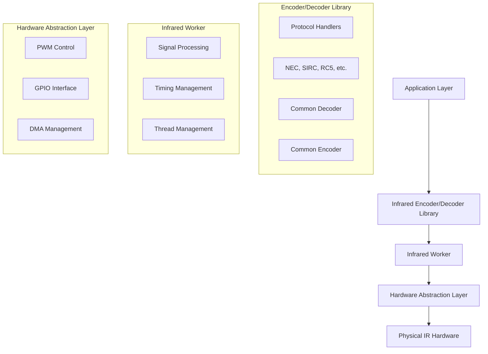
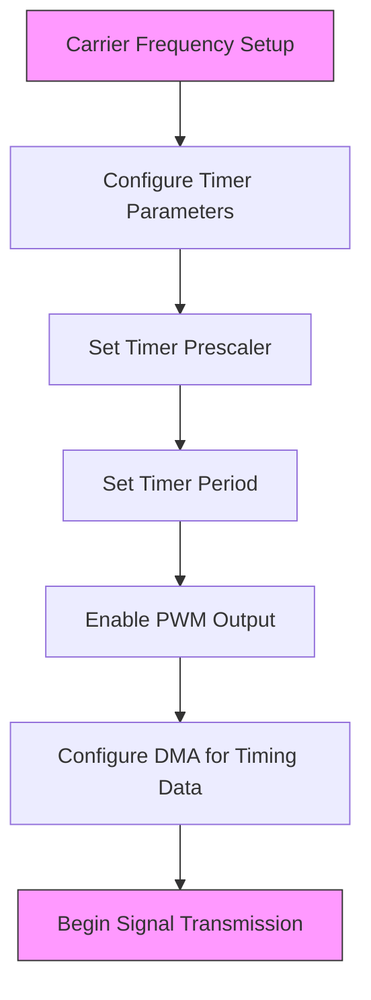
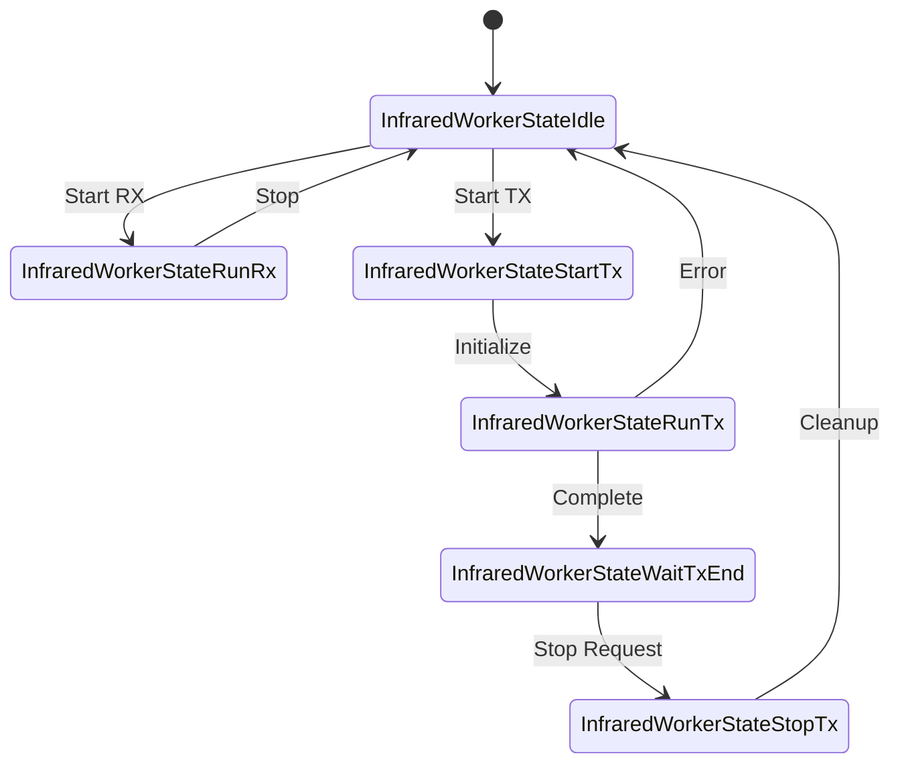

# Infrared Technology

<cite>
**Referenced Files in This Document**   
- [infrared.c](file://lib/infrared/encoder_decoder/infrared.c#L0-L356)
- [infrared.h](file://lib/infrared/encoder_decoder/infrared.h#L0-L220)
- [infrared_worker.c](file://lib/infrared/worker/infrared_worker.c#L0-L648)
- [furi_hal_infrared.c](file://targets/f7/furi_hal/furi_hal_infrared.c#L0-L729)
- [infrared_decoder_nec.c](file://lib/infrared/encoder_decoder/nec/infrared_decoder_nec.c#L0-L98)
- [infrared_encoder_nec.c](file://lib/infrared/encoder_decoder/nec/infrared_encoder_nec.c#L0-L91)
- [infrared_protocol_sirc.c](file://lib/infrared/encoder_decoder/sirc/infrared_protocol_sirc.c#L0-L64)
- [infrared_protocol_rc5.c](file://lib/infrared/encoder_decoder/rc5/infrared_protocol_rc5.c#L0-L50)
- [infrared_protocol_kaseikyo.c](file://lib/infrared/encoder_decoder/kaseikyo/infrared_protocol_kaseikyo.c#L0-L40)
</cite>

## Table of Contents
1. [Infrared Signal Processing Overview](#infrared-signal-processing-overview)
2. [Carrier Frequency Generation and Modulation](#carrier-frequency-generation-and-modulation)
3. [Signal Encoding and Decoding Protocols](#signal-encoding-and-decoding-protocols)
4. [Infrared Worker Implementation](#infrared-worker-implementation)
5. [Hardware Interface and Signal Capture](#hardware-interface-and-signal-capture)
6. [Signal Analysis Features](#signal-analysis-features)
7. [Troubleshooting and Optimization](#troubleshooting-and-optimization)

## Infrared Signal Processing Overview

The infrared technology implementation in the Flipper Zero firmware provides a comprehensive system for capturing, analyzing, and transmitting infrared signals. The architecture is divided into multiple layers, including protocol-specific encoders/decoders, a worker thread for signal processing, and hardware abstraction layer (HAL) components for direct hardware control. The system supports multiple infrared protocols and provides both high-level API access and low-level signal manipulation capabilities.

The core infrared functionality is organized into three main components: the encoder/decoder library, the infrared worker, and the hardware abstraction layer. These components work together to provide a complete infrared communication system that can handle both standard protocol messages and raw signal data.



**Diagram sources**
- [infrared.c](file://lib/infrared/encoder_decoder/infrared.c#L0-L356)
- [infrared_worker.c](file://lib/infrared/worker/infrared_worker.c#L0-L648)
- [furi_hal_infrared.c](file://targets/f7/furi_hal/furi_hal_infrared.c#L0-L729)

**Section sources**
- [infrared.c](file://lib/infrared/encoder_decoder/infrared.c#L0-L356)
- [infrared_worker.c](file://lib/infrared/worker/infrared_worker.c#L0-L648)

## Carrier Frequency Generation and Modulation

The infrared system generates carrier frequencies typically in the range of 30-56kHz, with a default common frequency of 38kHz defined in the codebase. The carrier frequency and duty cycle are protocol-specific parameters that are configured during transmission setup.

The hardware abstraction layer implements carrier frequency generation using PWM (Pulse Width Modulation) through the STM32WB's timer peripherals. The furi_hal_infrared.c file contains the implementation details for configuring the timer and DMA (Direct Memory Access) channels to generate the precise timing required for infrared communication.



The default carrier frequency is defined as 38kHz in the infrared.h header file:

```c
#define INFRARED_COMMON_CARRIER_FREQUENCY ((uint32_t)38000)
#define INFRARED_COMMON_DUTY_CYCLE        ((float)0.33)
```

Different protocols may use different carrier frequencies. For example:
- NEC protocol uses 38kHz
- Sony SIRC uses 40kHz
- RC5 uses 36kHz

The duty cycle is typically set to 33%, which represents the ratio of the mark (high) time to the total period of the carrier signal. This configuration ensures compatibility with most infrared receivers while minimizing power consumption.

**Section sources**
- [infrared.h](file://lib/infrared/encoder_decoder/infrared.h#L0-L220)
- [furi_hal_infrared.c](file://targets/f7/furi_hal/furi_hal_infrared.c#L0-L729)

## Signal Encoding and Decoding Protocols

The infrared system supports multiple common protocols including NEC, Sony SIRC, RC5, and Kaseikyo. Each protocol has its own specific encoding and decoding implementation, but they share common infrastructure through the infrared_common_decoder and infrared_common_encoder base classes.

### NEC Protocol Implementation

The NEC protocol is one of the most widely used infrared protocols. The implementation handles both standard NEC and extended variants (NECext, NEC42, NEC42ext). The decoder analyzes the timing of pulses to extract the address and command data, while also verifying the integrity of the transmission through inverse bit checking.

```c
bool infrared_decoder_nec_interpret(InfraredCommonDecoder* decoder) {
    furi_assert(decoder);

    bool result = false;

    if(decoder->databit_cnt == 32) {
        uint8_t address = decoder->data[0];
        uint8_t address_inverse = decoder->data[1];
        uint8_t command = decoder->data[2];
        uint8_t command_inverse = decoder->data[3];
        uint8_t inverse_command_inverse = (uint8_t)~command_inverse;
        uint8_t inverse_address_inverse = (uint8_t)~address_inverse;
        if((command == inverse_command_inverse) && (address == inverse_address_inverse)) {
            decoder->message.protocol = InfraredProtocolNEC;
            decoder->message.address = address;
            decoder->message.command = command;
            decoder->message.repeat = false;
            result = true;
        } else {
            decoder->message.protocol = InfraredProtocolNECext;
            decoder->message.address = decoder->data[0] | (decoder->data[1] << 8);
            decoder->message.command = decoder->data[2] | (decoder->data[3] << 8);
            decoder->message.repeat = false;
            result = true;
        }
    }
    // ... additional protocol variants
    return result;
}
```

The NEC protocol uses pulse-distance modulation with the following timing characteristics:
- Preamble: 9ms mark + 4.5ms space
- Bit 1: 0.56ms mark + 1.69ms space
- Bit 0: 0.56ms mark + 0.56ms space
- Repeat code: 9ms mark + 2.25ms space + 0.56ms mark

### Sony SIRC Protocol

The Sony SIRC (Sony Infrared Remote Control) protocol uses pulse-width modulation and supports 12-bit, 15-bit, and 20-bit formats. The implementation is defined in the infrared_protocol_sirc.c file:

```c
const InfraredCommonProtocolSpec infrared_protocol_sirc = {
    .timings =
        {
            .preamble_mark = INFRARED_SIRC_PREAMBLE_MARK,
            .preamble_space = INFRARED_SIRC_PREAMBLE_SPACE,
            .bit1_mark = INFRARED_SIRC_BIT1_MARK,
            .bit1_space = INFRARED_SIRC_BIT1_SPACE,
            .bit0_mark = INFRARED_SIRC_BIT0_MARK,
            .bit0_space = INFRARED_SIRC_BIT0_SPACE,
            .preamble_tolerance = INFRARED_SIRC_PREAMBLE_TOLERANCE,
            .bit_tolerance = INFRARED_SIRC_BIT_TOLERANCE,
            .silence_time = INFRARED_SIRC_SILENCE,
            .min_split_time = INFRARED_SIRC_MIN_SPLIT_TIME,
        },
    .databit_len[0] = 20,
    .databit_len[1] = 15,
    .databit_len[2] = 12,
    .decode = infrared_common_decode_pdwm,
    .encode = infrared_common_encode_pdwm,
    .interpret = infrared_decoder_sirc_interpret,
    .decode_repeat = NULL,
    .encode_repeat = infrared_encoder_sirc_encode_repeat,
};
```

### RC5 Protocol

The RC5 protocol uses Manchester encoding, which provides self-clocking and error detection capabilities. The implementation handles the unique characteristics of RC5, including the two start bits and toggle bit:

```c
const InfraredCommonProtocolSpec infrared_protocol_rc5 = {
    .timings =
        {
            .preamble_mark = 0,
            .preamble_space = 0,
            .bit1_mark = INFRARED_RC5_BIT,
            .preamble_tolerance = 0,
            .bit_tolerance = INFRARED_RC5_BIT_TOLERANCE,
            .silence_time = INFRARED_RC5_SILENCE,
            .min_split_time = INFRARED_RC5_MIN_SPLIT_TIME,
        },
    .databit_len[0] = 1 + 1 + 1 + 5 + 6, // start_bit + start_bit/command_bit + toggle_bit + 5 address + 6 command
    .manchester_start_from_space = true,
    .decode = infrared_common_decode_manchester,
    .encode = infrared_common_encode_manchester,
    .interpret = infrared_decoder_rc5_interpret,
    .decode_repeat = NULL,
    .encode_repeat = NULL,
};
```

### Kaseikyo Protocol

The Kaseikyo protocol is used by various Japanese manufacturers and features a 48-bit data frame:

```c
const InfraredCommonProtocolSpec infrared_protocol_kaseikyo = {
    .timings =
        {
            .preamble_mark = INFRARED_KASEIKYO_PREAMBLE_MARK,
            .preamble_space = INFRARED_KASEIKYO_PREAMBLE_SPACE,
            .bit1_mark = INFRARED_KASEIKYO_BIT1_MARK,
            .bit1_space = INFRARED_KASEIKYO_BIT1_SPACE,
            .bit0_mark = INFRARED_KASEIKYO_BIT0_MARK,
            .bit0_space = INFRARED_KASEIKYO_BIT0_SPACE,
            .preamble_tolerance = INFRARED_KASEIKYO_PREAMBLE_TOLERANCE,
            .bit_tolerance = INFRARED_KASEIKYO_BIT_TOLERANCE,
            .silence_time = INFRARED_KASEIKYO_SILENCE,
            .min_split_time = INFRARED_KASEIKYO_MIN_SPLIT_TIME,
        },
    .databit_len[0] = 48,
    .decode = infrared_common_decode_pdwm,
    .encode = infrared_common_encode_pdwm,
    .interpret = infrared_decoder_kaseikyo_interpret,
    .decode_repeat = NULL,
    .encode_repeat = NULL,
};
```

**Section sources**
- [infrared_decoder_nec.c](file://lib/infrared/encoder_decoder/nec/infrared_decoder_nec.c#L0-L98)
- [infrared_encoder_nec.c](file://lib/infrared/encoder_decoder/nec/infrared_encoder_nec.c#L0-L91)
- [infrared_protocol_sirc.c](file://lib/infrared/encoder_decoder/sirc/infrared_protocol_sirc.c#L0-L64)
- [infrared_protocol_rc5.c](file://lib/infrared/encoder_decoder/rc5/infrared_protocol_rc5.c#L0-L50)
- [infrared_protocol_kaseikyo.c](file://lib/infrared/encoder_decoder/kaseikyo/infrared_protocol_kaseikyo.c#L0-L40)

## Infrared Worker Implementation

The infrared_worker.c file implements the core signal processing logic for both receiving and transmitting infrared signals. The worker runs in a separate thread and manages the state machine for infrared operations.

### Worker State Machine

The infrared worker implements a state machine with the following states:
- InfraredWorkerStateIdle: Initial state, ready to start RX or TX
- InfraredWorkerStateRunRx: Receiving infrared signals
- InfraredWorkerStateRunTx: Transmitting infrared signals
- InfraredWorkerStateWaitTxEnd: Waiting for transmission to complete
- InfraredWorkerStateStopTx: Stopping transmission
- InfraredWorkerStateStartTx: Starting transmission



### Signal Processing Logic

The worker implements two main processing functions: infrared_worker_process_timings for receiving signals and infrared_worker_furi_hal_data_isr_callback for transmitting signals.

When receiving signals, the worker processes timing data from the hardware layer:

```c
static void infrared_worker_process_timings(InfraredWorker* instance, uint32_t duration, bool level) {
    const InfraredMessage* message_decoded =
        instance->decode_enable ? infrared_decode(instance->infrared_decoder, level, duration) :
                                  NULL;
    if(message_decoded) {
        instance->signal.message = *message_decoded;
        instance->signal.timings_cnt = 0;
        instance->signal.decoded = true;
        if(instance->rx.received_signal_callback)
            instance->rx.received_signal_callback(
                instance->rx.received_signal_context, &instance->signal);
    } else if(!instance->decode_force) {
        /* Skip first timing if it starts from Space */
        if((instance->signal.timings_cnt == 0) && !level) {
            return;
        }

        if(instance->signal.timings_cnt < MAX_TIMINGS_AMOUNT) {
            instance->signal.raw.timings[instance->signal.timings_cnt] = duration;
            ++instance->signal.timings_cnt;
        } else {
            // Handle buffer overrun
            instance->rx.overrun = true;
        }
    }
}
```

The transmission process uses callbacks to provide timing data to the hardware layer:

```c
static FuriHalInfraredTxGetDataState
    infrared_worker_furi_hal_data_isr_callback(void* context, uint32_t* duration, bool* level) {
    InfraredWorker* instance = context;
    InfraredStatus status = infrared_encode(
        instance->infrared_encoder, duration, level);
    if(status == InfraredStatusDone) {
        return FuriHalInfraredTxGetDataStateDone;
    } else {
        return FuriHalInfraredTxGetDataStateOk;
    }
}
```

**Diagram sources**
- [infrared_worker.c](file://lib/infrared/worker/infrared_worker.c#L0-L648)

**Section sources**
- [infrared_worker.c](file://lib/infrared/worker/infrared_worker.c#L0-L648)

## Hardware Interface and Signal Capture

The hardware interface is implemented in furi_hal_infrared.c, which provides low-level control of the infrared LED and receiver diode through PWM and GPIO interfaces.

### Receiver Implementation

The infrared receiver uses Timer 2 (TIM2) configured as an input capture timer to measure the duration of incoming infrared signals. The implementation configures the timer to capture both rising and falling edges on the IR receiver pin:

```c
void furi_hal_infrared_async_rx_start(void) {
    furi_check(furi_hal_infrared_state == InfraredStateIdle);

    furi_hal_gpio_init_ex(
        &gpio_infrared_rx,
        GpioModeAltFunctionPushPull,
        GpioPullNo,
        GpioSpeedLow,
        INFRARED_RX_GPIO_ALT);

    furi_hal_bus_enable(INFRARED_RX_TIMER_BUS);

    LL_TIM_InitTypeDef TIM_InitStruct = {0};
    TIM_InitStruct.Prescaler = 64 - 1;
    TIM_InitStruct.CounterMode = LL_TIM_COUNTERMODE_UP;
    TIM_InitStruct.Autoreload = 0x7FFFFFFE;
    TIM_InitStruct.ClockDivision = LL_TIM_CLOCKDIVISION_DIV1;
    LL_TIM_Init(INFRARED_RX_TIMER, &TIM_InitStruct);
    // ... additional configuration
}
```

The timer prescaler is set to 64, which with the system clock frequency provides a timer resolution suitable for measuring infrared signal timings. The capture interrupt service routine (ISR) processes both rising and falling edges to determine the duration of mark and space periods.

### Transmitter Implementation

The infrared transmitter uses Timer 1 (TIM1) with DMA to generate the precise carrier frequency and modulation pattern. The implementation uses double-buffering with DMA to ensure continuous signal transmission without gaps:

```c
static void furi_hal_infrared_tx_fill_buffer(uint8_t buf_num, uint8_t polarity_shift) {
    // Fill DMA buffer with timing data
    // Buffer alternates between mark and space periods
    // Polarity shift handles the carrier frequency modulation
}
```

The DMA configuration allows for efficient transmission of long infrared signals without CPU intervention. The system uses two DMA buffers that are swapped when one is exhausted, ensuring continuous signal output.

### Ambient Light Interference Filtering

The signal capture process includes filtering for ambient light interference through several mechanisms:

1. **Hardware filtering**: The IR receiver module typically includes built-in filtering for ambient light
2. **Timing validation**: The decoder validates timing against protocol specifications, rejecting signals with invalid durations
3. **Signal thresholding**: The system uses minimum timing thresholds to filter out noise

The timeout mechanism also helps with ambient light filtering. If no valid signal is detected within a specified timeout period, the system resets and waits for a new signal:

```c
static void infrared_worker_rx_timeout_callback(void* context) {
    InfraredWorker* instance = context;
    uint32_t flags_set = furi_thread_flags_set(
        furi_thread_get_id(instance->thread), INFRARED_WORKER_RX_TIMEOUT_RECEIVED);
    furi_check(flags_set & INFRARED_WORKER_RX_TIMEOUT_RECEIVED);
}
```

**Section sources**
- [furi_hal_infrared.c](file://targets/f7/furi_hal/furi_hal_infrared.c#L0-L729)

## Signal Analysis Features

The infrared system provides comprehensive signal analysis capabilities, including timing measurement, protocol detection, and raw signal viewing.

### Timing Measurement

The system captures precise timing measurements of infrared signals using the input capture functionality of the microcontroller's timer peripheral. Each transition (rising or falling edge) is recorded with its duration, allowing for detailed analysis of the signal characteristics.

The timing data is stored in a stream buffer and processed by the worker thread:

```c
static void infrared_worker_rx_callback(void* context, bool level, uint32_t duration) {
    InfraredWorker* instance = context;

    furi_assert(duration != 0);
    LevelDuration level_duration = level_duration_make(level, duration);

    size_t ret =
        furi_stream_buffer_send(instance->stream, &level_duration, sizeof(LevelDuration), 0);
    uint32_t events = (ret == sizeof(LevelDuration)) ? INFRARED_WORKER_RX_RECEIVED :
                                                       INFRARED_WORKER_OVERRUN;

    uint32_t flags_set = furi_thread_flags_set(furi_thread_get_id(instance->thread), events);
    furi_check(flags_set & events);
}
```

### Protocol Detection

The system implements automatic protocol detection by simultaneously attempting to decode the signal with multiple protocol decoders:

```c
const InfraredMessage* infrared_decode(InfraredDecoderHandler* handler, bool level, uint32_t duration) {
    furi_check(handler);

    InfraredMessage* message = NULL;
    InfraredMessage* result = NULL;

    for(size_t i = 0; i < COUNT_OF(infrared_encoder_decoder); ++i) {
        if(infrared_encoder_decoder[i].decoder.decode) {
            message = infrared_encoder_decoder[i].decoder.decode(handler->ctx[i], level, duration);
            if(!result && message) {
                result = message;
            }
        }
    }

    return result;
}
```

This parallel decoding approach allows the system to identify which protocol is being used by the remote control, even if the user doesn't know the specific protocol type.

### Raw Signal Viewing

The system can capture and display raw infrared signals, showing the exact timing of each mark and space period. This is useful for analyzing unknown protocols or debugging transmission issues.

The raw signal data is stored in the InfraredWorkerSignal structure:

```c
struct InfraredWorkerSignal {
    bool decoded;
    size_t timings_cnt;
    union {
        InfraredMessage message;
        struct {
            /* +1 is for pause we add at the beginning */
            uint32_t timings[MAX_TIMINGS_AMOUNT + 1];
            uint32_t frequency;
            float duty_cycle;
        } raw;
    };
};
```

Users can view the raw timing data to understand the exact structure of the infrared signal, which is particularly useful for reverse engineering proprietary protocols.

**Section sources**
- [infrared.c](file://lib/infrared/encoder_decoder/infrared.c#L0-L356)
- [infrared_worker.c](file://lib/infrared/worker/infrared_worker.c#L0-L648)

## Troubleshooting and Optimization

### Common IR Communication Issues

1. **Weak signal strength**: Caused by low battery in the remote or insufficient LED drive current
2. **Interference from ambient light**: Sunlight or fluorescent lights can interfere with IR reception
3. **Incorrect alignment**: The IR LED and receiver must be properly aligned
4. **Protocol mismatch**: The system may not support the specific protocol used by the device
5. **Timing errors**: Crystal oscillator inaccuracies can cause timing issues

### Signal Transmission Optimization

To optimize signal transmission range and reliability:

1. **Adjust carrier frequency**: Ensure the frequency matches the receiver's expected frequency
2. **Optimize duty cycle**: A 33% duty cycle is typically optimal for power efficiency and signal strength
3. **Increase LED current**: Higher current through the IR LED increases signal strength
4. **Use appropriate modulation**: Ensure the modulation scheme matches the target device
5. **Implement error correction**: Use protocol features like inverse bits for error detection

### Debugging Tips

1. **Use raw signal capture**: Capture the raw timing data to verify signal characteristics
2. **Check protocol detection**: Verify that the system correctly identifies the protocol
3. **Measure timing accuracy**: Use an oscilloscope to verify the actual signal timing
4. **Test with multiple devices**: Verify compatibility with different IR receivers
5. **Monitor power consumption**: Ensure the IR transmission doesn't drain the battery excessively

The system provides debugging feedback through the notification system, including visual indicators when signals are received:

```c
if(!instance->rx.overrun && instance->blink_enable &&
   ((furi_get_tick() - last_blink_time) > 80)) {
    last_blink_time = furi_get_tick();
    notification_message(instance->notification, &sequence_blink_blue_10);
}
```

**Section sources**
- [infrared_worker.c](file://lib/infrared/worker/infrared_worker.c#L0-L648)
- [furi_hal_infrared.c](file://targets/f7/furi_hal/furi_hal_infrared.c#L0-L729)