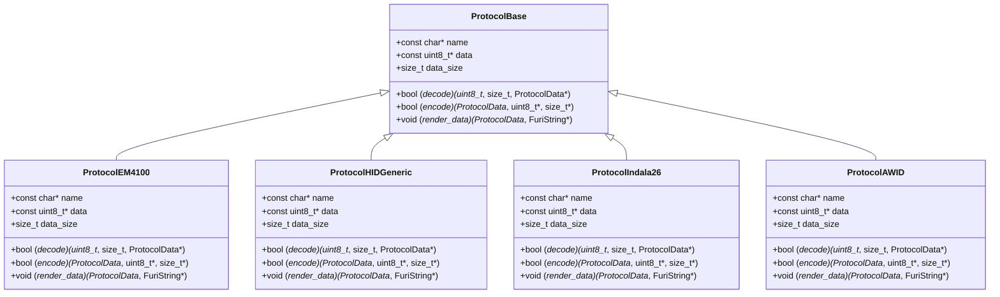
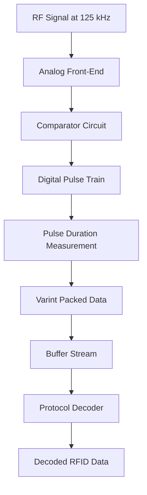
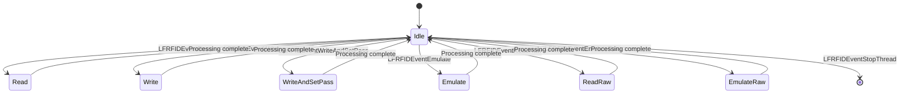

# LF RFID Technology

<cite>
**Referenced Files in This Document**   
- [lfrfid.c](file://applications/main/lfrfid/lfrfid.c)
- [lfrfid_worker.c](file://lib/lfrfid/lfrfid_worker.c)
- [lfrfid_worker_modes.c](file://lib/lfrfid/lfrfid_worker_modes.c)
- [t5577.c](file://lib/lfrfid/tools/t5577.c)
- [furi_hal_rfid.c](file://targets/f7/furi_hal/furi_hal_rfid.c)
- [lfrfid_protocols.c](file://lib/lfrfid/protocols/lfrfid_protocols.c)
- [protocol_em4100.h](file://lib/lfrfid/protocols/protocol_em4100.h)
- [protocol_hid_generic.h](file://lib/lfrfid/protocols/protocol_hid_generic.h)
- [protocol_indala26.h](file://lib/lfrfid/protocols/protocol_indala26.h)
- [protocol_awid.h](file://lib/lfrfid/protocols/protocol_awid.h)
</cite>

## Table of Contents
1. [Introduction](#introduction)
2. [LF RFID Protocol Implementation](#lf-rfid-protocol-implementation)
3. [Signal Demodulation and Decoding](#signal-demodulation-and-decoding)
4. [Worker Architecture and Processing Modes](#worker-architecture-and-processing-modes)
5. [T5577 Chip Programming](#t5577-chip-programming)
6. [Hardware Interface and Analog Front-End](#hardware-interface-and-analog-front-end)
7. [Antenna Tuning and Signal Optimization](#antenna-tuning-and-signal-optimization)
8. [Troubleshooting Common Issues](#troubleshooting-common-issues)

## Introduction
Low-Frequency (LF) RFID technology operates at 125 kHz and is widely used in access control systems, animal identification, and industrial applications. This document provides a comprehensive analysis of the LF RFID implementation in the Flipper Zero firmware, covering protocol support, signal processing, hardware interface, and practical usage considerations. The system supports multiple LF RFID protocols including EM4100, HID Prox, Indala, and AWID, with capabilities for reading, writing, cloning, and emulating RFID tags.

## LF RFID Protocol Implementation

The LF RFID system implements support for multiple protocols through a modular architecture that allows for easy extension and maintenance. The protocol dictionary serves as the central registry for all supported protocols, enabling dynamic selection and processing based on detected tag types.

### Protocol Registration and Management
The protocol system is organized around a protocol dictionary that maps protocol identifiers to their respective implementation structures. This design pattern enables efficient protocol lookup and processing during tag detection and decoding.



**Diagram sources**
- [lfrfid_protocols.c](file://lib/lfrfid/protocols/lfrfid_protocols.c#L1-L55)
- [protocol_em4100.h](file://lib/lfrfid/protocols/protocol_em4100.h)
- [protocol_hid_generic.h](file://lib/lfrfid/protocols/protocol_hid_generic.h)
- [protocol_indala26.h](file://lib/lfrfid/protocols/protocol_indala26.h)
- [protocol_awid.h](file://lib/lfrfid/protocols/protocol_awid.h)

**Section sources**
- [lfrfid_protocols.c](file://lib/lfrfid/protocols/lfrfid_protocols.c#L1-L55)

### EM4100 Protocol
The EM4100 protocol is one of the most common LF RFID formats, featuring a 64-bit structure with 10 rows of 6 bits each. The implementation includes support for various EM4100 variants with different data lengths.

**Key characteristics:**
- **Modulation:** ASK/OOK at 125 kHz
- **Encoding:** Manchester encoding
- **Data structure:** 64-bit frame with header, data, and parity bits
- **Bit pattern:** Alternating 1s and 0s for synchronization

### HID Prox Protocol
HID Prox (HID Proximity) is widely used in access control systems. The implementation supports both standard and extended HID formats with configurable bit lengths.

**Key characteristics:**
- **Modulation:** ASK/OOK at 125 kHz
- **Encoding:** Manchester encoding
- **Facility code:** 8-16 bits
- **Card number:** 16-37 bits
- **Wiegand format:** 26-37 bits

### Indala Protocol
Indala uses a proprietary encoding scheme with strong error detection capabilities. The implementation supports both 26-bit and 224-bit Indala formats.

**Key characteristics:**
- **Modulation:** ASK/OOK at 125 kHz
- **Encoding:** Biphase (Differential Manchester)
- **Data integrity:** Strong parity checking
- **Security:** Proprietary bit patterns

### AWID Protocol
AWID (Applied Wireless Identification Data) is commonly used in North American access control systems. The implementation supports various AWID formats with different bit lengths.

**Key characteristics:**
- **Modulation:** ASK/OOK at 125 kHz
- **Encoding:** Manchester encoding
- **Bit lengths:** 26, 34, or 40 bits
- **Error detection:** Checksum verification

## Signal Demodulation and Decoding

The signal demodulation process converts the analog signal from the RFID reader into a digital representation that can be decoded according to the specific protocol. This section details the ASK/OOK demodulation techniques and Manchester/Biphase decoding algorithms.

### ASK/OOK Demodulation at 125 kHz
The demodulation process begins with capturing the raw signal from the analog front-end and converting it into a series of pulse durations that represent the encoded data.



**Diagram sources**
- [furi_hal_rfid.c](file://targets/f7/furi_hal/furi_hal_rfid.c#L0-L199)
- [lfrfid_worker_modes.c](file://lib/lfrfid/lfrfid_worker_modes.c#L0-L199)

**Section sources**
- [lfrfid_worker_modes.c](file://lib/lfrfid/lfrfid_worker_modes.c#L0-L199)
- [furi_hal_rfid.c](file://targets/f7/furi_hal/furi_hal_rfid.c#L0-L199)

### Manchester Decoding Algorithm
Manchester encoding represents data bits by transitions in the middle of each bit period. The implementation uses a robust algorithm to detect these transitions and decode the original data.

```c
static LFRFIDWorkerReadState lfrfid_worker_read_ttf(
    LFRFIDWorker* worker,
    LFRFIDFeature feature,
    uint32_t timeout,
    ProtocolId* result_protocol) {
    
    if(feature & LFRFIDFeatureASK) {
        furi_hal_rfid_tim_read_start(125000, 0.5);
        FURI_LOG_D(TAG, "Start ASK");
        if(worker->read_cb) {
            worker->read_cb(LFRFIDWorkerReadStartASK, PROTOCOL_NO, worker->cb_ctx);
        }
    } else {
        furi_hal_rfid_tim_read_start(62500, 0.25);
        FURI_LOG_D(TAG, "Start PSK");
        if(worker->read_cb) {
            worker->read_cb(LFRFIDWorkerReadStartPSK, PROTOCOL_NO, worker->cb_ctx);
        }
    }
    
    // Stabilize detector
    lfrfid_worker_delay(worker, LFRFID_WORKER_READ_STABILIZE_TIME_MS);
    
    protocol_dict_decoders_start(worker->protocols);
    
    LFRFIDWorkerReadContext ctx;
    ctx.pair = varint_pair_alloc();
    ctx.stream = buffer_stream_alloc(LFRFID_WORKER_READ_BUFFER_SIZE, LFRFID_WORKER_READ_BUFFER_COUNT);
    
    furi_hal_rfid_tim_read_capture_start(lfrfid_worker_read_capture, &ctx);
    
    // Main decoding loop
    while(true) {
        Buffer* buffer = buffer_stream_receive(ctx.stream, 100);
        
        if(buffer_stream_get_overrun_count(ctx.stream) > 0) {
            FURI_LOG_E(TAG, "Read overrun, recovering");
            buffer_stream_reset(ctx.stream);
            continue;
        }
        
        if(buffer == NULL) continue;
        
        size_t size = buffer_get_size(buffer);
        uint8_t* data = buffer_get_data(buffer);
        size_t index = 0;
        
        while(index < size) {
            uint32_t duration;
            uint32_t pulse;
            size_t tmp_size;
            
            if(!varint_pair_unpack(&data[index], size - index, &pulse, &duration, &tmp_size)) {
                index++;
                continue;
            }
            
            index += tmp_size;
            
            // Process pulse and duration for Manchester decoding
            protocol_dict_decoders_process(worker->protocols, pulse, duration);
        }
        
        buffer_stream_free_buffer(ctx.stream, buffer);
        
        if(protocol_dict_decoders_is_processed(worker->protocols)) break;
    }
}
```

**Section sources**
- [lfrfid_worker_modes.c](file://lib/lfrfid/lfrfid_worker_modes.c#L0-L199)

### Biphase Decoding Algorithm
Biphase encoding (also known as Differential Manchester) uses transitions at the beginning of each bit period to represent data, with an additional transition in the middle for clock synchronization.

The implementation handles Biphase decoding by:
1. Detecting the initial transition that marks the start of a bit period
2. Analyzing the presence or absence of a transition in the middle of the bit period
3. Determining the data value based on the transition pattern
4. Maintaining synchronization through the continuous clock transitions

## Worker Architecture and Processing Modes

The LF RFID worker architecture is designed as a multi-threaded system that handles different operations through distinct processing modes. This section details the worker implementation and its various operational modes.

### Worker Thread Architecture
The worker system uses a flag-based event model to manage different operational modes, allowing for efficient switching between reading, writing, and emulation tasks.



**Diagram sources**
- [lfrfid_worker.c](file://lib/lfrfid/lfrfid_worker.c#L0-L196)

**Section sources**
- [lfrfid_worker.c](file://lib/lfrfid/lfrfid_worker.c#L0-L196)

### Read Function Implementation
The read function captures the raw signal from the RFID tag and processes it through the protocol decoders to identify the tag type and extract its data.

```c
void lfrfid_worker_read_start(
    LFRFIDWorker* worker,
    LFRFIDWorkerReadType type,
    LFRFIDWorkerReadCallback callback,
    void* context) {
    
    furi_check(worker);
    furi_check(worker->mode_index == LFRFIDWorkerIdle);
    
    worker->read_type = type;
    worker->read_cb = callback;
    worker->cb_ctx = context;
    furi_thread_flags_set(furi_thread_get_id(worker->thread), LFRFIDEventRead);
}
```

The read process involves:
1. Initializing the timer for 125 kHz carrier frequency
2. Starting the pulse capture mechanism
3. Processing the captured pulses through the protocol decoders
4. Identifying the protocol and extracting the data
5. Notifying the callback function with the results

### Write Function Implementation
The write function programs data to a writable RFID tag, such as the T5577 chip, by generating the appropriate signal pattern.

```c
void lfrfid_worker_write_start(
    LFRFIDWorker* worker,
    LFRFIDProtocol protocol,
    LFRFIDWorkerWriteCallback callback,
    void* context) {
    
    furi_check(worker->mode_index == LFRFIDWorkerIdle);
    worker->protocol = protocol;
    worker->write_cb = callback;
    worker->cb_ctx = context;
    furi_thread_flags_set(furi_thread_get_id(worker->thread), LFRFIDEventWrite);
}
```

### Clone Function Implementation
The clone function combines reading and writing operations to create an exact copy of an existing RFID tag on a blank or programmable tag.

### Emulate Function Implementation
The emulate function allows the device to act as an RFID tag by generating the appropriate signal pattern when placed near an RFID reader.

```c
void lfrfid_worker_emulate_start(LFRFIDWorker* worker, LFRFIDProtocol protocol) {
    furi_check(worker);
    furi_check(worker->mode_index == LFRFIDWorkerIdle);
    
    worker->protocol = protocol;
    furi_thread_flags_set(furi_thread_get_id(worker->thread), LFRFIDEventEmulate);
}
```

## T5577 Chip Programming

The T5577 is a popular rewritable LF RFID chip that supports multiple protocols and can be programmed with custom data. This section details the configuration and programming process for the T5577 chip.

### T5577 Chip Configuration
The T5577 chip has several configuration registers that determine its behavior, including:
- **Mode register:** Controls the modulation and encoding scheme
- **Password register:** Enables write protection
- **Data blocks:** Store the actual tag data

### Programming Process
The programming process involves sending specific command sequences to the T5577 chip to write data to its memory blocks.

```c
static void t5577_write_block_pass(
    uint8_t page,
    uint8_t block,
    bool lock_bit,
    uint32_t data,
    bool with_pass,
    uint32_t password) {
    
    furi_delay_us(T5577_TIMING_WAIT_TIME * 8);
    
    // Start gap
    t5577_write_gap(T5577_TIMING_START_GAP);
    
    // Opcode for page
    t5577_write_opcode((page == 1) ? T5577_OPCODE_PAGE_1 : T5577_OPCODE_PAGE_0);
    
    // Password
    if(with_pass) {
        for(uint8_t i = 0; i < 32; i++) {
            t5577_write_bit((password >> (31 - i)) & 1);
        }
    }
    
    // Lock bit
    t5577_write_bit(lock_bit);
    
    // Data
    for(uint8_t i = 0; i < 32; i++) {
        t5577_write_bit((data >> (31 - i)) & 1);
    }
    
    // Block address
    t5577_write_bit((block >> 2) & 1);
    t5577_write_bit((block >> 1) & 1);
    t5577_write_bit((block >> 0) & 1);
    
    furi_delay_us(T5577_TIMING_PROGRAM * 8);
    
    furi_delay_us(T5577_TIMING_WAIT_TIME * 8);
    t5577_write_reset();
}
```

**Section sources**
- [t5577.c](file://lib/lfrfid/tools/t5577.c#L0-L199)

### Password Protection
The T5577 chip supports password protection to prevent unauthorized writing. The implementation includes a list of default passwords that are commonly used in various systems.

```c
const uint32_t default_passwords[] = {
    0x00000000, 0x00000001, 0x00000002, 0x0000000A, 0x0000000B, 0x00012323, 0x000D8787, 0x00434343,
    0x01010101, 0x01020304, 0x01234567, 0x02030405, 0x03040506, 0x04050607, 0x05060708, 0x05D73B9F,
    // ... additional passwords
    0xFFFFFFFF
};
```

### Block Writing
The T5577 chip is organized into blocks of memory that can be written individually. The implementation allows for writing to specific blocks with optional locking to prevent further modification.

## Hardware Interface and Analog Front-End

The hardware interface manages the analog front-end circuitry that interfaces with the RFID antenna and processes the incoming signals.

### Analog Front-End Configuration
The analog front-end consists of a comparator circuit that converts the analog signal from the antenna into a digital pulse train for processing.

```c
void furi_hal_rfid_init(void) {
    furi_check(furi_hal_rfid == NULL);
    furi_hal_rfid = malloc(sizeof(FuriHalRfid));
    furi_hal_rfid->field.counter = 0;
    furi_hal_rfid->field.set_tim_counter_cnt = 0;
    
    furi_hal_rfid_pins_reset();
    
    LL_COMP_InitTypeDef COMP_InitStruct = {0};
    COMP_InitStruct.PowerMode = LL_COMP_POWERMODE_MEDIUMSPEED;
    COMP_InitStruct.InputPlus = LL_COMP_INPUT_PLUS_IO1;
    COMP_InitStruct.InputMinus = LL_COMP_INPUT_MINUS_1_2VREFINT;
    COMP_InitStruct.InputHysteresis = LL_COMP_HYSTERESIS_HIGH;
    COMP_InitStruct.OutputPolarity = LL_COMP_OUTPUTPOL_NONINVERTED;
    COMP_InitStruct.OutputBlankingSource = LL_COMP_BLANKINGSRC_NONE;
    LL_COMP_Init(COMP1, &COMP_InitStruct);
    LL_COMP_SetCommonWindowMode(__LL_COMP_COMMON_INSTANCE(COMP1), LL_COMP_WINDOWMODE_DISABLE);
    
    LL_EXTI_ClearFlag_0_31(LL_EXTI_LINE_20);
    LL_EXTI_EnableFallingTrig_0_31(LL_EXTI_LINE_20);
    LL_EXTI_EnableRisingTrig_0_31(LL_EXTI_LINE_20);
    LL_EXTI_DisableEvent_0_31(LL_EXTI_LINE_20);
    LL_EXTI_EnableIT_0_31(LL_EXTI_LINE_20);
    
    NVIC_SetPriority(COMP_IRQn, NVIC_EncodePriority(NVIC_GetPriorityGrouping(), 5, 0));
    NVIC_EnableIRQ(COMP_IRQn);
}
```

**Section sources**
- [furi_hal_rfid.c](file://targets/f7/furi_hal/furi_hal_rfid.c#L0-L199)

### GPIO Pin Configuration
The system uses specific GPIO pins for different RFID operations:

**Read mode:**
- **gpio_rfid_carrier_out:** Configured as TIM1 output for carrier generation
- **gpio_rfid_data_in:** Analog input for signal from comparator
- **gpio_nfc_irq_rfid_pull:** Controls antenna pull-down

**Emulate mode:**
- **gpio_nfc_irq_rfid_pull:** Configured as TIM2 output for signal generation
- **gpio_rfid_carrier:** Configured as TIM2 output for carrier
- **gpio_rfid_carrier_out:** Pulled low to disconnect carrier

### Timer Configuration
The system uses two timers for RFID operations:
- **TIM1:** Generates the 125 kHz carrier signal for reading
- **TIM2:** Generates the modulated signal for emulation

```c
void furi_hal_rfid_tim_read_start(float freq, float duty_cycle) {
    furi_hal_bus_enable(FURI_HAL_RFID_READ_TIMER_BUS);
    
    furi_hal_rfid_pins_read();
    
    LL_TIM_InitTypeDef TIM_InitStruct = {0};
    TIM_InitStruct.Autoreload = (SystemCoreClock / freq) - 1;
    LL_TIM_Init(FURI_HAL_RFID_READ_TIMER, &TIM_InitStruct);
    LL_TIM_DisableARRPreload(FURI_HAL_RFID_READ_TIMER);
    
    LL_TIM_OC_InitTypeDef TIM_OC_InitStruct = {0};
    TIM_OC_InitStruct.OCMode = LL_TIM_OCMODE_PWM1;
    TIM_OC_InitStruct.OCNState = LL_TIM_OCSTATE_ENABLE;
    TIM_OC_InitStruct.CompareValue = TIM_InitStruct.Autoreload * duty_cycle;
    LL_TIM_OC_Init(
        FURI_HAL_RFID_READ_TIMER, FURI_HAL_RFID_READ_TIMER_CHANNEL_CONFIG, &TIM_OC_InitStruct);
    
    LL_TIM_EnableCounter(FURI_HAL_RFID_READ_TIMER);
}
```

## Antenna Tuning and Signal Optimization

Proper antenna tuning is critical for optimal RFID performance. This section provides guidance on tuning the antenna and optimizing signal quality.

### Antenna Tuning Procedure
1. **Initial setup:** Ensure the antenna coil is properly connected and free from physical damage
2. **Frequency adjustment:** Use the tuning mode to adjust the capacitor values for optimal resonance at 125 kHz
3. **Signal strength testing:** Measure the signal strength with known working tags
4. **Fine-tuning:** Make small adjustments to maximize read range and reliability

### Signal Optimization Techniques
- **Capacitor adjustment:** Modify the tuning capacitors to achieve resonance at 125 kHz
- **Coil positioning:** Ensure the coil is properly aligned and not near metal objects
- **Signal filtering:** Use appropriate filtering to reduce noise and interference
- **Power optimization:** Adjust the drive strength for optimal performance

### Troubleshooting Signal Issues
- **Weak signal:** Check antenna connections and tuning capacitors
- **Intermittent reads:** Look for sources of electromagnetic interference
- **No detection:** Verify the analog front-end components and comparator circuit
- **False positives:** Adjust the comparator threshold and hysteresis settings

## Troubleshooting Common Issues

This section addresses common problems encountered when working with LF RFID systems and provides solutions for each issue.

### No Tag Detection
**Possible causes:**
- Antenna not properly tuned
- Weak battery
- Damaged antenna coil
- Interference from nearby electronic devices

**Solutions:**
1. Use the antenna tuning mode to adjust the resonance frequency
2. Replace the battery with a fully charged one
3. Inspect the antenna coil for physical damage
4. Move away from potential sources of interference

### Inconsistent Reading
**Possible causes:**
- Marginal signal strength
- Dirty or damaged tag
- Suboptimal positioning
- Environmental interference

**Solutions:**
1. Clean both the reader and tag surfaces
2. Ensure proper alignment between reader and tag
3. Try reading in different locations
4. Use the signal optimization techniques described above

### Writing Failures
**Possible causes:**
- Incorrect password
- Write-protected tag
- Insufficient power
- Timing issues

**Solutions:**
1. Try different default passwords or obtain the correct password
2. Verify that the tag is not permanently locked
3. Ensure the battery is fully charged
4. Retry the operation multiple times

### Emulation Problems
**Possible causes:**
- Incorrect protocol selection
- Timing inaccuracies
- Signal strength issues
- Reader compatibility

**Solutions:**
1. Verify the correct protocol is selected for emulation
2. Check the timing parameters in the emulation code
3. Ensure the device is properly positioned relative to the reader
4. Test with multiple reader types to confirm compatibility