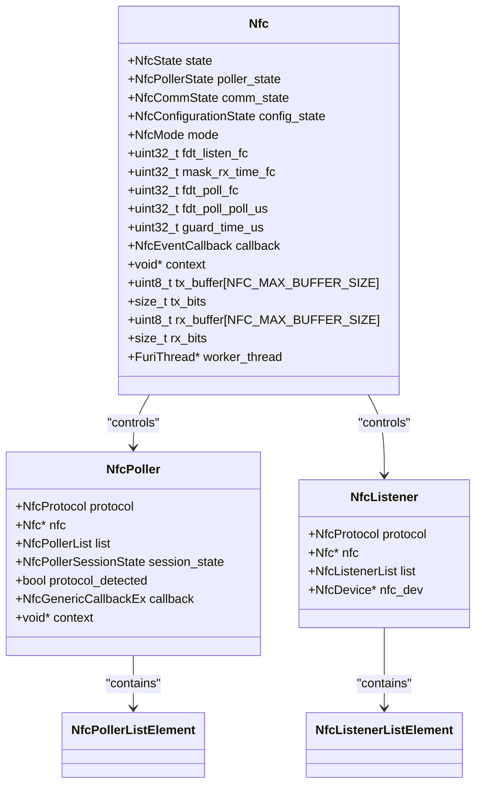
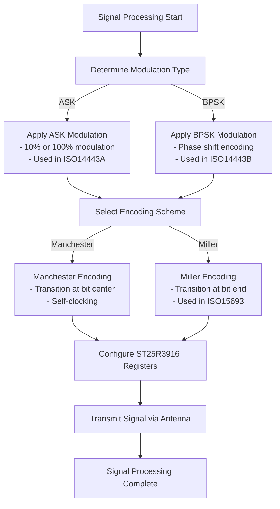
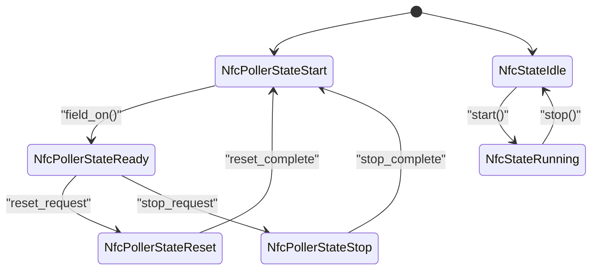
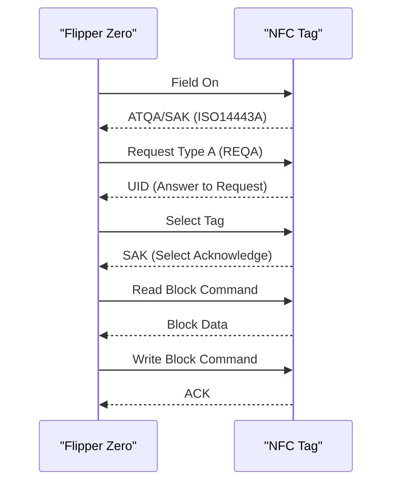
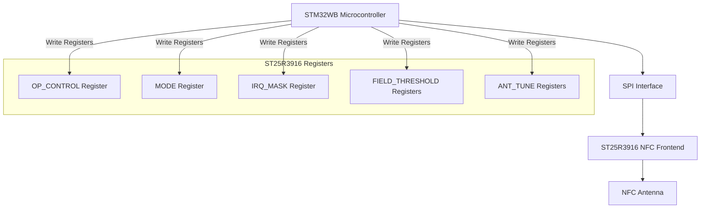

# NFC Technology

<cite>
**Referenced Files in This Document**   
- [nfc.c](file://lib/nfc/nfc.c)
- [nfc_poller.c](file://lib/nfc/nfc_poller.c)
- [nfc_listener.c](file://lib/nfc/nfc_listener.c)
- [furi_hal_nfc.c](file://targets/f7/furi_hal/furi_hal_nfc.c)
- [st25r3916.c](file://lib/drivers/st25r3916.c)
- [mf_classic_poller.c](file://lib/nfc/protocols/mf_classic/mf_classic_poller.c)
</cite>

## Table of Contents
1. [NFC Protocol Stack Implementation](#nfc-protocol-stack-implementation)
2. [Signal Modulation and Data Encoding](#signal-modulation-and-data-encoding)
3. [NFC Poller and Listener States](#nfc-poller-and-listener-states)
4. [Tag Reading, Writing, and Emulation Modes](#tag-reading-writing-and-emulation-modes)
5. [Security Features and Crypto1 Authentication](#security-features-and-crypto1-authentication)
6. [Hardware Interface and ST25R3916 Configuration](#hardware-interface-and-st25r3916-configuration)
7. [Troubleshooting and Optimization](#troubleshooting-and-optimization)

## NFC Protocol Stack Implementation

The NFC protocol stack implementation in the Flipper Zero firmware supports multiple standards including ISO14443A/B, ISO15693, and proprietary protocols like Mifare Classic. The protocol stack is organized in a hierarchical structure with base components and protocol-specific implementations.

The core NFC functionality is managed through the `Nfc` structure defined in nfc.c, which maintains the state of the NFC system including poller state, communication state, and configuration state. The protocol stack supports different NFC modes (poller and listener) and technologies (ISO14443a, ISO14443b, ISO15693, Felica).



**Diagram sources**
- [nfc.c](file://lib/nfc/nfc.c#L25-L199)
- [nfc_poller.c](file://lib/nfc/nfc_poller.c#L86-L285)
- [nfc_listener.c](file://lib/nfc/nfc_listener.c#L86-L144)

**Section sources**
- [nfc.c](file://lib/nfc/nfc.c#L25-L199)
- [nfc_poller.c](file://lib/nfc/nfc_poller.c#L86-L285)
- [nfc_listener.c](file://lib/nfc/nfc_listener.c#L86-L144)

## Signal Modulation and Data Encoding

The NFC implementation supports various signal modulation techniques and data encoding schemes required by different NFC standards. The system handles ASK (Amplitude Shift Keying) and BPSK (Binary Phase Shift Keying) modulation for different communication scenarios.

For data encoding, the system implements Miller and Manchester encoding schemes as required by the ISO14443 and ISO15693 standards. The encoding and decoding are handled at the hardware abstraction layer, with the ST25R3916 chip providing hardware support for these encoding schemes.

The signal processing is managed through the FuriHalNfc interface, which abstracts the low-level hardware details. The system uses bit buffers to manage data at the bit level, allowing for precise control over the encoding and modulation process.



**Diagram sources**
- [furi_hal_nfc.c](file://targets/f7/furi_hal/furi_hal_nfc.c#L200-L400)
- [st25r3916.c](file://lib/drivers/st25r3916.c#L0-L84)

**Section sources**
- [furi_hal_nfc.c](file://targets/f7/furi_hal/furi_hal_nfc.c#L200-L400)
- [st25r3916.c](file://lib/drivers/st25r3916.c#L0-L84)

## NFC Poller and Listener States

The NFC system implements a state machine for both poller (reader) and listener (emulator) modes. The poller state management is handled in nfc_poller.c, while the listener state management is implemented in nfc_listener.c.

The poller states include:
- **NfcPollerStateStart**: Initial state before field activation
- **NfcPollerStateReady**: Field is on and ready for communication
- **NfcPollerStateReset**: Resetting the poller state
- **NfcPollerStateStop**: Stopping the poller operation

The listener states include:
- **NfcStateIdle**: Initial idle state
- **NfcStateRunning**: Listener is active and processing events

The state transitions are managed through callback functions that handle events such as field detection, data reception, and transmission completion. The poller uses a linked list structure to manage protocol-specific pollers, allowing for hierarchical protocol detection and handling.



**Diagram sources**
- [nfc.c](file://lib/nfc/nfc.c#L25-L199)
- [nfc_poller.c](file://lib/nfc/nfc_poller.c#L86-L285)

**Section sources**
- [nfc.c](file://lib/nfc/nfc.c#L25-L199)
- [nfc_poller.c](file://lib/nfc/nfc_poller.c#L86-L285)

## Tag Reading, Writing, and Emulation Modes

The NFC system supports three primary modes of operation: tag reading, writing, and emulation. These modes are implemented through the NfcPoller and NfcListener interfaces.

### Tag Reading Mode
In tag reading mode, the device acts as a reader to detect and read data from NFC tags. The reading process involves:
1. Detecting the presence of an NFC field
2. Identifying the tag type (ISO14443A/B, ISO15693, etc.)
3. Reading the tag data block by block

The reading functionality is implemented in the protocol-specific poller modules, such as iso14443_3a_poller.c and iso15693_3_poller.c.

### Tag Writing Mode
In tag writing mode, the device writes data to NFC tags. The writing process includes:
1. Authenticating with the tag (if required)
2. Writing data to specific blocks
3. Verifying the written data

The writing functionality is protocol-specific and handles the necessary authentication and data formatting.

### Tag Emulation Mode
In tag emulation mode, the device acts as an NFC tag, responding to reader commands. The emulation is implemented through the NfcListener interface, which processes incoming commands and generates appropriate responses.



**Diagram sources**
- [nfc.c](file://lib/nfc/nfc.c#L200-L400)
- [nfc_poller.c](file://lib/nfc/nfc_poller.c#L86-L285)

**Section sources**
- [nfc.c](file://lib/nfc/nfc.c#L200-L400)
- [nfc_poller.c](file://lib/nfc/nfc_poller.c#L86-L285)

## Security Features and Crypto1 Authentication

The NFC implementation includes robust security features, particularly for Mifare Classic cards which use the Crypto1 authentication algorithm. The security system is implemented in the mf_classic_poller.c file and related modules.

### Crypto1 Authentication
The Crypto1 authentication is implemented through the crypto1_alloc() function which creates a Crypto1 state machine. The authentication process involves:
1. Reading the tag's Nonce (NT)
2. Generating a response Nonce (NR)
3. Calculating the authentication key stream
4. Verifying the tag's response

The system handles both Type A and Type B authentication procedures as defined in the ISO/IEC 14443 standard.

### Key Recovery Algorithms
The implementation includes advanced key recovery algorithms for Mifare Classic cards, including:
- **Nested Authentication Attack**: Exploits the nested authentication vulnerability
- **Hardnested Attack**: A more efficient version of the nested attack
- **Darkside Attack**: Recovers keys by analyzing authentication attempts

The key recovery process is managed through the MfClassicPollerDictAttackContext structure, which tracks the progress of dictionary attacks and stores recovered keys.

```c
// Example of Mifare Classic authentication from mf_classic_poller.c
MfClassicPoller* mf_classic_poller_alloc(Iso14443_3aPoller* iso14443_3a_poller) {
    furi_assert(iso14443_3a_poller);

    MfClassicPoller* instance = malloc(sizeof(MfClassicPoller));
    instance->iso14443_3a_poller = iso14443_3a_poller;
    instance->data = mf_classic_alloc();
    instance->crypto = crypto1_alloc(); // Crypto1 authentication initialization
    instance->tx_plain_buffer = bit_buffer_alloc(MF_CLASSIC_MAX_BUFF_SIZE);
    instance->tx_encrypted_buffer = bit_buffer_alloc(MF_CLASSIC_MAX_BUFF_SIZE);
    instance->rx_plain_buffer = bit_buffer_alloc(MF_CLASSIC_MAX_BUFF_SIZE);
    instance->rx_encrypted_buffer = bit_buffer_alloc(MF_CLASSIC_MAX_BUFF_SIZE);
    // ... additional initialization
    return instance;
}
```

**Section sources**
- [mf_classic_poller.c](file://lib/nfc/protocols/mf_classic/mf_classic_poller.c#L0-L200)

## Hardware Interface and ST25R3916 Configuration

The NFC hardware interface is implemented through the ST25R3916 chip, which is a highly integrated NFC frontend. The hardware abstraction layer is provided by furi_hal_nfc.c, which manages the communication between the microcontroller and the ST25R3916 chip.

### ST25R3916 Initialization
The ST25R3916 chip is initialized through a series of register configurations that set up the operating parameters:

```c
// ST25R3916 initialization from furi_hal_nfc.c
FuriHalNfcError furi_hal_nfc_init(void) {
    // Set default state
    st25r3916_direct_cmd(handle, ST25R3916_CMD_SET_DEFAULT);
    // Increase IO driver strength
    st25r3916_write_reg(handle, ST25R3916_REG_IO_CONF2, ST25R3916_REG_IO_CONF2_io_drv_lvl);
    // Check chip ID
    uint8_t chip_id = 0;
    st25r3916_read_reg(handle, ST25R3916_REG_IC_IDENTITY, &chip_id);
    // ... additional initialization
}
```

### Register Configuration
The key register configurations include:
- **OP_CONTROL**: Controls the operating mode (poller/listener)
- **MODE**: Sets the communication mode
- **IRQ_MASK**: Configures interrupt masking
- **FIELD_THRESHOLD_ACTV/DEACTV**: Sets field detection thresholds
- **ANT_TUNE_A/B**: Antenna tuning registers

The system uses SPI communication to interface with the ST25R3916 chip, with all register operations abstracted through the st25r3916.c driver.



**Diagram sources**
- [furi_hal_nfc.c](file://targets/f7/furi_hal/furi_hal_nfc.c#L0-L200)
- [st25r3916.c](file://lib/drivers/st25r3916.c#L0-L84)

**Section sources**
- [furi_hal_nfc.c](file://targets/f7/furi_hal/furi_hal_nfc.c#L0-L200)
- [st25r3916.c](file://lib/drivers/st25r3916.c#L0-L84)

## Troubleshooting and Optimization

### Common NFC Communication Issues
1. **Field Detection Problems**: Ensure proper antenna tuning and check for interference
2. **Authentication Failures**: Verify key correctness and try different authentication methods
3. **Data Corruption**: Check signal integrity and adjust communication parameters
4. **Tag Detection Issues**: Verify tag compatibility and positioning

### Optimization Recommendations
1. **Antenna Tuning**: Adjust ANT_TUNE_A and ANT_TUNE_B registers for optimal performance
2. **Field Thresholds**: Fine-tune FIELD_THRESHOLD_ACTV and FIELD_THRESHOLD_DEACTV for reliable detection
3. **Guard Time**: Optimize guard_time_us parameter to balance power consumption and responsiveness
4. **FDT Settings**: Adjust fdt_poll_fc and fdt_listen_fc for optimal communication timing

The system provides diagnostic capabilities through the FURI_LOG macros, which can be used to monitor NFC events and troubleshoot communication issues.

**Section sources**
- [furi_hal_nfc.c](file://targets/f7/furi_hal/furi_hal_nfc.c#L200-L621)
- [nfc.c](file://lib/nfc/nfc.c#L200-L664)