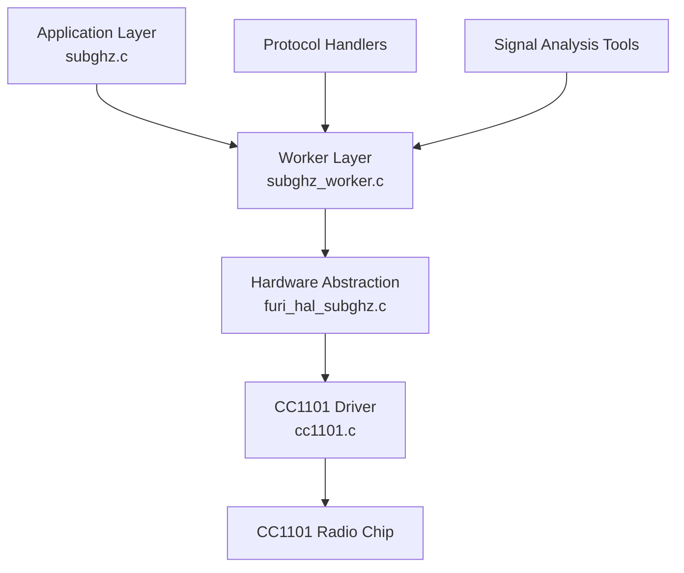
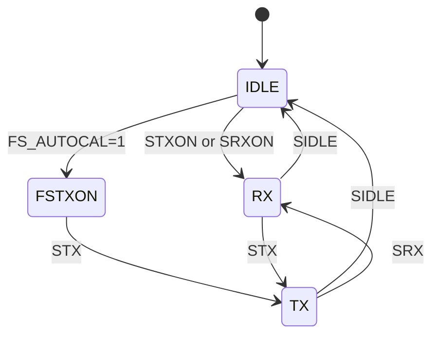
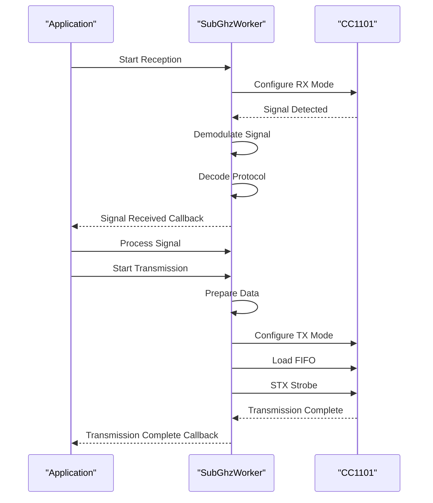

# Sub-GHz Technology

<cite>
**Referenced Files in This Document**   
- [subghz.c](file://applications/main/subghz/subghz.c)
- [subghz.h](file://applications/main/subghz/subghz.h)
- [subghz_worker.c](file://lib/subghz/subghz_worker.c)
- [subghz_worker.h](file://lib/subghz/subghz_worker.h)
- [furi_hal_subghz.c](file://targets/f7/furi_hal/furi_hal_subghz.c)
- [furi_hal_subghz.h](file://targets/f7/furi_hal/furi_hal_subghz.h)
- [cc1101.c](file://lib/drivers/cc1101.c)
- [cc1101.h](file://lib/drivers/cc1101.h)
- [cc1101_regs.h](file://lib/drivers/cc1101_regs.h)
- [cc1101_ext.c](file://applications/drivers/subghz/cc1101_ext/cc1101_ext.c)
- [cc1101_ext.h](file://applications/drivers/subghz/cc1101_ext/cc1101_ext.h)
- [cc1101_configs.c](file://lib/subghz/devices/cc1101_configs.c)
- [cc1101_configs.h](file://lib/subghz/devices/cc1101_configs.h)
- [subghz_test_app.c](file://applications/debug/subghz_test/subghz_test_app.c)
</cite>

## Table of Contents
1. [Introduction](#introduction)
2. [Sub-GHz Radio System Overview](#sub-ghz-radio-system-overview)
3. [Frequency Bands and Modulation Schemes](#frequency-bands-and-modulation-schemes)
4. [CC1101 Radio Chip Implementation](#cc1101-radio-chip-implementation)
5. [Signal Transmission and Reception](#signal-transmission-and-reception)
6. [Protocol Implementations](#protocol-implementations)
7. [Signal Analysis Features](#signal-analysis-features)
8. [Hardware Abstraction Layer](#hardware-abstraction-layer)
9. [Regulatory Compliance and Optimization](#regulatory-compliance-and-optimization)

## Introduction
The Sub-GHz technology in the Flipper Zero firmware enables wireless communication in the sub-gigahertz frequency range, primarily used for remote control systems, garage door openers, and various IoT devices. This document provides a comprehensive analysis of the implementation, covering the radio system architecture, protocol handling, signal processing, and hardware integration. The system is built around the Texas Instruments CC1101 transceiver chip, which provides flexible configuration for various modulation schemes and frequency bands.

**Section sources**
- [subghz.c](file://applications/main/subghz/subghz.c#L1-L50)
- [subghz.h](file://applications/main/subghz/subghz.h#L1-L30)

## Sub-GHz Radio System Overview
The Sub-GHz system in Flipper Zero is designed to transmit and receive radio signals in the sub-gigahertz spectrum. The system architecture consists of several key components: the CC1101 radio transceiver, a hardware abstraction layer (HAL), a worker thread for signal processing, and protocol handlers for various remote control standards. The system supports multiple frequency bands including 315MHz, 433MHz, 868MHz, and 915MHz, with modulation schemes such as ASK (Amplitude Shift Keying) and FSK (Frequency Shift Keying).

The architecture follows a layered approach where higher-level applications interact with the subghz_worker module, which manages the radio hardware through the furi_hal_subghz interface. This design provides abstraction between the application logic and the low-level radio operations, allowing for flexible protocol implementation and signal processing.



**Diagram sources**
- [subghz.c](file://applications/main/subghz/subghz.c#L25-L100)
- [subghz_worker.c](file://lib/subghz/subghz_worker.c#L15-L50)
- [furi_hal_subghz.c](file://targets/f7/furi_hal/furi_hal_subghz.c#L10-L40)

**Section sources**
- [subghz.c](file://applications/main/subghz/subghz.c#L25-L100)
- [subghz_worker.c](file://lib/subghz/subghz_worker.c#L15-L80)

## Frequency Bands and Modulation Schemes
The Sub-GHz system supports four primary frequency bands: 315MHz, 433MHz, 868MHz, and 915MHz. These bands are commonly used in various regions for different applications. The 315MHz and 433MHz bands are popular in Asia and North America for consumer remote controls, while 868MHz is used in Europe and 915MHz in North America for industrial and scientific applications.

The system implements two main modulation schemes: ASK and FSK. ASK modulation varies the amplitude of the carrier wave to represent binary data, where a high amplitude typically represents a '1' and a low amplitude represents a '0'. FSK modulation changes the frequency of the carrier wave between two distinct frequencies to represent binary states.

The configuration for these bands and modulation schemes is defined in the cc1101_configs.c file, which contains preset configurations for different operating modes. Each configuration includes parameters such as carrier frequency, data rate, modulation format, and channel bandwidth.

```c
// Example configuration for 433MHz ASK modulation
const CC1101Preset CC1101_PRESET_433MHZ_ASK = {
    .registers = {
        {CC1101_REG_IOCFG2, 0x2E}, // GDO2 output configuration
        {CC1101_REG_IOCFG1, 0x2E}, // GDO1 output configuration
        {CC1101_REG_IOCFG0, 0x0E}, // GDO0 output configuration
        {CC1101_REG_FIFOTHR, 0x07}, // FIFO threshold
        {CC1101_REG_SYNC1, 0x2D},  // Sync word high byte
        {CC1101_REG_SYNC0, 0xD4},  // Sync word low byte
        {CC1101_REG_PKTLEN, 0xFF},  // Packet length
        {CC1101_REG_PKTCTRL1, 0x04}, // Packet control
        {CC1101_REG_PKTCTRL0, 0x05}, // Packet control
        {CC1101_REG_ADDR, 0x00},    // Device address
        {CC1101_REG_CHANNR, 0x00},  // Channel number
        {CC1101_REG_FSCTRL1, 0x08}, // Frequency synthesizer control
        {CC1101_REG_FSCTRL0, 0x00}, // Frequency synthesizer control
        {CC1101_REG_FREQ2, 0x10},   // Frequency control word, high byte
        {CC1101_REG_FREQ1, 0xB0},   // Frequency control word, middle byte
        {CC1101_REG_FREQ0, 0x78},   // Frequency control word, low byte
        {CC1101_REG_MDMCFG4, 0x7B}, // Modem configuration
        {CC1101_REG_MDMCFG3, 0x83}, // Modem configuration
        {CC1101_REG_MDMCFG2, 0x13}, // Modem configuration (modulation format)
        {CC1101_REG_MDMCFG1, 0x22}, // Modem configuration
        {CC1101_REG_MDMCFG0, 0xF8}, // Modem configuration
        {CC1101_REG_DEVIATN, 0x00}, // Modem deviation setting
        {CC1101_REG_MCSM2, 0x07},   // Main Radio Control State Machine configuration
        {CC1101_REG_MCSM1, 0x30},   // Main Radio Control State Machine configuration
        {CC1101_REG_MCSM0, 0x18},   // Main Radio Control State Machine configuration
        {CC1101_REG_FOCCFG, 0x16},  // Frequency Offset Compensation configuration
        {CC1101_REG_BSCFG, 0x6C},   // Bit Synchronization configuration
        {CC1101_REG_AGCCTRL2, 0x43}, // AGC control
        {CC1101_REG_AGCCTRL1, 0x40}, // AGC control
        {CC1101_REG_AGCCTRL0, 0x91}, // AGC control
        {CC1101_REG_WOREVT1, 0x87}, // High byte Event0 timeout
        {CC1101_REG_WOREVT0, 0x6B}, // Low byte Event0 timeout
        {CC1101_REG_WORCTRL, 0xFB}, // Wake On Radio control
        {CC1101_REG_FREND1, 0x56},  // Front end RX configuration
        {CC1101_REG_FREND0, 0x10},  // Front end TX configuration
        {CC1101_REG_FSCAL3, 0xE9},  // Frequency synthesizer calibration
        {CC1101_REG_FSCAL2, 0x2A},  // Frequency synthesizer calibration
        {CC1101_REG_FSCAL1, 0x00},  // Frequency synthesizer calibration
        {CC1101_REG_FSCAL0, 0x1F},  // Frequency synthesizer calibration
        {CC1101_REG_TEST2, 0x88},   // Various test settings
        {CC1101_REG_TEST1, 0x31},   // Various test settings
        {CC1101_REG_TEST0, 0x0B},   // Various test settings
    },
    .pa_table = {0x03, 0x17, 0x1D, 0x26, 0x50, 0x86, 0xCD, 0xC2},
    .pa_table_size = 8,
};
```

**Section sources**
- [cc1101_configs.c](file://lib/subghz/devices/cc1101_configs.c#L100-L250)
- [cc1101_regs.h](file://lib/drivers/cc1101_regs.h#L50-L200)

## CC1101 Radio Chip Implementation
The CC1101 radio chip is controlled through the SPI (Serial Peripheral Interface) interface, which allows for high-speed communication between the microcontroller and the transceiver. The implementation is divided into two main components: the low-level driver (cc1101.c) and the extension interface (cc1101_ext.c) that provides additional functionality.

The cc1101.c file contains the core functions for SPI communication, register access, and basic radio operations. Key functions include:

- `cc1101_reset()`: Resets the CC1101 chip to its default state
- `cc1101_write_register()`: Writes a value to a specific register
- `cc1101_read_register()`: Reads a value from a specific register
- `cc1101_strobe()`: Sends a command strobe to the radio
- `cc1101_write_fifo()`: Writes data to the transmission FIFO
- `cc1101_read_fifo()`: Reads data from the reception FIFO

The CC1101 chip has numerous registers that control its operation, defined in cc1101_regs.h. These registers configure everything from frequency synthesis and modulation parameters to packet handling and power management. The chip operates in different states controlled by a state machine, with states including IDLE, RX (receive), TX (transmit), and FSTXON (frequency synthesizer ready for transmission).



The SPI interface uses four wires: MOSI (Master Out Slave In), MISO (Master In Slave Out), SCLK (Serial Clock), and CSN (Chip Select). The communication protocol involves sending a command byte followed by data bytes. For register writes, the command byte contains the write bit, register address, and burst mode flag.

**Diagram sources**
- [cc1101.c](file://lib/drivers/cc1101.c#L150-L200)
- [cc1101_regs.h](file://lib/drivers/cc1101_regs.h#L20-L50)

**Section sources**
- [cc1101.c](file://lib/drivers/cc1101.c#L1-L300)
- [cc1101.h](file://lib/drivers/cc1101.h#L1-L100)
- [cc1101_ext.c](file://applications/drivers/subghz/cc1101_ext/cc1101_ext.c#L1-L200)

## Signal Transmission and Reception
The subghz_worker module handles signal transmission and reception through a dedicated worker thread. This design ensures that radio operations do not block the main application thread, allowing for responsive user interaction while performing radio operations.

The worker thread operates in different modes depending on the current task: idle, receive, transmit, or frequency analysis. The state transitions are managed through a finite state machine implemented in subghz_worker.c. When in receive mode, the worker continuously monitors the radio for incoming signals, processing them through the configured demodulator and passing decoded data to the application layer.

For transmission, the worker configures the CC1101 chip with the appropriate settings, loads the data into the FIFO buffer, and initiates the transmission sequence. The process is controlled by events that coordinate between the application and worker threads.

```c
// Example of transmission sequence in subghz_worker.c
static bool subghz_worker_tx_start(SubGhzWorker* worker) {
    furi_assert(worker);
    
    // Configure radio for transmission
    cc1101_reset();
    cc1101_write_registers(worker->tx_config->registers, worker->tx_config->register_count);
    cc1101_write_pa_table(worker->tx_config->pa_table, worker->tx_config->pa_table_size);
    
    // Set frequency
    cc1101_set_frequency(worker->frequency);
    
    // Configure modulation
    cc1101_configure_modulation(worker->modulation);
    
    // Load data into FIFO
    cc1101_write_fifo(worker->tx_data, worker->tx_data_size);
    
    // Start transmission
    cc1101_strobe(CC1101_STROBE_STX);
    
    return true;
}
```

The worker also implements a callback mechanism that notifies the application when a signal is received or when transmission is complete. This allows for asynchronous operation and efficient resource utilization.



**Diagram sources**
- [subghz_worker.c](file://lib/subghz/subghz_worker.c#L200-L500)
- [subghz_worker.h](file://lib/subghz/subghz_worker.h#L50-L100)

**Section sources**
- [subghz_worker.c](file://lib/subghz/subghz_worker.c#L1-L600)
- [subghz_worker.h](file://lib/subghz/subghz_worker.h#L1-L150)

## Protocol Implementations
The Sub-GHz system implements several common remote control protocols, including KeeLoq, Princeton, and StarLine. These protocols are handled by dedicated decoder/encoder modules that process the raw signal data and extract meaningful information such as button presses and device codes.

The KeeLoq protocol is a rolling code system used in many garage door openers and car security systems. It uses a 64-bit encryption algorithm to generate unique codes for each transmission, preventing replay attacks. The implementation in the firmware includes both the encoding and decoding algorithms, allowing the Flipper Zero to learn and replicate KeeLoq signals.

The Princeton protocol is a simpler fixed-code system commonly used in basic remote controls. It transmits a fixed binary code that identifies the device, with no rolling code mechanism. The implementation parses the pulse-width modulated signal to extract the device address and command data.

The StarLine protocol is used in automotive security systems and includes both fixed and rolling code variants. The implementation handles the specific timing and encoding requirements of StarLine remotes.

Protocol implementations are registered with the subghz_worker through a protocol registry system, allowing dynamic selection and switching between different protocols. Each protocol module implements a standard interface with functions for checking if a signal matches the protocol, decoding the signal, and encoding signals for transmission.

```c
// Example protocol registration in subghz.c
static const SubGhzProtocolDecoder subghz_protocol_decoder_list[] = {
    {
        .name = "KeeLoq",
        .type = SubGhzProtocolTypeDynamic,
        .decoder = subghz_protocol_decoder_keeloq_alloc,
        .encoder = subghz_protocol_encoder_keeloq_alloc,
        .demod = subghz_protocol_keeloq_demod_alloc,
    },
    {
        .name = "Princeton",
        .type = SubGhzProtocolTypeStatic,
        .decoder = subghz_protocol_decoder_princeton_alloc,
        .encoder = subghz_protocol_encoder_princeton_alloc,
        .demod = subghz_protocol_princeton_demod_alloc,
    },
    {
        .name = "StarLine",
        .type = SubGhzProtocolTypeDynamic,
        .decoder = subghz_protocol_decoder_starline_alloc,
        .encoder = subghz_protocol_encoder_starline_alloc,
        .demod = subghz_protocol_starline_demod_alloc,
    },
};
```

**Section sources**
- [subghz.c](file://applications/main/subghz/subghz.c#L150-L300)
- [subghz_worker.c](file://lib/subghz/subghz_worker.c#L100-L150)

## Signal Analysis Features
The Sub-GHz system includes several signal analysis features that allow users to explore and understand radio signals in their environment. These features include frequency scanning, signal recording, and demodulation analysis.

Frequency scanning allows the user to sweep through a range of frequencies to detect active signals. The system implements this by configuring the CC1101 chip to listen on different frequencies and measuring the signal strength (RSSI - Received Signal Strength Indicator). When a signal is detected above a threshold, the system can automatically switch to demodulation mode to analyze the signal characteristics.

Signal recording captures raw signal data for later analysis or replay. The recorded data includes both the demodulated digital signal and, in some cases, the raw analog waveform. This allows for detailed analysis of signal timing, modulation quality, and protocol structure.

Demodulation analysis provides real-time feedback on signal characteristics such as data rate, modulation type, and packet structure. The system can automatically detect common modulation schemes and suggest appropriate protocol decoders.

The frequency analyzer worker implements a continuous scanning mode that can be used to map the RF environment:

```c
// Example frequency scanning implementation
static void subghz_frequency_analyzer_worker_callback(void* context) {
    SubGhzFrequencyAnalyzerWorker* worker = context;
    
    // Read RSSI from CC1101
    int8_t rssi = cc1101_read_rssi();
    
    // Check if signal detected
    if(rssi > worker->threshold) {
        // Signal detected, notify application
        worker->callback(rssi, worker->frequency, worker->context);
        
        // Optionally switch to demodulation mode
        if(worker->auto_demodulate) {
            subghz_worker_start_rx(worker->subghz_worker, worker->frequency);
        }
    }
    
    // Increment frequency for next scan
    worker->frequency += worker->step;
    if(worker->frequency > worker->max_frequency) {
        worker->frequency = worker->min_frequency;
    }
    
    // Set new frequency
    cc1101_set_frequency(worker->frequency);
}
```

**Section sources**
- [subghz_worker.c](file://lib/subghz/subghz_worker.c#L300-L400)
- [furi_hal_subghz.c](file://targets/f7/furi_hal/furi_hal_subghz.c#L200-L250)

## Hardware Abstraction Layer
The hardware abstraction layer (HAL) for Sub-GHz functionality is implemented in furi_hal_subghz.c and provides a unified interface between the higher-level software and the CC1101 radio hardware. This layer encapsulates the low-level details of radio control, making it easier to maintain and potentially port to different radio hardware in the future.

The HAL interface includes functions for:

- Initializing and deinitializing the radio hardware
- Setting the operating frequency
- Configuring modulation parameters
- Controlling transmission and reception modes
- Reading signal strength (RSSI)
- Managing power states

The implementation handles critical timing requirements and ensures that radio operations comply with regulatory requirements. For example, the transmit function includes checks to prevent transmission on unauthorized frequencies or for excessive durations.

```c
// Example HAL functions from furi_hal_subghz.h
bool furi_hal_subghz_init();
bool furi_hal_subghz_deinit();
bool furi_hal_subghz_load_custom_preset(const uint8_t* preset_data, size_t preset_size);
bool furi_hal_subghz_set_frequency(uint32_t frequency);
uint32_t furi_hal_subghz_get_frequency();
bool furi_hal_subghz_start_tx();
bool furi_hal_subghz_start_rx();
bool furi_hal_subghz_stop();
int8_t furi_hal_subghz_get_rssi();
bool furi_hal_subghz_is_frequency_valid(uint32_t frequency);
```

Antenna configuration is also managed through the HAL, with support for both internal and external antenna options. The system automatically selects the appropriate antenna based on the configured frequency and power settings, optimizing signal transmission and reception.

**Section sources**
- [furi_hal_subghz.c](file://targets/f7/furi_hal/furi_hal_subghz.c#L1-L400)
- [furi_hal_subghz.h](file://targets/f7/furi_hal/furi_hal_subghz.h#L1-L150)

## Regulatory Compliance and Optimization
The Sub-GHz implementation includes several features to ensure regulatory compliance and optimize signal performance. Regulatory compliance is critical as different countries have specific rules about frequency usage, transmission power, and duty cycle.

The system implements frequency validation to prevent operation on unauthorized frequencies. When a user attempts to set a frequency, the HAL checks against a list of approved frequencies for the current region:

```c
bool furi_hal_subghz_is_frequency_valid(uint32_t frequency) {
    // Check against approved frequency bands
    if((frequency >= 300000000 && frequency <= 340000000) || // 300-340MHz
       (frequency >= 380000000 && frequency <= 410000000) || // 380-410MHz
       (frequency >= 420000000 && frequency <= 450000000) || // 420-450MHz
       (frequency >= 779000000 && frequency <= 787000000) || // 779-787MHz
       (frequency >= 863000000 && frequency <= 870000000) || // 863-870MHz
       (frequency >= 902000000 && frequency <= 928000000)) { // 902-928MHz
        return true;
    }
    return false;
}
```

Signal range optimization is achieved through several techniques:

1. **Adaptive Power Control**: The system adjusts transmission power based on distance and environmental conditions to maximize battery life while maintaining reliable communication.

2. **Frequency Selection**: The system can automatically select the optimal frequency band based on local interference levels, choosing less congested channels for better reliability.

3. **Duty Cycle Management**: To comply with regulations and prevent interference, the system limits the transmission duty cycle, ensuring that transmissions are brief and spaced appropriately.

4. **Interference Mitigation**: The frequency scanning feature helps identify congested channels, allowing users to avoid frequencies with high background noise.

Best practices for optimal performance include:
- Ensuring clear line of sight between transmitter and receiver
- Avoiding metal objects near the antenna
- Using external antennas for longer range applications
- Regularly calibrating the radio hardware
- Updating to the latest firmware for improved signal processing algorithms

**Section sources**
- [furi_hal_subghz.c](file://targets/f7/furi_hal/furi_hal_subghz.c#L300-L400)
- [subghz.c](file://applications/main/subghz/subghz.c#L400-L500)