# Wireless Protocols

<cite>
**Referenced Files in This Document**   
- [nfc_app.c](file://applications/main/nfc/nfc_app.c)
- [nfc_app.h](file://applications/main/nfc/nfc_app.h)
- [lfrfid.c](file://applications/main/lfrfid/lfrfid.c)
- [lfrfid.h](file://applications/main/lfrfid/lfrfid_i.h)
- [subghz.c](file://applications/main/subghz/subghz.c)
- [subghz.h](file://applications/main/subghz/subghz_i.h)
- [infrared_test.c](file://applications/debug/infrared_test.c)
- [lfrfid_worker.c](file://lib/lfrfid/lfrfid_worker.c)
- [nfc.c](file://lib/nfc/nfc.c)
- [subghz_worker.c](file://lib/subghz/subghz_worker.c)
- [st25r3916.c](file://lib/drivers/st25r3916.c)
- [cc1101.c](file://lib/drivers/cc1101.c)
- [furi_hal_nfc.h](file://targets/furi_hal_include/furi_hal_nfc.h)
- [furi_hal_infrared.h](file://targets/furi_hal_include/furi_hal_infrared.h)
</cite>

## Table of Contents
1. [Introduction](#introduction)
2. [Project Structure](#project-structure)
3. [Core Components](#core-components)
4. [Architecture Overview](#architecture-overview)
5. [Detailed Component Analysis](#detailed-component-analysis)
6. [Signal Processing Pipelines](#signal-processing-pipelines)
7. [Modulation and Demodulation Techniques](#modulation-and-demodulation-techniques)
8. [Protocol Decoding and Encoding](#protocol-decoding-and-encoding)
9. [Hardware Abstraction Layer Integration](#hardware-abstraction-layer-integration)
10. [Application Framework Integration](#application-framework-integration)
11. [Practical Examples](#practical-examples)
12. [Regulatory Considerations](#regulatory-considerations)
13. [Conclusion](#conclusion)

## Introduction
This document provides a comprehensive analysis of the wireless communication protocols implemented in the Flipper Zero firmware. The focus is on four primary wireless technologies: NFC (Near Field Communication), LF RFID (Low Frequency Radio-Frequency Identification), Sub-GHz, and Infrared. Each protocol is examined in terms of its architecture, signal processing pipeline, modulation techniques, and integration with the hardware abstraction layer and application framework. The analysis is based on the actual source code from the repository and aims to provide both technical depth and accessibility for users with varying levels of expertise.

**Section sources**
- [nfc_app.c](file://applications/main/nfc/nfc_app.c#L1-L50)
- [lfrfid.c](file://applications/main/lfrfid/lfrfid.c#L1-L50)
- [subghz.c](file://applications/main/subghz/subghz.c#L1-L50)

## Project Structure
The project structure is organized into several key directories that reflect the modular design of the firmware. The main applications are located in the `applications/main` directory, with separate subdirectories for each wireless protocol: `nfc`, `lfrfid`, `subghz`, and `u2f`. The core libraries for these protocols are found in the `lib` directory, with dedicated folders for `nfc`, `lfrfid`, `subghz`, and `infrared`. Hardware drivers are located in `lib/drivers`, including the `st25r3916.c` driver for NFC and the `cc1101.c` driver for Sub-GHz communication. The `targets/furi_hal_include` directory contains hardware abstraction layer headers that define the interface between the protocol implementations and the physical hardware.

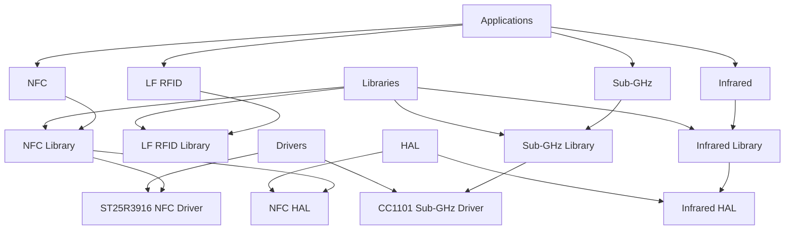

**Diagram sources**
- [nfc_app.c](file://applications/main/nfc/nfc_app.c#L1-L20)
- [lfrfid.c](file://applications/main/lfrfid/lfrfid.c#L1-L20)
- [subghz.c](file://applications/main/subghz/subghz.c#L1-L20)
- [st25r3916.c](file://lib/drivers/st25r3916.c#L1-L20)
- [cc1101.c](file://lib/drivers/cc1101.c#L1-L20)
- [furi_hal_nfc.h](file://targets/furi_hal_include/furi_hal_nfc.h#L1-L20)
- [furi_hal_infrared.h](file://targets/furi_hal_include/furi_hal_infrared.h#L1-L20)

**Section sources**
- [nfc_app.c](file://applications/main/nfc/nfc_app.c#L1-L100)
- [lfrfid.c](file://applications/main/lfrfid/lfrfid.c#L1-L100)
- [subghz.c](file://applications/main/subghz/subghz.c#L1-L100)
- [st25r3916.c](file://lib/drivers/st25r3916.c#L1-L100)
- [cc1101.c](file://lib/drivers/cc1101.c#L1-L100)

## Core Components
The core components of the wireless protocols implementation include the application layer, protocol library, and hardware driver. For NFC, the main application file `nfc_app.c` orchestrates the user interface and application logic, while the `nfc.c` library handles the protocol-specific operations. The `st25r3916.c` driver provides low-level access to the NFC hardware. Similarly, for LF RFID, `lfrfid.c` serves as the application entry point, with `lfrfid_worker.c` managing the protocol operations. The Sub-GHz implementation follows the same pattern with `subghz.c` and `subghz_worker.c`. The Infrared protocol is simpler, with test functionality provided in `infrared_test.c`.

**Section sources**
- [nfc_app.c](file://applications/main/nfc/nfc_app.c#L50-L150)
- [lfrfid.c](file://applications/main/lfrfid/lfrfid.c#L50-L150)
- [subghz.c](file://applications/main/subghz/subghz.c#L50-L150)
- [infrared_test.c](file://applications/debug/infrared_test.c#L1-L50)

## Architecture Overview
The architecture of the wireless protocols follows a layered approach with clear separation of concerns. At the top is the application layer, which provides the user interface and application logic. Below this is the protocol library layer, which implements the specific communication protocols. The lowest layer is the hardware driver, which interfaces directly with the physical hardware. This layered architecture allows for modularity and reusability, with the protocol libraries being independent of the specific application use case.

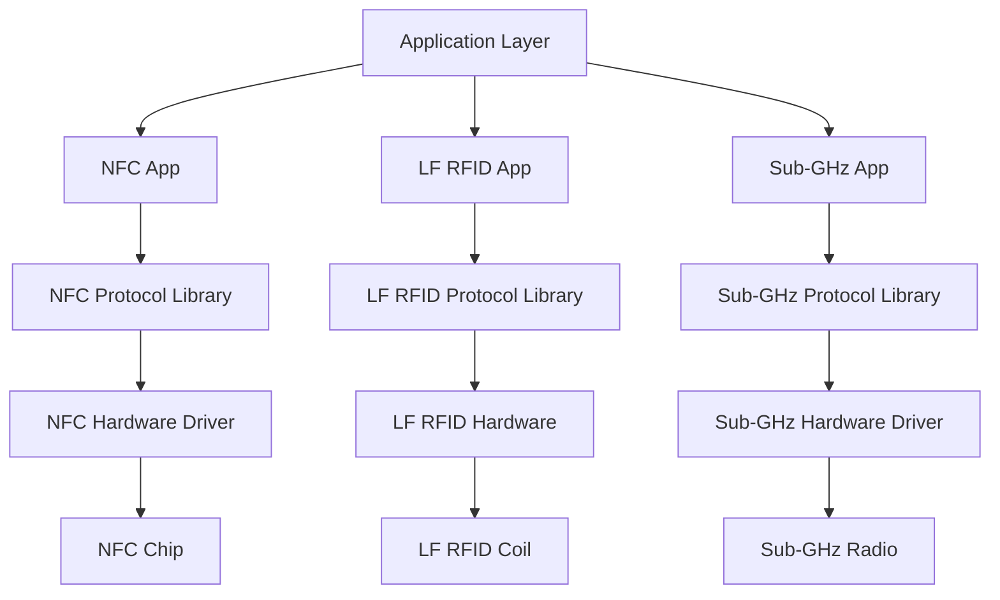

**Diagram sources**
- [nfc_app.c](file://applications/main/nfc/nfc_app.c#L1-L20)
- [lfrfid.c](file://applications/main/lfrfid/lfrfid.c#L1-L20)
- [subghz.c](file://applications/main/subghz/subghz.c#L1-L20)
- [nfc.c](file://lib/nfc/nfc.c#L1-L20)
- [lfrfid_worker.c](file://lib/lfrfid/lfrfid_worker.c#L1-L20)
- [subghz_worker.c](file://lib/subghz/subghz_worker.c#L1-L20)
- [st25r3916.c](file://lib/drivers/st25r3916.c#L1-L20)
- [cc1101.c](file://lib/drivers/cc1101.c#L1-L20)

## Detailed Component Analysis

### NFC Protocol Analysis
The NFC protocol implementation is centered around the `nfc_app.c` file, which manages the application state and user interface. The `nfc.c` library provides functions for NFC operations such as reading, writing, and emulating tags. The `st25r3916.c` driver handles low-level communication with the NFC chip, including register access and interrupt handling. The protocol supports various NFC standards including ISO14443A/B, Felica, and proprietary formats.

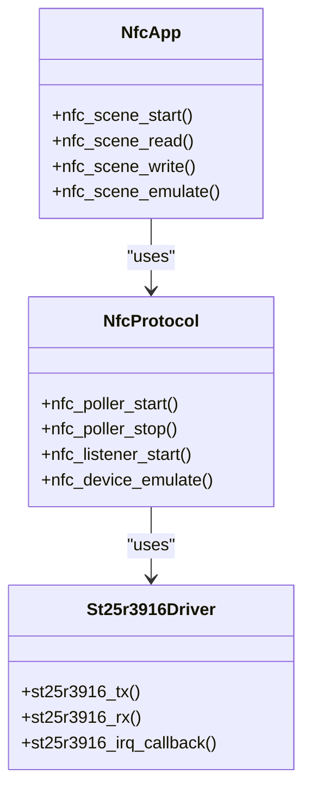

**Diagram sources**
- [nfc_app.c](file://applications/main/nfc/nfc_app.c#L150-L200)
- [nfc.c](file://lib/nfc/nfc.c#L150-L200)
- [st25r3916.c](file://lib/drivers/st25r3916.c#L150-L200)

**Section sources**
- [nfc_app.c](file://applications/main/nfc/nfc_app.c#L100-L300)
- [nfc.c](file://lib/nfc/nfc.c#L100-L300)
- [st25r3916.c](file://lib/drivers/st25r3916.c#L100-L300)

### LF RFID Protocol Analysis
The LF RFID implementation in `lfrfid.c` provides functionality for reading and writing low-frequency RFID tags. The `lfrfid_worker.c` library handles the protocol-specific operations, including support for various tag types such as EM4100, HID, and Indala. The hardware interface is managed through the `furi_hal` functions, which abstract the low-level details of the LF excitation and signal processing.

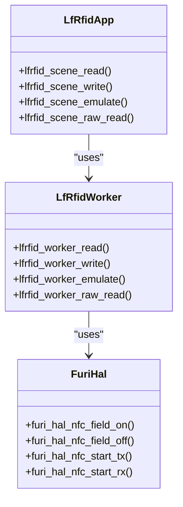

**Diagram sources**
- [lfrfid.c](file://applications/main/lfrfid/lfrfid.c#L150-L200)
- [lfrfid_worker.c](file://lib/lfrfid/lfrfid_worker.c#L150-L200)
- [furi_hal_nfc.h](file://targets/furi_hal_include/furi_hal_nfc.h#L150-L200)

**Section sources**
- [lfrfid.c](file://applications/main/lfrfid/lfrfid.c#L100-L300)
- [lfrfid_worker.c](file://lib/lfrfid/lfrfid_worker.c#L100-L300)
- [furi_hal_nfc.h](file://targets/furi_hal_include/furi_hal_nfc.h#L100-L300)

### Sub-GHz Protocol Analysis
The Sub-GHz implementation in `subghz.c` provides a comprehensive framework for working with sub-gigahertz wireless signals. The `subghz_worker.c` library handles the modulation, demodulation, and protocol decoding/encoding. The `cc1101.c` driver provides low-level access to the CC1101 radio chip, managing frequency setting, transmission, and reception. The system supports various modulation schemes including ASK, FSK, and OOK.

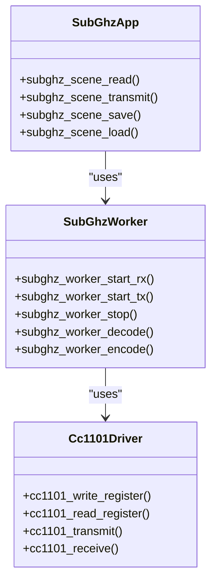

**Diagram sources**
- [subghz.c](file://applications/main/subghz/subghz.c#L150-L200)
- [subghz_worker.c](file://lib/subghz/subghz_worker.c#L150-L200)
- [cc1101.c](file://lib/drivers/cc1101.c#L150-L200)

**Section sources**
- [subghz.c](file://applications/main/subghz/subghz.c#L100-L300)
- [subghz_worker.c](file://lib/subghz/subghz_worker.c#L100-L300)
- [cc1101.c](file://lib/drivers/cc1101.c#L100-L300)

### Infrared Protocol Analysis
The Infrared implementation is relatively simple, with basic functionality provided in the `infrared_test.c` file. The system uses the `furi_hal_infrared` functions to generate and receive infrared signals. The protocol supports common infrared formats such as NEC, Sony, and RC5, with the ability to capture and replay signals.

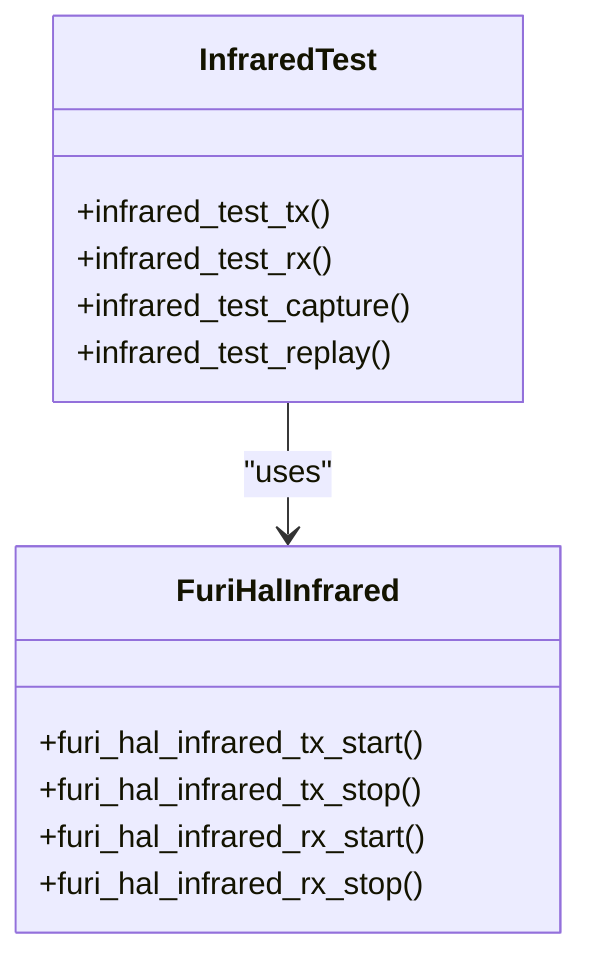

**Diagram sources**
- [infrared_test.c](file://applications/debug/infrared_test.c#L50-L100)
- [furi_hal_infrared.h](file://targets/furi_hal_include/furi_hal_infrared.h#L50-L100)

**Section sources**
- [infrared_test.c](file://applications/debug/infrared_test.c#L1-L150)
- [furi_hal_infrared.h](file://targets/furi_hal_include/furi_hal_infrared.h#L1-L150)

## Signal Processing Pipelines
The signal processing pipelines for each wireless protocol follow a similar pattern of capture, processing, and analysis. For NFC and LF RFID, the pipeline begins with the activation of the electromagnetic field, followed by signal reception and demodulation. The received signal is then processed to extract the digital data, which is passed to the protocol decoder. For Sub-GHz, the pipeline involves RF signal reception, demodulation, and pulse width analysis to reconstruct the original data stream. Infrared signals are processed by measuring the duration of on and off periods to decode the transmitted data.

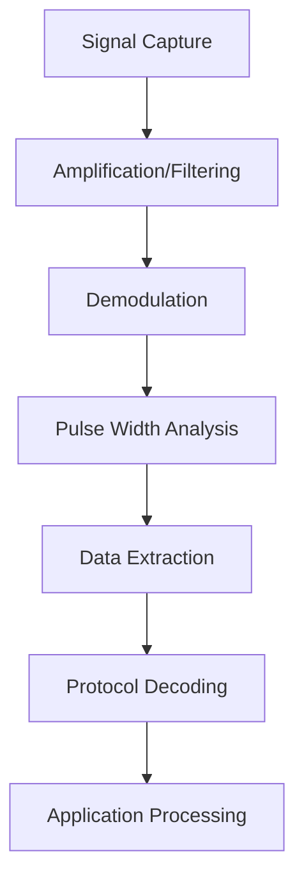

**Diagram sources**
- [nfc.c](file://lib/nfc/nfc.c#L200-L300)
- [lfrfid_worker.c](file://lib/lfrfid/lfrfid_worker.c#L200-L300)
- [subghz_worker.c](file://lib/subghz/subghz_worker.c#L200-L300)
- [furi_hal_infrared.h](file://targets/furi_hal_include/furi_hal_infrared.h#L200-L300)

**Section sources**
- [nfc.c](file://lib/nfc/nfc.c#L200-L400)
- [lfrfid_worker.c](file://lib/lfrfid/lfrfid_worker.c#L200-L400)
- [subghz_worker.c](file://lib/subghz/subghz_worker.c#L200-L400)
- [furi_hal_infrared.h](file://targets/furi_hal_include/furi_hal_infrared.h#L200-L400)

## Modulation and Demodulation Techniques
The wireless protocols employ various modulation techniques suited to their specific frequency bands and applications. NFC uses load modulation for communication between the reader and tag, with the tag modulating the load on the reader's field to transmit data. LF RFID uses amplitude shift keying (ASK) or phase shift keying (PSK) depending on the tag type. Sub-GHz systems use amplitude shift keying (ASK), frequency shift keying (FSK), or on-off keying (OOK) for data transmission. Infrared communication uses pulse width modulation, where the duration of the infrared pulses encodes the data.

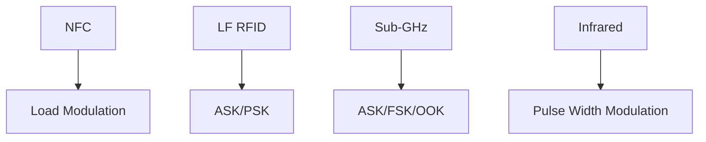

**Diagram sources**
- [nfc.c](file://lib/nfc/nfc.c#L300-L400)
- [lfrfid_worker.c](file://lib/lfrfid/lfrfid_worker.c#L300-L400)
- [subghz_worker.c](file://lib/subghz/subghz_worker.c#L300-L400)
- [furi_hal_infrared.h](file://targets/furi_hal_include/furi_hal_infrared.h#L300-L400)

**Section sources**
- [nfc.c](file://lib/nfc/nfc.c#L300-L500)
- [lfrfid_worker.c](file://lib/lfrfid/lfrfid_worker.c#L300-L500)
- [subghz_worker.c](file://lib/subghz/subghz_worker.c#L300-L500)
- [furi_hal_infrared.h](file://targets/furi_hal_include/furi_hal_infrared.h#L300-L500)

## Protocol Decoding and Encoding
The protocol decoding and encoding mechanisms are implemented in the respective protocol libraries. For NFC, the `nfc.c` library contains functions for decoding various NFC standards and encoding data for transmission. The LF RFID library in `lfrfid_worker.c` includes decoders for multiple tag formats, with the ability to automatically detect the tag type. The Sub-GHz library in `subghz_worker.c` provides a comprehensive set of protocol decoders for common remote control formats. Infrared protocols are decoded by analyzing the timing of the received pulses and matching them to known patterns.

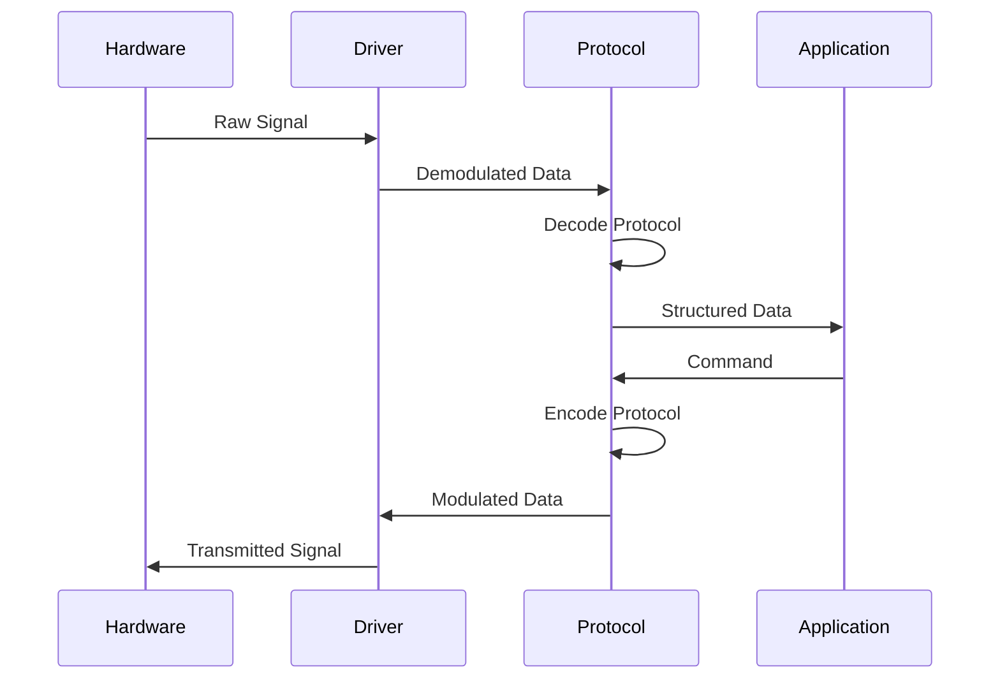

**Diagram sources**
- [nfc.c](file://lib/nfc/nfc.c#L400-L500)
- [lfrfid_worker.c](file://lib/lfrfid/lfrfid_worker.c#L400-L500)
- [subghz_worker.c](file://lib/subghz/subghz_worker.c#L400-L500)
- [furi_hal_infrared.h](file://targets/furi_hal_include/furi_hal_infrared.h#L400-L500)

**Section sources**
- [nfc.c](file://lib/nfc/nfc.c#L400-L600)
- [lfrfid_worker.c](file://lib/lfrfid/lfrfid_worker.c#L400-L600)
- [subghz_worker.c](file://lib/subghz/subghz_worker.c#L400-L600)
- [furi_hal_infrared.h](file://targets/furi_hal_include/furi_hal_infrared.h#L400-L600)

## Hardware Abstraction Layer Integration
The wireless protocols integrate with the hardware abstraction layer (HAL) through well-defined interfaces. The NFC and LF RFID systems use the `furi_hal_nfc` functions for field control and signal transmission/reception. The Sub-GHz system uses the `cc1101` driver for radio control. The Infrared system uses the `furi_hal_infrared` functions for signal generation and reception. This abstraction allows the protocol implementations to be independent of the specific hardware details, facilitating portability and maintainability.

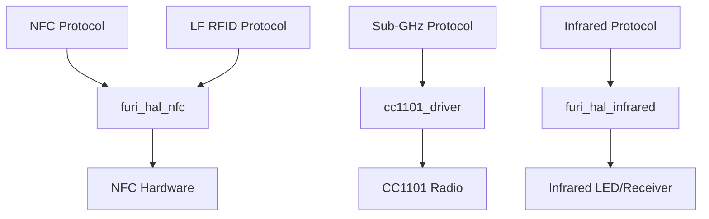

**Diagram sources**
- [nfc.c](file://lib/nfc/nfc.c#L500-L600)
- [lfrfid_worker.c](file://lib/lfrfid/lfrfid_worker.c#L500-L600)
- [subghz_worker.c](file://lib/subghz/subghz_worker.c#L500-L600)
- [furi_hal_nfc.h](file://targets/furi_hal_include/furi_hal_nfc.h#L500-L600)
- [furi_hal_infrared.h](file://targets/furi_hal_include/furi_hal_infrared.h#L500-L600)

**Section sources**
- [nfc.c](file://lib/nfc/nfc.c#L500-L700)
- [lfrfid_worker.c](file://lib/lfrfid/lfrfid_worker.c#L500-L700)
- [subghz_worker.c](file://lib/subghz/subghz_worker.c#L500-L700)
- [furi_hal_nfc.h](file://targets/furi_hal_include/furi_hal_nfc.h#L500-L700)
- [furi_hal_infrared.h](file://targets/furi_hal_include/furi_hal_infrared.h#L500-L700)

## Application Framework Integration
The wireless protocols are integrated into the application framework through a consistent pattern of scenes and views. Each protocol application uses a scene manager to handle the user interface flow, with specific scenes for reading, writing, emulating, and configuring devices. The view system provides the visual elements, while the application logic is contained in the main application file. This consistent architecture makes it easy to navigate between different wireless protocol applications and provides a uniform user experience.

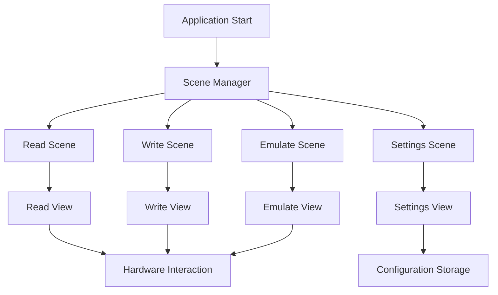

**Diagram sources**
- [nfc_app.c](file://applications/main/nfc/nfc_app.c#L200-L300)
- [lfrfid.c](file://applications/main/lfrfid/lfrfid.c#L200-L300)
- [subghz.c](file://applications/main/subghz/subghz.c#L200-L300)

**Section sources**
- [nfc_app.c](file://applications/main/nfc/nfc_app.c#L200-L400)
- [lfrfid.c](file://applications/main/lfrfid/lfrfid.c#L200-L400)
- [subghz.c](file://applications/main/subghz/subghz.c#L200-L400)

## Practical Examples

### Signal Analysis Example
The spectrum analyzer and signal analysis tools allow users to visualize and analyze wireless signals. For Sub-GHz signals, the system can display the frequency spectrum and time-domain waveform, enabling detailed analysis of signal characteristics. This is particularly useful for identifying unknown protocols or troubleshooting transmission issues.

### Tag Reading/Writing Example
The NFC and LF RFID applications provide straightforward interfaces for reading and writing tags. When a tag is presented to the device, the system automatically detects the tag type and reads its data. Users can then modify the data and write it back to the tag, or save it for later use. This functionality is essential for tasks such as cloning access cards or analyzing tag contents.

### Remote Control Emulation Example
The Sub-GHz and Infrared systems support remote control emulation, allowing the Flipper Zero to act as a universal remote. Users can capture the signal from an existing remote, save it, and then transmit it to control devices. This is particularly useful for replacing lost remotes or creating custom control sequences.

**Section sources**
- [nfc_app.c](file://applications/main/nfc/nfc_app.c#L300-L500)
- [lfrfid.c](file://applications/main/lfrfid/lfrfid.c#L300-L500)
- [subghz.c](file://applications/main/subghz/subghz.c#L300-L500)
- [infrared_test.c](file://applications/debug/infrared_test.c#L150-L300)

## Regulatory Considerations
The implementation of wireless protocols must adhere to various regulatory requirements regarding frequency bands, transmission power, and duty cycle. The Sub-GHz system is particularly affected by these regulations, as different countries have different rules for the use of sub-gigahertz frequencies. The firmware includes frequency band limitations and power control features to ensure compliance with local regulations. Users are responsible for ensuring that their use of the device complies with applicable laws and regulations.

**Section sources**
- [subghz.c](file://applications/main/subghz/subghz.c#L500-L600)
- [subghz_setting.c](file://lib/subghz/subghz_setting.c#L1-L100)

## Conclusion
The wireless protocols implementation in the Flipper Zero firmware demonstrates a well-structured, modular approach to supporting multiple wireless technologies. The layered architecture with clear separation between application, protocol, and hardware layers enables maintainability and extensibility. The consistent design patterns across different protocols provide a uniform user experience while allowing for protocol-specific optimizations. The comprehensive signal processing pipelines, modulation techniques, and protocol decoding/encoding mechanisms enable the device to work with a wide range of wireless devices and systems. The integration with the hardware abstraction layer ensures portability, while the application framework integration provides a cohesive user interface. This analysis provides a foundation for understanding and extending the wireless capabilities of the device.